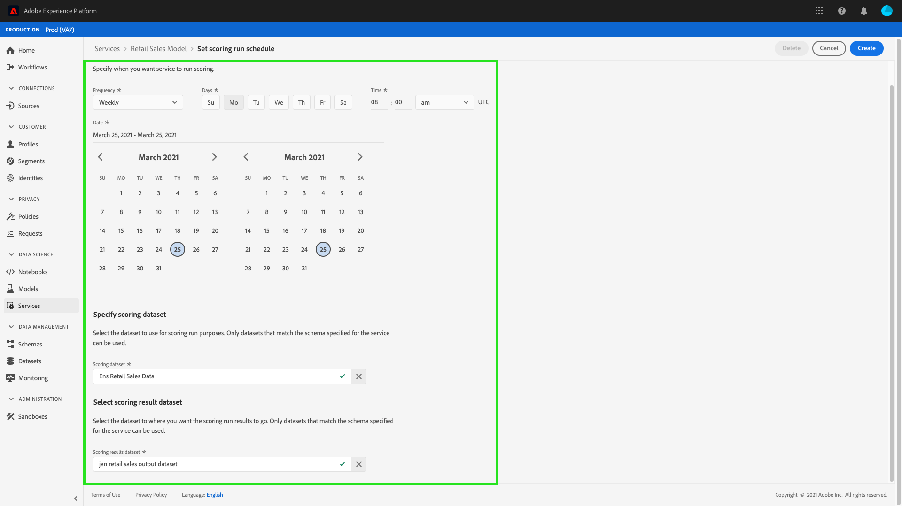

# 在Data Science Workspace UI中计划模型

Adobe Experience Platform [!DNL Data Science Workspace] 允许您在机器学习服务上设置计划评分和培训运行。 自动化培训和评分流程有助于通过跟踪数据中的模式，随时保持和提高服务的效率。

本教程将逐步介绍如何通过 [!UICONTROL 服务库]. 它分为以下主要部分：

- [配置计划评分](#configure-scheduled-scoring)
- [配置计划培训](#configure-scheduled-training)

## 快速入门

要完成本教程，您必须具有 [!DNL Experience Platform]. 如果您在 [!DNL Experience Platform]，请在继续操作之前与系统管理员联系。

本教程需要现有服务。 如果您没有可供使用的辅助服务，则可以按照 [将模型作为服务发布](./publish-model-service-ui.md).

## 配置计划评分 {#configure-scheduled-scoring}

模型评分可以配置为按计划自动进行。 创建服务后，您可以按照以下步骤配置和应用评分计划：

在Adobe Experience Platform中，选择 **[!UICONTROL 服务]** 选项卡，用于访问 **[!DNL Service Gallery]**. 查找您希望计划打分运行的服务，然后选择 **[!UICONTROL 打开]** 查看 **[!UICONTROL 概述]** 页面。

“概述”页面显示服务的评分信息。 选择 **[!UICONTROL 更新计划]** 链接以配置评分计划。

为评分计划配置频率、开始日期、结束日期、输入数据集和输出数据集。 对配置满意后，选择 **[!UICONTROL 创建]** 更新服务的评分计划。

您更新的评分计划显示在服务的 **[!UICONTROL 概述]** 页面。

## 配置计划培训 {#configure-scheduled-training}

在服务上配置计划培训运行可确保将机器学习模型更新为最新的数据模式。 每当计划培训运行完成时，将使用生成的培训模型来为服务提供支持，直到下次计划培训运行为止。

创建服务后，您可以按照以下步骤配置和应用培训计划：

在Adobe Experience Platform中，选择 **[!UICONTROL 服务]** 选项卡，用于访问 **[!UICONTROL 服务库]**. 查找您希望安排培训运行的服务，然后选择 **[!UICONTROL 打开]** 查看 **[!UICONTROL 概述]** 页面。

“概述”页面显示服务的培训信息。 选择 **[!UICONTROL 更新计划]** 链接以配置培训计划。

配置用于培训计划的频率、开始日期、结束日期和输入数据集。 对配置满意后，选择 **[!UICONTROL 创建]** 更新服务的培训计划。

您更新的培训计划显示在服务的 **[!UICONTROL 概述]** 页面。

## 后续步骤

通过阅读本教程，您已成功安排在服务上运行自动化培训和评分，并完成了 [!DNL Data Science Workspace] 教程UI工作流。 如果您尚未执行此操作，请考虑 [重新启动教程](./create-retails-sales-dataset.md) 并按照API工作流创建、培训、评分和发布模型。
