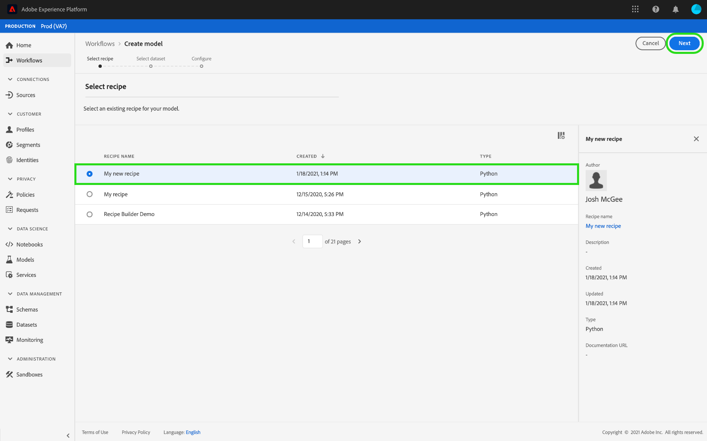

# 在数据科学工作区UI中培训和评估模型

在Adobe Experience Platform数据科学工作区中，机器学习模型是通过合并适合模型意图的现有方法创建的。 然后对该模型进行训练和评估，通过微调其相关超参数来优化其运行效率和功效。 配方可重复使用，这意味着只需一个配方，即可创建多个模型并根据特定目的对其进行定制。

本教程将逐步介绍创建、训练和评估模型的步骤。

## 快速入门

要完成本教程，您必须拥有 [!DNL Experience Platform]. 如果您无权访问中的组织 [!DNL Experience Platform]，请在继续之前与系统管理员联系。

本教程需要现有方法。 如果您没有方法，请按照 [在UI中导入包装的配方](./import-packaged-recipe-ui.md) 教程，然后再继续。

## 创建模型

在Experience Platform中，选择 **[!UICONTROL 模型]** 选项卡，然后选择浏览选项卡以查看现有模型。 选择 **[!UICONTROL 创建模型]** 开始创建模型的过程。

浏览现有方法列表，查找并选择要用于创建模型的方法并选择 **[!UICONTROL 下一个]**.

选择适当的输入数据集并选择 **[!UICONTROL 下一个]**. 这将为模型设置默认输入训练数据集。

提供模型的名称并查看默认模型配置。 在方法创建期间应用了默认配置，通过双击这些值来查看和修改配置值。

要提供一组新的配置，请选择 **[!UICONTROL 上传新配置]** 并将包含模型配置的JSON文件拖到浏览器窗口中。 选择 **[!UICONTROL 完成]** 以创建模型。

>[!NOTE]
>
>配置是唯一的，并且特定于其预期方法，这意味着零售方法配置不适用于产品Recommendations方法。 请参阅 [引用](#reference) 零售方法配置列表的区域。

## 创建训练运行

在Experience Platform中，选择 **[!UICONTROL 模型]** 选项卡，然后选择浏览选项卡以查看现有模型。 查找并选择附加到要训练的模型名称的超链接。

列出所有现有培训运行及其当前培训状态。 对于使用创建的 [!DNL Data Science Workspace] 界面，使用默认配置和输入训练数据集自动生成并执行训练运行。

通过选择创建新的训练运行 **[!UICONTROL 训练]** 靠近模型概述页面的右上角。

为训练运行选择训练输入数据集，然后选择 **[!UICONTROL 下一个]**.

模型创建期间提供的默认配置将显示出来，通过双击值可相应地更改和修改这些配置。 选择 **[!UICONTROL 完成]** 创建和执行训练运行。

>[!NOTE]
>
>配置是唯一的，并且特定于其预期方法，这意味着零售方法配置不适用于产品Recommendations方法。 请参阅 [引用](#reference) 零售方法配置列表的区域。

## 评估模型

在Experience Platform中，选择 **[!UICONTROL 模型]** 选项卡，然后选择浏览选项卡以查看现有模型。 查找并选择附加到要评估的模型名称的超链接。

列出所有现有培训运行及其当前培训状态。 对于多个已完成的训练运行，可以在模型评估图表中跨不同的训练运行比较评估指标。 使用图表上方的下拉列表选择一个评估指标。

平均绝对百分比误差(MAPE)量度以误差百分比表示精度。 这用于标识表现最好的试验。 MAPE越低越好。

“精度”量度描述相关实例占总实例的百分比 *已检索* 实例。 精度可以看作是随机选择结果正确的可能性。

选择特定的训练运行，可通过打开评估页面来提供运行的详细信息。 甚至可以在运行完成之前完成此操作。 在评估页面上，您可以看到特定于训练运行的其他评估指标、配置参数和可视化图表。

您还可以下载活动日志以查看运行的详细信息。 日志对于查看失败的运行中发生了什么情况特别有用。

不能训练超参数，必须通过测试超参数的不同组合来优化模型。 重复此模型训练和评估过程，直到达到优化模型。

## 后续步骤

本教程将指导您在中创建、训练和评估模型 [!DNL Data Science Workspace]. 到达优化模型后，您可以使用经过训练的模型通过遵循以下步骤生成见解 [在UI中对模型计分](./score-model-ui.md) 教程。

## 参考 {#reference}

### 零售方法配置

超参数决定了模型的训练行为，修改超参数将会影响模型的精度和精度：

| 超参数 | 描述 | 建议范围 |
| --- | --- | --- |
| learning_rate | 学习率通过learning_rate减小每个树的贡献。 学习率和n估计量之间存在一种权衡。 | 0.1 |
| n_estimators | 要执行的提升阶段数。 梯度提升算法对于过拟合具有很强的鲁棒性，因此大量的梯度提升算法通常可以获得更好的性能。 | 100 |
| max_depth | 单个回归估计值的最大深度。 最大深度限制树中的节点数。 调整此参数以获得最佳性能；最佳值取决于输入变量的交互作用。 | 3 |

其他参数确定模型的技术属性：

| 参数键 | 类型 | 描述 |
| ----- | ----- | ----- |
| `ACP_DSW_INPUT_FEATURES` | 字符串 | 逗号分隔的输入架构属性的列表。 |
| `ACP_DSW_TARGET_FEATURES` | 字符串 | 逗号分隔的输出架构属性的列表。 |
| `ACP_DSW_FEATURE_UPDATE_SUPPORT` | 布尔值 | 确定输入和输出特征是否可修改 |
| `tenantId` | 字符串 | 此ID可确保正确命名您创建的资源，并将其包含在您的组织中。 [请按照此处的步骤操作](../../xdm/api/getting-started.md#know-your-tenant_id) 以查找您的租户ID。 |
| `ACP_DSW_TRAINING_XDM_SCHEMA` | 字符串 | 用于训练模型的输入架构。 |
| `evaluation.labelColumn` | 字符串 | 评估可视化图表的列标签。 |
| `evaluation.metrics` | 字符串 | 用于评估模型的评估指标列表（以逗号分隔）。 |
| `ACP_DSW_SCORING_RESULTS_XDM_SCHEMA` | 字符串 | 用于对模型评分的输出架构。 |
