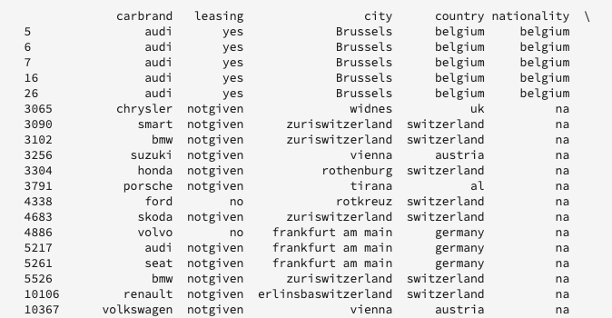

# 实时机器学习笔记本用户指南(Alpha)

>[!IMPORTANT]
>尚未向所有用户提供实时机器学习。 此功能在alpha中，仍在测试中。 此文档可能会更改。

以下指南概述了构建实时机器学习应用程序所需的步骤。 本指南使用Adobe **[!UICONTROL 提供的实时ML]** Python笔记本模板涵盖培训模型、创建DSL、将DSL发布到Edge以及对请求评分。 随着您在实现实时机器学习模型的过程中不断改进，您需要修改模板以满足数据集的需求。

## 创建实时机器学习笔记本

在Adobe Experience Platform UI中，从数 **[!UICONTROL 据科]** 学中选择 *笔记本*。 接下来， **[!UICONTROL 选择Jupyter]** Lab，并允许一段时间加载环境。


出现JupyterLab启动器。 向下滚动 *到“Real-Time Learning* (实时机学 **习)”并选择“Real-time ML(实** 时ML)”笔记本。 此时将打开一个模板，其中包含带有示例数据集的示例笔记本单元格。


## 导入和发现节点

开始，方法是为模型导入所有必需的包。 确保您计划用于节点创作的任何包都已导入。

>[!NOTE]
>您的导入列表可能因您希望创建的模型而有所不同。 随着时间的推移，新节点的添加，此列表将发生变化。 有关可用节 [点的完整列表](./node-reference.md) ，请参阅节点参考指南。

```python
from pprint import pprint
import pandas as pd
import numpy as np
import json
import uuid
from shutil import copyfile
from pathlib import Path
from datetime import date, datetime, timedelta
from platform_sdk.dataset_reader import DatasetReader

from rtml_nodelibs.nodes.standard.preprocessing.json_to_df import JsonToDataframe
from rtml_sdk.edge.utils import EdgeUtils
from rtml_sdk.graph.utils import GraphBuilder
from rtml_nodelibs.nodes.standard.ml.onnx import ONNXNode
from rtml_nodelibs.core.nodefactory import NodeFactory as nf
from rtml_nodelibs.nodes.standard.preprocessing.pandasnode import Pandas
from rtml_nodelibs.nodes.standard.preprocessing.one_hot_encoder import OneHotEncoder
from rtml_nodelibs.nodes.standard.ml.artifact_utils import ModelUpload
from rtml_nodelibs.core.nodefactory import NodeFactory as nf
from rtml_nodelibs.core.datamsg import DataMsg
```

以下代码单元格打印可用节点的列表。

```python
# Discover Nodes
pprint(nf.discover_nodes())
```


## 实时机器学习模型的训练

使用以下选项之一，您将编写Python代码来读取、预处理和分析数据。 接下来，您需要培训自己的ML模型，将其序列化为ONNX格式，然后将其上传到Real-time Machine Learning模型商店。

- [在JupyterLab笔记本中培训您自己的型号](#training-your-own-model)
- [将您自己经过培训的ONNX型号上传到JupyterLab笔记本](#pre-trained-model-upload)

### 培训您自己的模型 {#training-your-own-model}

开始。

>[!NOTE]
>在Real- **time ML模板中** ，从Github [上获取汽车保险CSV数](https://github.com/adobe/experience-platform-dsw-reference/tree/master/datasets/insurance) 据集。

如果您希望从Adobe Experience Platform内使用数据集，请取消以下单元格的注释。 接下来，您需要用相 `DATASET_ID` 应的值替换。


要访问JupyterLab笔记本中的数据集，请选 **择** JupyterLab左侧导航中的“数据”选项卡。 出 *现Dataset**和* 模式目录。 选 **[!UICONTROL 择数据集]** ，右键单击，然后从要使用的数据集 **[!UICONTROL 的下拉菜单中选择浏览笔记本中的数据]** 。 可执行代码条目显示在笔记本的底部。 这个手机里有你的 `dataset_id`。


完成后，右键单击并删除您在笔记本底部生成的单元格。

### 培训属性

使用提供的模板，修改中的任何培训属性 `config_properties`。

```python
config_properties = {
    "train_records_limit":1000000,
    "n_estimators": "80",
    "max_depth": "5",
    "ten_id": "_experienceplatform"  
}
```

### 准备模型

使用 *实时ML模板* ，您需要分析、预处理、培训和评估ML模型。 这是通过应用数据转换和构建培训管道来完成的。

**数据转换**

需 *要修改实时* ML *模板Data Transformations* 单元格，才能处理您自己的数据集。 通常，这涉及重命名列、数据汇总以及数据准备／功能工程。

>[!NOTE]
>以下示例已经过压缩，以便使用 `[ ... ]`。 请视图 *完整代码单元格* 的实时ML模板。

```python
df1.rename(columns = {config_properties['ten_id']+'.identification.ecid' : 'ecid',
                     [ ... ]}, inplace=True)
df1 = df1[['ecid', 'km', 'cartype', 'age', 'gender', 'carbrand', 'leasing', 'city', 
       'country', 'nationality', 'primaryuser', 'purchase', 'pricequote', 'timestamp']]
print("df1 shape 1", df1.shape)
#########################################
# Data Rollup
######################################### 
df1['timestamp'] = pd.to_datetime(df1.timestamp)
df1['hour'] = df1['timestamp'].dt.hour.astype(int)
df1['dayofweek'] = df1['timestamp'].dt.dayofweek

df1.loc[(df1['purchase'] == 'yes'), 'purchase'] = 1
df1.purchase.fillna(0, inplace=True)
df1['purchase'] = df1['purchase'].astype(int)

[ ... ]

print("df1 shape 2", df1.shape)

#########################################
# Data Preparation/Feature Engineering
#########################################      

df1['carbrand'] = df1['carbrand'].str.lower()
df1['country'] = df1['country'].str.lower()
df1.loc[(df1['carbrand'] == 'vw'), 'carbrand'] = 'volkswagen'

[ ... ]

df1['age'].fillna(df1['age'].median(), inplace=True)
df1['gender'].fillna('notgiven', inplace=True)

[ ... ]

df1['city'] = df1.groupby('country')['city'].transform(lambda x : x.fillna(x.mode()))
df1.dropna(subset = ['pricequote'], inplace=True)
print("df1 shape 3", df1.shape)
print(df1)

#grouping
grouping_cols = ['carbrand', 'cartype', 'city', 'country']

for col in grouping_cols:
    df_idx = pd.DataFrame(df1[col].value_counts().head(6))

    def grouping(x):
        if x in df_idx.index:
            return x
        else:
            return "Others"
    df1[col] = df1[col].apply(lambda x: grouping(x))

def age(x):
    if x < 20:
        return "u20"
    elif x > 19 and x < 29:
    [ ... ]
    else: 
        return "Others"

df1['age'] = df1['age'].astype(int)
df1['age_bucket'] = df1['age'].apply(lambda x: age(x))

df_final = df1[['hour', 'dayofweek','age_bucket', 'gender', 'city',  
   'country', 'carbrand', 'cartype', 'leasing', 'pricequote', 'purchase']]
print("df final", df_final.shape)

cat_cols = ['age_bucket', 'gender', 'city', 'dayofweek', 'country', 'carbrand', 'cartype', 'leasing']
df_final = pd.get_dummies(df_final, columns = cat_cols)
```

运行提供的单元格以查看示例结果。 从数据集返回的输出 `carinsurancedataset.csv` 表返回定义的修改。



**培训管道**

接下来，您需要创建培训管道。 这将与任何其他培训管道文件相似，但需要转换并生成ONNX文件除外。

使用在上一个单元格中定义的数据转换，修改模板。 下面突出显示的代码用于在功能管道中生成ONNX文件。 请视图 *完整管道代码单元* 的实时ML模板。

```python
#for generating onnx
def generate_onnx_resources(self):        
    install_dir = os.path.expanduser('~/my-workspace')
    print("Generating Onnx")
        
    from skl2onnx import convert_sklearn
    from skl2onnx.common.data_types import FloatTensorType
        
    # ONNX-ification
    initial_type = [('float_input', FloatTensorType([None, self.feature_len]))]

    print("Converting Model to Onnx")
    onx = convert_sklearn(self.model, initial_types=initial_type)
             
    with open("model.onnx", "wb") as f:
        f.write(onx.SerializeToString())
            
    print("Model onnx created")
```

完成培训管道并通过数据转换修改数据后，请使用以下单元格运行培训。

```python
model = train(config_properties, df_final)
```

### 生成并上传ONNX模型

完成成功的培训运行后，您需要生成一个ONNX模型并将培训的模型上传到Real-time Machine Learning模型商店。 运行以下单元格后，您的ONNX型号会出现在左边栏中，旁边是您的所有其他笔记本。

```python
import os
import skl2onnx, subprocess

model.generate_onnx_resources()
```

```python
model_path = "model.onnx"

model = ModelUpload(params={'model_path': model_path})
msg_model = model.process(None, 1)
model_id = msg_model.model['model_id']
 
print("Model ID : ", model_id)
```

>[!NOTE]
>更改字 `model_path` 符串值以命名模型。


### 上传您自己的预先培训的ONNX模型 {#pre-trained-model-upload}

使用JupyterLab笔记本中的上传按钮，将您经过培训的ONNX模型上传到Data Science Workspace笔记本环境。


接下来，更 `model_path` 改实时ML笔 *记本中的字符串值* ，使其与您的ONNX型号名称匹配。 完成后，运行“设 *置模型路径* ”单元格，然 *后运行“将模型上传到RTML模型存储* ”单元格。 成功时，您的模型位置和模型ID都会在响应中返回。


## 域特定语言(DSL)创建

本节概述了如何创建DSL。 您将创作包含任何数据预处理的节点以及ONNX节点。 然后，使用节点和边创建DSL图。 边缘使用基于元组的格式(node_1、node_2)连接节点。 图形不应具有循环。

>[!IMPORTANT]
>必须使用ONNX节点。 如果没有ONNX节点，应用程序将失败。

### 节点创作

>[!NOTE]
> 您可能会根据所使用的数据类型有多个节点。 以下示例仅概述实时ML模 *板中的单个节点* 。 请视图 *完整代码单元格* 的实时ML模板。

下面的Apnotics节点 `"import": "map"` 将方法名称作为字符串导入参数中，然后输入参数作为映射函数。 以下示例通过使用实现 `{'arg': {'dataLayerNull': 'notgiven', 'no': 'no', 'yes': 'yes', 'notgiven': 'notgiven'}}`。 在将地图置于适当位置后，您可以选择将其 `inplace` 设置为 `True` 或 `False`。 设 `inplace` 置 `True` 为 `False` 还是基于是否要就地应用转换。 默认情 `"inplace": False` 况下，创建新列。 支持提供新列名称设置为在后续版本中添加。 最后一行 `cols` 可以是单列名称或列列表。 指定要应用转换的列。 在此示例中 `leasing` 指定。 有关可用节点以及如何使用这些节点的详细信息，请访问节 [点参考指南](./node-reference.md)。

```python
# Renaming leasing column using Pandas Node
leasing_mapper_node = Pandas(params={'import': 'map',
                                'kwargs': {'arg': {
                                    'dataLayerNull': 'notgiven', 
                                    'no': 'no', 
                                    'yes': 'yes', 
                                    'notgiven': 'notgiven'}},
                                'inplace': True,
                                'cols': 'leasing'})
```

### 构建DSL图

创建节点后，下一步是将节点链在一起以创建图。

开始，通过构建数组列出属于图形一部分的所有节点。

```python
nodes = [json_df_node, 
        to_datetime_node,
        hour_node,
        dayofweek_node,
        age_fillna_node,
        carbrand_fillna_node,
        country_fillna_node,
        cartype_primary_nationality_km_fillna_node,
        carbrand_mapper_node,
        cartype_mapper_node,
        country_mapper_node,
        gender_mapper_node,
        leasing_mapper_node,
        age_to_int_node,
        age_bins_node,
        dummies_node, 
        onnx_node]
```

然后，将节点与边连接。 每个元组都是边连接。

>[!TIP]
> 由于节点之间是线性依赖的（每个节点都取决于前一个节点的输出），您可以使用简单的Python列表理解创建链接。 如果节点依赖多个输入，请添加您自己的连接。

```python
edges = [(nodes[i], nodes[i+1]) for i in range(len(nodes)-1)]
```

连接节点后，构建图形。

```python
dsl = GraphBuilder.generate_dsl(nodes=nodes, edges=edges)
pprint(json.loads(dsl))
```

完成后，将返 `edge` 回一个对象，其中包含每个节点以及映射到它们的参数。


## 发布到Edge（中心）

>[!NOTE]
>实时机器学习临时部署到Adobe Experience Platform Hub并由其管理。 有关更多详细信息，请访问“实时机 [学习体系结构”的概述部分](./home.md#architecture)。

现在您已创建了DSL图形，可将图形部署到Edge。

>[!IMPORTANT]
>不要经常发布到Edge，这会使Edge节点过载。 建议不要多次发布同一模型。

```python
edge_utils = EdgeUtils()
(edge_location, service_id) = edge_utils.publish_to_edge(dsl=dsl)
print(f'Edge Location: {edge_location}')
print(f'Service ID: {service_id}')
```

### 更新DSL并重新发布到Edge（可选）

如果不需要更新DSL，可跳到评 [分](#scoring)。

>[!NOTE]
>仅当您希望更新已发布到Edge的现有DSL时，才需要以下单元格。

您的模型可能会继续发展。 与其创建全新服务，不如使用新模型更新现有服务。 您可以定义要更新的节点，为其指定新ID，然后将新DSL重新上传到Edge。

在以下示例中，节点0将更新为新的ID。

```python
# Update the id of Node 0 with a random uuid.

dsl_dict = json.loads(dsl)
print(f"ID of Node 0 in current DSL: {dsl_dict['edge']['applicationDsl']['nodes'][0]['id']}")

new_node_id = str(uuid.uuid4())
print(f'Updated Node ID: {new_node_id}')

dsl_dict['edge']['applicationDsl']['nodes'][0]['id'] = new_node_id
```


更新节点ID后，您可以将更新的DSL重新发布到Edge。

```python
# Republish the updated DSL to Edge
(edge_location_ret, service_id, updated_dsl) = edge_utils.update_deployment(dsl=json.dumps(dsl_dict), service_id=service_id)
print(f'Updated dsl: {updated_dsl}')
```

您将返回更新的DSL。


## 评分 {#scoring}

发布到Edge后，评分由客户端的POST请求完成。 通常，这可以从需要ML分数的客户端应用程序中完成。 您也可以从邮递员处进行。 实 *时ML模板使用* EdgeUtils演示此过程。

>[!NOTE]
>在对开始评分之前，需要一小段处理时间。

```python
# Wait for the app to come up
import time
time.sleep(20)
```

使用与培训中使用的模式相同的评分数据生成样本评分数据。 此数据用于构建一个评分数据帧，然后转换为评分字典。 请视图 *完整代码单元格* 的实时ML模板。


### 对Edge端点进行得分

使用实时ML模板中 *的以下单元格* ，根据您的Edge服务进行得分。


评分完成后，将返回Edge的Edge URL、Payload和Edge的已评分输出。

## 从Edge中删除已部署的应用程序（可选）

>!![CAUTION]
此单元格用于删除已部署的Edge应用程序。 除非需要删除已部署的Edge应用程序，否则不要使用以下单元格。

```python
if edge_utils.delete_from_edge(service_id=service_id):
    print(f"Deleted service id {service_id} successfully")
else:
    print(f"Failed to delete service id {service_id}")
```

## 后续步骤

按照上面的教程，您已经成功地培训了ONNX模型并将其上传到实时机器学习模型商店。 此外，您还对实时机器学习模型进行了评分和部署。 如果要进一步了解可用于模型创作的节点，请访问节 [点参考指南](./node-reference.md)。