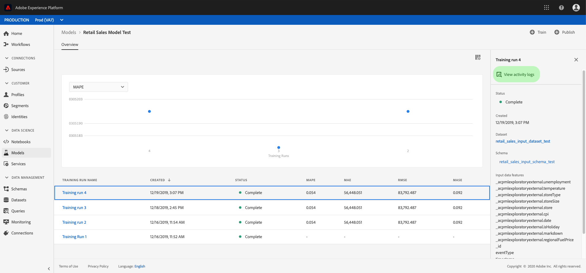

# 实时机器学习模型的训练

>[!IMPORTANT]
>尚未向所有用户提供实时机器学习。 此功能在alpha中，仍在测试中。 此文档可能会更改。

本文档提供了将ONNX模型上传到实时机器学习模型存储的教程。

使用以下选项之一，您将编写python代码来读取、预处理和分析数据。 接下来，您需要培训自己的ML模型，将其序列化为ONNX格式，最后将其上传到Real-time Machine Learning模型商店。 此外，在教程结束时，您将获得一个模型ID，它标识经过培训的模型以用于评 [分教程](./scoring-ml-model.md)。

* [使用Python笔记本培训模型](#training-model-python-notebook)
* [使用您自己的ONNX模型培训模型](#train-using-own-onnx-model)
* [使用recipe-builder模板培训模型](#train-using-recipe-builder)
* [使用“数据科学工作场所”菜谱工作流培训模型](#recipe-workflow-train-model)


## 使用Python笔记本培训模型 {#training-model-python-notebook}

在Adobe Experience Platform UI中，从数 **[!UICONTROL 据科]** 学中选择 *笔记本*。 接下来， **[!UICONTROL 选择Jupyter]** Lab，并允许一段时间加载环境。


开始，从 **JupyterLab启动器中选** 择空白的Python 3笔记本。


### 访问数据 {#access-data}

然后，选择您希望使用的数据集。 要访问JupyterLab笔记本中的数据集，请选 **择** JupyterLab左侧导航中的“数据”选项卡。 出 *现Dataset**和* 模式目录。 选 **[!UICONTROL 择数据集]** ，右键单击，然后从要使用的数据集 **[!UICONTROL 的下拉菜单中选择浏览笔记本中的数据]** 。 可执行代码条目显示在笔记本中。


### 准备模型

使用以下模板来分析、预处理、培训和评估您的ML模型。 有关完整的示例，请使用此模板下面提供的截屏：

```python
from sklearn import svm, metrics
from sklearn.model_selection import train_test_split


data = df[input_columns]
target = df[target_column]
# Create a classifier: a support vector classifier
classifier = svm.SVC(gamma=0.001)

# Split data into train and test subsets
X_train, X_test, y_train, y_test = train_test_split(
    data, target, test_size=0.5, shuffle=False)

# We train the classifier
classifier.fit(X_train, y_train)

# Now do predictions
predicted = classifier.predict(X_test)


print("Classification report for classifier %s:\n%s\n"
      % (classifier, metrics.classification_report(y_test, predicted)))
disp = metrics.plot_confusion_matrix(classifier, X_test, y_test)
disp.figure_.suptitle("Confusion Matrix")
print("Confusion matrix:\n%s" % disp.confusion_matrix)
```

>[!NOTE]
>以下示例使用scikit-learn库，而不是从摄取的Adobe Experience Platform数据集加载数据。


**输出**


### 上传模型

完成上一步后，您需要将模型序列化为ONNX格式并将其上传到实时机器学习商店。 这将返回下 `model_id` 一个教程中 [使用的](#next-steps)。

使用以下模板转换为ONNX并上传数据集：

```python
from rtml_nodelibs.nodes.standard.ml.artifact_utils
import ModelUpload
from rtml_nodelibs.core.nodefactory
import NodeFactory as nf
from skl2onnx.common.data_types
import FloatTensorType
from skl2onnx
import convert_sklearn

########## Save sklearn model in ONNX format at model_path ##########
inputs = [('features', FloatTensorType([None, X_train.shape[1]]))]
model_onnx = convert_sklearn(classifier, 'ScikitLearnModel', inputs)

model_path = "model.onnx"
os.environ["ONNX_MODEL_PATH"] = model_path

with open(model_path, "wb") as f:
  f.write(model_onnx.SerializeToString())

  ########## Upload the model from model_path to RTML model store ##########
  model = ModelUpload(params = {
    'model_path': model_path
  })

msg_model = model.process(None, 1)

model_id = msg_model.model['model_id']

print("Model ID : ", model_id)
```

**响应**


收到后，请复 `model_id`制并继续执行下 [一步](#next-steps)。


## 使用您自己的ONNX模型培训模型 {#train-using-own-onnx-model}

在Adobe Experience Platform UI中，从数 **[!UICONTROL 据科]** 学中选择 *笔记本*。 接下来， **[!UICONTROL 选择Jupyter]** Lab，并允许一段时间加载环境。


使用JupyterLab笔记本中的上传按钮，将您的ONNX模型上传到Data Science Workspace笔记本环境。


然后，在JupyterLab启动器中选择Python 3下的空白笔记本图标，创建一个新的空白笔记本。


在空白笔记本中，复制并粘贴以下内容：

>[!NOTE]
> 确保提供您上 `model_path` 传的ONNX型号。

```python
from rtml_nodelibs.nodes.standard.ml.artifact_utils import ModelUpload
from rtml_nodelibs.core.nodefactory import NodeFactory as nf
 
model_path = <path/to/onnx_model>
########## Upload the model from model_path to RTML model store ##########
model = ModelUpload(params={'model_path': model_path})
 
msg_model = model.process(None, 1)
 
model_id = msg_model.model['model_id']
 
print("Model ID : ", model_id)
```

运行上面的单元格后， `model_id` 将返回。 复制要在下一个教程中使用的 [模型ID](#next-steps)。

## 使用预建菜谱模板培训模型 {#train-using-recipe-builder}

在Adobe Experience Platform UI中，从数 **[!UICONTROL 据科]** 学中选择 *笔记本*。 接下来， **[!UICONTROL 选择Jupyter]** Lab，并允许一段时间加载环境。


接下来，按照使 [用Jupyter笔记本教程创建菜谱](../jupyterlab/create-a-recipe.md) 。 完成后，您需要修改pipeline.py文件以进行实时检查。

>[!NOTE]
>需要修改数据科学工作区提供的模板以适合您的数据集。

确保以ONNX格式保存模型并将环境变量设置为 `ONNX_MODEL_PATH`。 以下示例演示如何使用recipe-builder模板修改管道文件。

```python
def train(configProperties, data):

  print("Train Start")

########## Extract fields from configProperties ##########
learning_rate = float(configProperties['learning_rate'])
n_estimators = int(configProperties['n_estimators'])
max_depth = int(configProperties['max_depth'])

########## Fit model ##########
X_train = data.drop('weeklySalesAhead', axis = 1).values
y_train = data['weeklySalesAhead'].values

seed = 1234
model = GradientBoostingRegressor(learning_rate = learning_rate,
  n_estimators = n_estimators,
  max_depth = max_depth,
  random_state = seed)

model.fit(X_train, y_train)

########## Save sklearn model in ONNX format at model_path ##########
inputs = [('features', FloatTensorType([None, X_train.shape[1]]))]
model_onnx = convert_sklearn(model, 'ScikitLearnModel', inputs)

model_path = "retail_sales_model.onnx"
os.environ["ONNX_MODEL_PATH"] = model_path

with open(model_path, "wb") as f:
  f.write(model_onnx.SerializeToString())

print("Train Complete")

return model
```

修改pipeline.py文件后，运行 **[!UICONTROL Training]** and **[!UICONTROL Scoring]**。 完成后，选择创建 **[!UICONTROL 菜谱按]** 钮。


将显示命名对话框。 输入处方名称，然后选择“确 **[!UICONTROL 定”]**。 将显示一个新对话框，提醒您菜谱创建已开始。 允许一段时间创建菜谱。


创建菜谱后，您可以在提供的对话框中选 **[!UICONTROL 择视图菜谱]** ，或导航到模型，然后在左上角的导航中选 ******** 择菜谱来查看菜谱。 将显示按创建日期排序的列表菜谱。 确认您的新菜谱位于最上方。


选择您的菜谱。 此时将显示菜谱概述页面。 在右上方的导航中，选择“创 **[!UICONTROL 建模型”]**。


然后，选择适当的数据集。 然后， **[!UICONTROL 在右上]** 方导航中单击“下一步”。


此时将打开配置页。 为模型提供名称并查看默认模型配置。 创建菜谱时将应用默认配置。 通过多次单击这些值来查看和修改配置值。 要提供新的配置集，请单击“ **[!UICONTROL 上传新配置]** ”，并将包含模型配置的JSON文件拖至浏览器窗口中。 选择 **[!UICONTROL “完成]** ”(Finish)以创建模型。


创建模型后，您必须等待培训运行完成。 成功的培训运行完成后，您可以选择培训运行以视图其详细信息。

选择培训运行。 选择后，右侧将显示一个属性对话框。 在此对话框中，选择 **[!UICONTROL 视图活动日志]**。



出现 *“视图活动日志* ”对话框弹出窗口。 选择stderr日志 *的URL* ，下载日志并查看运行的详细信息。


日志对于失败的运行来查看出错的内容尤为有用。 但是，在本例中，您要查找与 `model-id` 您创建的ONNX模型对应的。 复制模型ID。

>[!NOTE]
>你不必做评分工作。 下一步将介绍实时机器学习边缘 [评分](#next-steps)。


## 使用“数据科学工作场所”菜谱工作流培训模型 {#recipe-workflow-train-model}

如果您熟悉Docker、git和打包Python代码，这是您使用的最佳方法。 使用数据科学工作区工作流程，您可以在创建菜谱方面获得最大的灵活性和自由。 您可以提取基本文档图像并构建自己的文档环境、更轻松地调试菜谱、克隆预建菜谱以便与任何数据科学工作区服务一起使用、计划菜谱运行等。

### 创建模式

第一步要求您为数据集创建数据模式。 模式可通过Adobe Experience Platform UI或Platform API创建。

>[!NOTE]
>如果您已经拥有要用于Adobe Experience Platform的数据，请跳到 [创建Python菜谱](#create-a-python-recipe)。

* [使用模式编辑器UI教程创建模式](../../xdm/tutorials/create-schema-ui.md)
* [使用模式编辑器API教程创建模式](../../xdm/tutorials/create-schema-api.md)

### 摄取数据

接下来，您需要使用刚刚创建的模式来摄取数据。 这可以通过使用API或平台UI来完成。

>[!NOTE]
>如果您已经拥有要用于Adobe Experience Platform的数据，请跳到 [创建Python菜谱](#create-a-python-recipe)。

* [将数据引入Adobe Experience Platform UI教程](../../ingestion/tutorials/ingest-batch-data.md)
* [将数据引入Adobe Experience Platform API教程](../../ingestion/batch-ingestion/api-overview.md)

### 创建Python菜谱 {#create-a-python-recipe}

菜谱创建开始与打包源文件一起构建存档文件。 源文件定义了机器学习逻辑和算法，这些逻辑和算法用于解决手头的特定问题。 使用以下教程构建Python Docker图像。

* [将源文件打包到菜谱中](../models-recipes/package-source-files-recipe.md)

要完成下一步，您需要在Azure容器注册表中拥有Docker图像以及相应的图像URL。 选择以下教程链接之一以完成Python菜谱的创建：

* [在UI中导入打包的菜谱](../models-recipes/import-packaged-recipe-ui.md)
* [使用API导入打包的菜谱](../models-recipes/import-packaged-recipe-api.md)

### 创建培训运行

在Adobe Experience Platform Data Science Workspace中，机器学习模型是通过整合与模型意图相适应的现有“处方”来创建的。 然后，对模型进行训练和评估，通过微调其相关的超参数来优化其运行效率和功效。

* [在UI中培训和评估模型](../models-recipes/train-evaluate-model-ui.md)
* [在API中培训和评估模型](../models-recipes/train-evaluate-model-api.md)

>[!IMPORTANT]
>在菜谱的pipeline.py文件中，将模型以ONNX格式保存在 `model_path` 中并将环境变量设置为 `ONNX_MODEL_PATH`。 运行时会查找此特定环境变量。

```python
def train(configProperties, data):
 
    print("Train Start")
 
    ########## Extract fields from configProperties ##########

    learning_rate = float(configProperties['learning_rate'])
    n_estimators = int(configProperties['n_estimators'])
    max_depth = int(configProperties['max_depth'])
 
 
    
    ########## Fit model ##########
    
    X_train = data.drop('weeklySalesAhead', axis=1).values
    y_train = data['weeklySalesAhead'].values
 
    seed = 1234
    model = GradientBoostingRegressor(learning_rate=learning_rate,
                                      n_estimators=n_estimators,
                                      max_depth=max_depth,
                                      random_state=seed)
 
    model.fit(X_train, y_train)
     
    ########## Save sklearn model in ONNX format at model_path ##########
    inputs = [('features', FloatTensorType([None, X_train.shape[1]]))]
    model_onnx = convert_sklearn(model, 'ScikitLearnModel', inputs)
 
    model_path = "retail_sales_model.onnx"
    os.environ["ONNX_MODEL_PATH"] = model_path
 
    with open(model_path, "wb") as f:
        f.write(model_onnx.SerializeToString())
 
    print("Train Complete")
 
    return model
```

创建模型后，您必须等待培训运行完成。 成功的培训运行完成后，您可以选择培训运行以视图其详细信息。 选择培训运行。 选择属性对话框后，将在右侧显示，选择 **[!UICONTROL 视图活动日志]**。


出现 *“视图活动日志* ”对话框弹出窗口。 选择stderr日志 *的URL* ，下载日志并查看运行的详细信息。


日志对于失败的运行来查看出错的内容尤为有用。 但是，在本例中，您要查找与 `model-id` 您创建的ONNX模型对应的。 复制模型ID。


您不必在菜谱中运行评分作业。 下一个教程将介绍实时机器学习边 [缘评分](#next-steps)。

## 后续步骤 {#next-steps}

遵循上述教程之一，您成功地培训了ONNX模型并将其上传到Real-time Machine Learning模型商店，并拥有可识别 `model_id` 您的模型的工具。 继续下一个教程，学习如何对 [实时机器学习模型进行评分](./scoring-ml-model.md)。