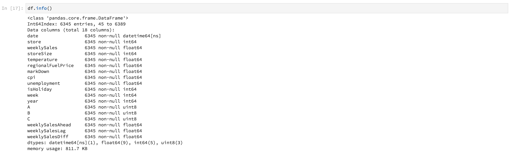

# 数据科学工作区演练

本文档为Adobe Experience Platform Data Science Workspace提供了一个演练。 具体来说，我们将介绍一个数据科学家将通过的一般工作流程来使用机器学习解决问题。

## 先决条件

- 注册的Adobe ID帐户
   - 必须已将Adobe ID帐户添加到有权访问Adobe Experience Platform和数据科学工作区的组织

## 数据科学家的动机

在当前市场中保持竞争力，零售商面临许多挑战。 零售商的主要关注点之一是确定其产品的最优定价，并预测销售趋势。 通过准确的预测模型，零售商将能够找到需求与定价策略之间的关系并做出优化的定价决策，以最大化销售和收入。

## 数据科学家的解决方案

数据科学家的解决方案是利用零售商可访问的丰富历史数据，预测未来趋势并优化定价决策。 我们将利用过去的销售数据来训练我们的机器学习模型，并使用该模型来预测未来的销售趋势。 通过这种方式，零售商将能够获得洞察来帮助他们更改定价。

在此概述中，我们将介绍数据科学家通过哪些步骤来获取数据集并创建一个模型来预测每周的销售情况。 我们将阅读Adobe Experience Platform Data Science Workspace上的Sample Retail Sales Notebook中的以下部分：

- [设置](#setup)
- [浏览数据](#exploring-data)
- [功能工程](#feature-engineering)
- [培训和验证](#training-and-verification)

### 数据科学工作区中的笔记本

首先，我们希望创建一款JupyterLab笔记本，以打开&quot;零售&quot;样品笔记本。 按照笔记本中数据科学家的步骤操作，我们将能够了解典型的工作流程。

在Adobe Experience Platform UI中，单击顶部菜单中的“数据科学”选项卡，将您带到数据科学工作区。 在此页中，单击将打开JupyterLab启动器的JupyterLab选项卡。 您应当看到一个类似于此的页面。


在我们的教程中，我们将使用Jupyter Notebook中的Python 3来展示如何访问和浏览数据。 在启动器页面中，提供了示例笔记本。 我们将为Python 3使用“零售销售”范例。


### 设置 {#setup}

打开零售笔记本后，我们首先要做的就是加载工作流程所需的库。 以下列表将简短描述每种应用程序的用途：
- **numpy** —— 可增加对大型、多维数组和矩阵支持的科学计算库
- **熊猫** -优惠数据结构和操作的库，用于数据处理和分析
- **matplotlib.pyplot** —— 绘图库，在绘制时提供类似MATLAB的体验
- **seaborn** -基于matplotlib的高级界面数据可视化库
- **sklearn** —— 具有分类、回归、支持向量和群集算法的机器学习库
- **警告** -控制警告消息的库

### 浏览数据 {#exploring-data}

#### 加载数据

加载库后，我们可以开始查看数据。 以下Python代码使用熊猫的 `DataFrame` 数据结构和 [](https://pandas.pydata.org/pandas-docs/stable/generated/pandas.read_csv.html#pandas.read_csv) read_csv()函数将Github上托管的CSV文件读入熊猫数据框架：


熊猫的数据框架数据结构是一种二维标记数据结构。 要快速查看数据的维度，我们可以使用 `df.shape`。 这将返回表示DataFrame的维度的元组：


最后，我们可以一睹数据的真实效果。 我们可 `df.head(n)` 以使用视图 `n` DataFrame的前几行：


#### 统计摘要

我们可以利用Python的熊猫库来获取每个属性的数据类型。 以下调用的输出将提供有关每个列的条目数和数据类型的信息：

```PYTHON
df.info()
```


此信息很有用，因为了解每列的数据类型将使我们能够了解如何处理数据。

现在，我们来看统计摘要。 只显示数字数据类型 `date`, `storeType`且 `isHoliday` 不输出：

```PYTHON
df.describe()
```


通过这个，我们可以看到，每个特征有6435个实例。 此外，还给出了平均、标准差(std)、最小、最大和四分位数等统计信息。 这给出了有关数据偏差的信息。 在下一节中，我们将重点介绍可视化，这些可视化与这些信息一起使用，以便我们全面了解我们的数据。

从最小值和最大值看， `store`我们可以看到有45个数据表示的唯一存储。 还有一些 `storeTypes` 因素使商店与众不同。 通过执行以下操作，我们可 `storeTypes` 以看到Adobe的分发：


这意味着22家商店是 `storeType A` ,17家是 `storeType B`,6家是 `storeType C`。

#### 可视化数据

既然我们了解了数据框架值，我们就想用可视化来补充这一点，让事情变得更清晰、更容易识别模式。 这些图在将结果传递到受众时也很有用。

#### 单变量图

单变量图是单个变量的图。 用于可视化数据的通用单变量图是方框图和晶须图。

利用我们以前的零售数据集，我们可以为45家商店及其每周销售量中的每家生成包装盒和须条图。 使用函数生成绘 `seaborn.boxplot` 图。


用方框和晶须图显示数据的分布。 当框跨越四分之一的范围时，绘图的外线显示上四分之一的和下四分之一的。 框中的线标记中间值。 高于上四分之一或下四分之一的任何数据点都标记为圆。 这些点被视为异常值。

接下来，我们可以按时间来策划每周的销售。 我们只显示第一家商店的输出。 笔记本中的代码生成6个图，对应于我们数据集中45个商店中的6个。


通过此图，我们可以比较2年内的每周销售情况。 随着时间推移，销售高峰和低谷模式很容易见分晓。

#### 多变量图

多变量图用于查看变量之间的交互。 通过可视化，数据科学家可以发现变量之间是否存在任何相关性或模式。 使用的通用多变量图是关联矩阵。 利用相关矩阵，用相关系数量化多个变量之间的依赖关系。

利用同一个零售数据集，可以生成关联矩阵。


注意中心下方的对角线。 这说明在比较变量与自身时，它具有完全正相关性。 强正相关度将接近1，弱正相关度将接近0。 显示负相关，负系数显示逆趋势。

### 特征工程 {#feature-engineering}

在本节中，我们将修改我们的零售数据集。 我们将执行以下操作：

- 添加周和年列
- 将storeType转换为指示符变量
- 将isHoliday转换为数字变量
- 预测每周下周的销售情况

#### 添加周和年列

日期(`2010-02-05`)的当前格式很难区分数据是每周的。 因此，我们将日期转换为周和年。


现在，周和日期如下：


#### 将storeType转换为指示符变量

接下来，我们要将storeType列转换为表示每个列的列 `storeType`。 有3种存储类型(`A`、 `B`、 `C`)，我们要从中创建3个新列。 在每个列中设置的值将是一个布尔值，其中将根据其它2列的原 `storeType` 样设 `0` 置“1”。


将删 `storeType` 除当前列。

#### 将isHoliday转换为数字类型

下一步修改是将布尔值更 `isHoliday` 改为数值表示形式。


#### 预测每周下周的销售情况

现在，我们希望将之前和未来每周的销售添加到每个数据集中。 我们这样做是为了抵消我们的损失 `weeklySales`。 此外，我们还计算了差 `weeklySales` 异。 这是通过减去 `weeklySales` 前一周的数字来完成的 `weeklySales`。


由于我们向前偏移45个数据集， `weeklySales` 向后偏移45个数据集以创建新列，因此前45个数据点和后45个数据点将具有NaN值。 我们可以使用函数从数据集中删除这些点，该函 `df.dropna()` 数会删除所有具有NaN值的行。


以下是修改后的数据集摘要：



### 培训和验证 {#training-and-verification}

现在，是时候创建一些数据模型，并选择哪个模型预测未来销售表现最佳。 我们将对以下5种算法进行评估：

- 线性回归
- 决策树
- 随机森林
- 渐变提升
- K邻居

#### 将数据集拆分为培训和测试子集

我们需要一种方法来知道我们的模型能够预测值有多精确。 此评估可以通过分配部分数据集以用作验证，而其余部分用作培训数据来完成。 由于 `weeklySalesAhead` 是实际的未来值， `weeklySales`所以我们可以用它来评估模型在预测值时的准确性。 拆分操作如下：


我们现在有 `X_train` 和有 `y_train` 准备这些模型和 `X_test` 以后 `y_test` 进行评估。

#### 现场检查算法

在本节中，我们将将所有算法声明到一个名为的数组中 `model`。 接下来，我们对这个数组进行迭代，对于每个算法，输入我们的训练数据， `model.fit()` 用它创建一个模型 `mdl`。 使用这个模型，我们将用我们的 `weeklySalesAhead` 数据进行 `X_test` 预测。


对于评分，我们采用预测值与数据中实际值之 `weeklySalesAhead` 间的平均百分比差 `y_test` 异。 由于我们希望将预测与实际值的差异降至最低，因此梯度推进回归是最佳的模型。

#### 可视化预测

最后，我们将用实际每周销售价值可视化我们的预测模型。 蓝线表示实际数字，绿色表示使用渐变提升的预测。 以下代码生成6个图，代表我们数据集中45个存储中的6个。 仅 `Store 1` 在以下位置显示：


<!--TODO UI Flow> -->

## 结论

通过这个概述，我们详细介绍了数据科学家将通过的工作流来解决零售销售问题。 具体而言，我们通过以下步骤来找到预测未来每周销售额的解决方案。

- [设置](#setup)
- [浏览数据](#exploring-data)
- [功能工程](#feature-engineering)
- [培训和验证](#training-and-verification)