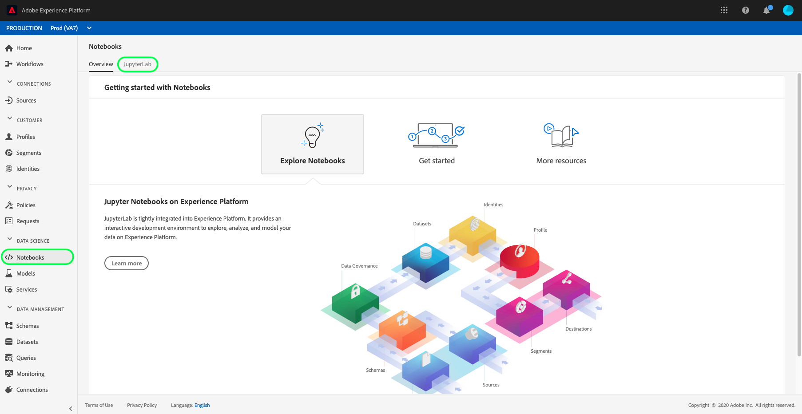

# [!DNL Data Science Workspace] 漫游

本文档为Adobe Experience Platform提供了一个演练 [!DNL Data Science Workspace]。 本教程概述了一般数据科学家工作流程，以及他们如何使用机器学习来解决问题。

## 先决条件

- 注册的Adobe ID帐户
   - Adobe ID账户必须已经添加到有权访问Adobe Experience Platform和的组织 [!DNL Data Science Workspace]。

## 零售用例

在当前市场中，零售商要保持竞争力，面临着许多挑战。 零售商的主要关注点之一是决定产品的最优定价，并预测销售趋势。 利用准确的预测模型，零售商将能够找到需求与定价策略之间的关系并做出优化的定价决策，从而最大化销售和收入。

## 数据科学家的解决方案

数据科学家的解决方案是利用零售商提供的丰富历史信息，预测未来趋势并优化定价决策。 本演练使用过去的销售数据来训练机器学习模型，并使用该模型来预测未来的销售趋势。 利用此功能，您可以生成洞察以帮助实现最佳定价更改。

此概述反映了数据科学家在获取数据集和创建模型以预测每周销售额时所经历的步骤。 本教程介绍了Adobe Experience Platform零售销售笔记本示例中的以下部分 [!DNL Data Science Workspace]:

- [设置](#setup)
- [浏览数据](#exploring-data)
- [功能工程](#feature-engineering)
- [培训和验证](#training-and-verification)

### 笔记本 [!DNL Data Science Workspace]

在Adobe Experience PlatformUI中，从 **[!UICONTROL Data Science]** （数据科学） **[!UICONTROL 选项卡中选]** 择Notebooks（笔记本），以将您带到Notebooks [!UICONTROL (笔记本] )概述页面。 在此页面中，选择 [!DNL JupyterLab] 选项卡以启动 [!DNL JupyterLab] 环境。 启动器的默 [!DNL JupyterLab] 认登陆页 **[!UICONTROL 为]**。




本教程使 [!DNL Python] 用中 [!DNL JupyterLab Notebooks] 的3来说明如何访问和浏览数据。 在“启动器”页面中提供了示例笔记本。 Retail Sales **[!UICONTROL 示例笔记本]** ，在下面提供的示例中使用。

### 设置 {#setup}

打开零售销售笔记本后，您应首先加载工作流程所需的库。 以下列表对后面步骤示例中使用的每个库进行了简短描述。

- **跳跃**:为大型、多维阵列和矩阵添加支持的科学计算库
- **熊猫**:优惠用于数据处理和分析的数据结构和操作的库
- **matplotlib.pyplot**:绘制库，在绘制时提供类似MATLAB的体验
- **西博恩** :基于matplotlib的高层界面数据可视化库
- **sklearn**:具有分类、回归、支持向量和聚类算法的机器学习库
- **警告**:控制警告消息的库

### 浏览数据 {#exploring-data}

#### 加载数据

加载库后，您可以开始查看数据。 以下代 [!DNL Python] 码使用 `DataFrame` 熊猫的数据 [结构和read_csv()函数将熊猫数据框中托](https://pandas.pydata.org/pandas-docs/stable/generated/pandas.read_csv.html#pandas.read_csv) 管的CSV读 [!DNL Github] 入熊猫数据框：


熊猫的DataFrame数据结构是一种二维标记数据结构。 要快速查看数据的维度，您可以使用 `df.shape`。 这会返回表示DataFrame的维度的元组：


最后，您可以预览数据的外观。 可以使 `df.head(n)` 用视图 `n` DataFrame的前几行：


#### 统计摘要

我们可以利 [!DNL Python's] 用熊猫库来获取每个属性的数据类型。 以下调用的输出将提供有关每个列的条目数和数据类型的信息：

```PYTHON
df.info()
```


此信息非常有用，因为了解每列的数据类型将使我们能够了解如何处理数据。

现在我们来看统计摘要。 将只显示数字数据类 `date`型 `storeType`，并 `isHoliday` 且不输出：

```PYTHON
df.describe()
```


通过这种方法，您可以看到每个特征有6435个实例。 此外，还给出了平均、标准偏差(std)、最小、最大和间隔等统计信息。 这给出了有关数据偏差的信息。 在下一节中，您将重点介绍可视化功能，这些功能与这些信息配合使用，以便我们对您的数据有全面的了解。

从最小值和最大值看 `store`，您可以看到有45个数据表示的唯一存储。 店也 `storeTypes` 有差别。 您可以通过执行以下操 `storeTypes` 作来查看分发：


这意味着22家商店 `storeType A` 是，17 `storeType B`家是，6家 `storeType C`。

#### 可视化数据

既然您了解了数据框架值，您就希望用可视化来补充这一点，使事情更清晰、更容易地识别模式。 这些图在将结果传送到受众时也很有用。

#### 单变量图

单变量图是单个变量的图。 用于可视化数据的通用单变量图是方框图和晶须图。

使用以前的零售数据集，您可以为45家商店及其每周销售量生成包装盒和晶须图。 该图是使用该函数生 `seaborn.boxplot` 成的。


用方框和晶须图显示数据的分布。 出图的外线显示上和下四分位图，而框跨越四分位图范围。 框中的线标记中间值。 高于上四分之一或下四分之一的任何数据点都标记为圆。 这些点被视为异常值。

接下来，您可以按时绘制每周的销售情况。 您将仅显示第一个商店的输出。 笔记本中的代码生成6个图，对应于我们数据集中45个商店中的6个。


通过此图表，您可以比较2年内的每周销售额。 随着时间推移，销售高峰和低谷很容易出现。

#### 多变量图

多变量图用于查看变量之间的交互。 通过可视化，数据科学家可以发现变量之间是否存在关联或模式。 常用的多变量图是相关矩阵。 利用相关矩阵，用相关系数量化多变量之间的依赖关系。

使用相同的零售数据集，您可以生成相关矩阵。


注意中间对角线。 这表明，在比较变量本身时，它具有完全正相关性。 强正相关度将接近1，弱正相关度将接近0。 负相关性与负系数呈逆趋势显示。

### 特征工程 {#feature-engineering}

在本节中，功能工程用于通过执行以下操作来修改您的零售数据集：

- 添加周和年列
- 将storeType转换为指示符变量
- 将isHoliday转换为数字变量
- 预测每周下周的销售

#### 添加周和年列

当前的日期格式(`2010-02-05`)使得很难区分每周的数据。 因此，您应将日期转换为包含周和年。


现在，周和日期如下：


#### 将storeType转换为指示符变量

接下来，您要将storeType列转换为代表每个列 `storeType`。 有3种存储类型(`A`、 `B`、 `C`)，您要从中创建3个新列。 在每个列中设置的值是布尔值，其中根据其它2列的原 `storeType` 样 `0` 设置“1”。


将删除 `storeType` 当前列。

#### 将isHoliday转换为数字类型

下一步修改是将布尔值 `isHoliday` 更改为数值表示。


#### 预测每周下周的销售

现在，您希望将之前和未来每周的销售添加到每个数据集。 你可以通过抵消你的 `weeklySales`。 此外，还 `weeklySales` 计算差值。 这是用上周 `weeklySales` 的减法完成的 `weeklySales`。


由于您正在向前偏移45个 `weeklySales` 数据集，向后偏移45个数据集以创建新列，因此前45个数据点和后45个数据点都有NaN值。 您可以使用删除所有具有NaN值的行的 `df.dropna()` 函数从数据集中删除这些点。


修改后的数据集摘要如下所示：


### 培训和验证 {#training-and-verification}

现在，是时候创建一些数据模型，选择哪个模型在预测未来销售方面表现最佳。 您将评估以下5种算法：

- 线性回归
- 决策树
- 随机森林
- 渐变提升
- K邻居

#### 将数据集拆分为培训和测试子集

您需要一种方法来了解模型能够预测值的准确程度。 此评估可通过分配部分数据集以用作验证，而其余数据集则用作培训数据来完成。 由 `weeklySalesAhead` 于是实际的未来值， `weeklySales`因此您可以使用它来评估模型在预测值时的准确性。 拆分操作如下所示：


您现在有 `X_train` 准备 `y_train` 模型并准备以 `X_test` 后 `y_test` 进行评估。

#### 专题检查算法

在本节中，您将所有算法声明到名为的数组中 `model`。 接下来，您对此数组进行迭代，并为每个算法输入用于创建 `model.fit()` 模型的培训数据 `mdl`。 使用此模型，您可以用数 `weeklySalesAhead` 据进行 `X_test` 预测。


对于评分，您采用的是预测值与数据中实 `weeklySalesAhead` 际值之间的平均百分比 `y_test` 差。 由于您希望将预测与实际结果之间的差异降至最低，因此，梯度提升回归器是效果最佳的模型。

#### 可视化预测

最后，使用实际的每周销售额值可视化您的预测模型。 蓝线表示实际数字，绿色表示使用渐变提升的预测。 以下代码生成6个图，表示数据集中45个商店中的6个。 仅 `Store 1` 在此处显示：


## 后续步骤

此文档涵盖了用于解决零售销售问题的一般数据科学家工作流程。 总结：

- 加载工作流程所需的库。
- 载入库后，您可以使用统计摘要、可视化和图形开始查看数据。
- 接下来，使用功能工程对您的零售数据集进行修改。
- 最后，创建数据模型并选择预测未来销售效果最佳的模型。

准备就绪后，请阅读JupyterLab用户指 [南开始](./jupyterlab/overview.md) ，快速了解Adobe Experience Platform数据科学工作区中的笔记本。 此外，如果您有兴趣了解模型和方法，请阅读零售销售开始 [和数据集教程进行模式](./models-recipes/create-retails-sales-dataset.md) 。 本教程为您准备后续的数据科学工作区教程，这些教程可在数据科学工作区教程页 [中查看](../tutorials/data-science-workspace.md)。