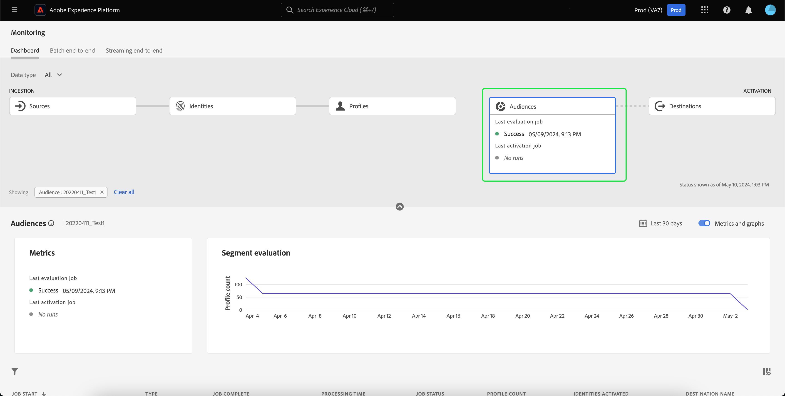
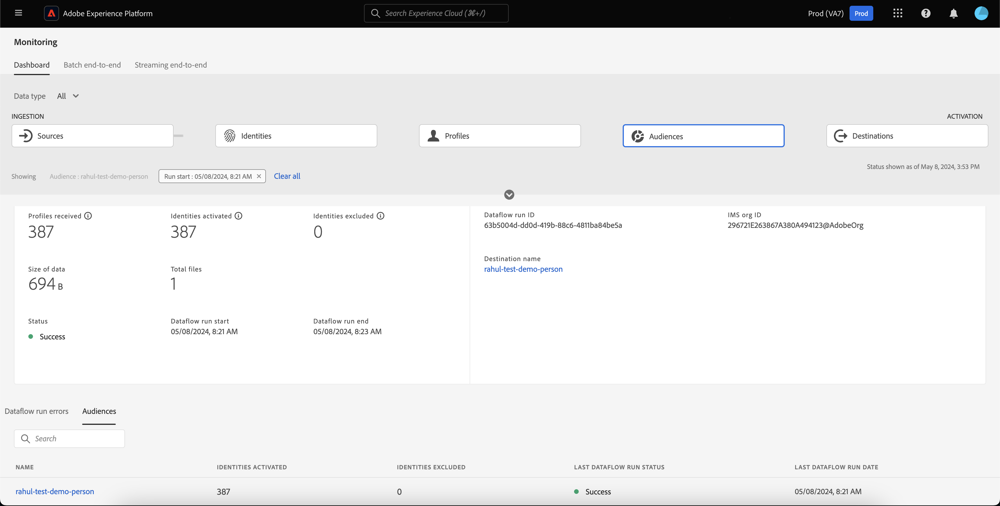

# 在UI中监控受众的数据流

分段服务允许您通过区段定义或来自的其他来源创建受众。 [!DNL Real-Time Customer Profile] 数据。 Platform提供数据流以透明地跟踪从源到目标的这种数据流。

使用监视仪表板可查看受众中数据活动的可视表示形式，包括数据分段的状态。 阅读教程，了解如何使用监视仪表板通过Experience Platform用户界面监视数据分段，从而跟踪受众激活、评估和导出作业的状态。

## 快速入门 {#getting-started}

本指南要求您对 Adobe Experience Platform 的以下组件有一定了解：

- [数据流](../home.md)：数据流表示跨Platform移动数据的数据作业。 数据流在不同的服务之间配置，有助于将数据从源连接器移动到目标数据集，以 [!DNL Identity] 和 [!DNL Profile]、和 [!DNL Destinations].
   - [数据流运行](../../sources/notifications.md)：数据流运行是基于所选数据流的频率配置的定期计划作业。
- [分段](../../segmentation/home.md)：分段允许您根据实时客户档案数据创建受众。
   - [激活作业](../../destinations/ui/activation-overview.md)：激活作业用于将受众激活到指定目标。
   - [评估作业](../../segmentation/tutorials/evaluate-a-segment.md#evaluate-a-segment)：评估作业是评估受众的异步进程。
   - [导出作业](../../segmentation/api/export-jobs.md)：导出作业是用于使受众成员保留到数据集的异步进程。
- [沙盒](../../sandboxes/home.md)： [!DNL Experience Platform] 提供对单个文件夹进行分区的虚拟沙盒 [!DNL Platform] 将实例安装到单独的虚拟环境中，以帮助开发和改进数字体验应用程序。

## 监控受众仪表板 {#monitoring-audiences-dashboard}

>[!CONTEXTUALHELP]
>id="platform_monitoring_segments"
>title="受众"
>abstract="受众视图包含有关您的组织的所有受众的信息，以及有关其激活和评估作业的更多信息。"

要访问 **[!UICONTROL 受众]** 仪表板，选择 **[!UICONTROL 监控]** 在左侧导航中。 一旦在 **[!UICONTROL 监控]** 页面上，选择 **[!UICONTROL 受众]** 卡片。

在主页面上 **[!UICONTROL 受众]** 仪表板， **[!UICONTROL 受众]** 信息卡显示上次评估作业和上次导出作业的状态和日期。

仪表板本身包含受众和分段作业的量度。 默认情况下，仪表板显示过去24小时的受众量度。 要了解有关分段作业视图的更多信息，请阅读 [监控分段作业](#monitoring-segmentation-jobs-dashboard) 部分。

>[!IMPORTANT]
>
>当前，仅限激活到的受众 [批处理（基于文件）目标](../../destinations/destination-types.md#file-based) 监控受众功能板支持。

以下指标可用于此仪表板视图：

| 量度 | 描述 |
| ------ | ----------- |
| **[!UICONTROL 受众名称]** | 受众的名称。 |
| **[!UICONTROL 数据类型]** | 受众的数据类型。 可能的值包括 **[!UICONTROL 客户]**， **[!UICONTROL 帐户]**、和 **[!UICONTROL 潜在客户]**. 您可以使用查看指定数据类型的受众 [!UICONTROL 数据类型] 在卡片功能区上方进行筛选。 |
| **[!UICONTROL 上次评估时间戳]** | 受众最后一次评估作业运行的日期和时间。 |
| **[!UICONTROL 上次评估状态]** | 受众上次评估作业的状态。 可能的值包括 **[!UICONTROL 成功]**， **[!UICONTROL 无运行]**、和 **[!UICONTROL 失败]**. |
| **[!UICONTROL 上次评估方法]** | 受众的评估方法。 由于仅支持批量分段，因此唯一可能的值为 **[!UICONTROL 批次]**. |
| **[!UICONTROL 上次评估配置文件]** | 在受众的上次评估作业中评估的用户档案数。 |
| **[!UICONTROL 上次激活时间戳]** | 受众最后一次激活作业运行的日期和时间。 |
| **[!UICONTROL 上次激活状态]** | 受众最后一次激活作业的状态。 可能的值包括 **[!UICONTROL 成功]**， **[!UICONTROL 无运行]**、和 **[!UICONTROL 失败]**. |
| **[!UICONTROL 上次激活身份]** | 在受众的上次激活作业中激活的身份数。 |
| **[!UICONTROL 上次激活目标]** | 受众的上次激活作业激活到的目标的名称。 |

您可以通过选择过滤器图标()。分段作业按时间顺序排序，最新的分段作业首先出现。

此时会显示过滤的受众仪表板。 此 **[!UICONTROL 受众]** 信息卡显示上次评估作业和上次激活作业的状态和日期。

仪表板本身会显示上次评估和激活作业的时间和状态、一个显示受众评估的用户档案计数的图表，以及已运行的分段作业的量度。 默认情况下，功能板显示过去24小时内的分段作业量度。

以下指标可用于此仪表板视图：

| 量度 | 描述 |
| ------ | ----------- |
| **[!UICONTROL 作业开始]** | 分段作业开始的日期和时间。 |
| **[!UICONTROL 类型]** | 指示分段作业的类型。 两种支持的作业类型包括 **激活** 和 **评估** 作业。 |
| **[!UICONTROL 作业完成]** | 分段作业完成的日期和时间。 |
| **[!UICONTROL 处理时间]** | 完成分段作业所用的时间。 |
| **[!UICONTROL 作业状态]** | 分段作业的状态。 支持的值包括 **[!UICONTROL 成功]**， **[!UICONTROL 进行中]**、和 **[!UICONTROL 失败]**. |
| **[!UICONTROL 配置文件计数]** | 分段作业正在评估的配置文件数。 每个用户应具有唯一的配置文件。 |
| **[!UICONTROL 已激活身份]** | 分段作业正在激活的身份数。 每个配置文件都可以有多个身份。 例如，用户档案可能包含电子邮件、电话号码和忠诚度编号作为身份。 |
| **[!UICONTROL 目标名称]** | 分段作业将激活到的目标的名称。 |

您可以通过选择过滤器图标()。有两种不同类型的分段作业可以过滤：激活作业和评估作业。

### 激活作业详细信息 {#activation-job-details}

“激活作业数据流运行详细信息”页面显示有关运行的量度、数据流运行错误以及与分段作业相关的受众的信息。 激活作业用于激活指定目标的受众。

以下指标可用于此仪表板视图：

| 量度 | 描述 |
| ------ | ----------- |
| **[!UICONTROL 已接收配置文件]** | 激活流中接收的配置文件总数。 |
| **[!UICONTROL 已激活身份]** | 根据收到的配置文件，成功激活到目标的身份总数。 |
| **[!UICONTROL 排除的身份]** | 根据收到的用户档案，从激活到目标过程中排除的身份总数。 由于缺少属性或违反同意，可以排除这些身份。 |
| **[!UICONTROL 数据大小]** | 正在激活的数据流的大小。 |
| **[!UICONTROL 文件总数]** | 数据流中正在激活的文件总数。 |
| **[!UICONTROL 状态]** | 激活作业的当前状态。 |
| **[!UICONTROL 数据流运行开始]** | 激活作业开始的日期和时间。 |
| **[!UICONTROL 数据流运行结束]** | 激活作业结束的日期和时间。 |
| **[!UICONTROL 数据流运行ID]** | 当前激活作业的ID。 |
| **[!UICONTROL IMS组织ID]** | 激活作业所属的组织的ID。 |
| **[!UICONTROL 目标名称]** | 数据被激活到的目标的名称。 |

在受众部分下，您可以看到作为激活作业的一部分激活的受众列表。

对于“受众”部分，提供了以下量度：

| 量度 | 描述 |
| ------ | ----------- |
| **[!UICONTROL 名称]** | 已激活的受众的名称。 |
| **[!UICONTROL 已激活身份]** | 根据收到的配置文件，成功激活到目标的身份总数。 |
| **[!UICONTROL 排除的身份]** | 根据收到的用户档案，从激活到目标过程中排除的身份总数。 由于缺少属性或违反同意，可以排除这些身份。 |
| **[!UICONTROL 上次数据流运行状态]** | 为该受众运行的上一个激活作业的状态。 |
| **[!UICONTROL 上次数据流运行日期]** | 为该受众运行的上次激活作业的日期和时间。 |

此外，您还可以查看有关数据流运行错误的详细信息。 在数据流运行错误部分下，您可以查看失败的身份或排除的身份。 错误部分包括有关错误代码以及失败或排除的标识数量的详细信息。

### 评估作业详细信息 {#evaluation-job-details}

“评估作业数据流运行详细信息”页面显示与分段作业相关的运行量度和受众信息。

以下指标可用于此仪表板视图：

| 量度 | 描述 |
| ------ | ----------- |
| **[!UICONTROL 配置文件总数]** | 正在评估的配置文件总数。 |
| **[!UICONTROL 状态]** | 评估作业的状态。 评估作业的可能状态包括 **[!UICONTROL 成功]** 和 **[!UICONTROL 失败]**. |
| **[!UICONTROL 作业开始]** | 评估作业开始的日期和时间。 |
| **[!UICONTROL 作业结束]** | 评估作业结束的日期和时间。 |
| **[!UICONTROL 作业类型]** | 分段作业的类型。 在这种情况下，它将始终为 **[!UICONTROL 区段评估]** 作业。 |
| **[!UICONTROL 评估类型]** | 正在执行的评估类型。 这可以是 **[!UICONTROL 批次]** 或 **[!UICONTROL 流]**. |
| **[!UICONTROL 作业ID]** | 评估作业的ID。 |
| **[!UICONTROL IMS组织ID]** | 评估作业所属的组织的ID。 |
| **[!UICONTROL 受众名称]** | 正在评估的受众的名称。 |
| **[!UICONTROL 受众ID]** | 正在评估的受众的ID。 |

在 [!UICONTROL 受众] 部分中，您可以看到作为评估作业的一部分进行评估的受众列表。 您可以使用搜索栏按名称筛选受众列表。

>[!IMPORTANT]
>
>此仪表板视图当前支持最多800个受众量度。

对于 [!UICONTROL 受众] 部分中，以下量度可用：

| 量度 | 描述 |
| ------ | ----------- |
| **[!UICONTROL 名称]** | 正在评估的受众的名称。 |
| **[!UICONTROL 配置文件计数]** | 正在评估的配置文件数。 |

## 监控分段作业仪表板 {#monitoring-segmentation-jobs-dashboard}

>[!CONTEXTUALHELP]
>id="platform_monitoring_segment_jobs"
>title="分段作业"
>abstract="分段作业视图包含有关所有受众的评估和导出作业的信息。"

要访问 **[!UICONTROL 分段作业]** 仪表板，选择 **[!UICONTROL 分段作业]** 在 [!UICONTROL 受众] 仪表板。 此 [!UICONTROL 监控] 仪表板包含有关评估和导出作业的量度和信息。

>[!NOTE]
>
>仅 **分段评估作业** 支持按受众监控。 分段导出作业仅支持组织级别的监控。

使用 [!UICONTROL 分段作业] 功能板，用于了解是否按时无异常执行配置文件评估和导出，以便目标激活的下游服务可以具有最新评估的配置文件数据。

以下量度可用于分段作业：

| 量度 | 描述 |
| ------ | ----------- |
| **[!UICONTROL 分段作业]** | 指示分段作业的名称。 |
| **[!UICONTROL 类型]** | 指示分段作业的类型 — 导出或评估。 请注意，在这两种情况下，分段作业都会评估或导出 **所有** 属于组织的受众。 要了解有关导出作业的更多信息，请阅读 [导出作业端点](../../segmentation/api/export-jobs.md). 要了解有关评估作业的更多信息，请阅读以下内容的教程： [评估区段定义](../../segmentation/tutorials/evaluate-a-segment.md#evaluate-a-segment). |
| **[!UICONTROL 作业开始]** | 分段作业开始的日期和时间。 |
| **[!UICONTROL 作业结束]** | 分段作业完成的日期和时间。 |
| **[!UICONTROL 状态]** | 已完成作业的状态。 分段作业的可能状态包括成功或失败。 |
