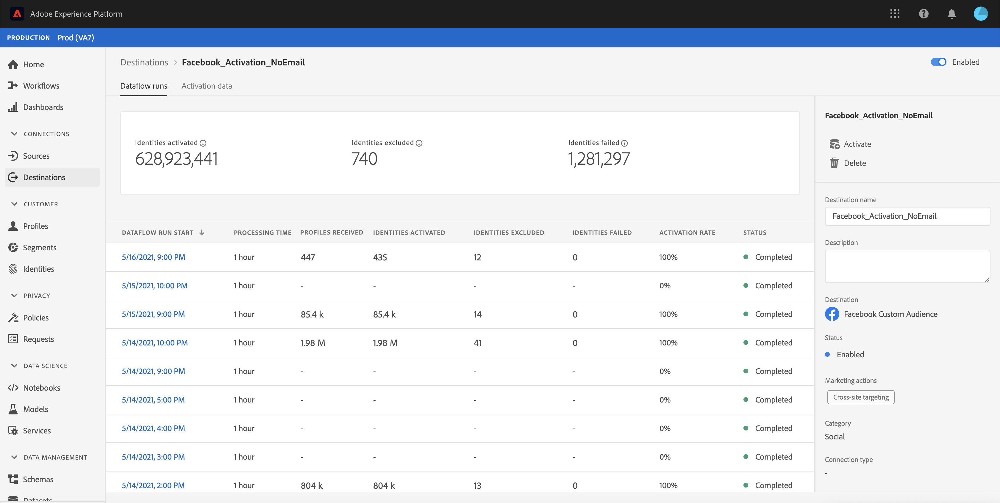
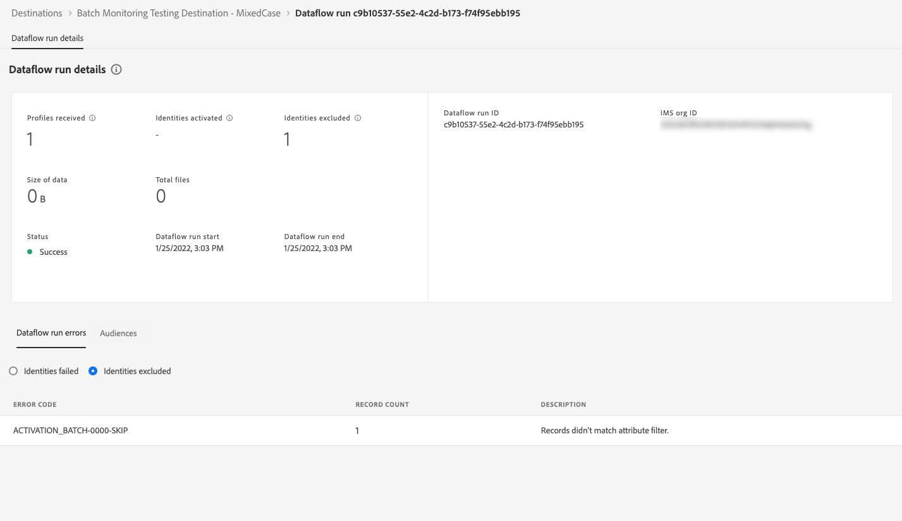

# 在UI中监视目标的数据流

使用Experience Platform目录中的各种目标，将您的数据从Experience Platform激活到无数外部合作伙伴。 Experience Platform通过提供数据流透明度，使跟踪流向目标的数据流的流程更加简单。

监视仪表板为您提供数据流历程的可视化表示形式，包括激活数据的目标、您查看的数据类型、每次数据流运行导出的数据等等。

本教程提供了有关如何直接在目标工作区中监视数据流或者使用Experience Platform用户界面使用监视仪表板监视目标的数据流的说明。

## 快速入门 {#getting-started}

本指南要求您对 Adobe Experience Platform 的以下组件有一定了解：

- [数据流](../home.md)：数据流是跨Experience Platform移动数据的数据作业的表示形式。 数据流在不同服务之间配置，帮助将数据从源连接器移动到目标数据集、[!DNL Identity]和[!DNL Profile]以及[!DNL Destinations]。
   - [数据流运行](../../sources/notifications.md)：数据流运行是基于所选数据流的频率配置的周期性计划作业。
- [目标](../../destinations/home.md)：目标是预建的与常用应用程序的集成，可无缝激活Experience Platform中的数据，以用于跨渠道营销活动、电子邮件活动、定向广告和许多其他用例。
- [沙盒](../../sandboxes/home.md)： [!DNL Experience Platform]提供将单个[!DNL Experience Platform]实例划分为单独虚拟环境的虚拟沙盒，以帮助开发和改进数字体验应用程序。

## 在目标工作区中监视数据流 {#monitor-dataflows-in-the-destinations-workspace}

在Experience Platform UI的&#x200B;**[!UICONTROL 目标]**&#x200B;工作区中，导航到&#x200B;**[!UICONTROL 浏览]**&#x200B;选项卡，然后选择要查看的目标名称。

此时将显示现有数据流的列表。 在此页面上是一个可查看的数据流列表，其中包括有关其目标、用户名、数据流数量和状态的信息。

有关状态的更多信息，请参阅下表：

| 状态 | 描述 |
| ------ | ----------- |
| 已启用 | `Enabled`状态表示数据流处于活动状态并根据提供的计划导出数据。 |
| 已禁用 | `Disabled`状态表示数据流处于非活动状态，并且未导出任何数据。 |
| 正在处理 | `Processing`状态表示数据流尚未处于活动状态。 创建新数据流后，经常会立即出现此状态。 |
| 错误 | `Error`状态表示数据流的激活过程已中断。 |

### 流式处理目标的数据流运行 {#dataflow-runs-for-streaming-destinations}

>[!CONTEXTUALHELP]
>id="platform_monitoring_dataflow_run_details_activation_streaming"
>title="数据流运行详细信息"
>abstract="目标数据流运行详细信息包含有关受众激活状态的信息，以及从实时客户轮廓中获取的量度，以生成唯一身份标识。若要了解更多信息，请查看量度定义指南。"

>[!CONTEXTUALHELP]
>id="platform_monitoring_profiles_received_streaming"
>title="收到的轮廓"
>abstract="数据流中接收的轮廓总数。该值每 60 分钟更新一次。"

>[!CONTEXTUALHELP]
>id="platform_destinations_dataflow_identitiesactivated_streaming"
>title="已激活的身份标识"
>abstract="成功激活到所选目标的轮廓身份标识的计数。此量度包括创建、更新和从导出的受众中移除的身份标识。"

>[!CONTEXTUALHELP]
>id="platform_destinations_dataflow_identitiesexcluded_streaming"
>title="排除的身份标识"
>abstract="根据缺少的属性和同意违规情况，从所选目标的激活中排除的个人轮廓记录的计数。"

>[!CONTEXTUALHELP]
>id="platform_destinations_dataflow_identitiesfailed_streaming"
>title="失败的身份标识"
>abstract="针对所选目标失败的单个轮廓身份标识的计数。请检查错误诊断，以获取详细信息。"

对于流目标，[!UICONTROL 数据流运行]选项卡提供数据流运行中量度数据的每小时更新。 标记的最突出的统计数据是身份信息。

身份表示配置文件的不同方面。 例如，如果配置文件同时包含电话号码和电子邮件地址，则该配置文件将有两个身份。

系统会显示各个运行及其特定量度的列表，以及以下身份总数：

- **[!UICONTROL 已激活身份]**：已成功激活到所选目标的配置文件身份总数。 此量度包括创建、更新和从导出的受众中移除的身份标识。
- **[!UICONTROL 排除的身份]**：基于缺少属性和违反同意而跳过了激活的配置文件身份总数。
- **[!UICONTROL 身份失败]**：由于错误而未激活到目标的配置文件身份总数。

每次数据流运行都会显示以下详细信息：

- **[!UICONTROL 数据流运行开始]**：数据流运行开始的时间。 对于流式数据流运行，Experience Platform会以每小时量度的形式，根据数据流运行的开始捕获量度。 这意味着对于流数据流运行，如果数据流运行在例如10:30PM开始，则量度在UI中将开始时间显示为晚上10:00。
- **[!UICONTROL 处理时间]**：数据流运行处理所花费的时间。
   - 对于&#x200B;**[!UICONTROL 已完成]**&#x200B;的运行，处理时间量度始终显示一个小时。
   - 对于仍处于&#x200B;**[!UICONTROL 处理]**&#x200B;状态的数据流运行，捕获所有量度的窗口将保持打开超过一小时，以便处理与该数据流运行对应的所有量度。 例如，上午9:30开始的数据流运行可能会保持处理状态1小时30分钟，以捕获和处理所有量度。 然后，在处理窗口关闭且数据流运行状态更新为&#x200B;**已完成**&#x200B;后，显示的处理时间将更改为1小时。
- **[!UICONTROL 已接收的配置文件]**：数据流中接收的配置文件总数。
- **[!UICONTROL 已激活的身份]**：作为数据流运行的一部分成功激活到所选目标的配置文件身份总数。 此量度包括创建、更新和从导出的受众中移除的身份标识。
- **[!UICONTROL 排除的身份]**：基于缺少属性和同意违规而从激活中排除的配置文件身份总数。
- **[!UICONTROL 身份失败]**&#x200B;由于错误未激活到目标的配置文件身份总数。

  >[!IMPORTANT]
  >
  > 从 2025 年 3 月开始，Adobe 将推出一项更新，以提高流式处理目标的报告准确性。此增强功能可确保Experience Platform中的报表与目标平台之间更好地保持一致。
  >
  > 在此更新之前，**[!UICONTROL 失败的标识]**&#x200B;包括所有激活重试。 进行此更新后，总计数中仅包含上次激活重试。
  > 
  > 此增强功能适用于所有流目标。
  > 进行此增强后，流式目标用户在其&#x200B;**[!UICONTROL 失败身份数]**&#x200B;计数中可能会看到预期的下降。

- **[!UICONTROL 激活率]**：已成功激活的接收标识的百分比。 以下公式演示如何计算此值：
  
- **[!UICONTROL 状态]**：表示数据流所处的状态： [!UICONTROL 已完成]或[!UICONTROL 正在处理]。 [!UICONTROL 已完成]表示相应数据流运行的所有标识已在一小时内导出。 [!UICONTROL 正在处理]意味着数据流运行尚未完成。

要查看特定数据流运行的详细信息，请从列表中选择该运行的开始时间。

数据流运行的详细信息页面包含其他信息，例如收到的配置文件数、激活的标识数、失败的标识数和排除的标识数。

流目标的

详细信息页面还会显示失败的身份和排除的身份的列表。 显示失败和排除的标识的信息，包括错误代码、标识计数和描述。 默认情况下，列表会显示失败的标识。 要显示跳过的身份，请选择&#x200B;**[!UICONTROL 排除的身份]**&#x200B;切换开关。

#### (Beta)对流式目标的受众级别数据流运行监控 {#audience-level-dataflow-runs-for-streaming-destinations}

您可以查看有关在受众级别划分的激活、排除或失败身份的信息，这些信息适用于作为数据流一部分的每个受众。

流目标的受众级别监视当前仅适用于以下目标：

- [[!DNL Google Customer Match + Display & Video 360]](/help/destinations/catalog/advertising/google-customer-match-dv360.md)
- [[!DNL Marketo Engage]](/help/destinations/catalog/adobe/marketo-engage.md)

>[!NOTE]
>
>**[!UICONTROL 受众]**&#x200B;选项卡中接收的&#x200B;**[!UICONTROL 配置文件数]**&#x200B;与数据流运行中接收的配置文件数可能并不总是匹配。 这是因为给定配置文件可能包含在数据流运行中激活的多个受众。

### 批处理目标的数据流运行 {#dataflow-runs-for-batch-destinations}

>[!CONTEXTUALHELP]
>id="platform_monitoring_dataflow_run_details_activation"
>title="数据流运行详细信息"
>abstract="目标数据流运行详细信息包含有关受众激活状态的信息，以及从实时客户轮廓中获取的量度，以生成唯一身份标识。若要了解更多信息，请查看量度定义指南。"
>additional-url="https://experienceleague.adobe.com/docs/experience-platform/dataflows/ui/monitor-destinations.html?lang=zh-Hans#dataflow-runs-for-streaming-destinations" text="流式处理目标的数据流运行"

>[!CONTEXTUALHELP]
>id="platform_monitoring_profiles_received_batch"
>title="收到的轮廓"
>abstract="数据流中接收的轮廓总数。该值每 60 分钟更新一次。"

>[!CONTEXTUALHELP]
>id="platform_destinations_dataflow_identitiesactivated_batch"
>title="已激活的身份标识"
>abstract="成功激活到所选目标的轮廓身份标识的计数。此量度包括创建、更新和从导出的受众中移除的身份标识。"

>[!CONTEXTUALHELP]
>id="platform_destinations_dataflow_identitiesexcluded_batch"
>title="排除的身份标识"
>abstract="根据缺少的属性和同意违规情况，从所选目标的激活中排除的个人轮廓记录的计数。"

对于批处理目标，[!UICONTROL 数据流运行]选项卡提供有关数据流运行的量度数据。 系统会显示各个运行及其特定量度的列表，以及以下身份总数：

- **[!UICONTROL 已激活身份]**：已成功激活到所选目标的配置文件身份总数。 此量度包括创建、更新和从导出的受众中移除的身份标识。
- **[!UICONTROL 排除的身份]**：根据缺少属性和同意冲突，从选定目标的激活中排除的个人配置文件身份计数。

每次数据流运行都会显示以下详细信息：

- **[!UICONTROL 数据流运行开始]**：数据流运行开始的时间。
- **[!UICONTROL 受众]**：与每个数据流运行关联的受众的名称。
- **[!UICONTROL 处理时间]**：处理数据流运行所花费的时间。
- **[!UICONTROL 已接收的配置文件]**：数据流中接收的配置文件总数。 该值每 60 分钟更新一次。
- **[!UICONTROL 已激活的身份]**：作为数据流运行的一部分成功激活到所选目标的配置文件身份总数。 此量度包括创建、更新和从导出的受众中移除的身份标识。
- **[!UICONTROL 排除的身份]**：基于缺少属性和同意违规而从激活中排除的配置文件身份总数。
- **[!UICONTROL 状态]**：表示数据流所处的状态。 这可以是以下三种状态之一：[!UICONTROL 成功]、[!UICONTROL 失败]和[!UICONTROL 正在处理]。 [!UICONTROL 成功]表示数据流处于活动状态且正在根据其提供的计划导出数据。 [!UICONTROL 失败]表示数据激活因错误而暂停。 [!UICONTROL 正在处理]意味着数据流尚未处于活动状态，通常在创建新数据流时遇到。

要查看特定数据流运行的详细信息，请从列表中选择运行的开始时间。

>[!NOTE]
>
>数据流运行基于目标数据流的计划频率生成。 为应用于受众的每个[合并策略](../../profile/merge-policies/overview.md)单独运行数据流。

除了数据流列表中显示的详细信息之外，数据流的详细信息页面还显示有关数据流的更多具体信息：

- **[!UICONTROL 数据的大小]**：正在导出的数据流的大小。
- **[!UICONTROL 文件总数]**：数据流中导出的文件总数。
- **[!UICONTROL 上次更新时间]**：上次更新数据流运行的时间。

详细信息页面还会显示失败的身份和排除的身份的列表。 显示失败和排除的标识的信息，包括错误代码和描述。 默认情况下，列表会显示失败的标识。 要显示排除的身份，请选择&#x200B;**[!UICONTROL 排除的身份]**&#x200B;切换开关。

### 在监控中查看 {#view-in-monitoring}

您还可以选择在监视仪表板中查看有关特定数据流及其数据流运行的丰富信息。 要在监视仪表板中查看有关数据流的信息，请执行以下操作：

1. 导航到&#x200B;**[!UICONTROL 连接]** > **[!UICONTROL 目标]** > **[!UICONTROL 浏览]**&#x200B;选项卡
2. 导航到要检查的数据流。
3. 选择省略号符号和 **[!UICONTROL 在监视中查看]**。

>[!SUCCESS]
>
>现在，您可以在监视仪表板中查看有关数据流及其关联的数据流运行的信息。 有关详细信息，请阅读以下部分。

## 监控目标仪表板 {#monitoring-destinations-dashboard}

>[!NOTE]
>
>Experience Platform *中除* [Adobe Target](/help/destinations/catalog/personalization/adobe-target-connection.md)和[自定义个性化](/help/destinations/catalog/personalization/custom-personalization.md)目标之外的所有目标当前都支持目标监视功能。

>[!CONTEXTUALHELP]
>id="platform_monitoring_activation"
>title="激活"
>abstract="目标激活视图包含有关受众激活状态的信息，以及从实时客户轮廓中获取的量度，以生成唯一身份标识。"

要访问[!UICONTROL 监视]仪表板，请在左侧导航中选择&#x200B;**[!UICONTROL 监视]** （）。 在[!UICONTROL 监控]页面上，选择[!UICONTROL 目标]。 [!UICONTROL 监视]仪表板包含有关目标运行作业的量度和信息。

使用[!UICONTROL 目标]仪表板全面了解激活流的运行状况。 首先，获取有关所有批次和流目标的聚合级别的洞察，然后深入查看数据流、数据流运行和激活受众的详细视图，以深入了解您的激活数据。 [!UICONTROL 监控]仪表板中的屏幕通过量度和错误描述提供可操作的洞察，帮助您排除激活方案中可能出现的任何问题。

您可以按数据类型(客户、帐户(仅适用于Adobe Real-Time CDP B2B edition)、潜在客户和帐户扩充)过滤显示的信息。 有关这些选项的更多信息，请参阅[监视仪表板指南](/help/dataflows/ui/monitor.md#monitoring-dashboard-overview)。

仪表板的中心是[!UICONTROL 激活]面板，该面板包含量度和图形，用于显示导出到流式目标的数据的激活率数据，以及导出到批处理目标的失败批处理数据流运行数据。

默认情况下，显示的数据包含过去24小时的激活信息。 选择&#x200B;**[!UICONTROL 最近24小时]**&#x200B;以调整所显示记录的时间范围。 可用选项包括&#x200B;**[!UICONTROL 最近24小时]**、**[!UICONTROL 最近7天]**&#x200B;和&#x200B;**[!UICONTROL 最近30天]**。 或者，您可以在出现的日历弹出窗口中选择日期。 选择日期后，选择&#x200B;**[!UICONTROL 应用]**&#x200B;以调整显示的信息的时间范围。

>[!NOTE]
>
>以下屏幕截图显示了过去30天（而不是过去24小时）的激活率和批量数据流运行。 您可以通过选择&#x200B;**[!UICONTROL 最近30天]**&#x200B;来调整时间范围。

使用箭头图标（）展开或关闭屏幕顶部的信息卡，这些信息卡会根据目标类型（流或批处理）显示有关激活详细信息的概览信息：

- **[!UICONTROL 流式激活率]**：表示已成功激活或跳过接收标识的百分比。 用于计算此百分比的公式在上面的[数据流为流式目标](#dataflow-runs-for-streaming-destinations)部分中有进一步说明。
- **[!UICONTROL 批处理失败的数据流运行]**：表示在所选时间间隔内失败的数据流运行的次数。

默认情况下，将显示&#x200B;**[!UICONTROL 激活]**&#x200B;图形，您可以禁用该图形以展开下面的目标列表。 选择&#x200B;**[!UICONTROL 度量和图形]**&#x200B;切换可禁用图形。

**[!UICONTROL 激活]**&#x200B;面板显示至少包含一个现有帐户的目标列表。 此列表还包含有关这些目标接收的用户档案、激活的身份、失败的身份、排除的身份、激活率、失败数据流总数以及上次更新日期的信息。 并非所有量度都可用于所有目标类型。 下表概述了每种目标类型可用的量度和信息。

| 量度 | 目标类型 |
|--------------------------------------|-----------------------|
| **[!UICONTROL 已接收的记录]** | 流式处理和批处理 |
| **[!UICONTROL 个记录已激活]** | 流式处理和批处理 |
| **[!UICONTROL 个记录失败]** | 流式处理 |
| **[!UICONTROL 跳过的记录数]** | 流式处理和批处理 |
| **[!UICONTROL 数据类型]** | 流式处理和批处理 |
| **[!UICONTROL 激活率]** | 流式处理 |
| **[!UICONTROL 失败的数据流总数]** | 批次 |
| **[!UICONTROL 上次更新时间]** | 流式处理和批处理 |

{style="table-layout:auto"}

您还可以过滤目标列表，以仅显示所选的目标类别。 选择&#x200B;**[!UICONTROL 我的目标]**&#x200B;下拉列表，然后选择要筛选到的[目标类别](/help/destinations/destination-types.md#categories)。

此外，您可以在搜索栏中输入一个目标以隔离到单个目标。 如果要查看目标的数据流，可以选择其旁边的过滤器，以查看其活动数据流的列表。

如果要查看所有目标中的所有现有数据流，请选择&#x200B;**[!UICONTROL 数据流]**。

此时将显示数据流列表，按上次数据流运行排序。 您可以查看特定数据流的其他详细信息，方法是找到要监视的目标，选择它旁边的过滤器，然后选择要了解详细信息的数据流旁边的过滤器。

选择数据流以进行进一步检查后，数据流详细信息页面会包含一个切换开关，通过该开关可查看数据流中的激活数据，这些数据按数据流运行或受众进行划分。

### 数据流运行视图 {#dataflow-runs-view}

选择&#x200B;**[!UICONTROL 数据流运行]**&#x200B;时，您可以看到选定数据流的数据流运行列表以及有关每次运行的更多信息。

>[!INFO]
>
>对于流目标的数据流，数据流运行会划分为每小时窗口。 每个小时窗口都会生成一个对应的数据流运行ID。
>
>对于流到批处理目标的数据流，每个受众都有一个基于受众激活计划频率生成的相应数据流运行。 例如，如果您为同一目标数据流中的五个受众设置每日计划激活，则每天将生成五个单独的数据流运行。

使用&#x200B;**[!UICONTROL 仅显示失败次数]**&#x200B;切换可仅显示数据流的失败运行次数。

### 受众级别视图 {#segment-level-view}

选择&#x200B;**[!UICONTROL 受众]**&#x200B;后，您会看到在选定时间范围内激活到选定数据流的受众列表。 此屏幕包括受众级别的信息，其中包括有关已激活记录、已排除记录以及上次数据流运行的状态和时间的信息。 通过查看排除和激活记录的量度，您可以验证受众是否已成功激活。

例如，您正在将名为“加利福尼亚的忠诚会员”的受众激活到Amazon S3目标“加利福尼亚十二月的忠诚会员”。 假设所选受众中有100个配置文件，但100条记录中只有80条包含忠诚度ID属性，并且您已将导出映射规则定义为需要`loyalty.id`。 在这种情况下，在受众级别，您将看到激活了80条记录，排除了20条记录。

>[!IMPORTANT]
>
>请注意与受众级别量度相关的当前限制：
>- 受众级别视图当前仅适用于批处理（基于文件）目标和[Google Customer Match DV 360](/help/destinations/catalog/advertising/google-customer-match-dv360.md)流目标。 计划推出更多流媒体目标。
>- 对于批处理目标，当前仅记录成功数据流运行的受众级别量度。 失败的数据流运行和排除的记录不会记录这些事件。 对于流目标的数据流运行，将捕获并显示激活和排除的记录的量度。

在受众级别视图中，度量是在选定的时间范围内跨多个数据流运行汇总的。 如果有多个数据流运行，您可以从受众级别向下展开，以查看每个数据流运行的细分（按所选受众进行过滤）。
使用筛选器按钮向下钻取数据流中每个受众的数据流运行视图。

### “数据流运行”页 {#dataflow-runs-page}

“数据流运行”页面显示有关数据流运行的信息，包括数据流运行开始时间、处理时间、收到的记录、激活的记录、排除的记录、失败的记录、激活率和状态。

当您从[受众级别视图](#segment-level-view)向下钻取到数据流运行页面时，您可以通过以下选项筛选数据流运行：

- **[!UICONTROL 数据流运行中记录失败]**：对于所选受众，此选项列出所有激活失败的数据流运行。 要检查特定数据流运行中的记录失败的原因，请查看该数据流运行的[数据流运行详细信息页面](#dataflow-run-details-page)。
- **[!UICONTROL 数据流运行中排除的记录]**：对于所选受众，此选项列出了所有数据流运行，其中某些记录未完全激活，某些配置文件被跳过。 要检查某个数据流运行中的记录被跳过的原因，请查看该数据流运行的[数据流运行详细信息页面](#dataflow-run-details-page)。
- **[!UICONTROL 数据流运行中激活了记录]**：对于所选受众，此选项列出具有已成功激活的记录的所有数据流运行。

要查看有关特定数据流运行的更多详细信息，请选择数据流运行开始时间旁边的筛选器，以查看数据流运行详细信息页面。

### 数据流运行详细信息页面 {#dataflow-run-details-page}

数据流运行详细信息页面除了显示在数据流运行列表中的详细信息之外，还显示有关数据流的更具体的信息：

- **[!UICONTROL 数据流运行ID]**：数据流的ID。
- **[!UICONTROL IMS组织ID]**：数据流所属的组织。
- **[!UICONTROL 上次更新时间]**：上次更新数据流运行的时间。

详细信息页面还有切换功能，可在数据流运行错误和受众之间切换。 此选项仅适用于批处理目标中的数据流运行以及[Google Customer Match DV 360](/help/destinations/catalog/advertising/google-customer-match-dv360.md)流目标。

数据流运行错误视图显示失败的记录和跳过的记录的列表。 显示失败和跳过的记录的信息，包括错误代码、身份计数和描述。 默认情况下，该列表会显示失败的记录。 要显示跳过的记录，请选择&#x200B;**[!UICONTROL 跳过的记录]**&#x200B;切换开关。

在监视视图中突出显示

选择&#x200B;**[!UICONTROL 受众]**&#x200B;后，您会看到在选定数据流运行中激活的受众列表。 此屏幕包括受众级别的信息，其中包括有关已激活记录、已排除记录以及上次数据流运行的状态和时间的信息。

## 后续步骤 {#next-steps}

通过遵循本指南，您现在了解如何监控批量目标和流式目标的数据流，包括所有相关信息，如处理时间、激活率和状态。 要详细了解Experience Platform中的数据流，请阅读[数据流概述](../home.md)。 若要了解有关目标的更多信息，请阅读[目标概述](../../destinations/home.md)。