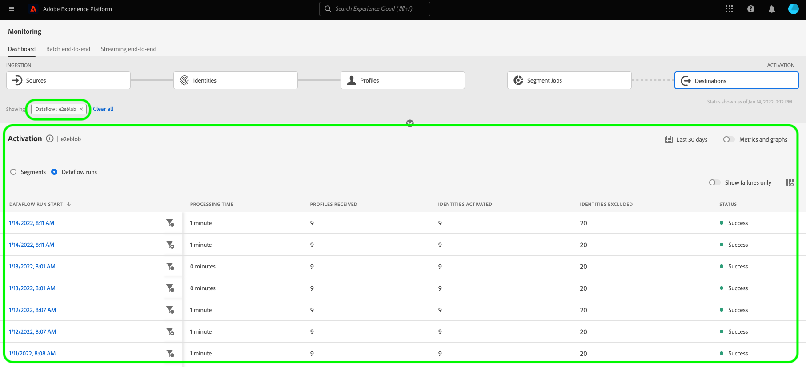

# 在UI中监视目标的数据流

使用Experience Platform目录中的各种目标，将您的数据从Platform激活到无数外部合作伙伴。 Platform通过提供数据流透明度，使跟踪流向目标的数据流的流程更加简单。

监视仪表板为您提供数据流历程的可视化表示形式，包括激活数据的目标、您查看的数据类型、每次数据流运行导出的数据等等。

本教程提供了有关如何直接在目标工作区中监视数据流或者使用“监视”仪表板通过Experience Platform用户界面监视目标的数据流的说明。

## 快速入门 {#getting-started}

本指南要求您对 Adobe Experience Platform 的以下组件有一定了解：

- [数据流](../home.md)：数据流表示跨Platform移动数据的数据作业。 数据流在不同的服务之间配置，有助于将数据从源连接器移动到目标数据集，以 [!DNL Identity] 和 [!DNL Profile]、和 [!DNL Destinations].
   - [数据流运行](../../sources/notifications.md)：数据流运行是基于所选数据流的频率配置的定期计划作业。
- [目标](../../destinations/home.md)：目标是预建的与常用应用程序的集成，可无缝激活Platform中的数据，以用于跨渠道营销活动、电子邮件活动、定向广告和许多其他用例。
- [沙盒](../../sandboxes/home.md)： [!DNL Experience Platform] 提供对单个文件夹进行分区的虚拟沙盒 [!DNL Platform] 将实例安装到单独的虚拟环境中，以帮助开发和改进数字体验应用程序。

## 在目标工作区中监视数据流 {#monitor-dataflows-in-the-destinations-workspace}

在 **[!UICONTROL 目标]** 在Platform UI中，导航到 **[!UICONTROL 浏览]** 选项卡，然后选择要查看的目标名称。

此时将显示现有数据流的列表。 在此页面上是一个可查看的数据流列表，其中包括有关其目标、用户名、数据流数量和状态的信息。

有关状态的更多信息，请参阅下表：

| 状态 | 描述 |
| ------ | ----------- |
| 已启用 | 此 `Enabled` 状态表示数据流处于活动状态并根据提供的计划导出数据。 |
| 已禁用 | 此 `Disabled` 状态表示数据流处于非活动状态，并且未导出任何数据。 |
| 正在处理 | 此 `Processing` 状态表示数据流尚未处于活动状态。 创建新数据流后，经常会立即出现此状态。 |
| 错误 | 此 `Error` 状态表示数据流的激活过程已中断。 |

### 流式处理目标的数据流运行 {#dataflow-runs-for-streaming-destinations}

>[!CONTEXTUALHELP]
>id="platform_monitoring_dataflow_run_details_activation_streaming"
>title="数据流运行详细信息"
>abstract="目标数据流运行详细信息包含有关受众激活状态的信息，以及从实时客户配置文件中获取的用于生成唯一身份的量度。 若要了解更多信息，请查看量度定义指南。"

>[!CONTEXTUALHELP]
>id="platform_monitoring_profiles_received_streaming"
>title="收到的配置文件"
>abstract="数据流中接收的配置文件总数。该值每 60 分钟更新一次。"

>[!CONTEXTUALHELP]
>id="platform_destinations_dataflow_identitiesactivated_streaming"
>title="已激活的标识"
>abstract="成功激活到所选目标的配置文件标识的计数。此量度包括从导出的受众中创建、更新和移除的身份。"

>[!CONTEXTUALHELP]
>id="platform_destinations_dataflow_identitiesexcluded_streaming"
>title="排除的标识"
>abstract="根据缺少的属性和同意违规情况，从所选目标的激活中排除的个人配置文件记录的计数。"

>[!CONTEXTUALHELP]
>id="platform_destinations_dataflow_identitiesfailed_streaming"
>title="失败的标识"
>abstract="针对所选目标失败的单个配置文件标识的计数。请检查错误诊断，以获取详细信息。"

对于流目标， [!UICONTROL 数据流运行] 选项卡每小时更新数据流运行中的量度数据。 标记的最突出的统计数据是身份信息。

身份表示配置文件的不同方面。 例如，如果配置文件同时包含电话号码和电子邮件地址，则该配置文件将有两个身份。

系统会显示各个运行及其特定量度的列表，以及以下身份总数：

- **[!UICONTROL 已激活身份]**：已成功激活到所选目标的配置文件身份总数。 此量度包括从导出的受众中创建、更新和移除的身份。
- **[!UICONTROL 排除的身份]**：基于缺少属性和同意违规而跳过了激活的配置文件身份总数。
- **[!UICONTROL 身份失败]**：由于错误未激活到目标的配置文件身份总数。

每次数据流运行都会显示以下详细信息：

- **[!UICONTROL 数据流运行开始]**：数据流运行开始的时间。 对于流式数据流运行，Experience Platform会以小时量度的形式，根据数据流运行的开始捕获量度。 对于流数据流运行，如果数据流运行开始（例如，晚上10:30），指标会在UI中将开始时间显示为晚上10:00。
- **[!UICONTROL 处理时间]**：数据流运行处理所用的时间。
   - 对象 **[!UICONTROL 已完成]** 在运行时，处理时间量度始终显示一个小时。
   - 对于仍在以下状态的数据流运行： **[!UICONTROL 正在处理]** 状态，捕获所有量度的窗口将保持打开状态超过一小时，以便处理与数据流运行对应的所有量度。 例如，上午9:30开始的数据流运行可能会保持处理状态1小时30分钟，以捕获和处理所有量度。 然后，在处理窗口关闭且数据流运行状态更新为 **已完成**，显示的处理时间将更改为1小时。
- **[!UICONTROL 已接收配置文件]**：数据流中接收的配置文件总数。
- **[!UICONTROL 已激活身份]**：作为数据流运行的一部分成功激活到所选目标的配置文件身份总数。 此量度包括从导出的受众中创建、更新和移除的身份。
- **[!UICONTROL 排除的身份]**：根据缺少属性和同意违规从激活中排除的配置文件身份总数。
- **[!UICONTROL 身份失败]** 由于错误而未激活到目标的配置文件身份总数。
- **[!UICONTROL 激活率]**：已成功激活或跳过的接收标识的百分比。 以下公式演示如何计算此值：
  
- **[!UICONTROL 状态]**：表示数据流所处的状态： [!UICONTROL 已完成] 或 [!UICONTROL 正在处理]. [!UICONTROL 已完成] 意味着相应数据流运行的所有身份已在一小时期间导出。 [!UICONTROL 正在处理] 表示数据流运行尚未完成。

要查看特定数据流运行的详细信息，请从列表中选择该运行的开始时间。

数据流运行的详细信息页面包含其他信息，例如收到的配置文件数、激活的标识数、失败的标识数和排除的标识数。

详细信息页面还会显示失败的身份和排除的身份的列表。 显示失败和排除的标识的信息，包括错误代码、标识计数和描述。 默认情况下，列表会显示失败的标识。 要显示跳过的身份，请选择 **[!UICONTROL 排除的身份]** 切换。

### 批处理目标的数据流运行 {#dataflow-runs-for-batch-destinations}

>[!CONTEXTUALHELP]
>id="platform_monitoring_dataflow_run_details_activation"
>title="数据流运行详细信息"
>abstract="目标数据流运行详细信息包含有关受众激活状态的信息，以及从实时客户配置文件中获取的用于生成唯一身份的量度。 若要了解更多信息，请查看量度定义指南。"
>additional-url="https://experienceleague.adobe.com/docs/experience-platform/dataflows/ui/monitor-destinations.html?lang=zh-Hans#dataflow-runs-for-streaming-destinations" text="流式处理目标的数据流运行"

>[!CONTEXTUALHELP]
>id="platform_monitoring_profiles_received_batch"
>title="收到的配置文件"
>abstract="数据流中接收的配置文件总数。该值每 60 分钟更新一次。"

>[!CONTEXTUALHELP]
>id="platform_destinations_dataflow_identitiesactivated_batch"
>title="已激活的标识"
>abstract="成功激活到所选目标的配置文件标识的计数。此量度包括从导出的受众中创建、更新和移除的身份。"

>[!CONTEXTUALHELP]
>id="platform_destinations_dataflow_identitiesexcluded_batch"
>title="排除的标识"
>abstract="根据缺少的属性和同意违规情况，从所选目标的激活中排除的个人配置文件记录的计数。"

对于批处理目标， [!UICONTROL 数据流运行] 选项卡提供有关数据流运行的量度数据。 系统会显示各个运行及其特定量度的列表，以及以下身份总数：

- **[!UICONTROL 已激活身份]**：已成功激活到所选目标的配置文件身份总数。 此量度包括从导出的受众中创建、更新和移除的身份。
- **[!UICONTROL 排除的身份]**：根据缺少属性和同意冲突，从选定目标的激活中排除的个人配置文件身份计数。

每次数据流运行都会显示以下详细信息：

- **[!UICONTROL 数据流运行开始]**：数据流运行开始的时间。
- **[!UICONTROL 受众]**：与每个数据流运行关联的受众的名称。
- **[!UICONTROL 处理时间]**：处理数据流运行所用的时间。
- **[!UICONTROL 已接收配置文件]**：数据流中接收的配置文件总数。 该值每 60 分钟更新一次。
- **[!UICONTROL 已激活身份]**：作为数据流运行的一部分成功激活到所选目标的配置文件身份总数。 此量度包括从导出的受众中创建、更新和移除的身份。
- **[!UICONTROL 排除的身份]**：根据缺少属性和同意违规从激活中排除的配置文件身份总数。
- **[!UICONTROL 状态]**：表示数据流所处的状态。 这可以是以下三种状态之一： [!UICONTROL 成功]， [!UICONTROL 失败]、和 [!UICONTROL 正在处理]. [!UICONTROL 成功] 表示数据流处于活动状态并根据其提供的计划导出数据。 [!UICONTROL 失败] 表示数据激活因错误而暂停。 [!UICONTROL 正在处理] 表示数据流尚未处于活动状态，通常会在创建新数据流时遇到。

要查看特定数据流运行的详细信息，请从列表中选择运行的开始时间。

>[!NOTE]
>
>数据流运行基于目标数据流的计划频率生成。 为每个数据流执行单独的数据流运行 [合并策略](../../profile/merge-policies/overview.md) 应用于受众。

除了数据流列表中显示的详细信息之外，数据流的详细信息页面还显示有关数据流的更多具体信息：

- **[!UICONTROL 数据大小]**：正在导出的数据流的大小。
- **[!UICONTROL 文件总数]**：数据流中导出的文件总数。
- **[!UICONTROL 上次更新时间]**：上次更新数据流运行的时间。

详细信息页面还会显示失败的身份和排除的身份的列表。 显示失败和排除的标识的信息，包括错误代码和描述。 默认情况下，列表会显示失败的标识。 要显示排除的身份，请选择 **[!UICONTROL 排除的身份]** 切换。

## 监控目标仪表板 {#monitoring-destinations-dashboard}

>[!NOTE]
>
>- 当前Experience Platform中的所有目标都支持目标监视功能 *排除* 该 [Adobe Target](/help/destinations/catalog/personalization/adobe-target-connection.md) 和 [自定义个性化](/help/destinations/catalog/personalization/custom-personalization.md) 目标。
>- 对于 [Amazon Kinesis](/help/destinations/catalog/cloud-storage/amazon-kinesis.md)， [Azure事件中心](/help/destinations/catalog/cloud-storage/azure-event-hubs.md)、和 [HTTP API](/help/destinations/catalog/streaming/http-destination.md) 目标、与排除、失败和激活的标识相关的量度会被估计。 较大量的激活数据会导致量度的准确性较高。

>[!CONTEXTUALHELP]
>id="platform_monitoring_activation"
>title="激活"
>abstract="目标激活视图包含有关受众激活状态的信息以及从实时客户配置文件中获取的用于生成唯一身份的量度。"

要访问 [!UICONTROL 监控] 仪表板，选择 **[!UICONTROL 监控]** ()图标。 一旦在 [!UICONTROL 监控] 页面，选择 [!UICONTROL 目标]. 此 [!UICONTROL 监控] 仪表板包含有关目标运行作业的量度和信息。

使用 [!UICONTROL 目标] 仪表板全面了解激活流的运行状况。 首先，获取有关所有批次和流目标的聚合级别的洞察，然后深入查看数据流、数据流运行和激活受众的详细视图，以深入了解您的激活数据。 中的屏幕 [!UICONTROL 监控] 功能板通过量度和错误描述提供可操作的洞察，帮助您排除激活场景中可能出现的任何问题。

您可以按数据类型(客户、帐户(仅适用于Adobe Real-Time CDP B2B版本)、潜在客户和帐户扩充来过滤显示的信息。 有关这些选项的更多信息，请参阅 [监视仪表板指南](/help/dataflows/ui/monitor.md#monitoring-dashboard-overview).

仪表板的中心是 [!UICONTROL 激活] 面板，其中包含量度和图形，其中显示有关导出到流式目标的数据的激活率数据，以及有关失败的批处理数据流运行到批处理目标的数据。

默认情况下，显示的数据包含过去24小时的激活信息。 选择 **[!UICONTROL 最近24小时]** 以调整所显示记录的时间范围。 可用选项包括 **[!UICONTROL 最近24小时]**， **[!UICONTROL 最近7天]**、和 **[!UICONTROL 最近30天]**. 或者，您可以在出现的日历弹出窗口中选择日期。 选择日期后，选择 **[!UICONTROL 应用]** 以调整显示的信息的时间范围。

>[!NOTE]
>
>以下屏幕截图显示了过去30天（而不是过去24小时）的激活率和批量数据流运行。 您可以通过选择 **[!UICONTROL 最近30天]**.

使用箭头图标()以展开或取消屏幕顶部的卡片，这些卡片根据目标类型（流或批处理）显示有关激活详细信息的概览信息：

- **[!UICONTROL 流激活率]**：表示已成功激活或跳过的已接收身份的百分比。 用于计算此百分比的公式在上面的页面中进行了进一步说明，请参见 [流目标的数据流运行](#dataflow-runs-for-streaming-destinations) 部分。
- **[!UICONTROL 批处理失败的数据流运行]**：表示在所选时间间隔内失败的数据流运行的次数。

此 **[!UICONTROL 激活]** 默认情况下，会显示该图表，您可以禁用它以展开以下目标列表。 选择 **[!UICONTROL 量度和图形]** 切换可禁用图形。

此 **[!UICONTROL 激活]** 面板显示至少包含一个现有帐户的目标列表。 此列表还包含有关这些目标接收的用户档案、激活的身份、失败的身份、排除的身份、激活率、失败数据流总数以及上次更新日期的信息。 并非所有量度都可用于所有目标类型。 下表概述了每个目标类型（流或批处理）的可用量度和信息。

| 量度 | 目标类型 |
---------|----------|
| **[!UICONTROL 已接收配置文件]** | 流式处理和批处理 |
| **[!UICONTROL 已激活身份]** | 流式处理和批处理 |
| **[!UICONTROL 身份失败]** | 流 |
| **[!UICONTROL 排除的身份]** | 流式处理和批处理 |
| **[!UICONTROL 激活率]** | 流 |
| **[!UICONTROL 失败的数据流总数]** | 批次 |
| **[!UICONTROL 上次更新时间]** | 流式处理和批处理 |

您还可以过滤目标列表，以仅显示所选的目标类别。 选择 **[!UICONTROL 我的目标]** 下拉列表，然后选择 [目标类别](/help/destinations/destination-types.md#categories) 要过滤到的对象。

此外，您可以在搜索栏中输入一个目标以隔离到单个目标。 如果要查看目标的数据流，可以选择过滤器  旁边会显示其活动数据流的列表。

如果要查看所有目标中的所有现有数据流，请选择 **[!UICONTROL 数据流]**.

此时将显示数据流列表，按上次数据流运行排序。 您可以通过定位要监视的目标、选择过滤器来查看特定数据流的其他详细信息  旁边，然后选取过滤器  在数据流旁边，您需要了解更多信息。

选择数据流以进行进一步检查后，数据流详细信息页面会包含一个切换开关，通过该开关可查看数据流中的激活数据，这些数据按数据流运行或受众进行划分。

### 数据流运行视图 {#dataflow-runs-view}

时间 **[!UICONTROL 数据流运行]** 选中后，您可以看到选定数据流的数据流运行列表以及有关每次运行的更多信息。

>[!INFO]
>
>对于流目标的数据流，数据流运行会划分为每小时窗口。 每个小时窗口都会生成一个对应的数据流运行ID。
>
>对于流到批处理目标的数据流，每个受众都有一个基于受众激活计划频率生成的相应数据流运行。 例如，如果您为同一目标数据流中的五个受众设置每日计划激活，则每天将生成五个单独的数据流运行。

使用 **[!UICONTROL 仅显示故障]** 切换可仅显示数据流的失败运行。

### 受众级别视图 {#segment-level-view}

时间 **[!UICONTROL 受众]** 之后，您将看到在选定时间范围内激活到选定数据流的受众列表。 此屏幕包括受众级别的信息，其中包括有关激活的身份、排除的身份，以及上次数据流运行的状态和时间。 通过查看排除和激活的标识的量度，您可以验证受众是否已成功激活。

例如，您正在将名为“加利福尼亚的忠诚会员”的受众激活到Amazon S3目标“加利福尼亚十二月的忠诚会员”。 假设所选受众中有100个配置文件，但100个配置文件中只有80个包含忠诚度ID属性，并且您已将导出映射规则定义为 `loyalty.id` 为必填项。 在这种情况下，在受众级别，您将看到激活了80个身份，排除了20个身份。

>[!IMPORTANT]
>
>请注意与受众级别量度相关的当前限制：
>- 受众级别视图当前仅适用于批处理目标。
>- 当前仅记录成功的数据流运行的受众级别量度。 失败的数据流运行和排除的记录不会记录这些事件。

在受众级别视图中，度量是在选定的时间范围内跨多个数据流运行汇总的。 如果有多个数据流运行，您可以从受众级别向下展开，以查看每个数据流运行的细分（按所选受众进行过滤）。
使用过滤器按钮  要深入查看数据流中每个受众的数据流运行视图，请执行以下操作：

### “数据流运行”页 {#dataflow-runs-page}

“数据流运行”页面显示有关数据流运行的信息，包括数据流运行开始时间、处理时间、收到的配置文件、激活的身份、排除的身份、失败的身份、激活率和状态。

当您从向下钻取到数据流运行页时 [受众级别视图](#segment-level-view)，您可以选择按以下选项筛选数据流运行：

- **[!UICONTROL 数据流使用失败的身份运行]**：对于所选受众，此选项会列出激活失败的所有数据流运行。 要检查特定数据流运行中标识失败的原因，请参见 [数据流运行详细信息页面](#dataflow-run-details-page) 用于该数据流运行。
- **[!UICONTROL 数据流使用跳过的身份运行]**：对于所选受众，此选项列出所有数据流运行，其中某些身份未完全激活并跳过某些配置文件。 要检查为何跳过某个数据流运行中的身份，请参见 [数据流运行详细信息页面](#dataflow-run-details-page) 用于该数据流运行。
- **[!UICONTROL 数据流使用激活的标识运行]**：对于所选受众，此选项列出具有已成功激活的标识的所有数据流运行。

要查看有关特定数据流运行的更多详细信息，请选择过滤器  位于数据流运行开始时间旁边，以查看数据流运行详细信息页面。

### 数据流运行详细信息页面 {#dataflow-run-details-page}

数据流运行详细信息页面除了显示在数据流运行列表中的详细信息之外，还显示有关数据流的更具体的信息：

- **[!UICONTROL 数据流运行ID]**：数据流的ID。
- **[!UICONTROL IMS组织ID]**：数据流所属的组织。
- **[!UICONTROL 上次更新时间]**：上次更新数据流运行的时间。

详细信息页面还有切换功能，可在数据流运行错误和受众之间切换。 此选项仅适用于在批处理目标中运行的数据流。

数据流运行错误视图显示失败的身份和排除的身份的列表。 显示失败和排除的标识的信息，包括错误代码、标识计数和描述。 默认情况下，列表会显示失败的标识。 要显示跳过的身份，请选择 **[!UICONTROL 排除的身份]** 切换。

时间 **[!UICONTROL 受众]** 之后，您将看到在选定数据流运行中激活的受众列表。 此屏幕包括受众级别的信息，其中包括有关激活的身份、排除的身份，以及上次数据流运行的状态和时间。

## 后续步骤 {#next-steps}

通过遵循本指南，您现在了解如何监控批量目标和流式目标的数据流，包括所有相关信息，如处理时间、激活率和状态。 要了解有关Platform中数据流的更多信息，请参阅 [数据流概述](../home.md). 要了解有关目标的更多信息，请阅读 [目标概述](../../destinations/home.md).