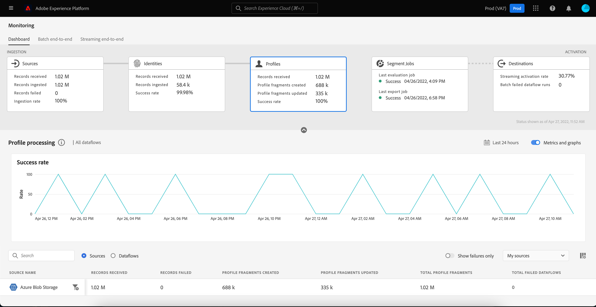

# 在UI中监控用户档案的数据流

实时客户配置文件允许您通过组合来自多个渠道的数据（包括在线、离线、CRM和第三方）来查看每个客户的整体视图。 档案允许您将您的客户数据整合到一个统一视图中，并提供每个客户交互的带时间戳的可操作帐户。

监视仪表板在配置文件中为数据活动提供可视化表示形式，包括数据配置文件的状态。 本教程将介绍如何使用“监控”功能板，通过Experience Platform用户界面监控数据配置文件，从而跟踪配置文件处理的状态。

## 快速入门 {#getting-started}

本指南要求您对Adobe Experience Platform的以下组件有一定的了解：

- [数据流](../home.md)：数据流表示跨Platform移动数据的数据作业。 数据流在不同的服务之间配置，有助于将数据从源连接器移动到目标数据集，以 [!DNL Identity] 和 [!DNL Profile]、和 [!DNL Destinations].
   - [数据流运行](../../sources/notifications.md)：数据流运行是基于所选数据流的频率配置的定期计划作业。
- [Real-time Customer Profile](../../profile/home.md)：根据来自多个来源的汇总数据提供统一的实时使用者个人资料。
- [沙盒](../../sandboxes/home.md)： [!DNL Experience Platform] 提供对单个文件夹进行分区的虚拟沙盒 [!DNL Platform] 将实例安装到单独的虚拟环境中，以帮助开发和改进数字体验应用程序。

## 监控用户档案仪表板 {#profile-metrics}

>[!CONTEXTUALHELP]
>id="platform_monitoring_profile_processing"
>title="配置文件处理"
>abstract="配置文件处理视图包含有关提取到配置文件服务的记录的信息，包括创建的配置文件片段数、更新的配置文件片段数以及配置文件片段总数。"
>text="Learn more in documentation"

>[!CONTEXTUALHELP]
>id="platform_monitoring_dataflow_run_details_profile"
>title="数据流运行详细信息"
>abstract="数据流运行详细信息页面显示有关配置文件数据流运行的更多信息，包括其组织 ID 和数据流运行 ID。"

要访问 **[!UICONTROL 配置文件]** 仪表板，选择 **[!UICONTROL 监控]** 在左侧导航中。 一旦在 **[!UICONTROL 监控]** 页面上，选择 **[!UICONTROL 配置文件]** 卡片。

在主页面上 **[!UICONTROL 配置文件]** 仪表板， **[!UICONTROL 配置文件]** 信息卡显示有关接收的记录总数、创建和更新的配置文件片段的数量，以及创建和更新配置文件片段的成功率的信息。

功能板本身包含有关配置文件处理的量度。 默认情况下，仪表板将显示过去24小时内贵组织来源的个人资料处理详细信息。

此 [!UICONTROL 配置文件处理] 页面包含有关摄取到的记录的信息 [!DNL Profile]，包括已创建的配置文件片段的数量、已更新的配置文件片段以及配置文件片段的总数。

以下指标可用于此仪表板视图：

| 量度 | 描述 |
| -------| ----------- |
| **[!UICONTROL 源名称]** | 源的名称。 |
| **[!UICONTROL 已接收的记录]** | 从数据湖接收的记录数。 |
| **[!UICONTROL 失败的记录]** | 已摄取但未摄取到的记录数 [!DNL Profile] 因为发生错误。 |
| **[!UICONTROL 已创建配置文件片段]** | 净新增数 [!DNL Profile] 已添加片段。 |
| **[!UICONTROL 已更新配置文件片段]** | 现有数量 [!DNL Profile] 片段已更新。 |
| **[!UICONTROL 配置文件片段总数]** | 写入的记录总数 [!DNL Profile]，包括所有现有的 [!DNL Profile] 片段已更新并新 [!DNL Profile] 已创建片段。 |
| **[!UICONTROL 失败的数据流总数]** | 失败的数据流运行次数。 |

您可以选择过滤器图标  位于源名称旁边，可查看所选源的数据流的配置文件处理信息。

或者，您可以选择 **[!UICONTROL 数据流]** 打开该切换可查看过去24小时内贵组织数据流的配置文件处理详细信息。

以下指标可用于此仪表板视图：

| 量度 | 描述 |
| -------| ----------- |
| **[!UICONTROL 数据流]** | 数据流的名称。 |
| **[!UICONTROL 数据集]** | 数据流正在插入的数据集的名称。 |
| **[!UICONTROL 源名称]** | 数据流所属的源的名称。 |
| **[!UICONTROL 已接收的记录**] | 从数据湖接收的记录数。 |
| **[!UICONTROL 失败的记录]** | 已摄取但未摄取到的记录数 [!DNL Profile] 因为发生错误。 |
| **[!UICONTROL 已创建配置文件片段]** | 净新增数 [!DNL Profile] 已添加片段。 |
| **[!UICONTROL 已更新配置文件片段]** | 现有数量 [!DNL Profile] 片段已更新 |
| **[!UICONTROL 配置文件片段总数]** | 写入的记录总数 [!DNL Profile]，包括所有现有的 [!DNL Profile] 片段已更新并新 [!DNL Profile] 已创建片段。 |
| **[!UICONTROL 失败的流运行总数]** | 失败的数据流运行次数。 |
| **[!UICONTROL 上次活动时间]** | 上次运行数据流的时间戳。 |

选择过滤器图标  在数据流运行开始时间旁边，查看有关 [!DNL Profile] 数据流运行。

此 [!UICONTROL 数据流运行详细信息] 页面显示有关 [!DNL Profile] 数据流运行，包括其组织ID和数据流运行ID。 此页面还显示提供的相应错误代码和错误消息。 [!DNL Profile]时，如果摄取过程中发生任何错误。

以下指标可用于此仪表板视图：

| 量度 | 描述 |
| -------| ----------- |
| **[!UICONTROL 已接收的记录]** | 从数据湖接收的记录数。 |
| **[!UICONTROL 失败的记录]** | 已摄取但未摄取到的记录数 [!DNL Profile] 因为发生错误。 |
| **[!UICONTROL 已创建配置文件片段]** | 净新增数 [!DNL Profile] 已添加片段。 |
| **[!UICONTROL 已更新配置文件片段]** | 现有数量 [!DNL Profile] 片段已更新。 |
| **[!UICONTROL 状态]** | 定义数据流的整体状态。 可能的状态值包括： <ul><li>`Success`：指示数据流处于活动状态并根据提供的计划摄取数据。</li><li>`Failed`：指示数据流的激活过程因错误而中断。 </li><li>`Processing`：表示数据流尚未处于活动状态。 创建新数据流后，经常会立即出现此状态。</li></ul> |
| **[!UICONTROL 数据流运行开始]** | 数据流开始运行的日期和时间。 |
| **[!UICONTROL 上次更新时间]** | 上次更新数据流的日期和时间。 |
| **[!UICONTROL 错误摘要]** | 如果数据流运行失败，将显示错误代码并总结数据流运行失败的原因。 |
| **[!UICONTROL 数据流运行ID]** | 数据流运行的ID。 |
| **[!UICONTROL IMS组织ID]** | 数据流运行所属的组织ID。 |

此外，您可以选择切换以查看失败的记录或跳过的记录。 错误部分包括有关错误代码以及失败或排除的记录数的详细信息。
