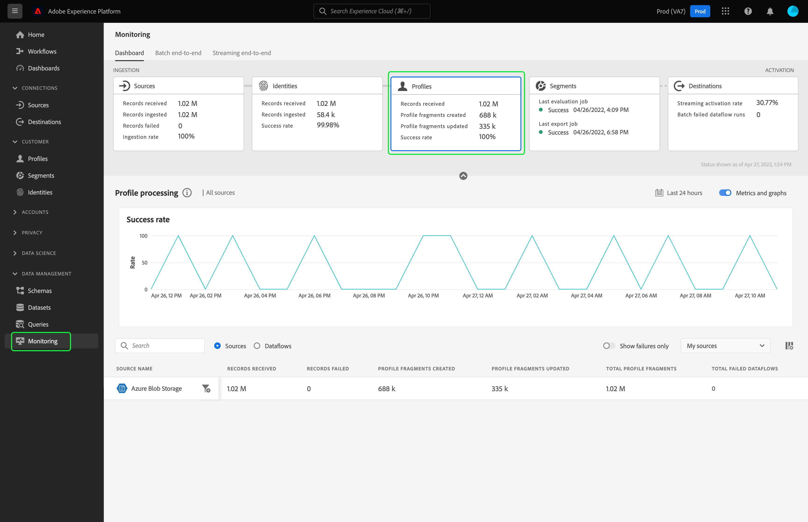

# 在UI中监控配置文件的数据流

“实时客户资料”可通过合并来自多个渠道（包括在线、离线、CRM和第三方）的数据，让您查看每个客户的整体视图。 档案允许您将您的客户数据整合到一个统一视图中，并提供每个客户交互的带时间戳的可操作帐户。

监控功能板可直观地显示用户档案内数据活动的状态，包括数据的用户档案状态。 本教程提供了有关如何使用监控仪表板使用Experience Platform用户界面监控数据配置文件的说明，从而允许您跟踪配置文件处理的状态。

## 快速入门 {#getting-started}

本指南要求您对Adobe Experience Platform的以下组件有一定的了解：

- [数据流](../home.md):数据流是跨平台移动数据的数据作业的表示形式。 数据流是跨不同的服务进行配置的，有助于将数据从源连接器移动到目标数据集，并 [!DNL Identity] 和 [!DNL Profile]和 [!DNL Destinations].
   - [数据流运行](../../sources/notifications.md):数据流运行是基于所选数据流的频率配置的定期计划作业。
- [实时客户资料](../../profile/home.md):根据来自多个来源的汇总数据提供统一的实时客户资料。
- [沙箱](../../sandboxes/home.md): [!DNL Experience Platform] 提供分区单个沙箱的虚拟沙箱 [!DNL Platform] 实例迁移到单独的虚拟环境中，以帮助开发和改进数字体验应用程序。

## 监控用户档案仪表板 {#profile-metrics}

>[!CONTEXTUALHELP]
>id="platform_monitoring_profile_processing"
>title="配置文件处理"
>abstract="配置文件处理视图包含有关摄取到配置文件服务的记录的信息，包括创建的配置文件片段数、更新的配置文件片段以及配置文件片段总数。"
>text="Learn more in documentation"

>[!CONTEXTUALHELP]
>id="platform_monitoring_dataflow_run_details_profile"
>title="数据流运行详细信息"
>abstract="“数据流运行详细信息”页显示有关配置文件数据流运行的详细信息，包括其组织ID和数据流运行ID。"

访问 **[!UICONTROL 用户档案]** 功能板，选择 **[!UICONTROL 监控]** 中。 在 **[!UICONTROL 监控]** 页面，选择 **[!UICONTROL 用户档案]** 卡。

主 **[!UICONTROL 用户档案]** 功能板， **[!UICONTROL 用户档案]** 卡片中显示了有关已接收记录总数、已创建和更新的配置文件片段数以及已创建和更新的配置文件片段成功率的信息。

功能板本身包含有关配置文件处理的量度。 默认情况下，功能板将显示贵组织过去24小时来源的用户档案处理详细信息。

的 [!UICONTROL 配置文件处理] 页面包含有关摄取到的记录的信息 [!DNL Profile]，包括创建的配置文件片段数、更新的配置文件片段数，以及配置文件片段总数。

以下量度可用于此功能板视图：

| 量度 | 描述 |
| -------| ----------- |
| **[!UICONTROL 源名称]** | 源的名称。 |
| **[!UICONTROL 收到的记录]** | 从数据湖接收的记录数。 |
| **[!UICONTROL 记录失败]** | 已摄取但未被摄取的记录数 [!DNL Profile] 错误。 |
| **[!UICONTROL 已创建配置文件片段]** | 新增的净数量 [!DNL Profile] 已添加片段。 |
| **[!UICONTROL 更新了配置文件片段]** | 现有的数量 [!DNL Profile] 片段已更新。 |
| **[!UICONTROL 配置文件片段总数]** | 写入的记录总数 [!DNL Profile]，包括所有现有 [!DNL Profile] 片段已更新并新增 [!DNL Profile] 已创建片段。 |
| **[!UICONTROL 失败的数据流总数]** | 失败的数据流运行数。 |

您可以选择过滤器图标  ，以查看所选源数据流的配置文件处理信息。

或者，您也可以选择 **[!UICONTROL 数据流]** 在切换开关中，查看贵组织过去24小时数据流的配置文件处理详细信息。

以下量度可用于此功能板视图：

| 量度 | 描述 |
| -------| ----------- |
| **[!UICONTROL 数据流]** | 数据流的名称。 |
| **[!UICONTROL 数据集]** | 数据流插入到的数据集的名称。 |
| **[!UICONTROL 源名称]** | 数据流所属的源的名称。 |
| **[!UICONTROL 收到的记录**] | 从数据湖接收的记录数。 |
| **[!UICONTROL 记录失败]** | 已摄取但未被摄取的记录数 [!DNL Profile] 错误。 |
| **[!UICONTROL 已创建配置文件片段]** | 新增的净数量 [!DNL Profile] 已添加片段。 |
| **[!UICONTROL 更新了配置文件片段]** | 现有的数量 [!DNL Profile] 片段已更新 |
| **[!UICONTROL 配置文件片段总数]** | 写入的记录总数 [!DNL Profile]，包括所有现有 [!DNL Profile] 片段已更新并新增 [!DNL Profile] 已创建片段。 |
| **[!UICONTROL 失败的流运行总数]** | 失败的数据流运行数。 |
| **[!UICONTROL 上次活动]** | 数据流上次运行的时间戳。 |

选择过滤器图标  数据流运行开始时间旁边，查看 [!DNL Profile] 数据流运行。

的 [!UICONTROL 数据流运行详细信息] 页面显示 [!DNL Profile] 数据流运行，包括其组织ID和数据流运行ID。 此页还显示相应的错误代码和 [!DNL Profile]，以防摄取过程中发生任何错误。

以下量度可用于此功能板视图：

| 量度 | 描述 |
| -------| ----------- |
| **[!UICONTROL 收到的记录]** | 从数据湖接收的记录数。 |
| **[!UICONTROL 记录失败]** | 已摄取但未被摄取的记录数 [!DNL Profile] 错误。 |
| **[!UICONTROL 已创建配置文件片段]** | 新增的净数量 [!DNL Profile] 已添加片段。 |
| **[!UICONTROL 更新了配置文件片段]** | 现有的数量 [!DNL Profile] 片段已更新。 |
| **[!UICONTROL 状态]** | 定义数据流的整体状态。 可能的状态值包括： <ul><li>`Success`:表示数据流处于活动状态，并正在根据提供的计划摄取数据。</li><li>`Failed`:表示数据流的激活过程因错误而中断。 </li><li>`Processing`:表示数据流尚未处于活动状态。 此状态通常会在创建新数据流后立即出现。</li></ul> |
| **[!UICONTROL 数据流运行开始]** | 数据流开始运行的日期和时间。 |
| **[!UICONTROL 上次更新时间]** | 数据流上次更新的日期和时间。 |
| **[!UICONTROL 错误摘要]** | 如果数据流运行失败，则会显示错误代码和数据流运行失败原因的摘要。 |
| **[!UICONTROL 数据流运行ID]** | 数据流运行的ID。 |
| **[!UICONTROL IMS组织ID]** | 数据流运行所属的组织ID。 |

此外，您还可以选择切换以查看失败的记录或跳过的记录。 错误部分包含有关错误代码和失败或排除的记录数的详细信息。
