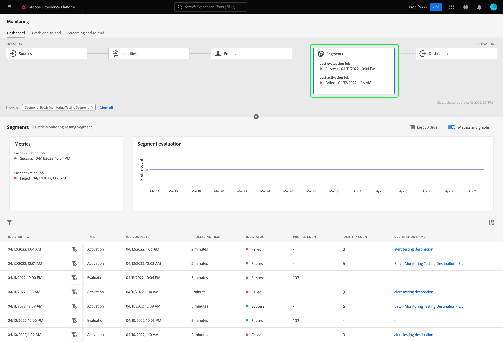

# 在UI中监控区段的数据流

分段服务允许您根据Adobe Experience Platform中的实时客户资料数据创建区段和受众。 平台提供数据流以透明地跟踪从源到目标的数据流。

监控仪表板可直观地显示区段内数据的活动，包括数据分段的状态。 本教程提供了有关如何使用监控仪表板使用Experience Platform用户界面监控数据分段的说明，从而允许您跟踪区段激活、评估和导出作业的状态。

## 快速入门 {#getting-started}

本指南要求您对Adobe Experience Platform的以下组件有一定的了解：

- [数据流](../home.md):数据流是跨平台移动数据的数据作业的表示形式。 数据流是跨不同的服务进行配置的，有助于将数据从源连接器移动到目标数据集，并 [!DNL Identity] 和 [!DNL Profile]和 [!DNL Destinations].
   - [数据流运行](../../sources/notifications.md):数据流运行是基于所选数据流的频率配置的定期计划作业。
- [分段](../../segmentation/home.md):利用分段，可根据实时客户资料数据创建区段和受众。
   - [激活作业](../../destinations/ui/activation-overview.md):激活作业用于将区段激活到指定的目标。
   - [评估作业](../../segmentation/tutorials/evaluate-a-segment.md#evaluate-a-segment):评估作业是一个异步流程，运行该流程会根据指定的区段创建受众区段。
   - [导出作业](../../segmentation/api/export-jobs.md):导出作业是用于将受众区段成员保留到数据集的异步进程。
- [沙箱](../../sandboxes/home.md): [!DNL Experience Platform] 提供分区单个沙箱的虚拟沙箱 [!DNL Platform] 实例迁移到单独的虚拟环境中，以帮助开发和改进数字体验应用程序。

## 监控区段功能板 {#monitoring-segments-dashboard}

>[!CONTEXTUALHELP]
>id="platform_monitoring_segments"
>title="区段"
>abstract="“区段”视图包含有关贵组织所有区段的信息，以及有关其激活和评估作业的更多信息。"

访问 **[!UICONTROL 区段]** 功能板，选择 **[!UICONTROL 监控]** 中。 在 **[!UICONTROL 监控]** 页面，选择 **[!UICONTROL 区段]** 卡。

主 **[!UICONTROL 区段]** 功能板， **[!UICONTROL 区段]** 卡片显示上次评估作业和上次导出作业的状态和日期。

功能板本身包含区段和区段作业的量度。 默认情况下，功能板将显示过去24小时的区段量度。 要了解有关区段作业视图的更多信息，请阅读 [监控区段作业](#monitoring-segment-jobs-dashboard) 中。

>[!IMPORTANT]
>
>当前，仅激活到 [批量（基于文件）目标](../../destinations/destination-types.md#file-based) 支持监控区段功能板。

以下量度可用于此功能板视图：

| 量度 | 描述 |
| ------ | ----------- |
| **[!UICONTROL 区段名称]** | 区段的名称。 |
| **[!UICONTROL 上次评估时间戳]** | 区段上次评估作业运行的日期和时间。 |
| **[!UICONTROL 上次评估状态]** | 区段上次评估作业的状态。 可能的值包括 **[!UICONTROL 成功]**, **[!UICONTROL 无运行]**&#x200B;和 **[!UICONTROL 失败]**. |
| **[!UICONTROL 上次评估用户档案]** | 在区段的上次评估作业中评估的用户档案数。 |
| **[!UICONTROL 上次激活时间戳]** | 区段上次激活作业运行的日期和时间。 |
| **[!UICONTROL 上次激活状态]** | 区段上次激活作业的状态。 可能的值包括 **[!UICONTROL 成功]**, **[!UICONTROL 无运行]**&#x200B;和 **[!UICONTROL 失败]**. |
| **[!UICONTROL 上次激活标识]** | 区段上次激活作业中激活的标识数。 |
| **[!UICONTROL 上次激活目标]** | 区段上次激活作业所激活的目标的名称。 |

您可以通过选择过滤器图标()。区段作业按时间顺序排序，最近的区段作业首先显示。

此时会显示过滤的区段功能板。 的 **[!UICONTROL 区段]** 卡片显示上次评估作业和上次激活作业的状态和日期。

功能板本身显示上次评估和激活作业的时间和状态、显示区段评估的用户档案计数以及运行区段作业的量度的图表。 默认情况下，功能板会显示过去24小时的区段作业量度。

以下量度可用于此功能板视图：

| 量度 | 描述 |
| ------ | ----------- |
| **[!UICONTROL 作业开始]** | 区段作业开始的日期和时间。 |
| **[!UICONTROL 类型]** | 指示区段作业的类型。 支持的作业类型有 **激活** 和 **评价** 作业。 |
| **[!UICONTROL 作业完成]** | 区段作业完成的日期和时间。 |
| **[!UICONTROL 处理时间]** | 区段作业完成所花费的时间。 |
| **[!UICONTROL 作业状态]** | 区段作业的状态。 支持的值包括 **[!UICONTROL 成功]**, **[!UICONTROL 正在进行]**&#x200B;和 **[!UICONTROL 失败]**. |
| **[!UICONTROL 配置文件计数]** | 区段作业正在评估的用户档案数。 每个用户应具有唯一的用户档案。 |
| **[!UICONTROL 身份计数]** | 区段作业正在激活的标识数。 每个用户档案可以具有多个身份。 例如，用户档案可以包含电子邮件、电话号码和会员号码作为身份。 |
| **[!UICONTROL 目标名称]** | 正在激活区段作业的目标名称。 |

您可以进一步过滤特定区段作业，并通过选择过滤器图标()。可以过滤两种不同类型的区段作业：激活作业和评估作业。

### 激活作业详细信息 {#activation-job-details}

“激活作业数据流运行详细信息”页显示有关运行的量度、数据流运行错误以及与区段作业相关的区段的信息。 激活作业用于为指定目标激活区段。 默认情况下，详细信息页显示数据流运行错误。

以下量度可用于此功能板视图：

| 量度 | 描述 |
| ------ | ----------- |
| **[!UICONTROL 收到的配置文件]** | 激活流程中收到的用户档案总数。 |
| **[!UICONTROL 已激活的标识]** | 成功激活到目标的身份总数，基于收到的用户档案。 |
| **[!UICONTROL 排除的标识]** | 根据收到的用户档案，被排除到目标的身份总数。 由于缺少属性或违反同意，可能会排除这些身份。 |
| **[!UICONTROL 数据大小]** | 要激活的数据流的大小。 |
| **[!UICONTROL 文件总数]** | 数据流中正在激活的文件总数。 |
| **[!UICONTROL 状态]** | 激活作业的当前状态。 |
| **[!UICONTROL 数据流运行开始]** | 激活作业开始的日期和时间。 |
| **[!UICONTROL 数据流运行结束]** | 激活作业结束的日期和时间。 |
| **[!UICONTROL 数据流运行ID]** | 当前激活作业的ID。 |
| **[!UICONTROL IMS组织ID]** | 激活作业所属的组织的ID。 |
| **[!UICONTROL 目标名称]** | 要激活数据的目标的名称。 |

在量度下，将显示一个切换开关，用于在数据流运行错误和区段之间进行选择。

在数据流运行错误部分下，选择切换以查看标识失败或标识排除字段。 错误部分包含有关错误代码和失败或排除的标识数的详细信息。

在区段部分下，您可以看到作为激活作业的一部分激活的区段列表。 使用搜索栏可按名称过滤区段列表。

对于区段部分，可使用以下量度：

| 量度 | 描述 |
| ------ | ----------- |
| **[!UICONTROL 名称]** | 已激活的区段的名称。 |
| **[!UICONTROL 已激活的标识]** | 成功激活到目标的身份总数，基于收到的用户档案。 |
| **[!UICONTROL 排除的标识]** | 根据收到的用户档案，被排除到目标的身份总数。 由于缺少属性或违反同意，可能会排除这些身份。 |
| **[!UICONTROL 上次数据流运行状态]** | 为该区段运行的上次激活作业的状态。 |
| **[!UICONTROL 上次数据流运行日期]** | 为该区段运行的上次激活作业的日期和时间。 |

### 评估作业详细信息 {#evaluation-job-details}

评估作业数据流运行详细信息页面显示有关运行的量度和与区段作业相关的区段的信息。 评估作业是一个异步过程，它会根据指定的区段创建受众区段。 要了解有关评估作业的更多信息，请阅读 [评估区段](../../segmentation/tutorials/evaluate-a-segment.md#evaluate-a-segment).

以下量度可用于此功能板视图：

| 量度 | 描述 |
| ------ | ----------- |
| **[!UICONTROL 用户档案总数]** | 正在评估的用户档案总数。 |
| **[!UICONTROL 状态]** | 评估作业的状态。 评估作业的可能状态包括 **[!UICONTROL 成功]** 和 **[!UICONTROL 失败]**. |
| **[!UICONTROL 作业开始]** | 评估作业开始的日期和时间。 |
| **[!UICONTROL 作业结束]** | 评估作业结束的日期和时间。 |
| **[!UICONTROL 作业类型]** | 区段作业的类型。 在这种情况下，它将始终是一项区段评估工作。 |
| **[!UICONTROL 评估类型]** | 正在执行的评估类型。 这可以是 **[!UICONTROL 批次]** 或 **[!UICONTROL 流]**. |
| **[!UICONTROL 作业ID]** | 评估作业的ID。 |
| **[!UICONTROL IMS组织ID]** | 评估作业所属的组织的ID。 |
| **[!UICONTROL 区段名称]** | 正在评估的区段的名称。 |
| **[!UICONTROL 区段ID]** | 正在评估的区段的ID。 |

在区段部分下，您可以看到评估作业中正在评估的区段列表。 您可以使用搜索栏按名称过滤区段列表。

>[!IMPORTANT]
>
>此功能板视图当前支持多达800个区段量度。

对于区段部分，可使用以下量度：

| 量度 | 描述 |
| ------ | ----------- |
| **[!UICONTROL 名称]** | 正在评估的区段的名称。 |
| **[!UICONTROL 配置文件计数]** | 要评估的用户档案数。 |

## 监控区段作业功能板 {#monitoring-segment-jobs-dashboard}

>[!CONTEXTUALHELP]
>id="platform_monitoring_segment_jobs"
>title="区段作业"
>abstract="区段作业视图包含有关所有区段的评估和导出作业的信息。"

访问 **[!UICONTROL 区段作业]** 功能板，选择 **[!UICONTROL 监控]** ()。 在 [!UICONTROL 监控] 页面，选择 **[!UICONTROL 区段作业]**. 的 [!UICONTROL 监控] 功能板包含有关区段评估和导出作业的量度和信息。

>[!NOTE]
>
>仅 **区段评估作业** 支持按区段进行监控。 区段导出作业仅支持组织级别的监控。

使用 [!UICONTROL 区段作业] 功能板，了解配置文件评估和导出是否及时进行，且无任何例外，以便用于目标激活的下游服务可以具有最新评估的配置文件数据。

以下量度可用于区段作业：

| 量度 | 描述 |
---------|----------|
| **[!UICONTROL 区段作业]** | 指示区段作业的名称。 |
| **[!UICONTROL 类型]** | 指示区段作业的类型 — 导出或评估。 请注意，在这两种情况下，区段作业都会评估或导出 **全部** 属于组织的区段。 要了解有关导出作业的更多信息，请阅读 [导出作业端点](../../segmentation/api/export-jobs.md). 要了解有关评估作业的更多信息，请阅读 [评估区段](../../segmentation/tutorials/evaluate-a-segment.md#evaluate-a-segment). |
| **[!UICONTROL 作业开始]** | 区段作业开始的日期和时间。 |
| **[!UICONTROL 作业结束]** | 区段作业完成的日期和时间。 |
| **[!UICONTROL 状态]** | 已完成作业的状态。 区段作业的可能状态包括成功或失败。 |
