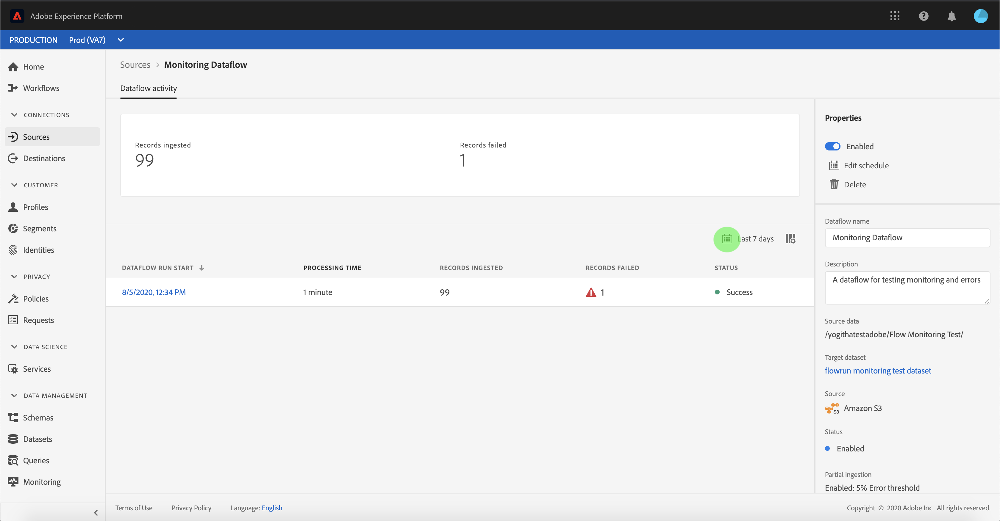
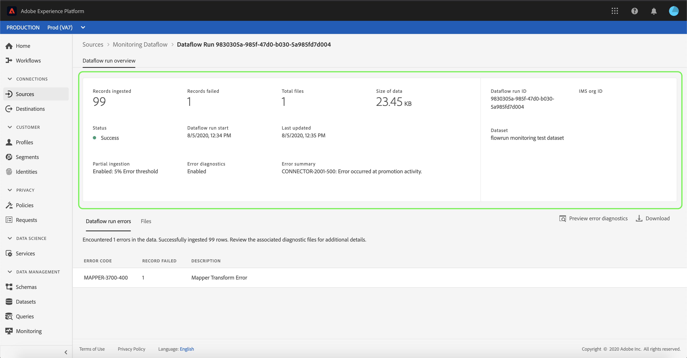

# 监视UI中源的数据流

Adobe Experience Platform的源连接器提供按计划接收外部源数据的能力。 本教程提供了从[!UICONTROL Sources]工作区查看现有数据流的步骤。

## 入门指南

本教程需要对Adobe Experience Platform的以下组件进行有效的理解：

- [来源](../../sources/home.md): [!DNL Experience Platform] 允许从各种来源摄取数据，同时使您能够使用服务来构建、标记和增强传入 [!DNL Platform] 数据。
- [沙箱](../../sandboxes/home.md): [!DNL Experience Platform] 提供将单个实例分为单独的虚 [!DNL Platform] 拟环境的虚拟沙箱，以帮助开发和发展数字体验应用程序。

## 监视数据流

登录[Experience PlatformUI](https://platform.adobe.com)，然后从左侧导航中选择&#x200B;**[!UICONTROL 源]**&#x200B;以访问[!UICONTROL 源]工作区。 从顶部标题中选择&#x200B;**[!UICONTROL 数据流]**&#x200B;以视图现有数据流。

出现一列表现有数据流。 本页是可查看数据流的列表，包括有关其源、用户名、数据流数和状态的信息。

有关状态的详细信息，请参阅下表：

| 状态 | 描述 |
| ------ | ----------- |
| 已启用 | `Enabled`状态指示数据流处于活动状态，并根据所提供的计划接收数据。 |
| 已禁用 | `Disabled`状态指示数据流处于非活动状态且未摄取任何数据。 |
| 处理时间 | `Processing`状态指示数据流尚未处于活动状态。 创建新数据流后，通常会立即遇到此状态。 |
| 错误 | `Error`状态表示数据流的激活进程已中断。 |

选择左上角的漏斗图标进行排序。

将出现排序面板。 从滚动菜单中选择要访问的源，并从右侧的列表中选择数据流。 您还可以选择省略号(`...`)按钮，为所选数据流显示更多可用选项。

“**[!UICONTROL 数据流活动符]**”页包含有关摄取的记录和失败记录数的详细信息，以及有关数据流状态和处理时间的信息。 选择数据流上方的日历图标以调整摄取记录的时间范围。

日历允许您视图不同时间段以获取记录。 您可以选择两个预设选项之一“[!UICONTROL 最近7天]”或“[!UICONTROL 最近30天]”。 或者，也可以使用日历设置自定义时间范围。 选择您选择的时间范围，然后选择&#x200B;**[!UICONTROL 应用]**&#x200B;以继续。

默认情况下，**[!UICONTROL 数据流活动]**&#x200B;显示与数据流关联的&#x200B;**[!UICONTROL 属性]**&#x200B;面板。 从列表中选择流运行以查看其关联的元数据，包括有关其唯一运行ID的信息。

选择&#x200B;**[!UICONTROL 数据流运行开始]**&#x200B;以访问&#x200B;**[!UICONTROL 数据流运行概述]**。

**[!UICONTROL 数据流运行概述]**&#x200B;显示有关数据流的信息，包括其元数据、部分摄取状态和分配的错误阈值。 上标题还包含错误摘要。 **[!UICONTROL 错误摘要]**&#x200B;包含特定的顶级错误，该错误显示摄取过程在哪个步骤遇到错误。

有关&#x200B;**[!UICONTROL 错误摘要]**&#x200B;中可能出现的错误，请参阅下表。

| 错误 | 描述 |
| ---------- | ----------- |
| `CONNECTOR-1001-500` | 从源复制数据时出错。 |
| `CONNECTOR-2001-500` | 将复制的数据处理到[!DNL Platform]时出错。 此错误可能与分析、验证或转换相关。 |

屏幕的下半部分包含有关&#x200B;**[!UICONTROL 数据流运行错误]**&#x200B;的信息。 从此处，您还可以视图所摄取的文件、预览和下载错误诊断，或下载文件清单。

**[!UICONTROL 数据流运行错误]**&#x200B;部分显示错误代码、失败记录数以及描述错误的信息。

选择&#x200B;**[!UICONTROL 预览错误诊断]**&#x200B;以查看有关摄取错误的详细信息。

出现&#x200B;**[!UICONTROL 错误诊断预览]**&#x200B;面板。 此屏幕显示有关摄取失败的特定信息，包括文件名、错误代码、发生错误的列的名称以及错误的说明。

此部分还包含包含错误的列的预览符。

>[!IMPORTANT]
>
>要启用&#x200B;**[!UICONTROL 错误诊断预览]**，在配置数据流时必须激活&#x200B;**[!UICONTROL 部分摄取]**&#x200B;和&#x200B;**[!UICONTROL 错误诊断]**。 这样做将允许系统扫描在流运行期间摄取的所有记录。

预览错误后，您可以从&#x200B;**[!UICONTROL 数据流运行概述]**&#x200B;面板中选择&#x200B;**[!UICONTROL 下载]**&#x200B;以访问完整错误诊断并下载文件清单。 有关详细信息，请参见[错误诊断](../../ingestion/batch-ingestion/partial.md#retrieve-errors)和[下载元数据](../../ingestion/batch-ingestion/partial.md#download-metadata)的文档。

有关监视数据流和摄取的详细信息，请参阅[监视流数据流](../../ingestion/quality/monitor-data-ingestion.md)的教程。

## 后续步骤

通过本教程，您成功访问了&#x200B;**[!UICONTROL Sources]**&#x200B;工作区中的现有帐户和数据流。 现在，下游[!DNL Platform]服务（如[!DNL Real-time Customer Profile]和[!DNL Data Science Workspace]）可以使用传入数据。 有关更多详细信息，请参阅以下文档:

- [实时客户用户档案概述](../../profile/home.md)
- [数据科学工作区概述](../../data-science-workspace/home.md)
