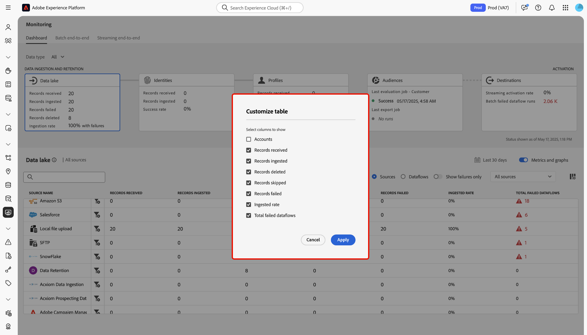

# 监测数据湖引入

>[!IMPORTANT]
>
>监视仪表板当前不支持流源，如[HTTP API源](../../sources/connectors/streaming/http.md)。 目前，您只能使用功能板监控批次源。

您可以使用Adobe Experience Platform用户界面中的监视仪表板检索有关数据湖中的数据摄取和数据保留过程的指标。 使用界面中的图形可监视一段时间内的摄取和保留趋势，并总结所有源数据流的性能。

阅读本文档，了解如何使用监视仪表板监视数据湖中的所有数据处理，包括摄取和保留。

## 快速入门 {#get-started}

本教程需要对以下Adobe Experience Platform组件有一定的了解：

* [数据流](../home.md)：数据流是跨Experience Platform移动数据的数据作业的表示形式。 数据流在不同服务之间配置，帮助将数据从源连接器移动到目标数据集、[!DNL Identity]和[!DNL Profile]以及[!DNL Destinations]。
   * [数据流运行](../../sources/notifications.md)：数据流运行是基于所选数据流的频率配置的周期性计划作业。
* [源](../../sources/home.md)： Experience Platform允许从各种源摄取数据，同时让您能够使用Experience Platform服务来构建、标记和增强传入数据。
* [身份服务](../../identity-service/home.md)：通过跨设备和系统桥接身份，更好地了解个人客户及其行为。
* [实时客户个人资料](../../profile/home.md)：根据来自多个来源的汇总数据提供统一的实时客户个人资料。
* [沙盒](../../sandboxes/home.md)： Experience Platform提供了将单个Experience Platform实例划分为多个单独的虚拟环境的虚拟沙盒，以帮助开发和改进数字体验应用程序。

## 使用监控仪表板进行数据湖摄取

>[!CONTEXTUALHELP]
>id="platform_monitoring_source_ingestion"
>title="源提取"
>abstract="源提取视图包含有关数据湖服务中的数据活动状态和量度的信息，包括提取的记录和失败的记录。查看量度定义指南以了解有关量度和图表的更多信息。"
>text="Learn more in documentation"

>[!CONTEXTUALHELP]
>id="platform_monitoring_dataflow_run_details_ingestion"
>title="数据流运行详细信息"
>abstract="源处理包含有关数据湖服务中的数据活动状态和量度的信息，包括提取的记录和失败的记录。查看量度定义指南以了解有关量度和图表的更多信息。"
>text="Learn more in documentation"

从监视仪表板的主标题中选择&#x200B;**[!UICONTROL Data lake]**&#x200B;以查看您的数据湖摄取率。

[!UICONTROL Ingestion rate]图形根据您配置的时间范围显示您的数据摄取率。 默认情况下，监视功能板显示过去24小时的摄取率。 有关如何配置时间范围的步骤，请阅读[配置监视时间范围](monitor.md#configure-monitoring-time-frame)上的指南。

默认情况下，该图形处于显示状态。 要隐藏图形，请选择&#x200B;**[!UICONTROL Metrics and graphs]**&#x200B;禁用切换并隐藏图形。

功能板的下部显示一个表格，其中概述了所有现有源数据流的当前指标报表。

| 量度 | 描述 |
| --- | --- |
| 已接收的记录 | 从给定源接收的记录总数。 |
| 已提取的记录 | 摄取到数据湖的记录总数。 |
| 删除的记录数 | 由于数据湖保留设置或更改数据捕获操作而删除的记录总数。 |
| 跳过的记录数 | 跳过的记录总数。 跳过的记录是指因不需要进行摄取而被跳过的字段。 例如，如果创建一个启用了部分摄取的源数据流，则可以配置一个可接受的错误率阈值。 在摄取流程中，摄取将跳过非必填字段（例如标识字段）的记录，只要它们在错误阈值内。 |
| 失败的记录 | 由于错误而无法提取的记录总数。 |
| 摄取率 | 根据接收的记录总数摄取的记录百分比。 |
| 失败的数据流总数 | 失败的数据流总数。 |

{style="table-layout:auto"}

您可以使用量度表上方提供的选项进一步筛选数据：

| 筛选选项 | 描述 |
| --- | --- |
| 搜索 | 使用搜索栏将视图筛选为单个源类型。 |
| 源 | 选择&#x200B;**[!UICONTROL Sources]**&#x200B;以筛选视图并显示每种源类型的量度数据。 这是监视仪表板使用的默认显示。 |
| 数据流 | 选择&#x200B;**[!UICONTROL Dataflows]**&#x200B;以筛选视图并显示每个数据流的量度数据。 |
| 仅显示故障 | 选择&#x200B;**[!UICONTROL Show failures only]**&#x200B;以筛选视图，并仅显示报告引入失败的数据流。 |
| 我的源 | 您可以使用[!UICONTROL My sources]下拉菜单进一步筛选视图。 使用下拉菜单按类别筛选视图。 或者，您可以选择&#x200B;**[!UICONTROL All sources]**&#x200B;以在所有或源上显示量度，或者选择&#x200B;**[!UICONTROL My sources]**&#x200B;以仅显示您具有相应帐户的源。 |

{style="table-layout:auto"}

要自定义列显示，请选择列设置图标。

接下来，使用&#x200B;*[!UICONTROL Customize table]*&#x200B;窗口选择要仪表板显示的列。 完成后，选择&#x200B;**[!UICONTROL Apply]**。

要监视特定数据流中摄取的数据，请选择源旁边的过滤器图标。

>[!TIP]
>
>您可以使用监视仪表板监视使用数据保留策略删除的记录的数据删除指标。 有关数据保留的详细信息，请阅读有关[设置数据保留策略](../../catalog/datasets/user-guide.md#data-retention-policy)的指南。

量度表将更新为活动数据流的表，这些数据流对应于您选择的源。 在此步骤中，您可以查看有关数据流的其他信息，包括其相应的数据集和数据类型，以及指示数据流上次处于活动状态的时间戳。

要进一步检查数据流，请选择数据流旁边的过滤器图标。

接下来，您会进入一个界面，其中列出了所选数据流的所有数据流运行迭代。

数据流运行代表数据流执行的实例。 例如，如果数据流计划在上午9:00、上午10:00和上午11:00每小时运行，则您将运行三个流实例。 流量运行特定于您的特定组织。

要检查特定数据流运行迭代的量度，请选择数据流旁边的过滤器图标。

使用数据流运行详细信息页面可查看所选运行迭代的量度和信息。

| 数据流运行详细信息 | 描述 |
| --- | --- |
| 已提取的记录 | 从数据流运行摄取的记录总数。 |
| 失败的记录 | 由于数据流运行中的错误而未摄取的记录总数。 |
| 文件总数 | 数据流运行中的文件总数。 |
| 数据大小 | 数据流运行中包含的数据的总大小。 |
| 数据流运行 ID | 数据流运行迭代的ID。 |
| 组织 ID | 在其中创建数据流运行的组织的ID。 |
| 状态 | 数据流运行的状态。 |
| 数据流运行启动 | 指示数据流运行何时开始的时间戳。 |
| 数据流运行结束 | 指示数据流运行何时结束的时间戳。 |
| 数据集 | 用于创建数据流的数据集。 |
| 数据类型 | 数据流中的数据类型。 |
| 部分摄取 | 部分批量摄取是指在一定可配置阈值内摄取包含错误的数据的能力。 此功能允许您成功地将所有准确的数据提取到Experience Platform中，同时将所有不正确的数据与有关其无效原因的信息单独进行批处理。 您可以在数据流创建过程中启用部分摄取。 |
| 错误诊断 | 错误诊断会指示源生成错误诊断，以便您以后在监视数据集活动和数据流状态时可以参考这些诊断。 您可以在数据流创建过程中启用错误诊断。 |
| 错误摘要 | 给定失败的数据流运行，错误摘要显示错误代码和描述，以总结运行迭代失败的原因。 |

{style="table-layout:auto"}

如果数据流运行报告错误，则可以使用[!UICONTROL Dataflow run errors]界面向下滚动到页面底部。

使用[!UICONTROL Records failed]部分查看因错误而未摄取的记录的量度。 要查看完整的错误报告，请选择&#x200B;**[!UICONTROL Preview error diagnostics]**。 要下载错误诊断和文件清单的副本，请选择&#x200B;**[!UICONTROL Download]**，然后复制要与[!DNL Data Access] API一起使用的示例API调用。

>[!NOTE]
>
>只有在源连接创建过程中启用了特征时，才能使用错误诊断。

## 后续步骤 {#next-steps}

通过学习本教程，您已了解如何使用&#x200B;**[!UICONTROL Monitoring]**&#x200B;仪表板监测数据湖摄取率。 您还了解了如何识别在摄取期间导致数据流失败的错误。 有关更多详细信息，请参阅以下文档：

* [正在监视身份数据](./monitor-identities.md)。
* [正在监视配置文件数据](./monitor-profiles.md)。
