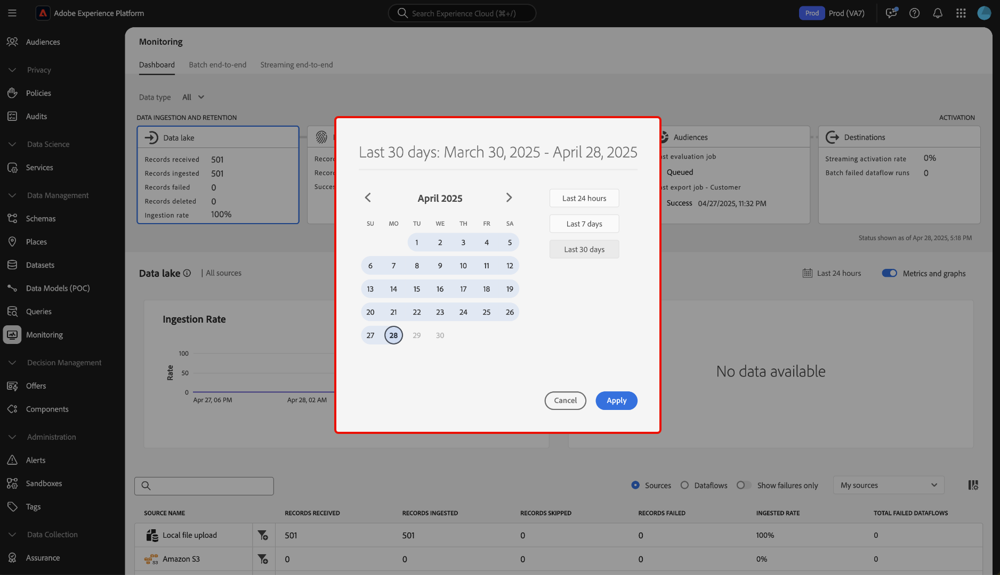

# 监视功能板概述

使用Adobe Experience Platform UI中的监视仪表板查看数据从摄取到激活的历程。 使用监视功能板，您可以：

* 监控您的数据从源、Identity服务、实时客户档案、受众到最终目标的历程。
* 查看不同的量度和状态，具体取决于数据所处的阶段。
* 按数据类型筛选数据监视视图。

监视功能板支持查看几种不同的数据类型：

* **客户和帐户**：客户数据引用[Real-Time Customer Data Platform](../../rtcdp/home.md)中使用的数据，而帐户数据引用[帐户配置文件数据](../../rtcdp/accounts/account-profile-overview.md)，在订阅[Real-Time CDP、B2B edition](../../rtcdp/b2b-overview.md)时可访问这些数据。 如果您的Real-Time CDP许可证不包括Real-Time CDP、B2B edition，那么您只能使用监控功能板来监控客户数据。
* **潜在客户**： [潜在客户配置文件](../../profile/ui/prospect-profile.md)用于表示尚未与您的公司联系但您想联系的人员。 利用潜在客户配置文件，您可以使用来自可信第三方合作伙伴的属性来补充您的客户配置文件。 您必须拥有Real-Time CDP（应用程序服务）、Adobe Experience Platform Activation、Real-Time CDP、Real-Time CDP Prime、Real-Time CDP Ultimate的许可才能查看潜在客户数据类型。
* **帐户配置文件扩充**：通过帐户配置文件，您可以统一来自多个来源的帐户信息。 您必须获得Real-Time CDP、B2B edition的许可，才能监控帐户配置文件扩充数据。

阅读本文档，了解如何使用监控仪表板监控不同Experience Platform服务之间的数据历程。

## 快速入门

本文档要求您对Experience Platform的以下组件有一定的了解：

* [数据流](../home.md)：数据流是跨Experience Platform移动数据的数据作业的表示形式。 您可以使用源工作区创建数据流，以将数据从给定源摄取到Experience Platform。
* [源](../../sources/home.md)：使用Experience Platform中的源从Adobe应用程序或第三方数据源中摄取数据。
* [身份服务](../../identity-service/home.md)：通过跨设备和系统桥接身份，更好地了解个人客户及其行为。
* [实时客户个人资料](../../profile/home.md)：根据来自多个来源的汇总数据提供统一的实时客户个人资料。
* [分段](../../segmentation/home.md)：使用分段服务根据实时客户档案数据创建区段和受众。
* [目标](../../destinations/home.md)：目标是预建的与常用应用程序的集成，可无缝激活Experience Platform中的数据，以用于跨渠道营销活动、电子邮件活动、定向广告和许多其他用例。

## 监视仪表板指南

在Experience Platform UI中，在左侧导航中选择[!UICONTROL 数据管理]下的&#x200B;**[!UICONTROL 监控]**。

选择&#x200B;**[!UICONTROL 数据类型]**，然后使用下拉菜单选择要查看的数据类型。 数据类型由体验数据模型(XDM)架构类定义，以确保将其数据摄取到Experience Platform中时遵循标准格式。 有关更多信息，请访问以下文档：

* [B2B帐户数据类型](../../rtcdp/b2b-tutorial.md)
* [目标客户数据类型](../../rtcdp/partner-data/prospecting.md)

您可以根据以下数据类型筛选视图：

>[!BEGINTABS]

>[!TAB 全部]

选择&#x200B;**[!UICONTROL 全部]**&#x200B;以更新您的仪表板，并显示指定时间段内摄取到Experience Platform的所有数据的指标。

>[!TAB 客户和帐户]

选择&#x200B;**[!UICONTROL 客户和帐户]**&#x200B;以更新您的仪表板，并显示指定时间段内摄取到Experience Platform的客户和帐户数据的指标。

>[!TAB 潜在客户]

选择&#x200B;**[!UICONTROL 潜在客户]**&#x200B;以更新您的仪表板，并显示给定时间段内摄取到Experience Platform的潜在客户数据的指标。 **注意**：只有您[有权使用目标客户数据](../../rtcdp/partner-data/prospecting.md)，才能查看目标客户数据类型活动。

>[!TAB 帐户配置文件扩充]

选择&#x200B;**[!UICONTROL 帐户配置文件扩充]**&#x200B;以更新您的仪表板并显示配置文件扩充数据的量度。 **注意**：如果您有权使用[B2B数据](../../rtcdp/b2b-tutorial.md)，则只能查看帐户配置文件扩充量度。

>[!ENDTABS]

使用功能板的顶部标题可获得跨服务监控体验。 您可以通过从数据类别标题中选择您选择的功能卡来过滤量度和图形视图。

>[!BEGINTABS]

>[!TAB 源]

选择&#x200B;**[!UICONTROL 源]**&#x200B;以查看源摄取率的量度。 有关详细信息，请阅读有关[监视源数据](monitor-sources.md)的指南。

>[!TAB 标识]

选择&#x200B;**[!UICONTROL 身份]**&#x200B;以查看身份数据的处理成功率。 有关详细信息，请阅读有关[监视身份数据](monitor-identities.md)的指南。

>[!TAB 轮廓]

选择&#x200B;**[!UICONTROL 配置文件]**&#x200B;以查看配置文件数据的处理成功率。 有关详细信息，请阅读有关[监视配置文件数据](monitor-profiles.md)的指南。

>[!TAB 受众]

选择&#x200B;**[!UICONTROL 受众]**&#x200B;以查看受众和分段作业的量度。 有关详细信息，请阅读有关[监视受众数据](monitor-audiences.md)的指南。

>[!TAB 目标]

选择&#x200B;**[!UICONTROL 目标]**&#x200B;以查看您的[!UICONTROL 流激活率]和[!UICONTROL 批处理失败的数据流运行]上的量度。 有关详细信息，请阅读有关[监视目标数据](monitor-destinations.md)的指南。

>[!ENDTABS]

### 配置监视时间范围 {#configure-monitoring-time-frame}

默认情况下，监视功能板显示过去24小时内摄取的数据的量度。 要更新时间范围，请选择&#x200B;**[!UICONTROL 最近24小时]**。

您可以在显示的对话框中为数据监视视图配置新的时间范围。 您可以选择创建自定义时间范围，或从预配置选项列表中选择：

* [!UICONTROL 最近24小时]
* [!UICONTROL 最近7天]
* [!UICONTROL 最近30天]

完成后，选择&#x200B;**[!UICONTROL 应用]**。

## 后续步骤

通过阅读本文档，您现在可以在UI中的监视仪表板中导航。 有关如何监视特定Experience Platform服务的数据，请阅读以下文档：

* [监视源数据](monitor-sources.md)。
* [监视身份数据](monitor-identities.md)。
* [监视配置文件数据](monitor-profiles.md)。
* [监视受众数据](monitor-audiences.md)。
* [监视目标数据](monitor-destinations.md)。
