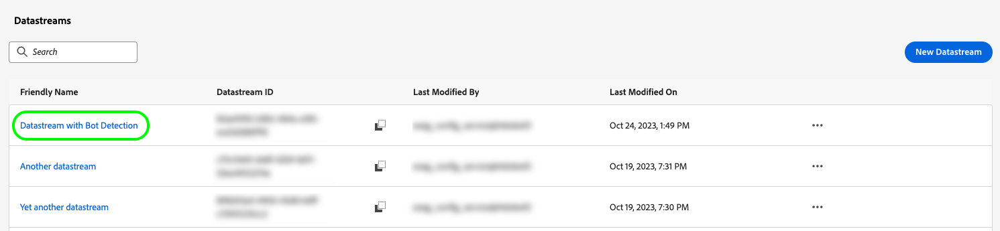
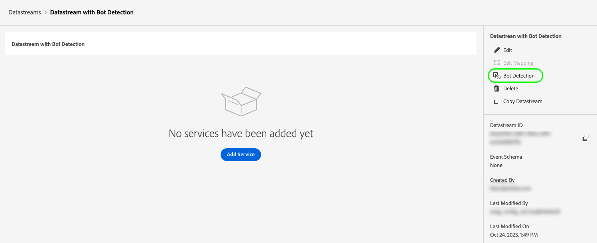
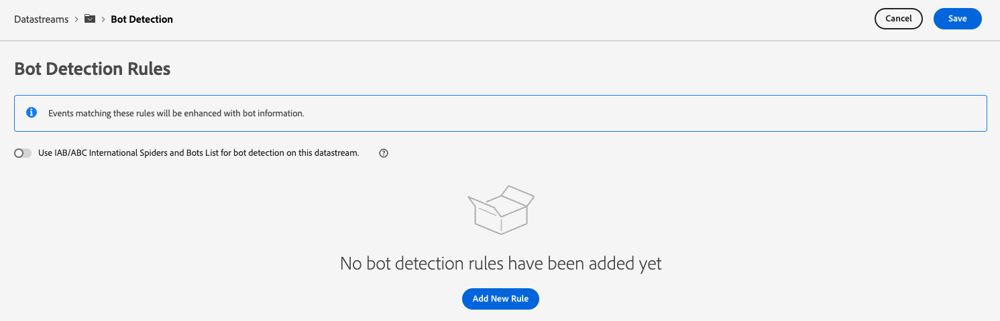
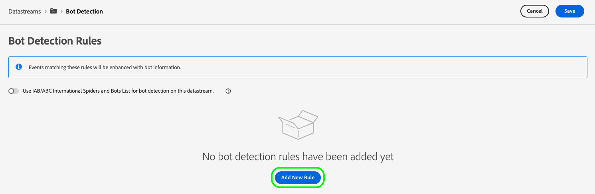
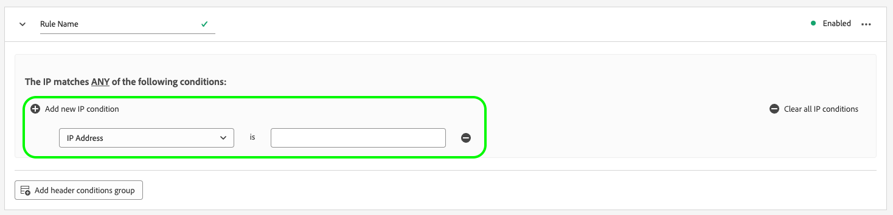
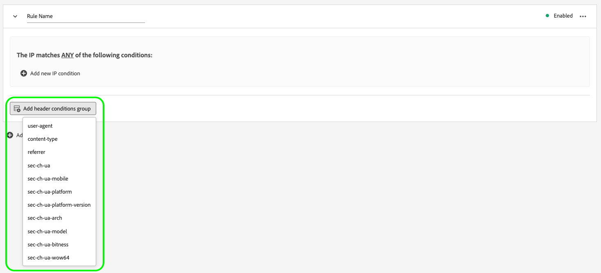
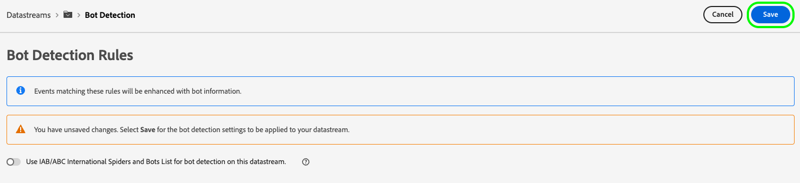
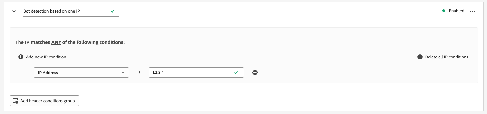
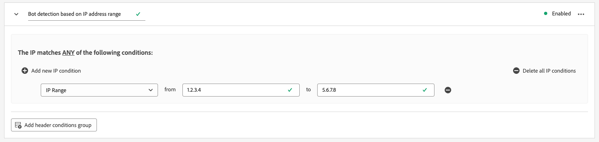
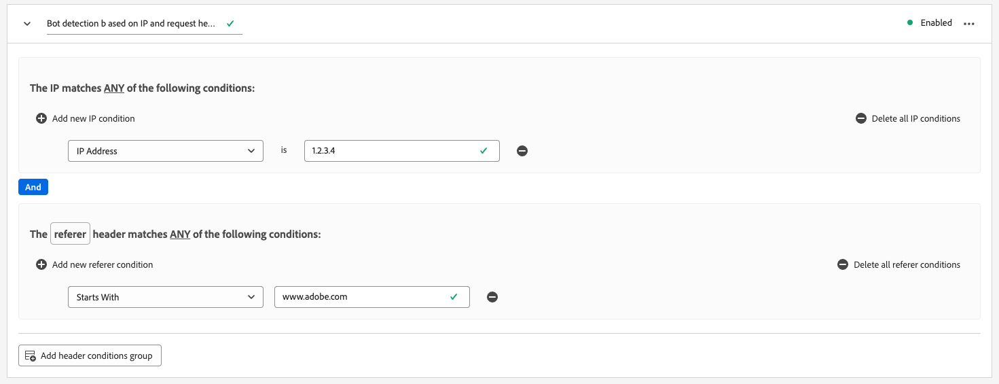

# 为数据流配置机器人检测

来自自动化程序、网页抓取程序、蜘蛛程序和脚本扫描程序的非人为流量可能会使识别来自人为访客的事件变得困难。 这种类型的流量会对重要的业务指标产生负面影响，导致流量报告不正确。

机器人检测允许您识别由[Web SDK](/help/collection/js/js-overview.md)、[Mobile SDK](https://developer.adobe.com/client-sdks/home/)和[[!DNL Edge Network API]](https://developer.adobe.com/data-collection-apis/docs/api/)生成的事件，这些事件是由已知的蜘蛛程序和机器人生成的。

>[!NOTE]
>
>使用[!DNL Bot Detection Service]从您的数据中识别和过滤非人流（机器人）。 这样可以减少收集的数据集中的噪音，并帮助确保您的分析和报表反映真实的用户交互。

通过为数据流配置机器人检测，您可以识别特定的IP地址、IP范围和请求标头，以分类为机器人事件。 这有助于更准确地测量您的网站或移动应用程序上的用户活动。

当对Edge Network的请求与任何机器人检测规则匹配时，XDM架构将更新为机器人得分（始终设置为1），如下所示：

```json
{
  "botDetection": {
    "score": 1
  }
}
```

此机器人评分可帮助接收请求的解决方案正确识别机器人流量。

>[!IMPORTANT]
>
>机器人检测不会丢弃任何机器人请求。 它仅使用机器人评分更新XDM架构，并将事件转发到您配置的[数据流服务](configure.md)。
>
>Adobe解决方案可能会以不同的方式处理机器人评分。 例如，Adobe Analytics使用自己的[机器人过滤服务](https://experienceleague.adobe.com/docs/analytics/admin/admin-tools/manage-report-suites/edit-report-suite/report-suite-general/bot-removal/bot-rules.html?lang=zh-Hans)，而不使用Edge Network设置的分数。 这两个服务使用相同的[IAB机器人列表](https://www.iab.com/guidelines/iab-abc-international-spiders-bots-list/)，因此机器人得分相同。

## 技术注意事项 {#technical-considerations}

在数据流上启用机器人检测之前，请牢记以下几个要点，以确保准确的结果和平顺的实施：

* 机器人检测仅适用于发送给`edge.adobedc.net`的未经身份验证的请求。
* Authenticated requests sent to `server.adobedc.net` are not evaluated for bot traffic, as authenticated traffic is considered trustworthy.
* Bot detection rules can take up to 15 minutes to propagate across the Edge Network after being created.

## 先决条件 {#prerequisites}

For bot detection to work on your datastream, you must add the **[[!UICONTROL [Bot Detection Information]]](../xdm/field-groups/event/bot-detection-information.md)** field group to your schema. See the [XDM schema](../xdm/ui/resources/schemas.md#add-field-groups) documentation to learn how to add field groups to a schema.

## 为数据流配置机器人检测 {#configure}

You can configure bot detection after creating a datastream configuration. See the documentation on how to [create and configure a datastream](configure.md), then follow the instructions below to add bot detection capabilities to your datastream.

Go to the datastreams list and select the datastream to which you want to add bot detection.



In the datastream details page, select the **[!UICONTROL Bot Detection]** option on the right rail.



The **[!UICONTROL Bot Detection Rules]** page is shown.



From the Bot Detection Rules page, you can configure bot detection by using the following functionalities:

* Using the [IAB/ABC International Spiders and Bots List](https://www.iab.com/guidelines/iab-abc-international-spiders-bots-list/).
* Creating your own bot detection rules.

### Use the IAB/ABC International Spiders and Bots List {#iab-list}

The [IAB/ABC International Spiders and Bots List](https://www.iab.com/guidelines/iab-abc-international-spiders-bots-list/) is a third-party, industry-standard list of internet spiders and bots. This list helps you identify automated traffic such as search engine crawlers, monitoring tools, and other nonhuman traffic that you may not want to include in your analytics counts.

To configure your datastream to use the IAB/ABC International Spiders and Bots List:

1. Toggle the **[!UICONTROL Use IAB/ABC International Spiders and Bots List for bot detection on this datastream]** option.
2. Select **[!UICONTROL Save]** to apply the bot detection settings to your datastream.


### Create bot detection rules {#rules}

In addition to using the [IAB/ABC International Spiders and Bots List](https://www.iab.com/guidelines/iab-abc-international-spiders-bots-list/), you can define your own bot detection rules for each datastream.

您可以根据&#x200B;**IP地址**&#x200B;和&#x200B;**IP地址范围**&#x200B;创建机器人检测规则。

如果需要更细粒度的机器人检测规则，可以将IP条件与请求标头条件结合使用。 机器人检测规则可以使用以下标头：

| HTTP 页头 | 描述 |
| --- | --- |
| `user-agent` | 允许服务器和网络对等方识别请求用户代理的应用程序、操作系统、供应商和/或版本的标头。 |
| `content-type` | 指示资源的原始媒体类型（在为发送应用任何内容编码之前）。 |
| `referer` | 标识从中请求资源的网页的地址。 |
| `sec-ch-ua` | 以逗号分隔列表的形式提供与浏览器关联的每个品牌的品牌和重要版本。 |
| `sec-ch-ua-mobile` | 指示浏览器是否位于移动设备上。 桌面浏览器也可以使用此参数来指示移动设备用户体验的偏好设置。 |
| `sec-ch-ua-platform` | 提供运行用户代理的平台或操作系统。 例如：“Windows”或“Android”。 |
| `sec-ch-ua-platform-version` | 提供运行用户代理的操作系统的版本。 |
| `sec-ch-ua-arch` | 提供user-agent的底层CPU体系结构，如ARM或x86。 |
| `sec-ch-ua-model` | 指示运行浏览器的设备型号。 |
| `sec-ch-ua-bitness` | 提供user-agent的底层CPU架构的“位数”。 这是整数或内存地址的大小（通常为64位或32位）。 |
| `sec-ch-ua-wow64` | 指示用户代理二进制文件是否在64位Windows上以32位模式运行。 |

要创建机器人检测规则，请执行以下步骤：

1. 选择 **[!UICONTROL Add New Rule]**。

   

2. 在&#x200B;**[!UICONTROL Rule Name]**&#x200B;字段中键入规则的名称。

   

3. 选择&#x200B;**[!UICONTROL Add new IP condition]**&#x200B;以添加新的基于IP的规则。 您可以按IP地址或IP地址范围定义规则。

   

   

   >[!TIP]
   >
   >IP条件基于逻辑`OR`操作。 如果请求与您定义的任何IP条件相匹配，则将其标记为来自机器人。

4. 如果要向规则添加标头条件，请选择&#x200B;**[!UICONTROL Add header conditions group]**，然后选择要规则使用的标头。

   

   然后，添加要用于所选标头的条件。

   

5. 配置所需的机器人检测规则后，选择&#x200B;**[!UICONTROL Save]**&#x200B;以将规则应用于数据流。

   


## 机器人检测规则示例 {#examples}

为了帮助您开始使用机器人检测，您可以使用下面详述的示例来创建机器人检测规则。

### 基于一个IP地址的机器人检测 {#one-ip}

要将所有来自特定IP地址的请求标记为机器人流量，请创建一个新的机器人检测规则，以评估单个IP地址，如下图所示。



### 基于两个IP地址的机器人检测 {#two-ip}

要将来自两个特定IP地址之一的所有请求标记为机器人流量，请创建一个新的机器人检测规则，该规则将评估两个IP地址，如下图所示。


### 基于IP地址范围的机器人检测 {#range}

要将来自特定范围内任何IP地址的所有请求标记为机器人流量，请创建一个新的机器人检测规则，以评估整个IP地址范围，如下图所示。



### 基于IP地址和请求头的机器人检测 {#ip-header}

要将所有来自特定IP地址并包含特定请求标头的请求标记为机器人流量，请创建新的机器人检测规则，如下图所示。

此规则检查请求是否来自特定IP地址，以及`referer`请求标头是否以`www.adobe.com`开头。



### 基于多种条件的机器人检测 {#multiple-conditions}

您可以根据以下内容创建机器人检测规则：

* **Multiple different conditions**: Different conditions are evaluated as a logical `AND` operation, meaning that the conditions need to be met simultaneously in order for the request to be identified as originating from a bot.
* **Multiple conditions of the same type**: Conditions of the same type are evaluated as a logical `OR` operation, meaning that if any of the conditions are met, the request is identified as originating from a bot.

The rule shown in the image below identifies a bot-originating request if the following conditions are met:

The request originates from either one of the two IP addresses, the `referer` header starts with `www.adobe.com`, and the `sec-ch-ua-mobile` header identifies the request as originating from a desktop browser.


