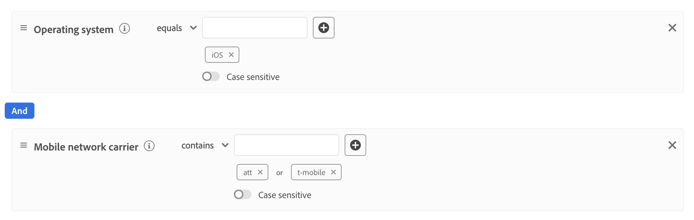

# 创建动态数据流配置

>[!AVAILABILITY]
>
>* 定义动态数据流配置的选项当前存在于Beta中，并且仅供有限数量的客户使用。 要获得此功能的访问权限，请联系您的Adobe代表。 文档和功能可能会发生变化。

默认情况下，Experience Platform Edge Network会将到达数据流的所有事件发送到您为数据流启用的所有Experience Cloud [服务](configure.md#add-services)。 根据您的用例，这可能并不总是您的理想工作流程。

动态数据流配置通过用户可配置的规则集解决此问题，这些规则集可为为数据流启用的每个服务定义，并规定了哪些Experience Cloud解决方案应接收每种类型的数据。

## 先决条件 {#prerequisites}

要为数据流创建动态配置，您必须满足两个条件：

* 您必须已创建&#x200B;*至少*&#x200B;个要处理的数据流。 有关详细信息，请参阅有关如何[创建数据流](configure.md)的文档。
* 您必须向数据流中添加至少&#x200B;*个* Experience Cloud服务。 有关详细信息，请参阅有关如何将服务[添加到数据流](configure.md#add-services)的文档。

创建数据流并向其中添加Experience Cloud服务后，您可以[创建动态配置](#create-dynamic-configuration)。

## 护栏 {#guardrails}

动态数据流配置具有特定的限制和性能约束，以确保最佳系统性能和数据处理效率。 配置动态数据流规则时，以下护栏适用：

| 护栏 | 限制 | 限制类型 |
|---------|------------|------|
| Experience Platform服务的每个数据流的最大动态数据流配置数 | 5 | 性能护栏 |
| 每个数据流用于事件转发的最大动态数据流配置数 | 5 | 性能护栏 |
| Adobe Analytics每个数据流的最大动态数据流配置数 | 5 | 性能护栏 |
| Adobe Target每个数据流的最大动态数据流配置数 | 5 | 性能护栏 |
| Adobe Audience Manager每个数据流的最大动态数据流配置数 | 5 | 性能护栏 |
| 单个规则中可组合的条件（谓词）的最大数量 | 100 | 性能护栏 |
| 超时前每个数据流的所有动态数据流配置评估所允许的最长时间 | 25毫秒 | 系统强制的护栏 |

## 动态数据流配置与数据流配置覆盖 {#dynamic-versus-overrides}

动态数据流配置和[数据流配置覆盖](overrides.md)是互斥功能。

这意味着您不能将动态数据流配置与数据流配置覆盖一起使用。 你必须选择一个或另一个。

如果同时启用动态数据流配置和数据流配置覆盖，则配置覆盖将优先，并且动态数据流配置规则将被忽略。

## 创建动态数据流配置 {#create-dynamic-configuration}

在您[创建了数据流](configure.md)并[向其添加了服务](configure.md#add-services)之后，请按照以下步骤向该服务添加动态配置。

1. 转到&#x200B;**[!UICONTROL 数据收集]** > **[!UICONTROL 数据流]**&#x200B;页面并选择您创建的数据流。

   

1. 选择要为其定义动态配置的服务上的&#x200B;**[!UICONTROL 编辑]**&#x200B;选项。

   

1. 在&#x200B;**[!UICONTROL 配置]**&#x200B;页面中，选择&#x200B;**[!UICONTROL 保存并编辑动态配置]**。

   

1. 选择&#x200B;**[!UICONTROL 添加动态配置]**。

   

1. 从&#x200B;**[!UICONTROL 资源]**&#x200B;面板中，将要用于构建规则的项拖放到窗口的右侧。 您可以合并多个资源以构建复杂的规则。

   使用每个资源的选项（如&#x200B;**[!UICONTROL 等于]**、**[!UICONTROL 不等于]**、**[!UICONTROL 存在]**&#x200B;等）来优化规则。

   

1. 在&#x200B;**[!UICONTROL 配置]**&#x200B;部分中，根据是否希望将数据发送到每个服务，切换要为每个规则启用或禁用的服务。 如果关闭切换开关，服务路由将禁用，*不会向上游服务发送任何数据*。

   

1. 配置完规则后，选择&#x200B;**[!UICONTROL 保存]**。

## 规则优先级注意事项 {#considerations}

您可以为每个动态数据流配置定义多个规则。 但是，如果数据与多个规则的条件匹配，则只考虑列表中的第一个匹配规则，并忽略所有其他匹配规则。

要获得所需的数据路由行为，请注意规则的排列顺序。

要配置规则顺序，您可以按所需的顺序拖放规则窗口。

## 规则资格标准 {#eligibility-criteria}

动态数据流配置必须满足特定的资格标准，以确保高性能、可维护性和清晰性。 以下是定义规则的主要要求和最佳实践。

### 支持的数据类型 {#supported-data-types}

动态数据流配置规则可与特定数据类型配合使用，以确保最佳性能和可靠的数据路由。 了解支持哪些数据类型，有助于创建有效规则以高效地处理数据。

| 数据类型 | 状态 | 注释 |
|-----------|--------|-------|
| 字符串 | 允许 | - |
| 数字（整数、长、短、字节） | 允许 | - |
| 枚举 | 允许 | - |
| 布尔值 | 允许 | - |
| 日期 | 允许 | - |
| 数组 | 不允许 | 不支持基于数组的规则，因为它们可能会降低性能。 |
| 地图 | 不允许 | 不支持基于映射的规则，因为它们可能会降低性能。 |

### 支持的运算符 {#supported-operators}

规则可以使用以下运算符，具体取决于数据类型：

| 数据类型 | 支持的运算符 |
|-----------|-------------------|
| **字符串** | `equals`，`starts with`，`ends with`，`contains`，`exists`，`does not equal`，`does not start with`，`does not end with`，`does not contain`，`does not exist` |
| **数字（长、整数、短、字节）** | `equals`，`does not equal`，`greater than`，`less than`，`greater than or equal to`，`less than or equal to`，`exists`，`does not exist` |
| **布尔值** | `equals true/false`、`does not equal true/false` |
| **枚举** | `equals`、`does not equal`、`exists`、`does not exist` |
| **日期** | `today`、`yesterday`、`this month`、`this year`、`custom date`、`in last`、`from`、`during`、`within`、`before`、`after`、`rolling range`、`in next`、`exists`、`does not exist` |
| **逻辑** | `INCLUDE`，`ANY/ALL` （等同于AND/OR） |

>[!NOTE]
>
>不直接支持&#x200B;**[!UICONTROL EXCLUDE]**&#x200B;运算符，但您可以使用&#x200B;**[!UICONTROL INCLUDE]**&#x200B;与否定的比较运算符实现等效逻辑（例如，“不等于”）。

### 规则结构 {#rule-structure}

在为动态数据流配置创建规则时，了解确保最佳性能和系统兼容性的结构要求至关重要。 规则结构将直接影响系统处理和路由数据的效率。

**仅使用平面表达式**。 必须将规则定义为平面逻辑表达式。 不支持嵌套的逻辑表达式（使用容器或多个级别的AND/OR）。 如果需要复杂的逻辑，请将其分解为多个扁平规则。

例如，请考虑下图中显示的复杂规则。

您可以将此规则划分为以下更简单的规则：

**避免复杂的规则**。 更简单的规则可确保更快的评估和更好的可维护性。

### 最佳实践 {#best-practices}

创建动态数据流配置规则时，遵循最佳实践可确保最佳性能、系统可靠性和可维护配置。 这些准则可帮助您避免常见的陷阱并创建与平台的架构无缝配合的高效规则。

* **保持规则简单平整。**&#x200B;如果需要表达复杂的逻辑，请使用多个规则而不是嵌套。
* **仅使用[支持的数据类型](#supported-data-types)和[运算符](#supported-operators)。**
* **测试您的规则性能。**&#x200B;过于复杂或不支持的规则可能会导致系统拒绝这些规则或影响系统性能。

