# 创建和配置数据流

本文档介绍了在 UI 中配置[数据流](./overview.md)的步骤。

## 访问[!UICONTROL Datastreams]工作区

通过在左侧导航中选择&#x200B;**[!UICONTROL Datastreams]**，您可以在数据收集UI或Experience Platform UI中创建和管理数据流。

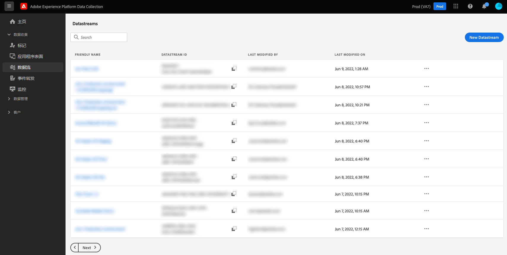

**[!UICONTROL Datastreams]**&#x200B;选项卡显示现有数据流的列表，包括其友好名称、ID和上次修改日期。 要[查看其详细信息并配置服务](#view-details)，请选择数据流的名称。

要显示特定数据流的更多选项，请选择“更多”图标(**...**)。 要更新数据流的[基本配置](#configure)，请选择&#x200B;**[!UICONTROL Edit]**。 要删除数据流，请选择&#x200B;**[!UICONTROL Delete]**。

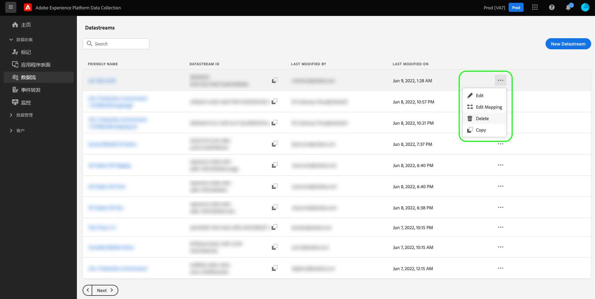

## 创建数据流 {#create}

要创建数据流，请选择&#x200B;**[!UICONTROL New Datastream]**&#x200B;开始。

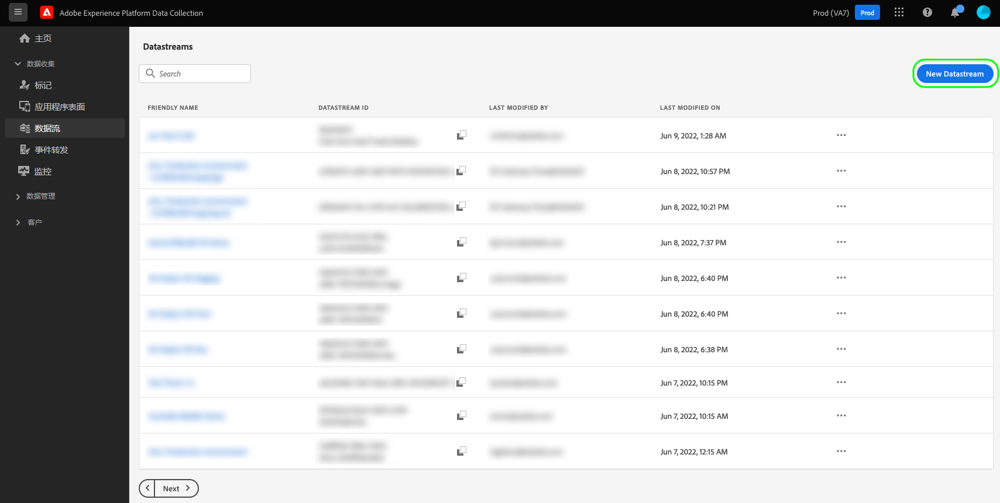

数据流创建工作流随即出现，从配置步骤开始。从该位置，您必须提供数据流的名称和可选描述。

如果配置数据流以在Experience Platform中使用，并且还使用Web SDK，则还必须选择基于[事件的体验数据模型(XDM)架构](../xdm/classes/experienceevent.md)来表示您计划引入的数据。

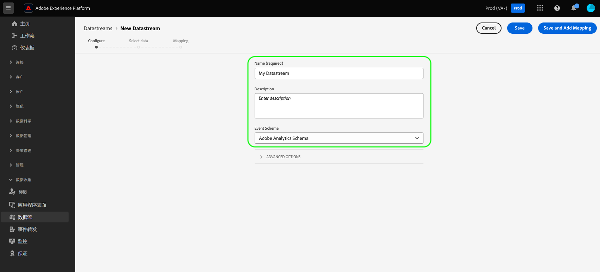

### 配置地理位置和网络查找 {#geolocation-network-lookup}

地理位置和网络查找设置可帮助您定义要收集的地理和网络级别数据的粒度级别。

展开&#x200B;**[!UICONTROL Geolocation and network lookup]**&#x200B;部分以配置下述设置。

| 设置 | 描述 |
| --- | --- |
| [!UICONTROL Geo Lookup] | 根据访客的IP地址为所选选项启用地理位置查找。 可用选项包括： <ul><li>**国家/地区**：填充`xdm.placeContext.geo.countryCode`</li><li>**邮政编码**：填充`xdm.placeContext.geo.postalCode`</li><li>**州/省**：填充`xdm.placeContext.geo.stateProvince`</li><li>**DMA**：填充`xdm.placeContext.geo.dmaID`</li><li>**城市**：填充`xdm.placeContext.geo.city`</li><li>**纬度**：填充`xdm.placeContext.geo._schema.latitude`</li><li>**经度**：填充`xdm.placeContext.geo._schema.longitude`</li></ul>选择&#x200B;**[!UICONTROL City]**、**[!UICONTROL Latitude]**&#x200B;或&#x200B;**[!UICONTROL Longitude]**&#x200B;可提供最多两个小数点的坐标，而不管选择了什么其他选项。 这被视为城市级别的粒度。   不选择任何选项将禁用地理位置查找。 地理位置发生在[!UICONTROL IP Obfuscation]之前，这意味着它不受[!UICONTROL IP Obfuscation]设置的影响。 |
| [!UICONTROL Network Lookup] | 根据访客的IP地址启用所选选项的网络查找。 可用选项包括： <ul><li>**移动设备运营商**：填充`xdm.environment.carrier`</li><li>**域**：填充`xdm.environment.domain`</li><li>**ISP**：填充`xdm.environment.ISP`</li><li>**连接类型**：填充`xdm.environment.connectionType`</li></ul> |

如果您为数据收集启用以上任何字段，请确保在配置Web SDK时正确设置[`context`](/help/collection/js/commands/configure/context.md)数组属性。

地理位置查找字段使用`context`数组字符串`"placeContext"`，而网络查找字段使用`context`数组字符串`"environment"`。

此外，请确保架构中存在每个所需的XDM字段。 如果不包含，您可以将Adobe提供的`Environment Details`字段组添加到您的架构中。

### 配置设备查找 {#geolocation-device-lookup}

**[!UICONTROL Device Lookup]**&#x200B;设置允许您选择要收集的特定于设备的信息。

展开&#x200B;**[!UICONTROL Device Lookup]**&#x200B;部分以配置下述设置。

>[!IMPORTANT]
>
>下表中所示的设置是互斥的。 不能同时选择用户代理信息&#x200B;*和*&#x200B;设备查找数据。

| 设置 | 描述 |
| --- | --- |
| **[!UICONTROL Keep user agent and client hints headers]** | 选择此选项可仅收集用户代理字符串中存储的信息。 默认情况下，此设置处于选中状态。 填充`xdm.environment.browserDetails.userAgent` |
| **[!UICONTROL Use device lookup to collect the following information]** | 如果要收集以下一个或多个特定于设备的信息，请选择此选项： <ul><li>**[!UICONTROL Device]**&#x200B;信息：<ul><li>**设备制造商**：填充`xdm.device.manufacturer`</li><li>**设备模型**：填充`xdm.device.modelNumber`</li><li>**营销名称**：填充`xdm.device.model`</li></ul></li><li>**[!UICONTROL Hardware]**&#x200B;信息： <ul><li>**硬件类型**：填充`xdm.device.type`</li><li>**显示高度**：填充`xdm.device.screenHeight`</li><li>**显示宽度**：填充`xdm.device.screenWidth`</li><li>**显示颜色深度**：填充`xdm.device.colorDepth`</li></ul></li><li>**[!UICONTROL Browser]**&#x200B;信息： <ul><li>**浏览器供应商**：填充`xdm.environment.browserDetails.vendor`</li><li>**浏览器名称**：填充`xdm.environment.browserDetails.name`</li><li>**浏览器版本**：填充`xdm.environment.browserDetails.version`</li></ul></li><li>**[!UICONTROL Operating system]**&#x200B;信息： <ul><li>**OS供应商**：填充`xdm.environment.operatingSystemVendor`</li><li>**OS名称**：填充`xdm.environment.operatingSystem`</li><li>**OS版本**：填充`xdm.environment.operatingSystemVersion`</li></ul></li></ul>无法收集设备查找信息以及用户代理和客户端提示。 选择收集设备信息会禁用用户代理和客户端提示的收集，反之亦然。 |
| **[!UICONTROL Do not collect any device information]** | 如果不想收集任何设备查找信息，请选择此选项。 未收集任何设备、硬件、浏览器、操作系统、用户代理或客户端提示数据。 |

如果您为数据收集启用以上任何字段，请确保在配置Web SDK时正确设置[`context`](/help/collection/js/commands/configure/context.md)数组属性。

设备和硬件信息使用`context`数组字符串`"device"`，而浏览器和操作系统信息使用`context`数组字符串`"environment"`。

此外，请确保架构中存在每个所需的XDM字段。 如果不包含，您可以将Adobe提供的`Environment Details`字段组添加到您的架构中。

### 配置高级选项 {#advanced-options}

要显示高级配置选项，请选择&#x200B;**[!UICONTROL Advanced Options]**。 在这里，您可以配置其他数据流设置，如IP模糊处理、第一方ID Cookie等。

>[!IMPORTANT]
>
> 您有责任确保已获得适用法律和法规规定的收集、处理和传输个人数据（包括精确的地理位置信息）所需的所有必要权限、同意、许可和授权。
> 
> 您的IP地址模糊处理选择不会影响从IP地址派生并发送到配置的Adobe解决方案的地理位置信息级别。 必须单独限制或禁用地理位置查找。

| 设置 | 描述 |
| --- | --- |
| [!UICONTROL IP Obfuscation] | 指示要应用于数据流的 IP 模糊处理的类型。任何基于客户IP的处理都受IP模糊设置的影响。 这包括从您的数据流接收数据的所有Experience Cloud服务。 IP模糊处理发生在将事件发送到任何下游服务（如数据准备）之前。 
可用选项：
 <ul><li>**[!UICONTROL None]**：禁用IP模糊处理。 完整用户IP地址通过数据流发送。</li><li>**[!UICONTROL Partial]**：对于IPv4地址，模糊处理用户IP地址的最后八位字节。 对于 IPv6 地址，对地址的最后 80 位进行模糊处理。 
示例：
 <ul><li>IPv4：`1.2.3.4` -> `1.2.3.0`</li><li>IPv6：`2001:0db8:1345:fd27:0000:ff00:0042:8329` -> `2001:0db8:1345:0000:0000:0000:0000:0000`</li></ul></li><li>**[!UICONTROL Full]**：混淆整个IP地址。 
示例：
 <ul><li>IPv4：`1.2.3.4` -> `0.0.0.0`</li><li>IPv6：`2001:0db8:1345:fd27:0000:ff00:0042:8329` -> `0:0:0:0:0:0:0:0`</li></ul></li></ul> IP 模糊处理对其他 Adobe 产品的影响： <ul><li>**Adobe Target**：在Adobe Target中执行[!UICONTROL IP obfuscation]之前，将数据流级别[!UICONTROL IP obfuscation]应用于请求中存在的所有IP地址。 例如，如果数据流级别[!UICONTROL IP obfuscation]选项设置为&#x200B;**[!UICONTROL Full]**，而Adobe Target IP模糊处理选项设置为&#x200B;**[!UICONTROL Last octet obfuscation]**，则Adobe Target会收到完全模糊处理的IP。 如果数据流级别[!UICONTROL IP obfuscation]选项设置为&#x200B;**[!UICONTROL Partial]**，而Adobe Target IP模糊处理选项设置为&#x200B;**[!UICONTROL Full]**，则Adobe Target会收到一个部分模糊处理的IP，然后对其应用完全模糊处理。 Adobe Target IP模糊处理是独立于数据流进行管理的。 请参阅介绍 [IP 模糊处理](https://experienceleague.adobe.com/docs/target-dev/developer/implementation/privacy/privacy.html?lang=zh-Hans)和[地理定位](https://experienceleague.adobe.com/docs/target/using/audiences/create-audiences/categories-audiences/geo.html?lang=zh-Hans)的 Adobe Target 文档以了解更多详细信息。</li><li>**Audience Manager**：在Audience Manager中执行[!UICONTROL IP obfuscation]之前，将数据流级别[!UICONTROL IP obfuscation]设置应用于请求中存在的所有IP地址。 Audience Manager执行的任何地理位置查找都受数据流级别[!UICONTROL IP obfuscation]选项影响。 在Audience Manager中，基于完全模糊处理的IP的地理位置查找会生成未知区域，并且任何基于生成的地理位置数据的区段都不会实现。 请参阅介绍 [IP 模糊处理](https://experienceleague.adobe.com/docs/audience-manager/user-guide/features/administration/ip-obfuscation.html?lang=zh-Hans)的 Audience Manager 文档以了解更多详细信息。</li><li>**Adobe Analytics**：如果数据流级别的IP模糊处理设置设置为&#x200B;**[!UICONTROL Full]**，Adobe Analytics会将IP地址视为空白。 这会影响任何依赖于IP地址的Analytics处理，例如地理位置查找和IP过滤。 要让Analytics接收未模糊处理或部分模糊处理的IP地址，请将IP模糊处理设置设置为&#x200B;**[!UICONTROL Partial]**&#x200B;或&#x200B;**[!UICONTROL None]**。 在Analytics中，可以进一步对部分模糊处理和未模糊处理的IP地址进行模糊处理。 有关如何在Analytics中启用IP模糊处理的详细信息，请参阅Adobe Analytics [文档](https://experienceleague.adobe.com/docs/analytics/admin/admin-tools/manage-report-suites/edit-report-suite/report-suite-general/general-acct-settings-admin.html?lang=zh-Hans)。 如果IP地址被完全模糊处理，并且页面点击既没有[!DNL ECID]也没有[!DNL VisitorID]，则Analytics将丢弃该点击，而不是生成一个部分基于IP地址的[回退ID](https://experienceleague.adobe.com/docs/id-service/using/reference/analytics-reference/analytics-ids.html?lang=zh-Hans)。</li><li>**Adobe Advertising**：当数据流级别的IP模糊处理设置为[!UICONTROL Partial]或[!UICONTROL Full]时，Advertising DSP中禁用了地理报告和功能（包括测量和重定位），但连接的电视广告除外。</li></ul> |
| [!UICONTROL First Party ID Cookie] | 启用后，此设置将告知 Edge Network 在查找[第一方设备 ID](/help/collection/use-cases/identity/first-party-device-ids.md) 时引用指定的 Cookie，而不是在“身份标识映射”中查找该值。  在启用此设置时，必须提供应存储ID的Cookie的名称。 |
| [!UICONTROL Third Party ID Sync] | ID 同步可分组到容器中，以允许不同的 ID 同步在不同时间运行。启用后，此设置可让您指定为该数据流运行哪个 ID 同步容器。 |
| [!UICONTROL Third Party ID Sync Container ID] | 要用于第三方 ID 同步的容器的数字 ID。 |
| [!UICONTROL Container ID Overrides] | 在此部分中，您可以定义其他第三方ID同步容器ID，以将其用于覆盖默认ID。 |
| [!UICONTROL Access Type] | 为数据流定义 Edge Network 接受的身份验证类型。 <ul><li>**[!UICONTROL Mixed Authentication]**：选择此选项时，Edge Network将同时接受经过身份验证的请求和未经过身份验证的请求。 当您计划使用Web SDK或[Mobile SDK](https://developer.adobe.com/client-sdks/home/)以及[Edge Network API](https://developer.adobe.com/data-collection-apis/docs/api/)时，请选择此选项。 </li><li>**[!UICONTROL Authenticated Only]**：选择此选项时，Edge Network仅接受经过身份验证的请求。 当您计划仅使用Edge Network API并且希望阻止Edge Network处理任何未经身份验证的请求时，请选择此选项。</li></ul> |
| [!UICONTROL Media Analytics] | 通过Experience Platform SDK或[Media Edge API](https://developer.adobe.com/cja-apis/docs/endpoints/media-edge/getting-started/)启用对Edge Network集成的流跟踪数据的处理。 从[文档](https://experienceleague.adobe.com/docs/media-analytics/using/media-overview.html?lang=zh-Hans)了解Media Analytics。 |

从此处，如果您正在为Experience Platform配置数据流，请先按照[为数据收集准备数据](./data-prep.md)上的教程将数据映射到Experience Platform事件架构，然后再返回本指南。 否则，请选择&#x200B;**[!UICONTROL Save]**&#x200B;并继续下一节。

>[!NOTE]
>
>保存对数据流配置的更改后，最多需要35分钟才能将更改传播到整个Edge Network。 在此传播窗口内，仍可以使用以前的配置为请求提供服务。

## 查看数据流详细信息 {#view-details}

在配置新的数据流或选择要查看的现有数据流后，将显示该数据流的详细信息页面。在该页面中，可以找到有关数据流的更多信息，包括其 ID。

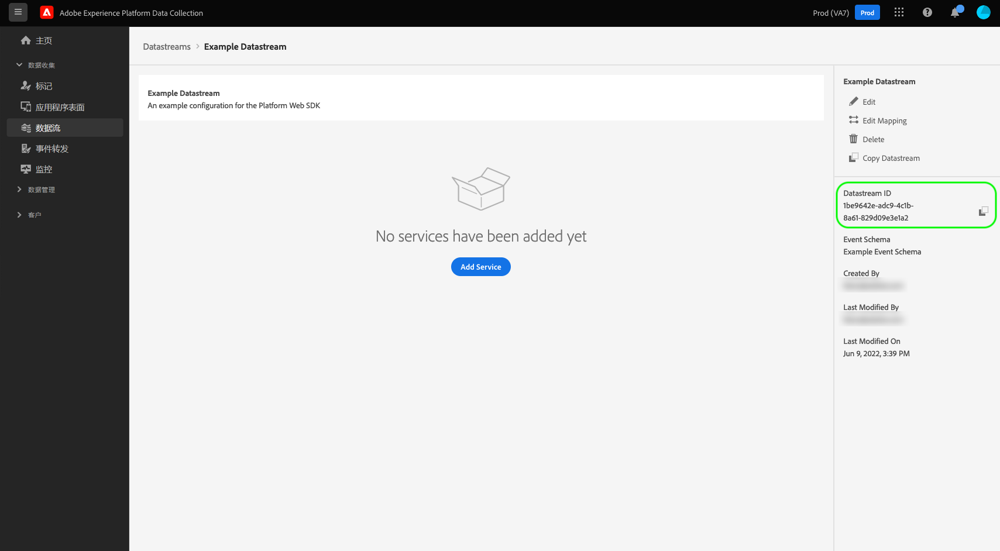

从数据流详细信息屏幕中，可以[添加服务](#add-services)以启用您有权访问的 Adobe Experience Cloud 产品中的功能。您还可以编辑数据流的[基本配置](#create)、更新其[映射规则](./data-prep.md)、[复制数据流](#copy)或将其完全删除。

## 将服务添加到数据流 {#add-services}

在数据流的详细信息页面上，选择&#x200B;**[!UICONTROL Add Service]**&#x200B;以开始为该数据流添加可用服务。

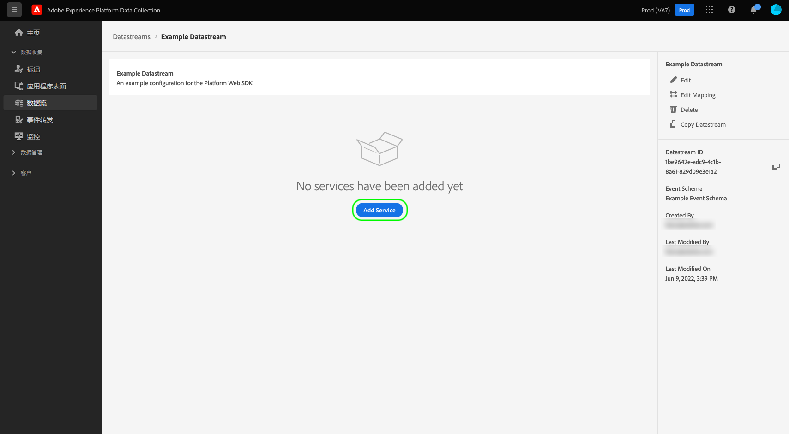

在下一个屏幕上，使用下拉菜单选择要为此数据流配置的服务。此列表中仅显示您有权访问的服务。

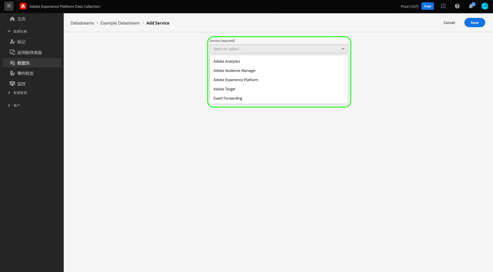

选择所需的服务，填写显示的配置选项，然后选择&#x200B;**[!UICONTROL Save]**&#x200B;将该服务添加到数据流。 所有添加的服务都会显示在数据流的详细信息视图中。

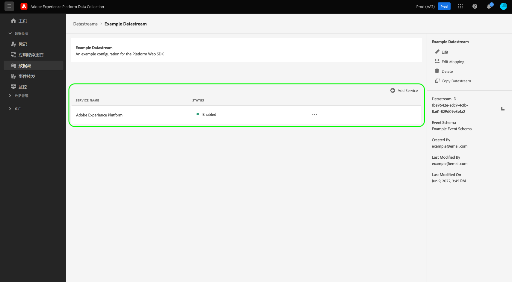

以下子部分描述了每项服务的配置选项。

>[!NOTE]
>
>每个服务配置都包含一个&#x200B;**[!UICONTROL Enabled]**&#x200B;切换开关，该开关在选择服务时自动激活。 要为此数据流禁用所选服务，请再次选择&#x200B;**[!UICONTROL Enabled]**&#x200B;切换开关。

### Adobe Advertising设置 {#advertising}

Adobe Advertising与Customer Journey Analytics集成需要此服务。

### Adobe Analytics 设置 {#analytics}

此服务控制是否以及如何将数据发送到Adobe Analytics。

| 设置 | 描述 |
| --- | --- |
| [!UICONTROL Report Suite ID] | **（必需）**&#x200B;要将数据发送到的 Analytics 报表包的 ID。此ID可在Adobe Analytics UI中的[!UICONTROL Admin] > [!UICONTROL ReportSuites]下找到。 如果指定了多个报表包，则数据将复制到每个报表包。 |
| [!UICONTROL Visitor ID namespace] | （可选）要用于Adobe Analytics [visitorID](https://experienceleague.adobe.com/docs/analytics/implementation/vars/config-vars/visitorid.html?lang=zh-Hans)的命名空间。 当您发送一个具有为此命名空间指定的值的事件时，它将自动用作Analytics中的`visitorID`。 |
| [!UICONTROL Report Suite Overrides] | 在此部分中，您可以添加其他报表包 ID，它们可用于覆盖默认报表包 ID。 |

有关详细信息，请参阅Analytics实施指南中的[使用Edge Network实施Adobe Analytics](https://experienceleague.adobe.com/zh-hans/docs/analytics/implementation/aep-edge/overview)。

### Adobe Audience Manager 设置 {#audience-manager}

此服务控制数据是否以及如何发送到 Adobe Audience Manager。只需启用此部分即可将数据发送到 Audience Manager。其他设置是可选的，但建议使用。

| 设置 | 描述 |
| --- | --- |
| [!UICONTROL Cookie Destinations Enabled] | 允许 SDK 通过 [Cookie 目标](https://experienceleague.adobe.com/docs/audience-manager/user-guide/features/destinations/custom-destinations/create-cookie-destination.html?lang=zh-Hans)从 [!DNL Audience Manager] 共享区段信息。 |
| [!UICONTROL URL Destinations Enabled] | 允许 SDK 通过 [URL 目标](https://experienceleague.adobe.com/docs/audience-manager/user-guide/features/destinations/custom-destinations/create-url-destination.html?lang=zh-Hans)从 [!DNL Audience Manager] 共享区段信息。 |

### Adobe Experience Platform 设置 {#aep}

>[!IMPORTANT]
>
>为Experience Platform启用数据流时，请注意您当前使用的Experience Platform沙盒，如UI顶部功能区中所示。
>
>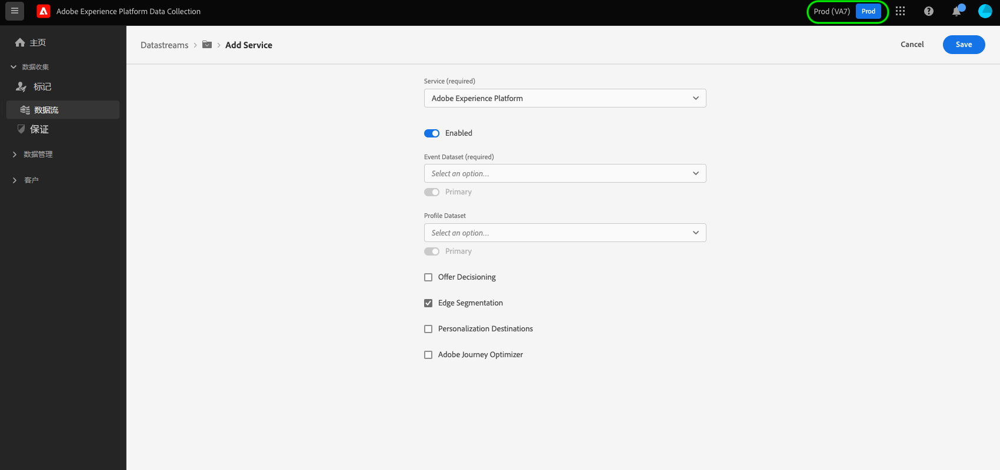
>
>沙盒是 Adobe Experience Platform 中的虚拟分区，可让您将您的数据和实施与组织中的其他数据和实施隔离开来。一旦创建数据流，其沙盒便无法更改。有关沙盒在 Experience Platform 中发挥的作用的更多详细信息，请参阅[沙盒文档](../sandboxes/home.md)。

此服务控制数据是否以及如何发送到 Adobe Experience Platform。

| 设置 | 描述 |
|---| --- |
| [!UICONTROL Event Dataset] | **（必需）**&#x200B;选择要将客户事件数据流式传输到的Experience Platform数据集。 此架构必须使用 [XDM ExperienceEvent 类](../xdm/classes/experienceevent.md)。要添加其他数据集，请选择&#x200B;**[!UICONTROL Add Event Dataset]**。 |
| [!UICONTROL Profile Dataset] | 选择将用于发送&#x200B;**同意**、**推送令牌**&#x200B;和&#x200B;**用户活动区域**&#x200B;客户属性的Experience Platform数据集。 此架构必须使用 [XDM 单个轮廓类](../xdm/classes/individual-profile.md)。 |
| [!UICONTROL Offer Decisioning] | 为Web SDK实施启用[Offer Decisioning](https://experienceleague.adobe.com/docs/journey-optimizer/using/offer-decisioning/get-started-decision/starting-offer-decisioning.html?lang=zh-Hans)。 |
| [!UICONTROL Edge Segmentation] | 为此数据流启用[边缘分段](../segmentation/methods/edge-segmentation.md)。 当Web SDK或[Edge Network API](https://developer.adobe.com/data-collection-apis/docs/api/)通过启用了边缘分段的数据流发送数据时，相关用户档案的任何更新受众成员资格都会在响应中发送回。  您可以通过&#x200B;**Edge目标**、[Personalization](../destinations/ui/activate-edge-personalization-destinations.md)、[Offer Decisioning](https://experienceleague.adobe.com/zh-hans/docs/journey-optimizer/using/decisioning/offer-decisioning/get-started-decision/starting-offer-decisioning)或[Adobe Journey Optimizer](https://experienceleague.adobe.com/zh-hans/docs/target)，将此选项与[Adobe Target目标](https://experienceleague.adobe.com/zh-hans/docs/journey-optimizer/using/ajo-home)结合用于同页和下一页个性化用例 |
| [!UICONTROL Personalization Destinations] | 为此数据流启用[自定义Personalization](../destinations/catalog/personalization/custom-personalization.md)。 当Web SDK或[Edge Network API](https://developer.adobe.com/data-collection-apis/docs/api/)通过启用了个性化目标的数据流发送数据时，相关配置文件的受众成员资格和映射的配置文件属性(仅适用于经过身份验证的[Edge Network API](https://developer.adobe.com/data-collection-apis/docs/api/)请求)会在响应中发送回。 |
| [!UICONTROL Adobe Journey Optimizer] | 为此数据流启用[Adobe Journey Optimizer](https://experienceleague.adobe.com/zh-hans/docs/journey-optimizer/using/ajo-home)。  如果启用此选项，则允许数据流从Adobe Journey Optimizer中基于Web和应用程序的入站营销活动中返回个性化内容。  此选项要求所选数据集使用包含&#x200B;**[!UICONTROL Experience Event - Proposition Interactions]** [字段组](../xdm/ui/resources/schemas.md#add-field-groups)的架构。 此字段组用于记录所有用户与Adobe Journey Optimizer营销活动和体验的交互。 |

### Adobe Target 设置 {#target}

此服务控制数据是否以及如何发送到 Adobe Target。

| 设置 | 描述 |
| --- | --- |
| [!UICONTROL Property Token] | [!DNL Target]允许客户使用属性控制权限。 有关属性的更多信息，请参阅 [!DNL Target] 文档中有关[配置企业权限](https://experienceleague.adobe.com/docs/target/using/administer/manage-users/enterprise/properties-overview.html?lang=zh-Hans)的指南。  可在Adobe Target UI中的[!UICONTROL Setup] > [!UICONTROL Properties]下找到属性令牌。 |
| [!UICONTROL Target Environment ID] | [Adobe Target 中的环境](https://experienceleague.adobe.com/docs/target/using/administer/hosts.html?lang=zh-Hans)可帮助您在开发过程的所有阶段管理实施。此设置指定您将用于此数据流的环境。  最佳实践是为每个 `dev`、`stage` 和 `prod` 数据流环境进行不同设置，以简化操作。但是，如果您已定义 Adobe Target 环境，则可以使用这些环境。 |
| [!UICONTROL Target Third Party ID namespace] | 要用于此数据流的 `mbox3rdPartyId` 的身份标识命名空间。如果您使用与Adobe Target的[!DNL Customer Attributes]集成，或使用`thirdPartyId`通过[Adobe Target配置文件API](https://experienceleague.adobe.com/zh-hans/docs/target-dev/developer/api/profile-apis/profiles-api)更新或创建配置文件，则必须提供您选择的命名空间值。 您必须在XDM架构的`IdentityMap`部分使用此命名空间来发送在客户属性文件上传或配置文件更新API调用中使用的`customerID`或`thirdPartyId`。 |
| [!UICONTROL Property Token Overrides] | 在此部分中，您可以定义其他可用于覆盖默认属性令牌的属性。 |

### [!UICONTROL Event Forwarding]设置

此服务控制数据是否以及如何发送到[事件转发](../tags/ui/event-forwarding/overview.md)。

数据流配置屏幕的

| 设置 | 描述 |
| --- | --- |
| [!UICONTROL Launch Property] | **（必需）**&#x200B;要将数据发送到的事件转发属性。 |
| [!UICONTROL Launch Environment] | **（必需）**&#x200B;要将数据发送到的所选属性中的环境。 |

>[!NOTE]
>
>您可以选择&#x200B;**[!UICONTROL Manually enter IDs]**&#x200B;来键入属性和环境名称，而不是使用下拉菜单。

## 复制数据流 {#copy}

您可以创建现有数据流的副本并根据需要更改其详细信息。

>[!NOTE]
>
>数据流只能在同一个[沙盒](../sandboxes/home.md)中复制。换句话说，您无法将数据流从一个沙盒复制到另一个沙盒。

从[!UICONTROL Datastreams]工作区的主页中，选择省略号(**....**)，然后选择&#x200B;**[!UICONTROL Copy]**。

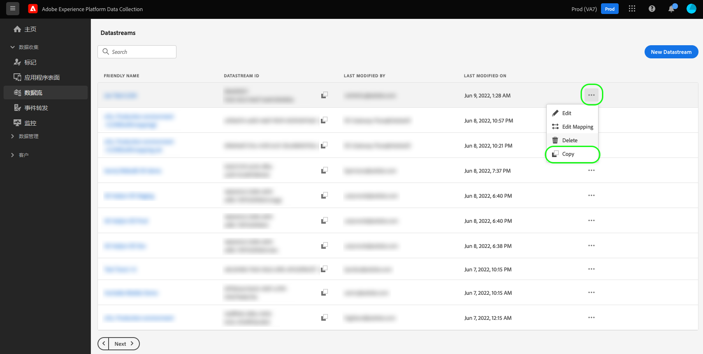

或者，您可以从给定数据流的详细信息视图中选择&#x200B;**[!UICONTROL Copy Datastream]**。

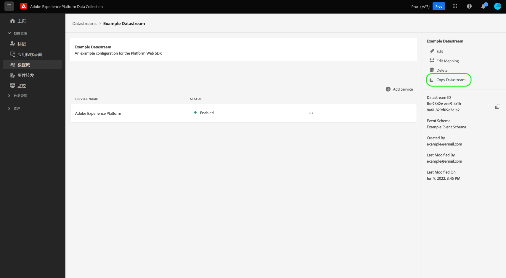

将出现一个确认对话框，提示您为要创建的新数据流提供唯一名称，以及有关将复制的配置选项的详细信息。准备就绪后，选择&#x200B;**[!UICONTROL Copy]**。

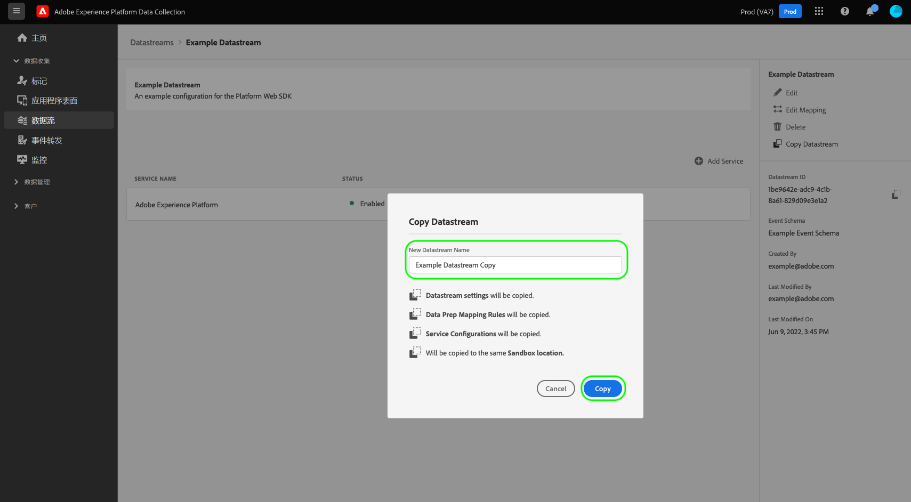

[!UICONTROL Datastreams]工作区的主页将重新显示，并列出新的数据流。

## 后续步骤

本指南介绍如何在数据收集 UI 中管理数据流。有关如何在设置数据流后安装和配置Web SDK的更多信息，请参阅[Web SDK标记扩展快速入门](../tags/extensions/client/web-sdk/getting-started.md)。
