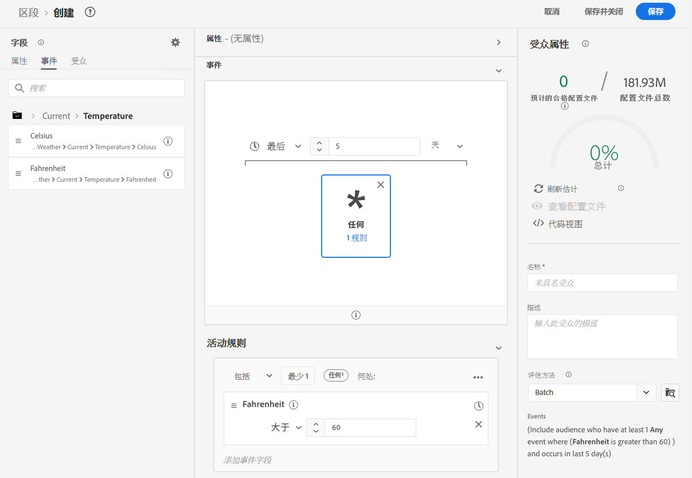
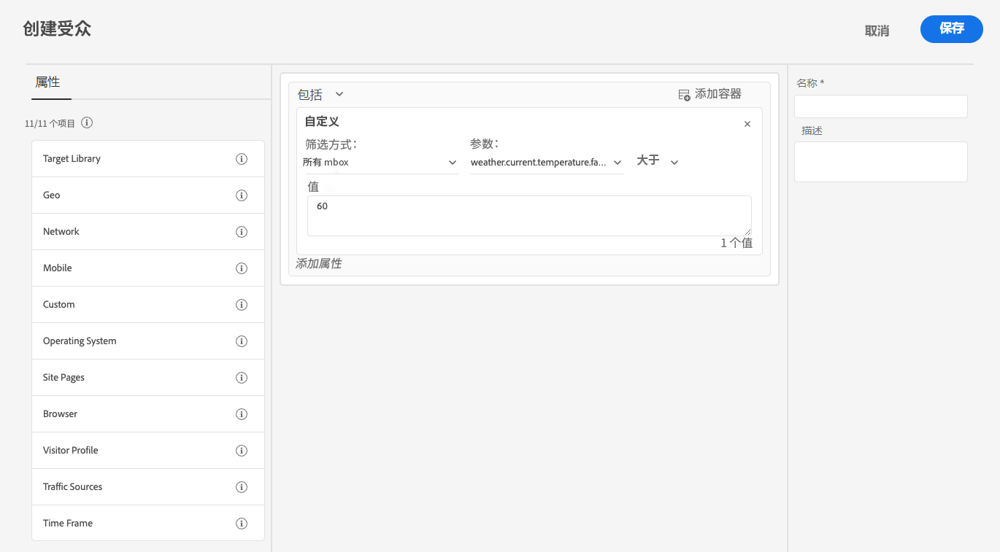

# 使用来自[!DNL The Weather Channel]的天气数据增强数据收集

Adobe 已与 [!DNL [The Weather Company]](https://www.ibm.com/weather) 合作，将美国天气的其他上下文引入通过数据流收集的数据中。您可以将这些数据用于Experience Platform中的分析、定位和受众创建。

[!DNL The Weather Channel]中有三种类型的数据可用：

* **[!UICONTROL 当前天气]**：用户的当前天气条件（基于其位置）。这包括当前的温度、降水、云覆盖率等。
* **[!UICONTROL 预测天气]**：预测包括用户位置的1、2、3、5、7和10天预测。
* **[!UICONTROL 触发因素]**：触发因素是映射到不同的语义天气条件的特定组合。有三种不同类型的天气触发因素：

   * **[!UICONTROL 天气触发因素]**：语义上有意义的条件，例如寒冷天气或雨天。在不同的气候条件下，它们的定义会有所不同。
   * **[!UICONTROL 产品触发因素]**：促使购买不同类型的产品的条件。例如：寒冷天气预报可能意味着购买雨衣的可能性更大。
   * **[!UICONTROL 恶劣天气触发因素]**：恶劣天气警告，例如冬季风暴或飓风警报。

## 先决条件 {#prerequisites}

在使用天气数据之前，请确保满足以下先决条件：

* 您必须从[!DNL The Weather Channel]中授权您将使用的天气数据。 之后，将在您的帐户上启用该数据。
* 只能通过数据流获得天气数据。若要使用天气数据，必须使用[!DNL Web SDK]、[!DNL Mobile Edge Extension]或[Edge Network API](https://developer.adobe.com/data-collection-apis/docs/api/)来包含此数据。
* 您的数据流必须已启用[[!UICONTROL 地理位置]](../configure.md#advanced-options)。
* 将[天气字段组](#schema-configuration)添加到您正在使用的架构中。

## 设置 {#provisioning}

在您从 [!DNL The Weather Channel] 获得数据的许可后，它们将允许您的帐户访问数据。接下来，您必须联系 Adobe 客户关怀部门以在数据流上启用该数据。启用后，数据将自动附加。

您可以使用调试器运行边缘跟踪或使用 Assurance 通过 [!DNL Edge Network] 跟踪点击来验证是否已添加数据。

### 架构配置 {#schema-configuration}

您必须将天气字段组添加到与数据流中使用的事件数据集相对应的 Experience Platform 架构。提供了五个字段组：

* [!UICONTROL 预测的天气]
* [!UICONTROL 当前天气]
* [!UICONTROL 产品触发因素]
* [!UICONTROL 相对触发因素]
* [!UICONTROL 恶劣天气触发因素]

## 访问天气数据 {#access-weather-data}

您的数据获得许可并可用后，您便可以在整个Adobe服务中以各种方式访问它。

### Adobe Analytics {#analytics}

在 [!DNL Adobe Analytics] 中，天气数据可通过处理规则与 [!DNL XDM] 架构的其余数据一起映射。

您可以在[天气参考](weather-reference.md)页面上找到可映射的字段列表。与所有 [!DNL XDM] 架构一样，键的前缀为 `a.x`。例如，一个名为 `weather.current.temperature.farenheit` 的字段将在 [!DNL Analytics] 中显示为 `a.x.weather.current.temperature.farenheit`。

### Adobe Customer Journey Analytics {#cja}

在 [!DNL Adobe Customer Journey Analytics] 中，数据流中指定的数据集包含天气数据。只要天气属性是[添加到您的架构](#prerequisites-prerequisites)，它们就可用于[添加到[!DNL Customer Journey Analytics]中的数据视图](https://experienceleague.adobe.com/docs/analytics-platform/using/cja-dataviews/create-dataview.html)。

### Real-Time Customer Data Platform {#rtcdp}

天气数据可在[Real-Time Customer Data Platform](../../rtcdp/overview.md)中使用，以用于受众。 天气数据将附加到事件。

由于天气条件变化频繁，因此Adobe建议您在受众上设置时间限制，如上面的示例所示。 在最后一两天度过寒冷的一天比 6 个月前的寒冷一天产生的影响更大。

请参阅[天气参考](weather-reference.md)以了解可用字段。

### Adobe Target {#target}

在 [!DNL Adobe Target] 中，您可以使用天气数据来实时推动个性化。天气数据将作为 [!UICONTROL mBox] 参数传递到 [!DNL Target]，您可以通过自定义 [!UICONTROL mBox] 参数访问它。

参数是特定字段的 [!DNL XDM] 路径。请参阅[天气参考](weather-reference.md)以了解可用字段及其相应的路径。

## 后续步骤 {#next-steps}

阅读本文档后，您现在可以更好地了解如何在各种 Adobe 解决方案中使用天气数据。要了解有关天气数据字段映射的更多信息，请参阅[字段映射参考](weather-reference.md)。
