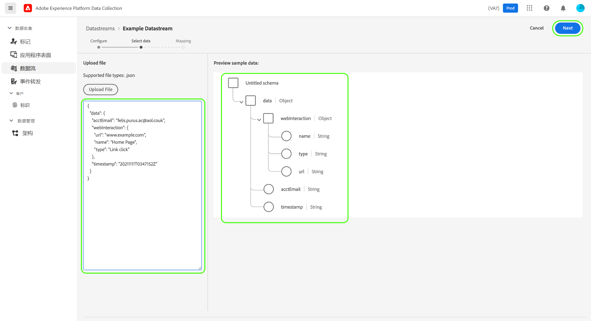
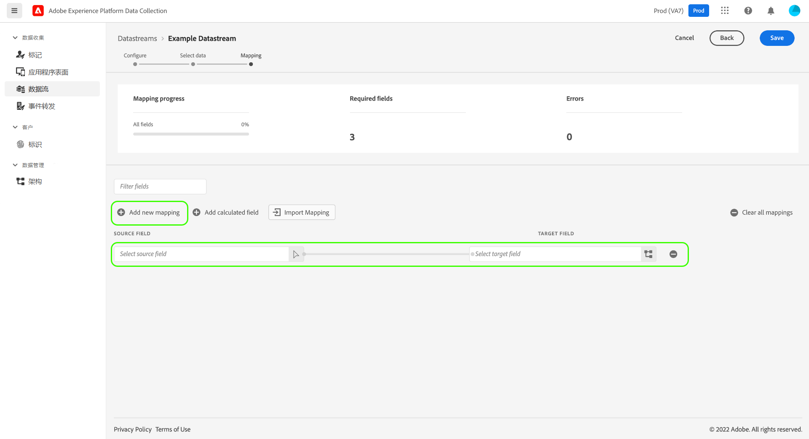
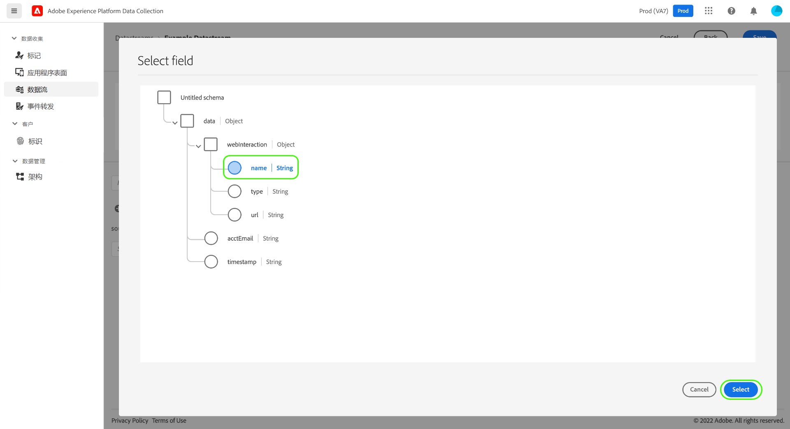
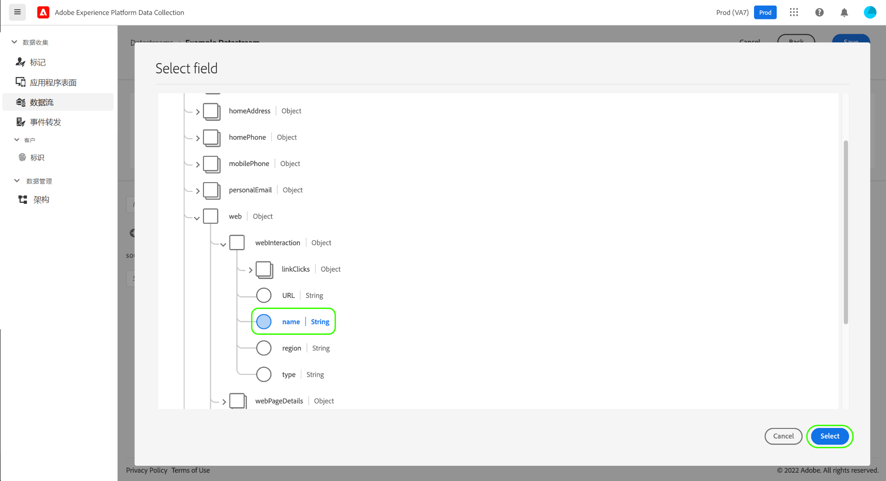
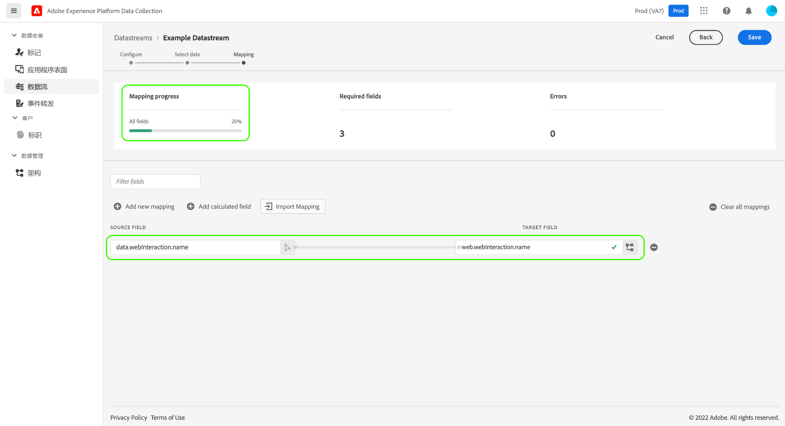
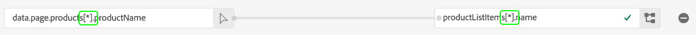
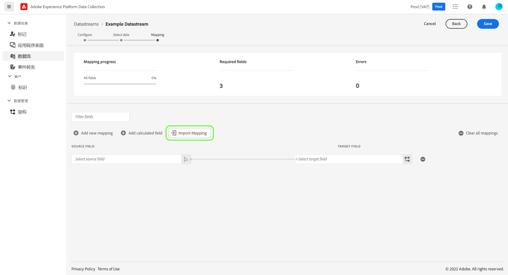
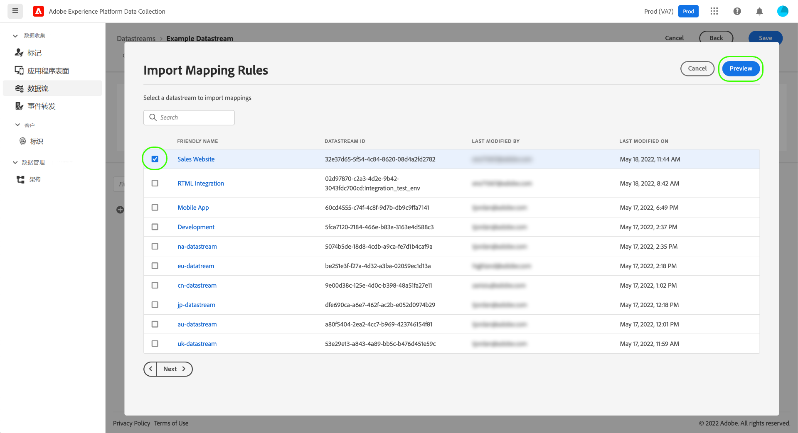
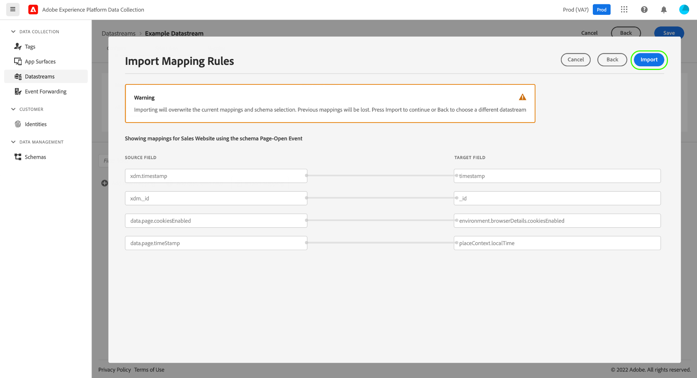
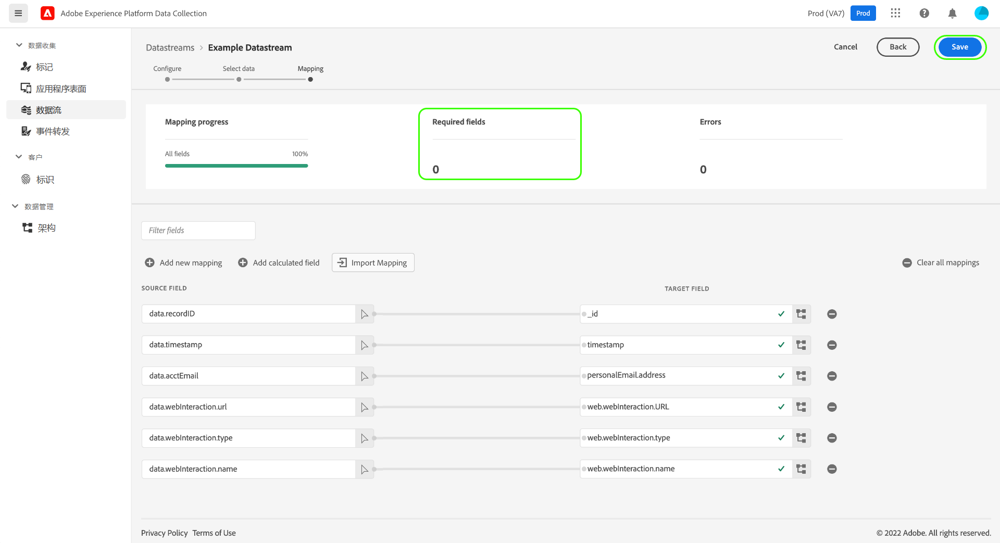

# 为数据收集准备数据

使用[!DNL Adobe Experience Platform]服务[!DNL Data Prep]将数据映射、转换和验证到[Experience Data Model (XDM)](/help/xdm/home.md)或从中映射和验证数据。 配置支持Experience Platform的[数据流](/help/datastreams/overview.md)时，您可以在将源数据发送到[!DNL Adobe Experience Platform Edge Network]时使用[!DNL Data Prep]功能将其映射到XDM。

所有从网页发送的数据必须以XDM形式登陆Experience Platform。 有三种方法可以将数据从页面上的数据层转换为Experience Platform接受的XDM：

1. 在网页上将数据层重新格式化为XDM。
2. 使用[!DNL Tags]内置数据元素功能将网页的现有数据层格式重新格式化为XDM。
3. 使用用于数据收集的数据准备，通过[!DNL Edge Network]将网页的现有数据层格式重新格式化为XDM。

本指南涵盖第三个选项。

## 何时使用数据准备进行数据收集 {#when-to-use-data-prep}

数据收集的数据准备在以下两种情况下很有用：

1. 该网站具有格式正确、受管理和维护的数据层，并且您倾向于将其直接发送到[!DNL Edge Network]，而不是使用JavaScript操作在页面上将其转换为XDM（通过[!DNL Tags]数据元素或通过手动JavaScript操作）。
2. 网站上部署了[!DNL Tags]以外的标记系统。

## 通过Web SDK将现有数据层发送到Edge Network {#send-datalayer-via-websdk}

现有数据层必须使用`sendEvent`命令中的[`data`](/help/collection/js/commands/sendevent/data.md)对象发送。

如果您使用的是[!DNL Tags]，则必须使用[**[!UICONTROL Send Event]**](/help/tags/extensions/client/web-sdk/actions/send-event.md)操作类型的&#x200B;**[!UICONTROL Data]**&#x200B;字段。

本指南的其余部分介绍在Web SDK发送数据层后，如何将其映射到XDM标准。

>[!NOTE]
>
>有关所有[!DNL Data Prep]功能（包括计算字段的转换函数）的全面指导，请参阅以下文档：
>
>* [数据准备概述](/help/data-prep/home.md)
>* [数据准备映射函数](/help/data-prep/functions.md)
>* [使用数据准备处理数据格式](/help/data-prep/data-handling.md)

本指南介绍如何在 UI 中映射数据。 要完成这些步骤，请启动创建数据流的过程，直到（包括）[基本配置步骤](/help/datastreams/configure.md#create)。

有关为数据收集准备数据过程的快速演示，请观看以下视频：

>[!VIDEO](https://video.tv.adobe.com/v/342120?quality=12&enable10seconds=on&speedcontrol=on)

## 提供示例数据 {#select-data}

完成数据流的基本配置后选择&#x200B;**[!UICONTROL Save and Add Mapping]**，此时将显示&#x200B;**[!UICONTROL Select data]**&#x200B;步骤。 从此处，您必须提供一个示例JSON对象，该对象表示您计划发送到Experience Platform的数据结构。

要直接从数据层捕获属性，该 JSON 对象必须具有单个根属性 `data`。 然后应通过映射到要捕获的数据层属性的方式构建`data`对象的子属性。 选择以下部分可查看具有 `data` 根的格式正确的 JSON 对象示例。

+++具有`data`根的示例JSON文件

```json
{
  "data": {
    "eventMergeId": "cce1b53c-571f-4f36-b3c1-153d85be6602",
    "eventType": "view:load",
    "timestamp": "2021-09-30T14:50:09.604Z",
    "web": {
      "webPageDetails": {
        "siteSection": "Product section",
        "server": "example.com",
        "name": "product home",
        "URL": "https://www.example.com"
      },
      "webReferrer": {
        "URL": "https://www.adobe.com/index2.html",
        "type": "external"
      }
    },
    "commerce": {
      "purchase": 1,
      "order": {
        "orderID": "1234"
      }
    },
    "product": [
      {
        "productInfo": {
          "productID": "123"
        }
      },
      {
        "productInfo": {
          "productID": "1234"
        }
      }
    ],
    "reservation": {
      "id": "anc45123xlm",
      "name": "Embassy Suits",
      "SKU": "12345-L",
      "skuVariant": "12345-LG-R",
      "priceTotal": "112.99",
      "currencyCode": "USD",
      "adults": 2,
      "children": 3,
      "productAddMethod": "PDP",
      "_namespace": {
        "test": 1,
        "priceTotal": "112.99",
        "category": "Overnight Stay"
      },
      "freeCancellation": false,
      "cancellationFee": 20,
      "refundable": true
    }
  }
}
```

+++

要从 XDM 对象数据元素捕获属性，相同的规则将适用于 JSON 对象，但根属性必须键入为 `xdm`。 选择以下部分可查看具有 `xdm` 根的格式正确的 JSON 对象示例。

+++具有`xdm`根的示例JSON文件

```json
{
  "xdm": {
    "environment": {
      "type": "browser",
      "browserDetails": {
        "userAgent": "Mozilla/5.0 (Macintosh; Intel Mac OS X 10_7_5) AppleWebkit/537.36 (KHTML, like Gecko) Chrome/49.0.2623.112 Safari/537.36",
        "javaScriptEnabled": true,
        "javaScriptVersion": "1.8.5",
        "cookiesEnabled": true,
        "viewportHeight": 900,
        "viewportWidth": 1680,
        "javaEnabled": true
      },
      "domain": "adobe.com",
      "colorDepth": 24,
      "viewportHeight": 1050,
      "viewportWidth": 1680
    },
    "device": {
      "screenHeight": 1050,
      "screenWidth": 1680
    }
  }
}
```

+++

您可以选择用于将对象作为文件上传的选项，或将原始对象粘贴到提供的文本框中。 如果 JSON 有效，预览架构将显示在右侧面板中。 选择&#x200B;**[!UICONTROL Next]**&#x200B;以继续。

预期传入数据的

>[!NOTE]
>
>使用表示任何页面上可能使用的每个数据层元素的示例JSON对象。 例如，并非所有页面都使用购物车数据层元素。 但是，在此示例JSON对象中包含购物车数据层元素。

## 映射您的数据 {#mapping}

此时将显示&#x200B;**[!UICONTROL Mapping]**&#x200B;步骤，允许您在Experience Platform中将源数据中的字段映射到目标事件架构中的字段。 从该位置，您可以通过两种方式配置映射：

* [通过手动过程为此数据流创建映射规则](#create-mapping)。
* 从现有数据流[导入映射规则](#import-mapping)。

>[!IMPORTANT]
>
>[!DNL Data Prep]映射将覆盖`identityMap` XDM负载，这可能会进一步影响与[!DNL Real-Time CDP]受众匹配的配置文件。

### 创建映射规则 {#create-mapping}

要创建映射规则，请选择&#x200B;**[!UICONTROL Add new mapping]**。



选择源图标（），然后在显示的对话框中，选择要在提供的画布中映射的源字段。 选择字段后，使用&#x200B;**[!UICONTROL Select]**&#x200B;按钮继续。



接下来，选择架构图标（）以打开目标事件架构的类似对话框。 在与&#x200B;**[!UICONTROL Select]**&#x200B;确认之前，选择要将数据映射到其中的字段。



映射页面将重新出现，并显示已完成的字段映射。 **[!UICONTROL Mapping progress]**&#x200B;部分将更新以反映已成功映射的字段总数。



>[!TIP]
>
>如果要将一个对象数组（在源字段中）映射到不同对象的数组（在目标字段中），请在源字段路径和目标字段路径中的数组名称后添加 `[*]`，如下所示。
>
>

### 导入现有映射规则 {#import-mapping}

如果以前创建过数据流，则可以为新数据流重复使用其配置的映射规则。

>[!WARNING]
>
>从其他数据流导入映射规则会覆盖导入之前可能已添加的任何字段映射。

要开始，请选择&#x200B;**[!UICONTROL Import Mapping]**。

正在选择

在出现的对话框中，选择要导入其映射规则的数据流。 选择数据流后，选择&#x200B;**[!UICONTROL Preview]**。



>[!NOTE]
>
>数据流只能在同一个[沙盒](/help/sandboxes/home.md)中导入。 您无法将数据流从一个沙盒导入另一个沙盒。

下一个屏幕显示所选数据流的已保存映射规则的预览。 确保显示的映射符合您的预期，然后选择&#x200B;**[!UICONTROL Import]**&#x200B;以确认并将映射添加到新数据流。



>[!NOTE]
>
>如果导入的映射规则中的任何源字段未包含在[之前提供的](#select-data)示例 JSON 数据中，这些字段映射将不会包含在导入中。

### 完成映射 {#complete-mapping}

继续将剩余字段映射到目标架构。 虽然您不必映射所有可用的源字段，但必须映射目标架构中设置为必需的任何字段才能完成此步骤。 **[!UICONTROL Required fields]**&#x200B;计数器指示当前配置中尚未映射的必填字段的数量。

当必填字段数达到零并且您对映射感到满意时，请选择&#x200B;**[!UICONTROL Save]**&#x200B;以完成更改。



## 后续步骤 {#next-steps}

本指南介绍如何在 UI 中设置数据流时将数据映射到 XDM。 如果您正在学习常规数据流教程，您现在可以返回到[查看数据流详细信息](/help/datastreams/overview.md)的步骤。
