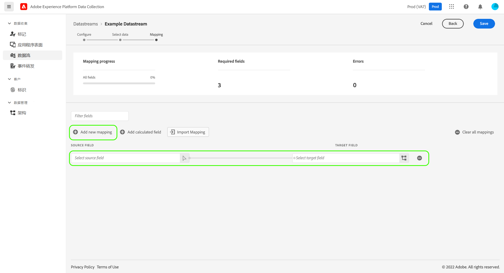

# 为数据收集准备数据

数据准备是一项 Adobe Experience Platform 服务，可让您从 [Experience Data Model (XDM)](../xdm/home.md)映射数据并将数据映射到它、转换和验证数据。在配置启用了Experience Platform的[数据流](./overview.md)时，您可以使用数据准备功能在将数据发送到Experience Platform Edge Network时将源数据映射到XDM。

所有从网页发送的数据必须以XDM形式登陆Experience Platform。 有3种方法可将数据从页面上的数据层转换为Experience Platform接受的XDM：

1. 在网页上将数据层重新格式化为XDM。
2. 使用标记本机数据元素功能，将网页的现有数据层格式重新格式化为XDM。
3. 使用为数据收集准备数据，通过Edge Network将网页的现有数据层格式重新格式化为XDM。

本指南重点介绍第三个选项。

## 何时使用数据准备进行数据收集 {#when-to-use-data-prep}

在两种用例中，为数据收集准备数据很有用：

1. 网站具有格式正确、受管并维护的数据层，并且更愿意直接将其发送到Edge Network，而不是使用JavaScript操作在页面上将其转换为XDM(通过标记数据元素或通过手动JavaScript操作)。
2. 在该站点上部署了标记系统以外的标记系统。

## 通过WebSDK将现有数据层发送到Edge Network {#send-datalayer-via-websdk}

现有数据层必须使用`sendEvent`命令中的[`data`](/help/web-sdk/commands/sendevent/data.md)对象发送。

如果您使用标记，则必须使用&#x200B;**[!UICONTROL 发送事件]**&#x200B;操作类型的&#x200B;**[!UICONTROL 数据]**&#x200B;字段，如[Web SDK标记扩展文档](/help/tags/extensions/client/web-sdk/action-types.md)中所述。

本指南的其余部分将重点介绍在WebSDK发送数据层后，如何将其映射到XDM标准。

>[!NOTE]
>
>有关所有数据准备函数（包括计算字段的转换函数）的综合指南，请参阅以下文档：
>
>* [数据准备概述](../data-prep/home.md)
>* [数据准备映射函数](../data-prep/functions.md)
>* [使用数据准备处理数据格式](../data-prep/data-handling.md)

本指南介绍如何在 UI 中映射数据。要执行这些步骤，请开始创建数据流的过程，直至（并包括）[基本配置步骤](./overview.md#create)。

有关“为数据收集准备数据”过程的快速演示，请观看以下视频：

>[!VIDEO](https://video.tv.adobe.com/v/342120?quality=12&enable10seconds=on&speedcontrol=on)

## [!UICONTROL 选择数据] {#select-data}

完成数据流的基本配置后，选择&#x200B;**[!UICONTROL 保存并添加映射]**，**[!UICONTROL 选择数据]**&#x200B;步骤随即出现。从此处，您必须提供一个示例JSON对象，该对象表示您计划发送到Experience Platform的数据结构。

要直接从数据层捕获属性，该 JSON 对象必须具有单个根属性 `data`。然后应通过映射到要捕获的数据层属性的方式构建`data`对象的子属性。 选择以下部分可查看具有 `data` 根的格式正确的 JSON 对象示例。

+++示例 JSON 文件，具有 `data` 根

```json
{
  "data": {
    "eventMergeId": "cce1b53c-571f-4f36-b3c1-153d85be6602",
    "eventType": "view:load",
    "timestamp": "2021-09-30T14:50:09.604Z",
    "web": {
      "webPageDetails": {
        "siteSection": "Product section",
        "server": "example.com",
        "name": "product home",
        "URL": "https://www.example.com"
      },
      "webReferrer": {
        "URL": "https://www.adobe.com/index2.html",
        "type": "external"
      }
    },
    "commerce": {
      "purchase": 1,
      "order": {
        "orderID": "1234"
      }
    },
    "product": [
      {
        "productInfo": {
          "productID": "123"
        }
      },
      {
        "productInfo": {
          "productID": "1234"
        }
      }
    ],
    "reservation": {
      "id": "anc45123xlm",
      "name": "Embassy Suits",
      "SKU": "12345-L",
      "skuVariant": "12345-LG-R",
      "priceTotal": "112.99",
      "currencyCode": "USD",
      "adults": 2,
      "children": 3,
      "productAddMethod": "PDP",
      "_namespace": {
        "test": 1,
        "priceTotal": "112.99",
        "category": "Overnight Stay"
      },
      "freeCancellation": false,
      "cancellationFee": 20,
      "refundable": true
    }
  }
}
```

+++

要从 XDM 对象数据元素捕获属性，相同的规则将适用于 JSON 对象，但根属性必须键入为 `xdm`。选择以下部分可查看具有 `xdm` 根的格式正确的 JSON 对象示例。

+++示例 JSON 文件，具有 `xdm` 根

```json
{
  "xdm": {
    "environment": {
      "type": "browser",
      "browserDetails": {
        "userAgent": "Mozilla/5.0 (Macintosh; Intel Mac OS X 10_7_5) AppleWebkit/537.36 (KHTML, like Gecko) Chrome/49.0.2623.112 Safari/537.36",
        "javaScriptEnabled": true,
        "javaScriptVersion": "1.8.5",
        "cookiesEnabled": true,
        "viewportHeight": 900,
        "viewportWidth": 1680,
        "javaEnabled": true
      },
      "domain": "adobe.com",
      "colorDepth": 24,
      "viewportHeight": 1050,
      "viewportWidth": 1680
    },
    "device": {
      "screenHeight": 1050,
      "screenWidth": 1680
    }
  }
}
```

+++

您可以选择用于将对象作为文件上传的选项，或将原始对象粘贴到提供的文本框中。如果 JSON 有效，预览架构将显示在右侧面板中。选择&#x200B;**[!UICONTROL 下一步]**&#x200B;以继续。

预期传入数据的

>[!NOTE]
>
> 使用表示任何页面上可能使用的每个数据层元素的示例JSON对象。 例如，并非所有页面都使用购物车数据层元素。 但是，购物车数据层元素应包含在此示例JSON对象中。

## [!UICONTROL 映射]

将显示&#x200B;**[!UICONTROL 映射]**&#x200B;步骤，允许您在Experience Platform中将源数据中的字段映射到目标事件架构中的字段。 从该位置，您可以通过两种方式配置映射：

* [通过手动过程为此数据流创建映射规则](#create-mapping)。
* 从现有数据流[导入映射规则](#import-mapping)。

>[!IMPORTANT]
>
>数据准备映射将覆盖`identityMap`个XDM负载，这可能会进一步影响针对Real-Time CDP受众的配置文件匹配。

### 创建映射规则 {#create-mapping}

要创建映射规则，请选择&#x200B;**[!UICONTROL 添加新映射]**。



选择源图标（），在出现的对话框中，选择要在提供的画布中映射的源字段。选择字段后，使用&#x200B;**[!UICONTROL 选择]**&#x200B;按钮以继续。


接下来，选择架构图标（），打开类似的目标事件架构对话框。在确认之前，使用&#x200B;**[!UICONTROL 选择]**&#x200B;来选择要将数据映射到的字段。


映射页面将重新出现，并显示已完成的字段映射。**[!UICONTROL 映射进度]**&#x200B;部分将更新以反映已成功映射的字段总数。


>[!TIP]
>
>如果要将一个对象数组（在源字段中）映射到不同对象的数组（在目标字段中），请在源字段路径和目标字段路径中的数组名称后添加 `[*]`，如下所示。
>
>

### 导入现有映射规则 {#import-mapping}

如果以前创建过数据流，则可以为新数据流重复使用其配置的映射规则。

>[!WARNING]
>
>从其他数据流导入映射规则会覆盖导入之前可能已添加的任何字段映射。

要开始，请选择&#x200B;**[!UICONTROL 导入映射]**。

正在选择

在出现的对话框中，选择要导入其映射规则的数据流。选择该数据流后，选择&#x200B;**[!UICONTROL 预览]**。


>[!NOTE]
>
>数据流只能在同一个[沙盒](../sandboxes/home.md)中导入。换句话说，您无法将数据流从一个沙盒导入到另一个沙盒。

下一个屏幕显示所选数据流的已保存映射规则的预览。确保显示的映射为预期映射，然后选择&#x200B;**[!UICONTROL 导入]**&#x200B;以确认映射并将其添加到新数据流。


>[!NOTE]
>
>如果导入的映射规则中的任何源字段未包含在[之前提供的](#select-data)示例 JSON 数据中，这些字段映射将不会包含在导入中。

### 完成映射

继续执行上述步骤，将其余字段映射到目标架构。虽然您不必映射所有可用的源字段，但必须映射目标架构中设置为必需的任何字段才能完成此步骤。 **[!UICONTROL 必填字段]**&#x200B;计数器指示当前配置中尚未映射的必填字段的数量。

在必填字段数达到零且对映射感到满意后，选择&#x200B;**[!UICONTROL 保存]**&#x200B;以完成更改。


## 后续步骤

本指南介绍如何在 UI 中设置数据流时将数据映射到 XDM。如果您正在按照一般数据流教程执行操作，现在可以返回到[查看数据流详细信息](./overview.md)步骤。
