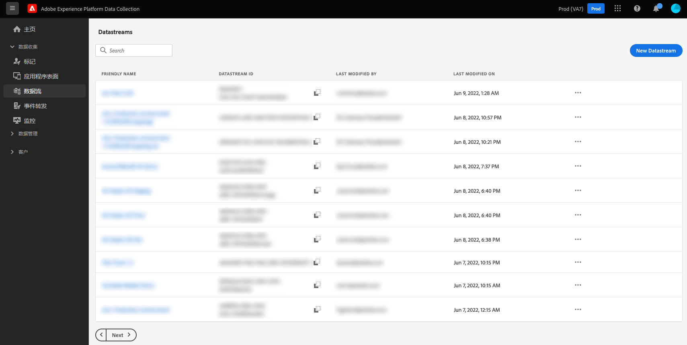

# 数据流概述

数据流表示Adobe Experience Platform Web和Mobile SDK的服务器端配置。 虽然SDK中的[`configure`](/help/collection/js/commands/configure/overview.md)命令可处理客户端设置（如`edgeDomain`），但数据流可管理所有其他配置。

向Edge Network发送请求时，`datastreamId`引用发送数据的数据流。 这允许您更新服务器端配置，而无需更改网站的代码。

通过在Adobe Experience Platform UI或数据收集UI的左侧导航中选择&#x200B;**[!UICONTROL Datastreams]**，可以创建和管理数据流。

有关如何在 UI 中配置数据流的更多信息，请参阅[配置指南](./configure.md)。

## 处理数据流中的敏感数据 {#sensitive}

>[!IMPORTANT]
>
>本文档的内容不是法律建议，也不会代替法律建议。请咨询您公司的法律部门，以获取有关处理敏感数据的建议。

企业数据管理政策和监管要求正在对敏感客户数据的收集、处理和使用方式施加越来越多的限制。这包括对受保护的健康数据 (PHI) 的收集、处理和使用，将受“健康保险流通与责任法案”(HIPAA) 等法规的约束。

数据流提供了三种方法来帮助您安全地处理敏感数据：

* [增强型加密](#encryption)
* [数据管理](#governance)
* [审核日志](#audit-logs)

### 增强型加密 {#encryption}

通过 Edge Network 传输的所有数据均使用 [HTTPS TLS 1.2](https://datatracker.ietf.org/doc/html/rfc5246) 通过安全、加密的连接进行传输。如果数据流将数据引入 Experience Platform，则数据会在 Experience Platform 数据湖中进行静态加密。有关更多信息，请参阅介绍 [Experience Platform 中的数据加密](../landing/governance-privacy-security/encryption.md)的文档。

### 数据管理 {#governance}

数据流使用Experience Platform内置的数据治理功能，防止将敏感数据发送到不符合HIPAA要求的服务。 通过标记数据流架构中包含敏感数据的特定字段，可以精细地控制哪些数据字段可用于特定目的。

以下视频简要概述了如何在 UI 中为数据流配置和实施数据使用限制：

>[!VIDEO](https://video.tv.adobe.com/v/3413100/?captions=chi_hans&quality=12&learn=on&speedcontrol=on)

在 Experience Platform 中，您可以将[敏感数据使用标签](../data-governance/labels/reference.md#sensitive)应用于架构和字段，其中包含您组织视为敏感信息的数据。例如，`RHD` 标签用于表示受保护的健康信息 (PHI)，而 `S1` 标签表示地理位置数据。

>[!NOTE]
>
>有关如何在Experience Platform UI或数据收集UI的[!UICONTROL Schemas]选项卡中应用数据使用标签的详细信息，请参阅[架构标签设置教程](../xdm/tutorials/labels.md)。

在创建数据流时，如果所选架构包含敏感数据使用标签，则只能配置数据流以将该数据发送到支持HIPAA的目标。 目前，数据流支持的唯一符合 HIPAA 标准的目标是 Adobe Experience Platform。将为包含敏感数据使用标签的数据流禁用其他目标服务，包括 Adobe Target、Adobe Analytics、Adobe Audience Manager、事件转发和边缘目标。

如果某个架构正在具有不符合 HIPAA 标准的服务的现有数据流中使用，则尝试向该架构添加敏感数据使用标签会导致出现政策违反消息，并且操作将会被阻止。该消息指定哪个数据流触发了冲突，并建议从数据流中删除任何非HIPAA就绪的服务以解决该问题。

### 审核日志

在 Experience Platform 中，可以审核日志形式监控数据流活动。审核日志显示&#x200B;**谁**&#x200B;执行了&#x200B;**什么**&#x200B;操作，何时执行&#x200B;**什么时间**，以及其他上下文数据，可帮助您排除与数据流相关的问题，以帮助您的企业遵守公司数据管理政策和法规要求。

当用户创建、更新或删除数据流时，将创建审核日志以记录操作。当用户通过[为数据收集准备数据](./data-prep.md)过程创建、更新或删除映射时，会发生相同的情况。无论更新了数据流还是映射，生成的审核日志都分类到[!UICONTROL Datastreams]资源类型下。

请参阅有关[审核日志](../landing/governance-privacy-security/audit-logs/overview.md)的文档，详细了解如何解释来自数据流和其他支持服务的日志。

## 后续步骤

本指南高度概括了数据流及其在数据收集和敏感数据处理中的使用。有关如何设置新数据流的步骤，请参阅[数据流配置指南](./configure.md)。
