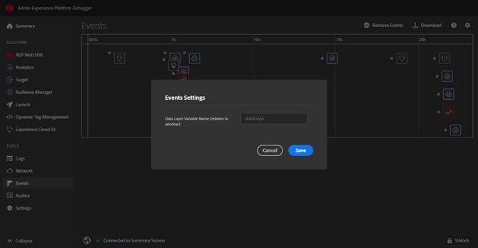

# 事件標籤

此 **事件** tab以圖形化方式呈現所發生的事件，顯示在時間軸上。

对于每个事件，时间线上都会显示一个与之适用的 解决方案图标。另外，还将显示反映数据层变更的图标（如果启用）。将鼠标悬停在图标上可获取相应事件的摘要信息。選取事件上的以取得更多詳細資料。 您可以按Shift-Select或Control-Select來檢視多個事件。

選取詳細資料以取得詳細資訊。

## 跟踪数据层的变更

要在时间线上启用跟踪数据层变更，请执行以下操作：

1. 選取右上方的齒輪圖示。
1. 输入数据层的名称。

   

1. 选择&#x200B;**[!UICONTROL 保存]**。

数据层变更详情将显示所有删除或添加的内容。您可以選取 **{}** 以更深入地瞭解資料層。

## 下载事件信息

選取 **[!UICONTROL 下載]** 以下載顯示頁面呼叫相關資訊的Excel檔案。
