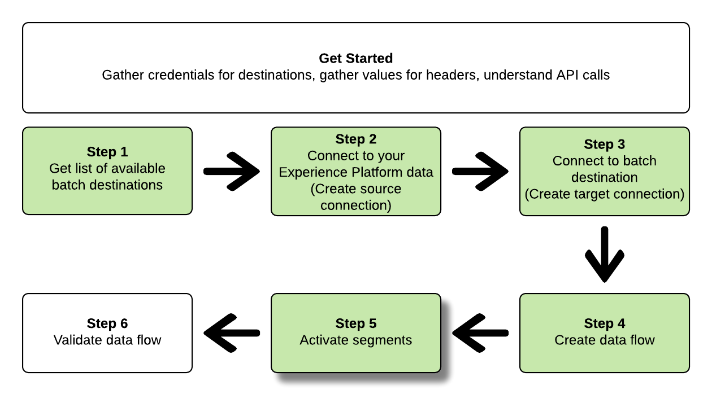

# 连接到基于文件的电子邮件营销目标，并使用流服务API激活数据

>[!IMPORTANT]
> 
>* 若要连接到目标，您需要&#x200B;**[!UICONTROL View Destinations]**&#x200B;和&#x200B;**[!UICONTROL Manage Destinations]** [访问控制权限](/help/access-control/home.md#permissions)。
>
>* 若要激活数据，您需要&#x200B;**[!UICONTROL View Destinations]**、**[!UICONTROL Activate Destinations]**、**[!UICONTROL View Profiles]**&#x200B;和&#x200B;**[!UICONTROL View Segments]** [访问控制权限](/help/access-control/home.md#permissions)。
>
>* 要导出&#x200B;*标识*，您需要&#x200B;**[!UICONTROL View Identity Graph]** [访问控制权限](/help/access-control/home.md#permissions)。<br> {width="100" zoomable="yes"}
>
>阅读[访问控制概述](/help/access-control/ui/overview.md)或联系您的产品管理员以获取所需的权限。

本教程将演示如何使用流服务API创建基于文件的[电子邮件营销目标](../catalog/email-marketing/overview.md)，如何为新建的目标创建数据流，以及如何通过CSV文件将数据导出到新建的目标。

>[!TIP]
> 
>要了解如何使用流服务API将数据激活到云存储目标，请阅读[专用API教程](/help/destinations/api/activate-segments-file-based-destinations.md)。

本教程在所有示例中都使用[!DNL Adobe Campaign]目标，但步骤与基于文件的电子邮件营销目标相同。


如果您希望使用Experience Platform用户界面连接到目标并激活数据，请参阅[连接目标](../ui/connect-destination.md)和[将受众数据激活到批处理配置文件导出目标](../ui/activate-batch-profile-destinations.md)教程。

## 快速入门 {#get-started}

本指南要求您对 Adobe Experience Platform 的以下组件有一定了解：

* [[!DNL Experience Data Model (XDM) System]](../../xdm/home.md)： [!DNL Experience Platform]用于组织客户体验数据的标准化框架。
* [[!DNL Segmentation Service]](../../segmentation/api/overview.md)： [!DNL Adobe Experience Platform Segmentation Service]允许您根据[!DNL Adobe Experience Platform]数据在[!DNL Real-Time Customer Profile]中构建受众。
* [[!DNL Sandboxes]](../../sandboxes/home.md)： [!DNL Experience Platform]提供了将单个[!DNL Experience Platform]实例划分为多个单独的虚拟环境的虚拟沙箱，以帮助开发和改进数字体验应用程序。

以下部分提供了在Experience Platform中将数据激活到批处理目标需要了解的其他信息。

### 收集所需的凭据 {#gather-required-credentials}

要完成本教程中的步骤，您应该准备好以下凭据，具体取决于要连接和激活受众的目标类型。

* 对于[!DNL Amazon S3]连接： `accessId`，`secretKey`
* 对于[!DNL Amazon S3]与[!DNL Adobe Campaign]的连接： `accessId`，`secretKey`
* 对于SFTP连接： `domain`、`port`、`username`、`password`或`sshKey`（取决于到FTP位置的连接方法）
* 对于[!DNL Azure Blob]连接： `connectionString`

>[!NOTE]
>
>`accessId`连接的凭据`secretKey`、[!DNL Amazon S3]与与`accessId`的`secretKey`连接的[!DNL Amazon S3]、[!DNL Adobe Campaign]相同。

### 正在读取示例 API 调用 {#reading-sample-api-calls}

本教程提供了示例API调用来演示如何格式化请求。 这些包括路径、必需的标头和格式正确的请求负载。还提供了在 API 响应中返回的示例 JSON。有关示例 API 调用的文档中所用惯例的信息，请参阅故障排除指南中的[如何读取示例 API 调用](../../landing/troubleshooting.md#how-do-i-format-an-api-request) [!DNL Experience Platform]。

### 收集必需标题和可选标题的值 {#gather-values-headers}

为调用 [!DNL Experience Platform] API，您必须先完成[身份验证教程](https://www.adobe.com/go/platform-api-authentication-en)。完成身份验证教程会提供所有 [!DNL Experience Platform] API 调用中每个所需标头的值，如下所示：

* 授权：持有人`{ACCESS_TOKEN}`
* x-api-key： `{API_KEY}`
* x-gw-ims-org-id： `{ORG_ID}`

[!DNL Experience Platform]中的资源可以隔离到特定的虚拟沙箱。 在对[!DNL Experience Platform] API的请求中，您可以指定将在其中执行操作的沙盒的名称和ID。 这些是可选参数。

* x-sandbox-name： `{SANDBOX_NAME}`

>[!NOTE]
>
>有关[!DNL Experience Platform]中沙盒的更多信息，请参阅[沙盒概述文档](../../sandboxes/home.md)。

所有包含有效负载(POST、PUT、PATCH)的请求都需要一个额外的媒体类型标头：

* 内容类型： `application/json`

### API参考文档 {#api-reference-documentation}

您可以在本教程中找到所有API操作的随附参考文档。 请参阅Adobe I/O[上的](https://www.adobe.io/experience-platform-apis/references/flow-service/)流服务API文档。 我们建议您并行使用此教程和API参考文档。

## 获取可用目标列表 {#get-the-list-of-available-destinations}


第一步，您应该决定要将数据激活到的目标。 首先，请执行调用以请求可连接并激活受众的可用目标列表。 对`connectionSpecs`端点执行以下GET请求以返回可用目标列表：

**API格式**

```http
GET /connectionSpecs
```

**请求**

```shell
curl --location --request GET 'https://platform.adobe.io/data/foundation/flowservice/connectionSpecs' \
--header 'accept: application/json' \
--header 'x-gw-ims-org-id: {ORG_ID}' \
--header 'x-api-key: {API_KEY}' \
--header 'x-sandbox-name: {SANDBOX_NAME}' \
--header 'Authorization: Bearer {ACCESS_TOKEN}'
```


**响应**

成功的响应包含可用目标及其唯一标识符(`id`)的列表。 存储您计划使用的目标的值，因为后续步骤需要该值。 例如，如果要连接受众并将受众交付到[!DNL Adobe Campaign]，请在响应中查找以下代码片段：

```json
{
    "id": "0b23e41a-cb4a-4321-a78f-3b654f5d7d97",
  "name": "Adobe Campaign",
  ...
  ...
}
```

下表包含常用批处理目标的连接规范ID，以供您参考：

| 目标 | 连接规范ID |
|---------|----------|
| [!DNL Adobe Campaign] | `0b23e41a-cb4a-4321-a78f-3b654f5d7d97` |
| [!DNL Oracle Eloqua] | `c1e44b6b-e7c8-404b-9031-58f0ef760604` |
| [!DNL Oracle Responsys] | `a5e28ddf-e265-426e-83a1-9d03a3a6822b` |
| [!DNL Salesforce Marketing Cloud] | `f599a5b3-60a7-4951-950a-cc4115c7ea27` |

{style="table-layout:auto"}

## 连接到您的[!DNL Experience Platform]数据 {#connect-to-your-experience-platform-data}


接下来，您必须连接到[!DNL Experience Platform]数据，以便能够导出配置文件数据并在首选目标中激活该数据。 这包含下面描述的两个子步骤。

1. 首先，您必须通过设置基本连接来执行调用以授权访问[!DNL Experience Platform]中的数据。
2. 然后，使用基本连接ID执行另一个调用，在该调用中创建&#x200B;*源连接*，从而建立与[!DNL Experience Platform]数据的连接。

### 在[!DNL Experience Platform]中授权访问您的数据

**API格式**

```http
POST /connections
```

**请求**

```shell
curl --location --request POST 'https://platform.adobe.io/data/foundation/flowservice/connections' \
--header 'Authorization: Bearer {ACCESS_TOKEN}' \
--header 'x-api-key: {API_KEY}' \
--header 'x-gw-ims-org-id: {ORG_ID}' \
--header 'x-sandbox-name: {SANDBOX_NAME}' \
--header 'Content-Type: application/json' \
--data-raw '{
            "name": "Base connection to Experience Platform",
            "description": "This call establishes the connection to Experience Platform data",
            "connectionSpec": {
                "id": "{CONNECTION_SPEC_ID}",
                "version": "1.0"
            }
}'
```

| 属性 | 描述 |
| --------- | ----------- |
| `name` | 提供到Experience Platform [!DNL Profile store]的基本连接的名称。 |
| `description` | 或者，您可以为基本连接提供描述。 |
| `connectionSpec.id` | 为[Experience Platform配置文件存储](/help/profile/home.md#profile-data-store) - `8a9c3494-9708-43d7-ae3f-cda01e5030e1`使用连接规范ID。 |

{style="table-layout:auto"}

**响应**

成功的响应包含基本连接的唯一标识符(`id`)。 将此值存储为创建源连接时所需的值。

```json
{
    "id": "1ed86558-59b5-42f7-9865-5859b552f7f4"
}
```

### 连接到您的[!DNL Experience Platform]数据 {#connect-to-platform-data}

**API格式**

```http
POST /sourceConnections
```

**请求**

```shell
curl --location --request POST 'https://platform.adobe.io/data/foundation/flowservice/sourceConnections' \
--header 'Authorization: Bearer {ACCESS_TOKEN}' \
--header 'x-api-key: {API_KEY}' \
--header 'x-gw-ims-org-id: {ORG_ID}' \
--header 'x-sandbox-name: {SANDBOX_NAME}' \
--header 'Content-Type: application/json' \
--data-raw '{
            "name": "Connecting to Profile store",
            "description": "Optional",
            "connectionSpec": {
                "id": "{CONNECTION_SPEC_ID}",
                "version": "1.0"
            },
            "baseConnectionId": "{BASE_CONNECTION_ID}",
            "data": {
                "format": "CSV",
                "schema": null
            },
            "params" : {}
}'
```

| 属性 | 描述 |
| --------- | ----------- |
| `name` | 提供与Experience Platform [!DNL Profile store]的源连接的名称。 |
| `description` | 或者，您可以为源连接提供描述。 |
| `connectionSpec.id` | 为[Experience Platform配置文件存储](/help/profile/home.md#profile-data-store) - `8a9c3494-9708-43d7-ae3f-cda01e5030e1`使用连接规范ID。 |
| `baseConnectionId` | 使用您在上一步中获取的基本连接ID。 |
| `data.format` | `CSV`是当前唯一支持的文件导出格式。 |

{style="table-layout:auto"}

**响应**

成功的响应返回新建的源连接`id`的唯一标识符([!DNL Profile store])。 这将确认您已成功连接到[!DNL Experience Platform]数据。 将此值存储为后续步骤中所需的值。

```json
{
    "id": "ed48ae9b-c774-4b6e-88ae-9bc7748b6e97"
}
```

## 连接到批处理目标 {#connect-to-batch-destination}


在此步骤中，您需要设置与所需的批处理云存储或电子邮件营销目标的连接。 这包含下面描述的两个子步骤。

1. 首先，您必须执行调用以通过设置基本连接来授权对目标平台的访问。
2. 然后，使用基本连接ID再次调用，以创建&#x200B;*目标连接*，该连接指定存储帐户中要传递导出数据文件的位置以及要导出的数据的格式。

### 授权对批次目标的访问 {#authorize-access-to-batch-destination}

**API格式**

```http
POST /connections
```

**请求**

下面的请求建立了到[!DNL Adobe Campaign]目标的基连接。 根据要将文件导出到([!DNL Amazon S3]、SFTP、[!DNL Azure Blob])的存储位置，请保留相应的`auth`规范并删除其他规范。

```shell
curl --location --request POST 'https://platform.adobe.io/data/foundation/flowservice/connections' \
--header 'Authorization: Bearer {ACCESS_TOKEN}' \
--header 'x-api-key: {API_KEY}' \
--header 'x-gw-ims-org-id: {ORG_ID}' \
--header 'x-sandbox-name: {SANDBOX_NAME}' \
--header 'Content-Type: application/json' \
--data-raw '{
    "name": "S3 Connection for Adobe Campaign",
    "description": "summer advertising campaign",
    "connectionSpec": {
        "id": "0b23e41a-cb4a-4321-a78f-3b654f5d7d97",
        "version": "1.0"
    },
    "auth": {
        "specName": "S3",
        "params": {
            "accessId": "{ACCESS_ID}",
            "secretKey": "{SECRET_KEY}"
        }
    }
    "auth": {
        "specName": "SFTP with Password",
        "params": {
            "domain": "{DOMAIN}",
            "host": "{HOST}",
            "username": "{USERNAME}",
            "password": "{PASSWORD}"
        }
    }
    "auth": {
        "specName": "SFTP with SSH Key",
        "params": {
            "domain": "{DOMAIN}",
            "host": "{HOST}",
            "username": "{USERNAME}",
            "sshKey": "{SSH_KEY}"
        }
    }        
    "auth": {
        "specName": "Azure Blob",
        "params": {
            "connectionString": "{AZURE_BLOB_CONNECTION_STRING}"
        }
    }    
}'
```

请参阅下面的示例请求，以连接到其他受支持的批量云存储和电子邮件营销目标。

+++ 连接到[!DNL Amazon S3]目标的请求示例

下面的请求建立了到[!DNL Amazon S3]目标的基连接。

```shell
curl --location --request POST 'https://platform.adobe.io/data/foundation/flowservice/connections' \
--header 'Authorization: Bearer {ACCESS_TOKEN}' \
--header 'x-api-key: {API_KEY}' \
--header 'x-gw-ims-org-id: {ORG_ID}' \
--header 'x-sandbox-name: {SANDBOX_NAME}' \
--header 'Content-Type: application/json' \
--data-raw '{
    "name": "Connect to Amazon S3",
    "description": "summer advertising campaign",
    "connectionSpec": {
        "id": "4890fc95-5a1f-4983-94bb-e060c08e3f81",
        "version": "1.0"
    },
    "auth": {
        "specName": "Access Key",
        "params": {
            "s3AccessKey": "{AMAZON_S3_ACCESS_KEY}",
            "s3SecretKey": "{AMAZON_S3_SECRET_KEY}"
        }
    }
}'
```

+++

+++ 连接到[!DNL Azure Blob]目标的请求示例

下面的请求建立了到[!DNL Azure Blob]目标的基连接。

```shell
curl --location --request POST 'https://platform.adobe.io/data/foundation/flowservice/connections' \
--header 'Authorization: Bearer {ACCESS_TOKEN}' \
--header 'x-api-key: {API_KEY}' \
--header 'x-gw-ims-org-id: {ORG_ID}' \
--header 'x-sandbox-name: {SANDBOX_NAME}' \
--header 'Content-Type: application/json' \
--data-raw '{
    "name": "Connect to Azure Blob",
    "description": "Summer advertising campaign",
    "connectionSpec": {
        "id": "e258278b-a4cf-43ac-b158-4fa0ca0d948b",
        "version": "1.0"
    },
    "auth": {
        "specName": "ConnectionString",
        "params": {
            "connectionString": "{AZURE_BLOB_CONNECTION_STRING}"
        }
    }
}'
```

+++

+++ 连接到[!DNL Oracle Eloqua]目标的请求示例

下面的请求建立了到[!DNL Oracle Eloqua]目标的基连接。 根据要将文件导出到的存储位置，保留相应的`auth`规范并删除其他规范。

```shell
curl --location --request POST 'https://platform.adobe.io/data/foundation/flowservice/connections' \
--header 'Authorization: Bearer {ACCESS_TOKEN}' \
--header 'x-api-key: {API_KEY}' \
--header 'x-gw-ims-org-id: {ORG_ID}' \
--header 'x-sandbox-name: {SANDBOX_NAME}' \
--header 'Content-Type: application/json' \
--data-raw '{
    "name": "Connect to Eloqua destination",
    "description": "summer advertising campaign",
    "connectionSpec": {
        "id": "c1e44b6b-e7c8-404b-9031-58f0ef760604",
        "version": "1.0"
    },
    "auth": {
        "specName": "SFTP with Password",
        "params": {
            "domain": "{DOMAIN}",
            "host": "{HOST}",
            "username": "{USERNAME}",
            "password": "{PASSWORD}"
        }
    }
    "auth": {
        "specName": "SFTP with SSH Key",
        "params": {
            "domain": "{DOMAIN}",
            "host": "{HOST}",
            "username": "{USERNAME}",
            "sshKey": "{SSH_KEY}"
        }
    }    
}'
```

+++

+++ 连接到[!DNL Oracle Responsys]目标的请求示例

下面的请求建立了到[!DNL Oracle Responsys]目标的基连接。 根据要将文件导出到的存储位置，保留相应的`auth`规范并删除其他规范。

```shell
curl --location --request POST 'https://platform.adobe.io/data/foundation/flowservice/connections' \
--header 'Authorization: Bearer {ACCESS_TOKEN}' \
--header 'x-api-key: {API_KEY}' \
--header 'x-gw-ims-org-id: {ORG_ID}' \
--header 'x-sandbox-name: {SANDBOX_NAME}' \
--header 'Content-Type: application/json' \
--data-raw '{
    "name": "Connect to Responsys destination",
    "description": "summer advertising campaign",
    "connectionSpec": {
        "id": "a5e28ddf-e265-426e-83a1-9d03a3a6822b",
        "version": "1.0"
    },
    "auth": {
        "specName": "SFTP with Password",
        "params": {
            "domain": "{DOMAIN}",
            "host": "{HOST}",
            "username": "{USERNAME}",
            "password": "{PASSWORD}"
        }
    }
    "auth": {
        "specName": "SFTP with SSH Key",
        "params": {
            "domain": "{DOMAIN}",
            "host": "{HOST}",
            "username": "{USERNAME}",
            "sshKey": "{SSH_KEY}"
        }
    }    
}'
```

+++

+++ 连接到[!DNL Salesforce Marketing Cloud]目标的请求示例

下面的请求建立了到[!DNL Salesforce Marketing Cloud]目标的基连接。 根据要将文件导出到的存储位置，保留相应的`auth`规范并删除其他规范。

```shell
curl --location --request POST 'https://platform.adobe.io/data/foundation/flowservice/connections' \
--header 'Authorization: Bearer {ACCESS_TOKEN}' \
--header 'x-api-key: {API_KEY}' \
--header 'x-gw-ims-org-id: {ORG_ID}' \
--header 'x-sandbox-name: {SANDBOX_NAME}' \
--header 'Content-Type: application/json' \
--data-raw '{
    "name": "Connect to Salesforce Marketing Cloud",
    "description": "summer advertising campaign",
    "connectionSpec": {
        "id": "f599a5b3-60a7-4951-950a-cc4115c7ea27",
        "version": "1.0"
    },
    "auth": {
        "specName": "SFTP with Password",
        "params": {
            "domain": "{DOMAIN}",
            "host": "{HOST}",
            "username": "{USERNAME}",
            "password": "{PASSWORD}"
        }
    }
    "auth": {
        "specName": "SFTP with SSH Key",
        "params": {
            "domain": "{DOMAIN}",
            "host": "{HOST}",
            "username": "{USERNAME}",
            "sshKey": "{SSH_KEY}"
        }
    }    
}'
```

+++

+++ 使用密码目标连接到SFTP的请求示例

以下请求将建立与SFTP目标的基本连接。

```shell
curl --location --request POST 'https://platform.adobe.io/data/foundation/flowservice/connections' \
--header 'Authorization: Bearer {ACCESS_TOKEN}' \
--header 'x-api-key: {API_KEY}' \
--header 'x-gw-ims-org-id: {ORG_ID}' \
--header 'x-sandbox-name: {SANDBOX_NAME}' \
--header 'Content-Type: application/json' \
--data-raw '{
    "name": "Connect to SFTP with password",
    "description": "summer advertising campaign",
    "connectionSpec": {
        "id": "64ef4b8b-a6e0-41b5-9677-3805d1ee5dd0",
        "version": "1.0"
    },
    "auth": {
        "specName": "Basic Authentication for sftp",
        "params": {
            "host": "{HOST}",
            "username": "{USERNAME}",
            "password": "{PASSWORD}"
        }
    }
}'
```

+++

| 属性 | 描述 |
| --------- | ----------- |
| `name` | 提供到批处理目标的基本连接的名称。 |
| `description` | 或者，您可以为基本连接提供描述。 |
| `connectionSpec.id` | 使用连接规范ID作为所需的批处理目标。 您在步骤[获取可用目标的列表](#get-the-list-of-available-destinations)中获取了此ID。 |
| `auth.specname` | 指示目标的身份验证格式。 要查找目标的specName，请对连接规范端点[执行](https://developer.adobe.com/experience-platform-apis/references/flow-service/#operation/retrieveConnectionSpec)GET调用，并提供所需目标的连接规范。 在响应中查找参数`authSpec.name`。 <br>例如，对于Adobe Campaign目标，您可以使用任何`S3`、`SFTP with Password`或`SFTP with SSH Key`。 |
| `params` | 根据连接到的目标，必须提供不同的必需身份验证参数。 对于Amazon S3连接，您必须向Amazon S3存储位置提供访问ID和密钥。 <br>要查找目标所需的参数，请对连接规范终结点[执行](https://developer.adobe.com/experience-platform-apis/references/flow-service/#operation/retrieveConnectionSpec)GET调用，并提供所需目标的连接规范。 在响应中查找参数`authSpec.spec.required`。 |

{style="table-layout:auto"}

**响应**

成功的响应包含基本连接的唯一标识符(`id`)。 将此值存储为创建目标连接时在下一步中所需的值。

```json
{
    "id": "1ed86558-59b5-42f7-9865-5859b552f7f4"
}
```

### 指定存储位置和数据格式 {#specify-storage-location-data-format}

[!DNL Adobe Experience Platform]以[!DNL CSV]文件的形式导出批量电子邮件营销和云存储目标的数据。 在此步骤中，您可以确定要导出文件的存储位置的路径。

>[!IMPORTANT]
> 
>[!DNL Adobe Experience Platform]以每个文件500万条记录（行）自动拆分导出文件。 每一行表示一个配置文件。
>
>拆分文件名后附加一个数字，指示文件是较大导出的一部分，例如： `filename.csv`、`filename_2.csv`、`filename_3.csv`。

**API格式**

```http
POST /targetConnections
```

**请求**

以下请求建立了到[!DNL Adobe Campaign]目标的目标连接，以确定导出的文件将登陆到您的存储位置。 根据要将文件导出到的存储位置，保留相应的`params`规范并删除其他规范。

```shell
curl --location --request POST 'https://platform.adobe.io/data/foundation/flowservice/targetConnections' \
--header 'Authorization: Bearer {ACCESS_TOKEN}' \
--header 'x-api-key: {API_KEY}' \
--header 'x-gw-ims-org-id: {ORG_ID}' \
--header 'Content-Type: application/json' \
--data-raw '{
    "name": "TargetConnection for Adobe Campaign",
    "description": "Connection to Adobe Campaign",
    "baseConnectionId": "{BASE_CONNECTION_ID}",
    "connectionSpec": {
        "id": "0b23e41a-cb4a-4321-a78f-3b654f5d7d97",
        "version": "1.0"
    },
    "data": {
        "format": "json",
        "schema": {
            "id": "1.0",
            "version": "1.0"
        }
    },
    "params": {
        "mode": "S3",
        "bucketName": "{BUCKET_NAME}",
        "path": "{FILEPATH}",
        "format": "CSV",
        "includeFileManifest": true // Include this parameter if you want to enable manifest file generation for your destination
    }
    "params": {
        "mode": "AZURE_BLOB",
        "container": "{CONTAINER}",
        "path": "{FILEPATH}",
        "format": "CSV",
        "includeFileManifest": true // Include this parameter if you want to enable manifest file generation for your destination
    }
    "params": {
        "mode": "FTP",
        "remotePath": "{REMOTE_PATH}",
        "format": "CSV",
        "includeFileManifest": true // Include this parameter if you want to enable manifest file generation for your destination
    }        
}'
```

请参阅下面的示例请求，为其他受支持的批处理云存储和电子邮件营销目标设置存储位置。

+++ 为[!DNL Amazon S3]目标设置存储位置的请求示例

以下请求建立了到[!DNL Amazon S3]目标的目标连接，以确定导出的文件将登陆到您的存储位置。

```shell
curl --location --request POST 'https://platform.adobe.io/data/foundation/flowservice/targetConnections' \
--header 'Authorization: Bearer {ACCESS_TOKEN}' \
--header 'x-api-key: {API_KEY}' \
--header 'x-gw-ims-org-id: {ORG_ID}' \
--header 'Content-Type: application/json' \
--data-raw '{
    "name": "TargetConnection for Amazon S3",
    "description": "Connection to Amazon S3",
    "baseConnectionId": "{BASE_CONNECTION_ID}",
    "connectionSpec": {
        "id": "4890fc95-5a1f-4983-94bb-e060c08e3f81",
        "version": "1.0"
    },
    "data": {
        "format": "json",
        "schema": {
            "id": "1.0",
            "version": "1.0"
        }
    },
    "params": {
        "mode": "S3",
        "bucketName": "{BUCKET_NAME}",
        "path": "{FILEPATH}",
        "format": "CSV",
        "includeFileManifest": true // Include this parameter if you want to enable manifest file generation for your destination
    }
}'
```

+++

+++ 为[!DNL Azure Blob]目标设置存储位置的请求示例

以下请求建立了到[!DNL Azure Blob]目标的目标连接，以确定导出的文件将登陆到您的存储位置。

```shell
curl --location --request POST 'https://platform.adobe.io/data/foundation/flowservice/targetConnections' \
--header 'Authorization: Bearer {ACCESS_TOKEN}' \
--header 'x-api-key: {API_KEY}' \
--header 'x-gw-ims-org-id: {ORG_ID}' \
--header 'Content-Type: application/json' \
--data-raw '{
    "name": "TargetConnection for Azure Blob",
    "description": "Connection to Azure Blob",
    "baseConnectionId": "{BASE_CONNECTION_ID}",
    "connectionSpec": {
        "id": "e258278b-a4cf-43ac-b158-4fa0ca0d948b",
        "version": "1.0"
    },
    "data": {
        "format": "json",
        "schema": {
            "id": "1.0",
            "version": "1.0"
        }
    },
    "params": {
        "mode": "AZURE_BLOB",
        "container": "{CONTAINER}",
        "path": "{FILEPATH}",
        "format": "CSV",
        "includeFileManifest": true // Include this parameter if you want to enable manifest file generation for your destination
    }
}'
```

+++

+++ 为[!DNL Oracle Eloqua]目标设置存储位置的请求示例

以下请求建立了到[!DNL Oracle Eloqua]目标的目标连接，以确定导出的文件将登陆到您的存储位置。 根据要将文件导出到的存储位置，保留相应的`params`规范并删除其他规范。

```shell
curl --location --request POST 'https://platform.adobe.io/data/foundation/flowservice/targetConnections' \
--header 'Authorization: Bearer {ACCESS_TOKEN}' \
--header 'x-api-key: {API_KEY}' \
--header 'x-gw-ims-org-id: {ORG_ID}' \
--header 'Content-Type: application/json' \
--data-raw '{
    "name": "TargetConnection for Oracle Eloqua",
    "description": "Connection to Oracle Eloqua",
    "baseConnectionId": "{BASE_CONNECTION_ID}",
    "connectionSpec": {
        "id": "c1e44b6b-e7c8-404b-9031-58f0ef760604",
        "version": "1.0"
    },
    "data": {
        "format": "json",
        "schema": {
            "id": "1.0",
            "version": "1.0"
        }
    },
    "params": {
        "mode": "S3",
        "bucketName": "{BUCKET_NAME}",
        "path": "{FILEPATH}",
        "format": "CSV",
        "includeFileManifest": true // Include this parameter if you want to enable manifest file generation for your destination
    }
    "params": {
        "mode": "FTP",
        "remotePath": "{REMOTE_PATH}",
        "format": "CSV",
        "includeFileManifest": true // Include this parameter if you want to enable manifest file generation for your destination
    }        
}'
```

+++

+++ 为[!DNL Oracle Responsys]目标设置存储位置的请求示例

以下请求建立了到[!DNL Oracle Responsys]目标的目标连接，以确定导出的文件将登陆到您的存储位置。 根据要将文件导出到的存储位置，保留相应的`params`规范并删除其他规范。

```shell
curl --location --request POST 'https://platform.adobe.io/data/foundation/flowservice/targetConnections' \
--header 'Authorization: Bearer {ACCESS_TOKEN}' \
--header 'x-api-key: {API_KEY}' \
--header 'x-gw-ims-org-id: {ORG_ID}' \
--header 'Content-Type: application/json' \
--data-raw '{
    "name": "TargetConnection for Oracle Responsys",
    "description": "Connection to Oracle Responsys",
    "baseConnectionId": "{BASE_CONNECTION_ID}",
    "connectionSpec": {
        "id": "a5e28ddf-e265-426e-83a1-9d03a3a6822b",
        "version": "1.0"
    },
    "data": {
        "format": "json",
        "schema": {
            "id": "1.0",
            "version": "1.0"
        }
    },
    "params": {
        "mode": "S3",
        "bucketName": "{BUCKET_NAME}",
        "path": "{FILEPATH}",
        "format": "CSV",
        "includeFileManifest": true // Include this parameter if you want to enable manifest file generation for your destination
    }
    "params": {
        "mode": "FTP",
        "remotePath": "{REMOTE_PATH}",
        "format": "CSV",
        "includeFileManifest": true // Include this parameter if you want to enable manifest file generation for your destination
    }        
}'
```

+++

+++ 为[!DNL Salesforce Marketing Cloud]目标设置存储位置的请求示例

以下请求建立了到[!DNL Salesforce Marketing Cloud]目标的目标连接，以确定导出的文件将登陆到您的存储位置。 根据要将文件导出到的存储位置，保留相应的`params`规范并删除其他规范。

```shell
curl --location --request POST 'https://platform.adobe.io/data/foundation/flowservice/targetConnections' \
--header 'Authorization: Bearer {ACCESS_TOKEN}' \
--header 'x-api-key: {API_KEY}' \
--header 'x-gw-ims-org-id: {ORG_ID}' \
--header 'Content-Type: application/json' \
--data-raw '{
    "name": "TargetConnection for Salesforce Marketing Cloud",
    "description": "Connection to Salesforce Marketing Cloud",
    "baseConnectionId": "{BASE_CONNECTION_ID}",
    "connectionSpec": {
        "id": "f599a5b3-60a7-4951-950a-cc4115c7ea27",
        "version": "1.0"
    },
    "data": {
        "format": "json",
        "schema": {
            "id": "1.0",
            "version": "1.0"
        }
    },
    "params": {
        "mode": "S3",
        "bucketName": "{BUCKET_NAME}",
        "path": "{FILEPATH}",
        "format": "CSV",
        "includeFileManifest": true // Include this parameter if you want to enable manifest file generation for your destination
    }
    "params": {
        "mode": "FTP",
        "remotePath": "{REMOTE_PATH}",
        "format": "CSV",
        "includeFileManifest": true // Include this parameter if you want to enable manifest file generation for your destination
    }        
}'
```

+++

+++ 为SFTP目标设置存储位置的示例请求

以下请求会建立与SFTP目标的目标连接，以确定导出的文件将登陆到您的存储位置的位置。

```shell
curl --location --request POST 'https://platform.adobe.io/data/foundation/flowservice/targetConnections' \
--header 'Authorization: Bearer {ACCESS_TOKEN}' \
--header 'x-api-key: {API_KEY}' \
--header 'x-gw-ims-org-id: {ORG_ID}' \
--header 'Content-Type: application/json' \
--data-raw '{
    "name": "TargetConnection for SFTP",
    "description": "Connection to SFTP",
    "baseConnectionId": "{BASE_CONNECTION_ID}",
    "connectionSpec": {
        "id": "64ef4b8b-a6e0-41b5-9677-3805d1ee5dd0",
        "version": "1.0"
    },
    "data": {
        "format": "json",
        "schema": {
            "id": "1.0",
            "version": "1.0"
        }
    },
    "params": {
        "mode": "FTP",
        "remotePath": "{REMOTE_PATH}",
        "includeFileManifest": true // Include this parameter if you want to enable manifest file generation for your destination
    }
}'
```

+++


| 属性 | 描述 |
| --------- | ----------- |
| `name` | 提供目标连接到批处理目标的名称。 |
| `description` | 或者，您可以为目标连接提供描述。 |
| `baseConnectionId` | 使用您在上面的步骤中创建的基本连接的ID。 |
| `connectionSpec.id` | 使用连接规范ID作为所需的批处理目标。 您在步骤[获取可用目标的列表](#get-the-list-of-available-destinations)中获取了此ID。 |
| `params` | 根据连接到的目标，必须为存储位置提供不同的必需参数。 对于Amazon S3连接，您必须向Amazon S3存储位置提供访问ID和密钥。 <br>要查找目标所需的参数，请对连接规范终结点[执行](https://developer.adobe.com/experience-platform-apis/references/flow-service/#operation/retrieveConnectionSpec)GET调用，并提供所需目标的连接规范。 在响应中查找参数`targetSpec.spec.required`。 |
| `params.mode` | 根据目标支持的模式，必须在此处提供不同的值。 要查找目标的所需参数，请对连接规范端点[执行](https://developer.adobe.com/experience-platform-apis/references/flow-service/#operation/retrieveConnectionSpec)GET调用，并提供所需目标的连接规范。 在响应中查找参数`targetSpec.spec.properties.mode.enum`并选择所需的模式。 |
| `params.bucketName` | 对于S3连接，提供将导出文件的存储段的名称。 |
| `params.path` | 对于S3连接，在要导出文件的存储位置中提供文件路径。 |
| `params.format` | `CSV`是当前唯一支持的文件导出类型。 |
| `params.includeFileManifest` | *可选*。 设置为`true`以启用目标的清单文件生成。 启用后，清单文件将与导出的数据文件一起创建，并提供有关导出文件的元数据。 查看[样本清单文件](/help/destinations/assets/common/manifest-d0420d72-756c-4159-9e7f-7d3e2f8b501e-0ac8f3c0-29bd-40aa-82c1-f1b7e0657b19.json)。 |

{style="table-layout:auto"}

**响应**

成功的响应将返回新建目标连接的唯一标识符(`id`)到批处理目标。 在后续步骤中根据需要存储此值。

```json
{
    "id": "12ab90c7-519c-4291-bd20-d64186b62da8"
}
```

## 创建数据流 {#create-dataflow}


使用您在上一步中获得的流规范、源连接和目标连接ID，您现在可以在[!DNL Experience Platform]数据和导出数据文件的目标之间创建数据流。 将此步骤视为构造管道，稍后数据将通过该管道在[!DNL Experience Platform]和您的所需目标之间流动。

要创建数据流，请执行如下所示的POST请求，同时在有效负荷中提供下面提到的值。

**API格式**

```http
POST /flows
```

**请求**

```shell
curl -X POST \
'https://platform.adobe.io/data/foundation/flowservice/flows' \
-H 'Authorization: Bearer {ACCESS_TOKEN}' \
-H 'x-api-key: {API_KEY}' \
-H 'x-gw-ims-org-id: {ORG_ID}' \
-H 'x-sandbox-name: {SANDBOX_NAME}' \
-H 'Content-Type: application/json' \
-d  '{
   
        "name": "activate audiences to Adobe Campaign",
        "description": "This operation creates a dataflow which we will later use to activate audiences to Adobe Campaign",
        "flowSpec": {
            "id": "{FLOW_SPEC_ID}",
            "version": "1.0"
        },
        "sourceConnectionIds": [
            "{SOURCE_CONNECTION_ID}"
        ],
        "targetConnectionIds": [
            "{TARGET_CONNECTION_ID}"
        ],
        "transformations": [
            {
                "name": "GeneralTransform",
                "params": {
                    "segmentSelectors": {
                        "selectors": []
                    },
                    "profileSelectors": {
                        "selectors": []
                    }
                }
            }
        ]
    }
```

| 属性 | 描述 |
| --------- | ----------- |
| `name` | 提供正在创建的数据流的名称。 |
| `description` | 或者，您可以为数据流提供描述。 |
| `flowSpec.Id` | 为要连接的批处理目标使用流规范ID。 要检索流规范ID，请对`flowspecs`端点执行GET操作，如[流规范API参考文档](https://www.adobe.io/experience-platform-apis/references/flow-service/#operation/retrieveFlowSpec)中所示。 在响应中，查找`upsTo`并复制要连接的批处理目标的相应ID。 例如，对于Adobe Campaign，查找`upsToCampaign`并复制`id`参数。 |
| `sourceConnectionIds` | 使用您在步骤[中获得的源连接ID连接到Experience Platform数据](#connect-to-your-experience-platform-data)。 |
| `targetConnectionIds` | 使用您在步骤[连接到批处理目标](#connect-to-batch-destination)中获取的目标连接ID。 |
| `transformations` | 在下一步中，您将使用要激活的受众和配置文件属性填充此部分。 |

下表包含常用批处理目标的流规范ID以供您参考：

| 目标 | 流量规范ID |
|---------|----------|
| 所有云存储目标([!DNL Amazon S3]、SFTP、[!DNL Azure Blob])和[!DNL Oracle Eloqua] | `71471eba-b620-49e4-90fd-23f1fa0174d8` |
| [!DNL Oracle Responsys] | `51d675ce-e270-408d-91fc-22717bdf2148` |
| [!DNL Salesforce Marketing Cloud] | `493b2bd6-26e4-4167-ab3b-5e910bba44f0` |

**响应**

成功的响应返回新创建的数据流的ID (`id`)和`etag`。 记下这两个值，因为在下一步中需要它们，以激活受众并导出数据文件。

```json
{
    "id": "8256cfb4-17e6-432c-a469-6aedafb16cd5",
    "etag": "8256cfb4-17e6-432c-a469-6aedafb16cd5"
}
```


## 将数据激活到新目标 {#activate-data}



创建了所有连接和数据流后，您现在可以将配置文件数据激活到目标平台。 在此步骤中，选择要导出到目标的受众和配置文件属性。

您还可以确定导出文件的文件命名格式以及应该将哪些属性用作[重复数据删除键](../ui/activate-batch-profile-destinations.md#mandatory-keys)或[必需属性](../ui/activate-batch-profile-destinations.md#mandatory-attributes)。 在此步骤中，您还可以确定将数据发送到目标的计划。

要将受众激活到您的新目标，您必须执行JSON PATCH操作，类似于以下示例。 您可以在一次调用中激活多个受众和配置文件属性。 要了解有关JSON PATCH的更多信息，请参阅[RFC规范](https://tools.ietf.org/html/rfc6902)。

**API格式**

```http
PATCH /flows
```

**请求**

```shell
curl --location --request PATCH 'https://platform.adobe.io/data/foundation/flowservice/flows/{DATAFLOW_ID}' \
--header 'Authorization: Bearer {ACCESS_TOKEN}' \
--header 'x-api-key: {API_KEY}' \
--header 'x-gw-ims-org-id: {ORG_ID}' \
--header 'Content-Type: application/json' \
--header 'x-sandbox-name: {SANDBOX_NAME}' \
--header 'If-Match: "{ETAG}"' \
--data-raw '[
    {
        "op": "add",
        "path": "/transformations/0/params/segmentSelectors/selectors/-",
        "value": {
            "type": "PLATFORM_SEGMENT",
            "value": {
                "name": "Name of the audience that you are activating",
                "description": "Description of the audience that you are activating",
                "id": "{SEGMENT_ID}",
                "filenameTemplate": "%DESTINATION_NAME%_%SEGMENT_ID%_%DATETIME(YYYYMMdd_HHmmss)%",
                "exportMode": "DAILY_FULL_EXPORT",
                "schedule": {
                    "frequency": "ONCE",
                    "startDate": "2021-12-20",
                    "startTime": "17:00"
                } 
            }
        }
    },
{
        "op": "add",
        "path": "/transformations/0/params/segmentSelectors/selectors/-",
        "value": {
            "type": "PLATFORM_SEGMENT",
            "value": {
                "name": "Name of the audience that you are activating",
                "description": "Description of the audience that you are activating",
                "id": "{SEGMENT_ID}",
                "filenameTemplate": "%DESTINATION_NAME%_%SEGMENT_ID%_%DATETIME(YYYYMMdd_HHmmss)%",
                "exportMode": "DAILY_FULL_EXPORT",
                "schedule": {
                    "frequency": "ONCE",
                    "triggerType": "SCHEDULED",
                    "startDate": "2021-12-20",
                    "startTime": "17:00"
                },   
            }
        }
    },
{
        "op": "add",
        "path": "/transformations/0/params/profileSelectors/selectors/-",
        "value": {
            "type": "JSON_PATH",
            "value": {
                "path": "{PROFILE_ATTRIBUTE}"
            }
        }
    }
]
```

| 属性 | 描述 |
| --------- | ----------- |
| `{DATAFLOW_ID}` | 在URL中，使用您在上一步中创建的数据流的ID。 |
| `{ETAG}` | 从上一步`{ETAG}`创建数据流[中的响应中获取](#create-dataflow)。 上一步中的响应格式对引号进行了转义。 您必须在请求的标头中使用未转义值。 查看以下示例： <br> <ul><li>响应示例：`"etag":""7400453a-0000-1a00-0000-62b1c7a90000""`</li><li>要在您的请求中使用的值： `"etag": "7400453a-0000-1a00-0000-62b1c7a90000"`</li></ul> <br>每次成功更新数据流时，etag值都会更新。 |
| `{SEGMENT_ID}` | 提供要导出到此目标的受众ID。 要检索要激活的受众的受众ID，请参阅Experience Platform API参考中的[检索受众定义](https://www.adobe.io/experience-platform-apis/references/segmentation/#operation/retrieveSegmentDefinitionById)。 |
| `{PROFILE_ATTRIBUTE}` | 例如：`"person.lastName"` |
| `op` | 操作调用，用于定义更新数据流所需的操作。 操作包括： `add`、`replace`和`remove`。 要将受众添加到数据流，请使用`add`操作。 |
| `path` | 定义要更新的流部分。 将受众添加到数据流时，请使用示例中指定的路径。 |
| `value` | 要用于更新参数的新值。 |
| `id` | 指定要添加到目标数据流的受众的ID。 |
| `name` | *可选*。 指定要添加到目标数据流的受众的名称。 请注意，此字段不是必填字段，您无需提供名称即可将受众成功添加到目标数据流。 |
| `filenameTemplate` | 此字段确定导出到目标的文件的文件名格式。 <br>以下选项可用： <br> <ul><li>`%DESTINATION_NAME%`：必填。 导出的文件包含目标名称。</li><li>`%SEGMENT_ID%`：必填。 导出的文件包含导出受众的ID。</li><li>`%SEGMENT_NAME%`：可选。 导出的文件包含导出的受众的名称。</li><li>`DATETIME(YYYYMMdd_HHmmss)`或`%TIMESTAMP%`：可选。 为文件选择这两个选项之一，以包含Experience Platform生成文件的时间。</li><li>`custom-text`：可选。 将此占位符替换为要在文件名末尾追加的任何自定义文本。</li></ul> <br>有关配置文件名的详细信息，请参阅批量目标激活教程中的[配置文件名](/help/destinations/ui/activate-batch-profile-destinations.md#file-names)部分。 |
| `exportMode` | 必填。 选择`"DAILY_FULL_EXPORT"`或`"FIRST_FULL_THEN_INCREMENTAL"`。 有关这两个选项的更多信息，请参阅批处理目标激活教程中的[导出完整文件](/help/destinations/ui/activate-batch-profile-destinations.md#export-full-files)和[导出增量文件](/help/destinations/ui/activate-batch-profile-destinations.md#export-incremental-files)。 |
| `startDate` | 选择受众应开始将用户档案导出到目标的日期。 |
| `frequency` | 必填。<br> <ul><li>对于`"DAILY_FULL_EXPORT"`导出模式，您可以选择`ONCE`、`DAILY`、`WEEKLY`或`MONTHLY`。</li><li>对于`"FIRST_FULL_THEN_INCREMENTAL"`导出模式，您可以选择`"DAILY"`、`"EVERY_3_HOURS"`、`"EVERY_6_HOURS"`、`"EVERY_8_HOURS"`、`"EVERY_12_HOURS"`。</li></ul> |
| `triggerType` | 仅适用于&#x200B;*批次目标*。 仅当在`"DAILY_FULL_EXPORT"`选择器中选择`frequency`模式时，才需要此字段。 <br>必填。<br> <ul><li>选择`"AFTER_SEGMENT_EVAL"`以使激活作业在每日Experience Platform批处理分段作业完成后立即运行。 这可确保在激活作业运行时，将最新的配置文件导出到您的目标。</li><li>选择`"SCHEDULED"`以使激活作业在固定时间运行。 这可确保每天在同一时间导出Experience Platform用户档案数据，但您导出的用户档案可能不是最新的，具体取决于批量分段作业是否在激活作业开始之前完成。 当选择此选项时，还必须添加`startTime`以指示每日导出应在UTC时段的哪个时间发生。</li></ul> |
| `endDate` | 仅适用于&#x200B;*批次目标*。 只有在批量文件导出目标(如Amazon S3、SFTP或Azure Blob)中将受众添加到数据流时，才需要使用此字段。 选择<br>和`"exportMode":"DAILY_FULL_EXPORT"`时，`"frequency":"ONCE"`不适用。 <br>设置受众成员停止导出到目标的日期。 |
| `startTime` | 仅适用于&#x200B;*批次目标*。 只有在批量文件导出目标(如Amazon S3、SFTP或Azure Blob)中将受众添加到数据流时，才需要使用此字段。 <br>必填。 选择应生成包含受众成员的文件并将其导出到目标的时间。 |

{style="table-layout:auto"}

>[!TIP]
>
> 请参阅[更新数据流中受众的组件](/help/destinations/api/update-destination-dataflows.md#update-segment)，了解如何更新导出受众的各种组件（文件名模板、导出时间等）。

**响应**

查找“202已接受”的响应。 未返回响应正文。 要验证请求是否正确，请参阅下一步[验证数据流](#validate-dataflow)。

## 验证数据流 {#validate-dataflow}


作为本教程的最后一步，您应该验证受众和配置文件属性是否确实已正确映射到数据流。

要验证这一点，请执行以下GET请求：

**API格式**

```http
GET /flows
```

**请求**

```shell
curl --location --request PATCH 'https://platform.adobe.io/data/foundation/flowservice/flows/{DATAFLOW_ID}' \
--header 'Authorization: Bearer {ACCESS_TOKEN}' \
--header 'x-api-key: {API_KEY}' \
--header 'x-gw-ims-org-id: {ORG_ID}' \
--header 'Content-Type: application/json' \
--header 'x-sandbox-name: prod' \
--header 'If-Match: "{ETAG}"' 
```

* `{DATAFLOW_ID}`：使用上一步骤的数据流。
* `{ETAG}`：使用上一步骤中的etag。

**响应**

返回的响应应包括您在上一步中提交的受众和配置文件属性在`transformations`参数中。 响应中的示例`transformations`参数可能如下所示：

```json
"transformations":[
   {
      "name":"GeneralTransform",
      "params":{
         "profileSelectors":{
            "selectors":[
               {
                  "type":"JSON_PATH",
                  "value":{
                     "path":"homeAddress.countryCode",
                     "operator":"EXISTS",
                     "mapping":{
                        "sourceType":"text/x.schema-path",
                        "source":"homeAddress.countryCode",
                        "destination":"homeAddress.countryCode",
                        "identity":false,
                        "primaryIdentity":false,
                        "functionVersion":0,
                        "copyModeMapping":false,
                        "sourceAttribute":"homeAddress.countryCode",
                        "destinationXdmPath":"homeAddress.countryCode"
                     }
                  }
               },
               {
                  "type":"JSON_PATH",
                  "value":{
                     "path":"person.name.firstName",
                     "operator":"EXISTS",
                     "mapping":{
                        "sourceType":"text/x.schema-path",
                        "source":"person.name.firstName",
                        "destination":"person.name.firstName",
                        "identity":false,
                        "primaryIdentity":false,
                        "functionVersion":0,
                        "copyModeMapping":false,
                        "sourceAttribute":"person.name.firstName",
                        "destinationXdmPath":"person.name.firstName"
                     }
                  }
               },
               {
                  "type":"JSON_PATH",
                  "value":{
                     "path":"person.name.lastName",
                     "operator":"EXISTS",
                     "mapping":{
                        "sourceType":"text/x.schema-path",
                        "source":"person.name.lastName",
                        "destination":"person.name.lastName",
                        "identity":false,
                        "primaryIdentity":false,
                        "functionVersion":0,
                        "copyModeMapping":false,
                        "sourceAttribute":"person.name.lastName",
                        "destinationXdmPath":"person.name.lastName"
                     }
                  }
               },
               {
                  "type":"JSON_PATH",
                  "value":{
                     "path":"personalEmail.address",
                     "operator":"EXISTS",
                     "mapping":{
                        "sourceType":"text/x.schema-path",
                        "source":"personalEmail.address",
                        "destination":"personalEmail.address",
                        "identity":false,
                        "primaryIdentity":false,
                        "functionVersion":0,
                        "copyModeMapping":false,
                        "sourceAttribute":"personalEmail.address",
                        "destinationXdmPath":"personalEmail.address"
                     }
                  }
               },
               {
                  "type":"JSON_PATH",
                  "value":{
                     "path":"segmentMembership.status",
                     "operator":"EXISTS",
                     "mapping":{
                        "sourceType":"text/x.schema-path",
                        "source":"segmentMembership.status",
                        "destination":"segmentMembership.status",
                        "identity":false,
                        "primaryIdentity":false,
                        "functionVersion":0,
                        "copyModeMapping":false,
                        "sourceAttribute":"segmentMembership.status",
                        "destinationXdmPath":"segmentMembership.status"
                     }
                  }
               }
            ],
            "mandatoryFields":[
               "person.name.firstName",
               "person.name.lastName"
            ],
            "primaryFields":[
               {
                  "fieldType":"ATTRIBUTE",
                  "attributePath":"personalEmail.address"
               }
            ]
         },
         "segmentSelectors":{
            "selectors":[
               {
                  "type":"PLATFORM_SEGMENT",
                  "value":{
                     "id":"9f7d37fd-7039-4454-94ef-2b0cd6c3206a",
                     "name":"Interested in Mountain Biking",
                     "filenameTemplate":"%DESTINATION_NAME%_%SEGMENT_ID%_%DATETIME(YYYYMMdd_HHmmss)%",
                     "exportMode":"DAILY_FULL_EXPORT",
                     "schedule":{
                        "frequency":"ONCE",
                        "startDate":"2021-12-20",
                        "startTime":"17:00"
                     },
                     "createTime":"1640016962",
                     "updateTime":"1642534355"
                  }
               },
               {
                  "type":"PLATFORM_SEGMENT",
                  "value":{
                     "id":"25768be6-ebd5-45cc-8913-12fb3f348613",
                     "name":"Loyalty Segment",
                     "filenameTemplate":"%DESTINATION_NAME%_%SEGMENT_ID%_%DATETIME(YYYYMMdd_HHmmss)%",
                     "exportMode":"FIRST_FULL_THEN_INCREMENTAL",
                     "schedule":{
                        "frequency":"EVERY_6_HOURS",
                        "startDate":"2021-12-22",
                        "endDate":"2021-12-31",
                        "startTime":"17:00"
                     },
                     "createTime":"1640016962",
                     "updateTime":"1642534355"
                  }
               }
            ]
         }
      }
   }
]
```

## API错误处理 {#api-error-handling}

本教程中的API端点遵循常规Experience Platform API错误消息原则。 有关解释错误响应的详细信息，请参阅Experience Platform疑难解答指南中的[API状态代码](/help/landing/troubleshooting.md#api-status-codes)和[请求标头错误](/help/landing/troubleshooting.md#request-header-errors)。

## 后续步骤 {#next-steps}

通过学习本教程，您已成功将Experience Platform连接到某个首选的基于文件的电子邮件营销目标，并设置了数据流到相应的目标以导出数据文件。 现在，传出数据可用于电子邮件促销活动、定向广告和许多其他用例的目标。 有关更多详细信息，请参阅以下页面，例如如何使用流服务API编辑现有数据流：

* [目标概述](../home.md)
* [目标目录概述](../catalog/overview.md)
* [使用流服务API更新目标数据流](../api/update-destination-dataflows.md)
