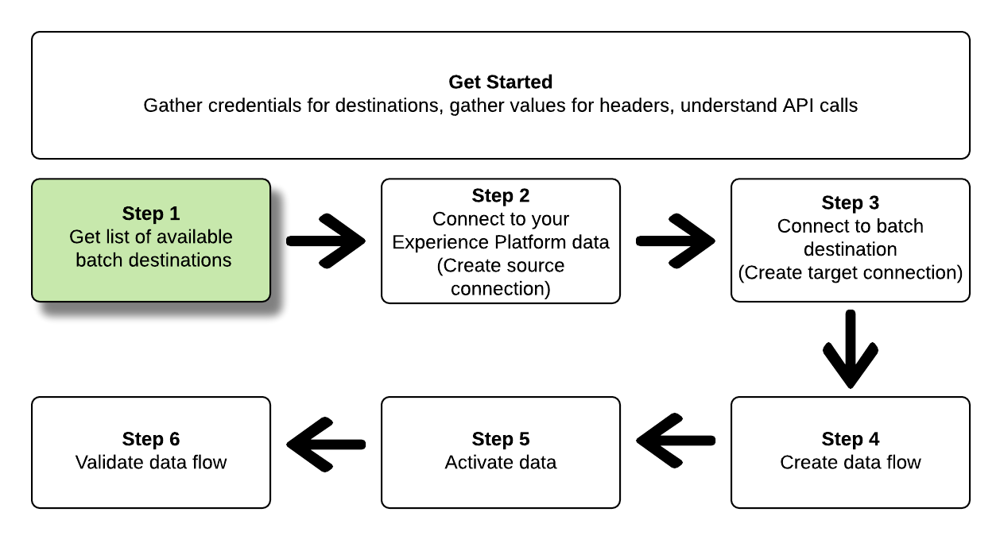

# 使用流服务API连接到批处理目标并激活数据

>[!IMPORTANT]
> 
>要连接到目标，您需要 **[!UICONTROL 管理目标]** [访问控制权限](/help/access-control/home.md#permissions).
>
>要激活数据，您需要 **[!UICONTROL 管理目标]**， **[!UICONTROL 激活目标]**， **[!UICONTROL 查看配置文件]**、和 **[!UICONTROL 查看区段]** [访问控制权限](/help/access-control/home.md#permissions).
>
>阅读 [访问控制概述](/help/access-control/ui/overview.md) 或与产品管理员联系以获取所需的权限。

本教程演示如何使用流服务API创建批处理 [云存储](../catalog/cloud-storage/overview.md) 或 [电子邮件营销目标](../catalog/email-marketing/overview.md)，创建一个数据流到新创建的目标，并通过CSV文件将数据导出到新创建的目标。

本教程使用 [!DNL Adobe Campaign] 所有示例中的目标，但所有批处理云存储和电子邮件营销目标的步骤都相同。


如果您希望使用Platform用户界面连接到目标并激活数据，请参阅 [连接目标](../ui/connect-destination.md) 和 [将受众数据激活到批量配置文件导出目标](../ui/activate-batch-profile-destinations.md) 教程。

## 快速入门 {#get-started}

本指南要求您对Adobe Experience Platform的以下组件有一定的了解：

* [[!DNL Experience Data Model (XDM) System]](../../xdm/home.md)：用于实现此目标的标准化框架 [!DNL Experience Platform] 组织客户体验数据。
* [[!DNL Segmentation Service]](../../segmentation/api/overview.md)： [!DNL Adobe Experience Platform Segmentation Service] 允许您在中构建受众 [!DNL Adobe Experience Platform] 来自您的 [!DNL Real-Time Customer Profile] 数据。
* [[!DNL Sandboxes]](../../sandboxes/home.md)： [!DNL Experience Platform] 提供对单个进行分区的虚拟沙盒 [!DNL Platform] 将实例安装到单独的虚拟环境中，以帮助开发和改进数字体验应用程序。

以下部分提供了将数据激活到Platform中的批处理目标所需的其他信息。

### 收集所需的凭据 {#gather-required-credentials}

要完成本教程中的步骤，您应该准备好以下凭据，具体取决于要连接和激活受众的目标类型。

* 对象 [!DNL Amazon S3] 连接： `accessId`， `secretKey`
* 对象 [!DNL Amazon S3] 连接至 [!DNL Adobe Campaign]： `accessId`， `secretKey`
* 对于SFTP连接： `domain`， `port`， `username`， `password` 或 `sshKey` （具体取决于与FTP位置的连接方法）
* 对象 [!DNL Azure Blob] 连接： `connectionString`

>[!NOTE]
>
>凭据 `accessId`， `secretKey` 对象 [!DNL Amazon S3] 连接和 `accessId`， `secretKey` 对象 [!DNL Amazon S3] 连接至 [!DNL Adobe Campaign] 完全相同。

### 正在读取示例API调用 {#reading-sample-api-calls}

本教程提供了示例API调用来演示如何设置请求的格式。 这些资源包括路径、必需的标头和格式正确的请求负载。 此外，还提供了在API响应中返回的示例JSON。 有关示例API调用文档中使用的约定的信息，请参阅以下章节： [如何读取示例API调用](../../landing/troubleshooting.md#how-do-i-format-an-api-request) 在 [!DNL Experience Platform] 疑难解答指南。

### 收集必需标题和可选标题的值 {#gather-values-headers}

为了调用 [!DNL Platform] API，您必须先完成 [身份验证教程](https://www.adobe.com/go/platform-api-authentication-en). 完成身份验证教程将提供所有中所有所需标头的值 [!DNL Experience Platform] API调用，如下所示：

* 授权：持有者 `{ACCESS_TOKEN}`
* x-api-key: `{API_KEY}`
* x-gw-ims-org-id: `{ORG_ID}`

中的资源 [!DNL Experience Platform] 可以隔离到特定的虚拟沙箱。 在请求中 [!DNL Platform] API中，您可以指定将在其中执行操作的沙盒的名称和ID。 这些是可选参数。

* x-sandbox-name: `{SANDBOX_NAME}`

>[!NOTE]
>
>有关中沙箱的详细信息 [!DNL Experience Platform]，请参见 [沙盒概述文档](../../sandboxes/home.md).

包含有效负载(POST、PUT、PATCH)的所有请求都需要额外的媒体类型标头：

* Content-Type: `application/json`

### API参考文档 {#api-reference-documentation}

您可以在本教程中找到所有API操作的随附参考文档。 请参阅 [有关Adobe I/O的流服务API文档](https://www.adobe.io/experience-platform-apis/references/flow-service/). 我们建议您并行使用此教程和API参考文档。

## 获取可用目标列表 {#get-the-list-of-available-destinations}



第一步，您应该决定要将数据激活到的目标。 首先，执行调用以请求可连接和激活受众的可用目标列表。 GET向 `connectionSpecs` 端点返回可用目标列表：

**API格式**

```http
GET /connectionSpecs
```

**请求**

```shell
curl --location --request GET 'https://platform.adobe.io/data/foundation/flowservice/connectionSpecs' \
--header 'accept: application/json' \
--header 'x-gw-ims-org-id: {ORG_ID}' \
--header 'x-api-key: {API_KEY}' \
--header 'x-sandbox-name: {SANDBOX_NAME}' \
--header 'Authorization: Bearer {ACCESS_TOKEN}'
```


**响应**

成功响应包含可用目标及其唯一标识符的列表(`id`)。 存储您计划使用的目标的值，因为后续步骤将要求使用该值。 例如，如果要连接并将受众交付到 [!DNL Adobe Campaign]，在响应中查找以下代码片段：

```json
{
    "id": "0b23e41a-cb4a-4321-a78f-3b654f5d7d97",
  "name": "Adobe Campaign",
  ...
  ...
}
```

下表包含常用批处理目标的连接规范ID，供您参考：

| 目标 | 连接规范ID |
---------|----------|
| [!DNL Adobe Campaign] | `0b23e41a-cb4a-4321-a78f-3b654f5d7d97` |
| [!DNL Amazon S3] | `4890fc95-5a1f-4983-94bb-e060c08e3f81` |
| [!DNL Azure Blob] | `e258278b-a4cf-43ac-b158-4fa0ca0d948b` |
| [!DNL Oracle Eloqua] | `c1e44b6b-e7c8-404b-9031-58f0ef760604` |
| [!DNL Oracle Responsys] | `a5e28ddf-e265-426e-83a1-9d03a3a6822b` |
| [!DNL Salesforce Marketing Cloud] | `f599a5b3-60a7-4951-950a-cc4115c7ea27` |
| SFTP | `64ef4b8b-a6e0-41b5-9677-3805d1ee5dd0` |

{style="table-layout:auto"}

## 连接到您的 [!DNL Experience Platform] 数据 {#connect-to-your-experience-platform-data}


接下来，您必须连接到 [!DNL Experience Platform] 数据，以便您可以导出配置文件数据并在首选目标中激活它。 这包含下面描述的两个子步骤。

1. 首先，您必须执行调用以授权对中的数据的访问 [!DNL Experience Platform]，通过设置基本连接。
2. 然后，使用基本连接ID执行另一个调用，您将在其中创建 *源连接*，以建立与贵机构的 [!DNL Experience Platform] 数据。

### 授权对您数据的访问 [!DNL Experience Platform]

**API格式**

```http
POST /connections
```

**请求**

```shell
curl --location --request POST 'https://platform.adobe.io/data/foundation/flowservice/connections' \
--header 'Authorization: Bearer {ACCESS_TOKEN}' \
--header 'x-api-key: {API_KEY}' \
--header 'x-gw-ims-org-id: {ORG_ID}' \
--header 'x-sandbox-name: {SANDBOX_NAME}' \
--header 'Content-Type: application/json' \
--data-raw '{
            "name": "Base connection to Experience Platform",
            "description": "This call establishes the connection to Experience Platform data",
            "connectionSpec": {
                "id": "{CONNECTION_SPEC_ID}",
                "version": "1.0"
            }
}'
```

| 属性 | 描述 |
| --------- | ----------- |
| `name` | 提供到Experience Platform的基本连接的名称 [!DNL Profile Store]. |
| `description` | 或者，您可以为基本连接提供描述。 |
| `connectionSpec.id` | 将连接规范ID用于 [Experience Platform配置文件存储](/help/profile/home.md#profile-data-store) - `8a9c3494-9708-43d7-ae3f-cda01e5030e1`. |

{style="table-layout:auto"}

**响应**

成功的响应包含基本连接的唯一标识符(`id`)。 将此值存储为创建源连接的下一步中所需的值。

```json
{
    "id": "1ed86558-59b5-42f7-9865-5859b552f7f4"
}
```

### 连接到您的 [!DNL Experience Platform] 数据 {#connect-to-platform-data}

**API格式**

```http
POST /sourceConnections
```

**请求**

```shell
curl --location --request POST 'https://platform.adobe.io/data/foundation/flowservice/sourceConnections' \
--header 'Authorization: Bearer {ACCESS_TOKEN}' \
--header 'x-api-key: {API_KEY}' \
--header 'x-gw-ims-org-id: {ORG_ID}' \
--header 'x-sandbox-name: {SANDBOX_NAME}' \
--header 'Content-Type: application/json' \
--data-raw '{
            "name": "Connecting to Profile Store",
            "description": "Optional",
            "connectionSpec": {
                "id": "{CONNECTION_SPEC_ID}",
                "version": "1.0"
            },
            "baseConnectionId": "{BASE_CONNECTION_ID}",
            "data": {
                "format": "CSV",
                "schema": null
            },
            "params" : {}
}'
```

| 属性 | 描述 |
| --------- | ----------- |
| `name` | 为与Experience Platform的源连接提供一个名称 [!DNL Profile Store]. |
| `description` | 或者，您可以为源连接提供描述。 |
| `connectionSpec.id` | 将连接规范ID用于 [Experience Platform配置文件存储](/help/profile/home.md#profile-data-store) - `8a9c3494-9708-43d7-ae3f-cda01e5030e1`. |
| `baseConnectionId` | 使用您在上一步中获取的基本连接ID。 |
| `data.format` | `CSV` 是当前唯一支持的文件导出格式。 |

{style="table-layout:auto"}

**响应**

成功响应将返回唯一标识符(`id`)作为新创建的源连接 [!DNL Profile Store]. 这表示您已成功连接到 [!DNL Experience Platform] 数据。 将此值存储为后续步骤中所需的值。

```json
{
    "id": "ed48ae9b-c774-4b6e-88ae-9bc7748b6e97"
}
```

## 连接到批处理目标 {#connect-to-batch-destination}


在此步骤中，您将设置与所需的批处理云存储或电子邮件营销目标的连接。 这包含下面描述的两个子步骤。

1. 首先，您必须执行调用以通过设置基本连接来授权对目标平台的访问。
2. 然后，使用基本连接ID再次调用，并在其中创建 *目标连接*，指定存储帐户中用于提交导出数据文件的位置，以及要导出的数据格式。

### 授权对批次目标的访问 {#authorize-access-to-batch-destination}

**API格式**

```http
POST /connections
```

**请求**

下面的请求建立与的基本连接 [!DNL Adobe Campaign] 目标。 根据要将文件导出到的存储位置([!DNL Amazon S3]、SFTP、 [!DNL Azure Blob])，保留相应的 `auth` 规范并删除其他项。

```shell
curl --location --request POST 'https://platform.adobe.io/data/foundation/flowservice/connections' \
--header 'Authorization: Bearer {ACCESS_TOKEN}' \
--header 'x-api-key: {API_KEY}' \
--header 'x-gw-ims-org-id: {ORG_ID}' \
--header 'x-sandbox-name: {SANDBOX_NAME}' \
--header 'Content-Type: application/json' \
--data-raw '{
    "name": "S3 Connection for Adobe Campaign",
    "description": "summer advertising campaign",
    "connectionSpec": {
        "id": "0b23e41a-cb4a-4321-a78f-3b654f5d7d97",
        "version": "1.0"
    },
    "auth": {
        "specName": "S3",
        "params": {
            "accessId": "{ACCESS_ID}",
            "secretKey": "{SECRET_KEY}"
        }
    }
    "auth": {
        "specName": "SFTP with Password",
        "params": {
            "domain": "{DOMAIN}",
            "host": "{HOST}",
            "username": "{USERNAME}",
            "password": "{PASSWORD}"
        }
    }
    "auth": {
        "specName": "SFTP with SSH Key",
        "params": {
            "domain": "{DOMAIN}",
            "host": "{HOST}",
            "username": "{USERNAME}",
            "sshKey": "{SSH_KEY}"
        }
    }        
    "auth": {
        "specName": "Azure Blob",
        "params": {
            "connectionString": "{AZURE_BLOB_CONNECTION_STRING}"
        }
    }    
}'
```

请参阅下面的示例请求，以连接到其他受支持的批量云存储和电子邮件营销目标。

+++ 要连接的示例请求 [!DNL Amazon S3] 目标

下面的请求建立与的基本连接 [!DNL Amazon S3] 目标。

```shell
curl --location --request POST 'https://platform.adobe.io/data/foundation/flowservice/connections' \
--header 'Authorization: Bearer {ACCESS_TOKEN}' \
--header 'x-api-key: {API_KEY}' \
--header 'x-gw-ims-org-id: {ORG_ID}' \
--header 'x-sandbox-name: {SANDBOX_NAME}' \
--header 'Content-Type: application/json' \
--data-raw '{
    "name": "Connect to Amazon S3",
    "description": "summer advertising campaign",
    "connectionSpec": {
        "id": "4890fc95-5a1f-4983-94bb-e060c08e3f81",
        "version": "1.0"
    },
    "auth": {
        "specName": "Access Key",
        "params": {
            "s3AccessKey": "{AMAZON_S3_ACCESS_KEY}",
            "s3SecretKey": "{AMAZON_S3_SECRET_KEY}"
        }
    }
}'
```

+++

+++ 要连接的示例请求 [!DNL Azure Blob] 目标

下面的请求建立与的基本连接 [!DNL Azure Blob] 目标。

```shell
curl --location --request POST 'https://platform.adobe.io/data/foundation/flowservice/connections' \
--header 'Authorization: Bearer {ACCESS_TOKEN}' \
--header 'x-api-key: {API_KEY}' \
--header 'x-gw-ims-org-id: {ORG_ID}' \
--header 'x-sandbox-name: {SANDBOX_NAME}' \
--header 'Content-Type: application/json' \
--data-raw '{
    "name": "Connect to Azure Blob",
    "description": "Summer advertising campaign",
    "connectionSpec": {
        "id": "e258278b-a4cf-43ac-b158-4fa0ca0d948b",
        "version": "1.0"
    },
    "auth": {
        "specName": "ConnectionString",
        "params": {
            "connectionString": "{AZURE_BLOB_CONNECTION_STRING}"
        }
    }
}'
```

+++

+++ 要连接的示例请求 [!DNL Oracle Eloqua] 目标

下面的请求建立与的基本连接 [!DNL Oracle Eloqua] 目标。 根据要将文件导出到的存储位置，保留相应的 `auth` 规范并删除其他项。

```shell
curl --location --request POST 'https://platform.adobe.io/data/foundation/flowservice/connections' \
--header 'Authorization: Bearer {ACCESS_TOKEN}' \
--header 'x-api-key: {API_KEY}' \
--header 'x-gw-ims-org-id: {ORG_ID}' \
--header 'x-sandbox-name: {SANDBOX_NAME}' \
--header 'Content-Type: application/json' \
--data-raw '{
    "name": "Connect to Eloqua destination",
    "description": "summer advertising campaign",
    "connectionSpec": {
        "id": "c1e44b6b-e7c8-404b-9031-58f0ef760604",
        "version": "1.0"
    },
    "auth": {
        "specName": "SFTP with Password",
        "params": {
            "domain": "{DOMAIN}",
            "host": "{HOST}",
            "username": "{USERNAME}",
            "password": "{PASSWORD}"
        }
    }
    "auth": {
        "specName": "SFTP with SSH Key",
        "params": {
            "domain": "{DOMAIN}",
            "host": "{HOST}",
            "username": "{USERNAME}",
            "sshKey": "{SSH_KEY}"
        }
    }    
}'
```

+++

+++ 要连接的示例请求 [!DNL Oracle Responsys] 目标

下面的请求建立与的基本连接 [!DNL Oracle Responsys] 目标。 根据要将文件导出到的存储位置，保留相应的 `auth` 规范并删除其他项。

```shell
curl --location --request POST 'https://platform.adobe.io/data/foundation/flowservice/connections' \
--header 'Authorization: Bearer {ACCESS_TOKEN}' \
--header 'x-api-key: {API_KEY}' \
--header 'x-gw-ims-org-id: {ORG_ID}' \
--header 'x-sandbox-name: {SANDBOX_NAME}' \
--header 'Content-Type: application/json' \
--data-raw '{
    "name": "Connect to Responsys destination",
    "description": "summer advertising campaign",
    "connectionSpec": {
        "id": "a5e28ddf-e265-426e-83a1-9d03a3a6822b",
        "version": "1.0"
    },
    "auth": {
        "specName": "SFTP with Password",
        "params": {
            "domain": "{DOMAIN}",
            "host": "{HOST}",
            "username": "{USERNAME}",
            "password": "{PASSWORD}"
        }
    }
    "auth": {
        "specName": "SFTP with SSH Key",
        "params": {
            "domain": "{DOMAIN}",
            "host": "{HOST}",
            "username": "{USERNAME}",
            "sshKey": "{SSH_KEY}"
        }
    }    
}'
```

+++

+++ 要连接的示例请求 [!DNL Salesforce Marketing Cloud] 目标

下面的请求建立与的基本连接 [!DNL Salesforce Marketing Cloud] 目标。 根据要将文件导出到的存储位置，保留相应的 `auth` 规范并删除其他项。

```shell
curl --location --request POST 'https://platform.adobe.io/data/foundation/flowservice/connections' \
--header 'Authorization: Bearer {ACCESS_TOKEN}' \
--header 'x-api-key: {API_KEY}' \
--header 'x-gw-ims-org-id: {ORG_ID}' \
--header 'x-sandbox-name: {SANDBOX_NAME}' \
--header 'Content-Type: application/json' \
--data-raw '{
    "name": "Connect to Salesforce Marketing Cloud",
    "description": "summer advertising campaign",
    "connectionSpec": {
        "id": "f599a5b3-60a7-4951-950a-cc4115c7ea27",
        "version": "1.0"
    },
    "auth": {
        "specName": "SFTP with Password",
        "params": {
            "domain": "{DOMAIN}",
            "host": "{HOST}",
            "username": "{USERNAME}",
            "password": "{PASSWORD}"
        }
    }
    "auth": {
        "specName": "SFTP with SSH Key",
        "params": {
            "domain": "{DOMAIN}",
            "host": "{HOST}",
            "username": "{USERNAME}",
            "sshKey": "{SSH_KEY}"
        }
    }    
}'
```

+++

+++ 使用密码目标连接到SFTP的请求示例

以下请求将建立与SFTP目标的基本连接。

```shell
curl --location --request POST 'https://platform.adobe.io/data/foundation/flowservice/connections' \
--header 'Authorization: Bearer {ACCESS_TOKEN}' \
--header 'x-api-key: {API_KEY}' \
--header 'x-gw-ims-org-id: {ORG_ID}' \
--header 'x-sandbox-name: {SANDBOX_NAME}' \
--header 'Content-Type: application/json' \
--data-raw '{
    "name": "Connect to SFTP with password",
    "description": "summer advertising campaign",
    "connectionSpec": {
        "id": "64ef4b8b-a6e0-41b5-9677-3805d1ee5dd0",
        "version": "1.0"
    },
    "auth": {
        "specName": "Basic Authentication for sftp",
        "params": {
            "host": "{HOST}",
            "username": "{USERNAME}",
            "password": "{PASSWORD}"
        }
    }
}'
```

+++

| 属性 | 描述 |
| --------- | ----------- |
| `name` | 为到批处理目标的基本连接提供一个名称。 |
| `description` | 或者，您可以为基本连接提供描述。 |
| `connectionSpec.id` | 使用连接规范ID作为所需的批处理目标。 您在步骤中获取了此ID [获取可用目标列表](#get-the-list-of-available-destinations). |
| `auth.specname` | 指示目标的身份验证格式。 要了解目标的specName，请执行 [对连接规范端点的GET调用](https://developer.adobe.com/experience-platform-apis/references/flow-service/#operation/retrieveConnectionSpec)，提供所需目标的连接规范。 查找参数 `authSpec.name` 作为回应。 <br> 例如，对于Adobe Campaign目标，您可以使用任意 `S3`， `SFTP with Password`，或 `SFTP with SSH Key`. |
| `params` | 根据要连接的目标，必须提供不同的必需身份验证参数。 对于Amazon S3连接，您必须向Amazon S3存储位置提供访问ID和密钥。 <br> 要了解目标所需的参数，请执行 [对连接规范端点的GET调用](https://developer.adobe.com/experience-platform-apis/references/flow-service/#operation/retrieveConnectionSpec)，提供所需目标的连接规范。 查找参数 `authSpec.spec.required` 作为回应。 |

{style="table-layout:auto"}

**响应**

成功的响应包含基本连接的唯一标识符(`id`)。 将此值存储为创建目标连接时在下一步中所需的值。

```json
{
    "id": "1ed86558-59b5-42f7-9865-5859b552f7f4"
}
```

### 指定存储位置和数据格式 {#specify-storage-location-data-format}

[!DNL Adobe Experience Platform] 以以下形式导出批量电子邮件营销和云存储目标的数据 [!DNL CSV] 文件。 在此步骤中，您可以确定导出文件的存储位置中的路径。

>[!IMPORTANT]
> 
>[!DNL Adobe Experience Platform] 自动以每个文件500万条记录（行）拆分导出文件。 每一行表示一个配置文件。
>
>拆分文件名后附加一个数字，指示文件是较大导出的一部分，例如： `filename.csv`， `filename_2.csv`， `filename_3.csv`.

**API格式**

```http
POST /targetConnections
```

**请求**

以下请求建立了目标连接 [!DNL Adobe Campaign] 目标，以确定导出的文件在存储位置中的登陆位置。 根据要将文件导出到的存储位置，保留相应的 `params` 规范并删除其他项。

```shell
curl --location --request POST 'https://platform.adobe.io/data/foundation/flowservice/targetConnections' \
--header 'Authorization: Bearer {ACCESS_TOKEN}' \
--header 'x-api-key: {API_KEY}' \
--header 'x-gw-ims-org-id: {ORG_ID}' \
--header 'Content-Type: application/json' \
--data-raw '{
    "name": "TargetConnection for Adobe Campaign",
    "description": "Connection to Adobe Campaign",
    "baseConnectionId": "{BASE_CONNECTION_ID}",
    "connectionSpec": {
        "id": "0b23e41a-cb4a-4321-a78f-3b654f5d7d97",
        "version": "1.0"
    },
    "data": {
        "format": "json",
        "schema": {
            "id": "1.0",
            "version": "1.0"
        }
    },
    "params": {
        "mode": "S3",
        "bucketName": "{BUCKET_NAME}",
        "path": "{FILEPATH}",
        "format": "CSV"
    }
    "params": {
        "mode": "AZURE_BLOB",
        "container": "{CONTAINER}",
        "path": "{FILEPATH}",
        "format": "CSV"
    }
    "params": {
        "mode": "FTP",
        "remotePath": "{REMOTE_PATH}",
        "format": "CSV"
    }        
}'
```

请参阅下面的示例请求，为其他受支持的批处理云存储和电子邮件营销目标设置存储位置。

+++ 设置存储位置的示例请求 [!DNL Amazon S3] 目标

以下请求建立了目标连接 [!DNL Amazon S3] 目标，以确定导出的文件在存储位置中的登陆位置。

```shell
curl --location --request POST 'https://platform.adobe.io/data/foundation/flowservice/targetConnections' \
--header 'Authorization: Bearer {ACCESS_TOKEN}' \
--header 'x-api-key: {API_KEY}' \
--header 'x-gw-ims-org-id: {ORG_ID}' \
--header 'Content-Type: application/json' \
--data-raw '{
    "name": "TargetConnection for Amazon S3",
    "description": "Connection to Amazon S3",
    "baseConnectionId": "{BASE_CONNECTION_ID}",
    "connectionSpec": {
        "id": "4890fc95-5a1f-4983-94bb-e060c08e3f81",
        "version": "1.0"
    },
    "data": {
        "format": "json",
        "schema": {
            "id": "1.0",
            "version": "1.0"
        }
    },
    "params": {
        "mode": "S3",
        "bucketName": "{BUCKET_NAME}",
        "path": "{FILEPATH}",
        "format": "CSV"
    }
}'
```

+++

+++ 设置存储位置的示例请求 [!DNL Azure Blob] 目标

以下请求建立了目标连接 [!DNL Azure Blob] 目标，以确定导出的文件在存储位置中的登陆位置。

```shell
curl --location --request POST 'https://platform.adobe.io/data/foundation/flowservice/targetConnections' \
--header 'Authorization: Bearer {ACCESS_TOKEN}' \
--header 'x-api-key: {API_KEY}' \
--header 'x-gw-ims-org-id: {ORG_ID}' \
--header 'Content-Type: application/json' \
--data-raw '{
    "name": "TargetConnection for Azure Blob",
    "description": "Connection to Azure Blob",
    "baseConnectionId": "{BASE_CONNECTION_ID}",
    "connectionSpec": {
        "id": "e258278b-a4cf-43ac-b158-4fa0ca0d948b",
        "version": "1.0"
    },
    "data": {
        "format": "json",
        "schema": {
            "id": "1.0",
            "version": "1.0"
        }
    },
    "params": {
        "mode": "AZURE_BLOB",
        "container": "{CONTAINER}",
        "path": "{FILEPATH}",
        "format": "CSV"
    }
}'
```

+++

+++ 设置存储位置的示例请求 [!DNL Oracle Eloqua] 目标

以下请求建立了目标连接 [!DNL Oracle Eloqua] 目标，以确定导出的文件在存储位置中的登陆位置。 根据要将文件导出到的存储位置，保留相应的 `params` 规范并删除其他项。

```shell
curl --location --request POST 'https://platform.adobe.io/data/foundation/flowservice/targetConnections' \
--header 'Authorization: Bearer {ACCESS_TOKEN}' \
--header 'x-api-key: {API_KEY}' \
--header 'x-gw-ims-org-id: {ORG_ID}' \
--header 'Content-Type: application/json' \
--data-raw '{
    "name": "TargetConnection for Oracle Eloqua",
    "description": "Connection to Oracle Eloqua",
    "baseConnectionId": "{BASE_CONNECTION_ID}",
    "connectionSpec": {
        "id": "c1e44b6b-e7c8-404b-9031-58f0ef760604",
        "version": "1.0"
    },
    "data": {
        "format": "json",
        "schema": {
            "id": "1.0",
            "version": "1.0"
        }
    },
    "params": {
        "mode": "S3",
        "bucketName": "{BUCKET_NAME}",
        "path": "{FILEPATH}",
        "format": "CSV"
    }
    "params": {
        "mode": "FTP",
        "remotePath": "{REMOTE_PATH}",
        "format": "CSV"
    }        
}'
```

+++

+++ 设置存储位置的示例请求 [!DNL Oracle Responsys] 目标

以下请求建立了目标连接 [!DNL Oracle Responsys] 目标，以确定导出的文件在存储位置中的登陆位置。 根据要将文件导出到的存储位置，保留相应的 `params` 规范并删除其他项。

```shell
curl --location --request POST 'https://platform.adobe.io/data/foundation/flowservice/targetConnections' \
--header 'Authorization: Bearer {ACCESS_TOKEN}' \
--header 'x-api-key: {API_KEY}' \
--header 'x-gw-ims-org-id: {ORG_ID}' \
--header 'Content-Type: application/json' \
--data-raw '{
    "name": "TargetConnection for Oracle Responsys",
    "description": "Connection to Oracle Responsys",
    "baseConnectionId": "{BASE_CONNECTION_ID}",
    "connectionSpec": {
        "id": "a5e28ddf-e265-426e-83a1-9d03a3a6822b",
        "version": "1.0"
    },
    "data": {
        "format": "json",
        "schema": {
            "id": "1.0",
            "version": "1.0"
        }
    },
    "params": {
        "mode": "S3",
        "bucketName": "{BUCKET_NAME}",
        "path": "{FILEPATH}",
        "format": "CSV"
    }
    "params": {
        "mode": "FTP",
        "remotePath": "{REMOTE_PATH}",
        "format": "CSV"
    }        
}'
```

+++

+++ 设置存储位置的示例请求 [!DNL Salesforce Marketing Cloud] 目标

以下请求建立了目标连接 [!DNL Salesforce Marketing Cloud] 目标，以确定导出的文件在存储位置中的登陆位置。 根据要将文件导出到的存储位置，保留相应的 `params` 规范并删除其他项。

```shell
curl --location --request POST 'https://platform.adobe.io/data/foundation/flowservice/targetConnections' \
--header 'Authorization: Bearer {ACCESS_TOKEN}' \
--header 'x-api-key: {API_KEY}' \
--header 'x-gw-ims-org-id: {ORG_ID}' \
--header 'Content-Type: application/json' \
--data-raw '{
    "name": "TargetConnection for Salesforce Marketing Cloud",
    "description": "Connection to Salesforce Marketing Cloud",
    "baseConnectionId": "{BASE_CONNECTION_ID}",
    "connectionSpec": {
        "id": "f599a5b3-60a7-4951-950a-cc4115c7ea27",
        "version": "1.0"
    },
    "data": {
        "format": "json",
        "schema": {
            "id": "1.0",
            "version": "1.0"
        }
    },
    "params": {
        "mode": "S3",
        "bucketName": "{BUCKET_NAME}",
        "path": "{FILEPATH}",
        "format": "CSV"
    }
    "params": {
        "mode": "FTP",
        "remotePath": "{REMOTE_PATH}",
        "format": "CSV"
    }        
}'
```

+++

+++ 为SFTP目标设置存储位置的示例请求

以下请求会建立与SFTP目标的目标连接，以确定导出的文件将登陆到您的存储位置的位置。

```shell
curl --location --request POST 'https://platform.adobe.io/data/foundation/flowservice/targetConnections' \
--header 'Authorization: Bearer {ACCESS_TOKEN}' \
--header 'x-api-key: {API_KEY}' \
--header 'x-gw-ims-org-id: {ORG_ID}' \
--header 'Content-Type: application/json' \
--data-raw '{
    "name": "TargetConnection for SFTP",
    "description": "Connection to SFTP",
    "baseConnectionId": "{BASE_CONNECTION_ID}",
    "connectionSpec": {
        "id": "64ef4b8b-a6e0-41b5-9677-3805d1ee5dd0",
        "version": "1.0"
    },
    "data": {
        "format": "json",
        "schema": {
            "id": "1.0",
            "version": "1.0"
        }
    },
    "params": {
        "mode": "FTP",
        "remotePath": "{REMOTE_PATH}",
    }
}'
```

+++


| 属性 | 描述 |
| --------- | ----------- |
| `name` | 为到批处理目标的目标连接提供一个名称。 |
| `description` | 或者，您可以为目标连接提供描述。 |
| `baseConnectionId` | 使用您在上面步骤中创建的基本连接的ID。 |
| `connectionSpec.id` | 使用连接规范ID作为所需的批处理目标。 您在步骤中获取了此ID [获取可用目标列表](#get-the-list-of-available-destinations). |
| `params` | 根据要连接的目标，必须为存储位置提供不同的必需参数。 对于Amazon S3连接，您必须向Amazon S3存储位置提供访问ID和密钥。 <br> 要了解目标所需的参数，请执行 [对连接规范端点的GET调用](https://developer.adobe.com/experience-platform-apis/references/flow-service/#operation/retrieveConnectionSpec)，提供所需目标的连接规范。 查找参数 `targetSpec.spec.required` 作为回应。 |
| `params.mode` | 根据目标支持的模式，必须在此处提供不同的值。 要了解目标所需的参数，请执行 [对连接规范端点的GET调用](https://developer.adobe.com/experience-platform-apis/references/flow-service/#operation/retrieveConnectionSpec)，提供所需目标的连接规范。 查找参数 `targetSpec.spec.properties.mode.enum` ，然后选择所需的模式。 |
| `params.bucketName` | 对于S3连接，提供文件将导出到的存储段的名称。 |
| `params.path` | 对于S3连接，在要导出文件的存储位置中提供文件路径。 |
| `params.format` | `CSV` 是当前唯一支持的文件导出类型。 |

{style="table-layout:auto"}

**响应**

成功响应将返回唯一标识符(`id`)，以获取指向批处理目标的新创建目标连接。 将此值存储为后续步骤中所需的值。

```json
{
    "id": "12ab90c7-519c-4291-bd20-d64186b62da8"
}
```

## 创建数据流 {#create-dataflow}


现在，您可以使用在之前步骤中获得的流规范、源连接和目标连接ID，在 [!DNL Experience Platform] 数据以及导出数据文件的目标。 将此步骤视为构建管道，数据稍后将通过该管道在 [!DNL Experience Platform] 以及您想要的目的地。

要创建数据流，请执行如下所示的POST请求，同时在有效负载中提供下面提到的值。

**API格式**

```http
POST /flows
```

**请求**

```shell
curl -X POST \
'https://platform.adobe.io/data/foundation/flowservice/flows' \
-H 'Authorization: Bearer {ACCESS_TOKEN}' \
-H 'x-api-key: {API_KEY}' \
-H 'x-gw-ims-org-id: {ORG_ID}' \
-H 'x-sandbox-name: {SANDBOX_NAME}' \
-H 'Content-Type: application/json' \
-d  '{
   
        "name": "activate audiences to Adobe Campaign",
        "description": "This operation creates a dataflow which we will later use to activate audiences to Adobe Campaign",
        "flowSpec": {
            "id": "{FLOW_SPEC_ID}",
            "version": "1.0"
        },
        "sourceConnectionIds": [
            "{SOURCE_CONNECTION_ID}"
        ],
        "targetConnectionIds": [
            "{TARGET_CONNECTION_ID}"
        ],
        "transformations": [
            {
                "name": "GeneralTransform",
                "params": {
                    "segmentSelectors": {
                        "selectors": []
                    },
                    "profileSelectors": {
                        "selectors": []
                    }
                }
            }
        ]
    }
```

| 属性 | 描述 |
| --------- | ----------- |
| `name` | 提供正在创建的数据流的名称。 |
| `description` | 或者，您可以为数据流提供描述。 |
| `flowSpec.Id` | 为要连接的批处理目标使用流规范ID。 GET要检索流规范ID，请对 `flowspecs` 端点，如 [流量规范API参考文档](https://www.adobe.io/experience-platform-apis/references/flow-service/#operation/retrieveFlowSpec). 在响应中，查找 `upsTo` 并复制要连接的批处理目标的相应ID。 例如，对于Adobe Campaign，查找 `upsToCampaign` 并复制 `id` 参数。 |
| `sourceConnectionIds` | 使用在步骤中获得的源连接ID [连接到您的Experience Platform数据](#connect-to-your-experience-platform-data). |
| `targetConnectionIds` | 使用在步骤中获取的目标连接ID [连接到批处理目标](#connect-to-batch-destination). |
| `transformations` | 在下一步中，您将使用要激活的受众和配置文件属性填充此部分。 |

下表包含常用批处理目标的流规范ID以供您参考：

| 目标 | 流量规范ID |
---------|----------|
| 所有云存储目标([!DNL Amazon S3]、SFTP、 [!DNL Azure Blob])和 [!DNL Oracle Eloqua] | `71471eba-b620-49e4-90fd-23f1fa0174d8` |
| [!DNL Oracle Responsys] | `51d675ce-e270-408d-91fc-22717bdf2148` |
| [!DNL Salesforce Marketing Cloud] | `493b2bd6-26e4-4167-ab3b-5e910bba44f0` |

**响应**

成功的响应会返回ID (`id`)和 `etag`. 记下这两个值，以便在下一步激活受众和导出数据文件时使用这些值。

```json
{
    "id": "8256cfb4-17e6-432c-a469-6aedafb16cd5",
    "etag": "8256cfb4-17e6-432c-a469-6aedafb16cd5"
}
```


## 将数据激活到新目标 {#activate-data}


创建了所有连接和数据流后，您现在可以将配置文件数据激活到目标平台。 在此步骤中，选择要导出到目标的受众和配置文件属性。

您还可以确定导出文件的文件命名格式以及应使用的属性 [重复数据删除键](../ui/activate-batch-profile-destinations.md#mandatory-keys) 或 [必需属性](../ui/activate-batch-profile-destinations.md#mandatory-attributes). 在此步骤中，您还可以确定将数据发送到目标的计划。

要将受众激活到新目标，您必须执行JSONPATCH操作，类似于以下示例。 您可以在一次调用中激活多个受众和配置文件属性。 要了解有关JSONPATCH的更多信息，请参阅 [RFC规范](https://tools.ietf.org/html/rfc6902).

**API格式**

```http
PATCH /flows
```

**请求**

```shell
curl --location --request PATCH 'https://platform.adobe.io/data/foundation/flowservice/flows/{DATAFLOW_ID}' \
--header 'Authorization: Bearer {ACCESS_TOKEN}' \
--header 'x-api-key: {API_KEY}' \
--header 'x-gw-ims-org-id: {ORG_ID}' \
--header 'Content-Type: application/json' \
--header 'x-sandbox-name: {SANDBOX_NAME}' \
--header 'If-Match: "{ETAG}"' \
--data-raw '[
    {
        "op": "add",
        "path": "/transformations/0/params/segmentSelectors/selectors/-",
        "value": {
            "type": "PLATFORM_SEGMENT",
            "value": {
                "name": "Name of the audience that you are activating",
                "description": "Description of the audience that you are activating",
                "id": "{SEGMENT_ID}",
                "filenameTemplate": "%DESTINATION_NAME%_%SEGMENT_ID%_%DATETIME(YYYYMMdd_HHmmss)%",
                "exportMode": "DAILY_FULL_EXPORT",
                "schedule": {
                    "frequency": "ONCE",
                    "startDate": "2021-12-20",
                    "startTime": "17:00"
                } 
            }
        }
    },
{
        "op": "add",
        "path": "/transformations/0/params/segmentSelectors/selectors/-",
        "value": {
            "type": "PLATFORM_SEGMENT",
            "value": {
                "name": "Name of the audience that you are activating",
                "description": "Description of the audience that you are activating",
                "id": "{SEGMENT_ID}",
                "filenameTemplate": "%DESTINATION_NAME%_%SEGMENT_ID%_%DATETIME(YYYYMMdd_HHmmss)%",
                "exportMode": "DAILY_FULL_EXPORT",
                "schedule": {
                    "frequency": "ONCE",
                    "triggerType": "SCHEDULED",
                    "startDate": "2021-12-20",
                    "startTime": "17:00"
                },   
            }
        }
    },
{
        "op": "add",
        "path": "/transformations/0/params/profileSelectors/selectors/-",
        "value": {
            "type": "JSON_PATH",
            "value": {
                "path": "{PROFILE_ATTRIBUTE}"
            }
        }
    }
]
```

| 属性 | 描述 |
| --------- | ----------- |
| `{DATAFLOW_ID}` | 在URL中，使用您在上一步中创建的数据流的ID。 |
| `{ETAG}` | 获取 `{ETAG}` 根据上一步的响应， [创建数据流](#create-dataflow). 上一步中的响应格式带有转义引号。 您必须在请求的标头中使用未转义值。 请参阅以下示例： <br> <ul><li>响应示例： `"etag":""7400453a-0000-1a00-0000-62b1c7a90000""`</li><li>要在请求中使用的值： `"etag": "7400453a-0000-1a00-0000-62b1c7a90000"`</li></ul> <br> 每次成功更新数据流时，etag值都会更新。 |
| `{SEGMENT_ID}` | 提供要导出到此目标的受众ID。 要检索要激活的受众的受众ID，请参阅 [检索受众定义](https://www.adobe.io/experience-platform-apis/references/segmentation/#operation/retrieveSegmentDefinitionById) (在Experience PlatformAPI引用中)。 |
| `{PROFILE_ATTRIBUTE}` | 例如：`"person.lastName"` |
| `op` | 用于定义更新数据流所需的操作的操作调用。 操作包括： `add`， `replace`、和 `remove`. 要将受众添加到数据流，请使用 `add` 操作。 |
| `path` | 定义要更新的流部分。 将受众添加到数据流时，请使用示例中指定的路径。 |
| `value` | 您希望使用更新参数的新值。 |
| `id` | 指定要添加到目标数据流的受众的ID。 |
| `name` | *可选*. 指定要添加到目标数据流的受众名称。 请注意，此字段不是必填字段，您无需提供名称即可成功将受众添加到目标数据流。 |
| `filenameTemplate` | 此字段确定导出到目标的文件的文件名格式。 <br> 可以使用以下选项: <br> <ul><li>`%DESTINATION_NAME%`：必需。 导出的文件包含目标名称。</li><li>`%SEGMENT_ID%`：必需。 导出的文件包含导出的受众的ID。</li><li>`%SEGMENT_NAME%`: 可选. 导出的文件包含导出的受众的名称。</li><li>`DATETIME(YYYYMMdd_HHmmss)` 或 `%TIMESTAMP%`：可选。 为文件选择这两个选项之一，以包括通过Experience Platform生成文件的时间。</li><li>`custom-text`: 可选. 将此占位符替换为您要在文件名末尾附加的任何自定义文本。</li></ul> <br> 有关配置文件名的详细信息，请参阅 [配置文件名](/help/destinations/ui/activate-batch-profile-destinations.md#file-names) 部分（在批量目标激活教程中）。 |
| `exportMode` | 必需。 选择 `"DAILY_FULL_EXPORT"` 或 `"FIRST_FULL_THEN_INCREMENTAL"`。有关这两个选项的更多信息，请参阅 [导出完整文件](/help/destinations/ui/activate-batch-profile-destinations.md#export-full-files) 和 [导出增量文件](/help/destinations/ui/activate-batch-profile-destinations.md#export-incremental-files) 在batch destinations activation教程中。 |
| `startDate` | 选择受众应开始将用户档案导出到目标的日期。 |
| `frequency` | 必需。 <br> <ul><li>对于 `"DAILY_FULL_EXPORT"` 导出模式，您可以选择 `ONCE` 或 `DAILY`.</li><li>对于 `"FIRST_FULL_THEN_INCREMENTAL"` 导出模式，您可以选择 `"DAILY"`， `"EVERY_3_HOURS"`， `"EVERY_6_HOURS"`， `"EVERY_8_HOURS"`， `"EVERY_12_HOURS"`.</li></ul> |
| `triggerType` | 对象 *批处理目标* 仅此而已。 只有在选择 `"DAILY_FULL_EXPORT"` 中的模式 `frequency` 选择器。 <br> 必需。 <br> <ul><li>选择 `"AFTER_SEGMENT_EVAL"` 使激活作业在每日平台批量分段作业完成后立即运行。 这可确保在激活作业运行时，将最新的用户档案导出到您的目标。</li><li>选择 `"SCHEDULED"` 使激活作业在固定时间运行。 这可以确保每天在同一时间导出Experience Platform用户档案数据，但您导出的用户档案可能不是最新的，具体取决于批量分段作业是否在激活作业开始之前完成。 选择此选项时，您还必须添加 `startTime` 用于指示每日导出应在UTC中的哪个时间发生。</li></ul> |
| `endDate` | 对象 *批处理目标* 仅此而已。 只有在批处理文件导出目标(如Amazon S3、SFTP或Azure Blob)中将受众添加到数据流时，才需要此字段。 <br> 选择时不适用 `"exportMode":"DAILY_FULL_EXPORT"` 和 `"frequency":"ONCE"`. <br> 设置受众成员停止导出到目标的日期。 |
| `startTime` | 对象 *批处理目标* 仅此而已。 只有在批处理文件导出目标(如Amazon S3、SFTP或Azure Blob)中将受众添加到数据流时，才需要此字段。 <br> 必需。 选择应生成包含受众成员的文件并将其导出到目标的时间。 |

{style="table-layout:auto"}

>[!TIP]
>
> 参见 [更新数据流中受众的组件](/help/destinations/api/update-destination-dataflows.md#update-segment) 了解如何更新导出受众的各种组件（文件名模板、导出时间等）。

**响应**

查找202 Accepted响应。 未返回响应正文。 要验证请求是否正确，请参阅下一步， [验证数据流](#validate-dataflow).

## 验证数据流 {#validate-dataflow}


作为本教程的最后一步，您应该验证受众和配置文件属性是否确实已正确映射到数据流。

要验证这一点，请执行以下GET请求：

**API格式**

```http
GET /flows
```

**请求**

```shell
curl --location --request PATCH 'https://platform.adobe.io/data/foundation/flowservice/flows/{DATAFLOW_ID}' \
--header 'Authorization: Bearer {ACCESS_TOKEN}' \
--header 'x-api-key: {API_KEY}' \
--header 'x-gw-ims-org-id: {ORG_ID}' \
--header 'Content-Type: application/json' \
--header 'x-sandbox-name: prod' \
--header 'If-Match: "{ETAG}"' 
```

* `{DATAFLOW_ID}`：使用上一步骤的数据流。
* `{ETAG}`：使用上一步骤中的etag。

**响应**

返回的响应应包含在 `transformations` 参数是您在上一步中提交的受众和配置文件属性。 示例 `transformations` 响应中的参数可能如下所示：

```json
"transformations":[
   {
      "name":"GeneralTransform",
      "params":{
         "profileSelectors":{
            "selectors":[
               {
                  "type":"JSON_PATH",
                  "value":{
                     "path":"homeAddress.countryCode",
                     "operator":"EXISTS",
                     "mapping":{
                        "sourceType":"text/x.schema-path",
                        "source":"homeAddress.countryCode",
                        "destination":"homeAddress.countryCode",
                        "identity":false,
                        "primaryIdentity":false,
                        "functionVersion":0,
                        "copyModeMapping":false,
                        "sourceAttribute":"homeAddress.countryCode",
                        "destinationXdmPath":"homeAddress.countryCode"
                     }
                  }
               },
               {
                  "type":"JSON_PATH",
                  "value":{
                     "path":"person.name.firstName",
                     "operator":"EXISTS",
                     "mapping":{
                        "sourceType":"text/x.schema-path",
                        "source":"person.name.firstName",
                        "destination":"person.name.firstName",
                        "identity":false,
                        "primaryIdentity":false,
                        "functionVersion":0,
                        "copyModeMapping":false,
                        "sourceAttribute":"person.name.firstName",
                        "destinationXdmPath":"person.name.firstName"
                     }
                  }
               },
               {
                  "type":"JSON_PATH",
                  "value":{
                     "path":"person.name.lastName",
                     "operator":"EXISTS",
                     "mapping":{
                        "sourceType":"text/x.schema-path",
                        "source":"person.name.lastName",
                        "destination":"person.name.lastName",
                        "identity":false,
                        "primaryIdentity":false,
                        "functionVersion":0,
                        "copyModeMapping":false,
                        "sourceAttribute":"person.name.lastName",
                        "destinationXdmPath":"person.name.lastName"
                     }
                  }
               },
               {
                  "type":"JSON_PATH",
                  "value":{
                     "path":"personalEmail.address",
                     "operator":"EXISTS",
                     "mapping":{
                        "sourceType":"text/x.schema-path",
                        "source":"personalEmail.address",
                        "destination":"personalEmail.address",
                        "identity":false,
                        "primaryIdentity":false,
                        "functionVersion":0,
                        "copyModeMapping":false,
                        "sourceAttribute":"personalEmail.address",
                        "destinationXdmPath":"personalEmail.address"
                     }
                  }
               },
               {
                  "type":"JSON_PATH",
                  "value":{
                     "path":"segmentMembership.status",
                     "operator":"EXISTS",
                     "mapping":{
                        "sourceType":"text/x.schema-path",
                        "source":"segmentMembership.status",
                        "destination":"segmentMembership.status",
                        "identity":false,
                        "primaryIdentity":false,
                        "functionVersion":0,
                        "copyModeMapping":false,
                        "sourceAttribute":"segmentMembership.status",
                        "destinationXdmPath":"segmentMembership.status"
                     }
                  }
               }
            ],
            "mandatoryFields":[
               "person.name.firstName",
               "person.name.lastName"
            ],
            "primaryFields":[
               {
                  "fieldType":"ATTRIBUTE",
                  "attributePath":"personalEmail.address"
               }
            ]
         },
         "segmentSelectors":{
            "selectors":[
               {
                  "type":"PLATFORM_SEGMENT",
                  "value":{
                     "id":"9f7d37fd-7039-4454-94ef-2b0cd6c3206a",
                     "name":"Interested in Mountain Biking",
                     "filenameTemplate":"%DESTINATION_NAME%_%SEGMENT_ID%_%DATETIME(YYYYMMdd_HHmmss)%",
                     "exportMode":"DAILY_FULL_EXPORT",
                     "schedule":{
                        "frequency":"ONCE",
                        "startDate":"2021-12-20",
                        "startTime":"17:00"
                     },
                     "createTime":"1640016962",
                     "updateTime":"1642534355"
                  }
               },
               {
                  "type":"PLATFORM_SEGMENT",
                  "value":{
                     "id":"25768be6-ebd5-45cc-8913-12fb3f348613",
                     "name":"Loyalty Segment",
                     "filenameTemplate":"%DESTINATION_NAME%_%SEGMENT_ID%_%DATETIME(YYYYMMdd_HHmmss)%",
                     "exportMode":"FIRST_FULL_THEN_INCREMENTAL",
                     "schedule":{
                        "frequency":"EVERY_6_HOURS",
                        "startDate":"2021-12-22",
                        "endDate":"2021-12-31",
                        "startTime":"17:00"
                     },
                     "createTime":"1640016962",
                     "updateTime":"1642534355"
                  }
               }
            ]
         }
      }
   }
]
```

## API错误处理 {#api-error-handling}

本教程中的API端点遵循常规Experience PlatformAPI错误消息原则。 请参阅 [API状态代码](/help/landing/troubleshooting.md#api-status-codes) 和 [请求标头错误](/help/landing/troubleshooting.md#request-header-errors) 有关解释错误响应的更多信息，请参阅Platform疑难解答指南。

## 后续步骤 {#next-steps}

通过阅读本教程，您已成功将Platform连接到其中一个首选批量云存储或电子邮件营销目标，并设置了到相应目标的数据流以导出数据文件。 现在，传出数据可用于电子邮件促销活动、定向广告和许多其他用例的目标。 有关更多详细信息，请参阅以下页面，例如如何使用流服务API编辑现有数据流：

* [目标概述](../home.md)
* [目标目录概述](../catalog/overview.md)
* [使用流服务API更新目标数据流](../api/update-destination-dataflows.md)
