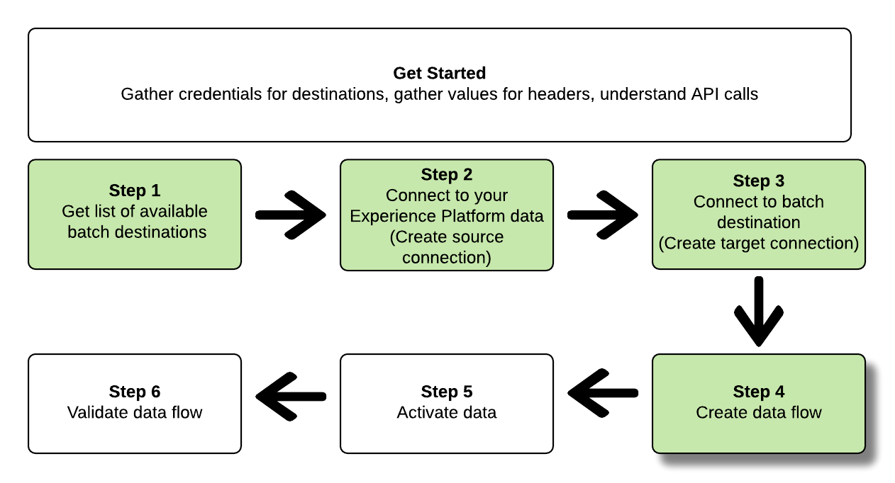

# 连接到批处理目标，并使用流量服务API激活数据

>[!IMPORTANT]
> 
>要连接到目标，您需要 **[!UICONTROL 管理目标]** [访问控制权限](/help/access-control/home.md#permissions).
>
>要激活数据，您需要 **[!UICONTROL 管理目标]**, **[!UICONTROL 激活目标]**, **[!UICONTROL 查看配置文件]**&#x200B;和 **[!UICONTROL 查看区段]** [访问控制权限](/help/access-control/home.md#permissions).
>
>阅读 [访问控制概述](/help/access-control/ui/overview.md) 或联系您的产品管理员以获取所需的权限。

本教程演示了如何使用流量服务API创建批处理 [云存储](../catalog/cloud-storage/overview.md) 或 [电子邮件营销目标](../catalog/email-marketing/overview.md)，创建数据流到新创建的目标，并通过CSV文件将数据导出到新创建的目标。

本教程使用 [!DNL Adobe Campaign] 目标，但所有批量云存储和电子邮件营销目标的步骤都相同。


如果您希望使用Platform用户界面连接到目标并激活数据，请参阅 [连接目标](../ui/connect-destination.md) 和 [激活受众数据以批量配置文件导出目标](../ui/activate-batch-profile-destinations.md) 教程。

## 快速入门 {#get-started}

本指南要求您对Adobe Experience Platform的以下组件有一定的了解：

* [[!DNL Experience Data Model (XDM) System]](../../xdm/home.md):标准化框架， [!DNL Experience Platform] 组织客户体验数据。
* [[!DNL Segmentation Service]](../../segmentation/api/overview.md): [!DNL Adobe Experience Platform Segmentation Service] 允许您在 [!DNL Adobe Experience Platform] 从 [!DNL Real-time Customer Profile] 数据。
* [[!DNL Sandboxes]](../../sandboxes/home.md): [!DNL Experience Platform] 提供分区单个沙箱的虚拟沙箱 [!DNL Platform] 实例迁移到单独的虚拟环境中，以帮助开发和改进数字体验应用程序。

以下部分提供了在平台中将数据激活到批处理目标所需了解的其他信息。

### 收集所需的凭据 {#gather-required-credentials}

要完成本教程中的步骤，您应准备好以下凭据，具体取决于您连接和激活区段的目标类型。

* 对于 [!DNL Amazon S3] 连接： `accessId`, `secretKey`
* 对于 [!DNL Amazon S3] 连接 [!DNL Adobe Campaign]: `accessId`, `secretKey`
* 对于SFTP连接： `domain`, `port`, `username`, `password` 或 `sshKey` （取决于与FTP位置的连接方法）
* 对于 [!DNL Azure Blob] 连接： `connectionString`

>[!NOTE]
>
>凭据 `accessId`, `secretKey` 表示 [!DNL Amazon S3] 连接和 `accessId`, `secretKey` 表示 [!DNL Amazon S3] 连接 [!DNL Adobe Campaign] 是相同的。

### 读取示例API调用 {#reading-sample-api-calls}

本教程提供了用于演示如何设置请求格式的示例API调用。 这包括路径、所需标头以及格式正确的请求负载。 还提供了API响应中返回的示例JSON。 有关示例API调用文档中使用的约定的信息，请参阅 [如何阅读示例API调用](../../landing/troubleshooting.md#how-do-i-format-an-api-request) 在 [!DNL Experience Platform] 疑难解答指南。

### 收集必需和可选标题的值 {#gather-values-headers}

为了调用 [!DNL Platform] API，您必须先完成 [身份验证教程](https://www.adobe.com/go/platform-api-authentication-en). 完成身份验证教程将为所有中每个所需标头提供值 [!DNL Experience Platform] API调用，如下所示：

* 授权：持有者 `{ACCESS_TOKEN}`
* x-api-key: `{API_KEY}`
* x-gw-ims-org-id: `{ORG_ID}`

中的资源 [!DNL Experience Platform] 可与特定虚拟沙箱隔离。 在 [!DNL Platform] API中，您可以指定操作将在其中进行的沙盒的名称和ID。 这些是可选参数。

* x-sandbox-name: `{SANDBOX_NAME}`

>[!NOTE]
>
>有关 [!DNL Experience Platform]，请参阅 [沙盒概述文档](../../sandboxes/home.md).

所有包含有效负载(POST、PUT、PATCH)的请求都需要额外的媒体类型标头：

* Content-Type: `application/json`

### API参考文档 {#api-reference-documentation}

您可以在本教程中找到所有API操作的随附参考文档。 请参阅 [关于流量服务API的文档Adobe I/O](https://www.adobe.io/experience-platform-apis/references/flow-service/). 我们建议您并行使用本教程和API参考文档。

## 获取可用目标列表 {#get-the-list-of-available-destinations}


作为第一步，您应该确定要激活数据的目标。 首先，执行调用以请求可连接和激活区段的可用目标列表。 对执行以下GET请求 `connectionSpecs` 用于返回可用目标列表的端点：

**API格式**

```http
GET /connectionSpecs
```

**请求**

```shell
curl --location --request GET 'https://platform.adobe.io/data/foundation/flowservice/connectionSpecs' \
--header 'accept: application/json' \
--header 'x-gw-ims-org-id: {ORG_ID}' \
--header 'x-api-key: {API_KEY}' \
--header 'x-sandbox-name: {SANDBOX_NAME}' \
--header 'Authorization: Bearer {ACCESS_TOKEN}'
```


**响应**

成功的响应包含可用目标及其唯一标识符的列表(`id`)。 存储您计划使用的目标值，因为在后续步骤中需要该值。 例如，如果您要将区段连接并交付到 [!DNL Adobe Campaign]，在响应中查找以下代码片段：

```json
{
    "id": "0b23e41a-cb4a-4321-a78f-3b654f5d7d97",
  "name": "Adobe Campaign",
  ...
  ...
}
```

下表包含常用批处理目标的连接规范ID供您参考：

| 目标 | 连接规范ID |
---------|----------|
| [!DNL Adobe Campaign] | `0b23e41a-cb4a-4321-a78f-3b654f5d7d97` |
| [!DNL Amazon S3] | `4890fc95-5a1f-4983-94bb-e060c08e3f81` |
| [!DNL Azure Blob] | `e258278b-a4cf-43ac-b158-4fa0ca0d948b` |
| [!DNL Oracle Eloqua] | `c1e44b6b-e7c8-404b-9031-58f0ef760604` |
| [!DNL Oracle Responsys] | `a5e28ddf-e265-426e-83a1-9d03a3a6822b` |
| [!DNL Salesforce Marketing Cloud] | `f599a5b3-60a7-4951-950a-cc4115c7ea27` |
| SFTP | `64ef4b8b-a6e0-41b5-9677-3805d1ee5dd0` |

{style=&quot;table-layout:auto&quot;}

## 连接到 [!DNL Experience Platform] 数据 {#connect-to-your-experience-platform-data}


接下来，您必须连接到 [!DNL Experience Platform] 数据，以便导出用户档案数据并在首选目标中将其激活。 这包括两个子步骤，如下所述。

1. 首先，您必须执行调用以授权访问 [!DNL Experience Platform]，方法是设置基本连接。
2. 然后，使用基本连接ID，执行另一个调用，您可以在其中创建 *源连接*，它建立与 [!DNL Experience Platform] 数据。

### 授权在中访问您的数据 [!DNL Experience Platform]

**API格式**

```http
POST /connections
```

**请求**

```shell
curl --location --request POST 'https://platform.adobe.io/data/foundation/flowservice/connections' \
--header 'Authorization: Bearer {ACCESS_TOKEN}' \
--header 'x-api-key: {API_KEY}' \
--header 'x-gw-ims-org-id: {ORG_ID}' \
--header 'x-sandbox-name: {SANDBOX_NAME}' \
--header 'Content-Type: application/json' \
--data-raw '{
            "name": "Base connection to Experience Platform",
            "description": "This call establishes the connection to Experience Platform data",
            "connectionSpec": {
                "id": "{CONNECTION_SPEC_ID}",
                "version": "1.0"
            }
}'
```

| 属性 | 描述 |
| --------- | ----------- |
| `name` | 提供到Experience Platform的基本连接的名称 [!DNL Profile Store]. |
| `description` | 或者，您也可以提供基本连接的说明。 |
| `connectionSpec.id` | 将连接规范ID用于 [Experience Platform配置文件存储](/help/profile/home.md#profile-data-store) - `8a9c3494-9708-43d7-ae3f-cda01e5030e1`. |

{style=&quot;table-layout:auto&quot;}

**响应**

成功的响应包含基本连接的唯一标识符(`id`)。 在创建源连接的下一步中根据需要存储此值。

```json
{
    "id": "1ed86558-59b5-42f7-9865-5859b552f7f4"
}
```

### 连接到 [!DNL Experience Platform] 数据 {#connect-to-platform-data}

**API格式**

```http
POST /sourceConnections
```

**请求**

```shell
curl --location --request POST 'https://platform.adobe.io/data/foundation/flowservice/sourceConnections' \
--header 'Authorization: Bearer {ACCESS_TOKEN}' \
--header 'x-api-key: {API_KEY}' \
--header 'x-gw-ims-org-id: {ORG_ID}' \
--header 'x-sandbox-name: {SANDBOX_NAME}' \
--header 'Content-Type: application/json' \
--data-raw '{
            "name": "Connecting to Profile Store",
            "description": "Optional",
            "connectionSpec": {
                "id": "{CONNECTION_SPEC_ID}",
                "version": "1.0"
            },
            "baseConnectionId": "{BASE_CONNECTION_ID}",
            "data": {
                "format": "CSV",
                "schema": null
            },
            "params" : {}
}'
```

| 属性 | 描述 |
| --------- | ----------- |
| `name` | 提供到Experience Platform的源连接的名称 [!DNL Profile Store]. |
| `description` | 或者，您也可以提供源连接的描述。 |
| `connectionSpec.id` | 将连接规范ID用于 [Experience Platform配置文件存储](/help/profile/home.md#profile-data-store) - `8a9c3494-9708-43d7-ae3f-cda01e5030e1`. |
| `baseConnectionId` | 使用您在上一步中获得的基本连接ID。 |
| `data.format` | `CSV` 是当前唯一支持的文件导出格式。 |

{style=&quot;table-layout:auto&quot;}

**响应**

成功的响应会返回唯一标识符(`id`) [!DNL Profile Store]. 这表示您已成功连接到 [!DNL Experience Platform] 数据。 在后续步骤中根据需要存储此值。

```json
{
    "id": "ed48ae9b-c774-4b6e-88ae-9bc7748b6e97"
}
```

## 连接到批处理目标 {#connect-to-batch-destination}


在此步骤中，您将设置与所需的批量云存储或电子邮件营销目标的连接。 这包括两个子步骤，如下所述。

1. 首先，您必须通过设置基本连接来执行调用以授权访问目标平台。
2. 然后，使用基本连接ID，您将再次进行调用，在该调用中，您将创建 *目标连接*，指定存储帐户中将传送导出数据文件的位置以及将导出的数据格式。

### 授权对批处理目标的访问 {#authorize-access-to-batch-destination}

**API格式**

```http
POST /connections
```

**请求**

以下请求建立与 [!DNL Adobe Campaign] 目标。 根据要将文件导出到的存储位置([!DNL Amazon S3]、SFTP、 [!DNL Azure Blob])，请保留相应的 `auth` 规范并删除其他内容。

```shell
curl --location --request POST 'https://platform.adobe.io/data/foundation/flowservice/connections' \
--header 'Authorization: Bearer {ACCESS_TOKEN}' \
--header 'x-api-key: {API_KEY}' \
--header 'x-gw-ims-org-id: {ORG_ID}' \
--header 'x-sandbox-name: {SANDBOX_NAME}' \
--header 'Content-Type: application/json' \
--data-raw '{
    "name": "S3 Connection for Adobe Campaign",
    "description": "summer advertising campaign",
    "connectionSpec": {
        "id": "0b23e41a-cb4a-4321-a78f-3b654f5d7d97",
        "version": "1.0"
    },
    "auth": {
        "specName": "S3",
        "params": {
            "accessId": "{ACCESS_ID}",
            "secretKey": "{SECRET_KEY}"
        }
    }
    "auth": {
        "specName": "SFTP with Password",
        "params": {
            "domain": "{DOMAIN}",
            "host": "{HOST}",
            "username": "{USERNAME}",
            "password": "{PASSWORD}"
        }
    }
    "auth": {
        "specName": "SFTP with SSH Key",
        "params": {
            "domain": "{DOMAIN}",
            "host": "{HOST}",
            "username": "{USERNAME}",
            "sshKey": "{SSH_KEY}"
        }
    }        
    "auth": {
        "specName": "Azure Blob",
        "params": {
            "connectionString": "{AZURE_BLOB_CONNECTION_STRING}"
        }
    }    
}'
```

请参阅以下示例请求以连接到其他受支持的批量云存储和电子邮件营销目标。

+++ 连接到的请求示例 [!DNL Amazon S3] 目标

以下请求建立与 [!DNL Amazon S3] 目标。

```shell
curl --location --request POST 'https://platform.adobe.io/data/foundation/flowservice/connections' \
--header 'Authorization: Bearer {ACCESS_TOKEN}' \
--header 'x-api-key: {API_KEY}' \
--header 'x-gw-ims-org-id: {ORG_ID}' \
--header 'x-sandbox-name: {SANDBOX_NAME}' \
--header 'Content-Type: application/json' \
--data-raw '{
    "name": "Connect to Amazon S3",
    "description": "summer advertising campaign",
    "connectionSpec": {
        "id": "4890fc95-5a1f-4983-94bb-e060c08e3f81",
        "version": "1.0"
    },
    "auth": {
        "specName": "Access Key",
        "params": {
            "s3AccessKey": "{AMAZON_S3_ACCESS_KEY}",
            "s3SecretKey": "{AMAZON_S3_SECRET_KEY}"
        }
    }
}'
```

+++

+++ 连接到的请求示例 [!DNL Azure Blob] 目标

以下请求建立与 [!DNL Azure Blob] 目标。

```shell
curl --location --request POST 'https://platform.adobe.io/data/foundation/flowservice/connections' \
--header 'Authorization: Bearer {ACCESS_TOKEN}' \
--header 'x-api-key: {API_KEY}' \
--header 'x-gw-ims-org-id: {ORG_ID}' \
--header 'x-sandbox-name: {SANDBOX_NAME}' \
--header 'Content-Type: application/json' \
--data-raw '{
    "name": "Connect to Azure Blob",
    "description": "Summer advertising campaign",
    "connectionSpec": {
        "id": "e258278b-a4cf-43ac-b158-4fa0ca0d948b",
        "version": "1.0"
    },
    "auth": {
        "specName": "ConnectionString",
        "params": {
            "connectionString": "{AZURE_BLOB_CONNECTION_STRING}"
        }
    }
}'
```

+++

+++ 连接到的请求示例 [!DNL Oracle Eloqua] 目标

以下请求建立与 [!DNL Oracle Eloqua] 目标。 根据要将文件导出到的存储位置，保留相应的 `auth` 规范并删除其他内容。

```shell
curl --location --request POST 'https://platform.adobe.io/data/foundation/flowservice/connections' \
--header 'Authorization: Bearer {ACCESS_TOKEN}' \
--header 'x-api-key: {API_KEY}' \
--header 'x-gw-ims-org-id: {ORG_ID}' \
--header 'x-sandbox-name: {SANDBOX_NAME}' \
--header 'Content-Type: application/json' \
--data-raw '{
    "name": "Connect to Eloqua destination",
    "description": "summer advertising campaign",
    "connectionSpec": {
        "id": "c1e44b6b-e7c8-404b-9031-58f0ef760604",
        "version": "1.0"
    },
    "auth": {
        "specName": "SFTP with Password",
        "params": {
            "domain": "{DOMAIN}",
            "host": "{HOST}",
            "username": "{USERNAME}",
            "password": "{PASSWORD}"
        }
    }
    "auth": {
        "specName": "SFTP with SSH Key",
        "params": {
            "domain": "{DOMAIN}",
            "host": "{HOST}",
            "username": "{USERNAME}",
            "sshKey": "{SSH_KEY}"
        }
    }    
}'
```

+++

+++ 连接到的请求示例 [!DNL Oracle Responsys] 目标

以下请求建立与 [!DNL Oracle Responsys] 目标。 根据要将文件导出到的存储位置，保留相应的 `auth` 规范并删除其他内容。

```shell
curl --location --request POST 'https://platform.adobe.io/data/foundation/flowservice/connections' \
--header 'Authorization: Bearer {ACCESS_TOKEN}' \
--header 'x-api-key: {API_KEY}' \
--header 'x-gw-ims-org-id: {ORG_ID}' \
--header 'x-sandbox-name: {SANDBOX_NAME}' \
--header 'Content-Type: application/json' \
--data-raw '{
    "name": "Connect to Responsys destination",
    "description": "summer advertising campaign",
    "connectionSpec": {
        "id": "a5e28ddf-e265-426e-83a1-9d03a3a6822b",
        "version": "1.0"
    },
    "auth": {
        "specName": "SFTP with Password",
        "params": {
            "domain": "{DOMAIN}",
            "host": "{HOST}",
            "username": "{USERNAME}",
            "password": "{PASSWORD}"
        }
    }
    "auth": {
        "specName": "SFTP with SSH Key",
        "params": {
            "domain": "{DOMAIN}",
            "host": "{HOST}",
            "username": "{USERNAME}",
            "sshKey": "{SSH_KEY}"
        }
    }    
}'
```

+++

+++ 连接到的请求示例 [!DNL Salesforce Marketing Cloud] 目标

以下请求建立与 [!DNL Salesforce Marketing Cloud] 目标。 根据要将文件导出到的存储位置，保留相应的 `auth` 规范并删除其他内容。

```shell
curl --location --request POST 'https://platform.adobe.io/data/foundation/flowservice/connections' \
--header 'Authorization: Bearer {ACCESS_TOKEN}' \
--header 'x-api-key: {API_KEY}' \
--header 'x-gw-ims-org-id: {ORG_ID}' \
--header 'x-sandbox-name: {SANDBOX_NAME}' \
--header 'Content-Type: application/json' \
--data-raw '{
    "name": "Connect to Salesforce Marketing Cloud",
    "description": "summer advertising campaign",
    "connectionSpec": {
        "id": "f599a5b3-60a7-4951-950a-cc4115c7ea27",
        "version": "1.0"
    },
    "auth": {
        "specName": "SFTP with Password",
        "params": {
            "domain": "{DOMAIN}",
            "host": "{HOST}",
            "username": "{USERNAME}",
            "password": "{PASSWORD}"
        }
    }
    "auth": {
        "specName": "SFTP with SSH Key",
        "params": {
            "domain": "{DOMAIN}",
            "host": "{HOST}",
            "username": "{USERNAME}",
            "sshKey": "{SSH_KEY}"
        }
    }    
}'
```

+++

+++ 使用密码目标连接到SFTP的请求示例

以下请求可建立与SFTP目标的基本连接。

```shell
curl --location --request POST 'https://platform.adobe.io/data/foundation/flowservice/connections' \
--header 'Authorization: Bearer {ACCESS_TOKEN}' \
--header 'x-api-key: {API_KEY}' \
--header 'x-gw-ims-org-id: {ORG_ID}' \
--header 'x-sandbox-name: {SANDBOX_NAME}' \
--header 'Content-Type: application/json' \
--data-raw '{
    "name": "Connect to SFTP with password",
    "description": "summer advertising campaign",
    "connectionSpec": {
        "id": "64ef4b8b-a6e0-41b5-9677-3805d1ee5dd0",
        "version": "1.0"
    },
    "auth": {
        "specName": "Basic Authentication for sftp",
        "params": {
            "host": "{HOST}",
            "username": "{USERNAME}",
            "password": "{PASSWORD}"
        }
    }
}'
```

+++

| 属性 | 描述 |
| --------- | ----------- |
| `name` | 提供到批处理目标的基本连接的名称。 |
| `description` | 或者，您也可以提供基本连接的说明。 |
| `connectionSpec.id` | 将连接规范ID用于所需的批处理目标。 您在步骤中获取了此ID [获取可用目标列表](#get-the-list-of-available-destinations). |
| `auth.specname` | 指示目标的身份验证格式。 要查找目标的specName，请执行 [GET对连接规范端点的调用](https://developer.adobe.com/experience-platform-apis/references/flow-service/#operation/retrieveConnectionSpec)，提供所需目标的连接规范。 查找参数 `authSpec.name` 中。 <br> 例如，对于Adobe Campaign目标，您可以使用 `S3`, `SFTP with Password`或 `SFTP with SSH Key`. |
| `params` | 根据您连接的目标，必须提供不同的必需身份验证参数。 对于Amazon S3连接，您必须提供到Amazon S3存储位置的访问ID和密钥。 <br> 要查找目标所需的参数，请执行 [GET对连接规范端点的调用](https://developer.adobe.com/experience-platform-apis/references/flow-service/#operation/retrieveConnectionSpec)，提供所需目标的连接规范。 查找参数 `authSpec.spec.required` 中。 |

{style=&quot;table-layout:auto&quot;}

**响应**

成功的响应包含基本连接的唯一标识符(`id`)。 在创建目标连接的下一步中根据需要存储此值。

```json
{
    "id": "1ed86558-59b5-42f7-9865-5859b552f7f4"
}
```

### 指定存储位置和数据格式 {#specify-storage-location-data-format}

[!DNL Adobe Experience Platform] 以 [!DNL CSV] 文件。 在此步骤中，您可以确定将导出文件的存储位置的路径。

>[!IMPORTANT]
> 
>[!DNL Adobe Experience Platform] 自动将每个文件的导出文件拆分为500万条记录（行）。 每行表示一个用户档案。
>
>拆分文件名后附加一个数字，表示该文件是较大导出的一部分，如下所示： `filename.csv`, `filename_2.csv`, `filename_3.csv`.

**API格式**

```http
POST /targetConnections
```

**请求**

以下请求可建立与 [!DNL Adobe Campaign] 目标，以确定导出文件将在您的存储位置中的放置位置。 根据要将文件导出到的存储位置，保留相应的 `params` 规范并删除其他内容。

```shell
curl --location --request POST 'https://platform.adobe.io/data/foundation/flowservice/targetConnections' \
--header 'Authorization: Bearer {ACCESS_TOKEN}' \
--header 'x-api-key: {API_KEY}' \
--header 'x-gw-ims-org-id: {ORG_ID}' \
--header 'Content-Type: application/json' \
--data-raw '{
    "name": "TargetConnection for Adobe Campaign",
    "description": "Connection to Adobe Campaign",
    "baseConnectionId": "{BASE_CONNECTION_ID}",
    "connectionSpec": {
        "id": "0b23e41a-cb4a-4321-a78f-3b654f5d7d97",
        "version": "1.0"
    },
    "data": {
        "format": "json",
        "schema": {
            "id": "1.0",
            "version": "1.0"
        }
    },
    "params": {
        "mode": "S3",
        "bucketName": "{BUCKET_NAME}",
        "path": "{FILEPATH}",
        "format": "CSV"
    }
    "params": {
        "mode": "AZURE_BLOB",
        "container": "{CONTAINER}",
        "path": "{FILEPATH}",
        "format": "CSV"
    }
    "params": {
        "mode": "FTP",
        "remotePath": "{REMOTE_PATH}",
        "format": "CSV"
    }        
}'
```

请参阅以下示例请求，为其他受支持的批量云存储和电子邮件营销目标设置存储位置。

+++ 设置存储位置的示例请求 [!DNL Amazon S3] 目标

以下请求可建立与 [!DNL Amazon S3] 目标，以确定导出文件将在您的存储位置中的放置位置。

```shell
curl --location --request POST 'https://platform.adobe.io/data/foundation/flowservice/targetConnections' \
--header 'Authorization: Bearer {ACCESS_TOKEN}' \
--header 'x-api-key: {API_KEY}' \
--header 'x-gw-ims-org-id: {ORG_ID}' \
--header 'Content-Type: application/json' \
--data-raw '{
    "name": "TargetConnection for Amazon S3",
    "description": "Connection to Amazon S3",
    "baseConnectionId": "{BASE_CONNECTION_ID}",
    "connectionSpec": {
        "id": "4890fc95-5a1f-4983-94bb-e060c08e3f81",
        "version": "1.0"
    },
    "data": {
        "format": "json",
        "schema": {
            "id": "1.0",
            "version": "1.0"
        }
    },
    "params": {
        "mode": "S3",
        "bucketName": "{BUCKET_NAME}",
        "path": "{FILEPATH}",
        "format": "CSV"
    }
}'
```

+++

+++ 设置存储位置的示例请求 [!DNL Azure Blob] 目标

以下请求可建立与 [!DNL Azure Blob] 目标，以确定导出文件将在您的存储位置中的放置位置。

```shell
curl --location --request POST 'https://platform.adobe.io/data/foundation/flowservice/targetConnections' \
--header 'Authorization: Bearer {ACCESS_TOKEN}' \
--header 'x-api-key: {API_KEY}' \
--header 'x-gw-ims-org-id: {ORG_ID}' \
--header 'Content-Type: application/json' \
--data-raw '{
    "name": "TargetConnection for Azure Blob",
    "description": "Connection to Azure Blob",
    "baseConnectionId": "{BASE_CONNECTION_ID}",
    "connectionSpec": {
        "id": "e258278b-a4cf-43ac-b158-4fa0ca0d948b",
        "version": "1.0"
    },
    "data": {
        "format": "json",
        "schema": {
            "id": "1.0",
            "version": "1.0"
        }
    },
    "params": {
        "mode": "AZURE_BLOB",
        "container": "{CONTAINER}",
        "path": "{FILEPATH}",
        "format": "CSV"
    }
}'
```

+++

+++ 设置存储位置的示例请求 [!DNL Oracle Eloqua] 目标

以下请求可建立与 [!DNL Oracle Eloqua] 目标，以确定导出文件将在您的存储位置中的放置位置。 根据要将文件导出到的存储位置，保留相应的 `params` 规范并删除其他内容。

```shell
curl --location --request POST 'https://platform.adobe.io/data/foundation/flowservice/targetConnections' \
--header 'Authorization: Bearer {ACCESS_TOKEN}' \
--header 'x-api-key: {API_KEY}' \
--header 'x-gw-ims-org-id: {ORG_ID}' \
--header 'Content-Type: application/json' \
--data-raw '{
    "name": "TargetConnection for Oracle Eloqua",
    "description": "Connection to Oracle Eloqua",
    "baseConnectionId": "{BASE_CONNECTION_ID}",
    "connectionSpec": {
        "id": "c1e44b6b-e7c8-404b-9031-58f0ef760604",
        "version": "1.0"
    },
    "data": {
        "format": "json",
        "schema": {
            "id": "1.0",
            "version": "1.0"
        }
    },
    "params": {
        "mode": "S3",
        "bucketName": "{BUCKET_NAME}",
        "path": "{FILEPATH}",
        "format": "CSV"
    }
    "params": {
        "mode": "FTP",
        "remotePath": "{REMOTE_PATH}",
        "format": "CSV"
    }        
}'
```

+++

+++ 设置存储位置的示例请求 [!DNL Oracle Responsys] 目标

以下请求可建立与 [!DNL Oracle Responsys] 目标，以确定导出文件将在您的存储位置中的放置位置。 根据要将文件导出到的存储位置，保留相应的 `params` 规范并删除其他内容。

```shell
curl --location --request POST 'https://platform.adobe.io/data/foundation/flowservice/targetConnections' \
--header 'Authorization: Bearer {ACCESS_TOKEN}' \
--header 'x-api-key: {API_KEY}' \
--header 'x-gw-ims-org-id: {ORG_ID}' \
--header 'Content-Type: application/json' \
--data-raw '{
    "name": "TargetConnection for Oracle Responsys",
    "description": "Connection to Oracle Responsys",
    "baseConnectionId": "{BASE_CONNECTION_ID}",
    "connectionSpec": {
        "id": "a5e28ddf-e265-426e-83a1-9d03a3a6822b",
        "version": "1.0"
    },
    "data": {
        "format": "json",
        "schema": {
            "id": "1.0",
            "version": "1.0"
        }
    },
    "params": {
        "mode": "S3",
        "bucketName": "{BUCKET_NAME}",
        "path": "{FILEPATH}",
        "format": "CSV"
    }
    "params": {
        "mode": "FTP",
        "remotePath": "{REMOTE_PATH}",
        "format": "CSV"
    }        
}'
```

+++

+++ 设置存储位置的示例请求 [!DNL Salesforce Marketing Cloud] 目标

以下请求可建立与 [!DNL Salesforce Marketing Cloud] 目标，以确定导出文件将在您的存储位置中的放置位置。 根据要将文件导出到的存储位置，保留相应的 `params` 规范并删除其他内容。

```shell
curl --location --request POST 'https://platform.adobe.io/data/foundation/flowservice/targetConnections' \
--header 'Authorization: Bearer {ACCESS_TOKEN}' \
--header 'x-api-key: {API_KEY}' \
--header 'x-gw-ims-org-id: {ORG_ID}' \
--header 'Content-Type: application/json' \
--data-raw '{
    "name": "TargetConnection for Salesforce Marketing Cloud",
    "description": "Connection to Salesforce Marketing Cloud",
    "baseConnectionId": "{BASE_CONNECTION_ID}",
    "connectionSpec": {
        "id": "f599a5b3-60a7-4951-950a-cc4115c7ea27",
        "version": "1.0"
    },
    "data": {
        "format": "json",
        "schema": {
            "id": "1.0",
            "version": "1.0"
        }
    },
    "params": {
        "mode": "S3",
        "bucketName": "{BUCKET_NAME}",
        "path": "{FILEPATH}",
        "format": "CSV"
    }
    "params": {
        "mode": "FTP",
        "remotePath": "{REMOTE_PATH}",
        "format": "CSV"
    }        
}'
```

+++

+++ 为SFTP目标设置存储位置的请求示例

以下请求可建立到SFTP目标的目标连接，以确定导出的文件将登陆您的存储位置的位置。

```shell
curl --location --request POST 'https://platform.adobe.io/data/foundation/flowservice/targetConnections' \
--header 'Authorization: Bearer {ACCESS_TOKEN}' \
--header 'x-api-key: {API_KEY}' \
--header 'x-gw-ims-org-id: {ORG_ID}' \
--header 'Content-Type: application/json' \
--data-raw '{
    "name": "TargetConnection for SFTP",
    "description": "Connection to SFTP",
    "baseConnectionId": "{BASE_CONNECTION_ID}",
    "connectionSpec": {
        "id": "64ef4b8b-a6e0-41b5-9677-3805d1ee5dd0",
        "version": "1.0"
    },
    "data": {
        "format": "json",
        "schema": {
            "id": "1.0",
            "version": "1.0"
        }
    },
    "params": {
        "mode": "FTP",
        "remotePath": "{REMOTE_PATH}",
    }
}'
```

+++


| 属性 | 描述 |
| --------- | ----------- |
| `name` | 提供与批处理目标的目标连接的名称。 |
| `description` | 或者，您也可以提供目标连接的描述。 |
| `baseConnectionId` | 使用您在上述步骤中创建的基本连接的ID。 |
| `connectionSpec.id` | 将连接规范ID用于所需的批处理目标。 您在步骤中获取了此ID [获取可用目标列表](#get-the-list-of-available-destinations). |
| `params` | 根据您连接到的目标，必须为存储位置提供不同的必需参数。 对于Amazon S3连接，您必须提供到Amazon S3存储位置的访问ID和密钥。 <br> 要查找目标所需的参数，请执行 [GET对连接规范端点的调用](https://developer.adobe.com/experience-platform-apis/references/flow-service/#operation/retrieveConnectionSpec)，提供所需目标的连接规范。 查找参数 `targetSpec.spec.required` 中。 |
| `params.mode` | 根据目标支持的模式，您必须在此处提供不同的值。 要查找目标所需的参数，请执行 [GET对连接规范端点的调用](https://developer.adobe.com/experience-platform-apis/references/flow-service/#operation/retrieveConnectionSpec)，提供所需目标的连接规范。 查找参数 `targetSpec.spec.properties.mode.enum` ，然后选择所需的模式。 |
| `params.bucketName` | 对于S3连接，请提供将导出文件的存储段的名称。 |
| `params.path` | 对于S3连接，请在要导出文件的存储位置中提供文件路径。 |
| `params.format` | `CSV` 是当前唯一支持的文件导出类型。 |

{style=&quot;table-layout:auto&quot;}

**响应**

成功的响应会返回唯一标识符(`id`)来连接批处理目标。 按照后续步骤中的要求存储此值。

```json
{
    "id": "12ab90c7-519c-4291-bd20-d64186b62da8"
}
```

## 创建数据流 {#create-dataflow}



使用您在上一步中获取的流程规范、源连接和目标连接ID，您现在可以在 [!DNL Experience Platform] 数据以及将要导出数据文件的目标。 将此步骤视为构建管道，数据稍后将通过该管道在 [!DNL Experience Platform] 和您的目标。

要创建数据流，请执行如下所示的POST请求，同时在负载中提供以下所述的值。

**API格式**

```http
POST /flows
```

**请求**

```shell
curl -X POST \
'https://platform.adobe.io/data/foundation/flowservice/flows' \
-H 'Authorization: Bearer {ACCESS_TOKEN}' \
-H 'x-api-key: {API_KEY}' \
-H 'x-gw-ims-org-id: {ORG_ID}' \
-H 'x-sandbox-name: {SANDBOX_NAME}' \
-H 'Content-Type: application/json' \
-d  '{
   
        "name": "Activate segments to Adobe Campaign",
        "description": "This operation creates a dataflow which we will later use to activate segments to Adobe Campaign",
        "flowSpec": {
            "id": "{FLOW_SPEC_ID}",
            "version": "1.0"
        },
        "sourceConnectionIds": [
            "{SOURCE_CONNECTION_ID}"
        ],
        "targetConnectionIds": [
            "{TARGET_CONNECTION_ID}"
        ],
        "transformations": [
            {
                "name": "GeneralTransform",
                "params": {
                    "segmentSelectors": {
                        "selectors": []
                    },
                    "profileSelectors": {
                        "selectors": []
                    }
                }
            }
        ]
    }
```

| 属性 | 描述 |
| --------- | ----------- |
| `name` | 为要创建的数据流提供名称。 |
| `description` | 或者，您也可以提供数据流的描述。 |
| `flowSpec.Id` | 对要连接到的批处理目标使用流程规范ID。 要检索流程规范ID，请在 `flowspecs` 端点，如 [流程规范API参考文档](https://www.adobe.io/experience-platform-apis/references/flow-service/#operation/retrieveFlowSpec). 在响应中，查找 `upsTo` 并复制要连接到的批处理目标的相应ID。 例如，对于Adobe Campaign，请查找 `upsToCampaign` 并复制 `id` 参数。 |
| `sourceConnectionIds` | 使用您在步骤中获取的源连接ID [连接到Experience Platform数据](#connect-to-your-experience-platform-data). |
| `targetConnectionIds` | 使用您在步骤中获取的目标连接ID [连接到批处理目标](#connect-to-batch-destination). |
| `transformations` | 在下一步中，您将使用要激活的区段和配置文件属性填充此部分。 |

下表包含常用批处理目标的流程规范ID供您参考：

| 目标 | 流量规范ID |
---------|----------|
| 所有云存储目标([!DNL Amazon S3]、SFTP、 [!DNL Azure Blob])和 [!DNL Oracle Eloqua] | `71471eba-b620-49e4-90fd-23f1fa0174d8` |
| [!DNL Oracle Responsys] | `51d675ce-e270-408d-91fc-22717bdf2148` |
| [!DNL Salesforce Marketing Cloud] | `493b2bd6-26e4-4167-ab3b-5e910bba44f0` |

**响应**

成功的响应会返回ID(`id`)和 `etag`. 请注意，在下一步中，您将需要这两个值来激活区段和导出数据文件。

```json
{
    "id": "8256cfb4-17e6-432c-a469-6aedafb16cd5",
    "etag": "8256cfb4-17e6-432c-a469-6aedafb16cd5"
}
```


## 将数据激活到新目标 {#activate-data}


创建了所有连接和数据流后，您现在可以将配置文件数据激活到目标平台。 在此步骤中，您可以选择要导出到目标的区段和配置文件属性。

您还可以确定导出文件的文件命名格式以及应使用的属性 [重复数据删除键](../ui/activate-batch-profile-destinations.md#mandatory-keys) 或 [必需属性](../ui/activate-batch-profile-destinations.md#mandatory-attributes). 在此步骤中，您还可以确定向目标发送数据的计划。

要将区段激活到新目标，您必须执行JSONPATCH操作，如下例所示。 您可以在一次调用中激活多个区段和配置文件属性。 要了解有关JSONPATCH的更多信息，请参阅 [RFC规范](https://tools.ietf.org/html/rfc6902).

**API格式**

```http
PATCH /flows
```

**请求**

```shell
curl --location --request PATCH 'https://platform.adobe.io/data/foundation/flowservice/flows/{DATAFLOW_ID}' \
--header 'Authorization: Bearer {ACCESS_TOKEN}' \
--header 'x-api-key: {API_KEY}' \
--header 'x-gw-ims-org-id: {ORG_ID}' \
--header 'Content-Type: application/json' \
--header 'x-sandbox-name: {SANDBOX_NAME}' \
--header 'If-Match: "{ETAG}"' \
--data-raw '[
    {
        "op": "add",
        "path": "/transformations/0/params/segmentSelectors/selectors/-",
        "value": {
            "type": "PLATFORM_SEGMENT",
            "value": {
                "name": "Name of the segment that you are activating",
                "description": "Description of the segment that you are activating",
                "id": "{SEGMENT_ID}",
                "filenameTemplate": "%DESTINATION_NAME%_%SEGMENT_ID%_%DATETIME(YYYYMMdd_HHmmss)%",
                "exportMode": "DAILY_FULL_EXPORT",
                "schedule": {
                    "frequency": "ONCE",
                    "startDate": "2021-12-20",
                    "startTime": "17:00"
                } 
            }
        }
    },
{
        "op": "add",
        "path": "/transformations/0/params/segmentSelectors/selectors/-",
        "value": {
            "type": "PLATFORM_SEGMENT",
            "value": {
                "name": "Name of the segment that you are activating",
                "description": "Description of the segment that you are activating",
                "id": "{SEGMENT_ID}",
                "filenameTemplate": "%DESTINATION_NAME%_%SEGMENT_ID%_%DATETIME(YYYYMMdd_HHmmss)%",
                "exportMode": "DAILY_FULL_EXPORT",
                "schedule": {
                    "frequency": "ONCE",
                    "triggerType": "SCHEDULED",
                    "startDate": "2021-12-20",
                    "startTime": "17:00"
                },   
            }
        }
    },
{
        "op": "add",
        "path": "/transformations/0/params/profileSelectors/selectors/-",
        "value": {
            "type": "JSON_PATH",
            "value": {
                "path": "{PROFILE_ATTRIBUTE}"
            }
        }
    }
]
```

| 属性 | 描述 |
| --------- | ----------- |
| `{DATAFLOW_ID}` | 在URL中，使用在上一步中创建的数据流的ID。 |
| `{ETAG}` | 使用您在上一步中获取的标记。 |
| `{SEGMENT_ID}` | 提供要导出到此目标的区段ID。 要检索要激活的区段的区段ID，请参阅 [检索区段定义](https://www.adobe.io/experience-platform-apis/references/segmentation/#operation/retrieveSegmentDefinitionById) (在Experience PlatformAPI引用中)。 |
| `{PROFILE_ATTRIBUTE}` | 例如：`"person.lastName"` |
| `op` | 用于定义更新数据流所需的操作的操作调用。 操作包括： `add`, `replace`和 `remove`. 要向数据流添加区段，请使用 `add` 操作。 |
| `path` | 定义要更新的流程部分。 向数据流添加区段时，请使用示例中指定的路径。 |
| `value` | 要使用更新参数的新值。 |
| `id` | 指定要添加到目标数据流的区段的ID。 |
| `name` | *可选*. 指定要添加到目标数据流的区段的名称。 请注意，此字段不是必填字段，您可以在不提供其名称的情况下，成功地将区段添加到目标数据流。 |
| `filenameTemplate` | 此字段确定导出到目标的文件的文件名格式。 <br> 以下选项可供使用： <br> <ul><li>`%DESTINATION_NAME%`:必选。 导出的文件包含目标名称。</li><li>`%SEGMENT_ID%`:必选。 导出的文件包含导出的区段的ID。</li><li>`%SEGMENT_NAME%`: 可选. 导出的文件包含导出的区段的名称。</li><li>`DATETIME(YYYYMMdd_HHmmss)` 或 `%TIMESTAMP%`:可选。 为文件选择这两个选项之一，以包含Experience Platform生成文件的时间。</li><li>`custom-text`: 可选. 将此占位符替换为要在文件名末尾附加的任何自定义文本。</li></ul> <br> 有关配置文件名的更多信息，请参阅 [配置文件名](/help/destinations/ui/activate-batch-profile-destinations.md#file-names) 章节。 |
| `exportMode` | 必选。 选择 `"DAILY_FULL_EXPORT"` 或 `"FIRST_FULL_THEN_INCREMENTAL"`。有关这两个选项的更多信息，请参阅 [导出完整文件](/help/destinations/ui/activate-batch-profile-destinations.md#export-full-files) 和 [导出增量文件](/help/destinations/ui/activate-batch-profile-destinations.md#export-incremental-files) 批次目标激活教程中的步骤8。 |
| `startDate` | 选择区段应开始将用户档案导出到目标的日期。 |
| `frequency` | 必选。 <br> <ul><li>对于 `"DAILY_FULL_EXPORT"` 导出模式，您可以选择 `ONCE` 或 `DAILY`.</li><li>对于 `"FIRST_FULL_THEN_INCREMENTAL"` 导出模式，您可以选择 `"DAILY"`, `"EVERY_3_HOURS"`, `"EVERY_6_HOURS"`, `"EVERY_8_HOURS"`, `"EVERY_12_HOURS"`.</li></ul> |
| `triggerType` | 对于 *批次目标* 仅。 仅当选择 `"DAILY_FULL_EXPORT"` 模式 `frequency` 选择器。 <br> 必选。 <br> <ul><li>选择 `"AFTER_SEGMENT_EVAL"` 以使激活作业在每日Platform批量分段作业完成后立即运行。 这可确保在激活作业运行时，将最新的用户档案导出到您的目标。</li><li>选择 `"SCHEDULED"` 以在固定时间运行激活作业。 这可确保每天同时导出Experience Platform配置文件数据，但导出的配置文件可能不是最新的，具体取决于激活作业开始之前是否已完成批量分段作业。 选择此选项时，还必须添加 `startTime` 以UTC表示应在何时进行每日导出。</li></ul> |
| `endDate` | 对于 *批次目标* 仅。 仅当在批量文件导出目标(如Amazon S3、SFTP或Azure Blob)中向数据流添加区段时，才需要填写此字段。 <br> 在选择 `"exportMode":"DAILY_FULL_EXPORT"` 和 `"frequency":"ONCE"`. <br> 设置区段成员停止导出到目标的日期。 |
| `startTime` | 对于 *批次目标* 仅。 仅当在批量文件导出目标(如Amazon S3、SFTP或Azure Blob)中向数据流添加区段时，才需要填写此字段。 <br> 必选。 选择生成包含区段成员的文件并将其导出到目标的时间。 |

{style=&quot;table-layout:auto&quot;}

>[!TIP]
>
> 请参阅 [更新数据流中区段的组件](/help/destinations/api/update-destination-dataflows.md#update-segment) 了解如何更新导出区段的各种组件（文件名模板、导出时间等）。

**响应**

查找202已接受的响应。 未返回响应主体。 要验证请求是否正确，请参阅下一步： [验证数据流](#validate-dataflow).

## 验证数据流 {#validate-dataflow}


在本教程的最后一步中，您应该验证区段和配置文件属性是否已正确映射到数据流。

要验证此请求，请执行以下GET请求：

**API格式**

```http
GET /flows
```

**请求**

```shell
curl --location --request PATCH 'https://platform.adobe.io/data/foundation/flowservice/flows/{DATAFLOW_ID}' \
--header 'Authorization: Bearer {ACCESS_TOKEN}' \
--header 'x-api-key: {API_KEY}' \
--header 'x-gw-ims-org-id: {ORG_ID}' \
--header 'Content-Type: application/json' \
--header 'x-sandbox-name: prod' \
--header 'If-Match: "{ETAG}"' 
```

* `{DATAFLOW_ID}`:使用上一步中的数据流。
* `{ETAG}`:使用上一步中的标记。

**响应**

返回的响应应包括在 `transformations` 参数您在上一步中提交的区段和配置文件属性。 示例 `transformations` 响应中的参数可能如下所示：

```json
"transformations":[
   {
      "name":"GeneralTransform",
      "params":{
         "profileSelectors":{
            "selectors":[
               {
                  "type":"JSON_PATH",
                  "value":{
                     "path":"homeAddress.countryCode",
                     "operator":"EXISTS",
                     "mapping":{
                        "sourceType":"text/x.schema-path",
                        "source":"homeAddress.countryCode",
                        "destination":"homeAddress.countryCode",
                        "identity":false,
                        "primaryIdentity":false,
                        "functionVersion":0,
                        "copyModeMapping":false,
                        "sourceAttribute":"homeAddress.countryCode",
                        "destinationXdmPath":"homeAddress.countryCode"
                     }
                  }
               },
               {
                  "type":"JSON_PATH",
                  "value":{
                     "path":"person.name.firstName",
                     "operator":"EXISTS",
                     "mapping":{
                        "sourceType":"text/x.schema-path",
                        "source":"person.name.firstName",
                        "destination":"person.name.firstName",
                        "identity":false,
                        "primaryIdentity":false,
                        "functionVersion":0,
                        "copyModeMapping":false,
                        "sourceAttribute":"person.name.firstName",
                        "destinationXdmPath":"person.name.firstName"
                     }
                  }
               },
               {
                  "type":"JSON_PATH",
                  "value":{
                     "path":"person.name.lastName",
                     "operator":"EXISTS",
                     "mapping":{
                        "sourceType":"text/x.schema-path",
                        "source":"person.name.lastName",
                        "destination":"person.name.lastName",
                        "identity":false,
                        "primaryIdentity":false,
                        "functionVersion":0,
                        "copyModeMapping":false,
                        "sourceAttribute":"person.name.lastName",
                        "destinationXdmPath":"person.name.lastName"
                     }
                  }
               },
               {
                  "type":"JSON_PATH",
                  "value":{
                     "path":"personalEmail.address",
                     "operator":"EXISTS",
                     "mapping":{
                        "sourceType":"text/x.schema-path",
                        "source":"personalEmail.address",
                        "destination":"personalEmail.address",
                        "identity":false,
                        "primaryIdentity":false,
                        "functionVersion":0,
                        "copyModeMapping":false,
                        "sourceAttribute":"personalEmail.address",
                        "destinationXdmPath":"personalEmail.address"
                     }
                  }
               },
               {
                  "type":"JSON_PATH",
                  "value":{
                     "path":"segmentMembership.status",
                     "operator":"EXISTS",
                     "mapping":{
                        "sourceType":"text/x.schema-path",
                        "source":"segmentMembership.status",
                        "destination":"segmentMembership.status",
                        "identity":false,
                        "primaryIdentity":false,
                        "functionVersion":0,
                        "copyModeMapping":false,
                        "sourceAttribute":"segmentMembership.status",
                        "destinationXdmPath":"segmentMembership.status"
                     }
                  }
               }
            ],
            "mandatoryFields":[
               "person.name.firstName",
               "person.name.lastName"
            ],
            "primaryFields":[
               {
                  "fieldType":"ATTRIBUTE",
                  "attributePath":"personalEmail.address"
               }
            ]
         },
         "segmentSelectors":{
            "selectors":[
               {
                  "type":"PLATFORM_SEGMENT",
                  "value":{
                     "id":"9f7d37fd-7039-4454-94ef-2b0cd6c3206a",
                     "name":"Interested in Mountain Biking",
                     "filenameTemplate":"%DESTINATION_NAME%_%SEGMENT_ID%_%DATETIME(YYYYMMdd_HHmmss)%",
                     "exportMode":"DAILY_FULL_EXPORT",
                     "schedule":{
                        "frequency":"ONCE",
                        "startDate":"2021-12-20",
                        "startTime":"17:00"
                     },
                     "createTime":"1640016962",
                     "updateTime":"1642534355"
                  }
               },
               {
                  "type":"PLATFORM_SEGMENT",
                  "value":{
                     "id":"25768be6-ebd5-45cc-8913-12fb3f348613",
                     "name":"Loyalty Segment",
                     "filenameTemplate":"%DESTINATION_NAME%_%SEGMENT_ID%_%DATETIME(YYYYMMdd_HHmmss)%",
                     "exportMode":"FIRST_FULL_THEN_INCREMENTAL",
                     "schedule":{
                        "frequency":"EVERY_6_HOURS",
                        "startDate":"2021-12-22",
                        "endDate":"2021-12-31",
                        "startTime":"17:00"
                     },
                     "createTime":"1640016962",
                     "updateTime":"1642534355"
                  }
               }
            ]
         }
      }
   }
]
```

## 后续步骤

通过阅读本教程，您已成功将Platform连接到您首选的批处理云存储或电子邮件营销目标之一，并将数据流设置为相应的目标以导出数据文件。 传出数据现在可用于电子邮件促销活动、定向广告和许多其他用例的目标。 有关更多详细信息，请参阅以下页面，例如如何使用流服务API编辑现有数据流：

* [目标概述](../home.md)
* [目标目录概述](../catalog/overview.md)
* [使用流服务API更新目标数据流](../api/update-destination-dataflows.md)
