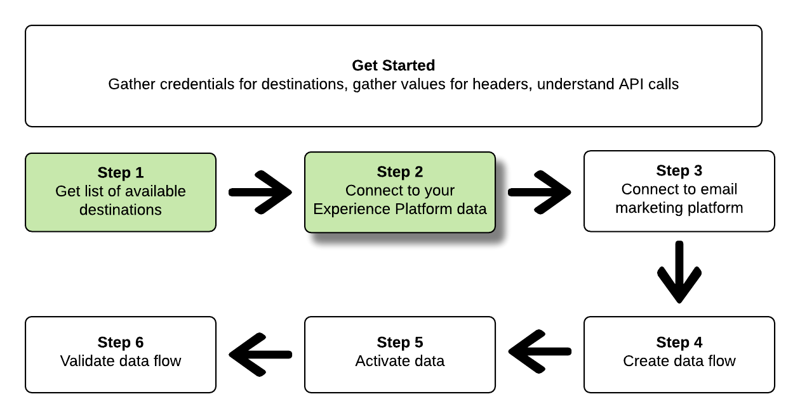

# 连接到电子邮件营销目标，并使用流量服务API激活数据

本教程演示了如何使用API调用连接到Adobe Experience Platform数据，并创建 [电子邮件营销目标](../catalog/email-marketing/overview.md)，创建数据流到新创建的目标，然后将数据激活到新创建的目标。

本教程在所有示例中都使用Adobe Campaign目标，但所有电子邮件营销目标的步骤都相同。


如果您希望使用平台中的用户界面来连接目标并激活数据，请参阅 [连接目标](../ui/connect-destination.md) 和 [激活受众数据以批量配置文件导出目标](../ui/activate-batch-profile-destinations.md) 教程。

## 快速入门

本指南要求您对Adobe Experience Platform的以下组件有一定的了解：

* [[!DNL Experience Data Model (XDM) System]](../../xdm/home.md):标准化框架， [!DNL Experience Platform] 组织客户体验数据。
* [[!DNL Catalog Service]](../../catalog/home.md): [!DNL Catalog] 是中数据位置和谱系的记录系统 [!DNL Experience Platform].
* [[!DNL Sandboxes]](../../sandboxes/home.md): [!DNL Experience Platform] 提供分区单个沙箱的虚拟沙箱 [!DNL Platform] 实例迁移到单独的虚拟环境中，以帮助开发和改进数字体验应用程序。

以下部分提供了您需要了解的其他信息，以便在Platform中将数据激活到电子邮件营销目标。

### 收集所需的凭据

要完成本教程中的步骤，您应准备好以下凭据，具体取决于您连接和激活区段的目标类型。

* 对于 [!DNL Amazon] 与电子邮件营销平台的S3连接： `accessId`, `secretKey`
* 对于与电子邮件营销平台的SFTP连接： `domain`, `port`, `username`, `password` 或 `ssh key` （取决于与FTP位置的连接方法）

### 读取示例API调用

本教程提供了用于演示如何设置请求格式的示例API调用。 这包括路径、所需标头以及格式正确的请求负载。 还提供了API响应中返回的示例JSON。 有关示例API调用文档中使用的约定的信息，请参阅 [如何阅读示例API调用](../../landing/troubleshooting.md#how-do-i-format-an-api-request) 在 [!DNL Experience Platform] 疑难解答指南。

### 收集必需和可选标题的值

为了调用 [!DNL Platform] API，您必须先完成 [身份验证教程](https://www.adobe.com/go/platform-api-authentication-en). 完成身份验证教程将为所有中每个所需标头提供值 [!DNL Experience Platform] API调用，如下所示：

* 授权：持有者 `{ACCESS_TOKEN}`
* x-api-key: `{API_KEY}`
* x-gw-ims-org-id: `{IMS_ORG}`

中的资源 [!DNL Experience Platform] 可与特定虚拟沙箱隔离。 在 [!DNL Platform] API中，您可以指定操作将在其中进行的沙盒的名称和ID。 这些是可选参数。

* x-sandbox-name: `{SANDBOX_NAME}`

>[!NOTE]
>
>有关 [!DNL Experience Platform]，请参阅 [沙盒概述文档](../../sandboxes/home.md).

所有包含有效负载(POST、PUT、PATCH)的请求都需要额外的媒体类型标头：

* Content-Type: `application/json`

### Swagger文档

在本教程中，您可以在Swagger中找到所有API调用的随附参考文档。 请参阅 [关于流量服务API的文档Adobe I/O](https://www.adobe.io/experience-platform-apis/references/flow-service/). 我们建议您同时使用本教程和Swagger文档页面。

## 获取可用目标列表 {#get-the-list-of-available-destinations}


第一步，您应确定要将数据激活到的电子邮件营销目标。 首先，执行调用以请求可连接和激活区段的可用目标列表。 对执行以下GET请求 `connectionSpecs` 用于返回可用目标列表的端点：

**API格式**

```http
GET /connectionSpecs
```

**请求**

<!--

```shell
curl -X GET \
    'http://platform.adobe.io/data/foundation/flowservice/connectionSpecs' \
    -H 'Authorization: Bearer {ACCESS_TOKEN}' \
    -H 'x-api-key: {API_KEY}' \
    -H 'x-gw-ims-org-id: {IMS_ORG}' \
    -H 'x-sandbox-name: {SANDBOX_NAME}' \
    -H 'x-sandbox-id: {SANDBOX_ID}' \    
    -H 'Content-Type: application/json' \
```

-->

```shell
curl --location --request GET 'https://platform.adobe.io/data/foundation/flowservice/connectionSpecs' \
--header 'accept: application/json' \
--header 'x-gw-ims-org-id: {IMS_ORG}' \
--header 'x-api-key: {API_KEY}' \
--header 'x-sandbox-name: {SANDBOX_NAME}' \
--header 'Authorization: Bearer {ACCESS_TOKEN}'
```


**响应**

成功的响应包含可用目标及其唯一标识符的列表(`id`)。 存储您计划使用的目标值，因为在后续步骤中需要该值。 例如，如果要连接区段并将区段交付到Adobe Campaign，请在响应中查找以下代码片段：

```json
{
    "id": "0b23e41a-cb4a-4321-a78f-3b654f5d7d97",
  "name": "Adobe Campaign",
  ...
  ...
}
```

## 连接到 [!DNL Experience Platform] 数据 {#connect-to-your-experience-platform-data}



接下来，您必须连接到 [!DNL Experience Platform] 数据，以便导出用户档案数据并在首选目标中将其激活。 这包括两个子步骤，如下所述。

1. 首先，您必须执行调用以授权访问 [!DNL Experience Platform]，方法是设置基本连接。
2. 然后，使用基本连接ID，您将再次进行调用，在该调用中创建一个源连接，以建立与的 [!DNL Experience Platform] 数据。


### 授权在中访问您的数据 [!DNL Experience Platform]

**API格式**

```http
POST /connections
```

**请求**

<!--

```shell
curl -X POST \
    'http://platform.adobe.io/data/foundation/flowservice/connections' \
    -H 'Authorization: Bearer {ACCESS_TOKEN}' \
    -H 'x-api-key: {API_KEY}' \
    -H 'x-gw-ims-org-id: {IMS_ORG}' \
    -H 'x-sandbox-name: {SANDBOX_NAME}' \
    -H 'x-sandbox-id: {SANDBOX_ID}' \ 
    -H 'Content-Type: application/json' \
    -d  '{
            
            "name": "Base connection to Experience Platform",
            "description": "This call establishes the connection to Experience Platform data",
            "connectionSpec": {
                "id": "{CONNECTION_SPEC}",
                "version": "1.0"
            }
           }'
```

-->

```shell
curl --location --request POST 'https://platform.adobe.io/data/foundation/flowservice/connections' \
--header 'Authorization: Bearer {ACCESS_TOKEN}' \
--header 'x-api-key: {API_KEY}' \
--header 'x-gw-ims-org-id: {IMS_ORG}' \
--header 'x-sandbox-name: {SANDBOX_NAME}' \
--header 'Content-Type: application/json' \
--data-raw '{
            "name": "Base connection to Experience Platform",
            "description": "This call establishes the connection to Experience Platform data",
            "connectionSpec": {
                "id": "{CONNECTION_SPEC_ID}",
                "version": "1.0"
            }
}'
```


* `{CONNECTION_SPEC_ID}`:使用配置文件服务的连接规范ID - `8a9c3494-9708-43d7-ae3f-cda01e5030e1`.

**响应**

成功的响应包含基本连接的唯一标识符(`id`)。 在创建源连接的下一步中根据需要存储此值。

```json
{
    "id": "1ed86558-59b5-42f7-9865-5859b552f7f4"
}
```

### 连接到 [!DNL Experience Platform] 数据 {#connect-to-platform-data}

**API格式**

```http
POST /sourceConnections
```

**请求**

<!--

```shell
curl -X POST \
    'http://platform.adobe.io/data/foundation/flowservice/sourceConnections' \
    -H 'Authorization: Bearer {ACCESS_TOKEN}' \
    -H 'x-api-key: {API_KEY}' \
    -H 'x-gw-ims-org-id: {IMS_ORG}' \
    -H 'x-sandbox-id: {SANDBOX_ID}' \ 
    -H 'x-sandbox-name: {SANDBOX_NAME}' \
    -H 'Content-Type: application/json' \
    -d  '{
  "name": "Connecting to Profile Service",
  "description": "Optional",
  "baseConnectionId": "{BASE_CONNECTION_ID}",
  "connectionSpec": {
    "id": "{CONNECTION_SPEC}",
    "version": "1.0"
  },
  "data": {
    "format": "CSV",
    "schema": null
  }
  }
```

-->

```shell
curl --location --request POST 'https://platform.adobe.io/data/foundation/flowservice/sourceConnections' \
--header 'Authorization: Bearer {ACCESS_TOKEN}' \
--header 'x-api-key: {API_KEY}' \
--header 'x-gw-ims-org-id: {IMS_ORG}' \
--header 'x-sandbox-name: {SANDBOX_NAME}' \
--header 'Content-Type: application/json' \
--data-raw '{
            "name": "Connecting to Profile Service",
            "description": "Optional",
            "connectionSpec": {
                "id": "{CONNECTION_SPEC_ID}",
                "version": "1.0"
            },
            "baseConnectionId": "{BASE_CONNECTION_ID}",
            "data": {
                "format": "CSV",
                "schema": null
            },
            "params": {}
}'
```

* `{BASE_CONNECTION_ID}`:使用您在上一步中获取的ID。
* `{CONNECTION_SPEC_ID}`:将连接规范ID用于 [!DNL Profile Service] - `8a9c3494-9708-43d7-ae3f-cda01e5030e1`.

**响应**

成功的响应会返回唯一标识符(`id`) [!DNL Profile Service]. 这表示您已成功连接到 [!DNL Experience Platform] 数据。 在后续步骤中根据需要存储此值。

```json
{
    "id": "ed48ae9b-c774-4b6e-88ae-9bc7748b6e97"
}
```


## 连接到电子邮件营销目标 {#connect-to-email-marketing-destination}


在此步骤中，您将设置与所需电子邮件营销目标的连接。 这包括两个子步骤，如下所述。

1. 首先，您必须通过设置基本连接来执行调用，以授权对电子邮件服务提供商的访问。
2. 然后，使用基本连接ID，您将再次调用，以在其中创建目标连接，该连接指定将传送导出数据的存储帐户位置以及将导出的数据格式。

### 授权访问电子邮件营销目标

**API格式**

```http
POST /connections
```

**请求**

<!--

```shell
curl -X POST \
    'http://platform.adobe.io/data/foundation/flowservice/connections' \
    -H 'Authorization: Bearer {ACCESS_TOKEN}' \
    -H 'x-api-key: {API_KEY}' \
    -H 'x-gw-ims-org-id: {IMS_ORG}' \
    -H 'x-sandbox-name: {SANDBOX_NAME}' \
    -H 'x-sandbox-id: {SANDBOX_ID}' \ 
    -H 'Content-Type: application/json' \
    -d  '{
            
            "name": "S3 Connection for Adobe Campaign",
            "description": "ACME company holiday campaign",
            "connectionSpec": {
                "id": "{CONNECTION_SPEC}",
                "version": "1.0"
            },
            "auth": {
                "specName": "{S3 or SFTP}",
                "params": {
                    "accessId": "{ACCESS_ID}",
                    "secretKey": "{SECRET_KEY}"
                }
            }
           }'
```

-->

```shell
curl --location --request POST 'https://platform.adobe.io/data/foundation/flowservice/connections' \
--header 'Authorization: Bearer {ACCESS_TOKEN}' \
--header 'x-api-key: {API_KEY}' \
--header 'x-gw-ims-org-id: {IMS_ORG}' \
--header 'x-sandbox-name: {SANDBOX_NAME}' \
--header 'Content-Type: application/json' \
--data-raw '{
    "name": "S3 Connection for Adobe Campaign",
    "description": "summer advertising campaign",
    "connectionSpec": {
        "id": "{_CONNECTION_SPEC_ID}",
        "version": "1.0"
    },
    "auth": {
        "specName": "{S3 or SFTP}",
        "params": {
            "accessId": "{ACCESS_ID}",
            "secretKey": "{SECRET_KEY}"
        }
    }
}'
```

* `{CONNECTION_SPEC_ID}`:使用您在步骤中获得的连接规范ID [获取可用目标列表](#get-the-list-of-available-destinations).
* `{S3 or SFTP}`:为此目标填写所需的连接类型。 在 [目标目录](../catalog/overview.md)，滚动到首选目标，以查看是否支持S3和/或SFTP连接类型。
* `{ACCESS_ID}`:您的访问ID [!DNL Amazon] S3存储位置。
* `{SECRET_KEY}`:你的秘钥 [!DNL Amazon] S3存储位置。

**响应**

成功的响应包含基本连接的唯一标识符(`id`)。 在创建目标连接的下一步中根据需要存储此值。

```json
{
    "id": "1ed86558-59b5-42f7-9865-5859b552f7f4"
}
```

### 指定存储位置和数据格式

[!DNL Adobe Experience Platform] 以 [!DNL CSV] 文件。

>[!IMPORTANT]
> 
>[!DNL Adobe Experience Platform] 自动将每个文件的导出文件拆分为500万条记录（行）。 每行表示一个用户档案。
>
>拆分文件名后附加一个数字，表示该文件是较大导出的一部分，如下所示： `filename.csv`, `filename_2.csv`, `filename_3.csv`.

**API格式**

```http
POST /targetConnections
```

**请求**

<!--

```shell
curl -X POST \
    'http://platform.adobe.io/data/foundation/flowservice/targetConnections' \
    -H 'Authorization: Bearer {ACCESS_TOKEN}' \
    -H 'x-api-key: {API_KEY}' \
    -H 'x-gw-ims-org-id: {IMS_ORG}' \
    -H 'x-sandbox-name: {SANDBOX_NAME}' \    
    -H 'x-sandbox-id: {SANDBOX_ID}' \ 
    -H 'Content-Type: application/json' \
    -d  '{
   "baseConnectionId": "{BASE_CONNECTION_ID}",
   "name": "TargetConnection for Adobe Campaign",
   "data": {
       "format": "CSV",
       "schema": {
           "id": "1.0",
           "version": "1.0"
       },
    "connectionSpec": {
    "id": "{CONNECTION_SPEC_ID}",
    "version": "1.0"
   },
   "params": {
       "mode": "S3",
       "bucketName": "{BUCKETNAME}",
       "path": "{FILEPATH}"
    }
    }
```

-->

```shell
curl --location --request POST 'https://platform.adobe.io/data/foundation/flowservice/targetConnections' \
--header 'Authorization: Bearer {ACCESS_TOKEN}' \
--header 'x-api-key: {API_KEY}' \
--header 'x-gw-ims-org-id: {IMS_ORG}' \
--header 'Content-Type: application/json' \
--data-raw '{
    "name": "TargetConnection for Adobe Campaign",
    "description": "Connection to Adobe Campaign",
    "baseConnectionId": "{BASE_CONNECTION_ID}",
    "connectionSpec": {
        "id": "{CONNECTION_SPEC_ID}",
        "version": "1.0"
    },
    "data": {
        "format": "json",
        "schema": {
            "id": "1.0",
            "version": "1.0"
        }
    },
    "params": {
        "mode": "S3",
        "bucketName": "{BUCKETNAME}",
        "path": "{FILEPATH}",
        "format": "CSV"
    }
}'
```

* `{BASE_CONNECTION_ID}`:使用您在上述步骤中获得的基本连接ID。
* `{CONNECTION_SPEC_ID}`:使用您在步骤中获得的连接规范 [获取可用目标列表](#get-the-list-of-available-destinations).
* `{BUCKETNAME}`:您的 [!DNL Amazon] S3存储段，Platform将在其中存储数据导出。
* `{FILEPATH}`:中的路径 [!DNL Amazon] Platform将存放数据导出的S3存储段目录。

**响应**

成功的响应会返回唯一标识符(`id`)，用于新创建的与电子邮件营销目标的target连接。 按照后续步骤中的要求存储此值。

```json
{
    "id": "12ab90c7-519c-4291-bd20-d64186b62da8"
}
```

## 创建数据流


现在，您可以使用在上一步中获取的ID，在您的 [!DNL Experience Platform] 数据以及要将数据激活到的目标。 将此步骤视为构建管道，数据稍后将通过该管道在 [!DNL Experience Platform] 和您的目标。

要创建数据流，请执行如下所示的POST请求，同时在负载中提供以下所述的值。

执行以下POST请求以创建数据流。

**API格式**

```http
POST /flows
```

**请求**

```shell
curl -X POST \
'https://platform.adobe.io/data/foundation/flowservice/flows' \
-H 'Authorization: Bearer {ACCESS_TOKEN}' \
-H 'x-api-key: {API_KEY}' \
-H 'x-gw-ims-org-id: {IMS_ORG}' \
-H 'x-sandbox-name: {SANDBOX_NAME}' \
-H 'Content-Type: application/json' \
-d  '{
   
        "name": "Activate segments to Adobe Campaign",
        "description": "This operation creates a dataflow which we will later use to activate segments to Adobe Campaign",
        "flowSpec": {
            "id": "{FLOW_SPEC_ID}",
            "version": "1.0"
        },
        "sourceConnectionIds": [
            "{SOURCE_CONNECTION_ID}"
        ],
        "targetConnectionIds": [
            "{TARGET_CONNECTION_ID}"
        ],
        "transformations": [
            {
                "name": "GeneralTransform",
                "params": {
                    "segmentSelectors": {
                        "selectors": []
                    },
                    "profileSelectors": {
                        "selectors": []
                    }
                }
            }
        ]
    }
```

* `{FLOW_SPEC_ID}`:使用要连接到的电子邮件营销目标的流程。 要获取流程规范，请对 `flowspecs` 端点。 请参阅此处的Swagger文档：https://platform.adobe.io/data/foundation/flowservice/swagger#/Flow%20Specs%20API/getFlowSpecs。 在响应中，查找 `upsTo` 并复制您要连接到的电子邮件营销目标的相应ID。 例如，对于Adobe Campaign，请查找 `upsToCampaign` 并复制 `id` 参数。
* `{SOURCE_CONNECTION_ID}`:使用您在步骤中获取的源连接ID [连接到Experience Platform](#connect-to-your-experience-platform-data).
* `{TARGET_CONNECTION_ID}`:使用您在步骤中获取的目标连接ID [连接到电子邮件营销目标](#connect-to-email-marketing-destination).

**响应**

成功的响应会返回ID(`id`)和 `etag`. 请记下这两个值。 正如您在下一步中所做的那样，激活区段。

```json
{
    "id": "8256cfb4-17e6-432c-a469-6aedafb16cd5",
    "etag": "8256cfb4-17e6-432c-a469-6aedafb16cd5"
}
```


## 将数据激活到新目标


创建了所有连接和数据流后，现在您可以将配置文件数据激活到电子邮件营销平台。 在此步骤中，您可以选择要发送到目标的区段和配置文件属性，并可以安排数据发送到目标。

要将区段激活到新目标，您必须执行JSONPATCH操作，如下例所示。 您可以在一次调用中激活多个区段和配置文件属性。 要了解有关JSONPATCH的更多信息，请参阅 [RFC规范](https://tools.ietf.org/html/rfc6902).

**API格式**

```http
PATCH /flows
```

**请求**

```shell
curl --location --request PATCH 'https://platform.adobe.io/data/foundation/flowservice/flows/{DATAFLOW_ID}' \
--header 'Authorization: Bearer {ACCESS_TOKEN}' \
--header 'x-api-key: {API_KEY}' \
--header 'x-gw-ims-org-id: {IMS_ORG}' \
--header 'Content-Type: application/json' \
--header 'x-sandbox-name: {SANDBOX_NAME}' \
--header 'If-Match: "{ETAG}"' \
--data-raw '[
    {
        "op": "add",
        "path": "/transformations/0/params/segmentSelectors/selectors/-",
        "value": {
            "type": "PLATFORM_SEGMENT",
            "value": {
                "name": "Name of the segment that you are activating",
                "description": "Description of the segment that you are activating",
                "id": "{SEGMENT_ID}"
            }
        }
    },
        {
        "op": "add",
        "path": "/transformations/0/params/segmentSelectors/selectors/-",
        "value": {
            "type": "PLATFORM_SEGMENT",
            "value": {
                "name": "Name of the segment that you are activating",
                "description": "Description of the segment that you are activating",
                "id": "{SEGMENT_ID}"
            }
        }
    },
        {
        "op": "add",
        "path": "/transformations/0/params/profileSelectors/selectors/-",
        "value": {
            "type": "JSON_PATH",
            "value": {
                "operator": "EXISTS",
                "path": "{PROFILE_ATTRIBUTE}"
            }
        }
    }
]
```

* `{DATAFLOW_ID}`:使用在上一步中获取的数据流。
* `{ETAG}`:使用您在上一步中获取的标记。
* `{SEGMENT_ID}`:提供要导出到此目标的区段ID。 要检索要激活的区段的区段ID，请转到 **https://www.adobe.io/apis/experienceplatform/home/api-reference.html#/**，选择 **[!UICONTROL 分段服务API]** ，然后在左侧导航菜单中查找 `GET /segment/definitions` 操作 **[!UICONTROL 区段定义]**.
* `{PROFILE_ATTRIBUTE}`: 例如, `"person.lastName"`

**响应**

查找202 OK响应。 未返回响应主体。 要验证请求是否正确，请参阅下一步验证数据流。

## 验证数据流


在教程的最后一步中，您应该验证区段和配置文件属性是否确实已正确映射到数据流。

要验证此请求，请执行以下GET请求：

**API格式**

```http
GET /flows
```

**请求**

```shell
curl --location --request PATCH 'https://platform.adobe.io/data/foundation/flowservice/flows/{DATAFLOW_ID}' \
--header 'Authorization: Bearer {ACCESS_TOKEN}' \
--header 'x-api-key: {API_KEY}' \
--header 'x-gw-ims-org-id: {IMS_ORG}' \
--header 'Content-Type: application/json' \
--header 'x-sandbox-name: prod' \
--header 'If-Match: "{ETAG}"' 
```

* `{DATAFLOW_ID}`:使用上一步中的数据流。
* `{ETAG}`:使用上一步中的标记。

**响应**

返回的响应应包括在 `transformations` 参数您在上一步中提交的区段和配置文件属性。 示例 `transformations` 响应中的参数可能如下所示：

```json
"transformations": [
    {
        "name": "GeneralTransform",
        "params": {
            "profileSelectors": {
                "selectors": []
            },
            "segmentSelectors": {
                "selectors": [
                    {
                        "type": "PLATFORM_SEGMENT",
                        "value": {
                            "name": "Men over 50",
                            "description": "",
                            "id": "72ddd79b-6b0a-4e97-a8d2-112ccd81bd02"
                        }
                    }
                ]
            }
        }
    }
],
```

## 后续步骤

通过阅读本教程，您已成功将Platform连接到您的其中一个首选电子邮件营销目标，并将数据流设置到相应的目标。 传出数据现在可用于电子邮件促销活动、定向广告和许多其他用例的目标。 有关更多详细信息，请参阅以下页面：

* [目标概述](../home.md)
* [目标目录概述](../catalog/overview.md)
