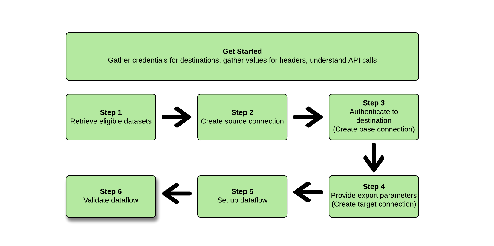

# 使用[!DNL Flow Service API]导出数据集

>[!AVAILABILITY]
>
>* 已购买Real-Time CDP Prime和Ultimate软件包、Adobe Journey Optimizer或Customer Journey Analytics的客户可以使用此功能。 有关更多信息，请与Adobe代表联系。

>[!IMPORTANT]
>
>**操作项**： Experience Platform[&#128279;](/help/release-notes/latest/latest.md#destinations)的2024年9月版本引入了为导出数据集数据流设置`endTime`日期的选项。 在2024年9月版本&#x200B;*之前，Adobe还为*&#x200B;创建的所有数据集导出数据流引入了默认结束日期（2025年9月1日）。
>
>对于其中任何数据流，您需要手动更新数据流中的结束日期在结束日期之前，否则您的导出将在该日期停止。 使用Experience Platform UI查看哪些数据流将设置为在2025年9月1日停止。
>
>同样，对于您创建但未指定`endTime`日期的任何数据流，这些时间将默认为自其创建之日起六个月的结束时间。

<!--

>You can retrieve a list of such dataflows by performing the following API call: `https://platform.adobe.io/data/foundation/flowservice/flows?property=scheduleParams.endTime==UNIXTIMESTAMPTHATWEWILLUSE`
>

-->

本文介绍使用[!DNL Flow Service API]将[数据集](/help/catalog/datasets/overview.md)从Adobe Experience Platform导出到首选云存储位置（如[!DNL Amazon S3]、SFTP位置或[!DNL Google Cloud Storage]）所需的工作流。

>[!TIP]
>
>您还可以使用Experience Platform用户界面导出数据集。 有关详细信息，请阅读[导出数据集UI教程](/help/destinations/ui/export-datasets.md)。

## 可用于导出的数据集 {#datasets-to-export}

您可以导出的数据集取决于Experience Platform应用程序(Real-Time CDP、Adobe Journey Optimizer)、层(Prime或Ultimate)以及您购买的任何加载项(例如：Data Distiller)。

请参阅UI教程页面[&#128279;](/help/destinations/ui/export-datasets.md#datasets-to-export)上的表以了解可以导出哪些数据集。

## 支持的目标 {#supported-destinations}

目前，您可以将数据集导出到屏幕快照中突出显示的云存储目标，如下所列。


* [[!DNL Azure Data Lake Storage Gen2]](../../destinations/catalog/cloud-storage/adls-gen2.md)
* [[!DNL Data Landing Zone]](../../destinations/catalog/cloud-storage/data-landing-zone.md)
* [[!DNL Google Cloud Storage]](../../destinations/catalog/cloud-storage/google-cloud-storage.md)
* [[!DNL Amazon S3]](../../destinations/catalog/cloud-storage/amazon-s3.md#changelog)
* [[!DNL Azure Blob]](../../destinations/catalog/cloud-storage/azure-blob.md#changelog)
* [[!DNL SFTP]](../../destinations/catalog/cloud-storage/sftp.md#changelog)

## 先决条件 {#prerequisites}

要导出数据集，请注意以下先决条件：

* 要将数据集导出到云存储目标，您必须已成功[连接到目标](/help/destinations/ui/connect-destination.md)。 如果您尚未这样做，请转到[目标目录](/help/destinations/catalog/overview.md)，浏览支持的目标，然后配置要使用的目标。
* 需要启用配置文件数据集才能在实时客户配置文件中使用。 [阅读更多](/help/ingestion/tutorials/ingest-batch-data.md#enable-for-profile)以了解如何启用此选项。

## 快速入门 {#get-started}


本指南要求您对 Adobe Experience Platform 的以下组件有一定了解：

* [[!DNL Experience Platform datasets]](/help/catalog/datasets/overview.md)：成功引入Adobe Experience Platform的所有数据将作为数据集保留在[!DNL Data Lake]中。 数据集是用于数据集合的存储和管理结构，通常是表格，其中包含架构（列）和字段（行）。数据集还包含描述其存储的数据的各个方面的元数据。
   * [[!DNL Sandboxes]](../../sandboxes/home.md)： [!DNL Experience Platform]提供了将单个[!DNL Experience Platform]实例划分为多个单独的虚拟环境的虚拟沙箱，以帮助开发和改进数字体验应用程序。

以下部分提供了要将数据集导出到Experience Platform中的云存储目标，您必须了解的其他信息。

### 所需的权限 {#permissions}

要导出数据集，您需要&#x200B;**[!UICONTROL 查看目标]**、**[!UICONTROL 查看数据集]**&#x200B;和&#x200B;**[!UICONTROL 管理和激活数据集目标]** [访问控制权限](/help/access-control/home.md#permissions)。 阅读[访问控制概述](/help/access-control/ui/overview.md)或联系您的产品管理员以获取所需的权限。

要确保您具有导出数据集的必要权限并且目标支持导出数据集，请浏览目标目录。 如果目标具有&#x200B;**[!UICONTROL 激活]**&#x200B;或&#x200B;**[!UICONTROL 导出数据集]**&#x200B;控件，则您具有相应的权限。

### 正在读取示例 API 调用 {#reading-sample-api-calls}

本教程提供了示例API调用来演示如何格式化请求。 这些包括路径、必需的标头和格式正确的请求负载。还提供了在 API 响应中返回的示例 JSON。有关示例API调用文档中使用的约定的信息，请参阅[!DNL Experience Platform]疑难解答指南中有关[如何读取示例API调用](../../landing/troubleshooting.md#how-do-i-format-an-api-request)的部分。

### 收集必需标题和可选标题的值 {#gather-values-headers}

要调用[!DNL Experience Platform] API，您必须先完成[Experience Platform身份验证教程](https://www.adobe.com/go/platform-api-authentication-en)。 完成身份验证教程会提供所有 [!DNL Experience Platform] API 调用中每个所需标头的值，如下所示：

* 授权：持有人`{ACCESS_TOKEN}`
* x-api-key： `{API_KEY}`
* x-gw-ims-org-id： `{ORG_ID}`

[!DNL Experience Platform]中的资源可以隔离到特定的虚拟沙箱。 在对[!DNL Experience Platform] API的请求中，您可以指定将在其中执行操作的沙盒的名称和ID。 这些是可选参数。

* x-sandbox-name： `{SANDBOX_NAME}`

>[!NOTE]
>
>有关[!DNL Experience Platform]中沙盒的更多信息，请参阅[沙盒概述文档](../../sandboxes/home.md)。

所有包含有效负载(POST、PUT、PATCH)的请求都需要一个额外的媒体类型标头：

* 内容类型： `application/json`

### API参考文档 {#api-reference-documentation}

您可以在本教程中找到所有API操作的随附参考文档。 请参阅Adobe Developer网站[&#128279;](https://developer.adobe.com/experience-platform-apis/references/destinations/)上的[!DNL Flow Service] - Destinations API文档。 我们建议您并行使用此教程和API参考文档。

### 术语表 {#glossary}

有关将在此API教程中遇到的术语的说明，请阅读API参考文档的[术语表部分](https://developer.adobe.com/experience-platform-apis/references/destinations/#tag/Glossary)。

### 收集所需目标的连接规格和流量规格 {#gather-connection-spec-flow-spec}

在开始导出数据集的工作流之前，请确定要将数据集导出到的目标的连接规范和流量规范ID。 请参考下表。


| 目标 | 连接规范 | 流量规范 |
---------|----------|---------|
| [!DNL Amazon S3] | `4fce964d-3f37-408f-9778-e597338a21ee` | `269ba276-16fc-47db-92b0-c1049a3c131f` |
| [!DNL Azure Blob Storage] | `6d6b59bf-fb58-4107-9064-4d246c0e5bb2` | `95bd8965-fc8a-4119-b9c3-944c2c2df6d2` |
| [!DNL Azure Data Lake Gen 2(ADLS Gen2)] | `be2c3209-53bc-47e7-ab25-145db8b873e1` | `17be2013-2549-41ce-96e7-a70363bec293` |
| [!DNL Data Landing Zone(DLZ)] | `10440537-2a7b-4583-ac39-ed38d4b848e8` | `cd2fc47e-e838-4f38-a581-8fff2f99b63a` |
| [!DNL Google Cloud Storage] | `c5d93acb-ea8b-4b14-8f53-02138444ae99` | `585c15c4-6cbf-4126-8f87-e26bff78b657` |
| SFTP | `36965a81-b1c6-401b-99f8-22508f1e6a26` | `354d6aad-4754-46e4-a576-1b384561c440` |

{style="table-layout:auto"}

您需要这些ID来构造各种[!DNL Flow Service]实体。 您还需要引用[!DNL Connection Spec]本身的部分来设置某些实体，以便可以从[!DNL Flow Service APIs]检索[!DNL Connection Spec]。 请参阅下面的示例，以了解如何检索表中所有目标的连接规范：

>[!BEGINTABS]

>[!TAB Amazon S3]

**请求**

+++检索[!DNL Amazon S3]的[!DNL connection spec]

```shell
curl --location --request GET 'https://platform.adobe.io/data/foundation/flowservice/connectionSpecs/4fce964d-3f37-408f-9778-e597338a21ee' \
--header 'accept: application/json' \
--header 'x-api-key: {API_KEY}' \
--header 'x-gw-ims-org-id: {ORG_ID}' \
--header 'x-sandbox-name: {SANDBOX_NAME}' \
--header 'Authorization: Bearer {ACCESS_TOKEN}'
```

+++

**响应**

+++[!DNL Amazon S3] — 连接规范

```json
{
    "items": [
        {
            "id": "4fce964d-3f37-408f-9778-e597338a21ee",
            "name": "Amazon S3",
            "providerId": "14e34fac-d307-11e9-bb65-2a2ae2dbcce4",
            "version": "1.0",
//...
```

+++

>[!TAB Azure Blob存储]

**请求**

+++检索[!DNL Azure Blob Storage]的[!DNL connection spec]

```shell
curl --location --request GET 'https://platform.adobe.io/data/foundation/flowservice/connectionSpecs/6d6b59bf-fb58-4107-9064-4d246c0e5bb2' \
--header 'accept: application/json' \
--header 'x-api-key: {API_KEY}' \
--header 'x-gw-ims-org-id: {ORG_ID}' \
--header 'x-sandbox-name: {SANDBOX_NAME}' \
--header 'Authorization: Bearer {ACCESS_TOKEN}'
```

+++

**响应**

+++[!DNL Azure Blob Storage] — [!DNL Connection spec]

```json
{
    "items": [
        {
            "id": "6d6b59bf-fb58-4107-9064-4d246c0e5bb2",
            "name": "Azure Blob Storage",
            "providerId": "14e34fac-d307-11e9-bb65-2a2ae2dbcce4",
            "version": "1.0",
//...
```

+++

>[!TAB Azure Data Lake Gen 2(ADLS Gen2)]

**请求**

+++检索[!DNL Azure Data Lake Gen 2(ADLS Gen2]的[!DNL connection spec])

```shell
curl --location --request GET 'https://platform.adobe.io/data/foundation/flowservice/connectionSpecs/be2c3209-53bc-47e7-ab25-145db8b873e1' \
--header 'accept: application/json' \
--header 'x-api-key: {API_KEY}' \
--header 'x-gw-ims-org-id: {ORG_ID}' \
--header 'x-sandbox-name: {SANDBOX_NAME}' \
--header 'Authorization: Bearer {ACCESS_TOKEN}'
```

+++

**响应**

+++[!DNL Azure Data Lake Gen 2(ADLS Gen2)] — [!DNL Connection spec]

```json
{
    "items": [
        {
            "id": "be2c3209-53bc-47e7-ab25-145db8b873e1",
            "name": "Azure Data Lake Gen2",
            "providerId": "14e34fac-d307-11e9-bb65-2a2ae2dbcce4",
            "version": "1.0",
//...
```

+++

>[!TAB 数据登陆区(DLZ)]

**请求**

+++检索[!DNL Data Landing Zone(DLZ)]的[!DNL connection spec]

```shell
curl --location --request GET 'https://platform.adobe.io/data/foundation/flowservice/connectionSpecs/10440537-2a7b-4583-ac39-ed38d4b848e8' \
--header 'accept: application/json' \
--header 'x-api-key: {API_KEY}' \
--header 'x-gw-ims-org-id: {ORG_ID}' \
--header 'x-sandbox-name: {SANDBOX_NAME}' \
--header 'Authorization: Bearer {ACCESS_TOKEN}'
```

+++

**响应**

+++[!DNL Data Landing Zone(DLZ)] — [!DNL Connection spec]

```json
{
    "items": [
        {
            "id": "10440537-2a7b-4583-ac39-ed38d4b848e8",
            "name": "Data Landing Zone",
            "providerId": "14e34fac-d307-11e9-bb65-2a2ae2dbcce4",
            "version": "1.0",
//...
```

+++

>[!TAB Google云存储]

**请求**

+++检索[!DNL Google Cloud Storage]的[!DNL connection spec]

```shell
curl --location --request GET 'https://platform.adobe.io/data/foundation/flowservice/connectionSpecs/c5d93acb-ea8b-4b14-8f53-02138444ae99' \
--header 'accept: application/json' \
--header 'x-api-key: {API_KEY}' \
--header 'x-gw-ims-org-id: {ORG_ID}' \
--header 'x-sandbox-name: {SANDBOX_NAME}' \
--header 'Authorization: Bearer {ACCESS_TOKEN}'
```

+++

**响应**

+++[!DNL Google Cloud Storage] — [!DNL Connection spec]

```json
{
    "items": [
        {
            "id": "c5d93acb-ea8b-4b14-8f53-02138444ae99",
            "name": "Google Cloud Storage",
            "providerId": "14e34fac-d307-11e9-bb65-2a2ae2dbcce4",
            "version": "1.0",
//...
```

+++

>[!TAB SFTP]

**请求**

+++检索[!DNL connection spec]以获取SFTP

```shell
curl --location --request GET 'https://platform.adobe.io/data/foundation/flowservice/connectionSpecs/36965a81-b1c6-401b-99f8-22508f1e6a26' \
--header 'accept: application/json' \
--header 'x-api-key: {API_KEY}' \
--header 'x-gw-ims-org-id: {ORG_ID}' \
--header 'x-sandbox-name: {SANDBOX_NAME}' \
--header 'Authorization: Bearer {ACCESS_TOKEN}'
```

+++

**响应**

+++SFTP - [!DNL Connection spec]

```json
{
    "items": [
        {
            "id": "36965a81-b1c6-401b-99f8-22508f1e6a26",
            "name": "SFTP",
            "providerId": "14e34fac-d307-11e9-bb65-2a2ae2dbcce4",
            "version": "1.0",
//...
```

+++

>[!ENDTABS]

请按照以下步骤设置传送到云存储目标的数据集数据流。 对于某些步骤，不同云存储目标之间的请求和响应会有所不同。 在这些情况下，使用页面上的选项卡可检索特定于您要连接并导出数据集的目标的请求和响应。 请确保为您配置的目标使用正确的[!DNL connection spec]和[!DNL flow spec]。

## 检索数据集列表 {#retrieve-list-of-available-datasets}


要检索符合激活条件的数据集列表，首先要对以下端点进行API调用。

>[!BEGINSHADEBOX]

**请求**

+++检索符合条件的数据集 — 请求

```shell
curl --location --request GET 'https://platform.adobe.io/data/foundation/flowservice/connectionSpecs/23598e46-f560-407b-88d5-ea6207e49db0/configs?outputType=activationDatasets&outputField=datasets&start=0&limit=20&properties=name,state' \
--header 'accept: application/json' \
--header 'x-gw-ims-org-id: {ORG_ID}' \
--header 'x-api-key: {API_KEY}' \
--header 'x-sandbox-name: {SANDBOX_NAME}' \
--header 'Authorization: Bearer {ACCESS_TOKEN}'
```

请注意，要检索符合条件的数据集，请求URL中使用的[!DNL connection spec] ID必须是数据湖源连接规范ID `23598e46-f560-407b-88d5-ea6207e49db0`，并且必须指定两个查询参数`outputField=datasets`和`outputType=activationDatasets`。 所有其他查询参数是[目录服务API](https://developer.adobe.com/experience-platform-apis/references/catalog/)支持的标准参数。

+++

**响应**

+++检索数据集 — 响应

```json
{
    "items": [
        {
            "id": "5ef3e324052581191aa6a466",
            "name": "AAM Authenticated Profiles Meta Data",
            "description": "Activation profile export dataset",
            "fileDescription": {
                "persisted": true,
                "containerFormat": "parquet",
                "format": "parquet"
            },
            "aspect": "production",
            "state": "DRAFT"
        },
        {
            "id": "5ef3e3259ad2a1191ab7dd7d",
            "name": "AAM Devices Data",
            "description": "Activation profile export dataset",
            "fileDescription": {
                "persisted": true,
                "containerFormat": "parquet",
                "format": "parquet"
            },
            "aspect": "production",
            "state": "DRAFT"
        },
        {
            "id": "5ef3e325582424191b1beb42",
            "name": "AAM Devices Profile Meta Data",
            "description": "Activation profile export dataset",
            "fileDescription": {
                "persisted": true,
                "containerFormat": "parquet",
                "format": "parquet"
            },
            "aspect": "production",
            "state": "DRAFT"
        },
        {
            "id": "5ef3e328582424191b1beb44",
            "name": "AAM Realtime",
            "description": "Activation profile export dataset",
            "fileDescription": {
                "persisted": true,
                "containerFormat": "parquet",
                "format": "parquet"
            },
            "aspect": "production",
            "state": "DRAFT"
        },
        {
            "id": "5ef3e328fe742a191b2b3ea5",
            "name": "AAM Realtime Profile Updates",
            "description": "Activation profile export dataset",
            "fileDescription": {
                "persisted": true,
                "containerFormat": "parquet",
                "format": "parquet"
            },
            "aspect": "production",
            "state": "DRAFT"
        }
    ],
    "pageInfo": {
        "start": 0,
        "end": 4,
        "total": 149,
        "hasNext": true
    }
}
```

+++

>[!ENDSHADEBOX]

成功的响应包含符合激活条件的数据集列表。 在下一步中构建源连接时，可以使用这些数据集。

有关每个返回的数据集的各种响应参数的信息，请参阅[数据集API开发人员文档](https://developer.adobe.com/experience-platform-apis/references/catalog/#tag/Datasets/operation/listDatasets)。

## 创建源连接 {#create-source-connection}


在检索要导出的数据集列表后，您可以使用这些数据集ID创建源连接。

>[!BEGINSHADEBOX]

**请求**

+++创建源连接 — 请求

请注意请求示例中带有内联注释的高亮显示行，这些行提供了更多信息。 将请求复制粘贴到您选择的终端时，删除请求中的内联注释。

```shell {line-numbers="true" start-line="1" highlight="12,16"}
curl --location --request POST 'https://platform.adobe.io/data/foundation/flowservice/sourceConnections' \
--header 'accept: application/json' \
--header 'x-api-key: {API_KEY}' \
--header 'x-gw-ims-org-id: {ORG_ID}' \
--header 'x-sandbox-name: {SANDBOX_NAME}' \
--header 'Content-Type: application/json' \
--header 'Authorization: Bearer {ACCESS_TOKEN}' \
--data-raw '{
  "name": "Connecting to Data Lake",
  "description": "Data Lake source connection to export datasets",
  "connectionSpec": {
    "id": "23598e46-f560-407b-88d5-ea6207e49db0", // this connection spec ID is always the same for Source Connections
    "version": "1.0"
  },
  "params": {
    "datasets": [ // datasets to activate
      {
        "dataSetId": "5ef3e3259ad2a1191ab7dd7d",
        "name": "AAM Devices Data"
      }
    ]
  }
}'
```

+++


**响应**

+++创建源连接 — 响应

```json
{
    "id": "900df191-b983-45cd-90d5-4c7a0326d650",
    "etag": "\"0500ebe1-0000-0200-0000-63e28d060000\""
}
```

+++

>[!ENDSHADEBOX]

成功的响应返回新创建的源连接的ID (`id`)和`etag`。 记下源连接ID，因为稍后创建数据流时会需要它。

另请记住：

* 在此步骤中创建的源连接需要链接到数据流，才能将其数据集激活到目标。 有关如何将源连接链接到数据流的信息，请参阅[创建数据流](#create-dataflow)部分。
* 源连接的数据集ID在创建后无法修改。 如果需要从源连接添加或删除数据集，则必须创建新的源连接，并将新源连接的ID链接到数据流。

## 创建(target)基本连接 {#create-base-connection}


基本连接会将凭据安全地存储到您的目标。 根据目标类型，对该目标进行身份验证所需的凭据可能有所不同。 要查找这些身份验证参数，请首先按照[收集连接规格和流量规格](#gather-connection-spec-flow-spec)一节中所述检索所需目标的[!DNL connection spec]，然后查看响应的`authSpec`。 请引用下面的选项卡，以查看所有受支持目标的`authSpec`属性。

>[!BEGINTABS]

>[!TAB Amazon S3]

+++[!DNL Amazon S3] - [!DNL Connection spec]显示[!DNL auth spec]

请注意下面[!DNL connection spec]示例中带有内联注释的高亮显示行，这些注释提供了有关在[!DNL connection spec]中何处查找身份验证参数的更多信息。

```json {line-numbers="true" start-line="1" highlight="8"}
{
    "items": [
        {
            "id": "4fce964d-3f37-408f-9778-e597338a21ee",
            "name": "Amazon S3",
            "providerId": "14e34fac-d307-11e9-bb65-2a2ae2dbcce4",
            "version": "1.0",
            "authSpec": [ // describes the authentication parameters
                {
                    "name": "Access Key",
                    "type": "KeyBased",
                    "spec": {
                        "$schema": "http://json-schema.org/draft-07/schema#",
                        "description": "Defines auth params required for connecting to amazon-s3",
                        "type": "object",
                        "properties": {
                            "s3AccessKey": {
                                "description": "Access key id",
                                "type": "string",
                                "pattern": "^[A-Z2-7]{20}$"
                            },
                            "s3SecretKey": {
                                "description": "Secret access key for the user account",
                                "type": "string",
                                "format": "password",
                                "pattern": "^[A-Za-z0-9\/\\+]{40}$"
                            }
                        },
                        "required": [
                            "s3SecretKey",
                            "s3AccessKey"
                        ]
                    }
                }
            ],
//...
```

+++

>[!TAB Azure Blob存储]

+++[!DNL Azure Blob Storage] - [!DNL Connection spec]显示[!DNL auth spec]

请注意下面[!DNL connection spec]示例中带有内联注释的高亮显示行，这些注释提供了有关在[!DNL connection spec]中何处查找身份验证参数的更多信息。

```json {line-numbers="true" start-line="1" highlight="8"}
{
    "items": [
        {
            "id": "6d6b59bf-fb58-4107-9064-4d246c0e5bb2",
            "name": "Azure Blob Storage",
            "providerId": "14e34fac-d307-11e9-bb65-2a2ae2dbcce4",
            "version": "1.0",
            "authSpec": [ // describes the authentication parameters
                {
                    "name": "ConnectionString",
                    "type": "ConnectionString",
                    "spec": {
                        "$schema": "http://json-schema.org/draft-07/schema#",
                        "description": "Connection String for Azure Blob based destinations",
                        "type": "object",
                        "properties": {
                            "connectionString": {
                                "description": "connection string for login",
                                "type": "string",
                                "format": "password"
                            }
                        },
                        "required": [
                            "connectionString"
                        ]
                    }
                }
            ],
//...
```

+++


>[!TAB Azure Data Lake Gen 2(ADLS Gen2)]

+++[!DNL Azure Data Lake Gen 2(ADLS Gen2)] - [!DNL Connection spec]显示[!DNL auth spec]

请注意下面[!DNL connection spec]示例中带有内联注释的高亮显示行，这些注释提供了有关在[!DNL connection spec]中何处查找身份验证参数的更多信息。

```json {line-numbers="true" start-line="1" highlight="8"}
{
    "items": [
        {
            "id": "be2c3209-53bc-47e7-ab25-145db8b873e1",
            "name": "Azure Data Lake Gen2",
            "providerId": "14e34fac-d307-11e9-bb65-2a2ae2dbcce4",
            "version": "1.0",
            "authSpec": [ // describes the authentication parameters
                {
                    "name": "Azure Service Principal Auth",
                    "type": "AzureServicePrincipal",
                    "spec": {
                        "$schema": "http://json-schema.org/draft-07/schema#",
                        "description": "defines auth params required for connecting to adlsgen2 using service principal",
                        "type": "object",
                        "properties": {
                            "url": {
                                "description": "Endpoint for Azure Data Lake Storage Gen2.",
                                "type": "string"
                            },
                            "servicePrincipalId": {
                                "description": "Service Principal Id to connect to ADLSGen2.",
                                "type": "string"
                            },
                            "servicePrincipalKey": {
                                "description": "Service Principal Key to connect to ADLSGen2.",
                                "type": "string",
                                "format": "password"
                            },
                            "tenant": {
                                "description": "Tenant information(domain name or tenant ID).",
                                "type": "string"
                            }
                        },
                        "required": [
                            "servicePrincipalKey",
                            "url",
                            "tenant",
                            "servicePrincipalId"
                        ]
                    }
                }
            ],
//...
```

+++


>[!TAB 数据登陆区(DLZ)]

+++[!DNL Data Landing Zone(DLZ)] - [!DNL Connection spec]显示[!DNL auth spec]

>[!NOTE]
>
>数据登陆区域目标不需要[!DNL auth spec]。

```json
{
    "items": [
        {
            "id": "10440537-2a7b-4583-ac39-ed38d4b848e8",
            "name": "Data Landing Zone",
            "providerId": "14e34fac-d307-11e9-bb65-2a2ae2dbcce4",
            "version": "1.0",
            "authSpec": [],
//...
```

+++

>[!TAB Google云存储]

+++[!DNL Google Cloud Storage] - [!DNL Connection spec]显示[!DNL auth spec]

请注意下面[!DNL connection spec]示例中带有内联注释的高亮显示行，这些注释提供了有关在[!DNL connection spec]中何处查找身份验证参数的更多信息。

```json {line-numbers="true" start-line="1" highlight="8"}
{
    "items": [
        {
            "id": "c5d93acb-ea8b-4b14-8f53-02138444ae99",
            "name": "Google Cloud Storage",
            "providerId": "14e34fac-d307-11e9-bb65-2a2ae2dbcce4",
            "version": "1.0",
            "authSpec": [ // describes the authentication parameters
                {
                    "name": "Google Cloud Storage authentication credentials",
                    "type": "GoogleCloudStorageAuth",
                    "spec": {
                        "$schema": "http://json-schema.org/draft-07/schema#",
                        "description": "defines auth params required for connecting to google cloud storage connector.",
                        "type": "object",
                        "properties": {
                            "accessKeyId": {
                                "description": "Access Key Id for the user account",
                                "type": "string"
                            },
                            "secretAccessKey": {
                                "description": "Secret Access Key for the user account",
                                "type": "string",
                                "format": "password"
                            }
                        },
                        "required": [
                            "accessKeyId",
                            "secretAccessKey"
                        ]
                    }
                }
            ],
//...
```

+++

>[!TAB SFTP]

+++SFTP - [!DNL Connection spec]显示[!DNL auth spec]

>[!NOTE]
>
>SFTP目标在[!DNL auth spec]中包含两个单独的项，因为它同时支持密码和SSH密钥身份验证。

请注意下面[!DNL connection spec]示例中带有内联注释的高亮显示行，这些注释提供了有关在[!DNL connection spec]中何处查找身份验证参数的更多信息。

```json {line-numbers="true" start-line="1" highlight="8"}
{
    "items": [
        {
            "id": "36965a81-b1c6-401b-99f8-22508f1e6a26",
            "name": "SFTP",
            "providerId": "14e34fac-d307-11e9-bb65-2a2ae2dbcce4",
            "version": "1.0",
            "authSpec": [ // describes the authentication parameters
                {
                    "name": "SFTP with Password",
                    "type": "SFTP",
                    "spec": {
                        "$schema": "http://json-schema.org/draft-07/schema#",
                        "description": "defines auth params required for connecting to sftp locations with a password",
                        "type": "object",
                        "properties": {
                            "domain": {
                                "description": "Domain of server",
                                "type": "string"
                            },
                            "username": {
                                "description": "Username",
                                "type": "string"
                            },
                            "password": {
                                "description": "Password",
                                "type": "string",
                                "format": "password"
                            }
                        },
                        "required": [
                            "password",
                            "domain",
                            "username"
                        ]
                    }
                },
                {
                    "name": "SFTP with SSH Key",
                    "type": "SFTP",
                    "spec": {
                        "$schema": "http://json-schema.org/draft-07/schema#",
                        "description": "defines auth params required for connecting to sftp locations using SSH Key",
                        "type": "object",
                        "properties": {
                            "domain": {
                                "description": "Domain of server",
                                "type": "string"
                            },
                            "username": {
                                "description": "Username",
                                "type": "string"
                            },
                            "sshKey": {
                                "description": "Base64 string of the private SSH key",
                                "type": "string",
                                "format": "password",
                                "contentEncoding": "base64",
                                "uiAttributes": {
                                    "tooltip": {
                                        "id": "platform_destinations_connect_sftp_ssh",
                                        "fallbackUrl": "http://www.adobe.com/go/destinations-sftp-connection-parameters-en "
                                    }
                                }
                            }
                        },
                        "required": [
                            "sshKey",
                            "domain",
                            "username"
                        ]
                    }
                }
            ],
//...
```

+++

>[!ENDTABS]

使用身份验证规范中指定的属性（即响应中的`authSpec`），您可以使用特定于每个目标类型的所需凭据创建基本连接，如以下示例所示：

>[!BEGINTABS]

>[!TAB Amazon S3]

**请求**

+++[!DNL Amazon S3] — 基本连接请求

>[!TIP]
>
>有关如何获取所需身份验证凭据的信息，请参阅Amazon S3目标文档页面的[向目标身份验证](/help/destinations/catalog/cloud-storage/amazon-s3.md#authenticate)部分。

请注意请求示例中带有内联注释的高亮显示行，这些行提供了更多信息。 将请求复制粘贴到您选择的终端时，删除请求中的内联注释。

```shell {line-numbers="true" start-line="1" highlight="18"}
curl --location --request POST 'https://platform.adobe.io/data/foundation/flowservice/connections' \
--header 'accept: application/json' \
--header 'Authorization: Bearer {ACCESS_TOKEN}' \
--header 'x-api-key: <API-KEY>' \
--header 'x-gw-ims-org-id: <IMS-ORG-ID>' \
--header 'x-sandbox-name: <SANDBOX-NAME>' \
--header 'Content-Type: application/json' \
--data-raw '{
  "name": "Amazon S3 Base Connection",
  "auth": {
    "specName": "Access Key",
    "params": {
      "s3SecretKey": "<Add secret key>",
      "s3AccessKey": "<Add access key>"
    }
  },
  "connectionSpec": {
    "id": "4fce964d-3f37-408f-9778-e597338a21ee", // Amazon S3 connection spec
    "version": "1.0"
  }
}'
```

+++

**响应**

+++[!DNL Amazon S3]基本连接响应

```json
{
    "id": "12401496-2573-4ca7-8137-fef1aeb9dd4c",
    "etag": "\"0000d781-0000-0200-0000-63e29f420000\""
}
```

+++

>[!TAB Azure Blob存储]

**请求**

+++[!DNL Azure Blob Storage] — 基本连接请求

>[!TIP]
>
>有关如何获取所需身份验证凭据的信息，请参阅Azure Blob存储目标文档页面的[向目标身份验证](/help/destinations/catalog/cloud-storage/azure-blob.md#authenticate)部分。

请注意请求示例中带有内联注释的高亮显示行，这些行提供了更多信息。 将请求复制粘贴到您选择的终端时，删除请求中的内联注释。

```shell {line-numbers="true" start-line="1" highlight="16"}
curl --location --request POST 'https://platform.adobe.io/data/foundation/flowservice/connections' \
--header 'accept: application/json' \
--header 'Authorization: Bearer {ACCESS_TOKEN}' \
--header 'x-api-key: <API-KEY>' \
--header 'x-gw-ims-org-id: <IMS-ORG-ID>' \
--header 'x-sandbox-name: <SANDBOX-NAME>' \
--header 'Content-Type: application/json' \
--data-raw '{
  "name": "Azure Blob Storage Base Connection",
  "auth": {
    "specName": "ConnectionString",
    "params": {
      "connectionString": "<Add Azure Blob connection string>"
    }
  },
  "connectionSpec": {
    "id": "6d6b59bf-fb58-4107-9064-4d246c0e5bb2", // Azure Blob Storage connection spec
    "version": "1.0"
  }
}'
```

+++

**响应**

+++[!DNL Azure Blob Storage] — 基本连接响应

```json
{
    "id": "12401496-2573-4ca7-8137-fef1aeb9dd4c",
    "etag": "\"0000d781-0000-0200-0000-63e29f420000\""
}
```

+++

>[!TAB Azure Data Lake Gen 2(ADLS Gen2)]

**请求**

+++[!DNL Azure Data Lake Gen 2(ADLS Gen2)] — 基本连接请求

>[!TIP]
>
>有关如何获取所需身份验证凭据的信息，请参阅Azure Data Lake Gen 2(ADLS Gen2)目标文档页面的[对目标](/help/destinations/catalog/cloud-storage/adls-gen2.md#authenticate)进行身份验证。

请注意请求示例中带有内联注释的高亮显示行，这些行提供了更多信息。 将请求复制粘贴到您选择的终端时，删除请求中的内联注释。

```shell {line-numbers="true" start-line="1" highlight="20"}
curl --location --request POST 'https://platform.adobe.io/data/foundation/flowservice/connections' \
--header 'accept: application/json' \
--header 'Authorization: Bearer {ACCESS_TOKEN}' \
--header 'x-api-key: <API-KEY>' \
--header 'x-gw-ims-org-id: <IMS-ORG-ID>' \
--header 'x-sandbox-name: <SANDBOX-NAME>' \
--header 'Content-Type: application/json' \
--data-raw '{
  "name": "Azure Data Lake Gen 2(ADLS Gen2) Base Connection",
  "auth": {
    "specName": "Azure Service Principal Auth",
    "params": {
      "servicePrincipalKey": "<Add servicePrincipalKey>",
      "url": "<Add url>",
      "tenant": "<Add tenant>",
      "servicePrincipalId": "<Add servicePrincipalId>"
    }
  },
  "connectionSpec": {
    "id": "be2c3209-53bc-47e7-ab25-145db8b873e1", // Azure Data Lake Gen 2(ADLS Gen2) connection spec
    "version": "1.0"
  }
}'
```

+++

**响应**

+++[!DNL Azure Data Lake Gen 2(ADLS Gen2)] — 基本连接响应

```json
{
    "id": "12401496-2573-4ca7-8137-fef1aeb9dd4c",
    "etag": "\"0000d781-0000-0200-0000-63e29f420000\""
}
```

+++

>[!TAB 数据登陆区(DLZ)]

**请求**

+++[!DNL Data Landing Zone(DLZ)] — 基本连接请求

>[!TIP]
>
>数据登陆区目标不需要身份验证凭据。 有关更多信息，请参阅数据登陆区目标文档页面的[对目标](/help/destinations/catalog/cloud-storage/data-landing-zone.md#authenticate)进行身份验证部分。

```shell
curl --location --request POST 'https://platform.adobe.io/data/foundation/flowservice/connections' \
--header 'accept: application/json' \
--header 'Authorization: Bearer {ACCESS_TOKEN}' \
--header 'x-api-key: <API-KEY>' \
--header 'x-gw-ims-org-id: <IMS-ORG-ID>' \
--header 'x-sandbox-name: <SANDBOX-NAME>' \
--header 'Content-Type: application/json' \
--data-raw '{
  "name": "Data Landing Zone Base Connection",
  "connectionSpec": {
    "id": "3567r537-2a7b-4583-ac39-ed38d4b848e8",
    "version": "1.0"
  }
}'
```

+++

**响应**

+++[!DNL Data Landing Zone] — 基本连接响应

```json
{
    "id": "12401496-2573-4ca7-8137-fef1aeb9dd4c",
    "etag": "\"0000d781-0000-0200-0000-63e29f420000\""
}
```

+++

>[!TAB Google云存储]

**请求**

+++[!DNL Google Cloud Storage] — 基本连接请求

>[!TIP]
>
>有关如何获取所需身份验证凭据的信息，请参阅Google Cloud Storage目标文档页面的[向目标身份验证](/help/destinations/catalog/cloud-storage/google-cloud-storage.md#authenticate)部分。

请注意请求示例中带有内联注释的高亮显示行，这些行提供了更多信息。 将请求复制粘贴到您选择的终端时，删除请求中的内联注释。

```shell {line-numbers="true" start-line="1" highlight="18"}
curl --location --request POST 'https://platform.adobe.io/data/foundation/flowservice/connections' \
--header 'accept: application/json' \
--header 'Authorization: Bearer {ACCESS_TOKEN}' \
--header 'x-api-key: <API-KEY>' \
--header 'x-gw-ims-org-id: <IMS-ORG-ID>' \
--header 'x-sandbox-name: <SANDBOX-NAME>' \
--header 'Content-Type: application/json' \
--data-raw '{
  "name": "Google Cloud Storage Base Connection",
  "auth": {
    "specName": "Google Cloud Storage authentication credentials",
    "params": {
      "accessKeyId": "<Add accessKeyId>",
      "secretAccessKey": "<Add secret Access Key>"
    }
  },
  "connectionSpec": {
    "id": "c5d93acb-ea8b-4b14-8f53-02138444ae99", // Google Cloud Storage connection spec
    "version": "1.0"
  }
}'
```

+++

**响应**

+++[!DNL Google Cloud Storage] — 基本连接响应

```json
{
    "id": "12401496-2573-4ca7-8137-fef1aeb9dd4c",
    "etag": "\"0000d781-0000-0200-0000-63e29f420000\""
}
```

+++

>[!TAB SFTP]

**请求**

+++包含密码的SFTP — 基本连接请求

>[!TIP]
>
>有关如何获取所需身份验证凭据的信息，请参阅SFTP目标文档页面的[向目标身份验证](/help/destinations/catalog/cloud-storage/sftp.md#authentication-information)部分。

请注意请求示例中带有内联注释的高亮显示行，这些行提供了更多信息。 将请求复制粘贴到您选择的终端时，删除请求中的内联注释。

```shell {line-numbers="true" start-line="1" highlight="19"}
curl --location --request POST 'https://platform.adobe.io/data/foundation/flowservice/connections' \
--header 'accept: application/json' \
--header 'Authorization: Bearer {ACCESS_TOKEN}' \
--header 'x-api-key: <API-KEY>' \
--header 'x-gw-ims-org-id: <IMS-ORG-ID>' \
--header 'x-sandbox-name: <SANDBOX-NAME>' \
--header 'Content-Type: application/json' \
--data-raw '{
  "name": "SFTP with password Base Connection",
  "auth": {
    "specName": "SFTP with Password",
    "params": {
      "domain": "<Add domain>",
      "username": "<Add username>",
      "password": "<Add password>"
    }
  },
  "connectionSpec": {
    "id": "36965a81-b1c6-401b-99f8-22508f1e6a26", // SFTP connection spec
    "version": "1.0"
  }
}'
```

+++

+++使用SSH密钥的SFTP — 基本连接请求

>[!TIP]
>
>有关如何获取所需身份验证凭据的信息，请参阅SFTP目标文档页面的[向目标身份验证](/help/destinations/catalog/cloud-storage/sftp.md#authentication-information)部分。

请注意请求示例中带有内联注释的高亮显示行，这些行提供了更多信息。 将请求复制粘贴到您选择的终端时，删除请求中的内联注释。

```shell {line-numbers="true" start-line="1" highlight="19"}
curl --location --request POST 'https://platform.adobe.io/data/foundation/flowservice/connections' \
--header 'accept: application/json' \
--header 'Authorization: Bearer {ACCESS_TOKEN}' \
--header 'x-api-key: <API-KEY>' \
--header 'x-gw-ims-org-id: <IMS-ORG-ID>' \
--header 'x-sandbox-name: <SANDBOX-NAME>' \
--header 'Content-Type: application/json' \
--data-raw '{
  "name": "SFTP with SSH key Base Connection",
  "auth": {
    "specName": "SFTP with SSH Key",
    "params": {
      "domain": "<Add domain>",
      "username": "<Add username>",
      "sshKey": "<Add SSH key>"
    }
  },
  "connectionSpec": {
    "id": "36965a81-b1c6-401b-99f8-22508f1e6a26", // SFTP connection spec
    "version": "1.0"
  }
}'
```

+++

**响应**

+++SFTP — 基本连接响应

```json
{
    "id": "12401496-2573-4ca7-8137-fef1aeb9dd4c",
    "etag": "\"0000d781-0000-0200-0000-63e29f420000\""
}
```

+++

>[!ENDTABS]

记下响应中的连接ID。 创建目标连接时，此ID将在下一步中是必需的。

## 创建目标连接 {#create-target-connection}


接下来，您需要创建一个目标连接，用于存储数据集的导出参数。 导出参数包括位置、文件格式、压缩和其他详细信息。 请参阅目标的连接规范中提供的`targetSpec`属性，以了解每个目标类型支持的属性。 请引用下面的选项卡，以查看所有受支持目标的`targetSpec`属性。

>[!IMPORTANT]
>
>仅在压缩模式下支持导出到JSON文件。 在压缩模式和非压缩模式中均支持导出到[!DNL Parquet]文件。
>
>导出的JSON文件的格式为NDJSON，它是大数据生态系统中的标准交换格式。 Adobe建议使用与NDJSON兼容的客户端读取导出的文件。

>[!BEGINTABS]

>[!TAB Amazon S3]

+++[!DNL Amazon S3] - [!DNL Connection spec]显示目标连接参数

请注意下面[!DNL connection spec]示例中带有内联注释的高亮显示行，这些行提供了有关在连接规范中何处查找[!DNL target spec]参数的更多信息。 您还可以在以下示例中看到以下目标参数是&#x200B;*不适用于*&#x200B;数据集导出目标。

```json {line-numbers="true" start-line="1" highlight="10,41,56"}
{
    "items": [
        {
            "id": "4fce964d-3f37-408f-9778-e597338a21ee",
            "name": "Amazon S3",
            "providerId": "14e34fac-d307-11e9-bb65-2a2ae2dbcce4",
            "version": "1.0",
            "authSpec": [...],
            "encryptionSpecs": [...],
            "targetSpec": { // describes the target connection parameters
                "name": "User based target",
                "type": "UserNamespace",
                "spec": {
                    "$schema": "http://json-schema.org/draft-07/schema#",
                    "type": "object",
                    "properties": {
                        "bucketName": {
                            "title": "Bucket name",
                            "description": "Bucket name",
                            "type": "string",
                            "pattern": "(?=^.{3,63}$)(?!^(\\d+\\.)+\\d+$)(^(([a-z0-9]|[a-z0-9][a-z0-9\\-]*[a-z0-9])\\.)*([a-z0-9]|[a-z0-9][a-z0-9\\-]*[a-z0-9])$)",
                            "uiAttributes": {
                                "tooltip": {
                                    "id": "platform_destinations_connect_s3_bucket",
                                    "fallbackUrl": "http://www.adobe.com/go/destinations-amazon-s3-connection-parameters-en"
                                }
                            }
                        },
                        "path": {
                            "title": "Folder path",
                            "description": "Output path for copying files",
                            "type": "string",
                            "pattern": "^[0-9a-zA-Z\/\\!\\-_\\.\\*\\''\\(\\)]*((\\%SEGMENT_(NAME|ID)\\%)?\/?)+$",
                            "uiAttributes": {
                                "tooltip": {
                                    "id": "platform_destinations_connect_s3_folderpath",
                                    "fallbackUrl": "http://www.adobe.com/go/destinations-amazon-s3-connection-parameters-en"
                                }
                            }
                        },
                        "fileType": {...}, // not applicable to dataset destinations
                        "datasetFileType": {
                            "conditional": {
                                "field": "flowSpec.attributes._workflow",
                                "operator": "CONTAINS",
                                "value": "DATASETS"
                            },
                            "title": "File Type",
                            "description": "Select file format",
                            "type": "string",
                            "enum": [
                                "JSON",
                                "PARQUET"
                            ]
                        },
                        "csvOptions": {...}, // not applicable to dataset destinations
                        "compression": {
                            "title": "Compression format",
                            "description": "Select the desired file compression format.",
                            "type": "string",
                            "enum": [
                                "NONE",
                                "GZIP"
                            ]
                        }
                    },
                    "required": [
                        "bucketName",
                        "path",
                        "datasetFileType",
                        "compression",
                        "fileType"
                    ]
                }
//...
```

+++

>[!TAB Azure Blob存储]

+++[!DNL Azure Blob Storage] - [!DNL Connection spec]显示目标连接参数

请注意下面[!DNL connection spec]示例中带有内联注释的高亮显示行，这些行提供了有关在连接规范中何处查找[!DNL target spec]参数的更多信息。 您还可以在以下示例中看到以下目标参数是&#x200B;*不适用于*&#x200B;数据集导出目标。

```json {line-numbers="true" start-line="1" highlight="10,29,44"}
{
    "items": [
        {
            "id": "6d6b59bf-fb58-4107-9064-4d246c0e5bb2",
            "name": "Azure Blob Storage",
            "providerId": "14e34fac-d307-11e9-bb65-2a2ae2dbcce4",
            "version": "1.0",
            "authSpec": [...],
            "encryptionSpecs": [...],
            "targetSpec": { // describes the target connection parameters
                "name": "User based target",
                "type": "UserNamespace",
                "spec": {
                    "$schema": "http://json-schema.org/draft-07/schema#",
                    "type": "object",
                    "properties": {
                        "path": {
                            "title": "Folder path",
                            "description": "Output path (relative) indicating where to upload the data",
                            "type": "string",
                            "pattern": "^[0-9a-zA-Z\/\\!\\-_\\.\\*\\'\\(\\)]+$"
                        },
                        "container": {
                            "title": "Container",
                            "description": "Container within the storage where to upload the data",
                            "type": "string",
                            "pattern": "^[a-z0-9](?!.*--)[a-z0-9-]{1,61}[a-z0-9]$"
                        },
                        "fileType": {...}, // not applicable to dataset destinations
                        "datasetFileType": {
                            "conditional": {
                                "field": "flowSpec.attributes._workflow",
                                "operator": "CONTAINS",
                                "value": "DATASETS"
                            },
                            "title": "File Type",
                            "description": "Select file format",
                            "type": "string",
                            "enum": [
                                "JSON",
                                "PARQUET"
                            ]
                        },
                        "csvOptions": {...}, // not applicable to dataset destinations
                        "compression": {
                            "title": "Compression format",
                            "description": "Select the desired file compression format.",
                            "type": "string",
                            "enum": [
                                "NONE",
                                "GZIP"
                            ]
                        }
                    },
                    "required": [
                        "container",
                        "path",
                        "datasetFileType",
                        "compression",
                        "fileType"
                    ]
                }
//...
```

+++


>[!TAB Azure Data Lake Gen 2(ADLS Gen2)]

+++[!DNL Azure Data Lake Gen 2(ADLS Gen2)] - [!DNL Connection spec]显示目标连接参数

请注意下面[!DNL connection spec]示例中带有内联注释的高亮显示行，这些行提供了有关在连接规范中何处查找[!DNL target spec]参数的更多信息。 您还可以在以下示例中看到以下目标参数是&#x200B;*不适用于*&#x200B;数据集导出目标。

```json {line-numbers="true" start-line="1" highlight="10,22,37"}
{
    "items": [
        {
            "id": "be2c3209-53bc-47e7-ab25-145db8b873e1",
            "name": "Azure Data Lake Gen2",
            "providerId": "14e34fac-d307-11e9-bb65-2a2ae2dbcce4",
            "version": "1.0",
            "authSpec": [...],
            "encryptionSpecs": [...],
            "targetSpec": { // describes the target connection parameters
                "name": "User based target",
                "type": "UserNamespace",
                "spec": {
                    "$schema": "http://json-schema.org/draft-07/schema#",
                    "type": "object",
                    "properties": {
                        "path": {
                            "title": "Folder path",
                            "description": "Enter the path to your Azure Data Lake Storage folder",
                            "type": "string"
                        },
                        "fileType": {...}, // not applicable to dataset destinations
                        "datasetFileType": {
                            "conditional": {
                                "field": "flowSpec.attributes._workflow",
                                "operator": "CONTAINS",
                                "value": "DATASETS"
                            },
                            "title": "File Type",
                            "description": "Select file format",
                            "type": "string",
                            "enum": [
                                "JSON",
                                "PARQUET"
                            ]
                        },
                        "csvOptions":{...}, // not applicable to dataset destinations
                        "compression": {
                            "title": "Compression format",
                            "description": "Select the desired file compression format.",
                            "type": "string",
                            "enum": [
                                "NONE",
                                "GZIP"
                            ]
                        }
                    },
                    "required": [
                        "path",
                        "datasetFileType",
                        "compression",
                        "fileType"
                    ]
                }
//...
```

+++

>[!TAB 数据登陆区(DLZ)]

+++[!DNL Data Landing Zone(DLZ)] - [!DNL Connection spec]显示目标连接参数

请注意下面[!DNL connection spec]示例中带有内联注释的高亮显示行，这些行提供了有关在连接规范中何处查找[!DNL target spec]参数的更多信息。 您还可以在以下示例中看到以下目标参数是&#x200B;*不适用于*&#x200B;数据集导出目标。

```json {line-numbers="true" start-line="1" highlight="9,21,36"}
"items": [
    {
        "id": "10440537-2a7b-4583-ac39-ed38d4b848e8",
        "name": "Data Landing Zone",
        "providerId": "14e34fac-d307-11e9-bb65-2a2ae2dbcce4",
        "version": "1.0",
        "authSpec": [],
        "encryptionSpecs": [],
        "targetSpec": { // describes the target connection parameters
            "name": "User based target",
            "type": "UserNamespace",
            "spec": {
                "$schema": "http://json-schema.org/draft-07/schema#",
                "type": "object",
                "properties": {
                    "path": {
                        "title": "Folder path",
                        "description": "Enter the path to your Azure Data Lake Storage folder",
                        "type": "string"
                    },
                    "fileType": {...}, // not applicable to dataset destinations
                    "datasetFileType": {
                        "conditional": {
                            "field": "flowSpec.attributes._workflow",
                            "operator": "CONTAINS",
                            "value": "DATASETS"
                        },
                        "title": "File Type",
                        "description": "Select file format",
                        "type": "string",
                        "enum": [
                            "JSON",
                            "PARQUET"
                        ]
                    },
                    "csvOptions": {...}, // not applicable to dataset destinations
                    "compression": {
                        "title": "Compression format",
                        "description": "Select the desired file compression format.",
                        "type": "string",
                        "enum": [
                            "NONE",
                            "GZIP"
                        ]
                    }
                },
                "required": [
                    "path",
                    "datasetFileType",
                    "compression",
                    "fileType"
                ]
            }
//...
```

+++

>[!TAB Google云存储]

+++[!DNL Google Cloud Storage] - [!DNL Connection spec]显示目标连接参数

请注意下面[!DNL connection spec]示例中带有内联注释的高亮显示行，这些行提供了有关在连接规范中何处查找[!DNL target spec]参数的更多信息。 您还可以在以下示例中看到以下目标参数是&#x200B;*不适用于*&#x200B;数据集导出目标。

```json {line-numbers="true" start-line="1" highlight="10,29,44"}
{
    "items": [
        {
            "id": "c5d93acb-ea8b-4b14-8f53-02138444ae99",
            "name": "Google Cloud Storage",
            "providerId": "14e34fac-d307-11e9-bb65-2a2ae2dbcce4",
            "version": "1.0",
            "authSpec": [...],
            "encryptionSpecs": [...],
            "targetSpec": { // describes the target connection parameters
                "name": "User based target",
                "type": "UserNamespace",
                "spec": {
                    "$schema": "http://json-schema.org/draft-07/schema#",
                    "type": "object",
                    "properties": {
                        "bucketName": {
                            "title": "Bucket name",
                            "description": "Bucket name",
                            "type": "string",
                            "pattern": "(?!^goog.*$)(?!^.*g(o|0)(o|0)gle.*$)(((?=^.{3,63}$)(^([a-z0-9]|[a-z0-9][a-z0-9\\-_]*)[a-z0-9]$))|((?=^.{3,222}$)(?!^(\\d+\\.)+\\d+$)(^(([a-z0-9]{1,63}|[a-z0-9][a-z0-9\\-_]{1,61}[a-z0-9])\\.)*([a-z0-9]{1,63}|[a-z0-9][a-z0-9\\-_]{1,61}[a-z0-9])$)))"
                        },
                        "path": {
                            "title": "Folder path",
                            "description": "Output path for copying files",
                            "type": "string",
                            "pattern": "^[0-9a-zA-Z\/\\!\\-_\\.\\*\\''\\(\\)]*((\\%SEGMENT_(NAME|ID)\\%)?\/?)+$"
                        },
                        "fileType": {...}, // not applicable to dataset destinations
                        "datasetFileType": {
                            "conditional": {
                                "field": "flowSpec.attributes._workflow",
                                "operator": "CONTAINS",
                                "value": "DATASETS"
                            },
                            "title": "File Type",
                            "description": "Select file format",
                            "type": "string",
                            "enum": [
                                "JSON",
                                "PARQUET"
                            ]
                        },
                        "csvOptions": {...}, // not applicable to dataset destinations
                        "compression": {
                            "title": "Compression format",
                            "description": "Select the desired file compression format.",
                            "type": "string",
                            "enum": [
                                "NONE",
                                "GZIP"
                            ]
                        }
                    },
                    "required": [
                        "bucketName",
                        "path",
                        "datasetFileType",
                        "compression",
                        "fileType"
                    ]
                }
//...
```

+++

>[!TAB SFTP]

+++SFTP - [!DNL Connection spec]显示目标连接参数

请注意下面[!DNL connection spec]示例中带有内联注释的高亮显示行，这些行提供了有关在连接规范中何处查找[!DNL target spec]参数的更多信息。 您还可以在以下示例中看到以下目标参数是&#x200B;*不适用于*&#x200B;数据集导出目标。

```json {line-numbers="true" start-line="1" highlight="10,22,37"}
{
    "items": [
        {
            "id": "36965a81-b1c6-401b-99f8-22508f1e6a26",
            "name": "SFTP",
            "providerId": "14e34fac-d307-11e9-bb65-2a2ae2dbcce4",
            "version": "1.0",
            "authSpec": [...],
            "encryptionSpecs": [...],
            "targetSpec": { // describes the target connection parameters
                "name": "User based target",
                "type": "UserNamespace",
                "spec": {
                    "$schema": "http://json-schema.org/draft-07/schema#",
                    "type": "object",
                    "properties": {
                        "remotePath": {
                            "title": "Folder path",
                            "description": "Enter your folder path",
                            "type": "string"
                        },
                        "fileType": {...}, // not applicable to dataset destinations
                        "datasetFileType": {
                            "conditional": {
                                "field": "flowSpec.attributes._workflow",
                                "operator": "CONTAINS",
                                "value": "DATASETS"
                            },
                            "title": "File Type",
                            "description": "Select file format",
                            "type": "string",
                            "enum": [
                                "JSON",
                                "PARQUET"
                            ]
                        },
                        "csvOptions": {...}, // not applicable to dataset destinations
                        "compression": {
                            "title": "Compression format",
                            "description": "Select the desired file compression format.",
                            "type": "string",
                            "enum": [
                                "GZIP",
                                "NONE"
                            ]
                        }
                    },
                    "required": [
                        "remotePath",
                        "datasetFileType",
                        "compression",
                        "fileType"
                    ]
                },
//...
```

+++

>[!ENDTABS]


通过使用上述规范，您可以构建特定于所需云存储目标的目标连接请求，如下面的选项卡所示。

>[!BEGINTABS]

>[!TAB Amazon S3]

**请求**

+++[!DNL Amazon S3] - Target连接请求

>[!TIP]
>
>有关如何获取所需目标参数的信息，请参阅[!DNL Amazon S3]目标文档页面的[填写目标详细信息](/help/destinations/catalog/cloud-storage/amazon-s3.md#destination-details)部分。
>有关`datasetFileType`的其他支持值，请参阅API参考文档。

请注意请求示例中带有内联注释的高亮显示行，这些行提供了更多信息。 将请求复制粘贴到您选择的终端时，删除请求中的内联注释。

```shell {line-numbers="true" start-line="1" highlight="19"}
curl --location --request POST 'https://platform.adobe.io/data/foundation/flowservice/targetConnections' \
--header 'accept: application/json' \
--header 'x-api-key: {API_KEY}' \
--header 'x-gw-ims-org-id: {ORG_ID}' \
--header 'x-sandbox-name: {SANDBOX_NAME}' \
--header 'Content-Type: application/json' \
--header 'Authorization: Bearer {ACCESS_TOKEN}' \
--data-raw '{
    "name": "Amazon S3 Target Connection",
    "baseConnectionId": "<FROM_STEP_CREATE_TARGET_BASE_CONNECTION>",
    "params": {
        "mode": "Server-to-server",
        "bucketName": "your-bucket-name",
        "path": "folder/subfolder",
        "compression": "NONE",
        "datasetFileType": "JSON"
    },
    "connectionSpec": {
        "id": "4fce964d-3f37-408f-9778-e597338a21ee", // Amazon S3 connection spec id
        "version": "1.0"
    }
}'
```

+++

**响应**

+++Target连接 — 响应

```json
{
    "id": "12401496-2573-4ca7-8137-fef1aeb9dd4c",
    "etag": "\"0000d781-0000-0200-0000-63e29f420000\""
}
```

+++

>[!TAB Azure Blob存储]

**请求**

+++[!DNL Azure Blob Storage] - Target连接请求

>[!TIP]
>
>有关如何获取所需目标参数的信息，请参阅[!DNL Azure Blob Storage]目标文档页面的[填写目标详细信息](/help/destinations/catalog/cloud-storage/azure-blob.md#destination-details)部分。
>有关`datasetFileType`的其他支持值，请参阅API参考文档。


请注意请求示例中带有内联注释的高亮显示行，这些行提供了更多信息。 将请求复制粘贴到您选择的终端时，删除请求中的内联注释。

```shell {line-numbers="true" start-line="1" highlight="19"}
curl --location --request POST 'https://platform.adobe.io/data/foundation/flowservice/targetConnections' \
--header 'accept: application/json' \
--header 'x-api-key: {API_KEY}' \
--header 'x-gw-ims-org-id: {ORG_ID}' \
--header 'x-sandbox-name: {SANDBOX_NAME}' \
--header 'Content-Type: application/json' \
--header 'Authorization: Bearer {ACCESS_TOKEN}' \
--data-raw '{
    "name": "Azure Blob Storage Target Connection",
    "baseConnectionId": "<FROM_STEP_CREATE_TARGET_BASE_CONNECTION>",
    "params": {
        "mode": "Server-to-server",
        "container": "your-container-name",
        "path": "folder/subfolder",
        "compression": "NONE",
        "datasetFileType": "JSON"
    },
    "connectionSpec": {
        "id": "6d6b59bf-fb58-4107-9064-4d246c0e5bb2", // Azure Blob Storage connection spec id
        "version": "1.0"
    }
}'
```

+++

**响应**

+++Target连接 — 响应

```json
{
    "id": "12401496-2573-4ca7-8137-fef1aeb9dd4c",
    "etag": "\"0000d781-0000-0200-0000-63e29f420000\""
}
```

+++

>[!TAB Azure Data Lake Gen 2(ADLS Gen2)]

**请求**

+++[!DNL Azure Blob Storage] - Target连接请求

>[!TIP]
>
>有关如何获取所需目标参数的信息，请参阅Azure [!DNL Data Lake Gen 2(ADLS Gen2)]目标文档页面的[填写目标详细信息](/help/destinations/catalog/cloud-storage/adls-gen2.md#destination-details)部分。
>有关`datasetFileType`的其他支持值，请参阅API参考文档。

请注意请求示例中带有内联注释的高亮显示行，这些行提供了更多信息。 将请求复制粘贴到您选择的终端时，删除请求中的内联注释。

```shell {line-numbers="true" start-line="1" highlight="18"}
curl --location --request POST 'https://platform.adobe.io/data/foundation/flowservice/targetConnections' \
--header 'accept: application/json' \
--header 'x-api-key: {API_KEY}' \
--header 'x-gw-ims-org-id: {ORG_ID}' \
--header 'x-sandbox-name: {SANDBOX_NAME}' \
--header 'Content-Type: application/json' \
--header 'Authorization: Bearer {ACCESS_TOKEN}' \
--data-raw '{
    "name": "Azure Data Lake Gen 2(ADLS Gen2) Target Connection",
    "baseConnectionId": "<FROM_STEP_CREATE_TARGET_BASE_CONNECTION>",
    "params": {
        "mode": "Server-to-server",
        "path": "folder/subfolder",
        "compression": "NONE",
        "datasetFileType": "JSON"
    },
    "connectionSpec": {
        "id": "be2c3209-53bc-47e7-ab25-145db8b873e1", // Azure Data Lake Gen 2(ADLS Gen2) connection spec id
        "version": "1.0"
    }
}'
```

+++

**响应**

+++Target连接 — 响应

```json
{
    "id": "12401496-2573-4ca7-8137-fef1aeb9dd4c",
    "etag": "\"0000d781-0000-0200-0000-63e29f420000\""
}
```

+++

>[!TAB 数据登陆区(DLZ)]

**请求**

+++[!DNL Data Landing Zone] - Target连接请求

>[!TIP]
>
>有关如何获取所需目标参数的信息，请参阅[!DNL Data Landing Zone]目标文档页面的[填写目标详细信息](/help/destinations/catalog/cloud-storage/data-landing-zone.md#destination-details)部分。
>有关`datasetFileType`的其他支持值，请参阅API参考文档。

请注意请求示例中带有内联注释的高亮显示行，这些行提供了更多信息。 将请求复制粘贴到您选择的终端时，删除请求中的内联注释。

```shell {line-numbers="true" start-line="1" highlight="18"}
curl --location --request POST 'https://platform.adobe.io/data/foundation/flowservice/targetConnections' \
--header 'accept: application/json' \
--header 'x-api-key: {API_KEY}' \
--header 'x-gw-ims-org-id: {ORG_ID}' \
--header 'x-sandbox-name: {SANDBOX_NAME}' \
--header 'Content-Type: application/json' \
--header 'Authorization: Bearer {ACCESS_TOKEN}' \
--data-raw '{
    "name": "Data Landing Zone Target Connection",
    "baseConnectionId": "<FROM_STEP_CREATE_TARGET_BASE_CONNECTION>",
    "params": {
        "mode": "Server-to-server",
        "path": "folder/subfolder",
        "compression": "NONE",
        "datasetFileType": "JSON"
    },
    "connectionSpec": {
        "id": "10440537-2a7b-4583-ac39-ed38d4b848e8", // Data Landing Zone connection spec id
        "version": "1.0"
    }
}'
```

+++

**响应**

+++Target连接 — 响应

```json
{
    "id": "12401496-2573-4ca7-8137-fef1aeb9dd4c",
    "etag": "\"0000d781-0000-0200-0000-63e29f420000\""
}
```

+++

>[!TAB Google云存储]

**请求**

+++[!DNL Google Cloud Storage] - Target连接请求

>[!TIP]
>
>有关如何获取所需目标参数的信息，请参阅[!DNL Google Cloud Storage]目标文档页面的[填写目标详细信息](/help/destinations/catalog/cloud-storage/google-cloud-storage.md#destination-details)部分。
>有关`datasetFileType`的其他支持值，请参阅API参考文档。


请注意请求示例中带有内联注释的高亮显示行，这些行提供了更多信息。 将请求复制粘贴到您选择的终端时，删除请求中的内联注释。

```shell {line-numbers="true" start-line="1" highlight="19"}
curl --location --request POST 'https://platform.adobe.io/data/foundation/flowservice/targetConnections' \
--header 'accept: application/json' \
--header 'x-api-key: {API_KEY}' \
--header 'x-gw-ims-org-id: {ORG_ID}' \
--header 'x-sandbox-name: {SANDBOX_NAME}' \
--header 'Content-Type: application/json' \
--header 'Authorization: Bearer {ACCESS_TOKEN}' \
--data-raw '{
    "name": "Google Cloud Storage Target Connection",
    "baseConnectionId": "<FROM_STEP_CREATE_TARGET_BASE_CONNECTION>",
    "params": {
        "mode": "Server-to-server",
        "bucketName": "your-bucket-name",
        "path": "folder/subfolder",
        "compression": "NONE",
        "datasetFileType": "JSON"
    },
    "connectionSpec": {
        "id": "c5d93acb-ea8b-4b14-8f53-02138444ae99", // Google Cloud Storage connection spec id
        "version": "1.0"
    }
}'
```

+++

**响应**

+++Target连接 — 响应

```json
{
    "id": "12401496-2573-4ca7-8137-fef1aeb9dd4c",
    "etag": "\"0000d781-0000-0200-0000-63e29f420000\""
}
```

+++

>[!TAB SFTP]

**请求**

+++SFTP - Target连接请求

>[!TIP]
>
>有关如何获取所需目标参数的信息，请参阅SFTP目标文档页面的[填写目标详细信息](/help/destinations/catalog/cloud-storage/google-cloud-storage.md#destination-details)部分。
>有关`datasetFileType`的其他支持值，请参阅API参考文档。

请注意请求示例中带有内联注释的高亮显示行，这些行提供了更多信息。 将请求复制粘贴到您选择的终端时，删除请求中的内联注释。

```shell {line-numbers="true" start-line="1" highlight="18"}
curl --location --request POST 'https://platform.adobe.io/data/foundation/flowservice/targetConnections' \
--header 'accept: application/json' \
--header 'x-api-key: {API_KEY}' \
--header 'x-gw-ims-org-id: {ORG_ID}' \
--header 'x-sandbox-name: {SANDBOX_NAME}' \
--header 'Content-Type: application/json' \
--header 'Authorization: Bearer {ACCESS_TOKEN}' \
--data-raw '{
    "name": "SFTP Target Connection",
    "baseConnectionId": "<FROM_STEP_CREATE_TARGET_BASE_CONNECTION>",
    "params": {
        "mode": "Server-to-server",
        "remotePath": "folder/subfolder",
        "compression": "NONE",
        "datasetFileType": "JSON"
    },
    "connectionSpec": {
        "id": "36965a81-b1c6-401b-99f8-22508f1e6a26", // SFTP connection spec id
        "version": "1.0"
    }
}'
```

+++

**响应**

+++Target连接 — 响应

```json
{
    "id": "12401496-2573-4ca7-8137-fef1aeb9dd4c",
    "etag": "\"0000d781-0000-0200-0000-63e29f420000\""
}
```

+++

>[!ENDTABS]

记下响应中的Target连接ID。 创建数据流以导出数据集时，在下一步中需要此ID。

## 创建数据流 {#create-dataflow}


目标配置的最后一步是设置数据流。 数据流将以前创建的实体连接在一起，还提供了用于配置数据集导出计划的选项。 要创建数据流，请根据所需的云存储目标使用以下有效负载，并替换之前步骤中的实体ID。

>[!BEGINTABS]

>[!TAB Amazon S3]

**请求**

+++创建到[!DNL Amazon S3]目标的数据集数据流 — 请求

请注意请求示例中带有内联注释的高亮显示行，这些行提供了更多信息。 将请求复制粘贴到您选择的终端时，删除请求中的内联注释。

```shell {line-numbers="true" start-line="1" highlight="12,22-25"}
curl --location --request POST 'https://platform.adobe.io/data/foundation/flowservice/flows' \
--header 'accept: application/json' \
--header 'x-api-key: {API_KEY}' \
--header 'x-gw-ims-org-id: {ORG_ID}' \
--header 'x-sandbox-name: {SANDBOX_NAME}' \
--header 'Content-Type: application/json' \
--header 'Authorization: Bearer {ACCESS_TOKEN}' \
--data-raw '{
    "name": "Activate datasets to an Amazon S3 cloud storage destination",
    "description": "This operation creates a dataflow to export datasets to an Amazon S3 cloud storage destination",
    "flowSpec": {
        "id": "269ba276-16fc-47db-92b0-c1049a3c131f", // Amazon S3 flow spec ID
        "version": "1.0"
    },
    "sourceConnectionIds": [
        "<FROM_STEP_CREATE_SOURCE_CONNECTION>"
    ],
    "targetConnectionIds": [
        "<FROM_STEP_CREATE_TARGET_CONNECTION>"
    ],
    "transformations": [],
    "scheduleParams": { // specify the scheduling info
        "exportMode": DAILY_FULL_EXPORT or FIRST_FULL_THEN_INCREMENTAL
        "interval": 3, // also supports 6, 9, 12 hour increments
        "timeUnit": "hour", // also supports "day" for daily increments. 
        "interval": 1, // when you select "timeUnit": "day"
        "startTime": 1675901210, // UNIX timestamp start time (in seconds)
        "endTime": 1975901210, // UNIX timestamp end time (in seconds)
        "foldernameTemplate": "%DESTINATION%_%DATASET_ID%_%DATETIME(YYYYMMdd_HHmmss)%"
    }
}'
```

下表提供了`scheduleParams`部分中所有参数的说明，这允许您自定义数据集导出的导出时间、频率、位置等。

| 参数 | 描述 |
|---------|----------|
| `exportMode` | 选择`"DAILY_FULL_EXPORT"`或`"FIRST_FULL_THEN_INCREMENTAL"`。 有关这两个选项的更多信息，请参阅批处理目标激活教程中的[导出完整文件](/help/destinations/ui/activate-batch-profile-destinations.md#export-full-files)和[导出增量文件](/help/destinations/ui/activate-batch-profile-destinations.md#export-incremental-files)。 三个可用的导出选项为： <br> **完整文件 — 一次**： `"DAILY_FULL_EXPORT"`只能与`timeUnit`：`day`和`interval`：`0`一起使用，以一次性完整导出数据集。 不支持数据集的每日完整导出。 如果需要每日导出，请使用增量导出选项。<br> **每日增量导出**：为每日增量导出选择`"FIRST_FULL_THEN_INCREMENTAL"`、`timeUnit`：`day`和`interval`：`1`。<br> **每小时增量导出**：为每小时增量导出选择`"FIRST_FULL_THEN_INCREMENTAL"`、`timeUnit`：`hour`和`interval`：`3`、`6`、`9`或`12`。 |
| `timeUnit` | 根据导出数据集文件的频率选择`day`或`hour`。 |
| `interval` | 当`timeUnit`为天时，选择`1`；当时间单位为`hour`时，选择`3`，`6`，`9`，`12`。 |
| `startTime` | 开始数据集导出的日期和时间（以UNIX秒为单位）。 |
| `endTime` | 数据集导出应结束的日期和时间（以UNIX秒为单位）。 |
| `foldernameTemplate` | 在要存放导出文件的存储位置中指定所需的文件夹名称结构。 <ul><li><code>DATASET_ID</code> = <span>数据集的唯一标识符。</span></li><li><code>目标</code> = <span>目标的名称。</span></li><li><code>日期时间</code> = <span>格式为yyyyMMdd_HHmmss.</span>的日期和时间</li><li><code>导出时间</code> = <span>格式为`exportTime=YYYYMMDDHHMM`的数据导出的计划时间。</span></li><li><code>目标实例名称</code> = <span>目标的特定实例的名称。</span></li><li><code>DESTINATION_INSTANCE_ID</code> = <span>目标实例的唯一标识符。</span></li><li><code>沙盒名称</code> = <span>沙盒环境的名称。</span></li><li><code>组织名称</code> = <span>组织的名称。</span></li></ul> |

{style="table-layout:auto"}
+++

**响应**

+++创建数据流 — 响应

```json
{
    "id": "eb54b3b3-3949-4f12-89c8-64eafaba858f",
    "etag": "\"0000d781-0000-0200-0000-63e29f420000\""
}
```

+++

>[!TAB Azure Blob存储]

**请求**

+++创建到[!DNL Azure Blob Storage]目标的数据集数据流 — 请求

请注意请求示例中带有内联注释的高亮显示行，这些行提供了更多信息。 将请求复制粘贴到您选择的终端时，删除请求中的内联注释。

```shell {line-numbers="true" start-line="1" highlight="12,22-25"}
curl --location --request POST 'https://platform.adobe.io/data/foundation/flowservice/flows' \
--header 'accept: application/json' \
--header 'x-api-key: {API_KEY}' \
--header 'x-gw-ims-org-id: {ORG_ID}' \
--header 'x-sandbox-name: {SANDBOX_NAME}' \
--header 'Content-Type: application/json' \
--header 'Authorization: Bearer {ACCESS_TOKEN}' \
--data-raw '{
    "name": "Activate datasets to an Azure Blob Storage cloud storage destination",
    "description": "This operation creates a dataflow to export datasets to an Azure Blob Storage cloud storage destination",
    "flowSpec": {
        "id": "95bd8965-fc8a-4119-b9c3-944c2c2df6d2", // Azure Blob Storage flow spec ID
        "version": "1.0"
    },
    "sourceConnectionIds": [
        "<FROM_STEP_CREATE_SOURCE_CONNECTION>"
    ],
    "targetConnectionIds": [
        "<FROM_STEP_CREATE_TARGET_CONNECTION>"
    ],
    "transformations": [],
    "scheduleParams": { // specify the scheduling info
        "exportMode": DAILY_FULL_EXPORT or FIRST_FULL_THEN_INCREMENTAL
        "interval": 3, // also supports 6, 9, 12 hour increments
        "timeUnit": "hour", // also supports "day" for daily increments. 
        "interval": 1, // when you select "timeUnit": "day"
        "startTime": 1675901210, // UNIX timestamp start time (in seconds)
        "endTime": 1975901210, // UNIX timestamp end time (in seconds)
        "foldernameTemplate": "%DESTINATION%_%DATASET_ID%_%DATETIME(YYYYMMdd_HHmmss)%"
    }
}'
```

下表提供了`scheduleParams`部分中所有参数的说明，这允许您自定义数据集导出的导出时间、频率、位置等。

| 参数 | 描述 |
|---------|----------|
| `exportMode` | 选择`"DAILY_FULL_EXPORT"`或`"FIRST_FULL_THEN_INCREMENTAL"`。 有关这两个选项的更多信息，请参阅批处理目标激活教程中的[导出完整文件](/help/destinations/ui/activate-batch-profile-destinations.md#export-full-files)和[导出增量文件](/help/destinations/ui/activate-batch-profile-destinations.md#export-incremental-files)。 三个可用的导出选项为： <br> **完整文件 — 一次**： `"DAILY_FULL_EXPORT"`只能与`timeUnit`：`day`和`interval`：`0`一起使用，以一次性完整导出数据集。 不支持数据集的每日完整导出。 如果需要每日导出，请使用增量导出选项。<br> **每日增量导出**：为每日增量导出选择`"FIRST_FULL_THEN_INCREMENTAL"`、`timeUnit`：`day`和`interval`：`1`。<br> **每小时增量导出**：为每小时增量导出选择`"FIRST_FULL_THEN_INCREMENTAL"`、`timeUnit`：`hour`和`interval`：`3`、`6`、`9`或`12`。 |
| `timeUnit` | 根据导出数据集文件的频率选择`day`或`hour`。 |
| `interval` | 当`timeUnit`为天时，选择`1`；当时间单位为`hour`时，选择`3`，`6`，`9`，`12`。 |
| `startTime` | 开始数据集导出的日期和时间（以UNIX秒为单位）。 |
| `endTime` | 数据集导出应结束的日期和时间（以UNIX秒为单位）。 |
| `foldernameTemplate` | 在要存放导出文件的存储位置中指定所需的文件夹名称结构。 <ul><li><code>DATASET_ID</code> = <span>数据集的唯一标识符。</span></li><li><code>目标</code> = <span>目标的名称。</span></li><li><code>日期时间</code> = <span>格式为yyyyMMdd_HHmmss.</span>的日期和时间</li><li><code>导出时间</code> = <span>格式为`exportTime=YYYYMMDDHHMM`的数据导出的计划时间。</span></li><li><code>目标实例名称</code> = <span>目标的特定实例的名称。</span></li><li><code>DESTINATION_INSTANCE_ID</code> = <span>目标实例的唯一标识符。</span></li><li><code>沙盒名称</code> = <span>沙盒环境的名称。</span></li><li><code>组织名称</code> = <span>组织的名称。</span></li></ul> |

{style="table-layout:auto"}

+++

**响应**

+++创建数据流 — 响应

```json
{
    "id": "eb54b3b3-3949-4f12-89c8-64eafaba858f",
    "etag": "\"0000d781-0000-0200-0000-63e29f420000\""
}
```

+++

>[!TAB Azure Data Lake Gen 2(ADLS Gen2)]

**请求**

+++创建到[!DNL Azure Data Lake Gen 2(ADLS Gen2)]目标的数据集数据流 — 请求

请注意请求示例中带有内联注释的高亮显示行，这些行提供了更多信息。 将请求复制粘贴到您选择的终端时，删除请求中的内联注释。

```shell {line-numbers="true" start-line="1" highlight="12,22-25"}
curl --location --request POST 'https://platform.adobe.io/data/foundation/flowservice/flows' \
--header 'accept: application/json' \
--header 'x-api-key: {API_KEY}' \
--header 'x-gw-ims-org-id: {ORG_ID}' \
--header 'x-sandbox-name: {SANDBOX_NAME}' \
--header 'Content-Type: application/json' \
--header 'Authorization: Bearer {ACCESS_TOKEN}' \
--data-raw '{
    "name": "Activate datasets to an Azure Data Lake Gen 2(ADLS Gen2) cloud storage destination",
    "description": "This operation creates a dataflow to export datasets to an Azure Data Lake Gen 2(ADLS Gen2) cloud storage destination",
    "flowSpec": {
        "id": "17be2013-2549-41ce-96e7-a70363bec293", // Azure Data Lake Gen 2(ADLS Gen2) flow spec ID
        "version": "1.0"
    },
    "sourceConnectionIds": [
        "<FROM_STEP_CREATE_SOURCE_CONNECTION>"
    ],
    "targetConnectionIds": [
        "<FROM_STEP_CREATE_TARGET_CONNECTION>"
    ],
    "transformations": [],
    "scheduleParams": { // specify the scheduling info
        "exportMode": DAILY_FULL_EXPORT or FIRST_FULL_THEN_INCREMENTAL
        "interval": 3, // also supports 6, 9, 12 hour increments
        "timeUnit": "hour", // also supports "day" for daily increments. 
        "interval": 1, // when you select "timeUnit": "day"
        "startTime": 1675901210, // UNIX timestamp start time (in seconds)
        "endTime": 1975901210, // UNIX timestamp end time (in seconds)
        "foldernameTemplate": "%DESTINATION%_%DATASET_ID%_%DATETIME(YYYYMMdd_HHmmss)%"
    }
}'
```

下表提供了`scheduleParams`部分中所有参数的说明，这允许您自定义数据集导出的导出时间、频率、位置等。

| 参数 | 描述 |
|---------|----------|
| `exportMode` | 选择`"DAILY_FULL_EXPORT"`或`"FIRST_FULL_THEN_INCREMENTAL"`。 有关这两个选项的更多信息，请参阅批处理目标激活教程中的[导出完整文件](/help/destinations/ui/activate-batch-profile-destinations.md#export-full-files)和[导出增量文件](/help/destinations/ui/activate-batch-profile-destinations.md#export-incremental-files)。 三个可用的导出选项为： <br> **完整文件 — 一次**： `"DAILY_FULL_EXPORT"`只能与`timeUnit`：`day`和`interval`：`0`一起使用，以一次性完整导出数据集。 不支持数据集的每日完整导出。 如果需要每日导出，请使用增量导出选项。<br> **每日增量导出**：为每日增量导出选择`"FIRST_FULL_THEN_INCREMENTAL"`、`timeUnit`：`day`和`interval`：`1`。<br> **每小时增量导出**：为每小时增量导出选择`"FIRST_FULL_THEN_INCREMENTAL"`、`timeUnit`：`hour`和`interval`：`3`、`6`、`9`或`12`。 |
| `timeUnit` | 根据导出数据集文件的频率选择`day`或`hour`。 |
| `interval` | 当`timeUnit`为天时，选择`1`；当时间单位为`hour`时，选择`3`，`6`，`9`，`12`。 |
| `startTime` | 开始数据集导出的日期和时间（以UNIX秒为单位）。 |
| `endTime` | 数据集导出应结束的日期和时间（以UNIX秒为单位）。 |
| `foldernameTemplate` | 在要存放导出文件的存储位置中指定所需的文件夹名称结构。 <ul><li><code>DATASET_ID</code> = <span>数据集的唯一标识符。</span></li><li><code>目标</code> = <span>目标的名称。</span></li><li><code>日期时间</code> = <span>格式为yyyyMMdd_HHmmss.</span>的日期和时间</li><li><code>导出时间</code> = <span>格式为`exportTime=YYYYMMDDHHMM`的数据导出的计划时间。</span></li><li><code>目标实例名称</code> = <span>目标的特定实例的名称。</span></li><li><code>DESTINATION_INSTANCE_ID</code> = <span>目标实例的唯一标识符。</span></li><li><code>沙盒名称</code> = <span>沙盒环境的名称。</span></li><li><code>组织名称</code> = <span>组织的名称。</span></li></ul> |

{style="table-layout:auto"}

+++

**响应**

+++创建数据流 — 响应

```json
{
    "id": "eb54b3b3-3949-4f12-89c8-64eafaba858f",
    "etag": "\"0000d781-0000-0200-0000-63e29f420000\""
}
```

+++

>[!TAB 数据登陆区(DLZ)]

**请求**

+++创建到[!DNL Data Landing Zone]目标的数据集数据流 — 请求

请注意请求示例中带有内联注释的高亮显示行，这些行提供了更多信息。 将请求复制粘贴到您选择的终端时，删除请求中的内联注释。

```shell {line-numbers="true" start-line="1" highlight="12,22-25"}
curl --location --request POST 'https://platform.adobe.io/data/foundation/flowservice/flows' \
--header 'accept: application/json' \
--header 'x-api-key: {API_KEY}' \
--header 'x-gw-ims-org-id: {ORG_ID}' \
--header 'x-sandbox-name: {SANDBOX_NAME}' \
--header 'Content-Type: application/json' \
--header 'Authorization: Bearer {ACCESS_TOKEN}' \
--data-raw '{
    "name": "Activate datasets to a Data Landing Zone cloud storage destination",
    "description": "This operation creates a dataflow to export datasets to a Data Landing Zone cloud storage destination",
    "flowSpec": {
        "id": "cd2fc47e-e838-4f38-a581-8fff2f99b63a", // Data Landing Zone flow spec ID
        "version": "1.0"
    },
    "sourceConnectionIds": [
        "<FROM_STEP_CREATE_SOURCE_CONNECTION>"
    ],
    "targetConnectionIds": [
        "<FROM_STEP_CREATE_TARGET_CONNECTION>"
    ],
    "transformations": [],
    "scheduleParams": { // specify the scheduling info
        "exportMode": DAILY_FULL_EXPORT or FIRST_FULL_THEN_INCREMENTAL
        "interval": 3, // also supports 6, 9, 12 hour increments
        "timeUnit": "hour", // also supports "day" for daily increments. 
        "interval": 1, // when you select "timeUnit": "day"
        "startTime": 1675901210, // UNIX timestamp start time (in seconds)
        "endTime": 1975901210, // UNIX timestamp end time (in seconds)
        "foldernameTemplate": "%DESTINATION%_%DATASET_ID%_%DATETIME(YYYYMMdd_HHmmss)%"
    }
}'
```

下表提供了`scheduleParams`部分中所有参数的说明，这允许您自定义数据集导出的导出时间、频率、位置等。

| 参数 | 描述 |
|---------|----------|
| `exportMode` | 选择`"DAILY_FULL_EXPORT"`或`"FIRST_FULL_THEN_INCREMENTAL"`。 有关这两个选项的更多信息，请参阅批处理目标激活教程中的[导出完整文件](/help/destinations/ui/activate-batch-profile-destinations.md#export-full-files)和[导出增量文件](/help/destinations/ui/activate-batch-profile-destinations.md#export-incremental-files)。 三个可用的导出选项为： <br> **完整文件 — 一次**： `"DAILY_FULL_EXPORT"`只能与`timeUnit`：`day`和`interval`：`0`一起使用，以一次性完整导出数据集。 不支持数据集的每日完整导出。 如果需要每日导出，请使用增量导出选项。<br> **每日增量导出**：为每日增量导出选择`"FIRST_FULL_THEN_INCREMENTAL"`、`timeUnit`：`day`和`interval`：`1`。<br> **每小时增量导出**：为每小时增量导出选择`"FIRST_FULL_THEN_INCREMENTAL"`、`timeUnit`：`hour`和`interval`：`3`、`6`、`9`或`12`。 |
| `timeUnit` | 根据导出数据集文件的频率选择`day`或`hour`。 |
| `interval` | 当`timeUnit`为天时，选择`1`；当时间单位为`hour`时，选择`3`，`6`，`9`，`12`。 |
| `startTime` | 开始数据集导出的日期和时间（以UNIX秒为单位）。 |
| `endTime` | 数据集导出应结束的日期和时间（以UNIX秒为单位）。 |
| `foldernameTemplate` | 在要存放导出文件的存储位置中指定所需的文件夹名称结构。 <ul><li><code>DATASET_ID</code> = <span>数据集的唯一标识符。</span></li><li><code>目标</code> = <span>目标的名称。</span></li><li><code>日期时间</code> = <span>格式为yyyyMMdd_HHmmss.</span>的日期和时间</li><li><code>导出时间</code> = <span>格式为`exportTime=YYYYMMDDHHMM`的数据导出的计划时间。</span></li><li><code>目标实例名称</code> = <span>目标的特定实例的名称。</span></li><li><code>DESTINATION_INSTANCE_ID</code> = <span>目标实例的唯一标识符。</span></li><li><code>沙盒名称</code> = <span>沙盒环境的名称。</span></li><li><code>组织名称</code> = <span>组织的名称。</span></li></ul> |

{style="table-layout:auto"}
+++

**响应**

+++创建数据流 — 响应

```json
{
    "id": "eb54b3b3-3949-4f12-89c8-64eafaba858f",
    "etag": "\"0000d781-0000-0200-0000-63e29f420000\""
}
```

+++

>[!TAB Google云存储]

**请求**

+++创建到[!DNL Google Cloud Storage]目标的数据集数据流 — 请求

请注意请求示例中带有内联注释的高亮显示行，这些行提供了更多信息。 将请求复制粘贴到您选择的终端时，删除请求中的内联注释。

```shell {line-numbers="true" start-line="1" highlight="12,22-25"}
curl --location --request POST 'https://platform.adobe.io/data/foundation/flowservice/flows' \
--header 'accept: application/json' \
--header 'x-api-key: {API_KEY}' \
--header 'x-gw-ims-org-id: {ORG_ID}' \
--header 'x-sandbox-name: {SANDBOX_NAME}' \
--header 'Content-Type: application/json' \
--header 'Authorization: Bearer {ACCESS_TOKEN}' \
--data-raw '{
    "name": "Activate datasets to a Google Cloud Storage cloud storage destination",
    "description": "This operation creates a dataflow to export datasets to a Google Cloud Storage destination",
    "flowSpec": {
        "id": "585c15c4-6cbf-4126-8f87-e26bff78b657", // Google Cloud Storage flow spec ID
        "version": "1.0"
    },
    "sourceConnectionIds": [
        "<FROM_STEP_CREATE_SOURCE_CONNECTION>"
    ],
    "targetConnectionIds": [
        "<FROM_STEP_CREATE_TARGET_CONNECTION>"
    ],
    "transformations": [],
    "scheduleParams": { // specify the scheduling info
        "exportMode": DAILY_FULL_EXPORT or FIRST_FULL_THEN_INCREMENTAL
        "interval": 3, // also supports 6, 9, 12 hour increments
        "timeUnit": "hour", // also supports "day" for daily increments. 
        "interval": 1, // when you select "timeUnit": "day"
        "startTime": 1675901210, // UNIX timestamp start time (in seconds)
        "endTime": 1975901210, // UNIX timestamp end time (in seconds)
        "foldernameTemplate": "%DESTINATION%_%DATASET_ID%_%DATETIME(YYYYMMdd_HHmmss)%"
    }
}'
```

下表提供了`scheduleParams`部分中所有参数的说明，这允许您自定义数据集导出的导出时间、频率、位置等。

| 参数 | 描述 |
|---------|----------|
| `exportMode` | 选择`"DAILY_FULL_EXPORT"`或`"FIRST_FULL_THEN_INCREMENTAL"`。 有关这两个选项的更多信息，请参阅批处理目标激活教程中的[导出完整文件](/help/destinations/ui/activate-batch-profile-destinations.md#export-full-files)和[导出增量文件](/help/destinations/ui/activate-batch-profile-destinations.md#export-incremental-files)。 三个可用的导出选项为： <br> **完整文件 — 一次**： `"DAILY_FULL_EXPORT"`只能与`timeUnit`：`day`和`interval`：`0`一起使用，以一次性完整导出数据集。 不支持数据集的每日完整导出。 如果需要每日导出，请使用增量导出选项。<br> **每日增量导出**：为每日增量导出选择`"FIRST_FULL_THEN_INCREMENTAL"`、`timeUnit`：`day`和`interval`：`1`。<br> **每小时增量导出**：为每小时增量导出选择`"FIRST_FULL_THEN_INCREMENTAL"`、`timeUnit`：`hour`和`interval`：`3`、`6`、`9`或`12`。 |
| `timeUnit` | 根据导出数据集文件的频率选择`day`或`hour`。 |
| `interval` | 当`timeUnit`为天时，选择`1`；当时间单位为`hour`时，选择`3`，`6`，`9`，`12`。 |
| `startTime` | 开始数据集导出的日期和时间（以UNIX秒为单位）。 |
| `endTime` | 数据集导出应结束的日期和时间（以UNIX秒为单位）。 |
| `foldernameTemplate` | 在要存放导出文件的存储位置中指定所需的文件夹名称结构。 <ul><li><code>DATASET_ID</code> = <span>数据集的唯一标识符。</span></li><li><code>目标</code> = <span>目标的名称。</span></li><li><code>日期时间</code> = <span>格式为yyyyMMdd_HHmmss.</span>的日期和时间</li><li><code>导出时间</code> = <span>格式为`exportTime=YYYYMMDDHHMM`的数据导出的计划时间。</span></li><li><code>目标实例名称</code> = <span>目标的特定实例的名称。</span></li><li><code>DESTINATION_INSTANCE_ID</code> = <span>目标实例的唯一标识符。</span></li><li><code>沙盒名称</code> = <span>沙盒环境的名称。</span></li><li><code>组织名称</code> = <span>组织的名称。</span></li></ul> |

{style="table-layout:auto"}

+++

**响应**

+++创建数据流 — 响应

```json
{
    "id": "eb54b3b3-3949-4f12-89c8-64eafaba858f",
    "etag": "\"0000d781-0000-0200-0000-63e29f420000\""
}
```

+++

>[!TAB SFTP]

**请求**

+++创建到SFTP目标的数据集数据流 — 请求

请注意请求示例中带有内联注释的高亮显示行，这些行提供了更多信息。 将请求复制粘贴到您选择的终端时，删除请求中的内联注释。

```shell {line-numbers="true" start-line="1" highlight="12,22-25"}
curl --location --request POST 'https://platform.adobe.io/data/foundation/flowservice/flows' \
--header 'accept: application/json' \
--header 'x-api-key: {API_KEY}' \
--header 'x-gw-ims-org-id: {ORG_ID}' \
--header 'x-sandbox-name: {SANDBOX_NAME}' \
--header 'Content-Type: application/json' \
--header 'Authorization: Bearer {ACCESS_TOKEN}' \
--data-raw '{
    "name": "Activate datasets to an SFTP cloud storage destination",
    "description": "This operation creates a dataflow to export datasets to an SFTP cloud storage destination",
    "flowSpec": {
        "id": "354d6aad-4754-46e4-a576-1b384561c440", // SFTP flow spec ID
        "version": "1.0"
    },
    "sourceConnectionIds": [
        "<FROM_STEP_CREATE_SOURCE_CONNECTION>"
    ],
    "targetConnectionIds": [
        "<FROM_STEP_CREATE_TARGET_CONNECTION>"
    ],
    "transformations": [],
    "scheduleParams": { // specify the scheduling info
        "exportMode": DAILY_FULL_EXPORT or FIRST_FULL_THEN_INCREMENTAL
        "interval": 3, // also supports 6, 9, 12 hour increments
        "timeUnit": "hour", // also supports "day" for daily increments. 
        "interval": 1, // when you select "timeUnit": "day"
        "startTime": 1675901210, // UNIX timestamp start time (in seconds)
        "endTime": 1975901210, // UNIX timestamp end time (in seconds)
        "foldernameTemplate": "%DESTINATION%_%DATASET_ID%_%DATETIME(YYYYMMdd_HHmmss)%"
    }
}'
```

下表提供了`scheduleParams`部分中所有参数的说明，这允许您自定义数据集导出的导出时间、频率、位置等。

| 参数 | 描述 |
|---------|----------|
| `exportMode` | 选择`"DAILY_FULL_EXPORT"`或`"FIRST_FULL_THEN_INCREMENTAL"`。 有关这两个选项的更多信息，请参阅批处理目标激活教程中的[导出完整文件](/help/destinations/ui/activate-batch-profile-destinations.md#export-full-files)和[导出增量文件](/help/destinations/ui/activate-batch-profile-destinations.md#export-incremental-files)。 三个可用的导出选项为： <br> **完整文件 — 一次**： `"DAILY_FULL_EXPORT"`只能与`timeUnit`：`day`和`interval`：`0`一起使用，以一次性完整导出数据集。 不支持数据集的每日完整导出。 如果需要每日导出，请使用增量导出选项。<br> **每日增量导出**：为每日增量导出选择`"FIRST_FULL_THEN_INCREMENTAL"`、`timeUnit`：`day`和`interval`：`1`。<br> **每小时增量导出**：为每小时增量导出选择`"FIRST_FULL_THEN_INCREMENTAL"`、`timeUnit`：`hour`和`interval`：`3`、`6`、`9`或`12`。 |
| `timeUnit` | 根据导出数据集文件的频率选择`day`或`hour`。 |
| `interval` | 当`timeUnit`为天时，选择`1`；当时间单位为`hour`时，选择`3`，`6`，`9`，`12`。 |
| `startTime` | 开始数据集导出的日期和时间（以UNIX秒为单位）。 |
| `endTime` | 数据集导出应结束的日期和时间（以UNIX秒为单位）。 |
| `foldernameTemplate` | 在要存放导出文件的存储位置中指定所需的文件夹名称结构。 <ul><li><code>DATASET_ID</code> = <span>数据集的唯一标识符。</span></li><li><code>目标</code> = <span>目标的名称。</span></li><li><code>日期时间</code> = <span>格式为yyyyMMdd_HHmmss.</span>的日期和时间</li><li><code>导出时间</code> = <span>格式为`exportTime=YYYYMMDDHHMM`的数据导出的计划时间。</span></li><li><code>目标实例名称</code> = <span>目标的特定实例的名称。</span></li><li><code>DESTINATION_INSTANCE_ID</code> = <span>目标实例的唯一标识符。</span></li><li><code>沙盒名称</code> = <span>沙盒环境的名称。</span></li><li><code>组织名称</code> = <span>组织的名称。</span></li></ul> |

{style="table-layout:auto"}

+++

**响应**

+++创建数据流 — 响应

```json
{
    "id": "eb54b3b3-3949-4f12-89c8-64eafaba858f",
    "etag": "\"0000d781-0000-0200-0000-63e29f420000\""
}
```

+++

>[!ENDTABS]

记下响应中的数据流ID。 检索数据流运行时在下一步中需要此ID来验证成功的日期集导出。

## 获取数据流运行 {#get-dataflow-runs}



要检查数据流的执行，请使用数据流运行API：

>[!BEGINSHADEBOX]

**请求**

+++获取数据流运行 — 请求

在检索数据流运行的请求中，在创建数据流时，将您在上一步中获取的数据流ID添加为查询参数。

```shell
curl --location --request GET 'https://platform.adobe.io/data/foundation/flowservice/runs?property=flowId==eb54b3b3-3949-4f12-89c8-64eafaba858f' \
--header 'accept: application/json' \
--header 'x-api-key: {API_KEY}' \
--header 'x-gw-ims-org-id: {ORG_ID}' \
--header 'x-sandbox-name: {SANDBOX_NAME}' \
--header 'Authorization: Bearer {ACCESS_TOKEN}' \
```

+++

**响应**

+++获取数据流运行 — 响应

```json
{
    "items": [
        {
            "id": "4b7728dd-83c9-4c38-95a4-24ddab545404",
            "createdAt": 1675807718296,
            "updatedAt": 1675807731834,
            "createdBy": "aep_activation_batch@AdobeID",
            "updatedBy": "acp_foundation_connectors@AdobeID",
            "createdClient": "aep_activation_batch",
            "updatedClient": "acp_foundation_connectors",
            "sandboxId": "7dfdcd30-0a09-11ea-8ea6-7bf93ce86c28",
            "sandboxName": "sand-1",
            "imsOrgId": "5555467B5D8013E50A494220@AdobeOrg",
            "flowId": "aae5ec63-b0ac-4808-9a44-abf2ea67bd5a",
            "flowSpec": {
                "id": "615d3489-36d2-4671-9467-4ae1129facd3",
                "version": "1.0"
            },
            "providerRefId": "ba56f98e0c49b572adb249980c39b1c7",
            "etag": "\"08005e9e-0000-0200-0000-63e2cbf30000\"",
            "metrics": {
                "durationSummary": {
                    "startedAtUTC": 1675807719411,
                    "completedAtUTC": 1675807719416
                },
                "sizeSummary": {
                    "inputBytes": 0
                },
                "recordSummary": {
                    "inputRecordCount": 0,
                    "skippedRecordCount": 0,
                    "sourceSummaries": [
                        {
                            "id": "ea2b1205-4692-49de-b448-ebf75b1d188a",
                            "inputRecordCount": 0,
                            "skippedRecordCount": 0,
                            "entitySummaries": [
                                {
//...
```

+++

>[!ENDSHADEBOX]

您可以在API参考文档中找到有关数据流运行API[&#128279;](https://developer.adobe.com/experience-platform-apis/references/destinations/#tag/Dataflow-runs/operation/getFlowRuns)返回的各种参数的信息。

## 验证是否成功导出数据集 {#verify}

导出数据集时，Experience Platform会在您提供的存储位置创建一个`.json`或`.parquet`文件。 根据您在[创建数据流](#create-dataflow)时提供的导出计划，期望将新文件存储在您的存储位置。

Experience Platform会在您指定的存储位置创建一个文件夹结构，存放导出的数据集文件。 每次导出时都会创建一个新文件夹，其模式如下所示：

`folder-name-you-provided/datasetID/exportTime=YYYYMMDDHHMM`

默认文件名是随机生成的，并确保导出的文件名是唯一的。

### 示例数据集文件 {#sample-files}

这些文件在存储位置中的存在是成功导出的确认。 要了解导出文件的结构方式，您可以下载示例[.parquet文件](../assets/common/part-00000-tid-253136349007858095-a93bcf2e-d8c5-4dd6-8619-5c662e261097-672704-1-c000.parquet)或[.json文件](../assets/common/part-00000-tid-4172098795867639101-0b8c5520-9999-4cff-bdf5-1f32c8c47cb9-451986-1-c000.json)。

#### 压缩的数据集文件 {#compressed-dataset-files}

在[创建目标连接](#create-target-connection)的步骤中，您可以选择导出的要压缩的数据集文件。

请注意两种文件类型在压缩后的文件格式差异：

* 导出压缩的JSON文件时，导出的文件格式为`json.gz`
* 导出压缩的parquet文件时，导出的文件格式为`gz.parquet`
* JSON文件只能在压缩模式下导出。

## API错误处理 {#api-error-handling}

本教程中的API端点遵循常规Experience Platform API错误消息原则。 有关解释错误响应的详细信息，请参阅Experience Platform疑难解答指南中的[API状态代码](/help/landing/troubleshooting.md#api-status-codes)和[请求标头错误](/help/landing/troubleshooting.md#request-header-errors)。

## 已知限制 {#known-limitations}

查看有关数据集导出的[已知限制](/help/destinations/ui/export-datasets.md#known-limitations)

## 常见问题 {#faq}

查看有关数据集导出的[常见问题列表](/help/destinations/ui/export-datasets.md#faq)。

## 后续步骤 {#next-steps}

通过学习本教程，您已成功将Experience Platform连接到其中一个首选批量云存储目标，并将数据流设置到相应的目标以导出数据集。 有关更多详细信息，请参阅以下页面，例如如何使用流服务API编辑现有数据流：

* [目标概述](../home.md)
* [目标目录概述](../catalog/overview.md)
* [使用流服务API更新目标数据流](../api/update-destination-dataflows.md)