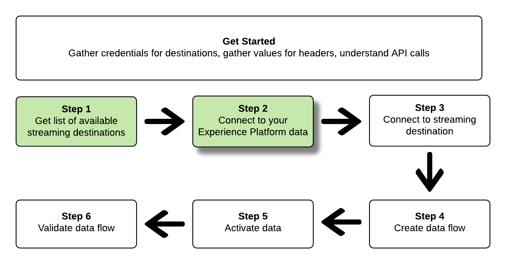
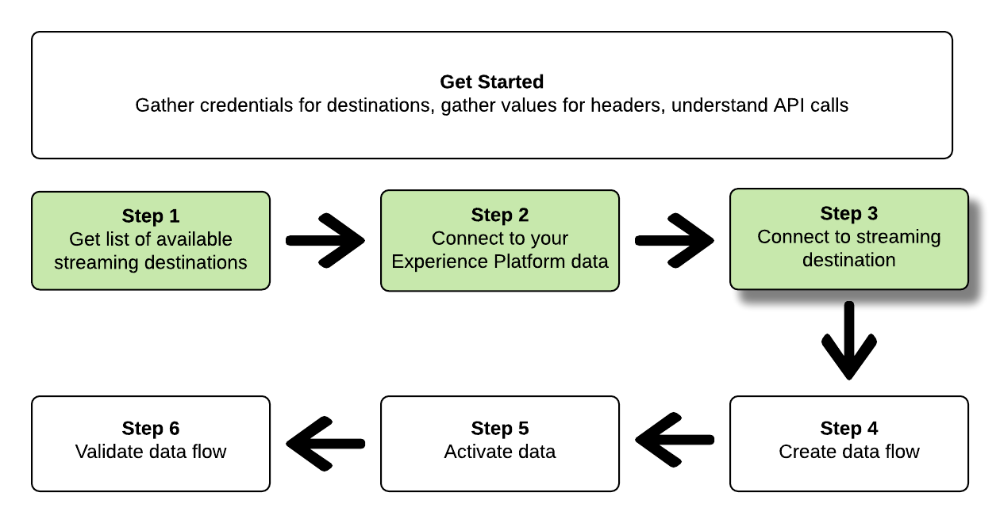

# 连接到流目标并使用流服务API激活数据

>[!IMPORTANT]
> 
>若要连接到目标，您需要&#x200B;**[!UICONTROL 查看目标]**&#x200B;和&#x200B;**[!UICONTROL 管理目标]** [访问控制权限](/help/access-control/home.md#permissions)。
>
>若要激活数据，您需要&#x200B;**[!UICONTROL 查看目标]**、**[!UICONTROL 激活目标]**、**[!UICONTROL 查看配置文件]**&#x200B;和&#x200B;**[!UICONTROL 查看区段]** [访问控制权限](/help/access-control/home.md#permissions)。
>
>阅读[访问控制概述](/help/access-control/ui/overview.md)或联系您的产品管理员以获取所需的权限。

本教程演示了如何使用API调用连接到Adobe Experience Platform数据，如何创建与流式Cloud Storage目标([Amazon Kinesis](../catalog/cloud-storage/amazon-kinesis.md)或[Azure事件中心](../catalog/cloud-storage/azure-event-hubs.md))的连接，以及如何创建到新创建目标的数据流，以及如何将数据激活到新创建的目标。

本教程在所有示例中都使用[!DNL Amazon Kinesis]目标，但[!DNL Azure Event Hubs]的步骤相同。


如果您希望使用Experience Platform中的用户界面连接到目标并激活数据，请参阅[连接目标](../ui/connect-destination.md)和[将受众数据激活到流式受众导出目标](../ui/activate-segment-streaming-destinations.md)教程。

## 快速入门

本指南要求您对 Adobe Experience Platform 的以下组件有一定了解：

* [[!DNL Experience Data Model (XDM) System]](../../xdm/home.md)： Experience Platform用于组织客户体验数据的标准化框架。
* [[!DNL Catalog Service]](../../catalog/home.md)： [!DNL Catalog]是Experience Platform中数据位置和族系的记录系统。
* [沙盒](../../sandboxes/home.md)： Experience Platform提供了将单个Experience Platform实例划分为多个单独的虚拟环境的虚拟沙盒，以帮助开发和改进数字体验应用程序。

以下部分提供了您需要了解的其他信息，以便将数据激活到Experience Platform中的流目标。

### 收集所需的凭据

要完成本教程中的步骤，您应该准备好以下凭据，具体取决于要连接和激活受众的目标类型。

* 对于[!DNL Amazon Kinesis]连接： `accessKeyId`、`secretKey`、`region`或`connectionUrl`
* 对于[!DNL Azure Event Hubs]连接： `sasKeyName`、`sasKey`、`namespace`

### 正在读取示例 API 调用 {#reading-sample-api-calls}

本教程提供了示例API调用来演示如何格式化请求。 这些包括路径、必需的标头和格式正确的请求负载。还提供了在 API 响应中返回的示例 JSON。有关示例API调用文档中使用的约定的信息，请参阅Experience Platform疑难解答指南中有关[如何读取示例API调用](../../landing/troubleshooting.md#how-do-i-format-an-api-request)的部分。

### 收集必需标题和可选标题的值 {#gather-values}

要调用Experience Platform API，您必须先完成[身份验证教程](https://www.adobe.com/go/platform-api-authentication-en)。 完成身份验证教程将为所有Experience Platform API调用中的每个所需标头提供值，如下所示：

* 授权：持有人`{ACCESS_TOKEN}`
* x-api-key： `{API_KEY}`
* x-gw-ims-org-id： `{ORG_ID}`

Experience Platform中的资源可以隔离到特定的虚拟沙箱。 在对Experience Platform API的请求中，您可以指定将执行操作的沙盒的名称和ID。 这些是可选参数。

* x-sandbox-name： `{SANDBOX_NAME}`

>[!NOTE]
>
>有关Experience Platform中沙盒的更多信息，请参阅[沙盒概述文档](../../sandboxes/home.md)。

所有包含有效负载(POST、PUT、PATCH)的请求都需要一个额外的媒体类型标头：

* 内容类型： `application/json`

### Swagger文档 {#swagger-docs}

在本教程中，您可以在Swagger中找到所有API调用的随附参考文档。 请参阅Adobe I/O[&#128279;](https://www.adobe.io/experience-platform-apis/references/flow-service/)上的流服务API文档。 我们建议您并行使用此教程和Swagger文档页面。

## 获取可用流目标的列表 {#get-the-list-of-available-streaming-destinations}


第一步，您应该决定要将数据激活到的流目标。 首先，请执行调用以请求可连接并激活受众的可用目标列表。 对`connectionSpecs`端点执行以下GET请求以返回可用目标列表：

**API格式**

```http
GET /connectionSpecs
```

**请求**

```shell
curl --location --request GET 'https://platform.adobe.io/data/foundation/flowservice/connectionSpecs' \
--header 'accept: application/json' \
--header 'x-gw-ims-org-id: {ORG_ID}' \
--header 'x-api-key: {API_KEY}' \
--header 'x-sandbox-name: {SANDBOX_NAME}' \
--header 'Authorization: Bearer {ACCESS_TOKEN}'
```


**响应**

成功的响应包含可用目标及其唯一标识符(`id`)的列表。 存储您计划使用的目标的值，因为后续步骤需要该值。 例如，如果要连接受众并将受众交付到[!DNL Amazon Kinesis]或[!DNL Azure Event Hubs]，请在响应中查找以下代码片段：

```json
{
    "id": "86043421-563b-46ec-8e6c-e23184711bf6",
  "name": "Amazon Kinesis",
  ...
  ...
}

{
    "id": "bf9f5905-92b7-48bf-bf20-455bc6b60a4e",
  "name": "Azure Event Hubs",
  ...
  ...
}
```

## 连接到您的Experience Platform数据 {#connect-to-your-experience-platform-data}



接下来，您必须连接到Experience Platform数据，以便能够导出配置文件数据并在您的首选目标中激活该数据。 这包含下面描述的两个子步骤。

1. 首先，您必须执行调用以通过设置基本连接来授权对Experience Platform中数据的访问。
2. 然后，使用基本连接ID再次进行调用，以创建源连接，从而建立与Experience Platform数据的连接。


### 在Experience Platform中授权访问您的数据

**API格式**

```http
POST /connections
```

**请求**

```shell
curl --location --request POST 'https://platform.adobe.io/data/foundation/flowservice/connections' \
--header 'Authorization: Bearer {ACCESS_TOKEN}' \
--header 'x-api-key: {API_KEY}' \
--header 'x-gw-ims-org-id: {ORG_ID}' \
--header 'x-sandbox-name: {SANDBOX_NAME}' \
--header 'Content-Type: application/json' \
--data-raw '{
            "name": "Base connection to Experience Platform",
            "description": "This call establishes the connection to Experience Platform data",
            "connectionSpec": {
                "id": "{CONNECTION_SPEC_ID}",
                "version": "1.0"
            }
}'
```


* `{CONNECTION_SPEC_ID}`：为配置文件服务使用连接规范ID - `8a9c3494-9708-43d7-ae3f-cda01e5030e1`。

**响应**

成功的响应包含基本连接的唯一标识符(`id`)。 将此值存储为创建源连接时所需的值。

```json
{
    "id": "1ed86558-59b5-42f7-9865-5859b552f7f4"
}
```

### 连接到您的Experience Platform数据 {#connect-to-platform-data}

**API格式**

```http
POST /sourceConnections
```

**请求**

```shell
curl --location --request POST 'https://platform.adobe.io/data/foundation/flowservice/sourceConnections' \
--header 'Authorization: Bearer {ACCESS_TOKEN}' \
--header 'x-api-key: {API_KEY}' \
--header 'x-gw-ims-org-id: {ORG_ID}' \
--header 'x-sandbox-name: {SANDBOX_NAME}' \
--header 'Content-Type: application/json' \
--data-raw '{
            "name": "Connecting to Profile Service",
            "description": "Optional",
            "connectionSpec": {
                "id": "{CONNECTION_SPEC_ID}",
                "version": "1.0"
            },
            "baseConnectionId": "{BASE_CONNECTION_ID}",
            "data": {
                "format": "json"
            },
            "params": {}
}'
```

* `{BASE_CONNECTION_ID}`：使用您在上一步中获取的ID。
* `{CONNECTION_SPEC_ID}`：为配置文件服务使用连接规范ID - `8a9c3494-9708-43d7-ae3f-cda01e5030e1`。

**响应**

成功的响应返回新创建的与配置文件服务的源连接的唯一标识符(`id`)。 这表示您已成功连接到Experience Platform数据。 将此值存储为后续步骤中所需的值。

```json
{
    "id": "ed48ae9b-c774-4b6e-88ae-9bc7748b6e97"
}
```


## 连接到流目标 {#connect-to-streaming-destination}



在此步骤中，您将设置与所需流目标的连接。 这包含下面描述的两个子步骤。

1. 首先，您必须通过设置基本连接来执行调用以授权对流目标的访问。
2. 然后，使用基本连接ID进行另一个调用，以便在其中创建目标连接，指定存储帐户中要传送导出数据的位置以及要导出的数据的格式。

### 授权对流目标的访问

**API格式**

```http
POST /connections
```

**请求**

>[!IMPORTANT]
>
>以下示例包含前缀为`//`的代码注释。 这些注释突出显示不同的流目标必须使用不同值的位置。 在使用代码片段之前，请删除注释。

```shell
curl --location --request POST 'https://platform.adobe.io/data/foundation/flowservice/connections' \
--header 'Authorization: Bearer {ACCESS_TOKEN}' \
--header 'x-api-key: {API_KEY}' \
--header 'x-gw-ims-org-id: {ORG_ID}' \
--header 'x-sandbox-name: {SANDBOX_NAME}' \
--header 'Content-Type: application/json' \
--data-raw '{
    "name": "Connection for Amazon Kinesis/ Azure Event Hubs",
    "description": "summer advertising campaign",
    "connectionSpec": {
        "id": "{_CONNECTION_SPEC_ID}",
        "version": "1.0"
    },
    "auth": {
        "specName": "{AUTHENTICATION_CREDENTIALS}",
        "params": { // use these values for Amazon Kinesis connections
            "accessKeyId": "{ACCESS_ID}",
            "secretKey": "{SECRET_KEY}",
            "region": "{REGION}"
        },
        "params": { // use these values for Azure Event Hubs connections
            "sasKeyName": "{SAS_KEY_NAME}",
            "sasKey": "{SAS_KEY}",
            "namespace": "{EVENT_HUB_NAMESPACE}"
        }        
    }
}'
```

* `{CONNECTION_SPEC_ID}`：使用您在步骤[中获得的连接规范ID获取可用目标的列表](#get-the-list-of-available-destinations)。
* `{AUTHENTICATION_CREDENTIALS}`：填写您的流目标的名称： `Aws Kinesis authentication credentials`或`Azure EventHub authentication credentials`。
* `{ACCESS_ID}`： *用于[!DNL Amazon Kinesis]连接。*&#x200B;您的Amazon Kinesis存储位置的访问ID。
* `{SECRET_KEY}`： *用于[!DNL Amazon Kinesis]连接。*&#x200B;您的Amazon Kinesis存储位置的密钥。
* `{REGION}`： *用于[!DNL Amazon Kinesis]连接。* Experience Platform将在[!DNL Amazon Kinesis]帐户中流式传输数据的区域。
* `{SAS_KEY_NAME}`： *用于[!DNL Azure Event Hubs]连接。*&#x200B;填写您的SAS密钥名称。 请参阅[Microsoft文档](https://docs.microsoft.com/en-us/azure/event-hubs/authenticate-shared-access-signature)以了解如何使用SAS密钥向[!DNL Azure Event Hubs]进行身份验证。
* `{SAS_KEY}`： *用于[!DNL Azure Event Hubs]连接。*&#x200B;填写您的SAS密钥。 请参阅[Microsoft文档](https://docs.microsoft.com/en-us/azure/event-hubs/authenticate-shared-access-signature)以了解如何使用SAS密钥向[!DNL Azure Event Hubs]进行身份验证。
* `{EVENT_HUB_NAMESPACE}`： *用于[!DNL Azure Event Hubs]连接。*&#x200B;填写[!DNL Azure Event Hubs]命名空间，Experience Platform将在其中流式传输您的数据。 有关详细信息，请参阅[!DNL Microsoft]文档中的[创建事件中心命名空间](https://docs.microsoft.com/en-us/azure/event-hubs/event-hubs-create#create-an-event-hubs-namespace)。

**响应**

成功的响应包含基本连接的唯一标识符(`id`)。 将此值存储为创建目标连接时在下一步中所需的值。

```json
{
    "id": "1ed86558-59b5-42f7-9865-5859b552f7f4"
}
```

### 指定存储位置和数据格式

**API格式**

```http
POST /targetConnections
```

**请求**

>[!IMPORTANT]
>
>以下示例包含前缀为`//`的代码注释。 这些注释突出显示不同的流目标必须使用不同值的位置。 在使用代码片段之前，请删除注释。

```shell
curl --location --request POST 'https://platform.adobe.io/data/foundation/flowservice/targetConnections' \
--header 'Authorization: Bearer {ACCESS_TOKEN}' \
--header 'x-api-key: {API_KEY}' \
--header 'x-gw-ims-org-id: {ORG_ID}' \
--header 'Content-Type: application/json' \
--data-raw '{
    "name": "Amazon Kinesis/ Azure Event Hubs target connection",
    "description": "Connection to Amazon Kinesis/ Azure Event Hubs",
    "baseConnectionId": "{BASE_CONNECTION_ID}",
    "connectionSpec": {
        "id": "{CONNECTION_SPEC_ID}",
        "version": "1.0"
    },
    "data": {
        "format": "json"
    },
    "params": { // use these values for Amazon Kinesis connections
        "stream": "{NAME_OF_DATA_STREAM}", 
        "region": "{REGION}"
    },
    "params": { // use these values for Azure Event Hubs connections
        "eventHubName": "{EVENT_HUB_NAME}"
    }
}'
```

* `{BASE_CONNECTION_ID}`：使用您在上一步中获取的基本连接ID。
* `{CONNECTION_SPEC_ID}`：使用您在步骤[中获得的连接规范获取可用目标的列表](#get-the-list-of-available-destinations)。
* `{NAME_OF_DATA_STREAM}`： *用于[!DNL Amazon Kinesis]连接。*&#x200B;提供[!DNL Amazon Kinesis]帐户中现有数据流的名称。 Experience Platform会将数据导出到此流。
* `{REGION}`： *用于[!DNL Amazon Kinesis]连接。* Amazon Kinesis帐户中Experience Platform将流式传输数据的区域。
* `{EVENT_HUB_NAME}`： *用于[!DNL Azure Event Hubs]连接。*&#x200B;填写[!DNL Azure Event Hub]名称，Experience Platform将在其中流式传输您的数据。 有关详细信息，请参阅[!DNL Microsoft]文档中的[创建事件中心](https://docs.microsoft.com/en-us/azure/event-hubs/event-hubs-create#create-an-event-hub)。

**响应**

成功的响应将返回新创建的目标连接的唯一标识符(`id`)到您的流目标。 在后续步骤中根据需要存储此值。

```json
{
    "id": "12ab90c7-519c-4291-bd20-d64186b62da8"
}
```

## 创建数据流


现在，您可以使用在之前步骤中获取的ID在Experience Platform数据和要将数据激活到的目标之间创建数据流。 将此步骤视为构建管道，数据稍后将通过该管道在Experience Platform和您的所需目标之间流动。

要创建数据流，请执行POST请求（如下所示），同时在有效负荷中提供下面提到的值。

执行以下POST请求以创建数据流。

**API格式**

```http
POST /flows
```

**请求**

```shell
curl -X POST \
'https://platform.adobe.io/data/foundation/flowservice/flows' \
-H 'Authorization: Bearer {ACCESS_TOKEN}' \
-H 'x-api-key: {API_KEY}' \
-H 'x-gw-ims-org-id: {ORG_ID}' \
-H 'x-sandbox-name: {SANDBOX_NAME}' \
-H 'Content-Type: application/json' \
-d  '{
  "name": "Azure Event Hubs",
  "description": "Azure Event Hubs",
  "flowSpec": {
    "id": "{FLOW_SPEC_ID}",
    "version": "1.0"
  },
  "sourceConnectionIds": [
    "{SOURCE_CONNECTION_ID}"
  ],
  "targetConnectionIds": [
    "{TARGET_CONNECTION_ID}"
  ],
  "transformations": [
    {
      "name": "GeneralTransform",
      "params": {
        "profileSelectors": {
          "selectors": [
            
          ]
        },
        "segmentSelectors": {
          "selectors": [
            
          ]
        }
      }
    }
  ]
}
```

* `{FLOW_SPEC_ID}`：基于配置文件的目标的流规范ID为`71471eba-b620-49e4-90fd-23f1fa0174d8`。 在调用中使用此值。
* `{SOURCE_CONNECTION_ID}`：使用在步骤[中获得的源连接ID连接到Experience Platform](#connect-to-your-experience-platform-data)。
* `{TARGET_CONNECTION_ID}`：使用您在步骤[中获取的目标连接ID连接到流目标](#connect-to-streaming-destination)。

**响应**

成功的响应返回新创建的数据流的ID (`id`)和`etag`。 记下这两个值。 与在下一步中激活受众时一样。

```json
{
    "id": "8256cfb4-17e6-432c-a469-6aedafb16cd5",
    "etag": "8256cfb4-17e6-432c-a469-6aedafb16cd5"
}
```


## 将数据激活到新目标 {#activate-data}


创建了所有连接和数据流后，现在您可以将配置文件数据激活到流平台。 在此步骤中，您可以选择将哪些受众和哪些配置文件属性发送到目标，并且您可以进行计划并将数据发送到目标。

要将受众激活到您的新目标，您必须执行JSON PATCH操作，类似于以下示例。 您可以在一次调用中激活多个受众和配置文件属性。 要了解有关JSON PATCH的更多信息，请参阅[RFC规范](https://tools.ietf.org/html/rfc6902)。

**API格式**

```http
PATCH /flows
```

**请求**

```shell
curl --location --request PATCH 'https://platform.adobe.io/data/foundation/flowservice/flows/{DATAFLOW_ID}' \
--header 'Authorization: Bearer {ACCESS_TOKEN}' \
--header 'x-api-key: {API_KEY}' \
--header 'x-gw-ims-org-id: {ORG_ID}' \
--header 'Content-Type: application/json' \
--header 'x-sandbox-name: {SANDBOX_NAME}' \
--header 'If-Match: "{ETAG}"' \
--data-raw '[
  {
    "op": "add",
    "path": "/transformations/0/params/segmentSelectors/selectors/-",
    "value": {
      "type": "PLATFORM_SEGMENT",
      "value": {
        "name": "Name of the audience that you are activating",
        "description": "Description of the audience that you are activating",
        "id": "{SEGMENT_ID}"
      }
    }
  },
  {
    "op": "add",
    "path": "/transformations/0/params/profileSelectors/selectors/-",
    "value": {
      "type": "JSON_PATH",
      "value": {
        "operator": "EXISTS",
        "path": "{PROFILE_ATTRIBUTE}"
      }
    }
  }
]
```

| 属性 | 描述 |
| --------- | ----------- |
| `{DATAFLOW_ID}` | 在URL中，使用您在上一步中创建的数据流的ID。 |
| `{ETAG}` | 从上一步[创建数据流](#create-dataflow)中的响应中获取`{ETAG}`。 上一步中的响应格式对引号进行了转义。 您必须在请求的标头中使用未转义值。 查看以下示例： <br> <ul><li>响应示例：`"etag":""7400453a-0000-1a00-0000-62b1c7a90000""`</li><li>要在您的请求中使用的值： `"etag": "7400453a-0000-1a00-0000-62b1c7a90000"`</li></ul> <br>每次成功更新数据流时，etag值都会更新。 |
| `{SEGMENT_ID}` | 提供要导出到此目标的受众ID。 要检索要激活的受众的受众ID，请参阅Experience Platform API参考中的[检索受众定义](https://www.adobe.io/experience-platform-apis/references/segmentation/#operation/retrieveSegmentDefinitionById)。 |
| `{PROFILE_ATTRIBUTE}` | 例如：`"person.lastName"` |
| `op` | 操作调用，用于定义更新数据流所需的操作。 操作包括： `add`、`replace`和`remove`。 要将受众添加到数据流，请使用`add`操作。 |
| `path` | 定义要更新的流部分。 将受众添加到数据流时，请使用示例中指定的路径。 |
| `value` | 要用于更新参数的新值。 |
| `id` | 指定要添加到目标数据流的受众的ID。 |
| `name` | *可选*。 指定要添加到目标数据流的受众的名称。 请注意，此字段不是必填字段，您无需提供名称即可将受众成功添加到目标数据流。 |

**响应**

查找“202 OK（202确定）”响应。 未返回响应正文。 要验证请求是否正确，请参阅下一步验证数据流。

## 验证数据流


作为本教程的最后一步，您应该验证受众和配置文件属性是否确实已正确映射到数据流。

要验证这一点，请执行以下GET请求：

**API格式**

```http
GET /flows
```

**请求**

```shell
curl --location --request PATCH 'https://platform.adobe.io/data/foundation/flowservice/flows/{DATAFLOW_ID}' \
--header 'Authorization: Bearer {ACCESS_TOKEN}' \
--header 'x-api-key: {API_KEY}' \
--header 'x-gw-ims-org-id: {ORG_ID}' \
--header 'Content-Type: application/json' \
--header 'x-sandbox-name: prod' \
--header 'If-Match: "{ETAG}"' 
```

* `{DATAFLOW_ID}`：使用上一步的数据流。
* `{ETAG}`：使用上一步骤中的etag。

**响应**

返回的响应应包括您在上一步中提交的受众和配置文件属性在`transformations`参数中。 响应中的示例`transformations`参数可能如下所示：

```json
"transformations": [
    {
        "name": "GeneralTransform",
        "params": {
            "profileSelectors": {
                        "selectors": [
                            {
                                "type": "JSON_PATH",
                                "value": {
                                    "path": "personalEmail.address",
                                    "operator": "EXISTS"
                                }
                            },
                            {
                                "type": "JSON_PATH",
                                "value": {
                                    "path": "person.lastname",
                                    "operator": "EXISTS"
                                }
                            }
                        ]
                    },
            "segmentSelectors": {
                "selectors": [
                    {
                        "type": "PLATFORM_SEGMENT",
                        "value": {
                            "name": "Men over 50",
                            "description": "",
                            "id": "72ddd79b-6b0a-4e97-a8d2-112ccd81bd02"
                        }
                    }
                ]
            }
        }
    }
],
```

**已导出数据**

>[!IMPORTANT]
>
> 除了步骤[将数据激活到新目标](#activate-data)中的配置文件属性和受众之外，[!DNL AWS Kinesis]和[!DNL Azure Event Hubs]中的导出数据还将包含有关身份映射的信息。 这表示导出的配置文件的标识(例如[ECID](https://experienceleague.adobe.com/docs/id-service/using/intro/id-request.html?lang=zh-Hans)、移动设备ID、Google ID、电子邮件地址等)。 请参阅以下示例。

```json
{
  "person": {
    "email": "yourstruly@adobe.com"
  },
  "segmentMembership": {
    "ups": {
      "72ddd79b-6b0a-4e97-a8d2-112ccd81bd02": {
        "lastQualificationTime": "2020-03-03T21:24:39Z",
        "status": "exited"
      },
      "7841ba61-23c1-4bb3-a495-00d695fe1e93": {
        "lastQualificationTime": "2020-03-04T23:37:33Z",
        "status": "realized"
      }
    }
  },
  "identityMap": {
    "ecid": [
      {
        "id": "14575006536349286404619648085736425115"
      },
      {
        "id": "66478888669296734530114754794777368480"
      }
    ],
    "email_lc_sha256": [
      {
        "id": "655332b5fa2aea4498bf7a290cff017cb4"
      },
      {
        "id": "66baf76ef9de8b42df8903f00e0e3dc0b7"
      }
    ]
  }
}
```

## 使用[!DNL Postman]收藏集连接到流目标  {#collections}

若要以更简化的方式连接到本教程中描述的流目标，您可以使用[[!DNL Postman]](https://www.postman.com/)。

[!DNL Postman]是一种可用于进行API调用和管理预定义调用和环境的库的工具。

对于此特定教程，已附加以下[!DNL Postman]个收藏集：

* [!DNL AWS Kinesis] [!DNL Postman]收藏集
* [!DNL Azure Event Hubs] [!DNL Postman]收藏集

单击[此处](../assets/api/streaming-destination/DestinationPostmanCollection.zip)下载收藏集存档。

每个集合分别包括[!DNL AWS Kinesis]和[!DNL Azure Event Hub]的必要请求和环境变量。

### 如何使用[!DNL Postman]收藏集 {#how-to-use-postman-collections}

要使用附加的[!DNL Postman]收藏集成功连接到目标，请执行以下步骤：

* 下载并安装[!DNL Postman]；
* [下载](../assets/api/streaming-destination/DestinationPostmanCollection.zip)并解压缩附加的收藏集；
* 将收藏集从相应的文件夹导入[!DNL Postman]；
* 按照本文中的说明填写环境变量；
* 根据本文中的说明，运行[!DNL Postman]中的[!DNL API]请求。

## API错误处理 {#api-error-handling}

本教程中的API端点遵循常规Experience Platform API错误消息原则。 有关解释错误响应的详细信息，请参阅Experience Platform疑难解答指南中的[API状态代码](/help/landing/troubleshooting.md#api-status-codes)和[请求标头错误](/help/landing/troubleshooting.md#request-header-errors)。

## 后续步骤 {#next-steps}

通过遵循本教程，您已成功将Experience Platform连接到其中一个首选流目标，并设置了到相应目标的数据流。 传出数据现在可用于客户分析的目标或您希望执行的任何其他数据操作。 有关更多详细信息，请参阅以下页面：

* [目标概述](../home.md)
* [目标目录概述](../catalog/overview.md)
