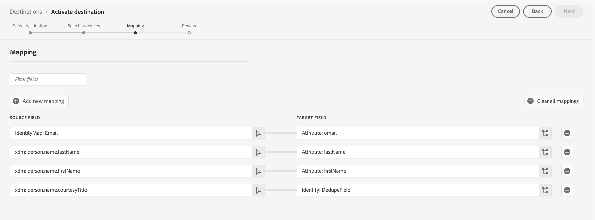

# Marketo Engage连接

## 概述 {#overview}

[!DNL Marketo Engage]是唯一用于营销、广告、分析和商业的端到端客户体验管理(CXM)解决方案。 您可以从自动化和管理活动，从CRM商机管理和客户参与到基于帐户的营销和收入归因。

使用此目标在Adobe Experience Platform和Marketo Engage之间实时同步受众数据和配置文件属性。

## 用例 {#use-cases}

为了帮助您更好地了解您应如何以及何时使用[!DNL Marketo Engage]目标，以下是Adobe Experience Platform客户可以使用此目标解决的示例用例。

### 受众同步用例 {#audience-sync-use-cases}

**仅重新与已知潜在客户接洽**

营销团队想要开展一个回馈式营销活动，以定向那些已在Marketo中工作了90天以上的潜在客户。

他们可以将受众激活到Marketo Engage并使用&#x200B;**[!UICONTROL 仅受众]**&#x200B;同步类型。

### 受众和配置文件同步用例 {#audience-profile-sync-use-cases}

**重新与已知的潜在客户接洽并更新潜在客户**

营销团队想要为根据网站访问表现出兴趣的现有Marketo联系人启动重新参与活动。 他们还想更新潜在客户信息（如偏好设置、人口统计信息），但不想在Marketo中创建任何新人员。

他们可以激活Marketo Engage的受众，并将&#x200B;**[!UICONTROL 受众和配置文件]**&#x200B;同步类型与&#x200B;**[!UICONTROL 仅更新现有人员]**&#x200B;操作结合使用，以确保他们仅针对Marketo中已存在的受众。

**通过完整的配置文件同步重新参与并扩展访问范围**

营销团队想要为新营销活动激活产品兴趣受众。 虽然许多配置文件已存在于Marketo中，但一些配置文件是新的，仅存在于Real-Time CDP中。 对于现有人员，他们希望确保在Marketo中更新这些人员，但同时要创建新配置文件。

他们可以在Marketo Engage中激活其受众，并将&#x200B;**[!UICONTROL 受众和配置文件]**&#x200B;同步类型与&#x200B;**[!UICONTROL 更新现有和创建新人员]**&#x200B;操作结合使用，以确保他们能够定位从Marketo导出的现有潜在客户，并为从Real-Time CDP导出的新受众创建新潜在客户。

## 先决条件 {#prerequisites}

* 设置目标的用户在其Marketo实例和分区中必须具有[编辑人员](https://experienceleague.adobe.com/zh-hans/docs/marketo/using/product-docs/administration/users-and-roles/descriptions-of-role-permissions#access-database)权限。
* 设置此目标时，只有同一Adobe Real-Time CDP组织上的Marketo Engage实例可用。
* 只有在Adobe Admin Console中管理用户的Marketo Engage实例才能使用此目标。

## 支持的身份 {#supported-identities}

[!DNL Marketo Engage]支持激活下表中描述的标识。 了解有关[标识](/help/identity-service/features/namespaces.md)的更多信息。

| 目标身份 | 描述 | 注意事项 |
|---|---|---|
| `DedupeField` | 用于识别和匹配Marketo中现有商机的字段。 | 在[映射](#mapping)步骤中，将您要用作重复数据删除字段的任何源字段（如`Email`或其他自定义标识符）映射到此目标身份。 为了获得最佳结果，请选择在所有客户配置文件中始终可用且唯一的字段。 不支持将`ECID`作为重复数据删除字段。 |

{style="table-layout:auto"}

## 支持的受众 {#supported-audiences}

此部分介绍哪些类型的受众可以导出到此目标。 以下两个表按受众中包含的&#x200B;_受众来源_&#x200B;和&#x200B;_配置文件类型_&#x200B;指明了此连接器支持的受众：

| 受众来源 | 支持 | 描述 |
|---------|----------|----------|
| [!DNL Segmentation Service] | ✓ | 通过Experience Platform [分段服务](../../../segmentation/home.md)生成的受众。 |
| 所有其他受众来源 | ✓ | 此类别包括通过[!DNL Segmentation Service]生成的受众之外的所有受众来源。 了解[各种受众源](/help/segmentation/ui/audience-portal.md#customize)。 一些示例包括： <ul><li> 自定义上传受众[从CSV文件导入](../../../segmentation/ui/audience-portal.md#import-audience)到Experience Platform，</li><li> 相似的受众， </li><li> 联合受众， </li><li> 在其他Experience Platform应用程序(如Adobe Journey Optimizer)中生成的受众， </li><li> 等等。 </li></ul>   |

{style="table-layout:auto"}

按受众数据类型划分的受众支持：

| 受众数据类型 | 支持 | 描述 | 用例 |
|--------------------|-----------|-------------|-----------|
| [人员受众](/help/segmentation/types/people-audiences.md) | 是 | 根据客户个人资料，允许您针对特定的营销活动人群组进行定位。 | 频繁购买者，购物车放弃者 |
| [帐户受众](/help/segmentation/types/account-audiences.md) | 否 | 针对特定组织内的个人，制定基于帐户的营销策略。 | B2B营销 |
| [潜在客户受众](/help/segmentation/types/prospect-audiences.md) | 否 | 定位尚未成为客户但与目标受众具有共同特征的个人。 | 利用第三方数据发现潜在客户 |
| [数据集导出](/help/catalog/datasets/overview.md) | 否 | 存储在Adobe Experience Platform数据湖中的结构化数据的集合。 | 报告、数据科学工作流 |

{style="table-layout:auto"}

## 导出类型和频率 {#export-type-frequency}

有关目标导出类型和频率的信息，请参阅下表。

| 项目 | 类型 | 注释 |
---------|----------|---------|
| 导出类型 | **[!UICONTROL 受众导出]** | 您正在导出具有[!DNL Marketo Engage]目标中所用标识符（电子邮件、ECID）的受众的所有成员。 |
| 导出频率 | **[!UICONTROL 正在流式传输]** | 流目标为基于API的“始终运行”连接。 根据受众评估在Experience Platform中更新用户档案后，连接器会立即将更新发送到下游目标平台。 阅读有关[流式目标](/help/destinations/destination-types.md#streaming-destinations)的更多信息。 |

{style="table-layout:auto"}

## 商机匹配行为 {#lead-matching}

了解Marketo商机匹配的工作原理有助于您为您的用例选择正确的配置。 匹配行为取决于您选择的&#x200B;**[!UICONTROL 同步类型]**&#x200B;和&#x200B;**[!UICONTROL 人员操作]**&#x200B;设置。

Marketo使用您选择的&#x200B;**[!UICONTROL Marketo重复数据删除字段]**&#x200B;将Experience Platform配置文件与现有Marketo潜在客户进行匹配。 匹配过程将搜索Marketo实例中的所有分区以查找现有潜在客户。 请参阅下表，了解如何根据所选配置在Marketo实例中创建和更新潜在客户。

| 同步类型 | 人员操作 | 匹配行为 |
|-----------|---------------|-------------------|
| **[!UICONTROL 仅配置文件]** | **[!UICONTROL 更新现有人员并创建新人员]** | <ul><li>使用新的配置文件数据更新现有潜在客户</li><li>为不匹配的用户档案在选定分区中创建新潜在客户</li></ul> |
| **[!UICONTROL 仅配置文件]** | **[!UICONTROL 仅更新现有人员]** | <ul><li>使用新的配置文件数据更新现有潜在客户</li><li>没有为不匹配的用户档案创建新的潜在客户</li></ul> |
| **[!UICONTROL 仅限受众]** | 不适用 | <ul><li>将现有潜在客户添加到受众列表</li><li>没有为不匹配的用户档案创建新的潜在客户</li></ul> |
| **[!UICONTROL 受众和个人资料]** | **[!UICONTROL 更新现有人员并创建新人员]** | <ul><li>使用新的配置文件数据更新现有潜在客户</li><li>将现有潜在客户添加到受众列表</li><li>为不匹配的用户档案在选定分区中创建新潜在客户</li><li>向受众列表添加新潜在客户</li></ul> |
| **[!UICONTROL 受众和个人资料]** | **[!UICONTROL 仅更新现有人员]** | <ul><li>使用新的配置文件数据更新现有潜在客户</li><li>将现有潜在客户添加到受众列表</li><li>没有为不匹配的用户档案创建新的潜在客户</li></ul> |

{style="table-layout:auto"}

### 重要注意事项

* **重复数据删除字段选择**：选择在您的客户配置文件中始终可用且唯一的字段（例如：电子邮件地址、客户ID）
* **分区处理**：创建新潜在客户时，会将它们放置在所选分区中（如果未选择分区，则使用&#x200B;**[!UICONTROL 默认值]**&#x200B;分区）
* **重复处理**：如果有多个Marketo潜在客户匹配同一个配置文件，则仅更新最近更新的潜在客户
* **跨分区匹配**：系统将在所有分区中进行搜索以查找现有潜在客户，无论您为新潜在客户选择了哪个分区

## 连接到目标 {#connect}

>[!IMPORTANT]
> 
>* 若要连接到目标，您需要&#x200B;**[!UICONTROL 查看目标]**&#x200B;和&#x200B;**[!UICONTROL 管理目标]** [访问控制权限](/help/access-control/home.md#permissions)。
>
>* 若要激活数据，您需要&#x200B;**[!UICONTROL 查看目标]**、**[!UICONTROL 激活目标]**、**[!UICONTROL 查看配置文件]**&#x200B;和&#x200B;**[!UICONTROL 查看区段]** [访问控制权限](/help/access-control/home.md#permissions)。 阅读[访问控制概述](/help/access-control/ui/overview.md)或联系您的产品管理员以获取所需的权限。

要连接到此目标，请按照[目标配置教程](../../ui/connect-destination.md)中描述的步骤操作。 在配置目标工作流中，填写下面两个部分中列出的字段。

### 验证目标 {#authenticate}

要验证到目标，请选择&#x200B;**[!UICONTROL 连接到目标]**。

### 填写目标详细信息 {#destination-details}

要配置目标的详细信息，请填写下面的必需和可选字段。 UI中字段旁边的星号表示该字段为必填字段。

* **[!UICONTROL 名称]**：将来用于识别此目标的名称。
* **[!UICONTROL 描述]**：可帮助您将来识别此目标的描述。
* **[!UICONTROL Munchkin ID]**：选择要用于此目标的[!DNL Marketo Munchkin ID]。
* **[!UICONTROL Workspace ID]**：选择您的Marketo工作区ID。
* **[!UICONTROL 同步类型]**：选择要用于此目标的同步类型：
   * **[!UICONTROL 受众和配置文件]**：如果既要将受众成员添加到Marketo列表，又要使其配置文件信息保持最新，请选择此选项。
   * **[!UICONTROL 仅配置文件]**：如果您希望使用Experience Platform中的最新信息使Marketo潜在客户配置文件保持最新，请选择此选项。
   * **[!UICONTROL 仅限受众]**：如果要将受众成员添加到Marketo列表而不更新其配置文件信息，请选择此选项。
* **[!UICONTROL 分区]**： *分区选择仅在选择&#x200B;**[!UICONTROL 仅配置文件]**&#x200B;或&#x200B;**[!UICONTROL 受众和配置文件]**&#x200B;同步类型*&#x200B;时可用。 选择与所选工作区关联的Marketo分区ID。 这允许您指定Marketo中的哪个潜在客户分区将接收导出的数据。 如果不选择特定的分区，您的数据将发送到Marketo中的&#x200B;**[!UICONTROL Default]**&#x200B;分区。
* **[!UICONTROL Marketo重复数据删除字段]**：选择要在更新现有Marketo潜在客户时使用的Marketo重复数据删除字段。 此选择器显示您在Marketo中标记为重复数据删除字段的字段。 如果您希望Marketo中的特定字段显示为重复数据删除字段，则必须将该字段标记为Marketo中的[可搜索字段](https://experienceleague.adobe.com/zh-hans/docs/marketo-developer/marketo/rest/lead-database/lead-database)。

  >[!NOTE]
  >
  >不支持对Marketo `Lead ID`和Experience Cloud ID (`ECID`)进行重复数据删除。

* **[!UICONTROL 人员操作]**：选择导出数据时要执行的Marketo操作。
   * **[!UICONTROL 更新现有潜在客户并创建新人员]**：选择此选项可更新现有Marketo潜在客户，并为尚未在Marketo中的受众成员创建新潜在客户。 将在所选分区中创建新潜在客户。 如果未选择分区，则会在&#x200B;**[!UICONTROL 默认]**&#x200B;分区中创建新的潜在客户。
   * **[!UICONTROL 仅更新现有人员]**：如果只想更新现有Marketo潜在客户而不想创建新潜在客户，请选择此选项。 如果多个潜在客户匹配同一个配置文件，则只有最近更新的Marketo潜在客户才会更新您的Experience Platform数据。

### 启用警报 {#enable-alerts}

您可以启用警报，以接收有关发送到目标的数据流状态的通知。 从列表中选择警报以订阅接收有关数据流状态的通知。 有关警报的详细信息，请阅读有关使用UI订阅目标警报[的指南](../../ui/alerts.md)。

完成提供目标连接的详细信息后，选择&#x200B;**[!UICONTROL 下一步]**。

## 激活此目标的受众 {#activate}

>[!IMPORTANT]
> 
>* 若要激活数据，您需要&#x200B;**[!UICONTROL 查看目标]**、**[!UICONTROL 激活目标]**、**[!UICONTROL 查看配置文件]**&#x200B;和&#x200B;**[!UICONTROL 查看区段]** [访问控制权限](/help/access-control/home.md#permissions)。 阅读[访问控制概述](/help/access-control/ui/overview.md)或联系您的产品管理员以获取所需的权限。
>* 要导出&#x200B;*标识*，您需要&#x200B;**[!UICONTROL 查看标识图形]** [访问控制权限](/help/access-control/home.md#permissions)。  {width="100" zoomable="yes"}

有关将受众激活到此目标的说明，请阅读[将配置文件和受众激活到流式受众导出目标](/help/destinations/ui/activate-segment-streaming-destinations.md)。

### 必需的映射 {#required-mappings}

在映射步骤中，将您要用作重复数据删除字段的任何源字段（如`email`或其他自定义标识符）映射到`DedupeField`目标身份。 为了获得最佳结果，请选择在所有客户配置文件中始终可用且唯一的字段。

要让Marketo成功创建潜在客户，您还必须映射以下必需的目标属性：

* `firstName`：潜在客户的名字
* `lastName`：潜在客户的姓氏
* `email`：潜在客户的电子邮件地址

如果您使用`email`作为重复数据删除字段，则还必须映射`firstName`和`lastName`属性，如下图所示。

如果您使用不同的重复数据删除字段，则必须手动映射所有三个必需属性(`firstName`、`lastName`、`email`)，如下图所示。

## 导出的数据/验证数据导出 {#exported-data}

将受众导出到Marketo Engage后，您应该登录到Marketo帐户，验证受众是否已按预期激活。 在Marketo中检查相关的潜在客户分区和工作区，以确认受众数据正确显示，并且已执行预期的操作（例如更新或创建人员）。

如果看不到预期的数据，请在Adobe Experience Platform中查看映射和导出设置，然后重试导出。

## 数据使用和治理 {#data-usage-governance}

在处理您的数据时，所有[!DNL Adobe Experience Platform]目标都符合数据使用策略。 有关[!DNL Adobe Experience Platform]如何实施数据治理的详细信息，请阅读[数据治理概述](/help/data-governance/home.md)。
