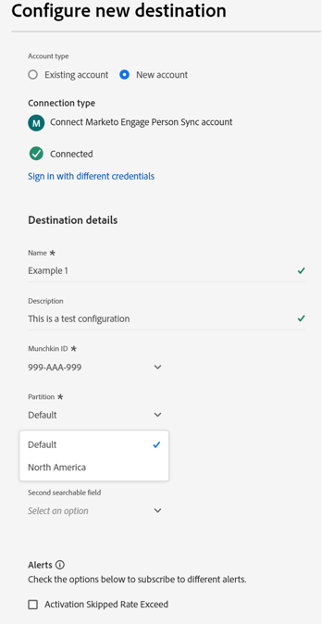
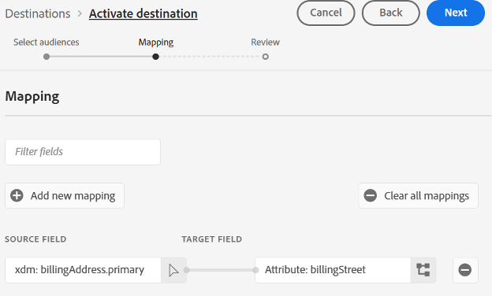

# Marketo Engage人员同步连接 {#marketo-engage-person-sync}

>[!IMPORTANT]
>
>此目标连接器处于测试阶段，仅提供给特定客户。要请求访问权限，请与 Adobe 代表联系。

>[!IMPORTANT]
>
>**[!UICONTROL Marketo Engage人员同步]**&#x200B;目标卡将在&#x200B;**2026年3月**&#x200B;被弃用。
>
>要确保顺利过渡到新&#x200B;**[[!UICONTROL Marketo Engage]](marketo-engage-connection.md)**&#x200B;目标，请查看以下关键点和所需的操作：
>
>* **[!UICONTROL Marketo Engage人员同步]**&#x200B;目标的所有用户必须在2026年3月之前迁移到新的&#x200B;**[[!UICONTROL Marketo Engage]](marketo-engage-connection.md)**&#x200B;目标。
>* **不会自动迁移现有数据流。**&#x200B;您必须[设置与新](marketo-engage-connection.md#connect-to-the-destination)Marketo Engage **[!UICONTROL 目标的新连接]**&#x200B;并在该处激活您的受众。

## 概述 {#overview}

使用Marketo Engage人员同步连接器将人员受众中的更新流式传输到Marketo Engage实例中的相应记录。

>[!IMPORTANT]
> 
>[Marketo V2 Audience Sync Connector](/help/destinations/catalog/adobe/marketo-engage.md)不应在“创建”模式下与配置文件更新同步连接器一起使用

## 支持的身份和属性 {#support-identities-and-attributes}

### 支持的身份 {#supported-identities}

| 目标身份 | 描述 |
| --------------- | ---------------------------------------------------------------------------------------------------------------------------------------------------------------------------------------- |
| 电子邮件 | 表示电子邮件地址的命名空间。 此类命名空间通常与单个人员关联，因此可用于跨不同渠道识别该人员。 |

{style="table-layout:auto"}

### 支持的属性 {#supported-attributes}

您可以将属性从Experience Platform映射到您的组织在Marketo中有权访问的任何属性。 在Marketo中，您可以使用[Describe API](https://developer.adobe.com/marketo-apis/api/mapi/#tag/Leads/operation/describeUsingGET_6)请求来检索您的组织有权访问的属性字段。

## 支持的受众 {#supported-audiences}

此部分介绍哪些类型的受众可以导出到此目标。

| 受众来源 | 支持 | 描述 |
| -------------------- | :-------: | ------------------------------------------------------------------------------------------------------------------------------------------------------------- |
| Segmentation Service | ✓ | 通过Experience Platform [分段服务](https://experienceleague.adobe.com/zh-hans/docs/experience-platform/segmentation/home)生成的受众。 |
| 自定义上传 | ✓ | 从CSV文件导入到Experience Platform中的受众。 |

## 导出类型和频率 {#export-type-and-frequency}

有关目标导出类型和频率的信息，请参阅下表。

| 项目 | 类型 | 注释 |
| ---------------- | --------- | ----------------------------------------------------------------------------------------------------------------------------------------------------------------------------------------------------------------------------------------------------------------------------------------------------------------------------------------------------------------------------------------- |
| 导出频率 | 流传输 | 流目标为基于API的“始终运行”连接。 根据受众评估在Experience Platform中更新用户档案后，连接器会立即将更新发送到下游目标平台。 阅读有关[流式目标](/help/destinations/destination-types.md#streaming-destinations)的更多信息。 |

{style="table-layout:auto"}

## 设置目标 {#set-up-destination}

>[!IMPORTANT]
>
>* 若要连接到目标，您需要&#x200B;**[!UICONTROL 查看目标]**&#x200B;和&#x200B;**[!UICONTROL 管理目标]** [访问控制权限](/help/access-control/home.md#permissions)。

如果贵公司有权访问多个组织，请确保在Marketo Engage和Real-Time CDP中使用相同的组织，以便在其中设置指向Marketo的目标连接器。  如果您已配置目标，则可以选择现有的Marketo帐户以用于新配置。  如果不包含，请单击“Connector to Destination”提示，在此处，您可以设置所需目标的名称、描述和Marketo Munchkin ID。  您的Marketo实例的Munchkin ID可在管理员 — >Munchkin菜单中找到。

>[!IMPORTANT]
>
>设置目标的用户必须在Marketo实例和分区中具有[编辑人员](https://experienceleague.adobe.com/en/docs/marketo/using/product-docs/administration/users-and-roles/descriptions-of-role-permissions#access-database)权限。

* **[!UICONTROL 名称]**：将来用于识别此目标的名称。
* **[!UICONTROL 描述]**：可帮助您将来识别此目标的描述。
* **[!UICONTROL Munchkin ID]**： Munchkin ID是特定Marketo实例的唯一标识符。
* **[!UICONTROL 分区]**： Marketo Engage中的一个概念，用于按业务关注点划分潜在客户记录
* **[!UICONTROL 第一个可搜索的字段]**：要消除重复项的字段。 字段必须出现在输入的每个潜在客户记录中。 默认为电子邮件
* **[!UICONTROL 第一个可搜索的字段]**：要消除重复项的辅助字段。 字段必须出现在输入的每个潜在客户记录中。 可选

选择实例后，您还需要选择要与配置集成的Lead分区。 [潜在客户分区](https://experienceleague.adobe.com/en/docs/marketo/using/product-docs/administration/workspaces-and-person-partitions/understanding-workspaces-and-person-partitions)是Marketo Engage中的一个概念，用于按业务部门（如品牌或销售区域）划分潜在客户记录。 如果您的Marketo订阅没有工作区和分区功能，或者您的订阅中未创建其他分区，则只有默认分区可用。 单个配置只能更新其配置分区中存在的潜在客户记录。

>[!IMPORTANT]
> 
>首次将受众激活到Marketo目标后，在Marketo目标激活之前回填受众中已存在的配置文件可能需要&#x200B;*长达24小时*。 今后，无论用户档案何时添加到受众，都会立即将其添加到Marketo。

### 删除重复项字段 {#deduplication-fields}

向Marketo engage发送更新时，会根据所选分区和一个或两个用户所选字段选择记录。 如果您的目标配置了北美分区，并且电子邮件地址和公司名称配置为重复数据删除字段，则所有三个字段必须匹配以将更改应用于现有记录。 例如：

* 目标配置了北美分区
* Experience Platform中电子邮件为<test@example.com>且公司名称为Example Inc.的人员与目标受众匹配
* 除非Marketo的北美分区中已存在具有这些值的记录，否则将创建新的潜在客户记录

如果未找到匹配的潜在客户记录，则将创建新记录。

## 激活受众 {#activate-audiences}

>[!IMPORTANT]
> 
>* 若要激活数据，您需要&#x200B;**[!UICONTROL 查看目标]**、**[!UICONTROL 激活目标]**、**[!UICONTROL 查看配置文件]**&#x200B;和&#x200B;**[!UICONTROL 查看区段]** [访问控制权限](/help/access-control/home.md#permissions)。 阅读[访问控制概述](/help/access-control/ui/overview.md)或联系您的产品管理员以获取所需的权限。

有关将受众区段激活到此目标的说明，请阅读[将配置文件和区段激活到流式区段导出目标](/help/destinations/ui/activate-segment-streaming-destinations.md)。

在“激活受众”步骤中，您将能够从您可见的任何人员受众中进行选择。

## 字段映射 {#field-mapping}

要将对特定人员属性的更改发送到Marketo Engage，该字段必须从Real-Time CDP字段映射到Marketo字段。

Experience Platform数据类型和Marketo数据类型可以通过以下方式进行映射：

| Experience Platform数据类型 | Marketo数据类型 |
| ----------------------------- | ------------------------------------ |
| 字符串 | 字符串、文本区域、Url、电话、电子邮件 |
| 枚举 | 字符串 |
| 日期 | 日期 |
| 日期时间 | 日期时间 |
| 整数 | 整数 |
| 短 | 整数 |
| 长 | 浮动 |
| 双精度 | 货币，浮点数，% |
| 布尔值 | 布尔值 |
| 数组 | 不受支持 |
| 对象 | 不受支持 |
| 地图 | 不受支持 |
| 字节 | 不受支持 |

{style="table-layout:auto"}

在某些情况下，如果某个字段没有值，则需要允许集成设置该字段的值，同时阻止集成更新已具有值的字段。  如果您需要阻止目标连接器覆盖Marketo Engage实例中的现有值，则可以在Marketo实例的管理员 — >字段管理部分中配置字段以阻止更新并切换Adobe Experience Platform源类型。

## 数据使用和管理 {#data-usage-and-governance}

在处理您的数据时，所有Adobe Experience Platform目标都符合数据使用策略。 有关Adobe Experience Platform如何实施数据治理的详细信息，请参阅[数据治理概述](/help/data-governance/home.md)。
