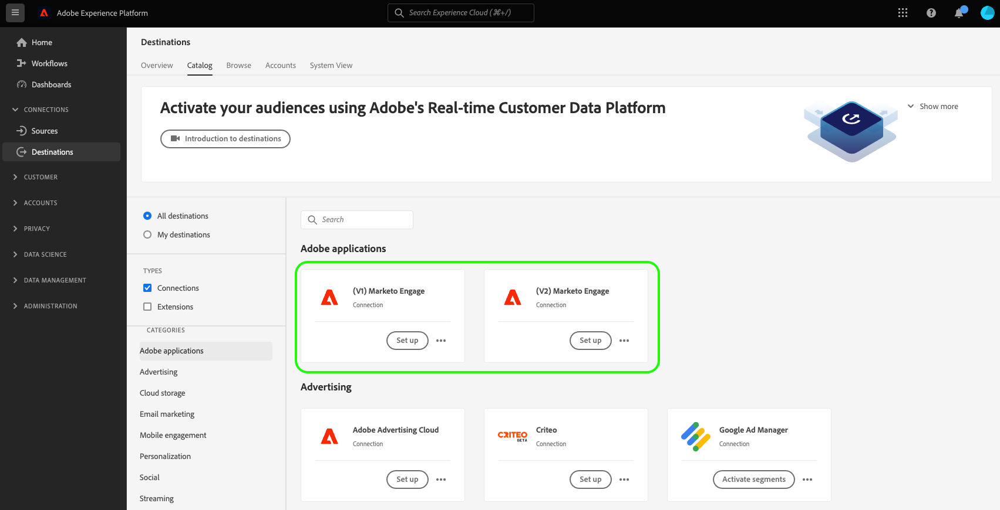

# Marketo Engage目标 {#beta-marketo-engage-destination}

## 目标更改日志 {#changelog}

>[!IMPORTANT]
>
>随着[增强型Marketo V2目标连接器](/help/release-notes/2022/july-2022.md#destinations)的发布，您现在会在目标目录中看到两个Marketo卡。
>* 如果您已经将数据激活到&#x200B;**[!UICONTROL Marketo V1]**&#x200B;目标：请在2023年2月之前创建到&#x200B;**[!UICONTROL Marketo V2]**&#x200B;目标的新数据流并删除到&#x200B;**[!UICONTROL Marketo V1]**&#x200B;目标的现有数据流。 自该日期起，将删除&#x200B;**[!UICONTROL Marketo V1]**&#x200B;目标卡。
>* 如果您尚未创建任何到&#x200B;**[!UICONTROL Marketo V1]**&#x200B;目标的数据流，请使用新的&#x200B;**[!UICONTROL Marketo V2]**&#x200B;卡连接到并将数据导出到Marketo。

Marketo V2目标中的改进包括：

* 在Marketo V1的激活工作流的&#x200B;**[!UICONTROL 计划区段]**&#x200B;步骤中，您需要手动添加&#x200B;**映射ID**&#x200B;以成功将数据导出到Marketo。 Marketo V2中不再需要此手动步骤。
* 在激活工作流的&#x200B;**[!UICONTROL 映射]**&#x200B;步骤中，在Marketo V1中，您只能将XDM字段映射到Marketo中的三个目标字段：`firstName`、`lastName`和`companyName`。 在Marketo V2版本中，您现在可以将XDM字段映射到Marketo中的更多字段。 有关详细信息，请阅读下面的[支持的属性](#supported-attributes)部分。

## 概述 {#overview}

[!DNL Marketo Engage]是唯一用于营销、广告、分析和商业的端到端客户体验管理(CXM)解决方案。 您可以从自动化和管理活动，从CRM商机管理和客户参与到基于帐户的营销和收入归因。

目标允许营销人员将在Adobe Experience Platform中创建的受众推送到Marketo，并在其中显示为静态列表。

## 支持的身份和属性 {#supported-identities-attributes}

>[!NOTE]
>
>在激活目标工作流的[映射步骤](/help/destinations/ui/activate-segment-streaming-destinations.md#mapping)中，映射身份是&#x200B;*必需的*，映射属性是&#x200B;*可选的*。 从“身份命名空间”选项卡映射电子邮件和/或ECID是最重要的事情，可确保人员在Marketo中匹配。 映射电子邮件可确保最高的匹配率。

### 支持的身份 {#supported-identities}

| 目标身份 | 描述 |
|---|---|
| ECID | 表示ECID的命名空间。 此命名空间还可以由以下别名引用：“Adobe Marketing Cloud ID”、“Adobe Experience Cloud ID”、“Adobe Experience Platform ID”。 有关详细信息，请参阅[ECID](/help/identity-service/features/ecid.md)上的以下文档。 |
| 电子邮件 | 表示电子邮件地址的命名空间。 此类命名空间通常与单个人员关联，因此可用于跨不同渠道识别该人员。 |

{style="table-layout:auto"}

### 支持的属性 {#supported-attributes}

您可以将属性从Experience Platform映射到您的组织在Marketo中有权访问的任何属性。 在Marketo中，您可以使用[Describe API请求](https://developers.marketo.com/rest-api/lead-database/leads/#describe)来检索您的组织有权访问的属性字段。

## 支持的受众 {#supported-audiences}

此部分介绍哪些类型的受众可以导出到此目标。

| 受众来源 | 支持 | 描述 |
|---------|----------|----------|
| [!DNL Segmentation Service] | ✓ | 通过Experience Platform [分段服务](../../../segmentation/home.md)生成的受众。 |
| 自定义上传 | ✓ | 受众[已从CSV文件将](../../../segmentation/ui/audience-portal.md#import-audience)导入Experience Platform。 |

{style="table-layout:auto"}

## 导出类型和频率 {#export-type-frequency}

有关目标导出类型和频率的信息，请参阅下表。

| 项目 | 类型 | 注释 |
---------|----------|---------|
| 导出类型 | **[!UICONTROL 受众导出]** | 您正在导出具有[!DNL Marketo Engage]目标中所用标识符（电子邮件、ECID）的受众的所有成员。 |
| 导出频率 | **[!UICONTROL 正在流式传输]** | 流目标为基于API的“始终运行”连接。 根据受众评估在Experience Platform中更新用户档案后，连接器会立即将更新发送到下游目标平台。 阅读有关[流式目标](/help/destinations/destination-types.md#streaming-destinations)的更多信息。 |

{style="table-layout:auto"}

## 设置目标和激活受众 {#set-up}

>[!IMPORTANT]
> 
>* 若要连接到目标，您需要&#x200B;**[!UICONTROL 查看目标]**&#x200B;和&#x200B;**[!UICONTROL 管理目标]** [访问控制权限](/help/access-control/home.md#permissions)。
>* 若要激活数据，您需要&#x200B;**[!UICONTROL 查看目标]**、**[!UICONTROL 激活目标]**、**[!UICONTROL 查看配置文件]**&#x200B;和&#x200B;**[!UICONTROL 查看区段]** [访问控制权限](/help/access-control/home.md#permissions)。 阅读[访问控制概述](/help/access-control/ui/overview.md)或联系您的产品管理员以获取所需的权限。

有关如何设置目标和激活受众的详细说明，请参阅Marketo文档中的[将Adobe Experience Platform受众推送到Marketo静态列表](https://experienceleague.adobe.com/docs/marketo/using/product-docs/core-marketo-concepts/smart-lists-and-static-lists/static-lists/push-an-adobe-experience-cloud-segment-to-a-marketo-static-list.html?lang=zh-Hans)。

以下视频还演示了配置Marketo目标和激活受众的步骤。

>[!IMPORTANT]
>
>该视频未完全反映当前功能。 有关最新信息，请参阅上面链接的指南。 视频的以下部分已过时：
> 
>* 您应在Experience Platform UI中使用的目标卡是&#x200B;**[!UICONTROL Marketo V2]**。
>* 该视频未在“连接到目标工作流”中显示新的&#x200B;**[!UICONTROL 人员创建]**&#x200B;选择器字段。 要使用该字段，必须在属性映射步骤中同时映射名字和姓氏。
>* 视频中调出的两个限制不再适用。 除了在录制视频时支持的受众成员资格信息之外，您现在可以映射许多其他配置文件属性字段。 您还可以将受众成员导出到Marketo，这些成员尚不存在于Marketo静态列表中，并且会添加到列表中。
>* 在Marketo V1的激活工作流的&#x200B;**[!UICONTROL 计划受众步骤]**&#x200B;中，您需要手动添加&#x200B;**[!UICONTROL 映射ID]**&#x200B;以成功将数据导出到Marketo。 Marketo V2中不再需要此手动步骤。

>[!VIDEO](https://video.tv.adobe.com/v/3440168?quality=12&captions=chi_hans)

## 监视目标 {#monitor-destination}

连接到目标并建立目标数据流后，您可以使用Real-Time CDP中的[监视功能](/help/dataflows/ui/monitor-destinations.md)获取有关在每次数据流运行中激活到目标的配置文件记录的更多信息。

[!DNL Marketo Engage]连接的监视信息包括与每个数据流和数据流运行中激活、排除和失败的身份相关的受众级别信息。 [参阅更多](/help/dataflows/ui/monitor-destinations.md#segment-level-view)关于该功能的信息。

## 数据使用和治理 {#data-usage-governance}

在处理您的数据时，所有[!DNL Adobe Experience Platform]目标都符合数据使用策略。 有关[!DNL Adobe Experience Platform]如何实施数据治理的详细信息，请参阅[数据治理概述](https://experienceleague.adobe.com/docs/experience-platform/data-governance/home.html?lang=zh-Hans)。

