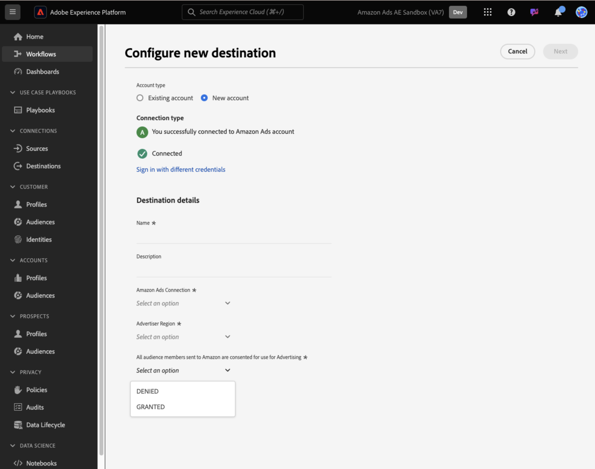
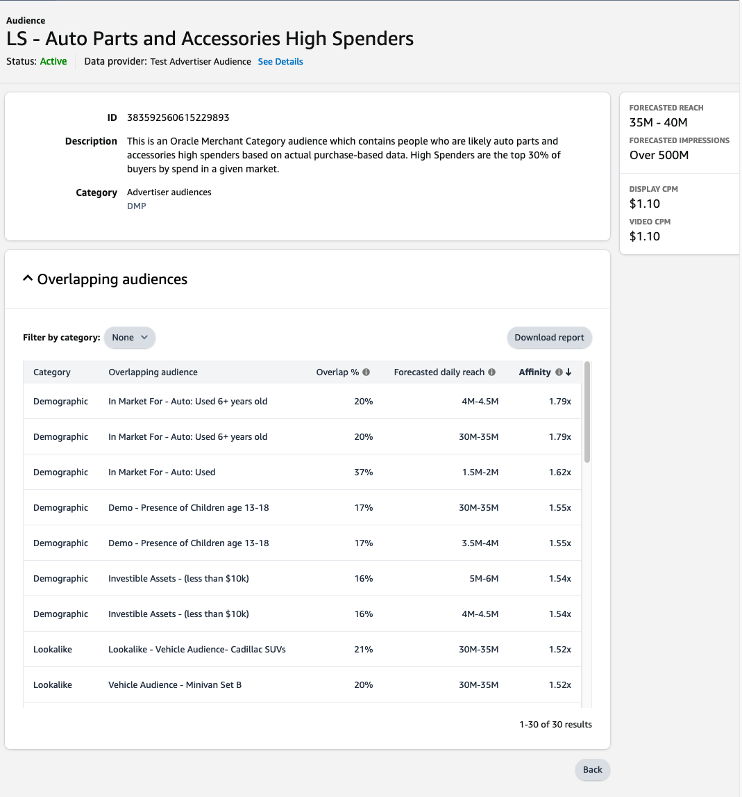

# Amazon Ads连接 {#amazon-ads}

## 概述 {#overview}

[!DNL Amazon Ads]提供一系列选项，帮助您向注册销售商、供应商、图书供应商、Kindle Direct Publishing (KDP)作者、应用程序开发人员和/或代理商实现广告目标。

与Adobe Experience Platform的[!DNL Amazon Ads]集成提供了到[!DNL Amazon Ads]产品的统包集成，包括Amazon DSP (ADSP)和Amazon Marketing Cloud (AMC)。

通过使用Adobe Experience Platform中的[!DNL Amazon Ads]目标，用户能够定义广告商受众，以便在Amazon DSP中进行定位和激活。  此外，用户可以将其数据上传到[!DNL Amazon Marketing Cloud]，以了解按受众、广告商提供的维度、Amazon区段中的成员资格或AMC中可用的其他信号列出的效果。 将广告商受众上传到AMC后，用户可以从[!DNL Amazon Marketing Cloud]中使用Amazon信号修改、增强或附加到受众成员。[!DNL Amazon Marketing Cloud]

AMC将来自Amazon自有资产和运营资产的独特信号整合在一起，横跨各种媒体，包括显示器、视频、流电视、音频和赞助广告。 用户可轻松地将精选区段从Adobe Experience Platform发送到AMC，以增强学习，例如受众的市场内群组、生活方式同类群组以及品牌参与模式。 然后，可以使用增强的区段来优化Amazon DSP中的媒体激活。

>[!IMPORTANT]
>
>此目标连接器和文档页面由&#x200B;*[!DNL Amazon Ads]*&#x200B;团队创建和维护。 如有任何查询或更新请求，请直接通过&#x200B;*`amc-support@amazon.com`.*&#x200B;联系他们

## 用例 {#use-cases}

为了帮助您更好地了解您应如何以及何时使用&#x200B;*[!DNL Amazon Ads]*&#x200B;目标，以下是Adobe Experience Platform客户可以使用此目标解决的示例用例。

### 激活和定位 {#activation-and-targeting}

此与Amazon DSP的集成允许[!DNL Amazon Ads]广告商将广告商CDP受众从Adobe Experience Platform传递到Amazon的DSP，以创建用于广告定位的广告商受众。 可在Amazon DSP中选择正确定位和负确定位（抑制）的受众。

### Analytics and Measurement {#analytics-and-measurement}

此与[!DNL Amazon Marketing Cloud] (AMC)的集成允许[!DNL Amazon Ads]个广告商将CDP区段从Adobe Experience Platform表单传递到AMC。 然后，广告商可以使用[!DNL Amazon Ads]信号加入CDP输入，并以符合隐私规定的格式对媒体影响、受众区段和客户历程等主题进行自定义分析。 例如，广告商可以上传其现有客户的列表来了解汇总的广告促销活动效果，或汇总Amazon上转化事件的统计信息，例如查看产品详细信息页面、将产品添加到购物车或购买产品。

### Advertising优化

与[!DNL Amazon Marketing Cloud] (AMC)的这种集成允许广告商上传他们自己的客户列表，并使用[!DNL Amazon Marketing Cloud] SQL，在为Amazon DSP创建可激活的受众以进行定位之前，定期对受众执行重叠分析、抑制、添加或优化。

## 先决条件 {#prerequisites}

要将[!DNL Amazon Ads]连接与Adobe Experience Platform结合使用，用户必须首先有权访问Amazon DSP广告商帐户或[!DNL Amazon Marketing Cloud]实例。 要配置这些实例，请访问[!DNL Amazon Ads]网站上的以下页面：

* [Amazon DSP入门](https://advertising.amazon.com/solutions/products/amazon-dsp)
* [Amazon Marketing Cloud入门](https://advertising.amazon.com/solutions/products/amazon-marketing-cloud)

## 支持的身份 {#supported-identities}

*[!DNL Amazon Ads]*&#x200B;连接支持激活下表中描述的标识。 了解有关[标识](/help/identity-service//features/namespaces.md)的更多信息。 有关[!DNL Amazon Ads]支持的身份的详细信息，请访问[Amazon DSP支持中心](https://advertising.amazon.com/dsp/help/ss/en/audiences#GA6BC9BW52YFXBNE)。

| 目标身份 | 描述 | 注意事项 |
|---|---|---|
| phone_sha256 | 使用SHA256算法散列的电话号码 | Adobe Experience Platform支持纯文本和SHA256哈希电话号码。 当源字段包含未哈希处理的属性时，请选中&#x200B;**[!UICONTROL 应用转换]**&#x200B;选项，以使[!DNL Experience Platform]在激活时自动对数据进行哈希处理。 |
| email_lc_sha256 | 使用SHA256算法进行哈希处理的电子邮件地址 | Adobe Experience Platform支持纯文本和SHA256哈希电子邮件地址。 当源字段包含未哈希处理的属性时，请选中&#x200B;**[!UICONTROL 应用转换]**&#x200B;选项，以使[!DNL Experience Platform]在激活时自动对数据进行哈希处理。 |

{style="table-layout:auto"}

## 导出类型和频率 {#export-type-frequency}

有关目标导出类型和频率的信息，请参阅下表。

| 项目 | 类型 | 注释 |
---------|----------|---------|
| 导出类型 | **[!UICONTROL 受众导出]** | 您正在导出具有&#x200B;*[!DNL Amazon Ads]*&#x200B;目标中使用的标识符（姓名、电话号码或其他）的受众的所有成员。 |
| 导出频率 | **[!UICONTROL 正在流式传输]** | 流目标为基于API的“始终运行”连接。 根据受众评估在Experience Platform中更新用户档案后，连接器会立即将更新发送到下游目标平台。 阅读有关[流式目标](/help/destinations/destination-types.md#streaming-destinations)的更多信息。 |

{style="table-layout:auto"}

## 连接到目标 {#connect}

>[!IMPORTANT]
> 
>若要连接到目标，您需要&#x200B;**[!UICONTROL 查看目标]**&#x200B;和&#x200B;**[!UICONTROL 管理目标]** [访问控制权限](/help/access-control/home.md#permissions)。 阅读[访问控制概述](/help/access-control/ui/overview.md)或联系您的产品管理员以获取所需的权限。

要连接到此目标，请按照[目标配置教程](../../ui/connect-destination.md)中描述的步骤操作。 在配置目标工作流中，填写下面两个部分中列出的字段。

### 验证目标 {#authenticate}

要验证到目标，请填写必填字段并选择&#x200B;**[!UICONTROL 连接到目标]**。

您将转到[!DNL Amazon Ads]连接界面，在该界面中，您将首先选择要连接的广告商帐户。 建立连接后，系统会通过新连接将您重定向回Adobe Experience Platform，同时还会提供您选择的广告商帐户ID。 请在目标配置屏幕上选择相应的广告商帐户以继续。

### 填写目标详细信息 {#destination-details}

要配置目标的详细信息，请填写下面的必需和可选字段。 UI中字段旁边的星号表示该字段为必填字段。

* **[!UICONTROL 名称]**：将来用于识别此目标的名称。
* **[!UICONTROL 描述]**：可帮助您将来识别此目标的描述。
* **[!UICONTROL Amazon Ads连接]**：选择用于目标的目标[!DNL Amazon Ads]帐户的ID。

>[!NOTE]
>
>保存目标配置后，您将无法更改[!DNL Amazon Ads]广告商ID，即使您通过Amazon帐户重新进行身份验证也是如此。 要使用其他[!DNL Amazon Ads]广告商ID，您必须创建新的目标连接。 已设置与ADSP集成以便能够将受众交付到AMC或其他ADSP帐户的广告商，必须创建新的目标流。

* **[!UICONTROL 广告商地区]**：选择您的广告商所在的适当地区。 有关每个地区支持的市场的详细信息，请访问[Amazon广告文档](https://advertising.amazon.com/API/docs/en-us/info/api-overview#api-endpoints)。

* **[!UICONTROL Amazon广告同意信号]**：确认通过此连接发送的所有数据均已同意将个人数据用于广告目的。 “GRANTED”表示同意Amazon将客户的个人数据用于广告。 允许的值为“GRANTED”和“DENIED”。 任何通过连接发送的记录若具有“DENIED”，则将被拒绝，以便在Amazon Ads中进一步使用。

### 启用警报 {#enable-alerts}

您可以启用警报，以接收有关发送到目标的数据流状态的通知。 从列表中选择警报以订阅接收有关数据流状态的通知。 有关警报的详细信息，请参阅[使用UI订阅目标警报的指南](../../ui/alerts.md)。

完成提供目标连接的详细信息后，选择&#x200B;**[!UICONTROL 下一步]**。

## 激活此目标的受众 {#activate}

>[!IMPORTANT]
> 
>* 若要激活数据，您需要&#x200B;**[!UICONTROL 查看目标]**、**[!UICONTROL 激活目标]**、**[!UICONTROL 查看配置文件]**&#x200B;和&#x200B;**[!UICONTROL 查看区段]** [访问控制权限](/help/access-control/home.md#permissions)。 阅读[访问控制概述](/help/access-control/ui/overview.md)或联系您的产品管理员以获取所需的权限。
>* 要导出&#x200B;*标识*，您需要&#x200B;**[!UICONTROL 查看标识图形]** [访问控制权限](/help/access-control/home.md#permissions)。  {width="100" zoomable="yes"}

有关将受众激活到此目标的说明，请阅读[将配置文件和受众激活到流式受众导出目标](/help/destinations/ui/activate-segment-streaming-destinations.md)。

### 映射属性和身份 {#map}

[!DNL Amazon Ads]连接支持散列电子邮件地址和散列电话号码，以便进行身份匹配。 下面的屏幕快照提供了与[!DNL Amazon Ads]连接兼容的匹配示例：

* 要映射经过哈希处理的电子邮件地址，请选择`Email_LC_SHA256`身份命名空间作为源字段。
* 要映射经过哈希处理的电话号码，请选择`Phone_SHA256`身份命名空间作为源字段。
* 要映射未经过哈希处理的电子邮件地址或电话号码，请选择相应的身份命名空间作为源字段，并选中`Apply Transformation`选项以使Experience Platform在激活时对身份进行哈希处理。
* *从2024年9月版开始*&#x200B;新增功能：Amazon Ads要求您映射包含2个字符ISO格式的`countryCode`值的字段，以便促进身份解析过程（例如：US、GB、MX、CA等）。 没有`countryCode`映射的连接将对标识匹配率产生负面影响。

在[!DNL Amazon Ads]连接器的目标配置中，您只选择一次给定目标字段。  例如，如果提交企业电子邮件，则无法在同一目标配置中映射个人电子邮件。

强烈建议您映射尽可能多的可用字段。 如果只有一个源属性可用，则可以映射单个字段。 [!DNL Amazon Ads]目标使用所有映射字段进行映射，如果提供了更多字段，则产生更高的匹配率。 有关接受的标识符的详细信息，请访问[Amazon Ads散列受众帮助页面](https://advertising.amazon.com/dsp/help/ss/en/audiences#GA6BC9BW52YFXBNE)。

## 导出的数据/验证数据导出 {#exported-data}

上传受众后，您可以使用以下步骤验证受众是否已正确创建和上传：

用于Amazon DSP的&#x200B;**&#x200B;**

导航到您的&#x200B;**[!UICONTROL 广告商ID]** > **[!UICONTROL 受众]** > **[!UICONTROL 广告商受众]**。 如果受众已成功创建并且满足最小受众成员数，您将看到`Active`状态。 有关受众规模和范围的其他详细信息，请参阅Amazon DSP用户界面右侧的预测范围面板。

[!DNL Amazon Marketing Cloud]&#x200B;**的**

在左侧架构浏览器中，在&#x200B;**[!UICONTROL 已上传的广告商]** > **[!UICONTROL aep_audiences]**&#x200B;下找到您的受众。 然后，您可以在AMC SQL编辑器中使用以下子句查询受众：

`select count(user_id) from adobeexperienceplatf_audience_view_000xyz where external_audience_segment_name = '1234567'`

## 数据使用和治理 {#data-usage-governance}

在处理您的数据时，所有[!DNL Adobe Experience Platform]目标都符合数据使用策略。 有关[!DNL Adobe Experience Platform]如何实施数据治理的详细信息，请阅读[数据治理概述](/help/data-governance/home.md)。

## 其他资源 {#additional-resources}

有关其他帮助文档，请访问以下[!DNL Amazon Ads]帮助资源：

* [Amazon DSP帮助中心](https://www.amazon.com/ap/signin?openid.pape.max_auth_age=28800&amp;openid.return_to=https%3A%2F%2Fadvertising.amazon.com%2Fdsp%2Fhelp%2Fss%2Fen%2Faudiences&amp;openid.identity=http%3A%2F%2Fspecs.openid.net%2Fauth%2F2.0%2Fidentifier_select&amp;openid.assoc_handle=amzn_bt_desktop_us&amp;openid.mode=checkid_setup&amp;openid.claimed_id=http%3A%2F%2Fspecs.openid.net%2Fauth%2F2.0%2Fidentifier_select&amp;openid.ns=http%3A%2F%2Fspecs.openid.net%2Fauth%2F2.0)

## Changelog {#changelog}

此部分捕获此目标连接器的功能和重要文档更新。

+++ 查看更改日志

| 发行月份 | 更新类型 | 描述 |
|---|---|---|
| 2025 年 2 月 | 添加了添加&#x200B;**[!UICONTROL Amazon广告同意信号]**&#x200B;以导出数据流的要求，并将目标从Beta版提升为正式可用。 |
| 2024 年 5 月 | 功能和文档更新 | 添加了映射选项，用于将`countryCode`参数导出到Amazon Ads中。 `countryCode` 在 [映射步骤](#map) 中使用，以提高您与亚马逊的身份标识匹配率。 |
| 2024 年 3 月 | 功能和文档更新 | 添加了导出要在[!DNL Amazon Marketing Cloud] (AMC)中使用的受众的选项。 |
| 2023 年 5 月 | 功能和文档更新 | <ul><li>在[目标连接工作流](#destination-details)中添加了对广告商区域选择的支持。</li><li>更新了文档以反映添加了“广告商区域”选择。 有关选择正确的广告商地区的更多信息，请参阅[Amazon文档](https://advertising.amazon.com/API/docs/en-us/info/api-overview#api-endpoints)。</li></ul> |
| 2023 年 3 月 | 初始版本 | 发布了初始目标版本和文档。 |

{style="table-layout:auto"}

+++
