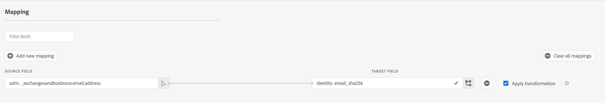

# 标准连接

## 概述 {#overview}

>[!IMPORTANT]
>
>此目标连接器和文档页面由标准创建和维护。 如有任何查询或更新请求，请直接[此处](mailto:criteoTechnicalPartnerships@criteo.com)与Criteo联系。

Criteo 支持值得信赖且具有影响力的广告，在开放的互联网上为每位消费者带来更丰富的体验。Criteo 拥有全球最大的商业数据集和同类最佳 AI，可确保购物历程中的每个接触点都是个性化的，以便在合适的时间向客户推送合适的广告。

## 先决条件 {#prerequisites}

* 您需要在[Criteo管理中心](https://marketing.criteo.com)拥有管理员用户帐户。
* 您将需要您的Criteo广告商ID（如果您没有此ID，请咨询您的Criteo联系人）。
* 如果您要使用[!DNL GUM caller ID]作为标识符，则需要提供[!DNL GUM ID]。

## 限制 {#limitations}

* Criteo仅接受[!DNL SHA-256]散列和纯文本电子邮件（在发送之前转换为[!DNL SHA-256]）。 请勿发送任何PII（个人身份信息，如个人姓名或电话号码）。
* 标准要求客户端至少提供一个标识符。 它将[!DNL GUM ID]作为标识符优先于经过哈希处理的电子邮件，因为它有助于提高匹配率。



## 支持的身份 {#supported-identities}

标准支持激活下表中描述的标识。 了解有关[标识](https://experienceleague.adobe.com/docs/experience-platform/identity/namespaces.html#getting-started)的更多信息。

| 目标身份 | 描述 | 注意事项 |
| --- | --- | --- |
| `email_sha256` | 使用SHA-256算法进行哈希处理的电子邮件地址 | [!DNL Adobe Experience Platform]支持纯文本和SHA-256哈希电子邮件地址。 当源字段包含未哈希处理的属性时，请选中[!UICONTROL Apply transformation]选项，以使Experience Platform在激活时自动对数据进行哈希处理。 |
| `gum_id` | 标准[!DNL GUM] Cookie标识符 | [!DNL GUM IDs]允许客户端在其用户标识系统与Criteo的用户标识([!DNL UID])之间保持通信。 如果标识符类型为`gum_id`，则还必须包含一个附加参数[!DNL GUM Caller ID]。 请联系您的Criteo帐户团队以获取相应的[!DNL GUM Caller ID]或获取有关此[!DNL GUM ID]同步的更多信息（如果需要）。 |

## 支持的受众 {#supported-audiences}

此部分介绍哪些类型的受众可以导出到此目标。

| 受众来源 | 受支持 | 描述 |
|---------|----------|----------|
| [!DNL Segmentation Service] | 是 | 通过Experience Platform [分段服务](../../../segmentation/home.md)生成的受众。 |
| 所有其他受众来源 | 否 | 此类别包括通过[!DNL Segmentation Service]生成的受众之外的所有受众来源。 了解[各种受众源](/help/segmentation/ui/audience-portal.md#customize)。 一些示例包括： <ul><li> 自定义上传受众[从CSV文件导入](../../../segmentation/ui/audience-portal.md#import-audience)到Experience Platform，</li><li> 相似的受众， </li><li> 联合受众， </li><li> 其他Experience Platform应用程序（如[!DNL Adobe Journey Optimizer]）中生成的受众， </li><li> 等等。 </li></ul> |

{style="table-layout:auto"}


按受众数据类型划分的受众支持：

| 受众数据类型 | 受支持 | 描述 | 用例 |
|--------------------|-----------|-------------|-----------|
| [人员受众](/help/segmentation/types/people-audiences.md) | 是 | 根据客户个人资料，允许您针对特定的营销活动人群组进行定位。 | 频繁购买者，购物车放弃者 |
| [帐户受众](/help/segmentation/types/account-audiences.md) | 否 | 针对特定组织内的个人，制定基于帐户的营销策略。 | B2B营销 |
| [潜在客户受众](/help/segmentation/types/prospect-audiences.md) | 否 | 定位尚未成为客户但与目标受众具有共同特征的个人。 | 利用第三方数据发现潜在客户 |
| [数据集导出](/help/catalog/datasets/overview.md) | 否 | 存储在[!DNL Adobe Experience Platform]数据湖中的结构化数据的集合。 | 报告、数据科学工作流 |

{style="table-layout:auto"}


## 导出类型和频率 {#export-type-frequency}

有关目标导出类型和频率的信息，请参阅下表。

| 项目 | 类型 | 注释 |
| --- | --- | --- |
| 导出类型 | 受众导出 | 您正在导出具有[!DNL Criteo]目标中使用的标识符（姓名、电话号码或其他）的受众的所有成员。 |
| 导出频率 | 流传输 | 流目标为基于API的“始终运行”连接。 根据受众评估在Experience Platform中更新用户档案后，连接器会立即将更新发送到下游目标平台。 阅读有关[流式目标](../../destination-types.md#streaming-destinations)的更多信息。 |

## 用例 {#use-cases}

为了帮助您更好地了解如何使用[!DNL Criteo]目标，以下是[!DNL Adobe Experience Platform]客户可以通过[!DNL Criteo]实现的一些目标：

### 用例1：获取流量 {#use-case-1}

利用相关的产品选件和灵活的创意展示您的业务。 有了智能产品推荐，您的广告将自动添加最有可能触发访问和参与的产品。 通过灵活定位，您可以从Criteo的商务数据集或从您自己的潜在客户列表和Adobe CDP区段构建受众。

### 用例2 ：提高网站转化率 {#use-case-2}

当访客离开您的网站时，提醒他们缺少什么，重新定位可通过显示特殊优惠和超级相关优惠来提高转化率的广告，无论他们下一步去哪里。 连接您的Adobe CDP受众，重新吸引现有客户或定位与最忠诚的购物者类似的消费者。

## 连接到标准 {#connect}

>[!IMPORTANT]
>
>若要连接到目标，您需要&#x200B;**[!UICONTROL View Destinations]**&#x200B;和&#x200B;**[!UICONTROL Manage Destinations]** [访问控制权限](/help/access-control/home.md#permissions)。 阅读[访问控制概述](/help/access-control/ui/overview.md)或联系您的产品管理员以获取所需的权限。

要连接到此目标，请按照[目标配置教程](../../ui/connect-destination.md)中描述的步骤操作。

### 验证标准 {#authenticate}

连接的步骤如下：

1. 登录到[!DNL Adobe Experience Platform]并连接到标准目标。

   

1. 您将被重定向到Criteo以授权连接。 您可能需要首先使用标准凭据登录：

   

   

   


### 连接参数 {#connection-parameters}

对目标进行身份验证后，请填写以下连接参数。


| 字段 | 描述 | 必需 |
| --- | --- | --- |
| 名称 | 一个名称，可帮助您将来识别此目标。 您在此处选择的名称将是Criteo Management Center中的[!DNL Audience]名称，无法在以后阶段进行修改。 | 是 |
| 描述 | 可帮助您以后识别此目标的描述。 | 否 |
| 广告商 ID | 您组织的标准广告商ID。 请联系您的标准客户经理以获取此信息。 | 是 |
| 标准[!DNL GUM caller ID] | 您组织的[!DNL GUM Caller ID]。 请联系您的Criteo帐户团队以获取相应的[!DNL GUM Caller ID]或获取有关此[!DNL GUM]同步的更多信息（如果需要）。 | 是，只要将[!DNL GUM ID]作为标识符提供 |

### 启用警报 {#enable-alerts}

您可以启用警报，以接收有关发送到目标的数据流状态的通知。 从列表中选择警报以订阅接收有关数据流状态的通知。 有关警报的详细信息，请参阅[使用UI订阅目标警报的指南](../../ui/alerts.md)。

完成提供目标连接的详细信息后，选择&#x200B;**[!UICONTROL Next]**。

## 激活此目标的受众 {#activate-segments}

>[!IMPORTANT]
>
>* 若要激活数据，您需要&#x200B;**[!UICONTROL View Destinations]**、**[!UICONTROL Activate Destinations]**、**[!UICONTROL View Profiles]**&#x200B;和&#x200B;**[!UICONTROL View Segments]** [访问控制权限](/help/access-control/home.md#permissions)。 阅读[访问控制概述](/help/access-control/ui/overview.md)或联系您的产品管理员以获取所需的权限。
>* 要导出&#x200B;*标识*，您需要&#x200B;**[!UICONTROL View Identity Graph]** [访问控制权限](/help/access-control/home.md#permissions)。<br> {width="100" zoomable="yes"}

有关将受众激活到此目标的说明，请阅读[将配置文件和受众激活到流式受众导出目标](../../ui/activate-segment-streaming-destinations.md)。

## 导出的数据 {#exported-data}

您可以在[Criteo管理中心](https://marketing.criteo.com/audience-manager/dashboard)中看到导出的受众。

[!DNL Criteo]连接收到的添加用户配置文件的请求正文类似于下面的内容：

```json
{
  "data": {
    "type": "ContactlistWithUserAttributesAmendment",
    "attributes": {
      "operation": "add",
      "identifierType": "gum",
      "gumCallerId": "123",
      "identifiers": [
        {
          "identifier": "456",
          "attributes": [
            { "key": "ctoid_GumCaller", "value": "123" },
            { "key": "ctoid_Gum", "value": "456" },
            {
              "key": "ctoid_HashedEmail",
              "value": "98833030dc03751f2b2c1a0017078975fdae951aa6908668b3ec422040f2d4be"
            }
          ]
        }
      ]
    }
  }
}
```

[!DNL Criteo]连接收到的删除用户配置文件的请求正文类似于下面的内容：

```json
{
  "data": {
    "type": "ContactlistWithUserAttributesAmendment",
    "attributes": {
      "operation": "remove",
      "identifierType": "gum",
      "gumCallerId": "123",
      "identifiers": [
        {
          "identifier": "456",
          "attributes": [
            { "key": "ctoid_GumCaller", "value": "123" },
            { "key": "ctoid_Gum", "value": "456" },
            {
              "key": "ctoid_HashedEmail",
              "value": "98833030dc03751f2b2c1a0017078975fdae951aa6908668b3ec422040f2d4be"
            }
          ]
        }
      ]
    }
  }
}
```

## 数据使用和治理 {#data-usage}

在处理您的数据时，所有[!DNL Adobe Experience Platform]目标都符合数据使用策略。 有关[!DNL Adobe Experience Platform]如何实施数据治理的详细信息，请阅读[数据治理概述](https://experienceleague.adobe.com/docs/experience-platform/data-governance/home.html?lang=zh-Hans)。

## 其他资源 {#additional-resources}

* [Criteo帮助中心](https://help.criteo.com/kb/en)
* [Criteo开发人员门户](https://developers.criteo.com)
