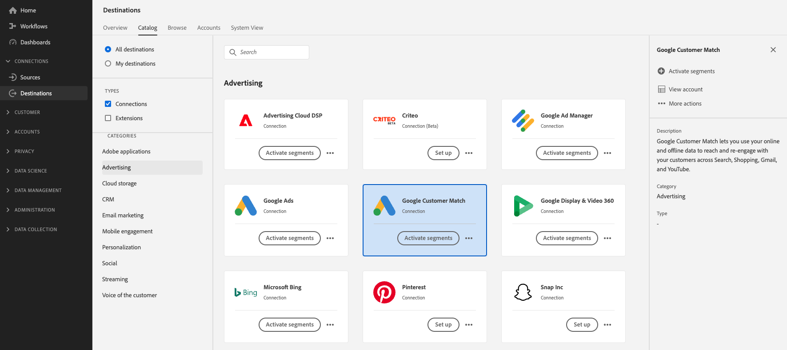

# [!DNL Google Customer Match] 连接

>[!IMPORTANT]
>
> Google将发布对 [Google Ads API](https://developers.google.com/google-ads/api/docs/start)， [客户匹配](https://ads-developers.googleblog.com/2023/10/updates-to-customer-match-conversion.html)，和 [显示和视频360 API](https://developers.google.com/display-video/api/guides/getting-started/overview) ，以支持 [数字市场法案](https://digital-markets-act.ec.europa.eu/index_en) (DMA)在欧盟([欧盟用户同意政策](https://www.google.com/about/company/user-consent-policy/))。 自2024年3月6日起，将开始实施对同意要求的这些更改。
> 
>为了遵循欧盟用户同意政策并继续为欧洲经济区(EEA)中的用户创建受众列表，广告商和合作伙伴必须确保他们在上传受众数据时获得最终用户同意。 作为Google合作伙伴，Adobe会为您提供在欧洲的DMA中遵守这些同意要求的必要工具。
> 
>已购买AdobePrivacy &amp; Security Shield并配置了 [同意政策](../../../data-governance/enforcement/auto-enforcement.md#consent-policy-evaluation) 无需执行任何操作，即可过滤掉未经同意的用户档案。
> 
>未购买AdobePrivacy &amp; Security Shield的客户必须使用 [区段定义](../../../segmentation/home.md#segment-definitions) 中的功能 [区段生成器](../../../segmentation/ui/segment-builder.md) 筛选未经同意的用户档案，以便能够继续使用现有的Real-Time CDP Google目标，而不会出现中断。

[[!DNL Google Customer Match]](https://support.google.com/google-ads/answer/6379332?hl=en) 让您能够在Google自有资产和运营资产中，使用在线和离线数据联系客户并重新吸引客户，例如： [!DNL Search]， [!DNL Shopping]， [!DNL Gmail]、和 [!DNL YouTube].

## 用例 {#use-cases}

为了帮助您更好地了解如何以及何时使用 [!DNL Google Customer Match] 目标，以下是Adobe Experience Platform客户可以使用此功能解决的示例用例。

### 用例#1

一家运动服装品牌希望通过下列渠道触及现有客户 [!DNL Google Search] 和 [!DNL Google Shopping] 根据优惠和项目的过去购买和浏览历史记录对其进行个性化设置。 服装品牌可以从自己的CRM中摄取电子邮件地址以进行Experience Platform，并从自己的离线数据中构建受众。 然后，他们可以将这些受众发送到 [!DNL Google Customer Match] 要跨以下位置使用 [!DNL Search] 和 [!DNL Shopping]，优化他们的广告支出。

### 用例#2

一家知名科技公司发布了一款新手机。 为了推广这种新手机型号，他们正寻求让拥有旧款手机的客户了解手机的新特性和功能。

为了提升版本，客户需要使用电子邮件地址作为标识符，将电子邮件地址从CRM数据库上传到Experience Platform中。 受众是基于拥有旧版手机模型的客户创建的。 然后，受众被发送到 [!DNL Google Customer Match]，以便公司能够定位现有客户、拥有旧款手机的客户以及上网的类似客户 [!DNL YouTube].

## 的数据治理 [!DNL Google Customer Match] 目标 {#data-governance}

Experience Platform中的一些目标对于发送到目标平台或从目标平台接收的数据具有某些规则和义务。 您有责任了解数据的限制和义务，以及如何在Adobe Experience Platform和目标平台中使用该数据。 Adobe Experience Platform提供数据治理工具，帮助您管理其中一些数据使用义务。 [了解详情](../../../data-governance/labels/overview.md) 关于数据治理工具和策略。

## 支持的身份 {#supported-identities}

[!DNL Google Customer Match] 支持激活下表中描述的标识。 了解有关 [身份](/help/identity-service/features/namespaces.md).

| 目标身份 | 描述 | 注意事项 |
|---|---|---|
| GAID | Google广告ID | 当源身份是GAID命名空间时，请选择此目标身份。 |
| IDFA | 广告商的Apple ID | 当源身份是IDFA命名空间时，请选择此目标身份。 |
| phone_sha256_e.164 | E164格式的电话号码，使用SHA256算法进行哈希处理 | Adobe Experience Platform支持纯文本和SHA256哈希电话号码。 请按照 [ID匹配要求](#id-matching-requirements-id-matching-requirements) 部分并使用相应的命名空间分别用于纯文本和经过哈希处理的电话号码。 当源字段包含未哈希处理的属性时，请检查 **[!UICONTROL 应用转换]** 选项，拥有 [!DNL Platform] 在激活时自动散列数据。 |
| email_lc_sha256 | 使用SHA256算法进行哈希处理的电子邮件地址 | Adobe Experience Platform支持纯文本和SHA256哈希电子邮件地址。 请按照 [ID匹配要求](#id-matching-requirements-id-matching-requirements) 部分，并分别将相应的命名空间用于纯文本和经过哈希处理的电子邮件地址。 当源字段包含未哈希处理的属性时，请检查 **[!UICONTROL 应用转换]** 选项，拥有 [!DNL Platform] 在激活时自动散列数据。 |
| user_id | 自定义用户标识 | 当源身份是自定义命名空间时，请选择此目标身份。 |

{style="table-layout:auto"}

## 支持的受众 {#supported-audiences}

此部分介绍哪些类型的受众可以导出到此目标。

| 受众来源 | 受支持 | 描述 |
---------|----------|----------|
| [!DNL Segmentation Service] | ✓ {\f13 } | 通过Experience Platform生成的受众 [分段服务](../../../segmentation/home.md). |
| 自定义上传 | ✓ | 受众 [已导入](../../../segmentation/ui/overview.md#import-audience) 从CSV文件Experience Platform到。 |

{style="table-layout:auto"}

## 导出类型和频率 {#export-type-frequency}

有关目标导出类型和频率的信息，请参阅下表。

| 项目 | 类型 | 注释 |
---------|----------|---------|
| 导出类型 | **[!UICONTROL 受众导出]** | 您正使用 [!DNL Google Customer Match] 目标。 |
| 导出频率 | **[!UICONTROL 流]** | 流目标为基于API的“始终运行”连接。 一旦根据受众评估在Experience Platform中更新了用户档案，连接器就会将更新发送到下游目标平台。 详细了解 [流目标](/help/destinations/destination-types.md#streaming-destinations). |

{style="table-layout:auto"}

## [!DNL Google Customer Match] 帐户先决条件 {#google-account-prerequisites}

在设置之前 [!DNL Google Customer Match] 目标位于Experience Platform中，请确保您已阅读并遵守Google关于使用的政策 [!DNL Customer Match]，在中概述 [Google支持文档](https://support.google.com/google-ads/answer/6299717).

接下来，确保您的 [!DNL Google] 帐户配置用于 [!DNL Standard] 或更高权限级别。 请参阅 [Google Ads文档](https://support.google.com/google-ads/answer/9978556?visit_id=637611563637058259-4176462731&amp;rd=1) 以了解详细信息。

### 允许列表 {#allowlist}

创建 [!DNL Google Customer Match] 目标位置在Experience Platform中，确保您的 [!DNL Google Ads] 帐户符合 [[!DNL Google Customer Match] 策略](https://support.google.com/google-ads/answer/6299717/customer-match-policy).

拥有合规账户的客户由Google自动列入允许列表。

## ID匹配要求 {#id-matching-requirements}

[!DNL Google] 要求不发送明确的个人身份信息(PII)。 因此，受众激活到 [!DNL Google Customer Match] 可以中断连接 *哈希* 标识符，例如电子邮件地址或电话号码。

根据您摄取到Adobe Experience Platform中的ID类型，您必须遵守其相应的要求。

### 电话号码散列要求 {#phone-number-hashing-requirements}

激活中的电话号码有两种方法 [!DNL Google Customer Match]：

* **摄取原始电话号码**：您可以摄取中的原始电话号码 [!DNL E.164] 格式化为 [!DNL Platform]，并且会在激活时自动对其进行哈希处理。 如果选择此选项，请确保始终将原始电话号码摄取到 `Phone_E.164` 命名空间。
* **摄取经过哈希处理的电话号码**：您可以在将其引入之前预散列电话号码 [!DNL Platform]. 如果选择此选项，请确保始终将经过哈希处理的电话号码摄取到 `PHONE_SHA256_E.164` 命名空间。

>[!NOTE]
>
>电话号码已引入 `Phone` 命名空间不能在中激活 [!DNL Google Customer Match].

### 电子邮件哈希处理要求 {#hashing-requirements}

您可以在将电子邮件地址摄取到Adobe Experience Platform之前对其进行哈希处理，或者在Experience Platform中使用清晰的电子邮件地址，并且您可以 [!DNL Platform] 激活时对其进行哈希处理。

有关Google的哈希要求和其他激活限制的详细信息，请参阅Google文档中的以下部分：

* [[!DNL Customer Match] 电子邮件地址、地址或用户ID](https://developers.google.com/google-ads/api/docs/remarketing/audience-types/customer-match#customer_match_with_email_address_address_or_user_id)
* [[!DNL Customer Match] 注意事项](https://developers.google.com/google-ads/api/docs/remarketing/audience-types/customer-match#customer_match_considerations)
* [[!DNL Customer Match] 带有电话号码](https://developers.google.com/google-ads/api/docs/remarketing/audience-types/customer-match#customer_match_with_phone_number)
* [[!DNL Customer Match] 包含移动设备ID](https://developers.google.com/google-ads/api/docs/remarketing/audience-types/customer-match#customer_match_with_mobile_device_ids)

要了解如何在Experience Platform中引入电子邮件地址，请参阅 [批量摄取概述](../../../ingestion/batch-ingestion/overview.md) 和 [流式摄取概述](../../../ingestion/streaming-ingestion/overview.md).

如果选择自己对电子邮件地址进行哈希处理，请确保符合Google的要求，如上面的链接中所述。

### 使用自定义命名空间 {#custom-namespaces}

在使用 `User_ID` 命名空间要将数据发送到Google，请确保使用同步您自己的标识符 [!DNL gTag]. 请参阅 [Google官方文档](https://support.google.com/google-ads/answer/9199250) 以了解详细信息。

<!-- Data from unhashed namespaces is automatically hashed by [!DNL Platform] upon activation.

Attribute source data is not automatically hashed. When your source field contains unhashed attributes, check the **[!UICONTROL Apply transformation]** option, to have [!DNL Platform] automatically hash the data on activation.
 -->

<!-- ## Configure destination - video walkthrough {#video}

The video below demonstrates the steps to configure a [!DNL Google Customer Match] destination and activate audiences. The steps are also laid out sequentially in the next sections.

>[!VIDEO](https://video.tv.adobe.com/v/332599/?quality=12&learn=on&captions=eng) -->

## 视频概述 {#video-overview}

观看以下视频，了解如何获取优势以及如何将数据激活到Google Customer Match。

>[!VIDEO](https://video.tv.adobe.com/v/38180/)

## 连接到目标 {#connect}

>[!IMPORTANT]
> 
>要连接到目标，您需要 **[!UICONTROL 查看目标]** 和 **[!UICONTROL 管理目标]** [访问控制权限](/help/access-control/home.md#permissions). 阅读 [访问控制概述](/help/access-control/ui/overview.md) 或与产品管理员联系以获取所需的权限。

要连接到此目标，请按照 [目标配置教程](../../ui/connect-destination.md).

### 连接参数 {#parameters}

同时 [设置](../../ui/connect-destination.md) 此目标必须提供以下信息：

* **[!UICONTROL 名称]**：提供此目标连接的名称
* **[!UICONTROL 描述]**：提供此目标连接的描述
* **[!UICONTROL 帐户ID]**：您的 [Google Ads客户ID](https://support.google.com/google-ads/answer/1704344?hl=en). ID的格式为xxx-xxx-xxxx。 如果您使用 [!DNL Google Ads Manager Account (My Client Center)]，请不要使用您的Manager帐户ID。 使用 [Google Ads客户ID](https://support.google.com/google-ads/answer/1704344?hl=en) 而是。

>[!IMPORTANT]
>
> * 此 **[!UICONTROL 与PII结合]** 默认情况下会为以下内容选择营销操作 [!DNL Google Customer Match] 目标和无法删除。

### 启用警报 {#enable-alerts}

您可以启用警报，以接收有关发送到目标的数据流状态的通知。 从列表中选择警报以订阅接收有关数据流状态的通知。 有关警报的详细信息，请参阅以下内容中的指南： [使用UI订阅目标警报](../../ui/alerts.md).

完成提供目标连接的详细信息后，选择 **[!UICONTROL 下一个]**.

## 激活此目标的受众 {#activate}

>[!IMPORTANT]
> 
>* 要激活数据，您需要 **[!UICONTROL 查看目标]**， **[!UICONTROL 激活目标]**， **[!UICONTROL 查看配置文件]**、和 **[!UICONTROL 查看区段]** [访问控制权限](/help/access-control/home.md#permissions). 阅读 [访问控制概述](/help/access-control/ui/overview.md) 或与产品管理员联系以获取所需的权限。
>* 要导出 *身份* 对于目标，您需要 **[!UICONTROL 查看身份图]** [访问控制权限](/help/access-control/home.md#permissions).   {width="100" zoomable="yes"}

请参阅 [将受众数据激活到流式受众导出目标](../../ui/activate-segment-streaming-destinations.md) 有关将受众激活到此目标的说明。

在 **[!UICONTROL 区段计划]** 步骤，您必须提供 [!UICONTROL 应用程序ID] 发送时 [!DNL IDFA] 或 [!DNL GAID] 受众到 [!DNL Google Customer Match].

有关如何查找 [!DNL App ID]，请参阅 [Google官方文档](https://developers.google.com/adwords/api/docs/reference/v201809/AdwordsUserListService.CrmBasedUserList#appid) 也可以咨询您的Google代表。

### 映射示例：激活中的受众数据 [!DNL Google Customer Match] {#example-gcm}

这是激活中的受众数据时正确标识映射的示例 [!DNL Google Customer Match].

选择源字段：

* 选择 `Email` namespace作为源标识（如果您使用的电子邮件地址未经过哈希处理）。
* 选择 `Email_LC_SHA256` 作为源标识的命名空间（如果您在数据摄取时对客户电子邮件地址进行哈希处理） [!DNL Platform]，根据的 [!DNL Google Customer Match] [电子邮件哈希处理要求](#hashing-requirements).
* 选择 `PHONE_E.164` namespace作为源标识（如果您的数据由非散列电话号码组成）。 [!DNL Platform] 将散列电话号码以符合 [!DNL Google Customer Match] 要求。
* 选择 `Phone_SHA256_E.164` 作为源标识的命名空间(如果您在数据摄取时将数据散列到 [!DNL Platform]，根据的 [!DNL Facebook] [电话号码散列要求](#phone-number-hashing-requirements).
* 选择 `IDFA` 作为源标识的命名空间（如果您的数据包含） [!DNL Apple] 设备ID。
* 选择 `GAID` 作为源标识的命名空间（如果您的数据包含） [!DNL Android] 设备ID。
* 选择 `Custom` 作为源标识的命名空间（如果您的数据包含其他类型的标识符）。

选择目标字段：

* 选择 `Email_LC_SHA256` 当源命名空间满足以下任一条件时，将命名空间作为目标身份 `Email` 或 `Email_LC_SHA256`.
* 选择 `Phone_SHA256_E.164` 当源命名空间满足以下任一条件时，将命名空间作为目标身份 `PHONE_E.164` 或 `Phone_SHA256_E.164`.
* 选择 `IDFA` 或 `GAID` 当源命名空间满足以下条件时，命名空间作为目标身份 `IDFA` 或 `GAID`.
* 选择 `User_ID` 当源命名空间是自定义命名空间时，将命名空间作为目标身份。

来自未经过哈希处理的命名空间的数据自动进行哈希处理 [!DNL Platform] 激活时。

属性源数据不会自动进行哈希处理。 当源字段包含未哈希处理的属性时，请检查 **[!UICONTROL 应用转换]** 选项，拥有 [!DNL Platform] 在激活时自动散列数据。

## 验证受众激活是否成功 {#verify-activation}

完成激活流程后，切换到 **[!UICONTROL Google Ads]** 帐户。 激活的受众在您的Google帐户中显示为客户列表。 根据您的受众规模，除非有100多个活动用户可提供，否则不会填充某些受众。

将受众映射到两者时 [!DNL IDFA] 和 [!DNL GAID] 移动设备ID、 [!DNL Google Customer Match] 为每个ID映射创建单独的受众。 您的 [!DNL Google Ads] account显示两个不同的区段，一个用于 [!DNL IDFA]，一个用于 [!DNL GAID] 映射。

## 故障排除 {#troubleshooting}

### 400错误请求错误消息 {#bad-request}

配置此目标时，您可能会收到以下错误：

`{"message":"Google Customer Match Error: OperationAccessDenied.ACTION_NOT_PERMITTED","code":"400 BAD_REQUEST"}`

当客户帐户不符合 [先决条件](#google-account-prerequisites). 要解决此问题，请联系Google并确保您的帐户已列入允许列表并配置用于 [!DNL Standard] 或更高权限级别。 请参阅 [Google Ads文档](https://support.google.com/google-ads/answer/9978556?visit_id=637611563637058259-4176462731&amp;rd=1) 以了解详细信息。