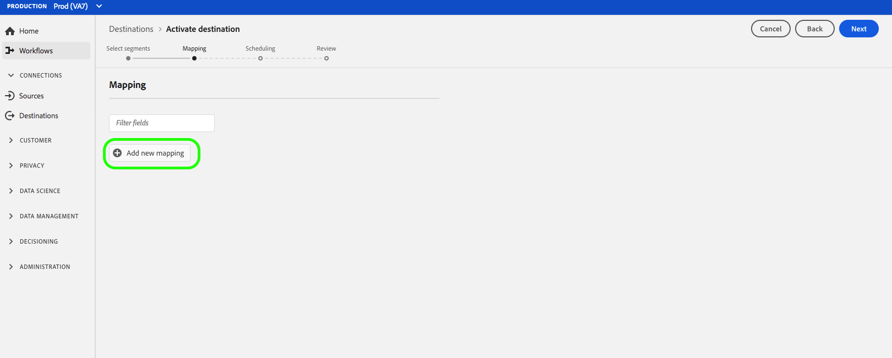

# Google客户匹配目标

## 概述 {#overview}

[Google Customer Match](https://support.google.com/google-ads/answer/6379332?hl=en) 允许您使用线上和线下数据，在Google自有和运营的资产中触及客户并与其重新互动，例如： [!DNL Search]、 [!DNL Shopping]、 [!DNL Gmail]和 [!DNL YouTube]。

## 用例

为了帮助您更好地了解如何以及何时使用目标 [!DNL Google Customer Match] ，以下是实时客户数据平台客户可以通过此功能解决的示例使用案例。

### 用例#1

运动服装品牌希望通过现有客户，并根 [!DNL Google Search] 据优惠 [!DNL Google Shopping] 过去的购买和浏览历史，对其进行个性化设置。 服装品牌可以将电子邮件地址从自己的CRM收集到实时CDP，根据自己的线下数据构建细分，并发送这些细分以 [!DNL Google Customer Match] 用于 [!DNL Search] 整 [!DNL Shopping]个和优化广告支出。

### 用例#2

一位知名科技公司刚刚发布了一部新手机。 为了推广这种新型号的手机，他们希望使拥有旧型号手机的客户对新型号手机的新功能有所了解。

要提升发布版本，他们将电子邮件地址从其CRM数据库上传到实时CDP中，使用电子邮件地址作为标识符。 细分是根据拥有旧款手机型号的客户创建的，并发送 [!DNL Google Customer Match] 给这些客户，以便目标当前客户、拥有旧款手机型号的客户，以及上的类似客户 [!DNL YouTube]。

## 目标的数据管 [!DNL Google Customer Match] 理 {#data-governance}

实时CDP中的目标可能具有特定的规则和义务，用于向目标平台发送或从目标平台接收数据。 您有责任了解数据的限制和义务，以及您如何在Adobe Experience Platform和目标平台使用这些数据。 Adobe Experience Platform提供数据管理工具，帮助您管理其中一些数据使用义务。 [进一步了解](../../..//data-governance/labels/overview.md) “数据治理工具和策略”。

## 导出类型和标识 {#export-type}

**区段导出** -您正在导出包含标识符（名称、电话号码等）的区段(受众)的所有成员。 用于目 [!DNL Google Customer Match] 标。

**身份** -您可以在Google中将原始或散列电子邮件用作客户ID

## [!DNL Google Customer Match] 帐户先决条件 {#google-account-prerequisites}

在实时CDP [!DNL Google Customer Match] 中设置目标之前，请确保您阅读并遵守Google的使用策略，如Google支 [!DNL Customer Match]持文档中 [所述](https://support.google.com/google-ads/answer/6299717)。

### 允许列表 {#allowlist}

>[!NOTE]
>
>必须先将它添加到Google的允许列表中，然后才能以实 [!DNL Google Customer Match] 时CDP设置第一个目标。 在创建目标之前，请确保Google已完成下面描述的允许列表过程。

在实时CDP [!DNL Google Customer Match] 中创建目标之前，您必须联系Google并按照使用客户匹配合作伙伴中 [的允许列表说明，在Google文档中上传您](https://support.google.com/google-ads/answer/7361372?hl=en&amp;ref_topic=6296507) 的数据。

### 电子邮件散列要求 {#hashing-requirements}

<!--

>[!IMPORTANT]
>
> When using mobile device IDs as identifiers, an AppId must be provided in the activation flow. For more information, see step 6 in the [Activate segments](#activate-segments) section of this page.

-->

Google要求不明确发送任何个人可识别信息(PII)。 因此，激活的受众必 [!DNL Google Customer Match] 须锁定散列 *电子邮件* 地址。 您可以选择在将电子邮件地址引入Adobe Experience Platform之前先对它们进行哈希处理，也可以选择在Experience Platform中清晰地处理电子邮件地址，并在激活上使用我们的算法对它们进行哈希处理。

有关Google的散列要求和对激活的其他限制的更多信息，请参见Google文档中的以下部分：

* [[!DNL Customer Match] 具有电子邮件地址、地址或用户ID](https://developers.google.com/adwords/api/docs/guides/remarketing#customer_match_with_email_address_address_or_user_id)
* [[!DNL Customer Match] 注意事项](https://developers.google.com/adwords/api/docs/guides/remarketing#customer_match_considerations)

<!--

Links to be added when activation based on phone number and device IDs becomes available.

* [Customer Match with phone number](https://developers.google.com/adwords/api/docs/guides/remarketing#customer_match_with_phone_number)
* [Customer Match with mobile device IDs](https://developers.google.com/adwords/api/docs/guides/remarketing#customer_match_with_mobile_device_ids)

-->

要了解在Experience Platform中摄取电子邮件地址，请参 [阅批量摄取概述](../../../ingestion/batch-ingestion/overview.md) 和快速 [摄取概述](../../../ingestion/streaming-ingestion/overview.md)。

如果您选择自己对电子邮件地址进行哈希处理，请确保符合Google的要求，如上面的链接所述。

>[!IMPORTANT]
>
>如果您选择不对电子邮件地址进行哈希处理，则在将区段激活到时，实时CDP会为您执行此操 [!DNL Google Customer Match]作。 在激活工 [作流程](#activate-segments) （请参阅步骤5）中，为纯文本电子邮 `Email` 件地址和散列电子邮件地址选 *择如下所示的选* 项 `Email_LC_SHA256` ，并将其用 *于散列电子邮*&#x200B;件地址。

## 连接到目标 {#connect-destination}

在“ **[!UICONTROL 目标]** ”> **[!UICONTROL “目录]**”中，滚动至 **[!UICONTROL 广告]** 类别。 选择 [!DNL Google Customer Match]，然后选择 **[!UICONTROL 配置]**。

>[!NOTE]
>
>如果与此目标的连接已存在，您可以在目标卡 **[!UICONTROL 上看到]** “激活”按钮。 有关激活和配置之 **[!UICONTROL 间差异]** 的详 **[!UICONTROL 细信]**&#x200B;息，请参 [阅目标工](../../ui/destinations-workspace.md#catalog) 作区文档的“目录”部分。

在“帐 **户** ”步骤中，如果之前已设置到目标的连接，请选择“现有 [!DNL Google Customer Match] 帐户 **** ”，然后选择现有连接。 或者，您也可以选 **[!UICONTROL 择“新建帐户]** ”来设置新连接 [!DNL Google Customer Match]。 选 **[!UICONTROL 择连接到目]** 标，以登录并将Adobe Experience Cloud连接到您的 [!DNL Google Ad] 帐户。

>[!NOTE]
>
>实时CDP支持身份验证过程中的凭据验证，如果您向帐户输入了不正确的凭据，则会显示一条错误 [!DNL Google Ad] 消息。 这可确保您没有使用错误的凭据完成工作流。

确认您的凭据并将Adobe Experience Cloud连接到您的Google帐户后，您可以选 **[!UICONTROL 择]** “下一步”以继 **[!UICONTROL 续设置]** 。

在验 **[!UICONTROL 证步]** 骤中，为激活流 [!UICONTROL 输入名] 称和说 [!UICONTROL 明] ，然后向Google填写帐 [!UICONTROL 户ID]ID。

此外，在此步骤中，您还可以选 **[!UICONTROL 择应用于此目标]** 的任何Marketing用例。 市场营销用例指明要将数据导出到目标的目的。 您可以从Adobe定义的营销用例中进行选择，也可以创建自己的营销用例。 有关营销使用案例的更多信息， [请参阅实时CDP中的数据管理](../../../rtcdp/privacy/data-governance-overview.md#destinations) 。 有关各个Adobe定义的营销用例的信息，请参阅数据 [使用策略概述](../../../data-governance/policies/overview.md#core-actions)。

在 **[!UICONTROL 填写上述字]** 段后，选择创建目标。

>[!IMPORTANT]
>
> * 默认 **[!UICONTROL 情况下]** ,“与PII合并”营销用例会为目标选 [!DNL Google Customer Match] 择，并且无法删除。
> * 针对目 [!DNL Google Customer Match] 的地。 **[!UICONTROL 帐户ID]** 是您在Google上的客户客户ID。 ID的格式为xxx-xxx-xxxx。

您的目标现在已创建。 如果要稍后 **[!UICONTROL 激活区段]** ，则可以选择保存并退出 **[!UICONTROL ，也可以选择下一步继续工作]** 流，然后选择要激活的区段。 在任一情况下，请参阅工作 [流的其余部分 [!DNL Google Customer Match]](#activate-segments)，将区段激活到的下一节。

## 将区段激活到 [!DNL Google Customer Match] {#activate-segments}

要将区段激活 [!DNL Google Customer Match]到，请执行以下步骤：

在“ **[!UICONTROL 目标”>]**“浏览” [!DNL Google Customer Match] 中，选择要激活区段的目标。

单击目标的名称。 此操作将带您进入激活流程。

请注意，如果目标激活流已存在，您可以看到当前发送到目标的区段。 选 **[!UICONTROL 择右边栏]** 中的编辑激活，然后按照以下步骤修改激活详细信息。

选择 **[!UICONTROL 激活]**。 在激活 **[!UICONTROL 目标工作流]** ，在选择区 **[!UICONTROL 段页面上]** ，选择要发送的区段 [!DNL Google Customer Match]。

在“标 **[!UICONTROL 识映射]** ”步骤中，选择要作为标识包含在此目标中的属性。 选择 **[!UICONTROL 添加新映射]** ，浏览您的模式，选择电子邮件和／或散列电子邮件，然后将它们映射到相应的目标标识。

**纯文本电子邮件地址作为主要标识**:如果您的模式中以纯文本（未散列）电子邮件地址作为主要标识，请在“源属性 **** ”中选择电子邮件字段，并映射到“目标标识”下右列的“电子邮件 **[!UICONTROL ”字段]**，如下所示：

**哈希电子邮件地址作为主要标识**:如果您的模式中已将电子邮件地址哈希化作主要标识，请在“源属性”中 **[!UICONTROL 选择]** “哈希化电子邮件字段”，并映射到“目标标识”下右列的Email_LC_SHA256字段 **[!UICONTROL ，如下所示]**:

在“区 **[!UICONTROL 段计划]** ”页面上，您可以设置向目标发送数据的开始日期。

在“审 **[!UICONTROL 阅]** ”页面上，您可以看到所选内容的摘要。 选 **[!UICONTROL 择取消]** (Cancel **[!UICONTROL )以分解流，选择]** 返回 **[!UICONTROL (Back)以修改设置，或选择]** 完成(Finish)以确认选择并开始将数据发送到目标。

>[!IMPORTANT]
>
>在此步骤中，实时CDP会检查数据使用策略违规。 下面显示了违反策略的示例。 在解决违规之前，您无法完成区段激活工作流。 有关如何解决违反策略的信息，请参 [阅数据管理](../../../rtcdp/privacy/data-governance-overview.md#enforcement) 文档部分中的策略实施。

如果未检测到任何违反策略的情况，请选 **[!UICONTROL 择“完成]** ”以确认您的选择，并让开始将数据发送到目标。

## 验证区段激活成功 {#verify-activation}

完成激活流后，切换到您的 **[!UICONTROL Google Ads帐户]** 。 激活的区段现在将作为客户列表显示在您的Google帐户中。 请注意，根据您的区段大小，除非有100多个活动用户提供服务，否则某些受众将不会填充。

## 其他资源 {#additional-resources}

* [集成Google客户匹配——视频教程](https://experienceleague.adobe.com/docs/platform-learn/tutorials/rtcdp/integrate-with-google-customer-match.html)