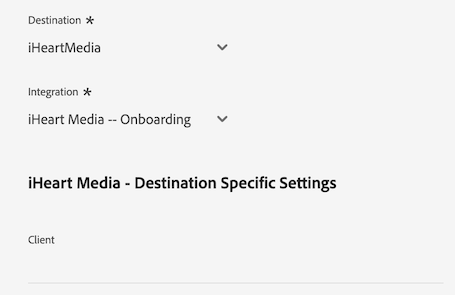
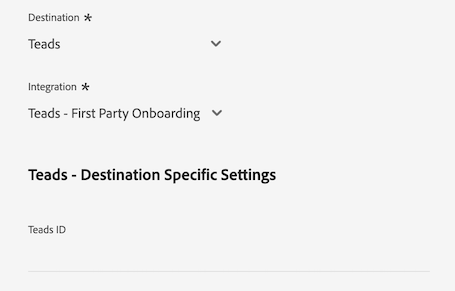

# [!DNL LiveRamp - Distribution]连接

通过[!DNL LiveRamp - Distribution]连接，您可以跨移动设备、Web、显示和连接的电视媒体将受众从Experience Platform激活到高级发布者。

>[!IMPORTANT]
>
>此目标连接器和文档页面由LiveRamp创建和维护。 如有任何查询或更新请求，请直接在[此处](mailto:adobertcdp@liveramp.com)联系LiveRamp。

## 支持的目标 {#supported-destinations}

[!DNL LiveRamp - Distribution]当前支持对以下平台进行受众激活：

* [[!DNL 4C Insights]](#insights)
* [[!DNL Acast]](#acast)
* [[!DNL Nexxen]](#nexxen)
* [[!DNL Ampersand.tv]](#ampersand-tv)
* [[!DNL Captify]](#captify)
* [[!DNL Cardlytics]](#cardlytics)
* [[!DNL Disney (Hulu/ESPN/ABC)]](#disney)
* [[!DNL iHeartMedia]](#iheartmedia)
* [[!DNL Index Exchange]](#index-exchange)
* [[!DNL Magnite CTV Platform]](#magnite)
* [[!DNL Magnite DV+ (Rubicon Project)]](#magnite-dv)
* [[!DNL One Fox]](#fox)
* [[!DNL Pandora]](#pandora)
* [[!DNL Reddit]](#reddit)
* [[!DNL Roku]](#roku)
* [[!DNL Spotify]](#spotify)
* [[!DNL Taboola]](#taboola)
* [[!DNL TargetSpot]](#targetspot)
* [[!DNL Teads]](#teads)
* [[!DNL WB Discovery]](#wb-discovery)

## 用例 {#use-cases}

为了帮助您更好地了解您应如何以及何时使用[!DNL LiveRamp - Distribution]目标，以下是Adobe Experience Platform客户可以使用此目标解决的示例用例。

运动服装retailer的营销团队使用[LiveRamp — 入门](liveramp-onboarding.md)连接将受众从Experience Platform发送到其LiveRamp帐户。

通过[!DNL LiveRamp - Distribution]连接，他们现在可以触发已载入受众对[支持的目标](#supported-destinations)的激活。 然后，它们可以定位移动、打开Web、社交和[!DNL CTV]平台上的用户。

## 将受众载入LiveRamp {#onboarding}

在通过[!DNL LiveRamp - Distribution]连接激活受众之前，请使用[LiveRamp — 入门](liveramp-onboarding.md)连接将Experience Platform受众导出到LiveRamp。

将受众载入LiveRamp后，从[连接到目标](#connect)步骤继续激活工作流，以选择和配置目标目标平台进行数据激活。

## 连接到目标 {#connect}

>[!CONTEXTUALHELP]
>id="platform_destinations_liveramp_distribution_identifier_settings"
>title="标识符设置"
>abstract="选择您的目标支持的标识符。有关每个目标支持的标识符的完整列表，请参阅相关文档。"

>[!IMPORTANT]
> 
>若要连接到目标，您需要&#x200B;**[!UICONTROL View Destinations]**&#x200B;和&#x200B;**[!UICONTROL Manage Destinations]** [访问控制权限](/help/access-control/home.md#permissions)。 阅读[访问控制概述](/help/access-control/ui/overview.md)或联系您的产品管理员以获取所需的权限。

要连接到此目标，请按照[目标配置教程](../../ui/connect-destination.md)中描述的步骤操作。 在配置目标工作流中，填写下面两个部分中列出的字段。

### 向LiveRamp进行身份验证 {#authenticate}

要验证目标，请填写必填字段并选择&#x200B;**[!UICONTROL Connect to destination]**。

* **[!UICONTROL LiveRamp Organization ID]**： LiveRamp帐户的组织ID（在LiveRamp提供的凭据中列为&#x200B;_owner_org_）。
* **[!UICONTROL Password]**：您的LiveRamp帐户密码（在LiveRamp提供的凭据中列为&#x200B;_secret_key_）。
* **[!UICONTROL Token URL]**： LiveRamp令牌URL。
* **[!UICONTROL Username]**：您的LiveRamp帐户用户名（在LiveRamp提供的凭据中列为&#x200B;_account_id_）。

### 配置目标详细信息 {#destination-details}

成功连接到LiveRamp帐户后，输入所需信息以连接到要将受众激活到的目标。

* **[!UICONTROL Name]**：填写目标连接的首选名称。

>[!NOTE]
>
>在命名目标时，Adobe建议遵循以下格式： `LiveRamp - Downstream Destination Name`。 此命名模式可帮助您在目标工作区的[浏览](../../ui/destinations-workspace.md#browse)选项卡中快速识别目标。
> 
>示例：`LiveRamp - Roku`。

* **[!UICONTROL Description]**：输入目标的描述。 使用有助于轻松识别此目标用途的描述。
* **[!UICONTROL Destination]**：使用下拉菜单选择要将受众激活到的目标。 您在此处选择的目标将直接影响您在[目标特定的设置](#destination-settings)屏幕中看到的内容。
* **[!UICONTROL Integration]**：选择要用于目标的集成帐户。
* **[!UICONTROL Identifier]**：选择目标支持的标识符。 目前，下拉菜单中预先填充了所有目标所支持的标识符。

## 目标特定的设置 {#destination-settings}

[支持的每个目标](#supported-destinations)[!DNL LiveRamp - Distribution]都需要您填写特定的配置选项。

有关如何配置每个目标的详细指导，请参阅以下部分。

### [!DNL 4C Insights] {#insights}

>[!CONTEXTUALHELP]
>id="platform_destinations_liveramp_distribution_4cinsights_profile_id"
>title="4C 品牌轮廓 ID"
>abstract="输入与您的 4C 品牌轮廓关联的数值 ID。如果您没有此 ID，请联系您的 4C 客户服务代表。"

要配置目标的详细信息，请填写以下字段。

* **[!UICONTROL 4C Brand Profile ID]**：输入与您的4C品牌配置文件关联的数字ID。 如果您没有此 ID，请联系您的 4C 客户服务代表。

### [!DNL Acast] {#acast}

>[!CONTEXTUALHELP]
>id="platform_destinations_liveramp_distribution_acast_client"
>title="客户名称"
>abstract="您希望向目标合作伙伴显示的广告商帐户名称。使用您的公司名称。请勿使用空格或特殊字符。"

要配置目标的详细信息，请填写以下字段。

* **[!UICONTROL Client name]**：您希望向目标合作伙伴显示的广告商帐户名称。 使用您的公司名称。请勿使用空格或特殊字符。

### [!DNL Ampersand.tv] {#ampersand-tv}

>[!CONTEXTUALHELP]
>id="platform_destinations_liveramp_distribution_ampersand_company_name"
>title="您的公司名称"
>abstract="您希望向目标合作伙伴显示的公司名称。请勿使用空格或特殊字符。"

要配置目标的详细信息，请填写以下字段。

* **[!UICONTROL Your Company Name]**：您希望向目标合作伙伴显示的公司名称。 请勿使用空格或特殊字符。

### [!DNL Captify] {#captify}

>[!CONTEXTUALHELP]
>id="platform_destinations_liveramp_distribution_captify_client"
>title="客户名称"
>abstract="您希望向目标合作伙伴显示的广告商帐户名称。使用您的公司名称。请勿使用空格或特殊字符。"

要配置目标的详细信息，请填写以下字段。

* **[!UICONTROL Client name]**：您希望向目标合作伙伴显示的广告商帐户名称。 使用您的公司名称。请勿使用空格或特殊字符。

### [!DNL Cardlytics] {#cardlytics}

>[!CONTEXTUALHELP]
>id="platform_destinations_liveramp_distribution_cardlytics_client"
>title="客户名称"
>abstract="您希望向目标合作伙伴显示的广告商帐户名称。使用您的公司名称。请勿使用空格或特殊字符。"

要配置目标的详细信息，请填写以下字段。

* **[!UICONTROL Client name]**：您希望向目标合作伙伴显示的广告商帐户名称。 使用您的公司名称。请勿使用空格或特殊字符。

### [!DNL Disney (Hulu/ESPN/ABC)] {#disney}

>[!CONTEXTUALHELP]
>id="platform_destinations_liveramp_distribution_agreement"
>title="广告商数据目标条款协议"
>abstract="键入 `I AGREE` 以确认收到并同意迪士尼广告商数据条款。"

<!-- >additional-url="<https://www.disneyadvertising.com/ADVERTISER-DATA-DESTINATION-TERMS/>" text="Read the agreement" -->

>[!CONTEXTUALHELP]
>id="platform_destinations_liveramp_distribution_disney_client"
>title="客户名称"
>abstract="您希望向目标合作伙伴显示的广告商帐户名称。使用您的公司名称。请勿使用空格或特殊字符。"

>[!CONTEXTUALHELP]
>id="platform_destinations_liveramp_distribution_disney_email"
>title="您的电子邮件地址"
>abstract="输入与个人关联的电子邮件地址。该电子邮件地址用作广告商数据条款协议的签名。如果需要，还将使用此电子邮件地址与您联系。"

要配置目标的详细信息，请填写以下字段。

* **[!UICONTROL Advertiser data destination terms agreement]**：键入`I AGREE`以确认对迪士尼广告商数据条款的确认和同意。
* **[!UICONTROL Client name]**：输入您希望向目标合作伙伴显示的公司名称。
* **[!UICONTROL Email address]**：输入与个人关联的电子邮件地址。 此电子邮件地址用作广告商数据条款协议的签名。

### [!DNL iHeartMedia] {#iheartmedia}

>[!CONTEXTUALHELP]
>id="platform_destinations_liveramp_distribution_iheartmedia_client"
>title="客户名称"
>abstract="您希望向目标合作伙伴显示的广告商帐户名称。使用您的公司名称。请勿使用空格或特殊字符。"

要配置目标的详细信息，请填写以下字段。

* **[!UICONTROL Client Name]**：您希望向目标合作伙伴显示的广告商帐户名称。 使用您的公司名称。请勿使用空格或特殊字符。

### [!DNL Index Exchange] {#index-exchange}

>[!CONTEXTUALHELP]
>id="platform_destinations_liveramp_distribution_index_advertiseraccountname"
>title="帐户名称"
>abstract="您的 Index Exchange 客户帐户名称。请勿使用空格或特殊字符。"

要配置目标的详细信息，请填写以下字段。

* **[!UICONTROL Account Name]**：您的Index Exchange客户端帐户名称。 请勿使用空格或特殊字符。

### [!DNL Magnite CTV Platform] {#magnite}

>[!CONTEXTUALHELP]
>id="platform_destinations_liveramp_distribution_magnitectv_client"
>title="客户"
>abstract="您希望向目标合作伙伴显示的客户名称。使用您的公司名称。请勿使用空格或特殊字符。"

要配置目标的详细信息，请填写以下字段。

* **[!UICONTROL Client]**：您希望向目标合作伙伴显示的客户端名称。 使用您的公司名称。请勿使用空格或特殊字符。

### [!DNL Magnite DV+ (Rubicon Project)] {#magnite-dv}

>[!CONTEXTUALHELP]
>id="platform_destinations_liveramp_distribution_magnitedv+_partnerid"
>title="合作伙伴 ID"
>abstract="与拥有区段/数据的发布者关联的 Rubicon Project 合作伙伴 ID。如果不确定您应使用的值，请联系您的 Rubicon Project 帐户代表。"

>[!CONTEXTUALHELP]
>id="platform_destinations_liveramp_distribution_magnitedv+_seatid"
>title="座位 ID"
>abstract="由您的 Magnite 帐户经理提供的 Magnite DV+ 座位 ID"

要配置目标的详细信息，请填写以下字段。

* **[!UICONTROL Partner ID]**：与拥有区段/数据的发布者关联的Rubicon项目合作伙伴ID。 如果不确定您应使用的值，请联系您的 Rubicon Project 帐户代表。
* **[!UICONTROL Seat ID]**： Magnite客户经理提供的Magnite DV+名额ID

### [!DNL Nexxen (formerly known as [!DNL Amobee])] {#nexxen}

>[!CONTEXTUALHELP]
>id="platform_destinations_liveramp_distribution_nexxen_ratetype"
>title="费率类型"
>abstract="费率类型表示数据用量的计费方式。所有 0.00 美元的费率应为固定费率。如果您不确定要使用哪种费率类型，请与您的 Nexxen 代表进行确认。"

>[!CONTEXTUALHELP]
>id="platform_destinations_liveramp_distribution_nexxen_marketid"
>title="市场 ID"
>abstract="输入应在其中创建 Nexxen 数据合同的数值市场 ID。如果您在 Nexxen Platform 中跨每个市场进行“AlwaysOn”联合，请输入 -1。"

>[!CONTEXTUALHELP]
>id="platform_destinations_liveramp_distribution_nexxen_advertiserid"
>title="广告商 ID"
>abstract="如果要在 Nexxen Platform 中将数据发送到单个广告商，请输入数值 Amobee 广告商 ID。如果要将数据提供给市场中的所有广告商，或者如果这些区段为“AlwaysOn”，请输入 -1。"

>[!CONTEXTUALHELP]
>id="platform_destinations_liveramp_distribution_nexxen_contactemail"
>title="联系电子邮件"
>abstract="输入 Nexxen 应该用于发送数据合同详细信息的电子邮件地址。这很可能是您自己的电子邮件地址，但也可以是电子邮件别名。对于多个收件人，请用逗号分隔（`email1@domain.com`,`email2@domain.com`, 等）。"

要配置目标的详细信息，请填写以下字段。

* **[!UICONTROL Rate Type]**：费率类型表示数据使用应计费的方式。 所有 0.00 美元的费率应为固定费率。如果您不确定要使用哪种费率类型，请与您的 Nexxen 代表进行确认。
* **[!UICONTROL Market ID]**：输入应在其中创建Nexen数据协定的数字市场ID。 如果您在 Nexxen Platform 中跨每个市场进行“AlwaysOn”联合，请输入 -1。
* **[!UICONTROL Advertiser ID]**：如果您要向Nexen平台中的单个广告商发送数据，请输入数字Nexen广告商ID。 如果要使数据可用于市场中的所有广告商，或者如果这些区段为“AlwaysOn”，请输入–1。
* **[!UICONTROL Contact Email]**：输入Nexen用于发送数据合同详细信息的电子邮件地址。 这很可能是您自己的电子邮件地址，但也可以是电子邮件别名。对于多个收件人，请使用逗号(`email1@domain.com`， `email2@domain.com`)分隔。

### [!DNL One Fox] {#fox}

>[!CONTEXTUALHELP]
>id="platform_destinations_liveramp_distribution_fox_client"
>title="客户"
>abstract="您希望向合作伙伴显示的公司/分发帐户的名称。如果不确定要使用哪个名称，请联系您的合作伙伴帐户代表。请勿使用空格或特殊字符。"

要配置目标的详细信息，请填写以下字段。

* **[!UICONTROL Client]**：您希望向合作伙伴显示的公司/分发帐户的名称。 默认使用您的公司名称。 如果不确定要使用哪个名称，请联系您的合作伙伴帐户代表。请勿使用空格或特殊字符。

### [!DNL Pandora] {#pandora}

>[!CONTEXTUALHELP]
>id="platform_destinations_liveramp_distribution_pandora_account_name"
>title="帐户名称"
>abstract="Pandora 帐户的名称。如果您不确定您的帐户名称是什么，请联系您的 Pandora 客户代表。请勿使用空格或特殊字符。"

要配置目标的详细信息，请填写以下字段。

* **[!UICONTROL Account name]**：您的Pandora帐户的名称。 如果您不确定您的帐户名称是什么，请联系您的 Pandora 客户代表。请勿使用空格或特殊字符。

### [!DNL Reddit] {#reddit}

>[!CONTEXTUALHELP]
>id="platform_destinations_liveramp_distribution_reddit_advertiser_id"
>title="Reddit 广告商 ID"
>abstract="您的 Reddit 广告商 ID。必须以“t2_”或“a2_”开头。如果您不知道自己的广告商 ID，请联系您的 Reddit 代表。"

>[!CONTEXTUALHELP]
>id="platform_destinations_liveramp_distribution_reddit_advertiser_name"
>title="Reddit 广告商名称"
>abstract="您的 Reddit 广告商名称。请勿使用空格或特殊字符。"

要配置目标的详细信息，请填写以下字段。

* **[!UICONTROL Reddit advertiser ID]**：您的Reddit广告商ID。 必须以“t2_”或“a2_”开头。如果您不知道自己的广告商 ID，请联系您的 Reddit 代表。
* **[!UICONTROL Reddit advertiser name]**：您的Reddit广告商名称。 请勿使用空格或特殊字符。

### [!DNL Roku] {#roku}

>[!CONTEXTUALHELP]
>id="platform_destinations_liveramp_distribution_roku_email"
>title="Roku 帐户电子邮件地址"
>abstract="输入与您的 Roku 帐户关联的电子邮件地址。"

>[!CONTEXTUALHELP]
>id="platform_destinations_liveramp_distribution_roku_representative_email"
>title="Roku 帐户代表电子邮件地址"
>abstract="输入您的 Roku 帐户代表的电子邮件地址。该地址用于发送分类更新。要输入多个地址，请用逗号分隔它们。"

要配置目标的详细信息，请填写以下字段。

* **[!UICONTROL Roku account email address]**：输入与您的Roku帐户关联的电子邮件地址。
* **[!UICONTROL Roku account representative email address]**：输入您的Roku客户代表的电子邮件地址。 要输入多个地址，请用逗号分隔它们。

### [!DNL Spotify] {#spotify}

>[!CONTEXTUALHELP]
>id="platform_destinations_liveramp_distribution_spotify_client"
>title="客户名称"
>abstract="您希望向目标合作伙伴显示的广告商帐户名称。使用您的公司名称。请勿使用空格或特殊字符。"

要配置目标的详细信息，请填写以下字段。

* **[!UICONTROL Client name]**：您希望向目标合作伙伴显示的广告商帐户名称。 使用您的公司名称。请勿使用空格或特殊字符。

### [!DNL Taboola] {#taboola}

>[!CONTEXTUALHELP]
>id="platform_destinations_liveramp_distribution_taboola_rep_email"
>title="帐户经理电子邮件地址"
>abstract="您的 Taboola 帐户经理的电子邮件地址。"

>[!CONTEXTUALHELP]
>id="platform_destinations_liveramp_distribution_taboola_seg_type"
>title="区段类型"
>abstract="区段类型。目前仅支持第一方区段。"

要配置目标的详细信息，请填写以下字段。

* **[!UICONTROL Account manager email address]**：您的Taboola客户经理的电子邮件地址。
* **[!UICONTROL Segment type]**：区段类型。 目前仅支持第一方区段。

### [!DNL TargetSpot] {#targetspot}

>[!CONTEXTUALHELP]
>id="platform_destinations_liveramp_distribution_targetspot_client"
>title="客户名称"
>abstract="您希望向目标合作伙伴显示的广告商帐户名称。使用您的公司名称。请勿使用空格或特殊字符。"

要配置目标的详细信息，请填写以下字段。

* **[!UICONTROL Client name]**：您希望向目标合作伙伴显示的广告商帐户名称。 使用您的公司名称。请勿使用空格或特殊字符。

### [!DNL Teads] {#teads}

>[!CONTEXTUALHELP]
>id="platform_destinations_liveramp_distribution_teads_teadsid"
>title="Teads ID"
>abstract="您的 Teads ID"

要配置目标的详细信息，请填写以下字段。

* **[!UICONTROL Teads ID]**：您的团队ID

### [!DNL WB Discovery] {#wb-discovery}

>[!CONTEXTUALHELP]
>id="platform_destinations_liveramp_distribution_wb_client"
>title="客户名称"
>abstract="您希望向目标合作伙伴显示的广告商帐户名称。使用您的公司名称。请勿使用空格或特殊字符。"

要配置目标的详细信息，请填写以下字段。

* **[!UICONTROL Client name]**：您希望向目标合作伙伴显示的广告商帐户名称。 使用您的公司名称。请勿使用空格或特殊字符。

### 启用警报 {#enable-alerts}

您可以启用警报，以接收有关发送到目标的数据流状态的通知。 要接收有关数据流状态的通知，请从列表中选择一个警报。 有关警报的详细信息，请阅读有关使用UI订阅目标警报[的指南](../../ui/alerts.md)。

完成提供目标连接的详细信息后，选择&#x200B;**[!UICONTROL Next]**。

## 激活此目标的受众 {#activate}

>[!IMPORTANT]
> 
>若要激活数据，您需要&#x200B;**[!UICONTROL View Destinations]**、**[!UICONTROL Activate Destinations]**、**[!UICONTROL View Profiles]**&#x200B;和&#x200B;**[!UICONTROL View Segments]** [访问控制权限](/help/access-control/home.md#permissions)。 阅读[访问控制概述](/help/access-control/ui/overview.md)或联系您的产品管理员以获取所需的权限。

[!DNL LiveRamp - Distribution]连接激活已通过[LiveRamp — 载入](liveramp-onboarding.md)连接载入到您的LiveRamp帐户的受众。

要成功激活您的受众，您必须选择您之前已&#x200B;**载入**&#x200B;到LiveRamp的[相同受众](liveramp-onboarding.md)。

>[!IMPORTANT]
>
>选择之前未通过[LiveRamp — 载入](liveramp-onboarding.md)连接载入的受众，不会触发新受众的载入。

## 导出的数据/验证数据导出 {#exported-data}

要验证和监控受众的激活情况，请登录到您的LiveRamp帐户并检查激活指标。

如果您对Audience Activation存有任何疑问，请联系您的LiveRamp客户代表。

## 数据使用和治理 {#data-usage-governance}

在处理您的数据时，所有[!DNL Adobe Experience Platform]目标都符合数据使用策略。 有关[!DNL Adobe Experience Platform]如何实施数据治理的详细信息，请阅读[数据治理概述](/help/data-governance/home.md)。

## 其他资源 {#additional-resources}

有关如何配置[!DNL LiveRamp - Onboarding]目标的更多详细信息，请参阅[LiveRamp — 入门文档](liveramp-onboarding.md)。
