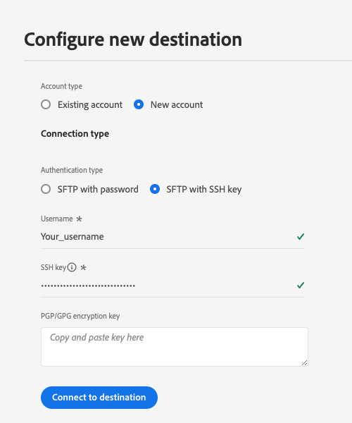

# (Alpha) [!DNL LiveRamp - SFTP] 连接 {#liveramp-destination}

使用LiveRamp连接载入从Adobe Real-time Customer Data Platform到 [!DNL LiveRamp Connect].

>[!IMPORTANT]
>
><p>此目标连接当前处于Alpha阶段，仅对有限的部分客户可用。 功能和文档可能会发生更改。</p>
&gt;<p>此目标连接的最终版本可能需要客户迁移。</p>


## 用例 {#use-cases}

为了帮助您更好地了解应如何以及何时应使用 [!DNL LiveRamp SFTP] 目标中，以下是Adobe Experience Platform客户可通过使用此目标解决的示例用例。

作为营销人员，我希望将受众从Adobe Experience Platform发送到 [!DNL LiveRamp Connect] 以便我可以定位 [!DNL CTV] 平台，使用 [!DNL Ramp ID] 标识符。

## 先决条件 {#prerequisites}

的 [!DNL LiveRamp - SFTP] 连接导出文件时使用 [LiveRamp的SFTP](https://docs.liveramp.com/connect/en/upload-a-file-via-liveramp-s-sftp.html) 存储。

在将数据从Experience Platform发送到 [!DNL LiveRamp SFTP]，您需要 [!DNL LiveRamp] 凭据。 请联系您的 [!DNL LiveRamp] 代表以获取您的凭据（如果您还没有）。

## 支持的身份 {#supported-identities}

LiveRamp SFTP支持激活基于PII的标识符、已知标识符和自定义ID(如官方 [LiveRamp文档](https://docs.liveramp.com/connect/en/identity-and-identifier-terms-and-concepts.html#known-identifiers).

在 [映射步骤](#map) 在激活工作流中，您必须将目标映射定义为自定义属性。

## 导出类型和频度 {#export-type-frequency}

有关目标导出类型和频率的信息，请参阅下表。

| 项目 | 类型 | 注释 |
---------|----------|---------|
| 导出类型 | **[!UICONTROL 区段导出]** | 您要导出区段（受众）的所有成员，以及 [!DNL LiveRamp SFTP] 目标。 |
| 导出频度 | **[!UICONTROL 每日批处理]** | 由于用户档案会根据区段评估在Experience Platform中更新，因此用户档案（身份）会在每天下游到目标平台时更新一次。 有关更多信息 [批量基于文件的目标](/help/destinations/destination-types.md#file-based). |

{style="table-layout:auto"}

## 连接到目标 {#connect}

>[!IMPORTANT]
> 
>要连接到目标，您需要 **[!UICONTROL 管理目标]** [访问控制权限](/help/access-control/home.md#permissions). 阅读 [访问控制概述](/help/access-control/ui/overview.md) 或联系您的产品管理员以获取所需的权限。

要连接到此目标，请按照 [目标配置教程](../../ui/connect-destination.md). 在配置目标工作流中，填写下面两节中列出的字段。

### 对目标进行身份验证 {#authenticate}

要对目标进行身份验证，请填写必填字段并选择 **[!UICONTROL 连接到目标]**.

**使用密码进行SFTP身份验证** {#sftp-password}


* **[!UICONTROL 用户名]**:您的用户名 [!DNL LiveRamp SFTP] 存储位置。
* **[!UICONTROL 密码]**:您的密码 [!DNL LiveRamp SFTP] 存储位置。
* **[!UICONTROL PGP/GPG加密密钥]**:或者，您也可以附加RSA格式的公钥，以向导出的文件添加加密。 查看下图中格式正确的加密密钥示例。 如果提供加密密钥，则还必须提供 **[!UICONTROL 加密子密钥ID]** 在 [目标详细信息](#destination-details) 中。

   

**通过SSH密钥身份验证的SFTP** {#sftp-ssh}



* **[!UICONTROL 用户名]**:您的用户名 [!DNL LiveRamp SFTP] 存储位置。
* **[!UICONTROL SSH密钥]**:私人 [!DNL SSH] 用于登录到 [!DNL LiveRamp SFTP] 存储位置。 私钥必须格式为 [!DNL Base64] — 编码字符串，不得受密码保护。

   * 连接 [!DNL SSH] 键 [!DNL LiveRamp SFTP] 服务器，您必须通过 [!DNL LiveRamp]的技术支持门户，并提供您的公共密钥。 请参阅 [LiveRamp文档](https://docs.liveramp.com/connect/en/upload-a-file-via-liveramp-s-sftp.html#upload-with-an-sftp-client).

* **[!UICONTROL PGP/GPG加密密钥]**:或者，您也可以附加RSA格式的公钥，以向导出的文件添加加密。 如果提供加密密钥，则还必须提供 **[!UICONTROL 加密子密钥ID]** 在 [目标详细信息](#destination-details) 中。 查看下图中格式正确的加密密钥示例。

   

### 填写目标详细信息 {#destination-details}

>[!CONTEXTUALHELP]
>id="platform_destinations_liveramp_subkey"
>title="加密子密钥 ID"
>abstract="用于加密（基于 LiveRamp 公共加密密钥）的子密钥 ID。如果您在身份验证步骤中提供了加密密钥，则此字段是必需的。"
>additional-url="https://docs.liveramp.com/connect/en/encrypting-files-for-uploading.html#downloading-the-current-encryption-key" text="了解如何获取子密钥ID"

要配置目标的详细信息，请填写以下必填和可选字段。 UI中字段旁边的星号表示该字段为必填字段。


* **[!UICONTROL 名称]**:将来用于识别此目标的名称。
* **[!UICONTROL 描述]**:此描述将帮助您在将来确定此目标。
* **[!UICONTROL 文件夹路径]**:路径 [!DNL LiveRamp] `uploads` 将托管导出文件的子文件夹。 的 `uploads` 前缀会自动添加到文件夹路径中。
   * 例如，如果要将文件导出到 `uploads/my_export_folder`，键入 `my_export_folder` 在 **[!UICONTROL 文件夹路径]** 字段。
* **[!UICONTROL 压缩格式]**:选择Experience Platform应用于导出文件的压缩类型。 可用选项包括 **[!UICONTROL GZIP]** 或 **[!UICONTROL 无]**.
* **[!UICONTROL 加密子密钥ID]**:用于加密的子密钥，基于 [!DNL LiveRamp] 公共加密密钥。 如果您在 [身份验证](#authenticate) 中。 请参阅 [!DNL LiveRamp] [加密文档](https://docs.liveramp.com/connect/en/encrypting-files-for-uploading.html#downloading-the-current-encryption-key) 了解如何获取子键ID。

### 启用警报 {#enable-alerts}

您可以启用警报以接收有关目标数据流状态的通知。 从列表中选择警报以订阅接收有关数据流状态的通知。 有关警报的更多信息，请阅读 [使用UI订阅目标警报](../../ui/alerts.md).

完成提供目标连接的详细信息后，请选择 **[!UICONTROL 下一个]**.

## 将区段激活到此目标 {#activate}

>[!IMPORTANT]
> 
>要激活数据，您需要 **[!UICONTROL 管理目标]**, **[!UICONTROL 激活目标]**, **[!UICONTROL 查看配置文件]**&#x200B;和 **[!UICONTROL 查看区段]** [访问控制权限](/help/access-control/home.md#permissions). 阅读 [访问控制概述](/help/access-control/ui/overview.md) 或联系您的产品管理员以获取所需的权限。

读取 [激活受众数据以批量配置文件导出目标](/help/destinations/ui/activate-batch-profile-destinations.md) 有关将受众区段激活到此目标的说明。

### 计划 {#scheduling}

在 [!UICONTROL 计划] 步骤，为每个区段创建导出计划，其中的设置如下所示。

>[!IMPORTANT]
>
>激活到此目标的所有区段都必须使用完全相同的计划进行配置，如下所示。

* **[!UICONTROL 文件导出选项]**: [!UICONTROL 导出完整文件]. [增量文件导出](../../ui/activate-batch-profile-destinations.md#export-incremental-files) 当前不支持 [!DNL LiveRamp] 目标。
* **[!UICONTROL 频率]**: [!UICONTROL 每日]
* 将导出时间设置为 **[!UICONTROL 区段评估后]**. 计划区段导出和 [按需文件导出](../../ui/export-file-now.md) 当前不支持 [!DNL LiveRamp] 目标。
* **[!UICONTROL 日期]**:根据需要选择导出开始和结束时间。


导出的文件名当前不可由用户配置。 导出到 [!DNL LiveRamp SFTP] 目标会根据以下模板自动命名：

`%ORGANIZATION_NAME%_%DESTINATION%_%DESTINATION_INSTANCE_ID%_%DATETIME%`


例如，为名为的组织导出的文件的名称 [!DNL Luma] 可能类似于以下内容：

```json
Luma_LiveRamp_52137231-4a99-442d-804c-39a09ddd005d_20230330_153857.csv
```

### 映射属性和标识 {#map}

在 **[!UICONTROL 映射]** 步骤中，您可以选择要为用户档案导出的属性和标识。

>[!IMPORTANT]
>
>此目标支持每个激活流程激活一个源身份命名空间。 如果您需要导出多个身份命名空间，例如 `Email` 和 `Phone`，您必须 [创建单独的激活流程](../../ui/activate-batch-profile-destinations.md) 每个身份。

在 **[!UICONTROL 映射]** 步骤 **[!UICONTROL 目标字段]** 映射定义导出的CSV文件中列标题的名称。 您可以通过为 **[!UICONTROL 目标字段]**.

1. 在 **[!UICONTROL 映射]** 步骤，选择 **[!UICONTROL 添加新映射]**. 您将在屏幕上看到一个新的映射行。

   

2. 在 **[!UICONTROL 选择源字段]** 窗口，选择 **[!UICONTROL 选择属性]** 类别，然后选择要映射的XDM属性，或选择 **[!UICONTROL 选择身份命名空间]** 类别，然后选择要映射到您的目标的标识。

   

3. 在 **[!UICONTROL 选择目标字段]** 窗口，输入要将所选来源字段映射到的属性名称。 此处定义的属性名称将作为列标题反映在导出的CSV文件中。

   

   您还可以通过在 **[!UICONTROL 目标字段]**.

   

添加所有所需映射后，请选择 **[!UICONTROL 下一个]** 并完成激活工作流。

## 导出的数据/验证数据导出 {#exported-data}

您的数据将导出到 [!DNL LiveRamp SFTP] 存储位置（您配置为CSV文件）。

将文件导出到 [!DNL LiveRamp SFTP] 目标，Platform会为每个文件生成一个CSV文件 [合并策略ID](../../../profile/merge-policies/overview.md).

例如，让我们考虑以下区段：

* 区段A（合并策略1）
* 区段B（合并策略2）
* 区段C（合并策略1）
* 区段D（合并策略1）

Platform会将两个CSV文件导出到 [!DNL LiveRamp SFTP]:

* 一个包含区段A、C和D的CSV文件；
* 一个包含区段B的CSV文件。

导出的CSV文件包含的配置文件在单独的列上具有选定的属性和相应的区段状态，并且属性名称和区段ID作为列标题。

导出文件中包含的配置文件可以与以下区段鉴别状态之一匹配：

* `Active`:该用户档案当前符合区段资格条件。
* `Expired`:该用户档案不再符合区段资格条件，但已在过去符合条件。
* `""`（空字符串）：该用户档案从不符合区段的条件。


例如，导出的CSV文件，其中包含一个 `email` 属性和3个区段可能如下所示：

```csv
email,aa2e3d98-974b-4f8b-9507-59f65b6442df,45d4e762-6e57-4f2f-a3e0-2d1893bcdd7f,7729e537-4e42-418e-be3b-dce5e47aaa1e
abc117@testemailabc.com,active,,
abc111@testemailabc.com,,,active
abc102@testemailabc.com,,,active
abc116@testemailabc.com,active,,
abc107@testemailabc.com,active,expired,active
abc101@testemailabc.com,active,active,
```

由于Platform会为每个CSV文件生成一个 [合并策略ID](../../../profile/merge-policies/overview.md)，它还会为每个合并策略ID生成单独的数据流运行。

这意味着 **[!UICONTROL 已激活身份]** 和 **[!UICONTROL 收到的用户档案]** 量度 [数据流运行](../../../dataflows/ui/monitor-destinations.md#dataflow-runs-for-batch-destinations) 页面会针对使用相同合并策略的每组区段进行聚合，而不是针对每个区段进行显示。

由于为使用相同合并策略的一组区段生成数据流，因此区段名称不会显示在 [监控仪表板](../../../dataflows/ui/monitor-destinations.md#dataflow-runs-for-batch-destinations).


## 将导出的数据上传到LiveRamp {#upload-to-liveramp}

在数据成功导出到 [!DNL LiveRamp - SFTP] 存储，您必须将数据上传到 [!DNL LiveRamp] 平台。

有关如何从 [!DNL LiveRamp - SFTP] 存储到 [!DNL LiveRamp] 受众，请参阅以下文档： [将第一个文件上传到受众时的注意事项](https://docs.liveramp.com/connect/en/considerations-when-uploading-the-first-file-to-an-audience.html#considerations-when-uploading-the-first-file-to-an-audience).

## 数据使用和管理 {#data-usage-governance}

全部 [!DNL Adobe Experience Platform] 目标在处理数据时与数据使用策略相兼容。 有关如何 [!DNL Adobe Experience Platform] 实施数据管理，读取 [数据管理概述](/help/data-governance/home.md).

## 其他资源 {#additional-resources}

有关如何配置LiveRamp SFTP存储的更多详细信息，请参阅 [官方文档](https://docs.liveramp.com/connect/en/upload-a-file-via-liveramp-s-sftp.html).
