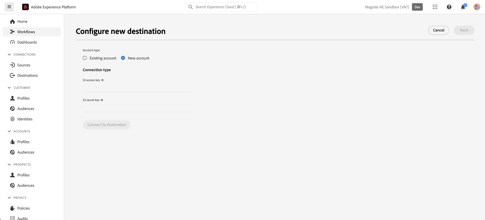

# 菱形：批处理连接 {#magnite-streaming-batch}

## 概述 {#overview}

本文档介绍了Magnite：批量目标并提供示例用例，以帮助您更好地了解如何激活受众并将其导出到其中。

可通过两种方式将Adobe [!DNL Real-Time CDP]受众交付到Magnite流平台 — 它们每天可以交付一次，或者可以实时交付：

1. 如果您每天只需和/或需要交付受众一次，则可以使用Magnite：批量目标，该目标通过每天S3批量文件交付将受众交付到Magnite流。 这些批量受众会在Magnite平台中无限期存储，这与仅存储两天的实时受众不同。

2. 但是，如果您希望或需要更频繁地交付受众，则需要使用[Magnite实时](/help/destinations/catalog/advertising/magnite-streaming.md)目标。 在使用实时目标时，Magnite流将实时接收受众，但Magnite只能暂时在其平台上存储实时受众，并且这些受众将在几天内从系统中删除。 因此，如果要使用Magnite实时目标，您&#x200B;*还*&#x200B;需要使用Magnite：批处理目标 — 您激活到实时目标的每个受众，还需要激活到批处理目标。

回顾：如果您每天只想投放一次Adobe [!DNL Real-Time CDP]受众，则您将只使用Magnite：批处理目标，并且每天将投放一次受众。 如果要实时交付Adobe [!DNL Real-Time CDP]受众，您将同时使用&#x200B;*和* Magnite：批处理目标和Magnite实时目标。 有关更多信息，请联系Magnite：流。

请继续阅读下文，了解有关Magnite：批处理目标、如何连接到该目标以及如何向其激活Adobe [!DNL Real-Time CDP]受众的更多信息。
有关实时目标的详细信息，请参阅[此文档页面](magnite-streaming.md)。

>[!IMPORTANT]
>
>目标连接器和文档页面由[!DNL Magnite]团队创建和维护。 如有任何查询或更新请求，请直接通过`adobe-tech@magnite.com`与他们联系。

## 用例 {#use-cases}

为了帮助您更好地了解应如何以及何时使用Magnite：批处理目标，以下是[!DNL Adobe Experience Platform]客户可以使用此目标解决的示例用例。

### 用例#1 {#use-case-1}

您已在Magnite实时目标上激活受众。

任何通过Magnite实时目标激活的受众还必须使用Magnite：批量目标，因为批量交付的数据旨在替换/保留Magnite流平台中的实时交付数据。

### 用例#2 {#use-case-2}

您只想在Magnite流平台中以批量/每日节奏激活受众。

通过Magnite：批量目标激活的任何受众都将以批量/每日节奏交付，然后可以在Magnite流平台中进行定位。

## 先决条件 {#prerequisites}

要使用[!DNL Magnite]中的[!DNL Adobe Experience Platform]目标，您必须首先拥有Magnite流帐户。 如果您有[!DNL Magnite Streaming]帐户，请联系您的[!DNL Magnite]帐户管理员，以获得访问[!DNL Magnite's]目标的凭据。 如果您没有[!DNL Magnite Streaming]帐户，请联系adobe-tech@magnite.com

## 支持的身份 {#supported-identities}

Magnite：批处理目标可以从Adobe CDP接收&#x200B;*任意*&#x200B;身份源。 目前，此目标具有三个目标标识字段可供您映射到。

>[!NOTE]
>
>*任何*&#x200B;标识源可以映射到任何`magnite_deviceId`目标标识。

| 目标身份 | 描述 | 注意事项 |
|:--------------------------- |:------------------------------------------------------------------------------------------------ |:------------------------------------------------------------------------------------- |
| magnite_deviceId_GAID | GOOGLE ADVERTISING ID | 当源身份是GAID时，选择此目标身份 |
| magnite_deviceId_IDFA | 广告商的Apple ID | 当源身份为IDFA时，选择此目标身份 |
| magnite_deviceId_CUSTOM | 自定义/用户定义的ID | 当源标识不是GAID或IDFA，或者为自定义ID或用户定义的ID时，选择此目标标识 |

{style="table-layout:auto"}

## 支持的受众 {#supported-audiences}

| 受众来源 | 受支持 | 描述 |
|-----------------------------|----------|----------|
| [!DNL Segmentation Service] | 是 | 通过Experience Platform [分段服务](../../../segmentation/home.md)生成的受众。 |
| 所有其他受众来源 | 是 | 此类别包括通过[!DNL Segmentation Service]生成的受众之外的所有受众来源。 了解[各种受众源](/help/segmentation/ui/audience-portal.md#customize)。 一些示例包括： <ul><li> 自定义上传受众[从CSV文件导入](../../../segmentation/ui/audience-portal.md#import-audience)到Experience Platform，</li><li> 相似的受众， </li><li> 联合受众， </li><li> 其他Experience Platform应用程序（如[!DNL Adobe Journey Optimizer]）中生成的受众， </li><li> 等等。 </li></ul> |

{style="table-layout:auto"}

按受众数据类型划分的受众支持：

| 受众数据类型 | 受支持 | 描述 | 用例 |
|--------------------|-----------|-------------|-----------|
| [人员受众](/help/segmentation/types/people-audiences.md) | 是 | 根据客户个人资料，允许您针对特定的营销活动人群组进行定位。 | 频繁购买者，购物车放弃者 |
| [帐户受众](/help/segmentation/types/account-audiences.md) | 否 | 针对特定组织内的个人，制定基于帐户的营销策略。 | B2B营销 |
| [潜在客户受众](/help/segmentation/types/prospect-audiences.md) | 否 | 定位尚未成为客户但与目标受众具有共同特征的个人。 | 利用第三方数据发现潜在客户 |
| [数据集导出](/help/catalog/datasets/overview.md) | 否 | 存储在[!DNL Adobe Experience Platform]数据湖中的结构化数据的集合。 | 报告、数据科学工作流 |

{style="table-layout:auto"}

## 导出类型和频率 {#export-type-frequency}

| 项目 | 类型 | 注释 |
|-----------------------------|----------|----------|
| 导出类型 | 受众导出 | 您正在导出具有Magnite：批处理目标中使用的标识符（姓名、电话号码或其他）的受众的所有成员。 |
| 导出频率 | 批次 | 批量目标以三、六、八、十二或二十四小时的增量将文件导出到下游平台。 阅读有关批处理[基于文件的目标](/help/destinations/destination-types.md)的详细信息。 |

{style="table-layout:auto"}

## 连接到目标 {#connect}

目标使用情况获得批准且Magnite Streaming已共享您的凭据后，请按照以下步骤验证、映射和共享数据。

### 验证目标 {#authenticate}

在Adobe Experience目录中找到Magnite：批处理目标。 单击其他选项按钮(\...)，然后配置目标连接/实例。

如果您已经拥有现有帐户，则可以通过将“帐户类型”选项更改为“现有帐户”来查找该帐户。 否则，您将在下面创建一个帐户：

要创建新帐户并首次向目标验证帐户，请填写所需的“S3访问密钥”和“S3密钥”字段（通过帐户管理员提供给您），然后选择&#x200B;**[!UICONTROL Connect to destination]**

>[!NOTE]
>
>Magnite流的安全策略要求定期轮换S3密钥。 您以后应该会使用新的S3访问和S3密钥更新帐户。 您只需更新帐户本身 — 使用该帐户的目标会自动使用更新的密钥。 如果未能上传新密钥，则会导致数据无法发送到此目标。

### 填写目标详细信息 {#destination-details}

要配置目标的详细信息，请填写下面的必需和可选字段。 UI中字段旁边的星号表示该字段为必填字段。

* **[!UICONTROL Name]**：用于识别此目标连接/实例的名称
未来。
* **[!UICONTROL Description]**：将帮助您识别此内容的描述
未来的目标连接/实例。
* **[!UICONTROL Your company name]**：您的客户/公司名称。 仅受支持的[!DNL Magnite Streaming]客户端可供选择。

>[!NOTE]
>
>公司名称必须是与您使用Magnite配置并在[向目标身份验证](#authenticate)步骤中设置的Amazon S3投放存储段的名称匹配的字符串。 支持的字符包括“a-z”、“A-Z”、“0-9”、“ — ”（短划线）或“_”（下划线）。

>[!NOTE]
>
>如果您计划使用批处理目标发送多个ID类型（GAID、IDFA等），则每个类型都需要一个新的目标连接/实例。 有关更多信息，请与您的Magnite客户代表联系。

然后，您可以通过选择&#x200B;**[!UICONTROL Next]**&#x200B;继续

在标题为“治理策略和强制执行操作（可选）”的下一个屏幕上，您可以选择任意相关的数据治理策略。 一般为Magnite：批处理目标选择“数据导出”。

选择后，或者如果要跳过此可选屏幕，请选择&#x200B;**[!UICONTROL Create]**

### 启用警报 {#enable-alerts}

您可以启用警报，以接收有关发送到目标的数据流状态的通知。 从列表中选择警报以订阅接收有关数据流状态的通知。 有关警报的详细信息，请参阅[使用UI订阅目标警报的指南](../../ui/alerts.md)。

完成提供目标连接的详细信息后，选择&#x200B;**[!UICONTROL Next]**。

### 激活此目标的受众 {#activate}

>[!IMPORTANT]
>
>* 若要激活数据，您需要&#x200B;**[!UICONTROL View Destinations]**、**[!UICONTROL Activate Destinations]**、**[!UICONTROL View Profiles]**&#x200B;和&#x200B;**[!UICONTROL View Segments]** [访问控制权限](/help/access-control/home.md#permissions)。 阅读[访问控制概述](/help/access-control/ui/overview.md)或联系您的产品管理员以获取所需的权限。
>* 要导出&#x200B;*标识*，您需要&#x200B;**[!UICONTROL View Identity Graph]** [访问控制权限](/help/access-control/home.md#permissions)。  {width="100" zoomable="yes"}

有关将受众区段激活到此目标的说明，请阅读[将受众数据激活到批量配置文件导出目标](/help/destinations/ui/activate-batch-profile-destinations.md)。

### 映射属性和身份 {#map}

在&#x200B;**[!UICONTROL Source field]**&#x200B;中，您可以选择设备的任意属性或标识。 在本例中，我们选择了一个名为“DeviceId”的自定义IdentityMap

在&#x200B;**[!UICONTROL Target field]**&#x200B;中：
有关详细信息，请参阅[支持的标识](#supported-identities)。
在此示例中，我们已选择&#x200B;**[!UICONTROL Target field]**： magnite_deviceId_CUSTOM，因为我们的&#x200B;**[!UICONTROL Source field]**&#x200B;被定义为自定义IdentityMap： DeviceID。

>[!NOTE]
>
>如果您计划使用批处理目标发送/映射多个ID类型（GAID、IDFA等），则每个类型都需要一个新的目标连接/实例。 有关更多信息，请与您的Magnite客户代表联系。

在“为每个受众配置文件名和导出计划”屏幕上，您现在必须为每个受众配置开始日期（必需）、结束日期（可选）和映射ID（必需）。

>[!IMPORTANT]
>
> 此目标需要映射ID或“NONE”。
>
> 当受众具有Magnite流先前已知的预先存在的区段ID时，应该提供映射ID。 否则，应使用“NONE”作为映射ID。
>
> 在为每个受众配置文件名时，请通过“自定义文本”字段包含映射ID以添加。 映射ID将附加为： `{previous_filename}\_\[MAPPING_ID\].`如果此受众是Magnite Streaming的新受众，并且您不提供映射ID，则应在“自定义文本”字段中输入“NONE”。 在这种情况下，新文件名应为： `{previous_filename}\_\[NONE\]`。

## 导出的数据/验证数据导出 {#exported-data}

上传受众后，您可以验证受众是否已正确创建和上传。

* Magnite：批处理目标每天将S3文件交付给Magnite流。 投放和引入后，受众/区段预计会显示在Magnite流中，并可应用于交易。 您可以通过查找在[!DNL Adobe Experience Platform]中的激活步骤中共享的区段ID或区段名称来进行确认。

>[!NOTE]
>
>激活/交付到Magnite：批处理目标的受众将&#x200B;*替换*&#x200B;通过Magnite实时目标激活/交付的相同受众。 如果您使用区段名称查找区段，则在Magnite流平台摄取并处理批次之前，可能无法实时找到该区段。

## 数据使用和治理 {#data-usage-governance}

在处理您的数据时，所有[!DNL Adobe Experience Platform]目标都符合数据使用策略。 有关[!DNL Adobe Experience Platform]如何实施数据治理的详细信息，请阅读[数据治理概述](/help/data-governance/home.md)。

## 其他资源 {#additional-resources}

有关其他帮助文档，请访问[Magnite帮助中心](https://help.magnite.com/help)。
