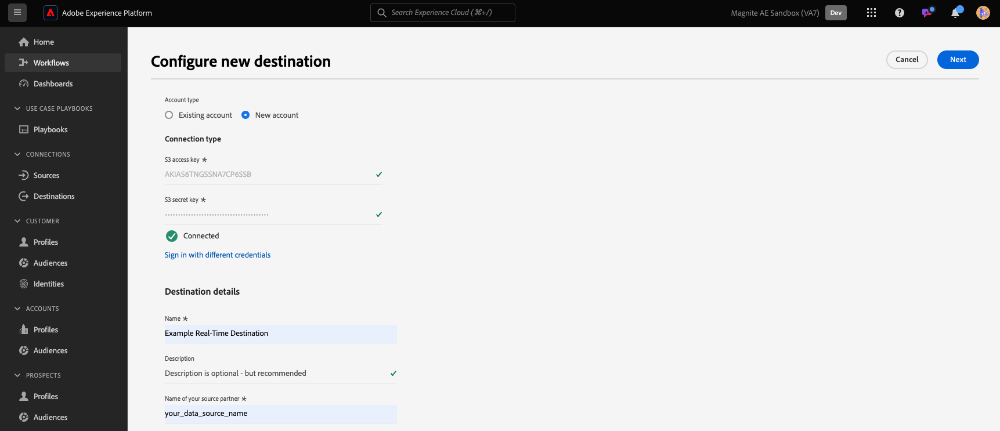
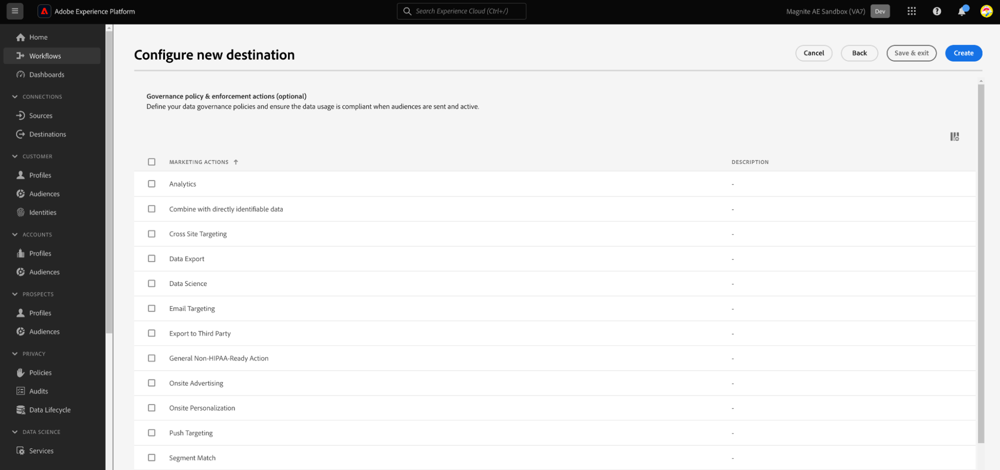

# Magnite：实时目标连接

## 概述 {#overview}

[!DNL Magnite: Real-Time]中的[和](/help/destinations/catalog/advertising/magnite-batch.md)Magnite：批处理[!DNL Adobe Experience Platform]目标可帮助您映射和导出受众，以便在Magnite流平台上定位和激活。

将受众激活到[!DNL Magnite Streaming]平台是一个两步过程，需要您同时使用Magnite： Real-Time和Magnite： Batch目标。

要将受众激活到[!DNL Magnite Streaming]，您必须：

* 激活[!DNL Magnite: Real-Time]目标上的受众，如本页所示。
* 在Magnite：批处理目标上激活相同受众。 [!DNL Magnite: Batch]目标是必需组件。 如果未在[!DNL Magnite Streaming]批处理目标上激活受众，则会导致集成失败，并且不会激活您的受众。

>[!NOTE]
>
>在使用实时目标时，[!DNL Magnite Streaming]将实时接收受众，但Magnite只能暂时在其平台中存储实时受众，并且这些受众将在几天内从系统中删除。 因此，如果您要使用Magnite：实时目标，您&#x200B;*还*&#x200B;需要使用Magnite：批处理目标 — 您激活到实时目标的每个受众，还需要激活到批处理目标。

>[!IMPORTANT]
>
>目标连接器和文档页面由[!DNL Magnite]团队创建和维护。 如有任何查询或更新请求，请直接通过`adobe-tech@magnite.com`与他们联系。

## 用例 {#use-cases}

为了帮助您更好地了解您应如何以及何时使用[!DNL Magnite: Real-Time]目标，以下是[!DNL Adobe Experience Platform]客户可以通过使用此目标解决的示例用例。

### 激活和定位 {#activation-and-targeting}

此与Magnite的集成允许客户将其CDP受众从[!DNL Adobe Experience Platform]传递到Magnite以进行广告定位。 可在Magnite中选择正确定位和负确定位（抑制）的受众。

## 先决条件 {#prerequisites}

若要在[!DNL Magnite]中使用[!DNL Adobe Experience Platform]目标，您必须首先拥有[!DNL Magnite Streaming]帐户。 如果您有[!DNL Magnite Streaming]帐户，请联系您的[!DNL Magnite]帐户管理员，以获得访问[!DNL Magnite's]目标的凭据。
如果您没有[!DNL Magnite Streaming]帐户，请联系adobe-tech@magnite.com

## 支持的身份 {#supported-identities}

[!DNL Magnite: Real-Time]目标支持激活下表中描述的标识。 了解有关[标识](/help/identity-service/features/namespaces.md)的更多信息。

| 目标身份 | 描述 | 注意事项 |
|-------------------|--------------------------------------------------------------------------------------------------|--------------------------------------------------------------------------------------|
| device_id | 设备或身份的唯一标识符。 我们接受任何设备ID和第一方ID，而不管类型如何。 | Magnite支持的身份类型包括但不限于PPUID、GAID、IDFA和电视设备ID。 |

{style="table-layout:auto"}

## 支持的受众 {#supported-audiences}

此部分介绍可将哪种类型的受众导出到此目标。

| 受众来源 | 受支持 | 描述 |
|-----------------------------|----------|----------|
| [!DNL Segmentation Service] | 是 | 通过Experience Platform [分段服务](../../../segmentation/home.md)生成的受众。 |
| 所有其他受众来源 | 是 | 此类别包括通过[!DNL Segmentation Service]生成的受众之外的所有受众来源。 了解[各种受众源](/help/segmentation/ui/audience-portal.md#customize)。 一些示例包括： <ul><li> 自定义上传受众[从CSV文件导入](../../../segmentation/ui/audience-portal.md#import-audience)到Experience Platform，</li><li> 相似的受众， </li><li> 联合受众， </li><li> 其他Experience Platform应用程序（如[!DNL Adobe Journey Optimizer]）中生成的受众， </li><li> 等等。 </li></ul> |

{style="table-layout:auto"}

按受众数据类型划分的受众支持：

| 受众数据类型 | 受支持 | 描述 | 用例 |
|--------------------|-----------|-------------|-----------|
| [人员受众](/help/segmentation/types/people-audiences.md) | 是 | 根据客户个人资料，允许您针对特定的营销活动人群组进行定位。 | 频繁购买者，购物车放弃者 |
| [帐户受众](/help/segmentation/types/account-audiences.md) | 否 | 针对特定组织内的个人，制定基于帐户的营销策略。 | B2B营销 |
| [潜在客户受众](/help/segmentation/types/prospect-audiences.md) | 否 | 定位尚未成为客户但与目标受众具有共同特征的个人。 | 利用第三方数据发现潜在客户 |
| [数据集导出](/help/catalog/datasets/overview.md) | 否 | 存储在[!DNL Adobe Experience Platform]数据湖中的结构化数据的集合。 | 报告、数据科学工作流 |

{style="table-layout:auto"}

## 导出类型和频率 {#export-type-frequency}

有关目标导出类型和频率的信息，请参阅下表。

| 项目 | 类型 | 注释 |
|------------------|---------------------------------|------------------------------------------------------------------------------------------------------------------------------------------------------------------------------------------------------------------------------------------------------------------------------------------------------------------------------------|
| 导出类型 | **[!UICONTROL Segment export]** | 您正在导出区段（受众）的所有成员以及[!DNL Magnite: Real-Time]目标中使用的标识符（姓名、电话号码或其他）。 |
| 导出频率 | **[!UICONTROL Streaming]** | 流目标为基于API的“始终运行”连接。 一旦根据区段评估在Experience Platform中更新了用户档案，连接器就会将更新发送到下游目标平台。 阅读有关[流式目标](/help/destinations/destination-types.md#streaming-destinations)的更多信息。 |

{style="table-layout:auto"}

## 连接到目标 {#connect}

>[!IMPORTANT]
>
>若要连接到目标，您需要&#x200B;**[!UICONTROL View destinations]**&#x200B;和&#x200B;**[!UICONTROL Manage destinations]** [访问控制权限](/help/access-control/home.md#permissions)。 阅读[访问控制概述](/help/access-control/ui/overview.md)或联系您的产品管理员以获取所需的权限。

要连接到此目标，请按照[目标配置教程](../../ui/connect-destination.md)中描述的步骤操作。 在配置目标工作流中，填写下面两个部分中列出的字段。

### 验证目标 {#authenticate}

要验证目标，请填写必填字段并选择&#x200B;**[!UICONTROL Connect to destination]**。

* **[!UICONTROL Username]**： [!DNL Magnite]提供给您的用户名。
* **[!UICONTROL Password]**： [!DNL Magnite]提供给您的密码。

### 填写目标详细信息 {#destination-details}

要配置目标的详细信息，请填写下面的必需和可选字段。 UI中字段旁边的星号表示该字段为必填字段。

* **[!UICONTROL Name]**：将来用于识别此目标的名称。
* **[!UICONTROL Description]**：可帮助您将来识别此目标的描述。
* **[!UICONTROL Your company name]**：您的客户/公司名称。 仅受支持的[!DNL Magnite Streaming]客户端可供选择。

>[!NOTE]
>
>公司名称必须是与您使用Magnite配置并在[向目标身份验证](#authenticate)步骤中设置的Amazon S3投放存储段的名称匹配的字符串。 支持的字符包括“a-z”、“A-Z”、“0-9”、“ — ”（短划线）或“_”（下划线）。

完成后，选择&#x200B;**[!UICONTROL Create]**&#x200B;按钮。

### 启用警报 {#enable-alerts}

您可以启用警报，以接收有关发送到目标的数据流状态的通知。 从列表中选择警报以订阅接收有关数据流状态的通知。 有关警报的详细信息，请参阅[使用UI订阅目标警报的指南](../../ui/alerts.md)。

完成提供目标连接的详细信息后，选择&#x200B;**[!UICONTROL Next]**。

## 激活此目标的受众 {#activate}

>[!IMPORTANT]
>
>* 若要激活数据，您需要&#x200B;**[!UICONTROL View destinations]**、**[!UICONTROL Activate destinations]**、**[!UICONTROL View Profiles]**&#x200B;和&#x200B;**[!UICONTROL View Segments]** [访问控制权限](/help/access-control/home.md#permissions)。 阅读[访问控制概述](/help/access-control/ui/overview.md)或联系您的产品管理员以获取所需的权限。
>* 要导出&#x200B;*标识*，您需要&#x200B;**[!UICONTROL View Identity Graph]** [访问控制权限](/help/access-control/home.md#permissions)。  {width="100" zoomable="yes"}

有关将受众激活到此目标的说明，请阅读[将受众激活到流式目标](/help/destinations/ui/activate-segment-streaming-destinations.md)。

创建目标连接后，您可以进入受众激活流程。 以下部分将介绍如何使用实时目标激活受众。

### 映射属性和身份 {#map}

下一步是将源标识符映射到Magnite device_id标识符。

* 您可以通过选择&#x200B;**[!UICONTROL Add new mapping]**&#x200B;来添加所需数量的映射。

此使用实时目标的示例显示了一行，该行包含映射到Magnite device_id目标字段的通用deviceId源标识符。 当您使用映射时，请选择[!UICONTROL Next]。

请确保将映射ID设置为所有激活的受众，如果没有映射ID，则设置为“无”。

您现在必须为每个受众配置开始日期（必需）、结束日期（可选）和映射ID。

**映射ID**

* 当受众具有Magnite以前已知的预先存在的区段ID时，使用&#x200B;**[!UICONTROL Mapping ID]**&#x200B;字段。

* 要向受众添加&#x200B;**[!UICONTROL Mapping ID]**，请分别选择每个受众行，然后在右侧列中输入数据（请参阅上图）。 如果您不想添加映射ID，请在映射ID字段中输入NONE。

选择&#x200B;**[!UICONTROL Next]**&#x200B;并完成激活流程。

## 导出的数据/验证数据导出 {#exported-data}

上传受众后，您可以使用以下步骤验证受众是否已正确创建和上传：

<!--

* In 95% of cases, audiences will be delivered to Magnite Streaming in under 10 minutes. The actual receipt and processing of the events within Magnite Streaming depends on the shared data volume.

-->

* 摄取后，受众应在几分钟内显示在[!DNL Magnite Streaming]中，并可应用于交易。 您可以通过查找在[!DNL Adobe Experience Platform]中的激活步骤中共享的区段ID来确认这一点。

## 通过[!DNL Magnite: Batch]目标激活相同受众 {#activate-magnite-batch}

使用实时目标与[!DNL Magnite Streaming]共享的受众还需要使用Magnite：批处理目标进行共享。 正确配置后，[!DNL Magnite Streaming] UI中的区段名称将更新，以反映[!DNL Adobe Experience Platform]每日更新中使用的名称。

最后，如果尚未为集成配置批处理目标，请立即通过Magnite：批处理目标文档进行设置。

## 数据使用和治理 {#data-usage-governance}

在处理您的数据时，所有[!DNL Adobe Experience Platform]目标都符合数据使用策略。 有关[!DNL Adobe Experience Platform]如何实施数据治理的详细信息，请阅读[数据治理概述](/help/data-governance/home.md)。

## 其他资源 {#additional-resources}

有关其他帮助文档，请访问[Magnite帮助中心](https://help.magnite.com/help)。
