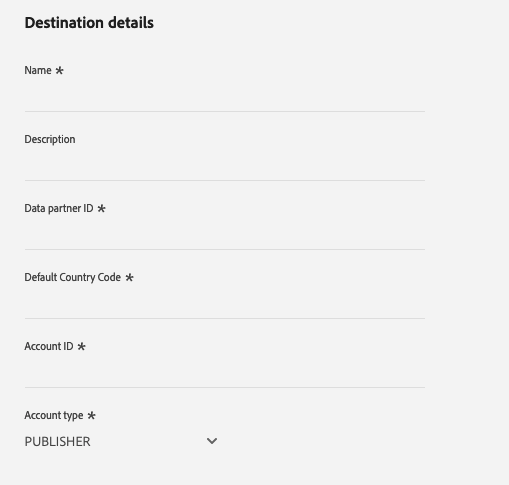

# PubMatic Connect目标 {#pubmatic-connect}

## 概述 {#overview}

使用[!DNL PubMatic Connect]通过提供未来程序化数字营销supply chain来最大化客户价值。 [!DNL PubMatic Connect]将平台技术和专用服务相结合，以改进库存和数据打包和事务的方式。

有两个可用的目标可让您将受众数据发送到PubMatic Connect平台。 它们的功能稍有不同：

1. PubMatic Connect

   在初始激活期间，此目标将在PubMatic平台中自动注册受众，并使用内部Adobe Experience Platform ID进行映射。

2. PubMatic Connect（自定义受众ID映射）

   利用此目标，可选择在激活工作流程期间手动添加映射ID。 当应将数据发送到PubMatic平台中的现有受众时，或者在需要自定义“Source受众ID”时，使用此目标。

>[!IMPORTANT]
>
> 目标连接器和文档页面由[!DNL PubMatic]团队创建和维护。 如有任何查询或更新请求，请直接通过`support@pubmatic.com`与他们联系。

## 用例 {#use-cases}

为了帮助您更好地了解您应如何以及何时使用[!DNL PubMatic Connect]目标，以下是Adobe Experience Platform客户可以使用此目标解决的示例用例。

### 在移动、Web和CTV平台上定位用户 {#targeting}

发布者或数据提供商希望使用大量标识符将受众从Adobe Experience Platform发送到[!DNL PubMatic Connect]，以定位移动、Web和CTV平台上的用户。

## 先决条件 {#prerequisites}

与您的[!DNL PubMatic]客户经理联系，确保您的帐户配置正确并支持载入受众区段。 他们还将确保您拥有使用此目标的所有相关详细信息，并在设置期间为您提供支持。

## 支持的身份 {#supported-identities}

[!DNL PubMatic Connect]支持激活下表中描述的标识。 了解有关[标识](/help/identity-service/features/namespaces.md)的更多信息。

| 目标身份 | 描述 | 注意事项 |
| --------------- | ------------------------ | ------------------------------------------------------------------------------- |
| GAID | GOOGLE ADVERTISING ID | 当源身份是GAID命名空间时，选择GAID目标身份。 |
| IDFA | 广告商的Apple ID | 当源身份是IDFA命名空间时，选择IDFA目标身份。 |
| extern_id | 自定义用户标识 | 当源身份是自定义命名空间时，请选择此目标身份。 |

{style="table-layout:auto"}

## 支持的受众 {#supported-audiences}

此部分介绍可将哪种类型的受众导出到此目标。

| 受众来源 | 受支持 | 描述 |
|---------|----------|----------|
| [!DNL Segmentation Service] | 是 | 通过Experience Platform [分段服务](../../../segmentation/home.md)生成的受众。 |
| 所有其他受众来源 | 否 | 此类别包括通过[!DNL Segmentation Service]生成的受众之外的所有受众来源。 了解[各种受众源](/help/segmentation/ui/audience-portal.md#customize)。 一些示例包括： <ul><li> 自定义上传受众[从CSV文件导入](../../../segmentation/ui/audience-portal.md#import-audience)到Experience Platform，</li><li> 相似的受众， </li><li> 联合受众， </li><li> 在其他Experience Platform应用程序（如Adobe Journey Optimizer）中生成的受众， </li><li> 等等。 </li></ul> |

{style="table-layout:auto"}

按受众数据类型划分的受众支持：

| 受众数据类型 | 受支持 | 描述 | 用例 |
|--------------------|-----------|-------------|-----------|
| [人员受众](/help/segmentation/types/people-audiences.md) | 是 | 根据客户个人资料，允许您针对特定的营销活动人群组进行定位。 | 频繁购买者，购物车放弃者 |
| [帐户受众](/help/segmentation/types/account-audiences.md) | 否 | 针对特定组织内的个人，制定基于帐户的营销策略。 | B2B营销 |
| [潜在客户受众](/help/segmentation/types/prospect-audiences.md) | 否 | 定位尚未成为客户但与目标受众具有共同特征的个人。 | 利用第三方数据发现潜在客户 |
| [数据集导出](/help/catalog/datasets/overview.md) | 否 | 存储在Adobe Experience Platform数据湖中的结构化数据的集合。 | 报告、数据科学工作流 |

{style="table-layout:auto"}

## 导出类型和频率 {#export-type-frequency}

有关目标导出类型和频率的信息，请参阅下表。

| 项目 | 类型 | 注释 |
| ---------------- | ------------------------------- | ---------------------------------------------------------------------------------------------------------------------------------------------------------------------------------------------------------------------------------------------------------------------------------------------------------------------------- |
| 导出类型 | **[!UICONTROL Segment export]** | 您正在导出具有PubMatic Connect目标中使用的标识符（名称、电话号码或其他）的区段（受众）的所有成员。 |
| 导出频率 | **[!UICONTROL Streaming]** | 流目标为基于API的“始终运行”连接。 当基于区段评估在Experience Platform中更新用户档案时，连接器会将更新发送到下游目标平台。 阅读有关[流式目标](/help/destinations/destination-types.md#streaming-destinations)的更多信息。 |

{style="table-layout:auto"}

## 连接到目标 {#connect}

>[!IMPORTANT]
>
> 若要连接到目标，您需要&#x200B;**[!UICONTROL Manage Destinations]** [访问控制权限](/help/access-control/home.md#permissions)。 阅读[访问控制概述](/help/access-control/ui/overview.md)或联系您的产品管理员以获取所需的权限。

要连接到此目标，请按照[目标配置教程](../../ui/connect-destination.md)中描述的步骤操作。 在目标配置工作流中，填写下面两个部分中列出的字段。

### 验证目标 {#authenticate}

要验证目标，请填写必填字段并选择&#x200B;**[!UICONTROL Connect to destination]**。

- **[!UICONTROL Bearer token]**：填写持有者令牌以对目标进行身份验证。

### 填写目标详细信息 {#destination-details}

要配置目标的详细信息，请填写下面的必需和可选字段。 UI中字段旁边的星号表示该字段为必填字段。

- **[!UICONTROL Name]**：将来用于识别此目标的名称。
- **[!UICONTROL Description]**：可帮助您将来识别此目标的描述。
- **[!UICONTROL Data partner ID]**：在[!DNL PubMatic]帐户中为此集成设置的数据合作伙伴ID。
- **[!UICONTROL Default country code]**：如果配置文件中未提供默认国家/地区代码，则应将其应用于所有身份。
- **[!UICONTROL Account ID]**：您的[!DNL PubMatic Connect]帐户ID。
- **[!UICONTROL Account type]**： [!DNL PubMatic]平台帐户的帐户类型。 如果您有任何问题需要选择，请与您的[!DNL PubMatic]客户经理联系。 可用的选项包括：
   - [!UICONTROL PUBLISHER]
   - [!UICONTROL DEMAND_PARTNER]
   - [!UICONTROL BUYER]

### 启用警报 {#enable-alerts}

您可以启用警报，以接收有关发送到目标的数据流状态的通知。 从列表中选择警报以订阅接收有关数据流状态的通知。 有关警报的详细信息，请参阅[使用UI订阅目标警报的指南](../../ui/alerts.md)。

完成提供目标连接的详细信息后，选择&#x200B;**[!UICONTROL Next]**。

## 激活此目标的受众 {#activate}

>[!IMPORTANT]
>
> - 若要激活数据，您需要&#x200B;**[!UICONTROL View Destinations]**、**[!UICONTROL Activate Destinations]**、**[!UICONTROL View Profiles]**&#x200B;和&#x200B;**[!UICONTROL View Segments]** [访问控制权限](/help/access-control/home.md#permissions)。 阅读[访问控制概述](/help/access-control/ui/overview.md)或联系您的产品管理员以获取所需的权限。
>
> - 要导出&#x200B;_标识_，您需要&#x200B;**[!UICONTROL View Identity Graph]** [访问控制权限](/help/access-control/home.md#permissions)。  {width="100" zoomable="yes"}

有关将受众激活到此目标的说明，请阅读[将受众激活到流式目标](/help/destinations/ui/activate-segment-streaming-destinations.md)。

### 映射属性和身份 {#map}

选择源字段：

- 选择标识符（通常是IDFA或自定义ID命名空间等命名空间）。

选择目标字段：

- 请咨询您的[!DNL PubMatic]客户经理，以获取有关在此步骤中哪种UID类型正确的信息。
- 选择与您在第一步中选择的标识符匹配的[!DNL PubMatic UID]类型编号。

### 受众计划 {#audience-scheduling}

如果您使用的是PubMatic Connect（自定义受众ID映射）目标，则必须为每个受众提供一个映射ID，以使其与PubMatic平台中的“Source受众ID”相对应。

## 导出的数据/验证数据导出 {#exported-data}

[!DNL PubMatic] UI允许您检查数据是否已正确推送，以及区段是否可用。 推送数据后，可能需要24小时才能更新[!DNL PubMatic] UI。

## 数据使用和治理 {#data-usage-governance}

在处理您的数据时，所有[!DNL Adobe Experience Platform]目标都符合数据使用策略。 有关[!DNL Adobe Experience Platform]如何实施数据治理的详细信息，请阅读[数据治理概述](/help/data-governance/home.md)。
