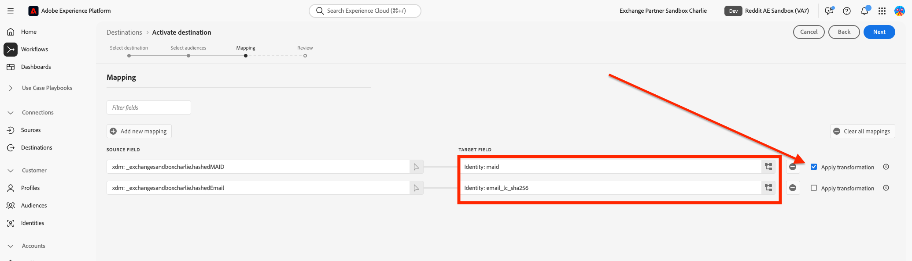

# [!DNL Reddit Custom Audience]连接 {#reddit-custom-audience-connection}

## 概述 {#overview}

[!DNL Reddit Ads]将品牌与积极实时探索其爱好和问题的用户关联起来。 通过将高意图、社区驱动的对话与灵活的广告格式和强大的定位功能相结合，[!DNL Reddit Ads]可帮助广告商触及参与的受众、推动效果成果并直接从塑造在线文化的社区中学习。

本指南适用于使用[!DNL Adobe Experience Platform]将受众发送到[!DNL Reddit Ads]的广告商和媒体团队。 它涵盖了连接帐户、映射身份和激活受众所需的功能。

>[!IMPORTANT]
>
>此目标连接器和文档页面由[!DNL Reddit]团队创建和维护。 如有任何查询或更新请求，请直接通过<adsapi-partner-support@reddit.com>与他们联系。

## 用例 {#use-cases}

为了帮助您更好地了解您应如何以及何时使用[!DNL Reddit Custom Audience]目标，以下是[!DNL Adobe Experience Platform]客户可以通过使用此目标解决的示例用例。

### 通过个性化优惠重新定位现有客户 {#use-case-1}

在线retailer希望通过社交平台与现有客户联系，并向他们显示基于先前订单的个性化优惠。 在线retailer可从自己的CRM将电子邮件地址和设备ID（IDFA和GAID）摄取到[!DNL Adobe Experience Platform]，从自己的离线数据构建受众，并将这些受众发送到[!DNL Reddit Ads]，从而优化其广告支出。

## 先决条件 {#prerequisites}

在配置此目标之前，请确保您满足以下先决条件：

* 允许使用自定义受众和客户列表的[!DNL Reddit Ads]帐户。
* 授权连接的权限。 该用户必须是可以登录[!DNL Reddit]并批准[!DNL Experience Platform]访问权限的用户，才能代表广告帐户管理受众。
* 您的[!DNL Reddit]广告帐户ID：创建受众的广告帐户的标识符。 您可以在[帐户](https://ads.reddit.com/accounts)中找到您的广告帐户ID。 例如：`a2_1b2c34d`。

## 支持的身份 {#supported-identities}

[!DNL Reddit Custom Audience]支持激活下表中描述的标识。 了解有关[标识](/help/identity-service/features/namespaces.md)的更多信息。

| 目标身份 | 描述 | 注意事项 |
| --- | --- | --- |
| email_lc_sha256 | 使用SHA256算法进行哈希处理的电子邮件地址 | [!DNL Adobe Experience Platform]支持纯文本和SHA256哈希电子邮件地址。 当源字段包含未哈希处理的属性时，请选中&#x200B;**[!UICONTROL Apply transformation]**&#x200B;选项，以便[!DNL Platform]在激活时自动对数据进行哈希处理。 |
| 女佣 | 广告商的Google Advertising ID或Apple ID，两者均使用SHA256算法进行哈希处理 | 将GAID或IDFA映射到&#x200B;**maid**。 当源字段包含未哈希处理的属性时，请选中&#x200B;**[!UICONTROL Apply transformation]**&#x200B;选项，以便[!DNL Platform]在激活时自动对数据进行哈希处理。 |

{style="table-layout:auto"}

## 支持的受众 {#supported-audiences}

此部分介绍哪些类型的受众可以导出到此目标。

| 受众来源 | 受支持 | 描述 |
| --- | --- | --- |
| [!DNL Segmentation Service] | 是 | 通过[!DNL Experience Platform] [分段服务](../../../segmentation/home.md)生成的受众。 |
| 所有其他受众来源 | 是 | 此类别包括受众来源在通过分段服务生成的受众之外的所有受众。 了解[各种受众源](/help/segmentation/ui/audience-portal.md#customize)。 |

{style="table-layout:auto"}

按数据类型显示的受众支持：

| 受众数据类型 | 受支持 | 描述 | 用例 |
| --- | --- | --- | --- |
| [人员受众](/help/segmentation/types/people-audiences.md) | 是 | 根据客户个人资料，允许您针对特定的营销活动人群组进行定位。 | 频繁购买者，购物车放弃者 |
| [帐户受众](/help/segmentation/types/account-audiences.md) | 否 | 针对特定组织内的个人，制定基于帐户的营销策略。 | B2B营销 |
| [潜在客户受众](/help/segmentation/types/prospect-audiences.md) | 否 | 定位尚未成为客户但与目标受众具有共同特征的个人。 | 利用第三方数据发现潜在客户 |
| [数据集导出](/help/catalog/datasets/overview.md) | 否 | 存储在[!DNL Adobe Experience Platform]数据湖中的结构化数据的集合。 | 报告、数据科学工作流 |

{style="table-layout:auto"}

## 导出类型和频率 {#export-type-frequency}

有关目标导出类型和频率的信息，请参阅下表。

| 项目 | 类型 | 注释 |
| --- | --- | --- |
| 导出类型 | **[!UICONTROL Audience export]** | 您正在导出具有[!DNL Reddit Custom Audience]目标中使用的标识符（姓名、电话号码或其他）的受众的所有成员。 |
| 导出频率 | **[!UICONTROL Streaming]** | 流目标为基于API的“始终运行”连接。 根据受众评估在Experience Platform中更新用户档案后，连接器会立即将更新发送到下游目标平台。 阅读有关[流式目标](/help/destinations/destination-types.md#streaming-destinations)的更多信息。 |

{style="table-layout:auto"}

## 连接到目标 {#connect}

>[!IMPORTANT]
>
>若要连接到目标，您需要&#x200B;**[!UICONTROL View Destinations]**&#x200B;和&#x200B;**[!UICONTROL Manage Destinations]** [访问控制权限](/help/access-control/home.md#permissions)。 阅读[访问控制概述](/help/access-control/ui/overview.md)或联系您的产品管理员以获取所需的权限。

要连接到此目标，请按照[目标配置教程](../../ui/connect-destination.md)中描述的步骤操作。 在配置目标工作流中，填写下面两个部分中列出的字段。

### 验证目标 {#authenticate}

要验证目标，请填写必填字段并选择&#x200B;**[!UICONTROL Connect to destination]**。


您被重定向到使用[!DNL Reddit]登录。 查看请求的权限后，选择&#x200B;**[!UICONTROL Allow]**，以便[!DNL Experience Platform]可以代表您的广告帐户创建受众和更新成员资格。


### 填写目标详细信息 {#destination-details}

要配置目标的详细信息，请填写下面的必需和可选字段。 UI中字段旁边的星号表示该字段为必填字段。


* **[!UICONTROL Name]**：用于识别此目标的名称。
* **[!UICONTROL Description]**：帮助您识别此目标的描述。
* **[!UICONTROL Ad Account ID]**：您的[!DNL Reddit]广告帐户ID。

### 启用警报 {#enable-alerts}

您可以启用警报，以接收有关发送到目标的数据流状态的通知。 从列表中选择警报以订阅接收有关数据流状态的通知。 有关警报的详细信息，请参阅[使用UI订阅目标警报的指南](../../ui/alerts.md)。

完成提供目标连接的详细信息后，选择&#x200B;**[!UICONTROL Next]**。

## 激活此目标的受众 {#activate}

>[!IMPORTANT]
>
>* 若要激活数据，您需要&#x200B;**[!UICONTROL View Destinations]**、**[!UICONTROL Activate Destinations]**、**[!UICONTROL View Profiles]**&#x200B;和&#x200B;**[!UICONTROL View Segments]** [访问控制权限](/help/access-control/home.md#permissions)。 阅读[访问控制概述](/help/access-control/ui/overview.md)或联系您的产品管理员以获取所需的权限。
>* 要导出&#x200B;*标识*，您需要&#x200B;**[!UICONTROL View Identity Graph]** [访问控制权限](/help/access-control/home.md#permissions)。<br> {width="100" zoomable="yes"}

有关将受众激活到此目标的说明，请阅读[将配置文件和受众激活到流式受众导出目标](/help/destinations/ui/activate-segment-streaming-destinations.md)。

### 映射属性和身份 {#map}

必须根据用例映射以下目标身份命名空间：

| 源字段 | 目标字段 | 注释 |
| --- | --- | --- |
| 电子邮件（纯文本或散列） | email_lc_sha256 | 可以对源字段进行哈希处理或取消哈希处理。 [!DNL Reddit]仅接受哈希值。 启用&#x200B;**[!UICONTROL Apply transformation]**，使[!DNL Experience Platform]在发送前对电子邮件进行哈希处理。 |
| MAID（纯文本或散列） | 女佣 | 可以对源字段进行哈希处理或取消哈希处理。 [!DNL Reddit]仅接受哈希值。 启用&#x200B;**[!UICONTROL Apply transformation]**，以便[!DNL Experience Platform]在发送前对该值进行哈希处理。 |

您必须至少映射一个标识。



## 导出的数据/验证数据导出 {#exported-data}

激活受众后，您可以在[!DNL Reddit]广告管理器帐户中看到它们。

在[!DNL Reddit]中新创建的受众显示为待处理状态。 在数据流运行并导出配置文件后，[!DNL Reddit]与[!DNL Reddit]个用户的配置文件匹配。 处理数据后，受众状态将更改为&#x200B;**[!UICONTROL Valid]**。 受众规模必须达到[1,000个或更多](https://ads-api.reddit.com/docs/v3/manage-customer-lists)用户才能被视为有效。 不符合所需大小的受众显示为&#x200B;**[!UICONTROL Invalid]**。


以下是发送到[!DNL Reddit]的有效负载示例：

```json
{
  "data": {
    "action_type": "ADD",
    "column_order": [
      "EMAIL_SHA256",
      "MAID_SHA256"
    ],
    "user_data": [
      [
        "d7ef2e7b2a3663c25284a3d6d13b1ca727fc8c659474b81afe0cec997a4737d2",
        "510870d7b3e47a28a2b2f3aef27a4c81aab0b2eefda27dea50bc4c991d9e5435"
      ]
    ]
  }
}
```

有关其他详细信息，请参阅[Reddit API文档](https://ads-api.reddit.com/docs/v3/operations/Update%20Custom%20Audience%20Users)。

## 数据使用和治理 {#data-usage-governance}

在处理您的数据时，所有[!DNL Adobe Experience Platform]目标都符合数据使用策略。 有关[!DNL Adobe Experience Platform]如何实施数据治理的详细信息，请阅读[数据治理概述](/help/data-governance/home.md)。

## 其他资源 {#additional-resources}

有关自定义受众端点如何工作的详细信息，请参阅[Reddit API文档](https://ads-api.reddit.com/docs/v3/operations/Update%20Custom%20Audience%20Users)。
