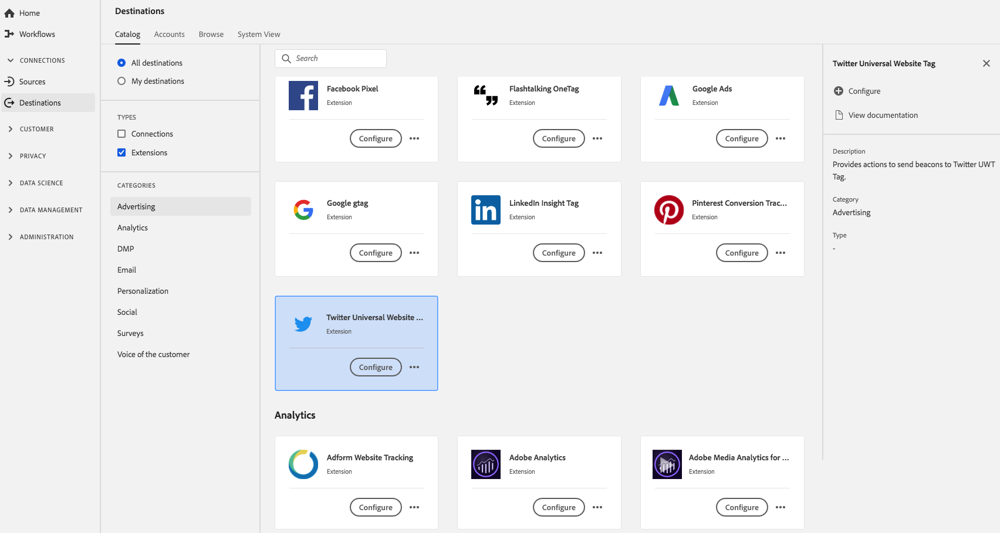

# [!DNL Twitter Universal Website Tag] 扩展 {#twitter-uwt-extension}

## 概述 {#overview}

[!DNL Twitter Universal Website Tag] 提供将信标发送到Twitter UWT标记的操作。

[!DNL Twitter Universal Website Tag] 是Adobe Experience Platform的一项广告扩展。有关扩展功能的更多信息，请参阅Twitter文档中的[转化跟踪](https://business.twitter.com/en/help/campaign-measurement-and-analytics/conversion-tracking-for-websites.html) 。

此目标是一个标记扩展。 有关标记扩展如何在Platform中工作的更多信息，请参阅[标记扩展概述](../launch-extensions/overview.md)。

## 先决条件 {#prerequisites}

[!DNL Destinations]目录中提供了此扩展，可供已购买Platform的所有客户使用。

要使用此扩展，您需要访问Adobe Experience Platform中的标记。 标记作为内置增值功能提供给Adobe Experience Cloud客户。 请联系您的组织管理员以获取对标记的访问权限，并要求他们授予您&#x200B;**[!UICONTROL manage_properties]**&#x200B;权限，以便您可以安装扩展。 并要求他们授予您&#x200B;**[!UICONTROL manage_properties]**&#x200B;权限，以便您可以安装扩展。

## 安装扩展 {#install-extension}

要安装[!DNL Twitter Universal Website Tag]扩展，请执行以下操作：

在[Platform接口](http://platform.adobe.com/)中，转到&#x200B;**[!UICONTROL 目标]** > **[!UICONTROL Catalog]**。

从目录中选择扩展或使用搜索栏。

单击目标以将其突出显示，然后选择右边栏中的&#x200B;**[!UICONTROL 配置]**。 如果&#x200B;**[!UICONTROL Configure]**&#x200B;控件呈灰显状态，则您缺少&#x200B;**[!UICONTROL manage_properties]**&#x200B;权限。 请参阅[先决条件](#prerequisites)。

选择要在其中安装扩展的资产。 您还可以选择创建新资产。 资产是规则、数据元素、配置的扩展、环境和库的集合。了解标记文档的[属性页面部分](../../../tags/ui/administration/companies-and-properties.md#properties-page)中的属性。

工作流可指导您完成完成安装的步骤。

您还可以直接在[数据收集UI](https://experience.adobe.com/#/data-collection/)中安装扩展。 有关更多信息，请参阅标记文档中关于[添加新扩展](../../../tags/ui/managing-resources/extensions/overview.md#add-a-new-extension)的部分。

## 如何使用扩展 {#how-to-use}

安装扩展后，您可以开始设置规则。

您可以为已安装的扩展设置规则，以便仅在某些情况下将事件数据发送到扩展目标。 有关为扩展设置规则的更多信息，请参阅[标记文档](../../../tags/ui/managing-resources/rules.md)。

## 配置、升级和删除扩展 {#configure-upgrade-delete}

您可以在数据收集UI中配置、升级和删除扩展。

>[!TIP]
>
>如果您的某个资产上已安装扩展，则Platform UI仍会为该扩展显示&#x200B;**[!UICONTROL Install]**。 按照[Install extension](#install-extension)中所述启动安装工作流，以配置或删除您的扩展。

要升级扩展，请参阅标记文档中[扩展升级过程](../../../tags/ui/managing-resources/extensions/extension-upgrade.md)中的指南。
