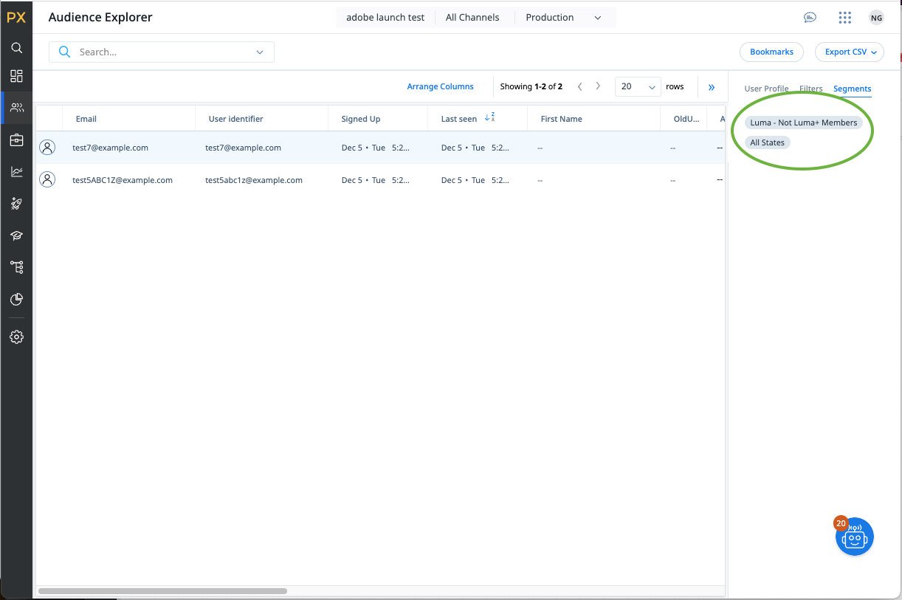

# Gainsight PX连接 {#gainsight-px}

## 概述 {#overview}

[[!DNL Gainsight PX]](https://www.gainsight.com/product-experience/)是一个产品体验平台，它使产品团队能够了解用户如何使用其产品、收集反馈和创建应用程序内参与（如产品演练）以推动用户入门和产品采用。

>[!IMPORTANT]
>
>目标连接器和文档页面由&#x200B;*Gainsight PX*&#x200B;团队创建并维护。 如有任何查询或更新请求，请直接通过&#x200B;*`pxsupport@gainsight.com`*&#x200B;与他们联系。

## 用例 {#use-cases}

为了帮助您更好地了解何时以及如何使用&#x200B;*Gainsight PX*&#x200B;目标，以下是Adobe Experience Platform客户可以使用此目标解决的示例用例。

### 定位应用程序内参与 {#targeting-in-app-engagements}

SaaS公司希望通过基于Gainsight PX构建的应用程序内指南吸引客户。 已在Adobe Experience Platform上构建要接收此预订的受众。 Gainsight PX目标接收受众，并在Gainsight PX环境中提供该受众。

## 先决条件 {#prerequisites}

* 请与[!DNL Gainsight]支持团队联系，请求为您的订阅激活外部区段功能。
* 使用位于[公司详细信息页面](https://app.aptrinsic.com/settings/subscription)底部的&#x200B;**[!UICONTROL 生成新密码]**&#x200B;按钮，为您的PX订阅生成OAuth密码值
  Gainsight PX中的

## 支持的身份 {#supported-identities}

Gainsight PX支持激活下表中描述的标识。 了解有关[标识](../../../identity-service/features/namespaces.md)的更多信息。

| 目标身份 | 描述 |
|---|----|
| 标识ID | 在Gainsight PX和Adobe Experience Platform中唯一标识用户的通用用户标识符 |

{style="table-layout:auto"}

## 支持的受众 {#supported-audiences}

本节介绍可导出到此目标的受众类型。

| 受众来源 | 支持 | 描述 |
|---|---|---|
| [!DNL Segmentation Service] | ✓ {\f13 } | 通过Experience Platform[分段服务](../../../segmentation/home.md)生成的受众。 |
| 自定义上传 | X | 受众[已将](../../../segmentation/ui/audience-portal.md#import-audience)从CSV文件导入到Experience Platform中。 |

{style="table-layout:auto"}

## 导出类型和频率 {#export-type-frequency}

有关目标导出类型和频率的信息，请参阅下表。

| 项目 | 类型 | 注释 |
|---|---|---|
| 导出类型 | **[!UICONTROL 区段导出]** | 您正在导出具有[!DNL Gainsight PX]目标中使用的标识符（姓名、电话号码或其他）的受众的所有成员。 |
| 导出频率 | **[!UICONTROL 正在流式传输]** | 流目标为基于API的“始终运行”连接。 当基于受众评估在Experience Platform中更新用户档案时，连接器将更新发送到下游目标平台。 阅读有关[流式目标](/help/destinations/destination-types.md#streaming-destinations)的更多信息。 |

{style="table-layout:auto"}

## 连接到目标 {#connect}

>[!IMPORTANT]
>
>若要连接到目标，您需要&#x200B;**[!UICONTROL 管理目标]** [访问控制权限](/help/access-control/home.md#permissions)。 阅读[访问控制概述](/help/access-control/ui/overview.md)或联系您的产品管理员以获取所需的权限。

要连接到此目标，请按照[目标配置教程](../../ui/connect-destination.md)中描述的步骤操作。 在目标配置工作流中，填写下面两个部分中列出的字段。

### 验证目标 {#authenticate}

要验证到目标，请填写必填字段并选择&#x200B;**[!UICONTROL 连接到目标]**。

* **[!UICONTROL 密码]**：用于登录到[[!DNL Gainsight PX]](https://app.aptrinsic.com)的密码
* **[!UICONTROL 客户端ID]**： [公司详细信息页面](https://app.aptrinsic.com/settings/subscription)上的Gainsight PX订阅ID
* **[!UICONTROL 客户端密码]**：在[!DNL Gainsight PX] UI中的[公司详细信息页面](https://app.aptrinsic.com/settings/subscription)底部生成的OAuth密码。
* **[!UICONTROL 用户名]**：用于登录到[[!DNL Gainsight PX]](https://app.aptrinsic.com) UI的电子邮件

### 填写目标详细信息 {#destination-details}

要配置目标的详细信息，请填写下面的必需和可选字段。 UI中字段旁边的星号表示该字段为必填字段。

Experience Platform用户界面中的

* **[!UICONTROL 名称]**：将来用于识别此目标的名称。
* **[!UICONTROL 描述]**：可帮助您将来识别此目标的描述。

完成提供目标连接的详细信息后，选择&#x200B;**[!UICONTROL 下一步]**。

## 将区段激活到此目标 {#activate}

>[!IMPORTANT]
>
>* 若要激活数据，您需要&#x200B;**[!UICONTROL 管理目标]**、**[!UICONTROL 激活目标]**、**[!UICONTROL 查看配置文件]**&#x200B;和&#x200B;**[!UICONTROL 查看区段]** [访问控制权限](/help/access-control/home.md#permissions)。 阅读[访问控制概述](/help/access-control/ui/overview.md)或联系您的产品管理员以获取所需的权限。
>* 要导出&#x200B;*标识*，您需要&#x200B;**[!UICONTROL 查看标识图形]** [访问控制权限](/help/access-control/home.md#permissions)。  {width="100" zoomable="yes"}

有关将受众区段激活到此目标的说明，请阅读[将配置文件和区段激活到流式区段导出目标](/help/destinations/ui/activate-segment-streaming-destinations.md)。

### 映射身份 {#map}

此目标支持配置文件属性和身份命名空间的映射。 目标映射必须始终为&#x200B;**[!UICONTROL IDENTIFY_ID]**&#x200B;标识命名空间。

请参阅下面的示例，以更好地了解如何配置映射。

#### 映射配置文件属性 {#map-profile-attribute}

在以下显示的示例中，源字段是XDM配置文件属性，该属性被映射到IDENTIFY_ID目标命名空间。

#### 映射身份命名空间 {#map-identity-namespace}

在以下示例中，源字段是映射到&#x200B;**[!UICONTROL IDENTIFY_ID]**&#x200B;目标命名空间的身份命名空间(**[!UICONTROL ECID]**)。

## 导出的数据/验证数据导出 {#exported-data}

分段数据将从Experience Platform流式传输到Gainsight PX。

区段元数据在[!DNL Gainsight PX] UI的“区段”屏幕中可见。

区段成员资格信息显示在[!DNL Gainsight PX] UI的Audience Explorer屏幕的“区段”选项卡中。

Gainsight PX中的

## 数据使用和治理 {#data-usage-governance}

在处理您的数据时，所有[!DNL Adobe Experience Platform]目标都符合数据使用策略。 有关[!DNL Adobe Experience Platform]如何实施数据治理的详细信息，请阅读[数据治理概述](/help/data-governance/home.md)。
