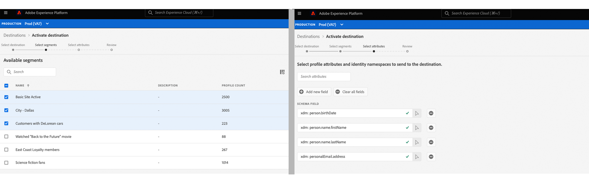

# [!DNL Amazon Kinesis] 连接

## 概述 {#overview}

>[!IMPORTANT]
>
> 此目标仅适用于 [Adobe Real-time Customer Data Platform Ultimate](https://helpx.adobe.com/legal/product-descriptions/real-time-customer-data-platform.html) 客户。

此 [!DNL Kinesis Data Streams] 服务者 [!DNL Amazon Web Services] 允许您实时收集和处理大量数据记录流。

您可以创建到 [!DNL Amazon Kinesis] 用于从Adobe Experience Platform流式传输数据的存储。

* 有关详情 [!DNL Amazon Kinesis]，请参见 [Amazon文档](https://docs.aws.amazon.com/streams/latest/dev/introduction.html).
* 要连接到 [!DNL Amazon Kinesis] 以编程方式查看 [流目标API教程](../../api/streaming-destinations.md).
* 要连接到 [!DNL Amazon Kinesis] 使用Platform用户界面，请参阅以下部分。


## 用例 {#use-cases}

通过使用流式目标，例如 [!DNL Amazon Kinesis]，您可以轻松地将高价值分段事件和相关配置文件属性馈送到您选择的系统。

例如，潜在客户下载了一本白皮书，该白皮书将它们划分为“高转化倾向”区段。 通过将潜在客户所属的受众映射到 [!DNL Amazon Kinesis] 目标，您将在以下位置收到此事件 [!DNL Amazon Kinesis]. 在这里，您可以采用DIY（自己动手）方法并在事件之上描述业务逻辑，因为您认为这种方法最适合您的企业IT系统。

## 支持的受众 {#supported-audiences}

此部分介绍哪些类型的受众可以导出到此目标。

| 受众来源 | 受支持 | 描述 |
---------|----------|----------|
| [!DNL Segmentation Service] | ✓ {\f13 } | 通过Experience Platform生成的受众 [分段服务](../../../segmentation/home.md). |
| 自定义上传 | ✓ | 受众 [已导入](../../../segmentation/ui/overview.md#import-audience) 从CSV文件Experience Platform到。 |

{style="table-layout:auto"}

## 导出类型和频率 {#export-type-frequency}

有关目标导出类型和频率的信息，请参阅下表。

| 项目 | 类型 | 注释 |
---------|----------|---------|
| 导出类型 | **[!UICONTROL 基于配置文件]** | 您正在导出区段的所有成员，以及所需的架构字段（例如：电子邮件地址、电话号码、姓氏），如 [目标激活工作流](../../ui/activate-batch-profile-destinations.md#select-attributes). |
| 导出频率 | **[!UICONTROL 流]** | 流目标为基于API的“始终运行”连接。 一旦根据受众评估在Experience Platform中更新了用户档案，连接器就会将更新发送到下游目标平台。 详细了解 [流目标](/help/destinations/destination-types.md#streaming-destinations). |

{style="table-layout:auto"}

## IP地址允许列表 {#ip-address-allowlist}

为了满足客户的安全性和法规遵从性要求， Experience Platform提供了您可以允许列表的静态IP列表， [!DNL Amazon Kinesis] 目标。 请参阅 [流目标的IP地址允许列表](/help/destinations/catalog/streaming/ip-address-allow-list.md) 要允许列表的IP的完整列表。

## 必填 [!DNL Amazon Kinesis] 权限 {#required-kinesis-permission}

要成功连接数据并将其导出到 [!DNL Amazon Kinesis] 流中，Experience Platform需要权限才能执行以下操作：

* `kinesis:ListStreams`
* `kinesis:PutRecord`
* `kinesis:PutRecords`

这些权限是通过 [!DNL Kinesis] 控制台，并且一旦您在Platform用户界面中配置了Kinesis目标，就会由Platform检查。

下面的示例显示了成功将数据导出到所需的最低访问权限 [!DNL Kinesis] 目标。

```json
{
    "Version": "2012-10-17",
    "Statement": [
        {
            "Effect": "Allow",
            "Action": [
                "kinesis:ListStreams",
                "kinesis:PutRecord",
                "kinesis:PutRecords"
            ],
            "Resource": [
                "arn:aws:kinesis:us-east-2:901341027596:stream/*"
            ]
        }
    ]
}
```

| 属性 | 描述 |
| -------- | ----------- |
| `kinesis:ListStreams` | 一个列出您的Amazon Kinesis数据流的操作。 |
| `kinesis:PutRecord` | 将单个数据记录写入Kinesis数据流的操作。 |
| `kinesis:PutRecords` | 一个在单个调用中将多个数据记录写入Kinesis数据流的操作。 |

{style="table-layout:auto"}

有关控制对的访问权限的更多信息 [!DNL Kinesis] 数据流，读取以下内容 [[!DNL Kinesis] 文档](https://docs.aws.amazon.com/streams/latest/dev/controlling-access.html).

## 连接到目标 {#connect}

>[!IMPORTANT]
> 
>要连接到目标，您需要 **[!UICONTROL 查看目标]** 和 **[!UICONTROL 管理目标]** [访问控制权限](/help/access-control/home.md#permissions). 阅读 [访问控制概述](/help/access-control/ui/overview.md) 或与产品管理员联系以获取所需的权限。

要连接到此目标，请按照 [目标配置教程](../../ui/connect-destination.md). 连接到此目标时，必须提供以下信息：

### 身份验证信息 {#authentication-information}

输入下面的字段并选择 **[!UICONTROL 连接到目标]**：


* **[!DNL Amazon Web Services]访问密钥和密钥**：在 [!DNL Amazon Web Services]，生成 `access key - secret access key` 对，以授予对的Platform访问权限 [!DNL Amazon Kinesis] 帐户。 在中了解详情 [Amazon Web Services文档](https://docs.aws.amazon.com/IAM/latest/UserGuide/id_credentials_access-keys.html).
* **[!UICONTROL 区域]**：指示哪个 [!DNL Amazon Web Services] 要将数据流式传输到的区域。

### 填写目标详细信息 {#destination-details}

>[!CONTEXTUALHELP]
>id="platform_destinations_connect_kinesis_includesegmentnames"
>title="包括区段名称"
>abstract="如果您希望数据导出包括正在导出的受众的名称，请进行切换。在选中此选项后查看数据导出示例的文档。"

>[!CONTEXTUALHELP]
>id="platform_destinations_connect_kinesis_includesegmenttimestamps"
>title="包括区段时间戳"
>abstract="如果您希望数据导出包括受众创建时间和更新时间的 Unix 时间戳，以及受众映射到用于激活的目标时的 Unix 时间戳，请进行切换。在选中此选项后查看数据导出示例的文档。"

要配置目标的详细信息，请填写下面的必需和可选字段。 UI中字段旁边的星号表示该字段为必填字段。


* **[!UICONTROL 名称]**：提供连接的名称，以 [!DNL Amazon Kinesis]
* **[!UICONTROL 描述]**：提供对连接的描述 [!DNL Amazon Kinesis].
* **[!UICONTROL 流]**：提供中现有数据流的名称 [!DNL Amazon Kinesis] 帐户。 Platform会将数据导出到此流。
* **[!UICONTROL 包括区段名称]**：如果您希望数据导出包含所导出受众的名称，请进行切换。 有关选中此选项的数据导出示例，请参阅 [导出的数据](#exported-data) 部分。
* **[!UICONTROL 包括区段时间戳]**：如果您希望数据导出包括创建和更新受众时的UNIX时间戳，以及将受众映射到目标以供激活时的UNIX时间戳，则可以进行切换。 有关选中此选项的数据导出示例，请参阅 [导出的数据](#exported-data) 部分。

<!--

>[!IMPORTANT]
>
>Platform needs `write` permissions on the bucket object where the export files will be delivered.

-->

### 启用警报 {#enable-alerts}

您可以启用警报，以接收有关发送到目标的数据流状态的通知。 从列表中选择警报以订阅接收有关数据流状态的通知。 有关警报的详细信息，请参阅以下内容中的指南： [使用UI订阅目标警报](../../ui/alerts.md).

完成提供目标连接的详细信息后，选择 **[!UICONTROL 下一个]**.

## 激活此目标的受众 {#activate}

>[!IMPORTANT]
> 
>* 要激活数据，您需要 **[!UICONTROL 查看目标]**， **[!UICONTROL 激活目标]**， **[!UICONTROL 查看配置文件]**、和 **[!UICONTROL 查看区段]** [访问控制权限](/help/access-control/home.md#permissions). 阅读 [访问控制概述](/help/access-control/ui/overview.md) 或与产品管理员联系以获取所需的权限。
>* [同意政策评估](/help/data-governance/enforcement/auto-enforcement.md#consent-policy-evaluation) 当前在导出到Amazon Kinesis目标时不支持。 [了解更多信息](/help/destinations/ui/activate-streaming-profile-destinations.md#consent-policy-evaluation)。

请参阅 [将受众数据激活到流式配置文件导出目标](../../ui/activate-streaming-profile-destinations.md) 有关将受众激活到此目标的说明。

## 配置文件导出行为 {#profile-export-behavior}

Experience Platform会优化到 [!DNL Amazon Kinesis] 目标，用于在受众资格或其他重要事件后对配置文件进行相关更新时，仅将数据导出到您的目标。 在以下情况下，会将配置文件导出到您的目标：

* 配置文件更新取决于映射到目标的至少一个受众的受众成员身份发生更改。 例如，配置文件已符合映射到目标的其中一个受众的条件，或已退出映射到目标的其中一个受众。
* 用户档案更新由 [身份映射](/help/xdm/field-groups/profile/identitymap.md). 例如，对于已经符合映射到目标的其中一个受众资格的用户档案，在身份映射属性中添加了一个新身份。
* 配置文件更新由映射到目标的至少一个属性的更改确定。 例如，将映射步骤中映射到目标的某个属性添加到配置文件中。

在上述所有情况中，只会将已发生相关更新的用户档案导出到您的目标。 例如，如果映射到目标流的受众具有一百个成员，并且有五个新配置文件符合该区段的条件，则导出到目标的操作将以增量方式进行，并且只包括五个新配置文件。

请注意，所有映射的属性都会导出到配置文件，无论更改位于何处。 因此，在上面的示例中，将导出这五个新配置文件的所有映射属性，即使属性本身未发生更改也是如此。

### 决定数据导出的因素以及导出中包含的内容 {#what-determines-export-what-is-included}

对于为给定用户档案导出的数据，了解 *决定导出到您的数据的因素 [!DNL Amazon Kinesis] 目标* 和 *哪些数据包含在导出中*.

| 决定目标导出的因素 | 目标导出中包含的内容 |
|---------|----------|
| <ul><li>映射的属性和受众会作为目标导出的提示。 这意味着，如果任何映射的受众更改状态(从 `null` 到 `realized` 或从 `realized` 到 `exiting`)或者更新任何映射的属性，则将会启动目标导出。</li><li>由于身份当前无法映射到 [!DNL Amazon Kinesis] 目标，给定配置文件中任何标识的更改也会决定目标导出情况。</li><li>属性的更改被定义为属性上的任何更新，无论其是否为相同的值。 这意味着即使值本身未发生更改，也会将覆盖属性视为更改。</li></ul> | <ul><li>此 `segmentMembership` 对象包括在激活数据流中映射的受众，对于该受众，在资格或受众退出事件后，用户档案的状态已发生更改。 请注意，如果配置文件符合条件的其他未映射受众属于同一受众，则这些受众也可以作为目标导出的一部分 [合并策略](/help/profile/merge-policies/overview.md) 与激活数据流中映射的受众相同。 </li><li>中的所有标识 `identityMap` 对象也包含在内(Experience Platform当前不支持中的标识映射) [!DNL Amazon Kinesis] 目标)。</li><li>目标导出中只包含映射的属性。</li></ul> |

{style="table-layout:fixed"}

例如，将此数据流视为 [!DNL Amazon Kinesis] 目标：在数据流中选择三个受众，且四个属性映射到目标。



导出到目标的配置文件可由符合或退出其中一个配置文件来确定 *三个映射区段*. 但是，在数据导出中，将 `segmentMembership` 对象(请参阅 [导出的数据](#exported-data) 如果特定配置文件是其他未映射受众的成员，并且这些受众与触发导出的受众共享相同的合并策略，则可能会显示其他未映射受众。 如果配置文件符合 **拥有DeLorean Cars的客户** 受众，但同时也是 **观看了《回到未来》** 电影和 **科幻迷们** 受众，则另外两个受众也会出现在中 `segmentMembership` 数据导出的对象，即使这些对象未在数据流中映射，只要它们与共享相同的合并策略 **拥有DeLorean Cars的客户** 区段。

从配置文件属性的角度来看，对上述四个映射属性所做的任何更改都将决定目标导出，并且配置文件中存在的四个映射属性中的任何一个都会出现在数据导出中。

## 历史数据回填 {#historical-data-backfill}

在将新受众添加到现有目标时，或者创建新目标并将受众映射到该目标时，Experience Platform会将历史受众资格数据导出到该目标。 符合受众资格的用户档案 *早于* 向目标添加的受众会在大约一小时内导出到目标。

## 导出的数据 {#exported-data}

已导出 [!DNL Experience Platform] 数据登陆到 [!DNL Amazon Kinesis] JSON格式的目标。 例如，以下导出包含一个符合某个区段资格条件的配置文件，该配置文件是另一个区段的成员，并且已退出另一个区段。 导出还包括配置文件属性名字、姓氏、出生日期和个人电子邮件地址。 此配置文件的身份为ECID和电子邮件。

```json
{
  "person": {
    "birthDate": "YYYY-MM-DD",
    "name": {
      "firstName": "John",
      "lastName": "Doe"
    }
  },
  "personalEmail": {
    "address": "john.doe@acme.com"
  },
  "segmentMembership": {
   "ups":{
      "7841ba61-23c1-4bb3-a495-00d3g5fe1e93":{
         "lastQualificationTime":"2022-01-11T21:24:39Z",
         "status":"exited"
      },
      "59bd2fkd-3c48-4b18-bf56-4f5c5e6967ae":{
         "lastQualificationTime":"2022-01-02T23:37:33Z",
         "status":"realized"
      },
      "947c1c46-008d-40b0-92ec-3af86eaf41c1":{
         "lastQualificationTime":"2021-08-25T23:37:33Z",
         "status":"realized"
      },
      "5114d758-ce71-43ba-b53e-e2a91d67b67f":{
         "lastQualificationTime":"2022-01-11T23:37:33Z",
         "status":"realized"
      }
   }
},
  "identityMap": {
    "ecid": [
      {
        "id": "14575006536349286404619648085736425115"
      },
      {
        "id": "66478888669296734530114754794777368480"
      }
    ],
    "email_lc_sha256": [
      {
        "id": "655332b5fa2aea4498bf7a290cff017cb4"
      },
      {
        "id": "66baf76ef9de8b42df8903f00e0e3dc0b7"
      }
    ]
  }
}
```

以下是导出数据的更多示例，具体取决于您在的连接目标流中选择的UI设置 **[!UICONTROL 包括区段名称]** 和 **[!UICONTROL 包括区段时间戳]** 选项：

+++ 以下数据导出示例包括 `segmentMembership` 部分

```json
"segmentMembership": {
        "ups": {
          "5b998cb9-9488-4ec3-8d95-fa8338ced490": {
            "lastQualificationTime": "2019-04-15T02:41:50+0000",
            "status": "realized",
            "createdAt": 1648553325000,
            "updatedAt": 1648553330000,
            "mappingCreatedAt": 1649856570000,
            "mappingUpdatedAt": 1649856570000,
            "name": "First name equals John"
          }
        }
      }
```

+++

+++ 以下数据导出示例包括 `segmentMembership` 部分

```json
"segmentMembership": {
        "ups": {
          "5b998cb9-9488-4ec3-8d95-fa8338ced490": {
            "lastQualificationTime": "2019-04-15T02:41:50+0000",
            "status": "realized",
            "createdAt": 1648553325000,
            "updatedAt": 1648553330000,
            "mappingCreatedAt": 1649856570000,
            "mappingUpdatedAt": 1649856570000,
          }
        }
      }
```

+++

## 限制和重试策略 {#limits-retry-policy}

在95%的时间中，Experience Platform会尝试为成功发送的消息提供少于10分钟的吞吐量延迟，每个数据流向HTTP目的地的请求速率每秒少于10,000次。

如果对HTTP API目标的请求失败，Experience Platform将存储失败的请求，并重试两次以将请求发送到您的端点。

>[!MORELIKETHIS]
>
>* [连接到Amazon Kinesis并使用流服务API激活数据](../../api/streaming-destinations.md)
>* [Azure事件中心目标](./azure-event-hubs.md)
>* [目标类型和类别](../../destination-types.md)
