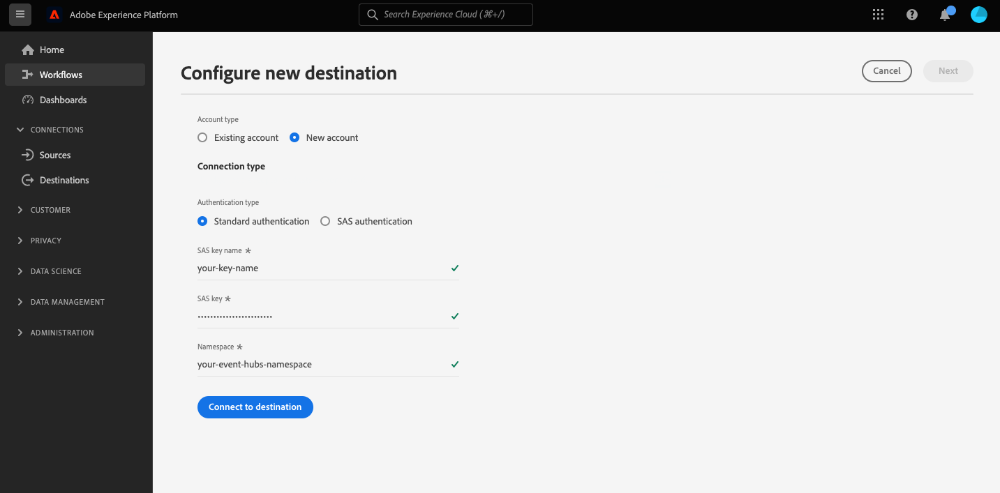

# [!DNL Azure Event Hubs]连接

## 概述 {#overview}

>[!IMPORTANT]
>
> 此目标仅适用于[Adobe Real-Time Customer Data Platform Ultimate](https://helpx.adobe.com/cn/legal/product-descriptions/real-time-customer-data-platform.html)客户。

[!DNL Azure Event Hubs]是一个大数据流式传输平台和事件摄取服务。 它每秒可以接收和处理数百万个事件。 发送到事件中心的数据可以使用任何实时分析提供程序或批处理/存储适配器进行转换和存储。

您可以创建到[!DNL Azure Event Hubs]存储区的实时出站连接，以从Adobe Experience Platform流式传输数据。

* 有关[!DNL Azure Event Hubs]的详细信息，请参阅[Microsoft文档](https://docs.microsoft.com/en-us/azure/event-hubs/event-hubs-about)。
* 要以编程方式连接到[!DNL Azure Event Hubs]，请参阅[流式目标API教程](../../api/streaming-destinations.md)。
* 要使用Experience Platform用户界面连接到[!DNL Azure Event Hubs]，请参阅以下部分。

UI中的

## 用例 {#use-cases}

通过使用流式目标（如[!DNL Azure Event Hubs]），您可以轻松将高价值分段事件和相关配置文件属性馈送到您选择的系统。

例如，潜在客户下载了一本白皮书，该白皮书将它们划分为“高转化倾向”区段。 通过将潜在客户所在的受众映射到[!DNL Azure Event Hubs]目标，您将在[!DNL Azure Event Hubs]中收到此事件。 在这里，您可以采用DIY（自己动手）方法并在事件之上描述业务逻辑，因为您认为这种方法最适合您的企业IT系统。

## 支持的受众 {#supported-audiences}

此部分介绍哪些类型的受众可以导出到此目标。

| 受众来源 | 支持 | 描述 |
|---------|----------|----------|
| [!DNL Segmentation Service] | ✓ | 通过Experience Platform [分段服务](../../../segmentation/home.md)生成的受众。 |
| 自定义上传 | ✓ | 受众[已从CSV文件将](../../../segmentation/ui/audience-portal.md#import-audience)导入Experience Platform。 |

{style="table-layout:auto"}

## 导出类型和频率 {#export-type-frequency}

有关目标导出类型和频率的信息，请参阅下表。

| 项目 | 类型 | 注释 |
---------|----------|---------|
| 导出类型 | **[!UICONTROL 基于配置文件]** | 您正在导出区段的所有成员，以及所需的架构字段（例如：电子邮件地址、电话号码、姓氏），如[目标激活工作流](../../ui/activate-batch-profile-destinations.md#select-attributes)的选择配置文件属性屏幕中所选。 |
| 导出频率 | **[!UICONTROL 正在流式传输]** | 流目标为基于API的“始终运行”连接。 根据受众评估在Experience Platform中更新用户档案后，连接器会立即将更新发送到下游目标平台。 阅读有关[流式目标](/help/destinations/destination-types.md#streaming-destinations)的更多信息。 |

{style="table-layout:auto"}

## IP地址允许列表 {#ip-address-allowlist}

为了满足客户的安全和合规性要求，Experience Platform提供了您可以为[!DNL Azure Event Hubs]目标允许列表的静态IP列表。 有关要允许列表的IP的完整列表，请参阅[流目标的IP地址允许列表](/help/destinations/catalog/streaming/ip-address-allow-list.md)。

## 连接到目标 {#connect}

>[!IMPORTANT]
> 
>若要连接到目标，您需要&#x200B;**[!UICONTROL 查看目标]**&#x200B;和&#x200B;**[!UICONTROL 管理目标]** [访问控制权限](/help/access-control/home.md#permissions)。 阅读[访问控制概述](/help/access-control/ui/overview.md)或联系您的产品管理员以获取所需的权限。

要连接到此目标，请按照[目标配置教程](../../ui/connect-destination.md)中描述的步骤操作。 连接到此目标时，必须提供以下信息：

### 身份验证信息 {#authentication-information}

#### 标准身份验证 {#standard-authentication}



如果选择&#x200B;**[!UICONTROL 标准身份验证]**&#x200B;类型连接到HTTP终结点，请输入以下字段并选择&#x200B;**[!UICONTROL 连接到目标]**：

* **[!UICONTROL SAS密钥名称]**：授权规则的名称，也称为SAS密钥名称。
* **[!UICONTROL SAS键]**：事件中心命名空间的主键。 `sasKey`对应的`sasPolicy`必须配置了&#x200B;**管理**&#x200B;权限才能填充事件中心列表。 请参阅[Microsoft文档](https://docs.microsoft.com/en-us/azure/event-hubs/authenticate-shared-access-signature)以了解如何使用SAS密钥向[!DNL Azure Event Hubs]进行身份验证。
* **[!UICONTROL 命名空间]**：填写您的[!DNL Azure Event Hubs]命名空间。 在[Microsoft文档](https://docs.microsoft.com/en-us/azure/event-hubs/event-hubs-create#create-an-event-hubs-namespace)中了解[!DNL Azure Event Hubs]命名空间。

#### 共享访问签名(SAS)身份验证 {#sas-authentication}


如果选择&#x200B;**[!UICONTROL 标准身份验证]**&#x200B;类型连接到HTTP终结点，请输入以下字段并选择&#x200B;**[!UICONTROL 连接到目标]**：

* **[!UICONTROL SAS密钥名称]**：授权规则的名称，也称为SAS密钥名称。
* **[!UICONTROL SAS键]**：事件中心命名空间的主键。 `sasKey`对应的`sasPolicy`必须配置了&#x200B;**管理**&#x200B;权限才能填充事件中心列表。 请参阅[Microsoft文档](https://docs.microsoft.com/en-us/azure/event-hubs/authenticate-shared-access-signature)以了解如何使用SAS密钥向[!DNL Azure Event Hubs]进行身份验证。
* **[!UICONTROL 命名空间]**：填写您的[!DNL Azure Event Hubs]命名空间。 在[Microsoft文档](https://docs.microsoft.com/en-us/azure/event-hubs/event-hubs-create#create-an-event-hubs-namespace)中了解[!DNL Azure Event Hubs]命名空间。
* **[!UICONTROL 事件中心名称]**：填写您的[!DNL Azure Event Hub]名称。 在[Microsoft文档](https://learn.microsoft.com/en-us/azure/event-hubs/event-hubs-create#create-an-event-hub)中了解[!DNL Azure Event Hubs]名称。

### 填写目标详细信息 {#destination-details}

>[!CONTEXTUALHELP]
>id="platform_destinations_connect_eventhubs_includesegmentnames"
>title="包括区段名称"
>abstract="如果您希望数据导出包括正在导出的受众的名称，请进行切换。在选中此选项后查看数据导出示例的文档。"

>[!CONTEXTUALHELP]
>id="platform_destinations_connect_eventhubs_includesegmenttimestamps"
>title="包括区段时间戳"
>abstract="如果您希望数据导出包括受众创建时间和更新时间的 Unix 时间戳，以及受众映射到用于激活的目标时的 Unix 时间戳，请进行切换。在选中此选项后查看数据导出示例的文档。"

要配置目标的详细信息，请填写下面的必需和可选字段。 UI中字段旁边的星号表示该字段为必填字段。


* **[!UICONTROL 名称]**：填写与[!DNL Azure Event Hubs]的连接名称。
* **[!UICONTROL 描述]**：提供连接的描述。  示例：“高级层客户”、“对风筝冲浪感兴趣的客户”。
* **[!UICONTROL eventHubName]**：为流提供一个名称，以连接到[!DNL Azure Event Hubs]目标。
* **[!UICONTROL 包括区段名称]**：如果希望数据导出包括正在导出的受众的名称，请切换。 有关选择此选项的数据导出示例，请参阅下面的[导出的数据](#exported-data)部分。
* **[!UICONTROL 包括区段时间戳]**：如果要在数据导出时包括创建和更新受众时的UNIX时间戳，以及在将受众映射到目标以进行激活时的UNIX时间戳，请切换此选项。 有关选择此选项的数据导出示例，请参阅下面的[导出的数据](#exported-data)部分。

### 启用警报 {#enable-alerts}

您可以启用警报，以接收有关发送到目标的数据流状态的通知。 从列表中选择警报以订阅接收有关数据流状态的通知。 有关警报的详细信息，请参阅[使用UI订阅目标警报的指南](../../ui/alerts.md)。

完成提供目标连接的详细信息后，选择&#x200B;**[!UICONTROL 下一步]**。

## 激活此目标的受众 {#activate}

>[!IMPORTANT]
> 
>* 若要激活数据，您需要&#x200B;**[!UICONTROL 查看目标]**、**[!UICONTROL 激活目标]**、**[!UICONTROL 查看配置文件]**&#x200B;和&#x200B;**[!UICONTROL 查看区段]** [访问控制权限](/help/access-control/home.md#permissions)。 阅读[访问控制概述](/help/access-control/ui/overview.md)或联系您的产品管理员以获取所需的权限。
>* 当前在导出到Azure事件中心目标时不支持[同意策略评估](/help/data-governance/enforcement/auto-enforcement.md#consent-policy-evaluation)。 [了解更多信息](/help/destinations/ui/activate-streaming-profile-destinations.md#consent-policy-evaluation)。

有关将受众激活到此目标的说明，请参阅[将受众数据激活到流式配置文件导出目标](../../ui/activate-streaming-profile-destinations.md)。

## 配置文件导出行为 {#profile-export-behavior}

Experience Platform会优化将配置文件导出到[!DNL Azure Event Hubs]目标的行为，以便仅在符合受众资格或其他重要事件后对配置文件进行了相关更新时将数据导出到目标。 在以下情况下，会将配置文件导出到您的目标：

* 配置文件更新取决于映射到目标的至少一个受众的受众成员身份发生更改。 例如，配置文件已符合映射到目标的其中一个受众的条件，或已退出映射到目标的其中一个受众。
* 配置文件更新由[标识映射](/help/xdm/field-groups/profile/identitymap.md)中的更改决定。 例如，对于已经符合映射到目标的其中一个受众资格的用户档案，在身份映射属性中添加了一个新身份。
* 配置文件更新由映射到目标的至少一个属性的更改确定。 例如，将映射步骤中映射到目标的某个属性添加到配置文件中。

在上述所有情况中，只会将已发生相关更新的用户档案导出到您的目标。 例如，如果映射到目标流的受众具有一百个成员，并且有五个新配置文件符合该区段的条件，则导出到目标的操作将以增量方式进行，并且只包括五个新配置文件。

请注意，所有映射的属性都会导出到配置文件，无论更改位于何处。 因此，在上面的示例中，将导出这五个新配置文件的所有映射属性，即使属性本身未发生更改也是如此。

### 决定数据导出的因素以及导出中包含的内容 {#what-determines-export-what-is-included}

关于为给定配置文件导出的数据，了解&#x200B;*是什么决定了数据导出到您的[!DNL Azure Event Hubs]目标*&#x200B;和&#x200B;*哪些数据包含在导出中*&#x200B;这两个不同的概念很重要。

| 决定目标导出的因素 | 目标导出中包含的内容 |
|---------|----------|
| <ul><li>映射的属性和区段会作为目标导出的提示。 这意味着，如果配置文件的`segmentMembership`状态更改为`realized`或`exiting`，或者更新了任何映射的属性，则将启动目标导出。</li><li>由于身份当前无法映射到[!DNL Azure Event Hubs]目标，因此给定配置文件上任何身份的更改也将决定目标导出。</li><li>属性的更改被定义为属性上的任何更新，无论其是否为相同的值。 这意味着即使值本身未发生更改，也会将覆盖属性视为更改。</li></ul> | <ul><li>`segmentMembership`对象包括激活数据流中映射的区段，在资格或区段退出事件后，配置文件的状态已发生更改。 请注意，如果符合配置文件条件的其他未映射区段与激活数据流中映射的区段属于同一个[合并策略](/help/profile/merge-policies/overview.md)，则这些区段可以是目标导出的一部分。 </li><li>`identityMap`对象中的所有标识也包括在内(Experience Platform当前不支持[!DNL Azure Event Hubs]目标中的标识映射)。</li><li>目标导出中只包含映射的属性。</li></ul> |

{style="table-layout:fixed"}

例如，考虑将此数据流映射到[!DNL Azure Event Hubs]目标，其中在数据流中选择了三个受众，并且四个属性映射到目标。


配置文件导出到目标可以由符合或退出&#x200B;*三个映射区段*&#x200B;之一的配置文件确定。 但是，在数据导出中，在`segmentMembership`对象（请参阅下面的[导出的数据](#exported-data)部分）中，如果该特定配置文件是其他未映射受众的成员，并且这些受众与触发导出的受众共享相同的合并策略，则可能会显示这些受众。 如果某个配置文件符合&#x200B;**拥有DeLorean Cars的客户**&#x200B;受众的条件，但同时也是&#x200B;**观看的“回到未来”**&#x200B;电影和&#x200B;**科幻迷**&#x200B;区段的成员，则另外这两个受众也将出现在数据导出的`segmentMembership`对象中，即使它们未在数据流中映射，前提是它们与&#x200B;**拥有DeLorean Cars的客户**&#x200B;区段共享相同的合并策略。

从配置文件属性的角度来看，对上述四个映射属性所做的任何更改都将决定目标导出，并且配置文件中存在的四个映射属性中的任何一个都会出现在数据导出中。

## 历史数据回填 {#historical-data-backfill}

在将新受众添加到现有目标时，或者创建新目标并将受众映射到该目标时，Experience Platform会将历史受众资格数据导出到该目标。 在&#x200B;*之前添加受众到目标时，符合受众*&#x200B;资格的配置文件将在大约1小时内导出到目标。

## 导出的数据 {#exported-data}

导出的[!DNL Experience Platform]数据以JSON格式登陆到[!DNL Azure Event Hubs]目标。 例如，以下导出包含一个符合某个区段资格条件的配置文件，该配置文件是另一个区段的成员，并且已退出另一个区段。 导出还包括配置文件属性名字、姓氏、出生日期和个人电子邮件地址。 此配置文件的身份为ECID和电子邮件。

```json
{
  "person": {
    "birthDate": "YYYY-MM-DD",
    "name": {
      "firstName": "John",
      "lastName": "Doe"
    }
  },
  "personalEmail": {
    "address": "john.doe@acme.com"
  },
  "segmentMembership": {
   "ups":{
      "7841ba61-23c1-4bb3-a495-00d3g5fe1e93":{
         "lastQualificationTime":"2022-01-11T21:24:39Z",
         "status":"exited"
      },
      "59bd2fkd-3c48-4b18-bf56-4f5c5e6967ae":{
         "lastQualificationTime":"2022-01-02T23:37:33Z",
         "status":"realized"
      },
      "947c1c46-008d-40b0-92ec-3af86eaf41c1":{
         "lastQualificationTime":"2021-08-25T23:37:33Z",
         "status":"realized"
      },
      "5114d758-ce71-43ba-b53e-e2a91d67b67f":{
         "lastQualificationTime":"2022-01-11T23:37:33Z",
         "status":"realized"
      }
   }
},
  "identityMap": {
    "ecid": [
      {
        "id": "14575006536349286404619648085736425115"
      },
      {
        "id": "66478888669296734530114754794777368480"
      }
    ],
    "email_lc_sha256": [
      {
        "id": "655332b5fa2aea4498bf7a290cff017cb4"
      },
      {
        "id": "66baf76ef9de8b42df8903f00e0e3dc0b7"
      }
    ]
  }
}
```

下面是导出数据的更多示例，具体取决于您在连接目标流中&#x200B;**[!UICONTROL 包括区段名称]**&#x200B;和&#x200B;**[!UICONTROL 包括区段时间戳]**&#x200B;选项选择的UI设置：

+++ 以下数据导出示例在`segmentMembership`部分中包含受众名称

```json
"segmentMembership": {
        "ups": {
          "5b998cb9-9488-4ec3-8d95-fa8338ced490": {
            "lastQualificationTime": "2019-04-15T02:41:50+0000",
            "status": "realized",
            "createdAt": 1648553325000,
            "updatedAt": 1648553330000,
            "mappingCreatedAt": 1649856570000,
            "mappingUpdatedAt": 1649856570000,
            "name": "First name equals John"
          }
        }
      }
```

+++

+++ 以下数据导出示例在`segmentMembership`部分中包含受众时间戳

```json
"segmentMembership": {
        "ups": {
          "5b998cb9-9488-4ec3-8d95-fa8338ced490": {
            "lastQualificationTime": "2019-04-15T02:41:50+0000",
            "status": "realized",
            "createdAt": 1648553325000,
            "updatedAt": 1648553330000,
            "mappingCreatedAt": 1649856570000,
            "mappingUpdatedAt": 1649856570000,
          }
        }
      }
```

+++

## 限制和重试策略 {#limits-retry-policy}

在95%的时间中，Experience Platform会尝试为成功发送的消息提供少于10分钟的吞吐量延迟，每个数据流向HTTP目标的请求速率每秒少于10,000次。

如果对HTTP API目标的请求失败，Experience Platform将存储失败的请求，并重试两次以将请求发送到您的端点。

>[!MORELIKETHIS]
>
>* [使用流服务API连接到Azure事件中心并激活数据](../../api/streaming-destinations.md)
>* [AWS Kinesis目标](./amazon-kinesis.md)
>* [目标类型和类别](../../destination-types.md)
