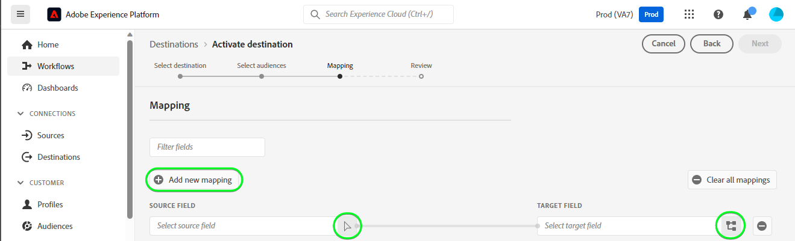

# [!DNL HubSpot] 连接

[[!DNL HubSpot]](https://www.hubspot.com) 是一个CRM平台，它提供了连接营销、销售、内容管理和客户服务所需的所有软件、集成和资源。 它允许您在一个CRM平台上连接数据、团队和客户。

此 [!DNL Adobe Experience Platform] [目标](/help/destinations/home.md) 利用 [[!DNL HubSpot] 联系人API](https://developers.hubspot.com/docs/api/crm/contacts)，以更新中的联系人 [!DNL HubSpot] 从现有Experience Platform受众进行激活。

向您的验证的说明 [!DNL HubSpot] 实例位于 [向目标进行身份验证](#authenticate) 部分。

## 用例 {#use-cases}

为了帮助您更好地了解您应该如何以及何时使用 [!DNL HubSpot] 目标，以下是Adobe Experience Platform客户可以使用此目标解决的示例用例。

[!DNL HubSpot] 联系人存储有关与您的业务互动的个人的信息。 您的团队使用中存在的联系人 [!DNL HubSpot] 以构建Experience Platform受众。 将这些受众发送至 [!DNL HubSpot]，将会更新其信息，并且会为每个联系人分配一个属性，其值作为指示联系人属于哪个受众的受众名称。

## 先决条件 {#prerequisites}

请参阅以下部分，以了解需要在Experience Platform中设置的任何先决条件， [!DNL HubSpot] ，以了解在使用之前必须收集的信息 [!DNL HubSpot] 目标。

### Experience Platform先决条件 {#prerequisites-in-experience-platform}

将数据激活到之前 [!DNL HubSpot] 目标，您必须拥有 [架构](/help/xdm/schema/composition.md)， a [数据集](https://experienceleague.adobe.com/docs/platform-learn/tutorials/data-ingestion/create-datasets-and-ingest-data.html?lang=en)、和 [受众](https://experienceleague.adobe.com/docs/platform-learn/tutorials/audiences/create-audiences.html?lang=en) 创建于 [!DNL Experience Platform].

请参阅Experience Platform文档 [受众成员资格详细信息架构字段组](/help/xdm/field-groups/profile/segmentation.md) 如果您需要有关受众状态的指南。

### 的先决条件 [!DNL HubSpot] 目标 {#prerequisites-destination}

请注意以下先决条件，以便将数据从Platform导出到 [!DNL HubSpot] 帐户：

#### 您必须拥有 [!DNL HubSpot] 帐户 {#prerequisites-account}

为了将数据从Platform导出到 [!DNL Hubspot] 您需要拥有 [!DNL HubSpot] 帐户。 如果您还没有这样的网站，请访问 [设置您的HubSpot帐户](https://knowledge.hubspot.com/get-started/set-up-your-account) 并遵循相关指南注册和创建您的帐户。

#### 收集 [!DNL HubSpot] 专用应用程序访问令牌 {#gather-credentials}

您需要您的 [!DNL HubSpot] `Access token` 以允许 [!DNL HubSpot] 通过进行API调用的目标 [!DNL HubSpot] 您的中的私有应用程序 [!DNL HubSpot] 帐户。 此 `Access token` 将用作 `Bearer token` 当您 [验证目标](#authenticate).

如果您没有专用应用程序，请按照文档操作 [在中创建专用应用程序 [!DNL HubSpot]](https://developers.hubspot.com/docs/api/private-apps).

>[!IMPORTANT]
>
> 应为专用应用程序分配以下范围：
> `crm.objects.contacts.write`， `crm.objects.contacts.read`
> `crm.schemas.contacts.write`, `crm.schemas.contacts.read`

| 凭据 | 描述 | 示例 |
| --- | --- | --- |
| `Bearer token` | 此 `Access token` 的 [!DNL HubSpot] 专用应用程序。  获取 [!DNL HubSpot] `Access token` 请遵循 [!DNL HubSpot] 文档目标 [使用应用程序的访问令牌进行API调用](https://developers.hubspot.com/docs/api/private-apps#make-api-calls-with-your-app-s-access-token). | `pat-na1-11223344-abcde-12345-9876-1234a1b23456` |

## 护栏 {#guardrails}

[!DNL HubSpot] 专用应用程序受 [速率限制](https://developers.hubspot.com/docs/api/usage-details). 您的专用应用程序可拨打的次数取决于您的 [!DNL HubSpot] 帐户订阅以及您是否购买了API加载项。 此外，另请参阅 [其他限制](https://developers.hubspot.com/docs/api/usage-details#other-limits).

## 支持的身份 {#supported-identities}

[!DNL HubSpot] 支持更新下表中描述的标识。 了解有关 [身份](/help/identity-service/namespaces.md).

| 目标身份 | 示例 | 描述 | 注意事项 |
|---|---|---|---|
| `email` | `test@test.com` | 联系人的电子邮件地址。 | 必需 |

## 支持的受众 {#supported-audiences}

此部分介绍可导出到此目标的所有受众。

此目标支持激活通过Experience Platform生成的所有受众 [分段服务](../../../segmentation/home.md).

此目标还支持激活下表所述的受众。

| 受众类型 | 描述 |
---------|----------|
| 自定义上传 | 受众 [已导入](../../../segmentation/ui/overview.md#import-audience) 从CSV文件Experience Platform到。 |

{style="table-layout:auto"}

## 导出类型和频率 {#export-type-frequency}

有关目标导出类型和频率的信息，请参阅下表。

| 项目 | 类型 | 注释 |
---------|----------|---------|
| 导出类型 | **[!UICONTROL 基于配置文件]** | <ul><li>您正在导出受众的所有成员以及所需的架构字段 *（例如：电子邮件地址、电话号码、姓氏）*，根据您的字段映射。</li><li> 此外，还会在中创建一个新资产 [!DNL HubSpot] 使用受众名称，且其值与Platform中每个选定受众对应的受众状态一致。</li></ul> |
| 导出频率 | **[!UICONTROL 流]** | <ul><li>流目标为基于API的“始终运行”连接。 一旦根据受众评估在Experience Platform中更新了用户档案，连接器就会将更新发送到下游目标平台。 详细了解 [流目标](/help/destinations/destination-types.md#streaming-destinations).</li></ul> |

{style="table-layout:auto"}

## 连接到目标 {#connect}

>[!IMPORTANT]
>
>要连接到目标，您需要 **[!UICONTROL 管理目标]** [访问控制权限](/help/access-control/home.md#permissions). 阅读 [访问控制概述](/help/access-control/ui/overview.md) 或与产品管理员联系以获取所需的权限。

要连接到此目标，请按照 [目标配置教程](../../ui/connect-destination.md). 在配置目标工作流中，填写下面两个部分中列出的字段。

范围 **[!UICONTROL 目标]** > **[!UICONTROL 目录]** 搜索 [!DNL HubSpot]. 或者，您可以将其定位到 **[!UICONTROL CRM]** 类别。

### 向目标进行身份验证 {#authenticate}

填写下面的必填字段。 请参阅 [收集 [!DNL HubSpot] 专用应用程序访问令牌](#gather-credentials) 部分获取任何指导。
* **[!UICONTROL 持有者令牌]**：您的访问令牌 [!DNL HubSpot] 专用应用程序。

要验证目标，请选择 **[!UICONTROL 连接到目标]**.

如果提供的详细信息有效，UI将显示 **[!UICONTROL 已连接]** 带有绿色复选标记的状态。 然后，您可以继续执行下一步。

### 填写目标详细信息 {#destination-details}

要配置目标的详细信息，请填写下面的必需和可选字段。 UI中字段旁边的星号表示该字段为必填字段。

* **[!UICONTROL 名称]**：将来用于识别此目标的名称。
* **[!UICONTROL 描述]**：可帮助您将来识别此目标的描述。

### 启用警报 {#enable-alerts}

您可以启用警报，以接收有关发送到目标的数据流状态的通知。 从列表中选择警报以订阅接收有关数据流状态的通知。 有关警报的详细信息，请参阅以下内容中的指南： [使用UI订阅目标警报](../../ui/alerts.md).

完成提供目标连接的详细信息后，选择 **[!UICONTROL 下一个]**.

## 将受众激活到此目标 {#activate}

>[!IMPORTANT]
>
>要激活数据，您需要 **[!UICONTROL 管理目标]**， **[!UICONTROL 激活目标]**， **[!UICONTROL 查看配置文件]**、和 **[!UICONTROL 查看区段]** [访问控制权限](/help/access-control/home.md#permissions). 阅读 [访问控制概述](/help/access-control/ui/overview.md) 或与产品管理员联系以获取所需的权限。

读取 [将用户档案和受众激活到流式受众导出目标](/help/destinations/ui/activate-segment-streaming-destinations.md) 有关将受众激活到此目标的说明。

### 映射属性和身份 {#map}

要正确地将受众数据从Adobe Experience Platform发送到 [!DNL HubSpot] 目标，您必须完成字段映射步骤。 映射包括在您的Platform帐户中的Experience Data Model (XDM)架构字段与其在目标目标中的相应等效字段之间创建链接。

要将XDM字段正确映射到 [!DNL HubSpot] 目标字段，请执行以下步骤：

#### 映射 `Email` 身份

此 `Email` 标识是此目标的强制映射。 请按照以下步骤对其进行映射：
1. 在 **[!UICONTROL 映射]** 步骤，选择 **[!UICONTROL 添加新映射]**. 您现在可以在屏幕上看到新的映射行。
   
1. 在 **[!UICONTROL 选择源字段]** 窗口中，选择 **[!UICONTROL 选择身份命名空间]** 并选择身份。
   
1. 在 **[!UICONTROL 选择目标字段]** 窗口中，选择 **[!UICONTROL 选择属性]** 并选择 `email`.
   

| 源字段 | 目标字段 | 必需 |
| --- | --- | --- |
| `IdentityMap: Email` | `Identity: email` | 是 |

下面显示了具有标识映射的示例：

#### 映射 **可选** 属性

要添加任何其他要在XDM配置文件架构与 [!DNL HubSpot] 帐户重复以下步骤：
1. 在 **[!UICONTROL 映射]** 步骤，选择 **[!UICONTROL 添加新映射]**. 您现在可以在屏幕上看到新的映射行。
   
1. 在 **[!UICONTROL 选择源字段]** 窗口中，选择 **[!UICONTROL 选择属性]** 类别并选择XDM属性。
   
1. 在 **[!UICONTROL 选择目标字段]** 窗口，选择 **[!UICONTROL 选择属性]** 类别并从将自动填充的属性列表中进行选择 [!DNL HubSpot] 帐户。 目标使用 [[!DNL HubSpot] 属性](https://developers.hubspot.com/docs/api/crm/properties) 用于检索此信息的API。 两者 [!DNL HubSpot] [默认属性](https://knowledge.hubspot.com/contacts/hubspots-default-contact-properties) 和任何自定义属性都将检索以供选择作为目标字段。
   

XDM配置文件架构和之间的几个可用映射 [!DNL Hubspot] 如下所示：

| 源字段 | 目标字段 |
| --- | --- |
| `xdm: person.name.firstName` | `Attribute: firstname` |
| `xdm: person.name.lastName` | `Attribute: lastname` |
| `xdm: workAddress.street1` | `Attribute: address` |
| `xdm: workAddress.city` | `Attribute: city` |
| `xdm: workAddress.country` | `Attribute: country` |

以下显示了使用这些属性映射的示例：

完成提供目标连接的映射后，选择 **[!UICONTROL 下一个]**.

## 验证数据导出 {#exported-data}

要验证您是否正确设置了目标，请执行以下步骤：

1. 登录到 [!DNL HubSpot] 网站，然后导航到 **[!UICONTROL 联系人]** 页面检查受众状态。 此列表可以配置为显示使用受众名称创建的自定义属性的列，其值是受众状态。
   

1. 或者，您可以深入到个人 **[!UICONTROL 人员]** 页面，然后导航到显示受众名称和受众状态的属性。
   

## 数据使用和治理 {#data-usage-governance}

全部 [!DNL Adobe Experience Platform] 目标在处理您的数据时符合数据使用策略。 有关如何执行操作的详细信息 [!DNL Adobe Experience Platform] 强制执行数据管理，请参见 [数据管理概述](/help/data-governance/home.md).

## 其他资源 {#additional-resources}

其他有用信息来自 [!DNL HubSpot] 文档如下所示：
* [HubSpot上的身份验证方法](https://developers.hubspot.com/docs/api/intro-to-auth)
* [!DNL HubSpot] 的API参考 [联系人](https://developers.hubspot.com/docs/api/crm/contacts) 和 [属性](https://developers.hubspot.com/docs/api/crm/properties) API。

### Changelog

此部分捕获此目标连接器的功能和重要文档更新。

+++ 查看更改日志

| 发行月份 | 更新类型 | 描述 |
|---|---|---|
| 2023 年 9 月 | 初始版本 | 初始目标版本和文档发布。 |

{style="table-layout:auto"}

+++
