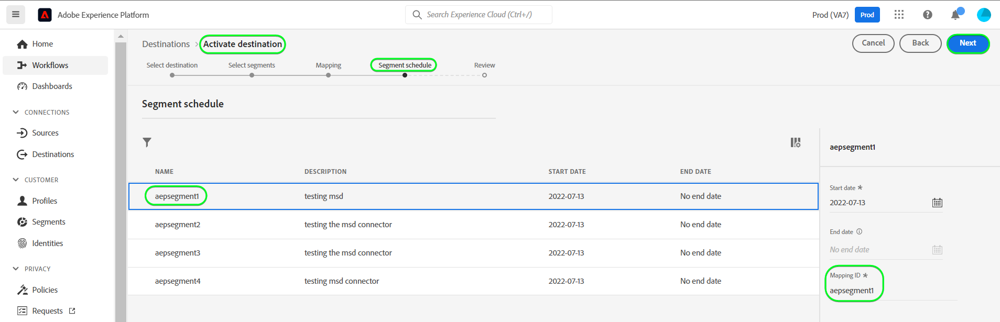

# [!DNL Microsoft Dynamics 365]连接

## 概述 {#overview}

[[!DNL Microsoft Dynamics 365]](https://dynamics.microsoft.com/en-us/)是一个基于云的业务应用程序平台，它将企业资源规划(ERP)和客户关系管理(CRM)与生产力应用程序和AI工具相结合，以实现端到端更顺畅、更可控的运营、更好的增长潜力和更低的成本。

此[!DNL Adobe Experience Platform] [目标](/help/destinations/home.md)利用[[!DNL Contact Entity Reference API]](https://docs.microsoft.com/en-us/dynamics365/customerengagement/on-premises/developer/entities/contact?view=op-9-1)，可让您将受众中的标识更新为[!DNL Dynamics 365]。

[!DNL Dynamics 365]使用具有授权授权的OAuth 2作为身份验证机制与[!DNL Contact Entity Reference API]通信。 下面的[!DNL Dynamics 365]向目标身份验证[部分中进一步提供了向您的](#authenticate)实例进行身份验证的说明。

## 用例 {#use-cases}

作为营销人员，您可以根据用户的Adobe Experience Platform配置文件中的属性，为其提供个性化体验。 您可以从离线数据构建受众并将这些受众发送到[!DNL Dynamics 365]，以便在Adobe Experience Platform中更新受众和配置文件后立即显示在用户的馈送中。

## 先决条件 {#prerequisites}

### Experience Platform先决条件 {#prerequisites-in-experience-platform}

在将数据激活到[!DNL Dynamics 365]目标之前，您必须在[中创建一个](/help/xdm/schema/composition.md)架构[、](https://experienceleague.adobe.com/docs/platform-learn/tutorials/data-ingestion/create-datasets-and-ingest-data.html?lang=zh-Hans)数据集[和](https://experienceleague.adobe.com/docs/platform-learn/tutorials/audiences/create-audiences.html?lang=zh-Hans)受众[!DNL Experience Platform]。

如果您需要有关受众状态的指导，请参阅Adobe有关[受众成员资格详细信息架构字段组](/help/xdm/field-groups/profile/segmentation.md)的文档。

### [!DNL Microsoft Dynamics 365]先决条件 {#prerequisites-destination}

请注意[!DNL Dynamics 365]中的以下先决条件，以便将数据从Experience Platform导出到您的[!DNL Dynamics 365]帐户：

#### 您需要拥有[!DNL Microsoft Dynamics 365]帐户 {#prerequisites-account}

转到[!DNL Dynamics 365] [试用版](https://dynamics.microsoft.com/en-us/dynamics-365-free-trial/)页面以注册并创建帐户（如果尚未注册）。

#### 在[!DNL Dynamics 365]中创建字段 {#prerequisites-custom-field}

创建字段数据类型为`Simple`且类型为`Single Line of Text`的自定义字段，Experience Platform将使用该字段更新[!DNL Dynamics 365]中的受众状态。

如果需要其他指导，请参阅[!DNL Dynamics 365] [创建或编辑字段（属性）](https://docs.microsoft.com/en-us/dynamics365/customerengagement/on-premises/customize/create-edit-fields?view=op-9-1)文档。

记下您在&#x200B;**[!UICONTROL Customization prefix]**&#x200B;中创建的自定义字段的[!DNL Dynamics 365]。 在[填写目标详细信息](#destination-details)步骤中，您将需要此前缀。 有关更多详细信息，请参阅[文档的](https://learn.microsoft.com/en-us/dynamics365/customerengagement/on-premises/customize/create-edit-fields?view=op-9-1#create-and-edit-fields)创建和编辑字段[!DNL Dynamics 365]部分。

[!DNL Dynamics 365]中的示例设置如下所示：

#### 在Azure Active Directory中注册应用程序和应用程序用户 {#prerequisites-app-user}

要使[!DNL Dynamics 365]能够访问资源，您需要使用[!DNL Azure Account]登录到[[!DNL Azure Active Directory]](https://docs.microsoft.com/en-us/azure/active-directory/develop/howto-create-service-principal-portal#register-an-application-with-azure-ad-and-create-a-service-principal)并创建以下内容：

* [!DNL Azure Active Directory]应用程序
* 服务主体
* 应用程序密码

您还需要在[中](https://docs.microsoft.com/en-us/power-platform/admin/manage-application-users#create-an-application-user)创建应用程序用户[!DNL Azure Active Directory]，并将其与新创建的应用程序关联。

#### 收集[!DNL Dynamics 365]凭据 {#gather-credentials}

在对[!DNL Dynamics 365] CRM目标进行身份验证之前，请记下以下各项：

| 凭据 | 描述 | 示例 |
| --- | --- | --- |
| `Client ID` | [!DNL Dynamics 365]应用程序的[!DNL Azure Active Directory]客户端ID。 有关指导，请参阅[[!DNL Dynamics 365] 文档](https://docs.microsoft.com/en-us/azure/active-directory/develop/howto-create-service-principal-portal#get-tenant-and-app-id-values-for-signing-in)。 | `ababbaba-abab-baba-acac-acacacacacac` |
| `Client Secret` | [!DNL Dynamics 365]应用程序的[!DNL Azure Active Directory]客户端密钥。 您将在[[!DNL Dynamics 365] 文档](https://docs.microsoft.com/en-us/azure/active-directory/develop/howto-create-service-principal-portal#authentication-two-options)中使用选项#2。 | `abcde~abcdefghijklmnopqrstuvwxyz12345678`作为指导。 |
| `Tenant ID` | [!DNL Dynamics 365]应用程序的[!DNL Azure Active Directory]租户ID。 有关指导，请参阅[[!DNL Dynamics 365] 文档](https://docs.microsoft.com/en-us/azure/active-directory/develop/howto-create-service-principal-portal#get-tenant-and-app-id-values-for-signing-in)。 | `1234567-aaaa-12ab-ba21-1234567890` |
| `Region` | 与环境URL关联的Microsoft区域。 请参阅[[!DNL Dynamics 365] 文档](https://learn.microsoft.com/en-us/power-platform/admin/new-datacenter-regions)以获取指导。 | 如果您的域如下所示，则在对[目标](#authenticate). 进行身份验证时，需要在下拉选择器中为CRM字段提供高亮显示的值 *组织57771b33。`crm`.dynamics.com* &#x200B;例如：如果您的公司是在北美(NAM)地区配置的，则您的URL将是`crm.dynamics.com`，您需要选择`crm`。 如果您的公司是在加拿大(CAN)地区配置的，则您的URL将为`crm3.dynamics.com`，您需要选择`crm3`。 |
| `Environment URL` | 有关指导，请参阅[[!DNL Dynamics 365] 文档](https://docs.microsoft.com/en-us/dynamics365/customerengagement/on-premises/developer/org-service/discover-url-organization-organization-service?view=op-9-1)。 | 如果您的[!DNL Dynamics 365]域如下所示，则需要高亮显示的值。  *`org57771b33`.crm.dynamics.com* |

{style="table-layout:auto"}

## 护栏 {#guardrails}

[请求限制和分配](https://docs.microsoft.com/en-us/power-platform/admin/api-request-limits-allocations)页面详细介绍了与您的[!DNL Dynamics 365]许可证关联的[!DNL Dynamics 365] API限制。 您需要确保数据和有效负载均在这些限制之内。

## 支持的身份 {#supported-identities}

[!DNL Dynamics 365]支持更新下表中描述的标识。 了解有关[标识](/help/identity-service/features/namespaces.md)的更多信息。

| 目标身份 | 示例 | 描述 | 注意事项 |
|---|---|---|---|
| `contactid` | 7eb682f1-ca75-e511-80d4-00155d2a68d1 | 联系人的唯一标识符。 | **必需**。 有关详细信息，请参阅[[!DNL Dynamics 365] 文档](https://docs.microsoft.com/en-us/dynamics365/customerengagement/on-premises/developer/entities/contact?view=op-9-1)。 |

{style="table-layout:auto"}

## 支持的受众 {#supported-audiences}

此部分介绍可导出到此目标的所有受众。

此目标支持激活通过Experience Platform [分段服务](../../../segmentation/home.md)生成的所有受众。

## 导出类型和频率 {#export-type-frequency}

有关目标导出类型和频率的信息，请参阅下表。

| 项目 | 类型 | 注释 |
|---------|----------|---------|
| 导出类型 | **[!UICONTROL Profile-based]** | <ul><li>您正在导出受众的所有成员，以及所需的架构字段&#x200B;*（例如：电子邮件地址、电话号码、姓氏）*（根据字段映射）。</li><li> 根据[!DNL Dynamics 365]受众计划&#x200B;**[!UICONTROL Mapping ID]**&#x200B;步骤期间提供的[值，](#schedule-audience-export-example)中的每个受众状态都会根据Experience Platform中的相应受众状态进行更新。</li></ul> |
| 导出频率 | **[!UICONTROL Streaming]** | <ul><li>流目标为基于API的“始终运行”连接。 根据受众评估在Experience Platform中更新用户档案后，连接器会立即将更新发送到下游目标平台。 阅读有关[流式目标](/help/destinations/destination-types.md#streaming-destinations)的更多信息。</li></ul> |

{style="table-layout:auto"}

## 连接到目标 {#connect}

>[!IMPORTANT]
>
>若要连接到目标，您需要&#x200B;**[!UICONTROL View Destinations]**&#x200B;和&#x200B;**[!UICONTROL Manage Destinations]** [访问控制权限](/help/access-control/home.md#permissions)。 阅读[访问控制概述](/help/access-control/ui/overview.md)或联系您的产品管理员以获取所需的权限。

要连接到此目标，请按照[目标配置教程](../../ui/connect-destination.md)中描述的步骤操作。 在配置目标工作流中，填写下面两个部分中列出的字段。

在&#x200B;**[!UICONTROL Destinations]** > **[!UICONTROL Catalog]**&#x200B;内，搜索[!DNL Dynamics 365]。 或者，您可以在&#x200B;**[!UICONTROL CRM]**&#x200B;类别下找到它。

### 验证目标 {#authenticate}

要验证目标，请选择&#x200B;**[!UICONTROL Connect to destination]**。

填写下面的必填字段。 有关任何指导，请参阅[收集Dynamics 365凭据](#gather-credentials)部分。

* **[!UICONTROL Client ID]**： [!DNL Dynamics 365]应用程序的[!DNL Azure Active Directory]客户端ID。
* **[!UICONTROL Tenant ID]**： [!DNL Dynamics 365]应用程序的[!DNL Azure Active Directory]租户ID。
* **[!UICONTROL Client Secret]**： [!DNL Dynamics 365]应用程序的[!DNL Azure Active Directory]客户端密钥。
* **[!UICONTROL Region]**：您的[[!DNL Dynamics 365]](https://learn.microsoft.com/en-us/power-platform/admin/new-datacenter-regions)地区。 例如：如果您的公司是在北美(NAM)地区配置的，则您的URL将是`crm.dynamics.com`，您需要选择`crm`。 如果您的公司是在加拿大(CAN)地区配置的，则您的URL将为`crm3.dynamics.com`，您需要选择`crm3`。
* **[!UICONTROL Environment URL]**：您的[!DNL Dynamics 365]环境URL。

如果提供的详细信息有效，则UI会显示&#x200B;**[!UICONTROL Connected]**&#x200B;状态并显示绿色复选标记。 然后，您可以继续执行下一步。

### 填写目标详细信息 {#destination-details}

要配置目标的详细信息，请填写下面的必需和可选字段。 UI中字段旁边的星号表示该字段为必填字段。

* **[!UICONTROL Name]**：将来用于识别此目标的名称。
* **[!UICONTROL Description]**：可帮助您将来识别此目标的描述。
* **[!UICONTROL Customization Prefix]**：您在`Customization prefix`中创建的自定义字段的[!DNL Dynamics 365]。 有关更多详细信息，请参阅[文档的](https://learn.microsoft.com/en-us/dynamics365/customerengagement/on-premises/customize/create-edit-fields?view=op-9-1#create-and-edit-fields)创建和编辑字段[!DNL Dynamics 365]部分。

### 启用警报 {#enable-alerts}

您可以启用警报，以接收有关发送到目标的数据流状态的通知。 从列表中选择警报以订阅接收有关数据流状态的通知。 有关警报的详细信息，请参阅[使用UI订阅目标警报的指南](../../ui/alerts.md)。

完成提供目标连接的详细信息后，选择&#x200B;**[!UICONTROL Next]**。

## 激活此目标的受众 {#activate}

>[!IMPORTANT]
> 
>* 若要激活数据，您需要&#x200B;**[!UICONTROL View Destinations]**、**[!UICONTROL Activate Destinations]**、**[!UICONTROL View Profiles]**&#x200B;和&#x200B;**[!UICONTROL View Segments]** [访问控制权限](/help/access-control/home.md#permissions)。 阅读[访问控制概述](/help/access-control/ui/overview.md)或联系您的产品管理员以获取所需的权限。
>* 要导出&#x200B;*标识*，您需要&#x200B;**[!UICONTROL View Identity Graph]** [访问控制权限](/help/access-control/home.md#permissions)。  {width="100" zoomable="yes"}

有关将受众激活到此目标的说明，请阅读[将配置文件和受众激活到流式受众导出目标](/help/destinations/ui/activate-segment-streaming-destinations.md)。

### 映射注意事项和示例 {#mapping-considerations-example}

要将受众数据从Adobe Experience Platform正确发送到[!DNL Dynamics 365]目标，您需要完成字段映射步骤。 映射包括在Experience Platform帐户中的Experience Data Model (XDM)架构字段与其与目标中的相应等效字段之间创建链接。 要将XDM字段正确映射到[!DNL Dynamics 365]目标字段，请执行以下步骤：

1. 在&#x200B;**[!UICONTROL Mapping]**&#x200B;步骤中，选择&#x200B;**[!UICONTROL Add new mapping]**。 您将在屏幕上看到一个新映射行。
   

1. 在&#x200B;**[!UICONTROL Select source field]**&#x200B;窗口中，选择&#x200B;**[!UICONTROL Select identity namespace]**&#x200B;类别并选择`contactid`。
   

1. 在&#x200B;**[!UICONTROL Select target field]**&#x200B;窗口中，选择要将源字段映射到的目标字段类型。
   * **[!UICONTROL Select identity namespace]**：选择此选项可从列表中将源字段映射到标识命名空间。
     

   * 在XDM配置文件架构和[!DNL Dynamics 365]实例之间添加以下映射：

     | XDM配置文件架构 | [!DNL Dynamics 365]实例 | 必需 |
     |---|---|---|
     | `contactid` | `contactid` | 是 |

   * **[!UICONTROL Select custom attributes]**：选择此选项以将源字段映射到您在&#x200B;**[!UICONTROL Attribute name]**&#x200B;字段中定义的自定义属性。 请参阅[[!DNL Dynamics 365] 文档](https://docs.microsoft.com/en-us/dynamics365/customerengagement/on-premises/developer/entities/contact?view=op-9-1#entity-properties)，获取受支持属性的完整列表。
     

     >[!IMPORTANT]
     >
     > * 目标字段名称应在`lowercase`中。
     > * 此外，如果您具有映射到[!DNL Dynamics 365] [日期或时间戳](https://docs.microsoft.com/en-us/power-apps/developer/data-platform/webapi/reference/timestampdatemapping?view=dataverse-latest)目标字段的日期或时间戳源字段，请确保映射的值不为空。 如果导出的字段值为空，您将遇到&#x200B;*`Bad request reported while pushing events to the destination. Please contact the administrator and try again.`*&#x200B;错误消息，并且不会更新数据。 这是[!DNL Dynamics 365]限制。

   * 例如，根据要更新的值，在XDM配置文件架构和[!DNL Dynamics 365]实例之间添加以下映射：

     | XDM配置文件架构 | [!DNL Dynamics 365]实例 |
     |---|---|
     | `person.name.firstName` | `firstname` |
     | `person.name.lastName` | `lastname` |
     | `personalEmail.address` | `emailaddress1` |

   * 下面显示了使用这些映射的示例：

   

### 计划受众导出和示例 {#schedule-audience-export-example}

在激活工作流的[[!UICONTROL Schedule audience export]](/help/destinations/ui/activate-segment-streaming-destinations.md#scheduling)步骤中，必须手动将Experience Platform受众映射到[!DNL Dynamics 365]中的自定义字段属性。

为此，请选择每个受众，然后在[!DNL Dynamics 365]字段中输入来自&#x200B;**[!UICONTROL Mapping ID]**&#x200B;的相应自定义字段属性。

>[!IMPORTANT]
>
>用于&#x200B;**[!UICONTROL Mapping ID]**&#x200B;的值应该与[!DNL Dynamics 365]内创建的自定义字段属性的名称完全匹配。 如果您需要有关查找自定义字段属性的指导，请参阅[[!DNL Dynamics 365] 文档](https://docs.microsoft.com/en-us/dynamics365/customerengagement/on-premises/customize/create-edit-fields?view=op-9-1)。

下面显示了一个示例：

## 验证数据导出 {#exported-data}

要验证您是否正确设置了目标，请执行以下步骤：

1. 选择&#x200B;**[!UICONTROL Destinations]** > **[!UICONTROL Browse]**&#x200B;以导航到目标列表。
   

1. 选择目标并验证状态为&#x200B;**[!UICONTROL enabled]**。
   

1. 切换到&#x200B;**[!DNL Activation data]**&#x200B;选项卡，然后选择受众名称。
   

1. 监控受众摘要，并确保用户档案计数对应于在受众中创建的计数。
   

1. 登录到[!DNL Dynamics 365]网站，然后导航到[!DNL Customers] > [!DNL Contacts]页面，并检查是否已添加受众中的配置文件。 您可以看到，根据[!DNL Dynamics 365]受众计划&#x200B;**[!UICONTROL Mapping ID]**&#x200B;步骤期间提供的[值，](#schedule-audience-export-example)中的每个受众状态都更新为Experience Platform中的相应受众状态。
   

## 数据使用和治理 {#data-usage-governance}

在处理您的数据时，所有[!DNL Adobe Experience Platform]目标都符合数据使用策略。 有关[!DNL Adobe Experience Platform]如何实施数据治理的详细信息，请参阅[数据治理概述](/help/data-governance/home.md)。

## 错误和故障排除 {#errors-and-troubleshooting}

### 将事件推送到目标时报告了未知错误 {#unknown-errors}

检查数据流运行时，如果收到以下错误消息： `Bad request reported while pushing events to the destination. Please contact the administrator and try again.`

要修复此错误，请验证您在&#x200B;**[!UICONTROL Mapping ID]**&#x200B;中为Experience Platform受众提供的[!DNL Dynamics 365]是否有效以及是否在[!DNL Dynamics 365]中存在。

## 其他资源 {#additional-resources}

[[!DNL Dynamics 365] 文档](https://docs.microsoft.com/en-us/dynamics365/)中的其他有用信息如下：

* [IOrganizationService.Update(Entity)方法](https://docs.microsoft.com/en-us/dotnet/api/microsoft.xrm.sdk.iorganizationservice.update?view=dataverse-sdk-latest)
* [使用Web API更新和删除表行](https://docs.microsoft.com/en-us/power-apps/developer/data-platform/webapi/update-delete-entities-using-web-api#basic-update)

### Changelog

此部分捕获此目标连接器的功能和重要文档更新。

+++ 查看更改日志

| 发行月份 | 更新类型 | 描述 |
|---|---|---|
| 2023 年 10 月 | 文档更新 | 更新了指南，以指明在[映射注意事项和示例](#mapping-considerations-example)步骤中，所有目标属性名称都应小写。 |
| 2023 年 8 月 | 功能和文档更新 | 为自定义字段添加了[!DNL Dynamics 365]自定义字段前缀支持，这些前缀未在[!DNL Dynamics 365]的默认解决方案中创建。 已在&#x200B;**[!UICONTROL Customization Prefix]**&#x200B;填写目标详细信息[步骤中添加了新输入字段](#destination-details)。 (PLATIR-31602)。 |
| 2022年11月 | 初始版本 | 初始目标版本和文档发布。 |

{style="table-layout:auto"}

+++
