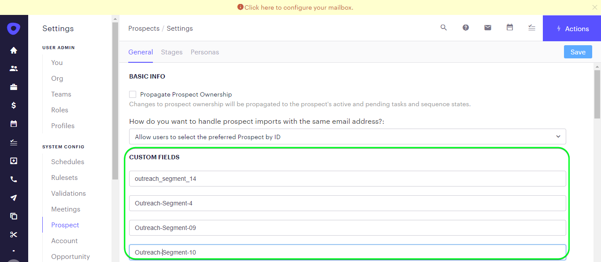

# [!DNL Outreach]连接

## 概述 {#overview}

[[!DNL Outreach]](https://www.outreach.io/)是一个销售执行平台，拥有世界上最丰富的B2B买方与卖方交互数据，并在专有人工智能技术方面投入了大量资金，以将销售数据转换为智能。 [!DNL Outreach]帮助企业自动执行销售活动并根据收入情报采取行动，以提高其效率、可预测性和增长。

此[!DNL Adobe Experience Platform] [目标](/help/destinations/home.md)利用[外联更新资源API](https://api.outreach.io/api/v2/docs#update-an-existing-resource)，允许您更新与[!DNL Outreach]中潜在客户对应的受众中的身份。

[!DNL Outreach]使用具有授权授权的OAuth 2作为身份验证机制与[!DNL Outreach] [!DNL Update Resource API]通信。 下面在[!DNL Outreach]向目标身份验证[部分中进一步提供了向您的](#authenticate)实例进行身份验证的说明。

## 用例 {#use-cases}

作为营销人员，您可以根据潜在客户的Adobe Experience Platform配置文件中的属性，为其提供个性化体验。 您可以从离线数据构建受众并将这些受众发送到[!DNL Outreach]，以便在Adobe Experience Platform中更新受众和配置文件后立即显示在潜在客户的信息源中。

## 先决条件 {#prerequisites}

### Experience Platform先决条件 {#prerequisites-in-experience-platform}

在将数据激活到[!DNL Outreach]目标之前，您必须在[中创建一个](/help/xdm/schema/composition.md)架构[、](https://experienceleague.adobe.com/docs/platform-learn/tutorials/data-ingestion/create-datasets-and-ingest-data.html)数据集[和](https://experienceleague.adobe.com/docs/platform-learn/tutorials/segments/create-segments.html)区段[!DNL Experience Platform]。

如果您需要有关受众状态的指导，请参阅Adobe有关[受众成员资格详细信息架构字段组](/help/xdm/field-groups/profile/segmentation.md)的文档。

### 外展先决条件 {#prerequisites-destination}

请注意[!DNL Outreach]中的以下先决条件，以便将数据从Experience Platform导出到您的[!DNL Outreach]帐户：

#### 您需要具有外联帐户 {#prerequisites-account}

转到[!DNL Outreach] [登录](https://accounts.outreach.io/users/sign_in)页面以注册并创建帐户（如果尚未注册）。 有关详细信息，另请参阅[!DNL Outreach]支持[页面](https://support.outreach.io/hc/en-us/articles/207238607-Claim-Your-Outreach-Account)。

在对[!DNL Outreach] CRM目标进行身份验证之前，请记下以下各项：

| 凭据 | 描述 |
|---|---|
| 电子邮件 | 您的[!DNL Outreach]帐户电子邮件 |
| 密码 | 您的[!DNL Outreach]帐户密码 |

#### 设置自定义字段标签 {#prerequisites-custom-fields}

[!DNL Outreach]支持[潜在客户](https://support.outreach.io/hc/en-us/articles/360001557554-Outreach-Prospect-Profile-Overview)的自定义字段。 有关其他指导，请参阅[如何在外联](https://support.outreach.io/hc/en-us/articles/219124908-How-To-Add-a-Custom-Field-in-Outreach)中添加自定义字段。 为了便于识别，建议手动将标签更新为其相应的受众名称，而不是保留默认值。 例如，如下所示：

潜在客户的[!DNL Outreach]设置页面显示自定义字段。

潜在客户的[!DNL Outreach]设置页面显示具有&#x200B;*用户友好*标签且与受众名称匹配的自定义字段。 您可以在潜在客户页面上根据这些标签查看受众状态。

>[!NOTE]
>
> 标签名称仅便于识别。 更新潜在客户时不会使用它们。

## 护栏

[!DNL Outreach] API具有每个用户每小时10,000个请求的速率限制。 如果达到此限制，您将收到包含以下消息的`429`响应： `You have exceeded your permitted rate limit of 10,000; please try again at 2017-01-01T00:00:00.`。

如果您收到此消息，则必须更新受众导出计划以符合速率阈值。

有关其他详细信息，请参阅[[!DNL Outreach] 文档](https://api.outreach.io/api/v2/docs#rate-limiting)。

## 支持的身份 {#supported-identities}

[!DNL Outreach]支持更新下表中描述的标识。 了解有关[标识](/help/identity-service/features/namespaces.md)的更多信息。

| 目标身份 | 描述 | 注意事项 |
|---|---|---|
| `OutreachId` | <ul><li>[!DNL Outreach]标识符。 这是对应于目标客户配置文件的数值。</li><li>ID必须与要更新的目标客户在[!DNL Outreach] URL中的ID匹配。</li><li>有关详细信息，请参阅[[!DNL Outreach] 文档](https://api.outreach.io/api/v2/docs#update-an-existing-resource)。</li></ul> | 必需 |

## 导出类型和频率 {#export-type-frequency}

有关目标导出类型和频率的信息，请参阅下表。

| 项目 | 类型 | 注释 |
|---------|----------|---------|
| 导出类型 | **[!UICONTROL Profile-based]** | <ul><li> 您正在根据字段映射导出区段的所有成员，以及所需的架构字段&#x200B;*（例如：电子邮件地址、电话号码、姓氏）*。</li><li> 根据[!DNL Outreach]受众计划[!UICONTROL Mapping ID]步骤期间提供的[值，](#schedule-segment-export-example)中的每个区段状态都会从Experience Platform更新为相应的受众状态。</li></ul> |
| 导出频率 | **[!UICONTROL Streaming]** | <ul><li> 流目标为基于API的“始终运行”连接。 根据受众评估在Experience Platform中更新用户档案后，连接器会立即将更新发送到下游目标平台。 阅读有关[流式目标](/help/destinations/destination-types.md#streaming-destinations)的更多信息。</li></ul> |

{style="table-layout:auto"}

## 连接到目标 {#connect}

>[!IMPORTANT]
> 
> 若要连接到目标，您需要&#x200B;**[!UICONTROL Manage Destinations]** [访问控制权限](/help/access-control/home.md#permissions)。 阅读[访问控制概述](/help/access-control/ui/overview.md)或联系您的产品管理员以获取所需的权限。

要连接到此目标，请按照[目标配置教程](../../ui/connect-destination.md)中描述的步骤操作。 在配置目标工作流中，填写下面两个部分中列出的字段。

在&#x200B;**[!UICONTROL Destinations]** > **[!UICONTROL Catalog]**&#x200B;内，搜索[!DNL Outreach]。 或者，您可以在CRM类别下找到它。

### 验证目标 {#authenticate}

要验证目标，请选择&#x200B;**[!UICONTROL Connect to destination]**。

您将会看到[!DNL Outreach]登录页面。 提供您的电子邮件。

接下来，提供您的密码。

* **[!UICONTROL Username]**：您的[!DNL Outreach]帐户电子邮件。
* **[!UICONTROL Password]**：您的[!DNL Outreach]帐户密码。

如果提供的详细信息有效，则UI会显示&#x200B;**已连接**&#x200B;状态，并带有绿色复选标记。 然后，您可以继续执行下一步。

### 填写目标详细信息 {#destination-details}

要配置目标的详细信息，请填写下面的必需和可选字段。 UI中字段旁边的星号表示该字段为必填字段。

* **[!UICONTROL Name]**：将来用于识别此目标的名称。
* **[!UICONTROL Description]**：可帮助您将来识别此目标的描述。

### 启用警报 {#enable-alerts}

您可以启用警报，以接收有关发送到目标的数据流状态的通知。 从列表中选择警报以订阅接收有关数据流状态的通知。 有关警报的详细信息，请参阅[使用UI订阅目标警报的指南](../../ui/alerts.md)。

完成提供目标连接的详细信息后，选择&#x200B;**[!UICONTROL Next]**。

## 激活此目标的受众 {#activate}

>[!IMPORTANT]
> 
>* 若要激活数据，您需要&#x200B;**[!UICONTROL View Destinations]**、**[!UICONTROL Activate Destinations]**、**[!UICONTROL View Profiles]**&#x200B;和&#x200B;**[!UICONTROL View Segments]** [访问控制权限](/help/access-control/home.md#permissions)。 阅读[访问控制概述](/help/access-control/ui/overview.md)或联系您的产品管理员以获取所需的权限。
>* 要导出&#x200B;*标识*，您需要&#x200B;**[!UICONTROL View Identity Graph]** [访问控制权限](/help/access-control/home.md#permissions)。  {width="100" zoomable="yes"}

有关将受众激活到此目标的说明，请阅读[将配置文件和受众激活到流式受众导出目标](../../ui/activate-segment-streaming-destinations.md)。

### 映射注意事项和示例 {#mapping-considerations-example}

要将受众数据从Adobe Experience Platform正确发送到[!DNL Outreach]目标，您需要完成字段映射步骤。 映射包括在Experience Platform帐户中的Experience Data Model (XDM)架构字段与其与目标中的相应等效字段之间创建链接。 要将XDM字段正确映射到[!DNL Outreach]目标字段，请执行以下步骤：

1. 在[!UICONTROL Mapping]步骤中，单击&#x200B;**[!UICONTROL Add new mapping]**。 您将在屏幕上看到一个新映射行。
   

1. 在[!UICONTROL Select source field]窗口中，选择&#x200B;**[!UICONTROL Select identity namespace]**类别并添加所需的映射。
   

1. 在[!UICONTROL Select target field]窗口中，选择要将源字段映射到的目标字段类型。
   * **[!UICONTROL Select identity namespace]**：选择此选项可从列表中将源字段映射到标识命名空间。
     

   * 在XDM配置文件架构和[!DNL Outreach]实例之间添加以下映射：

     | XDM配置文件架构 | [!DNL Outreach]实例 | 必需 |
     |---|---|---|
     | `Oid` | `OutreachId` | 是 |

   * **[!UICONTROL Select custom attributes]**：选择此选项以将源字段映射到您在[!UICONTROL Attribute name]字段中定义的自定义属性。 有关支持的属性的完整列表，请参阅[[!DNL Outreach] 潜在客户文档](https://api.outreach.io/api/v2/docs#prospect)。
     

   * 例如，根据要更新的值，在XDM配置文件架构和[!DNL Outreach]实例之间添加以下映射：

     | XDM配置文件架构 | [!DNL Outreach]实例 |
     |---|---|
     | `person.name.firstName` | `firstName` |
     | `person.name.lastName` | `lastName` |

   * 下面显示了使用这些映射的示例：
     

### 计划受众导出和示例 {#schedule-segment-export-example}

* 执行[计划受众导出](../../ui/activate-segment-streaming-destinations.md)步骤时，必须手动将Experience Platform受众映射到[!DNL Outreach]中的自定义字段属性。

* 为此，请选择每个区段，然后输入与&#x200B;*字段中`N`的*&#x200B;自定义字段[!DNL Outreach]标签&#x200B;**[!UICONTROL Mapping ID]**&#x200B;字段对应的数值。

  >[!IMPORTANT]
  >
  > * 在&#x200B;*内使用的数值`N`(*)[!UICONTROL Mapping ID]应该与[!DNL Outreach]内以数值为后缀的自定义属性键匹配。 示例： *自定义字段`N`标签*。
  > * 您只需指定数值，而无需指定整个自定义字段标签。
  > * [!DNL Outreach]支持最多150个自定义标签字段。
  > * 有关详细信息，请参阅[[!DNL Outreach] 潜在客户文档](https://api.outreach.io/api/v2/docs#prospect)。

   * 例如：

     | [!DNL Outreach]字段 | Experience Platform映射ID |
     |---|---|
     | 自定义字段`4`标签 | `4` |

     

## 验证数据导出 {#exported-data}

要验证您是否正确设置了目标，请执行以下步骤：

1. 选择&#x200B;**[!UICONTROL Destinations]** > **[!UICONTROL Browse]**以导航到目标列表。
   

1. 选择目标并验证状态为&#x200B;**[!UICONTROL enabled]**。
   

1. 切换到&#x200B;**[!DNL Activation data]**选项卡，然后选择受众名称。
   

1. 监控受众摘要，并确保用户档案计数对应于在区段内创建的计数。
   

1. 登录到[!DNL Outreach]网站，然后导航到[!DNL Apps] > [!DNL Contacts]页面，并检查是否已添加受众中的配置文件。 您可以看到，根据[!DNL Outreach]受众计划[!UICONTROL Mapping ID]步骤期间提供的[值，](#schedule-segment-export-example)中的每个受众状态都更新为Experience Platform中的相应受众状态。

## 数据使用和治理 {#data-usage-governance}

在处理您的数据时，所有[!DNL Adobe Experience Platform]目标都符合数据使用策略。 有关[!DNL Adobe Experience Platform]如何实施数据治理的详细信息，请参阅[数据治理概述](/help/data-governance/home.md)。

## 错误和故障排除 {#errors-and-troubleshooting}

检查数据流运行时，您可能会看到以下错误消息： `Bad request reported while pushing events to the destination. Please contact the administrator and try again.`

要修复此错误，请确认您在Experience Platform中为[!UICONTROL Mapping ID]受众提供的[!DNL Outreach]有效且存在于[!DNL Outreach]中。

## 其他资源 {#additional-resources}

[[!DNL Outreach] 文档](https://api.outreach.io/api/v2/docs/)包含有关[错误响应](https://api.outreach.io/api/v2/docs#error-responses)的详细信息，可用于调试任何问题。
