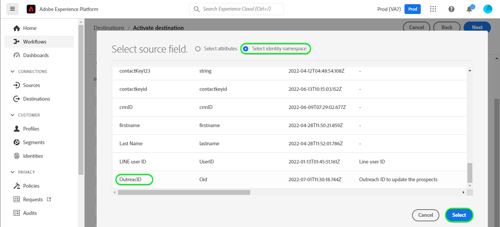
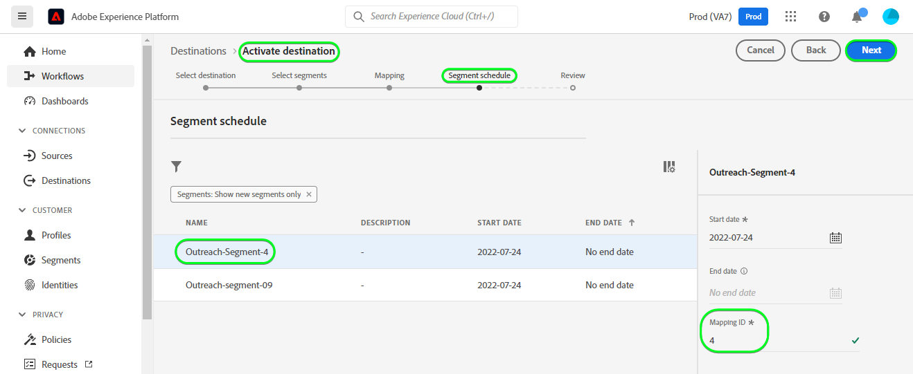
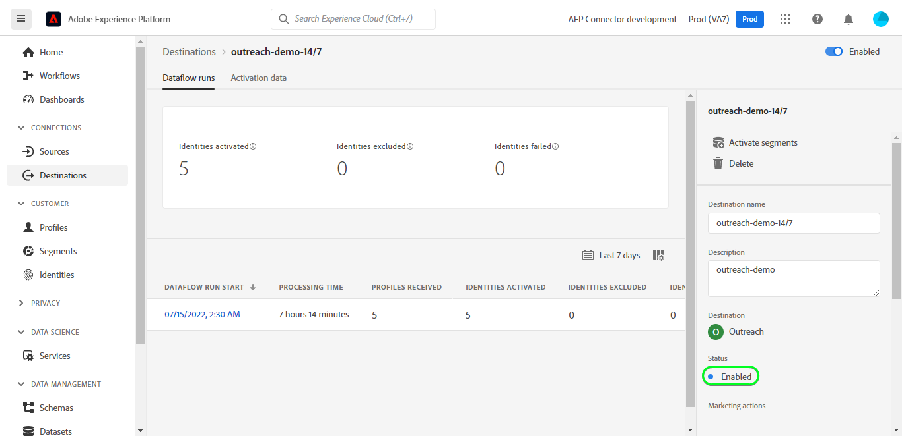

# [!DNL Outreach] 连接

## 概述 {#overview}

[[!DNL Outreach]](https://www.outreach.io/) 是一个销售执行平台，具有世界上B2B买方 — 卖方交互数据最多，并且对专有AI技术进行了大量投资，以便将销售数据转换为智能。 [!DNL Outreach] 帮助组织自动化销售参与并根据收入情报采取行动，以提高其效率、可预测性和增长。

此 [!DNL Adobe Experience Platform] [目标](/help/destinations/home.md) 利用 [外联更新资源API](https://api.outreach.io/api/v2/docs#update-an-existing-resource)，用于更新区段中与 [!DNL Outreach].

[!DNL Outreach] 使用具有授权授权的OAuth 2作为验证机制与 [!DNL Outreach] [!DNL Update Resource API]. 验证的说明 [!DNL Outreach] 实例的后面，在 [对目标进行身份验证](#authenticate) 中。

## 用例 {#use-cases}

作为营销人员，您可以根据潜在客户的Adobe Experience Platform用户档案的属性，向其提供个性化体验。 您可以根据离线数据构建区段，并将这些区段发送到 [!DNL Outreach]，以便在Adobe Experience Platform中更新区段和用户档案后，立即在潜在客户动态消息中显示。

## 先决条件 {#prerequisites}

### Experience Platform先决条件 {#prerequisites-in-experience-platform}

在将数据激活到 [!DNL Outreach] 目标，您必须具有 [模式](/help/xdm/schema/composition.md), a [数据集](https://experienceleague.adobe.com/docs/platform-learn/tutorials/data-ingestion/create-datasets-and-ingest-data.html?lang=en)和 [区段](https://experienceleague.adobe.com/docs/platform-learn/tutorials/segments/create-segments.html?lang=en) 创建于 [!DNL Experience Platform].

有关信息，请参阅Adobe的文档 [区段成员资格详细信息架构字段组](/help/xdm/field-groups/profile/segmentation.md) 如果您需要有关区段状态的指导，请执行以下操作：

### 外联先决条件 {#prerequisites-destination}

请注意 [!DNL Outreach]，以便将数据从Platform导出到 [!DNL Outreach] 帐户：

#### 您需要拥有外联帐户 {#prerequisites-account}

转到 [!DNL Outreach] [登录](https://accounts.outreach.io/users/sign_in) 页面以注册和创建帐户（如果尚未注册）。 另请参阅 [!DNL Outreach] 支持 [页面](https://support.outreach.io/hc/en-us/articles/207238607-Claim-Your-Outreach-Account) 以了解更多详细信息。

在验证到 [!DNL Outreach] CRM目标：

| 凭据 | 描述 |
|---|---|
| 电子邮件 | 您的 [!DNL Outreach] 帐户电子邮件 |
| 密码 | 您的 [!DNL Outreach] 帐户密码 |

#### 设置自定义字段标签 {#prerequisites-custom-fields}

[!DNL Outreach] 支持自定义字段 [前景](https://support.outreach.io/hc/en-us/articles/360001557554-Outreach-Prospect-Profile-Overview). 请参阅 [如何在外联中添加自定义字段](https://support.outreach.io/hc/en-us/articles/219124908-How-To-Add-a-Custom-Field-in-Outreach) 以获取其他指导。 为便于识别，建议手动将标签更新为其相应的区段名称，而不是保留默认值。 例如：

[!DNL Outreach] 显示自定义字段的潜在客户的设置页面。

[!DNL Outreach] “设置”页面显示自定义字段，其中包含 *用户友好* 与区段名称匹配的标签。 您可以根据这些标签在潜在客户页面上查看区段状态。

>[!NOTE]
>
> 标签名称仅供识别。 在更新潜在客户时，不会使用这些值。

## 护栏

的 [!DNL Outreach] API的速率限制为每用户每小时10,000个请求。 如果达到此限制，您将收到 `429` 响应消息如下： `You have exceeded your permitted rate limit of 10,000; please try again at 2017-01-01T00:00:00.`.

如果收到此消息，则必须更新区段导出计划以符合速率阈值。

请参阅 [[!DNL Outreach] 文档](https://api.outreach.io/api/v2/docs#rate-limiting) 以了解更多详细信息。

## 支持的身份 {#supported-identities}

[!DNL Outreach] 支持更新下表所述的身份。 详细了解 [标识](/help/identity-service/namespaces.md).

| Target标识 | 描述 | 注意事项 |
|---|---|---|
| `OutreachId` | <ul><li>[!DNL Outreach] 标识符。 这是与潜在客户配置文件对应的数值。</li><li>该ID必须与 [!DNL Outreach] 要更新的潜在客户的URL。</li><li>请参阅 [[!DNL Outreach] 文档](https://api.outreach.io/api/v2/docs#update-an-existing-resource) 以了解更多详细信息。</li></ul> | 必需 |

## 导出类型和频度 {#export-type-frequency}

有关目标导出类型和频率的信息，请参阅下表。

| 项目 | 类型 | 注释 |
---------|----------|---------|
| 导出类型 | **[!UICONTROL 基于用户档案]** | <ul><li> 您正在导出区段的所有成员，以及所需的架构字段 *(例如：电子邮件地址、电话号码、姓氏)*，则会根据字段映射。</li><li> 每个区段状态位于 [!DNL Outreach] 会根据 [!UICONTROL 映射ID] 值 [区段计划](#schedule-segment-export-example) 中。</li></ul> |
| 导出频度 | **[!UICONTROL 流]** | <ul><li> 流目标“始终运行”基于API的连接。 在基于区段评估的Experience Platform中更新用户档案后，连接器会立即将更新发送到目标平台下游。 有关更多信息 [流目标](/help/destinations/destination-types.md#streaming-destinations).</li></ul> |

{style=&quot;table-layout:auto&quot;}

## 连接到目标 {#connect}

>[!IMPORTANT]
> 
> 要连接到目标，您需要 **[!UICONTROL 管理目标]** [访问控制权限](/help/access-control/home.md#permissions). 阅读 [访问控制概述](/help/access-control/ui/overview.md) 或联系您的产品管理员以获取所需的权限。

要连接到此目标，请按照 [目标配置教程](../../ui/connect-destination.md). 在配置目标工作流中，填写下面两节中列出的字段。

在 **[!UICONTROL 目标]** > **[!UICONTROL 目录]** 搜索 [!DNL Outreach]. 或者，您也可以在CRM类别下找到它。

### 对目标进行身份验证 {#authenticate}

要对目标进行身份验证，请选择 **[!UICONTROL 连接到目标]**.

您将看到 [!DNL Outreach] 登录页面。 提供您的电子邮件。

接下来提供您的密码。

* **[!UICONTROL 用户名]**:您的 [!DNL Outreach] 帐户电子邮件。
* **[!UICONTROL 密码]**:您的 [!DNL Outreach] 帐户密码。

如果提供的详细信息有效，UI会显示 **已连接** 状态为绿色复选标记。 然后，您可以继续执行下一步。

### 填写目标详细信息 {#destination-details}

要配置目标的详细信息，请填写以下必填和可选字段。 UI中字段旁边的星号表示该字段为必填字段。

* **[!UICONTROL 名称]**:将来用于识别此目标的名称。
* **[!UICONTROL 描述]**:此描述将帮助您在将来确定此目标。

### 启用警报 {#enable-alerts}

您可以启用警报以接收有关目标数据流状态的通知。 从列表中选择警报以订阅接收有关数据流状态的通知。 有关警报的更多信息，请参阅 [使用UI订阅目标警报](../../ui/alerts.md).

完成提供目标连接的详细信息后，请选择 **[!UICONTROL 下一个]**.

## 将区段激活到此目标 {#activate}

>[!IMPORTANT]
> 
> 要激活数据，您需要 **[!UICONTROL 管理目标]**, **[!UICONTROL 激活目标]**, **[!UICONTROL 查看配置文件]**&#x200B;和 **[!UICONTROL 查看区段]** [访问控制权限](/help/access-control/home.md#permissions). 阅读 [访问控制概述](/help/access-control/ui/overview.md) 或联系您的产品管理员以获取所需的权限。

读取 [激活用户档案和区段以流式传输区段导出目标](../../ui/activate-segment-streaming-destinations.md) 有关将受众区段激活到此目标的说明。

### 映射注意事项和示例 {#mapping-considerations-example}

要将受众数据从Adobe Experience Platform正确发送到 [!DNL Outreach] 目标，您需要完成字段映射步骤。 映射包括在Platform帐户中的体验数据模型(XDM)架构字段与目标目标中相应的对等字段之间创建一个链接。 要将XDM字段正确映射到 [!DNL Outreach] 目标字段，请执行以下步骤：

1. 在 [!UICONTROL 映射] 步骤，单击 **[!UICONTROL 添加新映射]**. 您将在屏幕上看到一个新的映射行。
   

1. 在 [!UICONTROL 选择源字段] 窗口，选择 **[!UICONTROL 选择身份命名空间]** 类别，并添加所需的映射。
   

1. 在 [!UICONTROL 选择目标字段] 窗口，选择要将源字段映射到的目标字段类型。
   * **[!UICONTROL 选择身份命名空间]**:选择此选项可将源字段从列表中映射到标识命名空间。
      

   * 在XDM配置文件架构和 [!DNL Outreach] 实例： |XDM配置文件架构|[!DNL Outreach] Instance|必填| |—|—|—| |`Oid`|`OutreachId`|是 |

   * **[!UICONTROL 选择自定义属性]**:选择此选项可将源字段映射到您在中定义的自定义属性 [!UICONTROL 属性名称] 字段。 请参阅 [[!DNL Outreach] 潜在客户文档](https://api.outreach.io/api/v2/docs#prospect) ，以获取受支持属性的完整列表。
      

   * 例如，根据要更新的值，在XDM配置文件架构和 [!DNL Outreach] 实例： |XDM配置文件架构|[!DNL Outreach] 实例| |—|—| |`person.name.firstName`|`firstName`| |`person.name.lastName`|`lastName`|

   * 使用这些映射的示例如下所示：
      

### 计划区段导出和示例 {#schedule-segment-export-example}

* 执行 [计划区段导出](../../ui/activate-segment-streaming-destinations.md) 步骤您必须在 [!DNL Outreach].

* 为此，请选择每个区段，然后输入与 *自定义字段 `N` 标签* 字段 [!DNL Outreach] 在 **[!UICONTROL 映射ID]** 字段。

   >[!IMPORTANT]
   >
   > * 数值 *(`N`)* 在 [!UICONTROL 映射ID] 应匹配自定义属性键，后缀为 [!DNL Outreach]. 示例： *自定义字段 `N` 标签*.
   > * 您只需指定数值，而不需要指定整个自定义字段标签。
   > * [!DNL Outreach] 最多支持150个自定义标签字段。
   > * 请参阅 [[!DNL Outreach] 潜在客户文档](https://api.outreach.io/api/v2/docs#prospect) 以了解详细信息。

   * 例如：

      | [!DNL Outreach] 字段 | 平台映射ID |
      |---|---|
      | 自定义字段 `4` 标签 | `4` |

      

## 验证数据导出 {#exported-data}

要验证您是否已正确设置目标，请执行以下步骤：

1. 选择 **[!UICONTROL 目标]** > **[!UICONTROL 浏览]** 导航到目标列表。
   

1. 选择目标并验证状态是否为 **[!UICONTROL 已启用]**.
   

1. 切换到 **[!DNL Activation data]** ，然后选择区段名称。
   

1. 监控区段摘要，并确保配置文件计数与区段内创建的计数相对应。
   

1. 登录到 [!DNL Outreach] 网站，然后导航到 [!DNL Apps] > [!DNL Contacts] 页面，并检查是否已添加区段中的用户档案。 您可以在 [!DNL Outreach] 更新时，会根据 [!UICONTROL 映射ID] 值 [区段计划](#schedule-segment-export-example) 中。

## 数据使用和管理 {#data-usage-governance}

全部 [!DNL Adobe Experience Platform] 目标在处理数据时与数据使用策略相兼容。 有关如何 [!DNL Adobe Experience Platform] 实施数据管理，请查看 [数据管理概述](/help/data-governance/home.md).

## 错误和疑难解答 {#errors-and-troubleshooting}

检查数据流运行时，您可能会看到以下错误消息： `Bad request reported while pushing events to the destination. Please contact the administrator and try again.`

要修复此错误，请验证 [!UICONTROL 映射ID] 您在平台中为 [!DNL Outreach] 区段有效，且存在于 [!DNL Outreach].

## 其他资源 {#additional-resources}

的 [[!DNL Outreach] 文档](https://api.outreach.io/api/v2/docs/) 具有 [错误响应](https://api.outreach.io/api/v2/docs#error-responses) 可用于调试任何问题。
